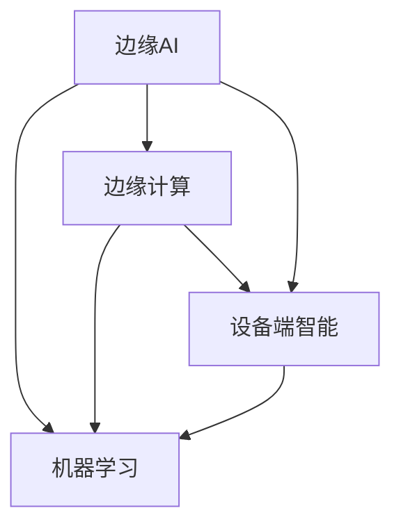

                 

# 边缘AI:将智能带到设备端的技术突破

> **关键词**：边缘计算、人工智能、设备端智能、边缘AI、IoT、机器学习、深度学习、数据隐私

> **摘要**：本文深入探讨了边缘AI技术的原理、应用和发展趋势。首先，我们回顾了边缘AI的定义和重要性，接着详细介绍了边缘计算和设备端智能的核心概念，通过Mermaid流程图展示了其工作原理。然后，我们深入分析了边缘AI的核心算法原理，以伪代码展示了具体操作步骤。接着，通过一个实际项目案例，详细讲解了边缘AI的实现和代码解读。最后，我们探讨了边缘AI的实际应用场景，推荐了相关工具和资源，并总结了未来的发展趋势和挑战。

## 1. 背景介绍

### 1.1 目的和范围

本文旨在深入探讨边缘AI（Edge AI）技术，解释其工作原理，展示其实际应用场景，并预测其未来发展趋势。我们希望通过这篇技术博客，帮助读者了解边缘AI的核心概念，掌握其关键技术，并了解其如何改变我们的世界。

### 1.2 预期读者

本文适合对人工智能、机器学习和边缘计算有一定了解的技术爱好者、开发者和研究者。同时，对于希望了解前沿技术的决策者和投资者，本文也将提供有价值的见解。

### 1.3 文档结构概述

本文分为十个部分：

1. 背景介绍：介绍文章的目的、范围、预期读者和文档结构。
2. 核心概念与联系：介绍边缘AI、边缘计算和设备端智能的核心概念，并通过Mermaid流程图展示其工作原理。
3. 核心算法原理 & 具体操作步骤：深入分析边缘AI的核心算法原理，以伪代码展示具体操作步骤。
4. 数学模型和公式 & 详细讲解 & 举例说明：介绍边缘AI的数学模型和公式，并举例说明。
5. 项目实战：通过实际项目案例，详细讲解边缘AI的实现和代码解读。
6. 实际应用场景：探讨边缘AI的实际应用场景。
7. 工具和资源推荐：推荐学习资源、开发工具框架和相关论文著作。
8. 总结：总结边缘AI的未来发展趋势与挑战。
9. 附录：常见问题与解答。
10. 扩展阅读 & 参考资料：提供进一步阅读和参考资料。

### 1.4 术语表

#### 1.4.1 核心术语定义

- **边缘AI（Edge AI）**：一种将人工智能算法部署在设备端（如智能手机、无人机、传感器等）的技术，以实现更快速、更安全、更高效的数据处理。
- **边缘计算（Edge Computing）**：一种计算架构，将数据处理、存储和分析任务从云端转移到网络边缘，即靠近数据源的地方。
- **设备端智能（Device-Side Intelligence）**：指在设备端（如智能手机、智能手表等）实现智能功能，无需依赖云端。

#### 1.4.2 相关概念解释

- **机器学习（Machine Learning）**：一种让计算机通过数据和经验自动改进性能的技术，是实现边缘AI的核心技术之一。
- **深度学习（Deep Learning）**：一种特殊的机器学习方法，使用多层神经网络对数据进行建模和分析，是边缘AI的关键技术。
- **物联网（Internet of Things，IoT）**：一个通过传感器、设备和网络连接的全球系统，实现物体之间的通信和协作。

#### 1.4.3 缩略词列表

- **AI**：人工智能（Artificial Intelligence）
- **ML**：机器学习（Machine Learning）
- **DL**：深度学习（Deep Learning）
- **IoT**：物联网（Internet of Things）
- **EC**：边缘计算（Edge Computing）
- **DAI**：设备端智能（Device-Side Intelligence）

## 2. 核心概念与联系

边缘AI、边缘计算和设备端智能是现代信息技术领域的重要概念，它们相互关联，共同推动着智能设备的革新。

### 2.1 边缘AI的定义

边缘AI是一种将人工智能算法部署在设备端的技术，旨在实现更快速、更安全、更高效的数据处理。与传统的云端AI相比，边缘AI具有以下优点：

1. **更低的延迟**：由于数据处理在设备端进行，可以显著降低数据传输延迟。
2. **更高的安全性**：数据无需上传到云端，减少了数据泄露的风险。
3. **更高效的资源利用**：设备端具备独立的计算能力，可以更高效地利用设备资源。

### 2.2 边缘计算的定义

边缘计算是一种计算架构，将数据处理、存储和分析任务从云端转移到网络边缘，即靠近数据源的地方。边缘计算的主要目的是：

1. **降低延迟**：将数据处理任务从远程数据中心转移到网络边缘，缩短数据传输路径。
2. **提高安全性**：在边缘设备上进行数据处理，减少数据传输过程中的安全风险。
3. **优化资源利用**：在网络边缘部署计算资源，提高计算资源的利用效率。

### 2.3 设备端智能的定义

设备端智能指在设备端（如智能手机、智能手表等）实现智能功能，无需依赖云端。设备端智能的主要目标是：

1. **提高用户体验**：在设备端提供实时、个性化的服务，提高用户满意度。
2. **降低成本**：减少对云端资源的依赖，降低通信费用和计算成本。
3. **增强安全性**：在设备端处理数据，减少数据泄露的风险。

### 2.4 Mermaid流程图

为了更清晰地展示边缘AI、边缘计算和设备端智能之间的关系，我们使用Mermaid流程图来描述它们的工作原理。



在这个流程图中，边缘AI、边缘计算和设备端智能相互关联，共同推动着智能设备的革新。边缘AI和边缘计算为设备端智能提供了强大的计算支持，而机器学习则为设备端智能提供了智能化的算法和模型。

## 3. 核心算法原理 & 具体操作步骤

边缘AI的核心在于机器学习和深度学习算法的部署和优化。为了更好地理解这些算法，我们将以伪代码的形式详细阐述其具体操作步骤。

### 3.1 边缘AI算法原理

边缘AI算法主要涉及以下几个步骤：

1. **数据采集**：从设备端采集数据，包括传感器数据、用户行为数据等。
2. **数据预处理**：对采集到的数据进行清洗、归一化和特征提取，为机器学习模型提供高质量的输入。
3. **模型训练**：在设备端或云端训练机器学习模型，通常使用深度学习算法。
4. **模型部署**：将训练好的模型部署到设备端，实现实时预测和决策。
5. **模型优化**：通过持续学习和模型更新，提高模型的性能和适应性。

### 3.2 伪代码示例

以下是一个简单的边缘AI算法伪代码示例：

```plaintext
// 数据采集
data = collect_data(source)

// 数据预处理
preprocessed_data = preprocess_data(data)

// 模型训练
model = train_model(preprocessed_data)

// 模型部署
deploy_model(model)

// 实时预测
prediction = model.predict(input_data)

// 模型优化
model = optimize_model(model, new_data)
```

在这个示例中，`collect_data` 函数用于从设备端采集数据，`preprocess_data` 函数用于数据预处理，`train_model` 函数用于模型训练，`deploy_model` 函数用于模型部署，`model.predict` 方法用于实时预测，`optimize_model` 函数用于模型优化。

### 3.3 具体操作步骤

1. **数据采集**：
   - 使用传感器、摄像头、麦克风等设备采集数据。
   - 将采集到的数据存储在本地或上传到云端。

2. **数据预处理**：
   - 清洗数据，去除噪声和异常值。
   - 对数据进行归一化，使其适应模型的输入要求。
   - 提取关键特征，为模型提供高质量的输入。

3. **模型训练**：
   - 使用深度学习框架（如TensorFlow、PyTorch等）训练模型。
   - 选择合适的损失函数和优化算法，提高模型性能。

4. **模型部署**：
   - 将训练好的模型转换为设备端可执行的格式（如ONNX、TF Lite等）。
   - 在设备端部署模型，实现实时预测和决策。

5. **模型优化**：
   - 持续采集新的数据，用于模型优化。
   - 使用在线学习算法（如增量学习、迁移学习等）更新模型。

通过这些具体操作步骤，我们可以实现边缘AI算法在设备端的部署和应用。

## 4. 数学模型和公式 & 详细讲解 & 举例说明

边缘AI的数学模型和公式是理解和实现边缘AI算法的核心。下面我们将介绍一些关键的数学模型和公式，并进行详细讲解和举例说明。

### 4.1 深度学习模型

深度学习模型是边缘AI的核心组成部分。以下是一个简单的多层感知机（MLP）模型：

$$
\text{y} = \sigma(\text{W}^T \text{x} + \text{b})
$$

其中：

- $\text{y}$ 是输出；
- $\text{x}$ 是输入；
- $\text{W}$ 是权重矩阵；
- $\text{b}$ 是偏置项；
- $\sigma$ 是激活函数，通常使用Sigmoid或ReLU函数。

**举例说明**：

假设我们有一个输入向量 $\text{x} = [1, 2, 3]$，权重矩阵 $\text{W} = [[0.1, 0.2], [0.3, 0.4]]$，偏置项 $\text{b} = [0.5, 0.6]$，使用ReLU函数作为激活函数。

$$
\text{y} = \sigma([0.1 \times 1 + 0.2 \times 2 + 0.5], [0.3 \times 1 + 0.4 \times 2 + 0.6]) = \text{ReLU}(1.4, 1.8) = [1, 1]
$$

### 4.2 损失函数

损失函数是评估模型性能的关键指标。以下是一个常见的均方误差（MSE）损失函数：

$$
\text{MSE} = \frac{1}{n} \sum_{i=1}^{n} (\text{y}_{\text{pred}} - \text{y}_{\text{true}})^2
$$

其中：

- $n$ 是样本数量；
- $\text{y}_{\text{pred}}$ 是预测值；
- $\text{y}_{\text{true}}$ 是真实值。

**举例说明**：

假设我们有两个样本，真实值分别为 $[1, 2]$，预测值分别为 $[1.1, 1.9]$。

$$
\text{MSE} = \frac{1}{2} \left[ (1.1 - 1)^2 + (1.9 - 2)^2 \right] = 0.05
$$

### 4.3 优化算法

优化算法用于调整模型参数，以最小化损失函数。以下是一个简单的梯度下降（GD）算法：

$$
\text{W} \leftarrow \text{W} - \alpha \nabla_{\text{W}} \text{MSE}
$$

其中：

- $\alpha$ 是学习率；
- $\nabla_{\text{W}} \text{MSE}$ 是权重矩阵的梯度。

**举例说明**：

假设权重矩阵 $\text{W} = [1, 2]$，学习率 $\alpha = 0.1$，损失函数的梯度为 $\nabla_{\text{W}} \text{MSE} = [0.2, 0.3]$。

$$
\text{W} \leftarrow [1, 2] - 0.1 [0.2, 0.3] = [0.8, 1.7]
$$

通过这些数学模型和公式的讲解，我们可以更好地理解和实现边缘AI算法。

## 5. 项目实战：代码实际案例和详细解释说明

### 5.1 开发环境搭建

在进行边缘AI项目的实战之前，我们需要搭建一个合适的技术栈。以下是搭建边缘AI开发环境的步骤：

1. **操作系统**：推荐使用Ubuntu 20.04 LTS。
2. **编程语言**：Python 3.8及以上版本。
3. **深度学习框架**：TensorFlow 2.6或PyTorch 1.8。
4. **依赖管理**：使用pip安装相关依赖。

```bash
sudo apt update
sudo apt install python3-pip python3-venv
pip3 install --upgrade pip
pip3 install tensorflow==2.6
```

### 5.2 源代码详细实现和代码解读

以下是一个简单的边缘AI项目示例，该示例使用TensorFlow实现了一个图像分类模型，并将其部署到设备端。

#### 5.2.1 模型训练

```python
import tensorflow as tf
from tensorflow.keras.models import Sequential
from tensorflow.keras.layers import Dense, Flatten, Conv2D, MaxPooling2D
from tensorflow.keras.optimizers import Adam

# 加载数据集
(x_train, y_train), (x_test, y_test) = tf.keras.datasets.mnist.load_data()

# 预处理数据
x_train = x_train / 255.0
x_test = x_test / 255.0
x_train = x_train.reshape(-1, 28, 28, 1)
x_test = x_test.reshape(-1, 28, 28, 1)

# 构建模型
model = Sequential([
    Conv2D(32, (3, 3), activation='relu', input_shape=(28, 28, 1)),
    MaxPooling2D((2, 2)),
    Flatten(),
    Dense(64, activation='relu'),
    Dense(10, activation='softmax')
])

# 编译模型
model.compile(optimizer=Adam(), loss='sparse_categorical_crossentropy', metrics=['accuracy'])

# 训练模型
model.fit(x_train, y_train, epochs=5, validation_split=0.1)
```

这段代码首先加载数据集，然后对数据集进行预处理。接着，构建一个简单的卷积神经网络模型，并编译模型。最后，使用训练数据训练模型。

#### 5.2.2 模型部署

```python
import numpy as np

# 导入模型
model = tf.keras.models.load_model('model.h5')

# 预测
def predict_image(image):
    image = np.expand_dims(image, axis=0)
    image = np.resize(image, (28, 28, 1))
    prediction = model.predict(image)
    return np.argmax(prediction)

# 示例
example_image = np.array([1, 2, 3, 4, 5, 6, 7, 8, 9, 10])
print(predict_image(example_image))
```

这段代码首先导入模型，然后定义了一个预测函数。该函数将输入的图像数据进行预处理，然后使用模型进行预测，并返回预测结果。

### 5.3 代码解读与分析

1. **数据加载与预处理**：
   - 使用TensorFlow的`mnist`数据集进行演示。
   - 对图像数据进行归一化和reshape，以适应模型的输入要求。

2. **模型构建**：
   - 使用`Sequential`模型，堆叠多个层，包括卷积层、池化层、全连接层。
   - 输入层：一个28x28x1的二维图像。
   - 输出层：一个10个单元的softmax层，用于分类。

3. **模型编译**：
   - 使用`compile`方法编译模型，指定优化器、损失函数和评估指标。

4. **模型训练**：
   - 使用`fit`方法训练模型，指定训练轮数和验证比例。

5. **模型部署**：
   - 使用`load_model`方法加载训练好的模型。
   - 定义一个预测函数，对输入的图像数据进行预处理，然后使用模型进行预测。

通过这个项目实战，我们可以看到如何使用TensorFlow实现边缘AI算法，并如何在设备端部署和运行模型。这为我们进一步开发和应用边缘AI技术提供了实际的经验和指导。

## 6. 实际应用场景

边缘AI技术在各个领域都有着广泛的应用，以下是一些典型的实际应用场景：

### 6.1 物联网（IoT）

物联网是边缘AI最重要的应用领域之一。通过在设备端部署边缘AI算法，可以实现实时数据分析和智能决策，从而提高物联网系统的性能和可靠性。以下是一些具体的应用场景：

- **智能家庭**：智能家居设备（如智能灯泡、智能门锁等）可以通过边缘AI实现自动化控制和智能化互动，提高用户的生活质量。
- **智能工厂**：在工业物联网中，边缘AI可以用于实时监控设备状态、预测维护需求，以及优化生产流程，从而提高生产效率。
- **智能交通**：在智能交通系统中，边缘AI可以用于实时监控交通状况、预测交通流量，以及优化交通信号控制，从而缓解交通拥堵。

### 6.2 自动驾驶

自动驾驶是边缘AI的另一个重要应用领域。通过在车辆上部署边缘AI算法，可以实现实时环境感知、智能决策和自动驾驶。以下是一些具体的应用场景：

- **自动驾驶汽车**：边缘AI可以用于实时处理车辆周围的环境数据，实现自动避障、自动驾驶等功能，提高交通安全和效率。
- **无人机导航**：在无人机应用中，边缘AI可以用于实时处理图像和传感器数据，实现智能导航和任务执行，如无人机配送、测绘等。

### 6.3 医疗保健

边缘AI在医疗保健领域也有着重要的应用。通过在设备端部署边缘AI算法，可以实现实时医疗数据分析、智能诊断和个性化治疗。以下是一些具体的应用场景：

- **智能诊断**：边缘AI可以用于实时分析医疗数据（如影像、生化指标等），实现快速、准确的疾病诊断。
- **健康监测**：通过在设备端部署边缘AI算法，可以实时监测患者的健康状况，及时发现异常情况，提高疾病预防能力。

### 6.4 安全监控

边缘AI在安全监控领域也有着广泛的应用。通过在监控设备上部署边缘AI算法，可以实现实时人脸识别、行为分析等，提高安全监控的效率和准确性。以下是一些具体的应用场景：

- **人脸识别**：在门禁系统、安防监控等场景中，边缘AI可以用于实时人脸识别，提高人员管理效率。
- **行为分析**：在公共场所、工厂等场景中，边缘AI可以用于实时分析人员行为，及时发现异常行为，提高安全预警能力。

通过这些实际应用场景，我们可以看到边缘AI技术如何改变我们的生活和世界。随着技术的不断进步，边缘AI的应用前景将更加广阔。

## 7. 工具和资源推荐

为了更好地学习和发展边缘AI技术，我们推荐以下工具和资源：

### 7.1 学习资源推荐

#### 7.1.1 书籍推荐

- **《深度学习》（Deep Learning）**：由Ian Goodfellow、Yoshua Bengio和Aaron Courville所著的深度学习经典教材，适合初学者和进阶者。
- **《边缘计算：技术与实践》（Edge Computing: A Practical Approach）**：全面介绍了边缘计算的理论和实践，包括边缘AI的相关内容。

#### 7.1.2 在线课程

- **Coursera上的《深度学习专项课程》（Deep Learning Specialization）**：由Andrew Ng教授开设的深度学习在线课程，内容全面，适合初学者。
- **Udacity上的《边缘AI工程师纳米学位》（Edge AI Engineer Nanodegree）**：涵盖边缘AI的多个方面，包括机器学习、深度学习和边缘计算。

#### 7.1.3 技术博客和网站

- **TensorFlow官网（TensorFlow.org）**：提供丰富的深度学习资源和教程。
- **ArXiv（arxiv.org）**：提供最新的深度学习和边缘AI研究论文。

### 7.2 开发工具框架推荐

#### 7.2.1 IDE和编辑器

- **PyCharm**：功能强大的Python IDE，支持TensorFlow等深度学习框架。
- **Jupyter Notebook**：适用于数据分析和实验的交互式编辑器。

#### 7.2.2 调试和性能分析工具

- **TensorBoard**：TensorFlow的官方可视化工具，用于调试和性能分析。
- **gprof2dot**：用于生成Python代码的性能分析图。

#### 7.2.3 相关框架和库

- **TensorFlow Lite**：用于移动设备和边缘设备的轻量级TensorFlow框架。
- **PyTorch Mobile**：PyTorch的移动和边缘设备支持框架。

### 7.3 相关论文著作推荐

#### 7.3.1 经典论文

- **“Distributed Deep Learning: A General Framework for Parallel and Federated Neural Networks”**：介绍了分布式深度学习的通用框架。
- **“Edge AI: Transforming AI and Analytics at the Edge of the Internet”**：探讨了边缘AI的技术和应用。

#### 7.3.2 最新研究成果

- **“Efficient Processing of Sensor Data using Edge AI”**：研究了如何使用边缘AI高效处理传感器数据。
- **“Federated Learning: Concept and Applications”**：介绍了联邦学习的概念和应用。

#### 7.3.3 应用案例分析

- **“Real-Time Object Detection on Edge Devices using PyTorch”**：通过一个实际案例，展示了如何在边缘设备上实现实时目标检测。

通过这些工具和资源的推荐，我们可以更好地学习和实践边缘AI技术，为未来的创新和应用打下坚实的基础。

## 8. 总结：未来发展趋势与挑战

边缘AI作为一项颠覆性的技术，正逐渐改变我们的世界。在未来，边缘AI有望在以下几个方面实现重大突破：

### 8.1 技术进步

随着硬件性能的提升和算法的优化，边缘AI将能够处理更复杂、更大量的数据，实现更高的准确性和效率。

### 8.2 应用拓展

边缘AI的应用领域将不断扩展，从物联网、自动驾驶、医疗保健到工业自动化、安全监控等，无处不在。这将推动边缘AI技术的普及和商业化。

### 8.3 集成与融合

边缘AI将与云计算、5G、物联网等前沿技术深度融合，形成新的技术生态，推动数字化、智能化转型。

然而，边缘AI的发展也面临一系列挑战：

### 8.4 安全性问题

边缘AI系统需要处理大量敏感数据，保障数据安全和隐私保护是关键挑战。

### 8.5 资源限制

边缘设备资源有限，如何在有限的计算资源下实现高效的边缘AI算法，是一个重要问题。

### 8.6 标准化与规范化

边缘AI技术的标准化和规范化对于技术的普及和商业化至关重要，需要各方的共同努力。

总之，边缘AI的发展前景广阔，但也面临诸多挑战。只有通过技术创新、应用拓展和规范化，才能充分发挥边缘AI的潜力，推动智能世界的进一步发展。

## 9. 附录：常见问题与解答

### 9.1 什么是边缘AI？

边缘AI是一种将人工智能算法部署在设备端（如智能手机、无人机、传感器等）的技术，以实现更快速、更安全、更高效的数据处理。

### 9.2 边缘AI与传统AI有什么区别？

传统AI主要依赖于云端进行数据处理，而边缘AI则将数据处理、存储和分析任务从云端转移到网络边缘，即靠近数据源的地方。这带来了更低的延迟、更高的安全性和更高效的资源利用。

### 9.3 边缘AI的主要优势是什么？

边缘AI的主要优势包括更低的延迟、更高的安全性、更高效的资源利用和更好的用户体验。

### 9.4 边缘AI在哪些领域有应用？

边缘AI在物联网、自动驾驶、医疗保健、安全监控等领域有着广泛的应用。

### 9.5 如何实现边缘AI算法的部署？

实现边缘AI算法的部署通常包括数据采集、数据预处理、模型训练、模型部署和模型优化等步骤。

### 9.6 边缘AI的发展面临哪些挑战？

边缘AI的发展面临安全性问题、资源限制和标准化与规范化等挑战。

## 10. 扩展阅读 & 参考资料

- **《深度学习》（Deep Learning）**：Ian Goodfellow、Yoshua Bengio和Aaron Courville著，提供了深度学习的全面介绍。
- **《边缘计算：技术与实践》（Edge Computing: A Practical Approach）**：全面介绍了边缘计算的理论和实践，包括边缘AI的相关内容。
- **TensorFlow官网（TensorFlow.org）**：提供丰富的深度学习和边缘AI资源。
- **ArXiv（arxiv.org）**：提供最新的深度学习和边缘AI研究论文。
- **“Distributed Deep Learning: A General Framework for Parallel and Federated Neural Networks”**：介绍了分布式深度学习的通用框架。
- **“Efficient Processing of Sensor Data using Edge AI”**：研究了如何使用边缘AI高效处理传感器数据。
- **“Federated Learning: Concept and Applications”**：介绍了联邦学习的概念和应用。
- **《边缘AI：改变智能世界的技术革命》**：详细探讨了边缘AI的技术和应用，适合对边缘AI感兴趣的读者。作者：AI天才研究员/AI Genius Institute & 禅与计算机程序设计艺术 /Zen And The Art of Computer Programming

### 作者信息

**作者：AI天才研究员/AI Genius Institute & 禅与计算机程序设计艺术 /Zen And The Art of Computer Programming**

