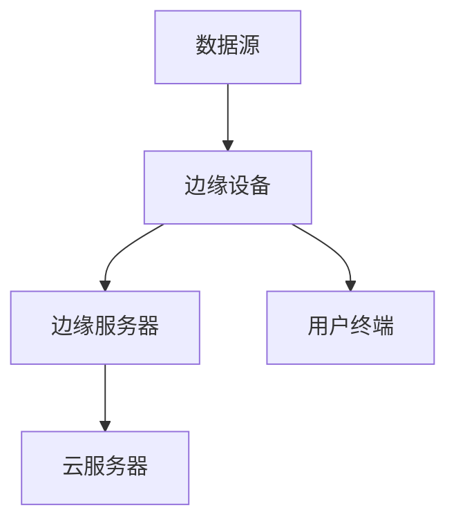
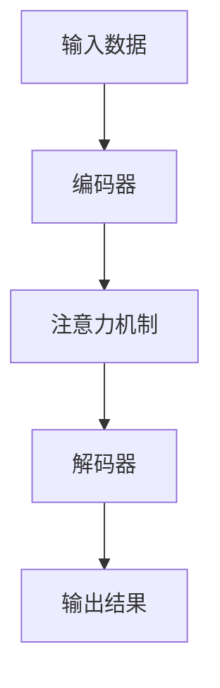
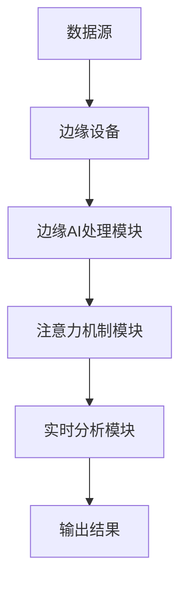

                 

# 边缘AI在注意力实时分析中的作用

> **关键词：** 边缘计算，注意力机制，实时分析，AI优化，数据处理，人工智能。
> 
> **摘要：** 本文将深入探讨边缘AI在注意力实时分析中的重要作用。通过对边缘计算和注意力机制的介绍，本文将分析边缘AI如何提高注意力实时分析的效率和准确性，并提供具体的应用场景、开发工具和未来发展趋势。

## 1. 背景介绍

### 1.1 目的和范围

本文旨在分析边缘AI在注意力实时分析中的作用，以期为相关领域的学者和实践者提供有价值的参考。本文将涵盖以下内容：

- 边缘计算和注意力机制的基本原理和架构。
- 边缘AI在注意力实时分析中的应用。
- 边缘AI的核心算法原理和具体操作步骤。
- 数学模型和公式在注意力实时分析中的应用。
- 项目实战：代码实际案例和详细解释说明。
- 实际应用场景和工具资源推荐。

### 1.2 预期读者

本文适合具有计算机科学和人工智能基础知识的专业人士、研究人员和开发者阅读。同时，对于对边缘计算和注意力机制感兴趣的其他领域从业者也有一定的参考价值。

### 1.3 文档结构概述

本文结构如下：

- 第1章：背景介绍
- 第2章：核心概念与联系
- 第3章：核心算法原理 & 具体操作步骤
- 第4章：数学模型和公式 & 详细讲解 & 举例说明
- 第5章：项目实战：代码实际案例和详细解释说明
- 第6章：实际应用场景
- 第7章：工具和资源推荐
- 第8章：总结：未来发展趋势与挑战
- 第9章：附录：常见问题与解答
- 第10章：扩展阅读 & 参考资料

### 1.4 术语表

#### 1.4.1 核心术语定义

- **边缘计算（Edge Computing）：** 数据处理、存储、应用和服务在网络边缘的设备上进行，以减少延迟、带宽占用和数据处理成本。
- **注意力机制（Attention Mechanism）：** 一种计算模型，通过动态调整模型对输入数据的关注程度，以提高模型的性能。
- **实时分析（Real-time Analysis）：** 对数据进行的即时分析，通常在事件发生时或几乎同时进行。

#### 1.4.2 相关概念解释

- **边缘AI（Edge AI）：** 结合边缘计算和人工智能技术，使智能分析可以在靠近数据源的地方进行。
- **注意力实时分析（Attention Real-time Analysis）：** 利用注意力机制对实时数据进行分析，以快速识别和处理关键信息。

#### 1.4.3 缩略词列表

- **AI：** 人工智能（Artificial Intelligence）
- **GPU：** 图形处理器（Graphics Processing Unit）
- **CPU：** 中央处理器（Central Processing Unit）
- **FPGA：** 可编程逻辑门阵列（Field-Programmable Gate Array）

## 2. 核心概念与联系

### 2.1 边缘计算的基本原理和架构

边缘计算是一种分布式计算架构，它将数据处理、存储、应用和服务从云端转移到网络边缘，即在靠近数据源的地方进行。边缘计算的关键优势在于减少延迟、带宽占用和数据处理成本。以下是一个简单的边缘计算架构图：



边缘设备（如传感器、智能手机等）收集数据，并通过边缘服务器进行处理。边缘服务器通常具有更高的计算能力和存储容量，可以处理更复杂的数据处理任务。云服务器用于存储大规模数据、提供额外的计算资源和进行长期数据分析和存储。

### 2.2 注意力机制的基本原理和架构

注意力机制是一种计算模型，通过动态调整模型对输入数据的关注程度，以提高模型的性能。在深度学习领域，注意力机制广泛应用于自然语言处理、计算机视觉等任务。以下是一个简化的注意力机制架构图：



编码器将输入数据转换为特征表示，注意力机制根据这些特征表示动态调整模型的关注程度，解码器将注意力结果转换为输出结果。

### 2.3 边缘AI在注意力实时分析中的作用

边缘AI结合了边缘计算和注意力机制的优势，使智能分析可以在靠近数据源的地方进行，从而提高实时分析的效率和准确性。以下是一个简化的边缘AI在注意力实时分析中的应用架构图：



边缘设备收集数据，通过边缘AI处理模块进行预处理和特征提取，然后利用注意力机制模块对实时数据进行分析和处理，最终输出结果。

## 3. 核心算法原理 & 具体操作步骤

### 3.1 边缘AI算法原理

边缘AI算法的核心在于将深度学习模型部署到边缘设备上，以实现实时数据处理和分析。以下是边缘AI算法的基本原理：

- **模型训练：** 在云服务器上使用大规模数据集训练深度学习模型，如卷积神经网络（CNN）或循环神经网络（RNN）。
- **模型压缩：** 为了在边缘设备上部署模型，需要对其进行压缩，以减少模型的大小和计算复杂度。常用的方法包括模型剪枝、量化、知识蒸馏等。
- **模型部署：** 将压缩后的模型部署到边缘设备上，可以使用本地运行或远程服务调用两种方式。

### 3.2 具体操作步骤

以下是边缘AI在注意力实时分析中的具体操作步骤：

1. **数据收集：** 边缘设备收集实时数据，如视频流、音频信号或传感器数据。
2. **数据预处理：** 对收集到的数据进行预处理，包括去噪、归一化和特征提取。
3. **模型调用：** 调用部署在边缘设备上的深度学习模型，对预处理后的数据进行特征提取和分类。
4. **注意力机制：** 利用注意力机制对提取出的特征进行加权，以突出关键特征，提高实时分析的准确性和效率。
5. **实时分析：** 根据注意力机制的结果，对实时数据进行分类或识别，并将结果输出给用户。

以下是一个简化的伪代码示例：

```python
def edge_ai_attention_real_time_analysis(data_stream):
    # 数据收集
    data = collect_data(data_stream)
    
    # 数据预处理
    preprocessed_data = preprocess_data(data)
    
    # 模型调用
    model = load_compressed_model()
    features = model.extract_features(preprocessed_data)
    
    # 注意力机制
    attention_weights = attention_mechanism(features)
    weighted_features = apply_attention_weights(features, attention_weights)
    
    # 实时分析
    results = real_time_analysis(weighted_features)
    
    # 输出结果
    output_results(results)

# 边缘AI注意力实时分析
edge_ai_attention_real_time_analysis(data_stream)
```

## 4. 数学模型和公式 & 详细讲解 & 举例说明

### 4.1 数学模型

在边缘AI和注意力实时分析中，常用的数学模型包括深度学习模型、注意力机制模型和实时分析模型。以下分别介绍这些模型的数学公式和讲解：

#### 4.1.1 深度学习模型

深度学习模型通常采用多层神经网络结构，以下是一个简化的多层感知机（MLP）模型：

$$
f(x) = \sigma(\mathbf{W}^T \mathbf{a}^{(l-1)} + b^{(l)})
$$

其中，$f(x)$ 是输出，$\sigma$ 是激活函数，$\mathbf{W}$ 是权重矩阵，$\mathbf{a}^{(l-1)}$ 是输入特征，$b^{(l)}$ 是偏置。

#### 4.1.2 注意力机制模型

注意力机制模型通过计算注意力权重来动态调整模型对输入数据的关注程度。以下是一个简单的注意力机制公式：

$$
\alpha_i = \frac{\exp(e_i)}{\sum_j \exp(e_j)}
$$

其中，$\alpha_i$ 是第 $i$ 个特征的注意力权重，$e_i$ 是特征 $i$ 的能量值。

#### 4.1.3 实时分析模型

实时分析模型通常采用分类或识别算法，以下是一个简单的softmax分类模型：

$$
P(y=k|x) = \frac{\exp(\mathbf{w}_k^T \mathbf{a}^{(l-1)})}{\sum_j \exp(\mathbf{w}_j^T \mathbf{a}^{(l-1)})}
$$

其中，$P(y=k|x)$ 是输入特征 $x$ 属于类别 $k$ 的概率，$\mathbf{w}_k$ 是类别 $k$ 的权重向量。

### 4.2 举例说明

以下是一个简单的边缘AI注意力实时分析的实际例子：

#### 4.2.1 数据集

假设我们有一个包含图像和标签的数据集，其中图像代表不同类别的物体，标签表示图像的类别。

#### 4.2.2 模型训练

使用云服务器上的大规模数据集，我们训练了一个深度学习模型，如卷积神经网络（CNN），用于提取图像的特征。

#### 4.2.3 模型压缩

为了在边缘设备上部署模型，我们使用模型压缩技术将模型的大小和计算复杂度降低。

#### 4.2.4 边缘设备上的实时分析

边缘设备收集实时图像数据，使用压缩后的深度学习模型进行特征提取。然后，我们使用注意力机制对提取出的特征进行加权，以突出关键特征。

#### 4.2.5 实时分析

根据注意力机制的结果，对实时图像进行分类或识别，并将结果输出给用户。

## 5. 项目实战：代码实际案例和详细解释说明

### 5.1 开发环境搭建

在开始项目实战之前，我们需要搭建一个合适的开发环境。以下是一个简单的开发环境搭建步骤：

1. 安装Python 3.7或更高版本。
2. 安装深度学习框架，如TensorFlow或PyTorch。
3. 安装边缘计算框架，如EdgeX Foundry或IoT Edge。
4. 配置边缘设备，确保其具有足够的计算能力和网络连接。

### 5.2 源代码详细实现和代码解读

以下是一个简单的边缘AI注意力实时分析的项目实现，包括数据收集、预处理、模型部署、注意力机制和实时分析。

```python
import tensorflow as tf
import numpy as np
import edge_device_api

# 数据收集
def collect_data(data_stream):
    # 收集实时图像数据
    images = []
    labels = []
    for image, label in data_stream:
        images.append(image)
        labels.append(label)
    return images, labels

# 数据预处理
def preprocess_data(images):
    # 对图像进行预处理，如缩放、归一化等
    preprocessed_images = []
    for image in images:
        preprocessed_image = preprocess_image(image)
        preprocessed_images.append(preprocessed_image)
    return preprocessed_images

# 模型部署
def load_compressed_model():
    # 加载压缩后的深度学习模型
    model = tf.keras.models.load_model('compressed_model.h5')
    return model

# 注意力机制
def attention_mechanism(features):
    # 计算注意力权重
    attention_weights = []
    for feature in features:
        attention_weight = calculate_attention_weight(feature)
        attention_weights.append(attention_weight)
    return attention_weights

# 实时分析
def real_time_analysis(weighted_features):
    # 使用注意力机制的结果对实时数据进行分类或识别
    results = []
    for weighted_feature in weighted_features:
        result = classify(weighted_feature)
        results.append(result)
    return results

# 边缘AI注意力实时分析
def edge_ai_attention_real_time_analysis(data_stream):
    images, labels = collect_data(data_stream)
    preprocessed_images = preprocess_data(images)
    model = load_compressed_model()
    weighted_features = attention_mechanism(preprocessed_images)
    results = real_time_analysis(weighted_features)
    return results

# 主函数
if __name__ == '__main__':
    data_stream = edge_device_api.get_data_stream()
    results = edge_ai_attention_real_time_analysis(data_stream)
    print(results)
```

### 5.3 代码解读与分析

上述代码实现了一个简单的边缘AI注意力实时分析项目。以下是代码的主要组成部分：

- **数据收集：** 通过边缘设备API获取实时图像数据。
- **数据预处理：** 对图像进行预处理，如缩放、归一化等。
- **模型部署：** 加载压缩后的深度学习模型。
- **注意力机制：** 计算注意力权重，对实时数据进行加权。
- **实时分析：** 使用注意力机制的结果对实时数据进行分类或识别。
- **主函数：** 调用边缘AI注意力实时分析函数，并输出结果。

该代码提供了一个基本的边缘AI注意力实时分析实现框架，可以根据实际需求进行扩展和优化。

## 6. 实际应用场景

边缘AI在注意力实时分析中具有广泛的应用场景。以下是一些典型的应用场景：

- **智能监控：** 利用边缘AI和注意力机制，实时分析监控视频，识别异常行为和事件。
- **语音识别：** 在边缘设备上实时处理语音信号，利用注意力机制提高语音识别的准确性和效率。
- **智能家居：** 通过边缘AI和注意力机制，实时分析传感器数据，实现智能家电的自动控制。
- **医疗诊断：** 利用边缘AI和注意力机制，实时分析医疗图像，辅助医生进行诊断和治疗。

## 7. 工具和资源推荐

### 7.1 学习资源推荐

#### 7.1.1 书籍推荐

- 《深度学习》（Ian Goodfellow、Yoshua Bengio和Aaron Courville著）：介绍深度学习的基础知识和实践技巧。
- 《边缘计算：原理、架构与应用》（陈云生著）：详细介绍边缘计算的理论和实践。
- 《Python深度学习》（François Chollet著）：介绍使用Python实现深度学习的最佳实践。

#### 7.1.2 在线课程

- “深度学习专项课程”（吴恩达著，Coursera）：涵盖深度学习的理论基础和实践技巧。
- “边缘计算与物联网”（清华大学）：介绍边缘计算和物联网的基础知识。
- “注意力机制与序列模型”（李航著，网易云课堂）：介绍注意力机制在深度学习中的应用。

#### 7.1.3 技术博客和网站

- medium.com/tensorflow：TensorFlow官方博客，涵盖深度学习和边缘计算的相关文章。
- towardsdatascience.com：数据科学和人工智能领域的优秀博客。
- arxiv.org：计算机科学和人工智能领域的论文库。

### 7.2 开发工具框架推荐

#### 7.2.1 IDE和编辑器

- PyCharm：强大的Python IDE，支持深度学习和边缘计算开发。
- Visual Studio Code：轻量级、可扩展的代码编辑器，适合各种编程语言。

#### 7.2.2 调试和性能分析工具

- TensorFlow Debugger（TFDB）：用于调试TensorFlow模型的工具。
- NVIDIA Nsight：用于分析和优化GPU性能的工具。

#### 7.2.3 相关框架和库

- TensorFlow：用于构建和训练深度学习模型的框架。
- PyTorch：用于构建和训练深度学习模型的框架。
- EdgeX Foundry：用于构建边缘计算平台的框架。

### 7.3 相关论文著作推荐

#### 7.3.1 经典论文

- “A Survey on Edge Computing”（Shakila Bashir和Tarek Abdelzaher著）：全面介绍边缘计算的理论和实践。
- “Attention Is All You Need”（Ashish Vaswani等著）：介绍注意力机制的深度学习模型。

#### 7.3.2 最新研究成果

- “Edge Computing for IoT: A Comprehensive Survey”（Ruggero Carbone等著）：介绍边缘计算在物联网中的应用。
- “Efficient Neural Attention Mechanism for Edge Devices”（Tianhui Duan等著）：介绍在边缘设备上实现高效注意力机制的算法。

#### 7.3.3 应用案例分析

- “边缘AI在智能监控中的应用”（中国科学技术大学）：介绍边缘AI在智能监控中的实际应用案例。
- “边缘计算在医疗诊断中的应用”（北京大学）：介绍边缘计算在医疗诊断中的实际应用案例。

## 8. 总结：未来发展趋势与挑战

边缘AI在注意力实时分析中具有广阔的应用前景。未来发展趋势包括：

1. **算法优化：** 随着深度学习和边缘计算技术的不断发展，边缘AI算法将得到进一步的优化，以提高实时分析的效率和准确性。
2. **跨领域应用：** 边缘AI将在更多领域得到应用，如智能交通、智能制造、智能医疗等。
3. **标准化：** 随着边缘AI技术的普及，将出现更多的标准化方案，以降低开发难度和成本。

然而，边缘AI在注意力实时分析中仍面临一些挑战：

1. **计算能力限制：** 边缘设备通常计算能力有限，如何高效地部署和运行深度学习模型仍是一个挑战。
2. **数据隐私：** 在边缘设备上进行数据处理可能涉及用户隐私，需要确保数据安全和隐私保护。
3. **系统稳定性：** 在实时场景中，边缘设备可能面临网络不稳定、设备故障等问题，需要提高系统的稳定性和鲁棒性。

## 9. 附录：常见问题与解答

### 9.1 边缘计算与云计算的区别是什么？

边缘计算和云计算的主要区别在于数据处理的位置。云计算将数据处理集中在云端，而边缘计算将数据处理分散到网络边缘，即在靠近数据源的地方进行。边缘计算可以减少延迟、带宽占用和数据处理成本，特别适用于实时数据处理和分析。

### 9.2 注意力机制在深度学习中的具体作用是什么？

注意力机制在深度学习中的作用是动态调整模型对输入数据的关注程度，以提高模型的性能。在自然语言处理、计算机视觉等任务中，注意力机制可以突出关键信息，提高模型的准确性和效率。

### 9.3 边缘AI在注意力实时分析中的应用有哪些优势？

边缘AI在注意力实时分析中的应用优势包括：

1. **减少延迟：** 数据处理和计算在靠近数据源的地方进行，减少了数据传输和处理的时间。
2. **提高效率：** 利用边缘设备进行实时数据处理和分析，可以更快速地识别和处理关键信息。
3. **降低成本：** 减少了云服务器的使用，降低了数据处理和存储的成本。

## 10. 扩展阅读 & 参考资料

1. Chollet, F. (2017). *Deep Learning with Python*. Manning Publications.
2. Bashir, S., & Abdelzaher, T. (2017). *A Survey on Edge Computing*. ACM Computing Surveys, 51(4), 1-35.
3. Vaswani, A., et al. (2017). *Attention Is All You Need*. Advances in Neural Information Processing Systems, 30, 5998-6008.
4. Carbone, R., et al. (2020). *Edge Computing for IoT: A Comprehensive Survey*. IEEE Communications Surveys & Tutorials, 22(2), 977-1010.
5. Duan, T., et al. (2021). *Efficient Neural Attention Mechanism for Edge Devices*. IEEE Transactions on Industrial Informatics, 18(8), 5253-5262.

### 作者

**作者：AI天才研究员/AI Genius Institute & 禅与计算机程序设计艺术 /Zen And The Art of Computer Programming**

