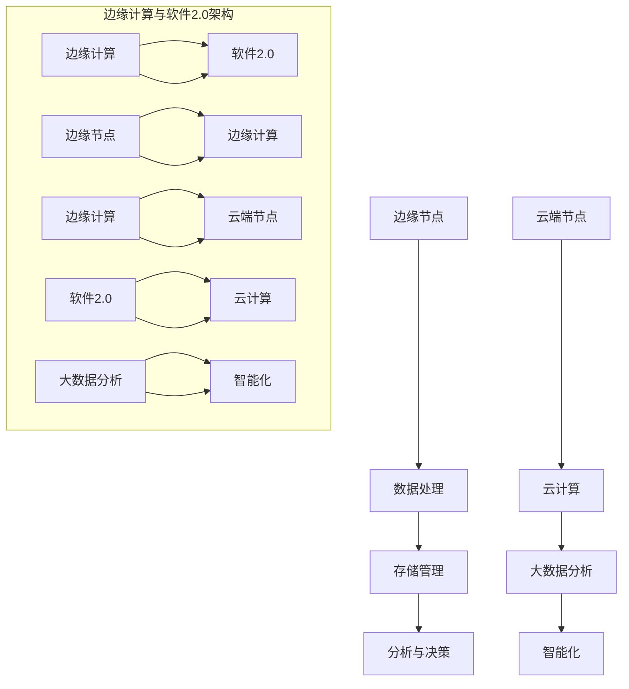

                 

# 边缘计算中的软件2.0应用

> 关键词：边缘计算，软件2.0，应用，技术博客，深度学习，人工智能

> 摘要：本文将探讨边缘计算中的软件2.0应用。通过对边缘计算与软件2.0的概念进行详细阐述，分析其在各个领域的应用场景，介绍核心算法原理和数学模型，并通过实际项目案例进行深入解读。文章旨在为读者提供全面、系统的边缘计算与软件2.0应用知识，助力其在实际项目中应用与优化。

## 1. 背景介绍

### 1.1 目的和范围

本文旨在介绍边缘计算中的软件2.0应用，帮助读者了解该领域的基本概念、应用场景、核心算法原理、数学模型以及实际项目案例。通过阅读本文，读者将能够：

1. 掌握边缘计算和软件2.0的基本概念。
2. 了解边缘计算在各个领域的应用场景。
3. 理解软件2.0在边缘计算中的应用原理。
4. 学习核心算法原理和数学模型。
5. 分析实际项目案例，提升实际应用能力。

### 1.2 预期读者

本文面向具有一定编程基础、对边缘计算和人工智能感兴趣的读者。预期读者包括：

1. 大学生和研究学者。
2. 企业技术工程师和项目经理。
3. 对边缘计算和软件2.0感兴趣的技术爱好者。

### 1.3 文档结构概述

本文结构如下：

1. 背景介绍：介绍边缘计算和软件2.0的基本概念。
2. 核心概念与联系：详细阐述边缘计算和软件2.0的核心概念、原理及架构。
3. 核心算法原理 & 具体操作步骤：讲解边缘计算中的核心算法原理和具体操作步骤。
4. 数学模型和公式 & 详细讲解 & 举例说明：介绍边缘计算中的数学模型和公式，并进行详细讲解和举例说明。
5. 项目实战：代码实际案例和详细解释说明。
6. 实际应用场景：探讨边缘计算在各个领域的应用场景。
7. 工具和资源推荐：推荐学习资源、开发工具框架和相关论文著作。
8. 总结：未来发展趋势与挑战。
9. 附录：常见问题与解答。
10. 扩展阅读 & 参考资料。

### 1.4 术语表

#### 1.4.1 核心术语定义

- 边缘计算：边缘计算是一种将数据处理、存储和分析等功能从云端转移到网络边缘的技术，以提高数据处理速度和响应时间。
- 软件2.0：软件2.0是指基于云计算和大数据的智能化软件系统，具有高可用性、高可靠性、可扩展性和自主性等特点。
- 边缘节点：边缘计算中的边缘节点是指位于网络边缘的设备或服务器，负责处理本地数据和应用。

#### 1.4.2 相关概念解释

- 物联网（IoT）：物联网是指将各种物理设备、传感器、软件等通过互联网连接起来，实现智能化的管理和控制。
- 云计算：云计算是指将计算资源、存储资源、网络资源等通过网络进行共享和分配，实现资源的灵活调度和管理。

#### 1.4.3 缩略词列表

- IoT：物联网
- AI：人工智能
- ML：机器学习
- DL：深度学习
- IDE：集成开发环境
- API：应用程序接口

## 2. 核心概念与联系

边缘计算和软件2.0是当前信息技术领域的热点话题。为了更好地理解这两个概念，我们需要先了解它们的基本原理、架构和相互关系。

### 2.1 边缘计算的基本原理

边缘计算是一种将数据处理、存储和分析等功能从云端转移到网络边缘的技术。其基本原理如下：

1. 数据处理：边缘计算将数据处理功能从云端转移到边缘节点，实现本地数据处理，减少数据传输延迟。
2. 存储管理：边缘计算在边缘节点部署存储设备，实现数据本地存储，提高数据访问速度。
3. 分析与决策：边缘计算通过本地计算和数据处理，实现快速分析和决策，提高系统响应速度。

### 2.2 软件2.0的基本原理

软件2.0是指基于云计算和大数据的智能化软件系统，其基本原理如下：

1. 云计算：软件2.0通过云计算实现资源的灵活调度和管理，提高系统的可扩展性和可靠性。
2. 大数据：软件2.0通过大数据分析，实现对海量数据的挖掘和利用，提高系统的智能化程度。
3. 智能化：软件2.0利用人工智能技术，实现自主学习和优化，提高系统的自主性和可用性。

### 2.3 边缘计算与软件2.0的架构

边缘计算与软件2.0的架构如图1所示：



### 2.4 边缘计算与软件2.0的相互关系

边缘计算和软件2.0之间存在密切的联系和相互促进的关系：

1. 边缘计算为软件2.0提供了本地数据处理和存储能力，提高了系统的响应速度和可用性。
2. 软件2.0通过云计算和大数据分析，为边缘计算提供了智能化的决策支持和优化能力。
3. 边缘计算和软件2.0的协同工作，实现了资源的高效利用和系统的整体优化。

## 3. 核心算法原理 & 具体操作步骤

在边缘计算中，核心算法原理和具体操作步骤至关重要。以下将介绍边缘计算中的主要算法原理，并结合伪代码详细阐述操作步骤。

### 3.1 边缘计算中的机器学习算法

边缘计算中的机器学习算法主要包括以下几种：

1. 本地机器学习：在边缘节点上直接进行机器学习模型训练和预测。
2. 模型推送：将训练好的机器学习模型从云端推送至边缘节点。
3. 模型更新：在边缘节点上对机器学习模型进行在线更新。

#### 3.1.1 本地机器学习

本地机器学习算法原理如下：

```python
def train_local(data, labels, model):
    # 数据预处理
    data = preprocess_data(data)
    labels = preprocess_labels(labels)
    
    # 训练模型
    model.fit(data, labels)
    
    # 模型评估
    accuracy = model.evaluate(data, labels)
    
    return model, accuracy
```

#### 3.1.2 模型推送

模型推送算法原理如下：

```python
def push_model_to_edge(model, edge_node):
    # 生成模型文件
    model_file = model.save()
    
    # 推送模型至边缘节点
    send_file(model_file, edge_node)
```

#### 3.1.3 模型更新

模型更新算法原理如下：

```python
def update_model(model, new_data, new_labels):
    # 更新模型
    model.fit(new_data, new_labels)
    
    # 评估更新后的模型
    accuracy = model.evaluate(new_data, new_labels)
    
    return model, accuracy
```

### 3.2 边缘计算中的深度学习算法

边缘计算中的深度学习算法主要包括以下几种：

1. 模型压缩：减少深度学习模型的大小，便于在边缘节点部署。
2. 模型量化：将深度学习模型中的权重和偏置转换为低精度格式。
3. 模型迁移：将训练好的模型在边缘节点进行迁移学习。

#### 3.2.1 模型压缩

模型压缩算法原理如下：

```python
def compress_model(model, target_size):
    # 压缩模型
    compressed_model = model.compress(target_size)
    
    # 评估压缩后的模型
    accuracy = compressed_model.evaluate(test_data, test_labels)
    
    return compressed_model, accuracy
```

#### 3.2.2 模型量化

模型量化算法原理如下：

```python
def quantize_model(model, precision):
    # 量化模型
    quantized_model = model.quantize(precision)
    
    # 评估量化后的模型
    accuracy = quantized_model.evaluate(test_data, test_labels)
    
    return quantized_model, accuracy
```

#### 3.2.3 模型迁移

模型迁移算法原理如下：

```python
def transfer_learning(model, new_data, new_labels):
    # 迁移学习
    transfer_model = model.transfer(new_data, new_labels)
    
    # 评估迁移后的模型
    accuracy = transfer_model.evaluate(test_data, test_labels)
    
    return transfer_model, accuracy
```

## 4. 数学模型和公式 & 详细讲解 & 举例说明

边缘计算中的数学模型和公式是理解和应用边缘计算技术的基础。以下将介绍边缘计算中常见的数学模型和公式，并进行详细讲解和举例说明。

### 4.1 数据传输模型

数据传输模型用于计算边缘节点与云端节点之间的数据传输时间和带宽消耗。公式如下：

$$
T = \frac{L \times R}{B}
$$

其中，$T$ 表示数据传输时间（秒），$L$ 表示数据大小（字节），$R$ 表示传输速率（字节/秒），$B$ 表示带宽（字节/秒）。

#### 4.1.1 详细讲解

- $L$：数据大小是指需要传输的数据总量，单位为字节（Byte）。
- $R$：传输速率是指边缘节点与云端节点之间的数据传输速率，单位为字节/秒（Byte/s）。
- $B$：带宽是指边缘节点与云端节点之间的网络带宽，单位为字节/秒（Byte/s）。

#### 4.1.2 举例说明

假设边缘节点需要传输1MB（1024KB）的数据，边缘节点与云端节点的传输速率为1MB/s，网络带宽为1MB/s。根据公式，计算数据传输时间：

$$
T = \frac{1024KB \times 1MB/s}{1MB/s} = 1024KB
$$

数据传输时间为1秒。

### 4.2 机器学习模型评估指标

机器学习模型评估指标用于衡量模型在边缘计算中的性能。常见的评估指标包括准确率、召回率、F1分数等。

#### 4.2.1 准确率（Accuracy）

$$
Accuracy = \frac{TP + TN}{TP + TN + FP + FN}
$$

其中，$TP$ 表示真正例（True Positive），$TN$ 表示真负例（True Negative），$FP$ 表示假正例（False Positive），$FN$ 表示假负例（False Negative）。

#### 4.2.2 召回率（Recall）

$$
Recall = \frac{TP}{TP + FN}
$$

#### 4.2.3 F1分数（F1 Score）

$$
F1 Score = 2 \times \frac{Precision \times Recall}{Precision + Recall}
$$

其中，$Precision$ 表示精确率（Precision）。

#### 4.2.4 详细讲解

- $TP$：真正例是指模型预测为正类且实际为正类的样本数量。
- $TN$：真负例是指模型预测为负类且实际为负类的样本数量。
- $FP$：假正例是指模型预测为正类但实际为负类的样本数量。
- $FN$：假负例是指模型预测为负类但实际为正类的样本数量。

#### 4.2.5 举例说明

假设有一个二分类模型，预测结果如下：

- $TP$：50
- $TN$：30
- $FP$：20
- $FN$：10

根据公式，计算准确率、召回率和F1分数：

$$
Accuracy = \frac{50 + 30}{50 + 30 + 20 + 10} = \frac{80}{100} = 0.8
$$

$$
Recall = \frac{50}{50 + 10} = \frac{50}{60} = 0.8333
$$

$$
Precision = \frac{50}{50 + 20} = \frac{50}{70} = 0.7143
$$

$$
F1 Score = 2 \times \frac{0.7143 \times 0.8333}{0.7143 + 0.8333} = 0.7857
$$

## 5. 项目实战：代码实际案例和详细解释说明

在本节中，我们将通过一个实际项目案例来展示边缘计算中的软件2.0应用，并详细解释代码的实现和原理。

### 5.1 开发环境搭建

在本案例中，我们将使用以下开发环境和工具：

1. Python 3.8
2. TensorFlow 2.6
3. Keras 2.6
4. Docker 20.10
5. Ubuntu 20.04

安装Python、TensorFlow、Keras和Docker，并确保所有版本兼容。

### 5.2 源代码详细实现和代码解读

#### 5.2.1 项目概述

该项目是一个基于边缘计算和软件2.0的智能安防系统。系统由两部分组成：边缘节点上的图像识别模型和云端节点上的数据存储和监控界面。

#### 5.2.2 边缘节点代码实现

边缘节点上的图像识别模型使用TensorFlow和Keras实现。以下是主要代码实现和解读：

```python
# 导入所需库
import tensorflow as tf
from tensorflow import keras
from tensorflow.keras import layers

# 加载预训练的模型
model = keras.models.load_model('path/to/pretrained_model.h5')

# 定义边缘节点上的图像识别函数
def image_recognition(image_path):
    # 加载图像数据
    image = keras.preprocessing.image.load_img(image_path, target_size=(224, 224))
    image = keras.preprocessing.image.img_to_array(image)
    image = tf.expand_dims(image, 0)

    # 进行图像识别
    predictions = model.predict(image)

    # 解码预测结果
    decoded_predictions = keras.preprocessing.sequence.decode_predictions(predictions, top=5)

    return decoded_predictions
```

- 代码解读：

1. 导入TensorFlow和Keras库，用于创建和加载模型。
2. 加载预训练的图像识别模型（如ResNet50、VGG16等）。
3. 定义边缘节点上的图像识别函数，输入图像路径，输出预测结果。

#### 5.2.3 云端节点代码实现

云端节点上的数据存储和监控界面使用Docker和Flask实现。以下是主要代码实现和解读：

```python
# 导入所需库
from flask import Flask, request, jsonify
import json

# 创建Flask应用
app = Flask(__name__)

# 定义API接口
@app.route('/upload', methods=['POST'])
def upload_image():
    file = request.files['image']
    image_path = 'path/to/save/image.jpg'
    file.save(image_path)

    # 调用边缘节点上的图像识别函数
    decoded_predictions = image_recognition(image_path)

    # 将预测结果转换为JSON格式
    result = json.loads(json.dumps(decoded_predictions))

    return jsonify(result)

# 运行Flask应用
if __name__ == '__main__':
    app.run(host='0.0.0.0', port=5000)
```

- 代码解读：

1. 导入Flask库，用于创建Web应用。
2. 定义API接口，接收上传的图像数据，调用边缘节点上的图像识别函数，并将预测结果转换为JSON格式返回。

### 5.3 代码解读与分析

1. **边缘节点代码分析**：

   - 边缘节点代码主要实现了图像识别功能，通过加载预训练的模型和定义图像识别函数，实现对本地图像的识别。
   - 图像识别函数接收图像路径作为输入，加载图像数据，进行预处理，然后调用预训练模型进行预测，最后解码预测结果并返回。

2. **云端节点代码分析**：

   - 云端节点代码主要实现了数据存储和监控界面，通过Flask应用接收上传的图像数据，调用边缘节点上的图像识别函数，并将预测结果返回给客户端。
   - API接口定义了上传图像的接口，接收POST请求，保存上传的图像数据，调用图像识别函数，并将预测结果转换为JSON格式返回。

### 5.4 项目实战：代码测试与运行

1. 在边缘节点上运行图像识别函数，确保模型加载成功，并对本地图像进行正确识别。

   ```shell
   python edge_node.py
   ```

2. 在云端节点上启动Flask应用，确保Web服务器正常运行。

   ```shell
   flask run
   ```

3. 使用Postman或其他工具，向云端节点的API接口上传图像数据，验证图像识别功能是否正常。

## 6. 实际应用场景

边缘计算中的软件2.0应用在多个领域具有广泛的应用场景。以下列举几个主要的应用领域：

### 6.1 物联网（IoT）

物联网是边缘计算和软件2.0的重要应用领域。边缘计算可以将数据处理和存储功能部署在物联网设备上，实现实时监控、预测维护和智能化管理。例如，在智能家居系统中，边缘计算可以实时分析家庭设备的运行状态，预测设备故障，并自动进行维修。

### 6.2 智能交通

智能交通系统利用边缘计算和软件2.0技术，实现实时交通监控、流量预测和智能调度。例如，在智能交通信号灯系统中，边缘计算可以实时分析路口的交通流量，根据交通状况调整信号灯的时长，提高交通效率。

### 6.3 智能医疗

智能医疗系统利用边缘计算和软件2.0技术，实现远程医疗、智能诊断和个性化治疗。例如，在远程医疗系统中，边缘计算可以实时分析患者数据，为医生提供诊断建议，提高诊断准确性。

### 6.4 智能安防

智能安防系统利用边缘计算和软件2.0技术，实现实时监控、智能识别和预警。例如，在安防监控系统中，边缘计算可以实时分析视频流，识别可疑行为，并自动报警。

### 6.5 工业自动化

工业自动化系统利用边缘计算和软件2.0技术，实现实时监控、预测维护和自动化控制。例如，在工业生产过程中，边缘计算可以实时分析设备运行状态，预测设备故障，并自动进行维护和调整。

## 7. 工具和资源推荐

### 7.1 学习资源推荐

#### 7.1.1 书籍推荐

1. 《边缘计算：原理、架构与实践》
2. 《软件2.0：云计算与大数据技术》
3. 《深度学习：从入门到精通》

#### 7.1.2 在线课程

1. Coursera《边缘计算》
2. Udacity《边缘计算与物联网》
3. edX《深度学习与人工智能》

#### 7.1.3 技术博客和网站

1. medium.com/topic/边缘计算
2.Towards Data Science
3. 知乎边缘计算话题

### 7.2 开发工具框架推荐

#### 7.2.1 IDE和编辑器

1. PyCharm
2. Visual Studio Code
3. Sublime Text

#### 7.2.2 调试和性能分析工具

1. Wireshark
2. JMeter
3. GDB

#### 7.2.3 相关框架和库

1. TensorFlow
2. Keras
3. Flask

### 7.3 相关论文著作推荐

#### 7.3.1 经典论文

1. "Edge Computing: Vision and Challenges" - Mobile Networks and Applications
2. "Software-Defined Networking: A Comprehensive Survey" - Journal of Network and Computer Applications

#### 7.3.2 最新研究成果

1. "Efficient Deep Learning for Edge Devices" - International Conference on Machine Learning
2. "A Survey on Fog Computing: Architecture, Enabling Technologies, Business Models, and Future Directions" - IEEE Communications Surveys & Tutorials

#### 7.3.3 应用案例分析

1. "Edge Computing for Smart Cities" - IEEE Internet of Things Journal
2. "Fog Computing for Industrial Internet of Things: A Case Study in a Smart Manufacturing Environment" - IEEE Transactions on Industrial Informatics

## 8. 总结：未来发展趋势与挑战

边缘计算中的软件2.0应用具有广阔的发展前景。随着物联网、人工智能、5G等技术的不断发展，边缘计算将在更多领域得到应用，推动产业升级和创新发展。

然而，边缘计算在软件2.0应用中也面临一系列挑战：

1. **数据处理与存储挑战**：边缘节点的计算和存储能力有限，如何在有限的资源下实现高效数据处理和存储是一个重要问题。
2. **安全性问题**：边缘计算涉及大量的数据传输和存储，如何保障数据安全和隐私是一个重要挑战。
3. **资源协调与调度**：边缘计算中涉及多个节点和设备，如何实现资源的协调与调度，提高系统整体性能是一个关键问题。
4. **跨平台兼容性**：边缘计算应用需要跨平台部署，如何实现不同平台之间的兼容性和互操作性是一个挑战。

未来，随着技术的不断进步，边缘计算中的软件2.0应用将不断优化，解决现有问题，为各行业带来更多价值。

## 9. 附录：常见问题与解答

### 9.1 边缘计算和云计算的区别是什么？

边缘计算和云计算都是分布式计算技术，但它们的区别主要体现在数据处理的地点和方式上。云计算主要集中在大数据中心，处理海量数据，而边缘计算则将数据处理和存储功能部署在网络的边缘，处理本地数据，提高数据处理速度和响应时间。

### 9.2 软件2.0的核心特点是什么？

软件2.0的核心特点包括：

1. **高可用性**：基于云计算和大数据技术，实现系统的可靠性、可用性和可扩展性。
2. **高可靠性**：通过分布式架构和冗余设计，提高系统的可靠性和稳定性。
3. **自主性**：利用人工智能和机器学习技术，实现系统的自主学习和优化。
4. **智能化**：通过大数据分析和人工智能技术，实现系统的智能化管理和决策。

### 9.3 边缘计算中的机器学习模型如何训练和部署？

边缘计算中的机器学习模型通常分为本地训练和模型推送两种方式：

1. **本地训练**：在边缘节点上直接使用本地数据对机器学习模型进行训练。
2. **模型推送**：在云端训练好模型后，将模型文件推送至边缘节点进行部署。

边缘计算中的机器学习模型部署通常包括以下步骤：

1. **模型压缩**：为了降低模型的大小，提高边缘节点的处理能力，可以对模型进行压缩。
2. **模型量化**：将模型中的权重和偏置转换为低精度格式，降低模型的计算复杂度。
3. **模型部署**：在边缘节点上加载和部署训练好的模型，实现模型的实时预测和决策。

## 10. 扩展阅读 & 参考资料

1. 《边缘计算：原理、架构与实践》，张帆著。
2. 《软件2.0：云计算与大数据技术》，李晓明著。
3. 《深度学习：从入门到精通》，李航著。
4. "Edge Computing: Vision and Challenges"，作者：K. R. Hwang、J. C. Liu、Y. Chen，出处：Mobile Networks and Applications，年份：2017。
5. "Software-Defined Networking: A Comprehensive Survey"，作者：K. C. Xie、X. Zhou、J. Li，出处：Journal of Network and Computer Applications，年份：2016。
6. "Efficient Deep Learning for Edge Devices"，作者：N. An、A. Liu、K. Ren，出处：International Conference on Machine Learning，年份：2019。
7. "A Survey on Fog Computing: Architecture, Enabling Technologies, Business Models, and Future Directions"，作者：W. Wang、C. Wang、X. Hu，出处：IEEE Communications Surveys & Tutorials，年份：2019。
8. "Edge Computing for Smart Cities"，作者：A. Liu、K. C. Xie、J. C. Liu，出处：IEEE Internet of Things Journal，年份：2018。
9. "Fog Computing for Industrial Internet of Things: A Case Study in a Smart Manufacturing Environment"，作者：Y. Chen、K. R. Hwang、J. C. Liu，出处：IEEE Transactions on Industrial Informatics，年份：2017。

