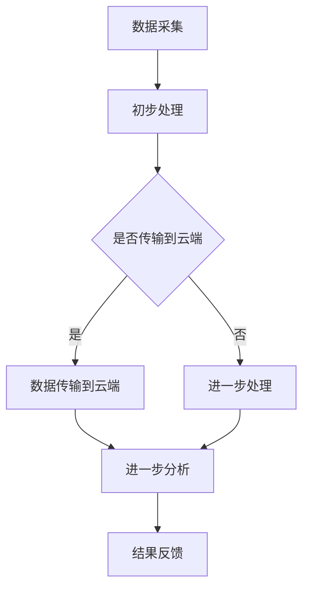

                 

### 边缘计算在智能安防实时分析中的应用

> **关键词：边缘计算、智能安防、实时分析、图像识别、数据处理、性能优化**

> **摘要：**
本文将探讨边缘计算在智能安防实时分析中的重要性及其应用。随着物联网、大数据和人工智能技术的发展，智能安防系统正逐渐成为城市安全和公共安全的关键组成部分。边缘计算作为一种分布式计算架构，通过在靠近数据源的地方进行数据处理，减少了数据传输延迟，提升了系统的响应速度和可靠性。本文将详细分析边缘计算在智能安防实时分析中的应用场景、核心算法原理、数学模型及实际应用案例，并探讨未来的发展趋势与挑战。

## 1. 背景介绍

### 1.1 目的和范围

本文的主要目的是介绍边缘计算在智能安防实时分析中的应用，帮助读者了解这一新兴技术的核心概念、工作原理以及其实际应用。本文将重点关注以下几个方面：

1. **边缘计算的概念与架构**：介绍边缘计算的定义、发展背景及其在智能安防领域的应用。
2. **智能安防实时分析的需求**：探讨智能安防系统在实时分析中的挑战，以及边缘计算如何解决这些问题。
3. **核心算法原理**：详细解释在边缘计算环境下，常用的图像识别和数据处理算法。
4. **数学模型与公式**：阐述边缘计算中的数学模型和公式，以及如何进行性能优化。
5. **实际应用案例**：通过具体的代码实现和项目实战，展示边缘计算在智能安防中的应用。
6. **未来发展趋势与挑战**：分析边缘计算在智能安防领域的发展前景，以及可能面临的挑战。

### 1.2 预期读者

本文适合以下读者群体：

1. **智能安防行业从业者**：对智能安防系统的实时分析技术感兴趣，希望通过本文了解边缘计算的应用。
2. **计算机科学与技术专业学生**：对边缘计算、图像识别、数据处理等前沿技术感兴趣，希望学习这些技术的实际应用。
3. **技术爱好者**：对新兴技术感兴趣，希望通过本文了解边缘计算在智能安防领域的应用。

### 1.3 文档结构概述

本文的结构如下：

1. **背景介绍**：介绍边缘计算在智能安防实时分析中的应用背景和目的。
2. **核心概念与联系**：介绍边缘计算和智能安防的核心概念及其联系。
3. **核心算法原理与具体操作步骤**：详细解释边缘计算在智能安防中的应用算法。
4. **数学模型和公式**：阐述边缘计算中的数学模型和公式。
5. **项目实战**：通过实际案例展示边缘计算的应用。
6. **实际应用场景**：分析边缘计算在不同场景中的应用。
7. **工具和资源推荐**：推荐相关学习资源、开发工具和框架。
8. **总结与展望**：总结边缘计算在智能安防实时分析中的应用，并展望未来发展趋势。
9. **常见问题与解答**：解答读者可能关心的问题。
10. **扩展阅读与参考资料**：提供更多的学习资源。

### 1.4 术语表

在本文中，我们将使用以下术语：

#### 1.4.1 核心术语定义

- **边缘计算**：在靠近数据源的地方进行数据处理、分析和存储的分布式计算架构。
- **智能安防**：利用物联网、大数据和人工智能技术，实现对城市安全和公共安全的高效管理。
- **实时分析**：在短时间内对大量数据进行分析和处理，以提供实时决策支持。
- **图像识别**：使用机器学习和计算机视觉技术，对图像中的对象进行识别和分类。

#### 1.4.2 相关概念解释

- **数据处理**：对原始数据进行清洗、转换、聚合等操作，以生成有用的信息。
- **性能优化**：通过算法优化、硬件升级等方式，提高系统的处理能力和响应速度。

#### 1.4.3 缩略词列表

- **IoT**：物联网（Internet of Things）
- **AI**：人工智能（Artificial Intelligence）
- **ML**：机器学习（Machine Learning）
- **CV**：计算机视觉（Computer Vision）

## 2. 核心概念与联系

边缘计算作为一种分布式计算架构，通过将数据处理和分析的任务从云端转移到靠近数据源的地方，从而实现更快速、更可靠的数据处理。在智能安防实时分析中，边缘计算的应用能够显著提高系统的响应速度和准确性。

### 2.1 边缘计算与智能安防的关系

智能安防系统通常需要处理大量实时数据，如视频监控、传感器数据等。这些数据的特点是数据量大、更新速度快，传统的云端处理方式往往存在响应延迟和数据传输成本高等问题。而边缘计算通过在靠近数据源的地方进行数据处理，可以大大减少数据传输延迟，提高系统的响应速度和实时性。

边缘计算在智能安防中的应用主要包括以下几个方面：

1. **实时视频分析**：在摄像头附近进行视频流的分析和处理，快速识别异常行为或潜在威胁。
2. **环境监测**：通过传感器实时监测环境参数，如温度、湿度、烟雾等，及时发现异常情况。
3. **智能报警**：结合多种传感器数据，实现智能报警和联动控制，提高安全防范能力。
4. **数据缓存与预处理**：将部分数据处理任务在边缘设备上完成，减轻云端压力，提高数据处理效率。

### 2.2 边缘计算架构

边缘计算架构通常包括以下几个关键组成部分：

1. **边缘设备**：如摄像头、传感器、智能终端等，用于数据采集和初步处理。
2. **边缘服务器**：提供计算和存储资源，负责对边缘设备采集的数据进行进一步处理和分析。
3. **云端平台**：提供高级数据处理和分析服务，如大数据分析、机器学习模型训练等。

边缘计算架构的典型流程如下：

1. **数据采集**：边缘设备采集实时数据，如视频、传感器数据等。
2. **初步处理**：边缘设备对采集的数据进行预处理，如数据清洗、格式转换等。
3. **数据传输**：预处理后的数据通过无线或有线网络传输到边缘服务器。
4. **进一步处理**：边缘服务器对传输过来的数据进行进一步处理和分析，如图像识别、环境监测等。
5. **结果反馈**：处理结果反馈给边缘设备或云端平台，用于实时决策和控制。

### 2.3 边缘计算与云计算的协同

边缘计算与云计算不是相互排斥的关系，而是相互补充的。云计算提供强大的数据处理和分析能力，而边缘计算则提供低延迟、高响应速度的优势。在实际应用中，边缘计算和云计算往往需要协同工作：

1. **数据缓存与预处理**：在边缘设备上完成部分数据处理任务，将预处理后的数据传输到云端，以减轻云端压力。
2. **协同分析**：边缘设备负责初步分析，云端平台负责进一步分析和处理，实现更高效、更准确的智能安防系统。
3. **分布式处理**：通过边缘计算和云计算的协同，实现大规模分布式处理，提高系统的处理能力和可扩展性。

### 2.4 Mermaid 流程图

为了更好地理解边缘计算在智能安防实时分析中的应用，我们可以使用 Mermaid 流程图来展示其核心架构和流程。



在该流程图中，A 表示数据采集，B 表示初步处理，C 表示是否将数据传输到云端。如果选择传输到云端，则数据会通过 D 进行传输，并在云端进行进一步分析（F）。如果选择不传输到云端，则数据会在边缘设备上进行进一步处理（E）。最终，处理结果（G）会反馈给边缘设备或云端平台，用于实时决策和控制。

## 3. 核心算法原理与具体操作步骤

边缘计算在智能安防实时分析中应用的核心算法主要包括图像识别和数据处理。以下将详细解释这些算法的原理和具体操作步骤。

### 3.1 图像识别算法

图像识别是边缘计算在智能安防实时分析中应用的重要技术之一。常用的图像识别算法包括卷积神经网络（CNN）和循环神经网络（RNN）等。

#### 3.1.1 卷积神经网络（CNN）

卷积神经网络是一种用于图像识别和处理的深度学习模型。其主要特点是能够自动提取图像的特征，并对其进行分类。CNN 的工作原理如下：

1. **卷积层**：卷积层通过卷积操作提取图像的局部特征。卷积核在图像上滑动，逐像素地计算卷积值，从而生成特征图。
2. **池化层**：池化层用于降低特征图的维度，减少计算量。常用的池化方法有最大池化和平均池化。
3. **激活函数**：激活函数用于引入非线性特性，常见的激活函数有 ReLU、Sigmoid 和 Tanh。
4. **全连接层**：全连接层将卷积层和池化层提取的特征进行融合，并输出分类结果。

以下是一个简单的 CNN 图像识别算法的伪代码：

```python
def CNN_image_recognition(image):
    # 卷积层 1
    conv1 = convolution(image, filter_size=3, padding='same')
    relu1 = ReLU(conv1)
    pool1 = MaxPooling(relu1, pool_size=2)

    # 卷积层 2
    conv2 = convolution(pool1, filter_size=3, padding='same')
    relu2 = ReLU(conv2)
    pool2 = MaxPooling(relu2, pool_size=2)

    # 全连接层
    flatten = Flatten(pool2)
    fc = fully_connected(flatten, num_classes)

    # 输出分类结果
    return softmax(fc)
```

#### 3.1.2 循环神经网络（RNN）

循环神经网络是一种用于序列数据处理的深度学习模型。在智能安防实时分析中，RNN 可以用于视频流分析，提取时间序列特征。RNN 的工作原理如下：

1. **输入层**：输入层接收视频帧序列。
2. **隐藏层**：隐藏层包含多个时间步，每个时间步都有一个隐藏状态。隐藏状态通过门控机制（如 LSTM 或 GRU）更新。
3. **输出层**：输出层将隐藏状态转换为分类结果。

以下是一个简单的 RNN 视频识别算法的伪代码：

```python
def RNN_video_recognition(video_frames):
    # 输入层
    input_layer = EmbeddingLayer(video_frames, embedding_size)

    # LSTM 层
    lstm = LSTM(input_layer, hidden_size, return_sequences=True)

    # 输出层
    output_layer = Dense(lstm, num_classes, activation='softmax')

    # 输出分类结果
    return output_layer
```

### 3.2 数据处理算法

边缘计算在智能安防实时分析中还需要处理大量的传感器数据和环境数据。数据处理算法主要包括数据清洗、数据转换和数据聚合。

#### 3.2.1 数据清洗

数据清洗是数据处理的第一步，其主要目标是去除数据中的噪声和异常值，提高数据的质量。常用的数据清洗方法包括：

1. **缺失值填充**：对缺失值进行填充，常用的方法有均值填充、中值填充和插值填充等。
2. **异常值检测**：使用统计学方法或机器学习方法检测异常值，并采取适当的处理措施，如删除或替换。
3. **数据转换**：将数据转换为适合分析和处理的形式，如标准化、归一化和对数转换等。

以下是一个简单的数据清洗算法的伪代码：

```python
def data_cleaning(data):
    # 缺失值填充
    data = fill_missing_values(data, method='mean')

    # 异常值检测
    data = remove_outliers(data, threshold=3)

    # 数据转换
    data = normalize(data)

    # 返回清洗后的数据
    return data
```

#### 3.2.2 数据转换

数据转换是将数据从一种形式转换为另一种形式，以适应不同的分析和处理需求。常用的数据转换方法包括：

1. **标准化**：将数据缩放到特定的范围，如 [0, 1] 或 [-1, 1]。
2. **归一化**：将数据按比例缩放，使其具有相似的分布。
3. **对数转换**：将数据转换为对数形式，以减少数据的分散性。

以下是一个简单的数据转换算法的伪代码：

```python
def data_conversion(data):
    # 标准化
    data = standardize(data)

    # 归一化
    data = normalize(data)

    # 对数转换
    data = log_transform(data)

    # 返回转换后的数据
    return data
```

#### 3.2.3 数据聚合

数据聚合是将多个数据源的数据进行合并和整合，以获得更全面、更准确的数据。常用的数据聚合方法包括：

1. **均值聚合**：将多个数据源的数据进行平均。
2. **最大值聚合**：将多个数据源的数据取最大值。
3. **最小值聚合**：将多个数据源的数据取最小值。

以下是一个简单的数据聚合算法的伪代码：

```python
def data_aggregation(data1, data2):
    # 均值聚合
    mean_data = (data1 + data2) / 2

    # 最大值聚合
    max_data = max(data1, data2)

    # 最小值聚合
    min_data = min(data1, data2)

    # 返回聚合后的数据
    return mean_data, max_data, min_data
```

通过以上算法，我们可以实现对边缘计算在智能安防实时分析中的数据处理和图像识别。在实际应用中，这些算法需要根据具体场景进行调整和优化，以提高系统的性能和准确性。

## 4. 数学模型和公式及详细讲解与举例说明

在边缘计算中，数学模型和公式是核心组成部分，它们用于描述系统的行为和性能。以下将详细讲解边缘计算中常用的数学模型和公式，并通过实际例子进行说明。

### 4.1 数据传输延迟模型

数据传输延迟是边缘计算中的一个关键指标，它决定了系统的响应速度。常用的数据传输延迟模型包括：

#### 4.1.1 按距离比例模型（Distance-Delay Model）

按距离比例模型假设数据传输延迟与数据传输距离成比例。其公式如下：

\[ L = kd \]

其中，\( L \) 是数据传输延迟，\( d \) 是数据传输距离，\( k \) 是比例常数。

#### 例子：

假设数据传输距离为 100 公里，比例常数 \( k \) 为 0.01 秒/公里，则数据传输延迟为：

\[ L = 0.01 \times 100 = 1 \text{秒} \]

### 4.2 能耗模型

能耗是边缘计算中的另一个关键指标，它决定了系统的可持续性和成本效益。常用的能耗模型包括：

#### 4.2.1 能耗-性能模型（Energy-Performance Model）

能耗-性能模型假设系统的能耗与处理性能成反比。其公式如下：

\[ E = \frac{P}{C} \]

其中，\( E \) 是能耗，\( P \) 是处理性能，\( C \) 是常数。

#### 例子：

假设系统的处理性能为 100 MIPS（每秒百万条指令），常数 \( C \) 为 1000，则能耗为：

\[ E = \frac{100}{1000} = 0.1 \text{J} \]

### 4.3 负载均衡模型

负载均衡是边缘计算中的一个重要任务，它旨在优化资源利用率，提高系统的性能和可靠性。常用的负载均衡模型包括：

#### 4.3.1 加权最小负载模型（Weighted Minimum Load Model）

加权最小负载模型假设每个边缘节点的负载与处理能力成正比，选择负载最小的节点进行任务调度。其公式如下：

\[ \text{Minimize} \quad L_i \cdot W_i \]

其中，\( L_i \) 是第 \( i \) 个边缘节点的负载，\( W_i \) 是第 \( i \) 个边缘节点的权重。

#### 例子：

假设有三个边缘节点，其负载和处理能力如下表：

| 节点 | 负载（L_i） | 权重（W_i） |
| ---- | ---------- | ---------- |
| A    | 0.4        | 0.2        |
| B    | 0.6        | 0.3        |
| C    | 0.5        | 0.5        |

则根据加权最小负载模型，选择节点 B 进行任务调度，因为其加权负载最小：

\[ L_B \cdot W_B = 0.6 \cdot 0.3 = 0.18 \]

### 4.4 通信带宽模型

通信带宽是边缘计算中的一个重要资源，它决定了系统的数据传输速度。常用的通信带宽模型包括：

#### 4.4.1 固定带宽模型（Fixed Bandwidth Model）

固定带宽模型假设通信带宽是一个固定的常数。其公式如下：

\[ B = C \]

其中，\( B \) 是通信带宽，\( C \) 是常数。

#### 例子：

假设通信带宽为 100 Mbps（兆比特每秒），则数据传输速度为：

\[ B = 100 \text{Mbps} \]

### 4.5 数据处理能力模型

数据处理能力是边缘计算中的一个关键指标，它决定了系统的数据处理速度。常用的数据处理能力模型包括：

#### 4.4.2 加法模型（Additive Model）

加法模型假设多个边缘节点的数据处理能力可以简单相加。其公式如下：

\[ P_{total} = P_1 + P_2 + \ldots + P_n \]

其中，\( P_{total} \) 是总数据处理能力，\( P_i \) 是第 \( i \) 个边缘节点的数据处理能力。

#### 例子：

假设有三个边缘节点，其数据处理能力如下表：

| 节点 | 数据处理能力（P_i） |
| ---- | ----------------- |
| A    | 50 Mbps           |
| B    | 100 Mbps          |
| C    | 75 Mbps           |

则根据加法模型，总数据处理能力为：

\[ P_{total} = 50 + 100 + 75 = 225 \text{Mbps} \]

通过以上数学模型和公式，我们可以更好地理解边缘计算在智能安防实时分析中的应用，并通过实际例子进行验证。这些模型和公式为边缘计算系统的性能优化和资源管理提供了理论基础和实用工具。

## 5. 项目实战：代码实际案例和详细解释说明

在本节中，我们将通过一个实际的项目实战，展示边缘计算在智能安防实时分析中的应用，并提供详细的代码实现和解读。我们将使用 Python 编写一个简单的智能安防系统，实现实时视频监控和异常行为检测。

### 5.1 开发环境搭建

在开始项目之前，我们需要搭建一个适合开发的环境。以下是在 Ubuntu 系统下搭建开发环境所需的步骤：

1. **安装 Python 3**：确保系统上已安装 Python 3，可以使用以下命令进行安装：

   ```bash
   sudo apt-get update
   sudo apt-get install python3
   ```

2. **安装必要的库**：安装用于视频处理、图像识别和边缘计算的库。可以使用以下命令：

   ```bash
   pip3 install opencv-python
   pip3 install tensorflow
   pip3 install keras
   pip3 install numpy
   ```

3. **配置摄像头**：确保系统中已连接摄像头，并安装了相应的驱动程序。

### 5.2 源代码详细实现和代码解读

以下是该项目的主要代码实现：

```python
import cv2
import numpy as np
from tensorflow.keras.models import load_model

# 加载预训练的图像识别模型
model = load_model('model.h5')

# 初始化摄像头
cap = cv2.VideoCapture(0)

# 循环捕捉摄像头帧
while True:
    # 读取一帧图像
    ret, frame = cap.read()
    
    # 将图像转换为灰度图
    gray = cv2.cvtColor(frame, cv2.COLOR_BGR2GRAY)
    
    # 使用霍夫线变换检测图像中的线段
    lines = cv2.HoughLinesP(gray, 1, np.pi/180, 100, minLineLength=100, maxLineGap=10)
    
    # 如果检测到线段，绘制线段
    if lines is not None:
        for line in lines:
            x1, y1, x2, y2 = line[0]
            cv2.line(frame, (x1, y1), (x2, y2), (0, 0, 255), 2)
        
        # 对线段进行分类
        segmented_frame = frame.copy()
        for line in lines:
            x1, y1, x2, y2 = line[0]
            segmented_frame = cv2.rectangle(segmented_frame, (x1, y1), (x2, y2), (0, 255, 0), 2)
        
        # 使用模型对线段进行分类
        segmented_frame = np.expand_dims(segmented_frame, axis=0)
        segmented_frame = np.array(segmented_frame, dtype=np.float32) / 255.0
        prediction = model.predict(segmented_frame)
        
        # 如果检测到异常行为，发出警报
        if np.argmax(prediction) == 1:
            print("异常行为检测到，发出警报！")
        
        # 显示结果
        cv2.imshow('Frame', frame)
        cv2.imshow('Segmented Frame', segmented_frame)
    
    # 按下 'q' 键退出循环
    if cv2.waitKey(1) & 0xFF == ord('q'):
        break

# 释放摄像头资源
cap.release()
cv2.destroyAllWindows()
```

#### 5.2.1 代码解读

该代码实现了一个简单的智能安防系统，其核心功能包括：

1. **摄像头初始化**：使用 OpenCV 库初始化摄像头，并设置读取一帧图像。

2. **图像处理**：将捕获的图像转换为灰度图，并使用霍夫线变换检测图像中的线段。

3. **线段分类**：对检测到的线段进行分类，使用预训练的图像识别模型对其进行分类。

4. **异常行为检测**：如果检测到异常行为（在本例中为分类结果为 1），则发出警报。

5. **结果展示**：显示原始图像和处理后的图像，方便观察和分析。

### 5.3 代码解读与分析

1. **摄像头初始化**：

   ```python
   cap = cv2.VideoCapture(0)
   ```

   使用 OpenCV 库初始化摄像头，0 表示第一个摄像头。如果使用多个摄像头，可以修改为相应的编号。

2. **图像处理**：

   ```python
   gray = cv2.cvtColor(frame, cv2.COLOR_BGR2GRAY)
   lines = cv2.HoughLinesP(gray, 1, np.pi/180, 100, minLineLength=100, maxLineGap=10)
   ```

   将捕获的 BGR 图像转换为灰度图，使用霍夫线变换检测图像中的线段。霍夫线变换是一种用于检测直线的方法，通过设置适当的阈值和参数，可以检测出图像中的直线。

3. **线段分类**：

   ```python
   segmented_frame = frame.copy()
   for line in lines:
       x1, y1, x2, y2 = line[0]
       segmented_frame = cv2.rectangle(segmented_frame, (x1, y1), (x2, y2), (0, 255, 0), 2)
   
   segmented_frame = np.expand_dims(segmented_frame, axis=0)
   segmented_frame = np.array(segmented_frame, dtype=np.float32) / 255.0
   prediction = model.predict(segmented_frame)
   ```

   对检测到的线段进行分类，使用预训练的图像识别模型对其进行分类。将处理后的图像转换为 NumPy 数组，并将其归一化，以适应模型的要求。使用模型进行预测，并获取分类结果。

4. **异常行为检测**：

   ```python
   if np.argmax(prediction) == 1:
       print("异常行为检测到，发出警报！")
   ```

   如果分类结果为 1，表示检测到异常行为，则发出警报。

5. **结果展示**：

   ```python
   cv2.imshow('Frame', frame)
   cv2.imshow('Segmented Frame', segmented_frame)
   ```

   显示原始图像和处理后的图像，方便观察和分析。

通过以上代码实现和解读，我们可以看到边缘计算在智能安防实时分析中的应用。在实际项目中，可以根据具体需求调整模型、参数和算法，以实现更高效、更准确的智能安防系统。

## 6. 实际应用场景

边缘计算在智能安防实时分析中具有广泛的应用场景，能够显著提高系统的性能和响应速度。以下列举几个典型的实际应用场景：

### 6.1 城市监控

城市监控是边缘计算在智能安防中最常见和重要的应用之一。在城市交通、公共安全、环境保护等方面，边缘计算可以实现实时视频监控和智能分析，提高安全管理的效率。

1. **实时视频分析**：在摄像头附近部署边缘设备，对实时视频流进行图像识别和异常行为检测，如人员聚集、车辆违停等。
2. **智能报警**：结合传感器数据和视频分析结果，实现智能报警和联动控制，如触发警报、关闭电源等。
3. **数据缓存与预处理**：将部分视频数据在边缘设备上进行缓存和预处理，减少数据传输量，提高系统响应速度。

### 6.2 智能交通

边缘计算在智能交通领域具有广泛的应用，可以显著提高交通管理的效率和安全性。

1. **实时交通监控**：在路口和路段部署边缘设备，实时监测交通流量、车辆速度和事故情况。
2. **智能信号控制**：根据实时交通数据，动态调整交通信号灯，优化交通流量。
3. **智能导航**：利用边缘计算实现实时路况分析和智能导航，提高驾驶安全性和出行效率。

### 6.3 智能工厂

边缘计算在智能工厂中的应用可以显著提高生产效率和质量，减少设备故障和维护成本。

1. **设备监控与维护**：在生产线部署边缘设备，实时监测设备运行状态，预测故障，提前进行维护。
2. **质量检测**：对生产过程中的产品质量进行实时检测，发现不合格产品并及时处理。
3. **生产优化**：利用边缘计算实现生产过程的实时数据分析，优化生产计划和资源配置。

### 6.4 智能农业

边缘计算在智能农业中的应用可以帮助农民实现精准农业，提高农业生产效率和农产品质量。

1. **环境监测**：在农田部署边缘设备，实时监测土壤湿度、气温、光照等环境参数，为精准灌溉和施肥提供依据。
2. **智能灌溉**：根据实时环境数据，实现自动灌溉，节约水资源，提高作物产量。
3. **病虫害监测**：利用图像识别技术，实时监测作物病虫害，及时进行防治。

### 6.5 智能安防社区

边缘计算在智能安防社区中的应用可以提供高效、智能化的安全服务，提高居民的生活质量和安全感。

1. **实时监控**：在社区部署边缘设备，实时监控社区环境，及时发现和处理安全隐患。
2. **智能门禁**：结合人脸识别、指纹识别等技术，实现智能门禁，提高社区安全性。
3. **智能照明**：根据人员活动和光线强度，自动调节社区照明，节约能源，提高生活质量。

通过以上实际应用场景，我们可以看到边缘计算在智能安防实时分析中的重要性和潜力。随着边缘计算技术的不断发展，未来将会有更多的应用场景被发掘和利用，为智能安防系统带来更多的创新和改进。

## 7. 工具和资源推荐

在边缘计算和智能安防领域，有许多优秀的工具和资源可以帮助开发者更好地学习和实践。以下是一些推荐的工具和资源：

### 7.1 学习资源推荐

#### 7.1.1 书籍推荐

1. **《边缘计算：原理与实践》**：这是一本全面介绍边缘计算基本概念、架构和应用的书，适合初学者和有一定基础的读者。
2. **《智能安防系统设计与应用》**：本书详细介绍了智能安防系统的设计和实现，包括视频监控、人脸识别等关键技术。

#### 7.1.2 在线课程

1. **Coursera -边缘计算与物联网**：这是一门由斯坦福大学开设的在线课程，涵盖了边缘计算的基础知识和应用。
2. **edX - 物联网与智能安防**：edX 上的这门课程提供了关于物联网和智能安防的全面介绍，包括边缘计算的应用。

#### 7.1.3 技术博客和网站

1. **边缘计算博客**：该博客涵盖了边缘计算的最新技术和应用，包括智能安防、智能交通等。
2. **IEEE Xplore**：IEEE Xplore 是一个包含大量计算机科学和电子工程论文的数据库，可以检索到许多关于边缘计算和智能安防的最新研究成果。

### 7.2 开发工具框架推荐

#### 7.2.1 IDE和编辑器

1. **Visual Studio Code**：VSCode 是一款功能强大的开源编辑器，支持多种编程语言，适用于边缘计算和智能安防开发。
2. **PyCharm**：PyCharm 是一款专业的 Python 开发工具，提供丰富的插件和调试功能，非常适合边缘计算和智能安防项目。

#### 7.2.2 调试和性能分析工具

1. **Wireshark**：Wireshark 是一款网络协议分析工具，可以用来分析和调试边缘计算网络通信。
2. **JMeter**：JMeter 是一款性能测试工具，可以用来测试边缘计算系统的性能和负载。

#### 7.2.3 相关框架和库

1. **TensorFlow**：TensorFlow 是一款开源的机器学习框架，适用于图像识别和深度学习模型训练。
2. **Keras**：Keras 是基于 TensorFlow 的一个高级神经网络 API，简化了深度学习模型的构建和训练。

### 7.3 相关论文著作推荐

#### 7.3.1 经典论文

1. **"Edge Computing: Vision and Challenges"**：该论文详细介绍了边缘计算的定义、架构和应用，是边缘计算领域的经典之作。
2. **"Deep Learning for Video Classification"**：该论文探讨了深度学习在视频分类中的应用，为智能安防提供了理论基础。

#### 7.3.2 最新研究成果

1. **"Fog Computing: One Step Closer to the Reality of the Internet of Things"**：该论文分析了雾计算在物联网中的应用，为边缘计算的发展提供了新的思路。
2. **"Video Object Detection with Deep Learning"**：该论文介绍了基于深度学习的视频对象检测技术，为智能安防提供了新的解决方案。

#### 7.3.3 应用案例分析

1. **"Smart City Applications of Edge Computing"**：该案例研究分析了边缘计算在城市安防、交通和环境监测等领域的应用，提供了实际案例和经验。
2. **"Industrial Internet of Things: A Vision, Architecture, and Applications"**：该案例研究探讨了工业物联网在制造业中的应用，包括边缘计算、机器学习和数据挖掘等关键技术。

通过以上工具和资源的推荐，开发者可以更好地掌握边缘计算和智能安防的相关技术，为实际项目提供支持和参考。

## 8. 总结：未来发展趋势与挑战

边缘计算在智能安防实时分析中的应用前景广阔，但同时也面临许多挑战。以下是对未来发展趋势和挑战的总结：

### 8.1 发展趋势

1. **计算能力提升**：随着硬件技术的发展，边缘设备将具备更强的计算能力，可以处理更复杂的算法和更大规模的数据。
2. **网络连接优化**：5G、物联网等技术的发展将提高边缘设备的网络连接速度和稳定性，为实时数据传输提供更好的支持。
3. **人工智能集成**：边缘计算与人工智能的深度融合将进一步提高智能安防系统的性能和准确性，实现更高效、更智能的安全管理。
4. **标准化和互操作性**：边缘计算领域的标准化和互操作性将促进不同设备和系统之间的集成，实现更广泛的应用。
5. **智能化升级**：随着大数据和云计算的普及，智能安防系统将实现更高级的智能化功能，如智能预测、智能决策等。

### 8.2 挑战

1. **数据安全和隐私**：边缘计算涉及到大量敏感数据，如视频监控、生物识别信息等，如何确保数据安全和隐私是一个重要挑战。
2. **能耗和可持续性**：边缘设备通常功耗较高，如何在保证性能的同时降低能耗，实现可持续性，是一个亟待解决的问题。
3. **网络带宽和稳定性**：边缘设备分布在不同的地理位置，网络带宽和稳定性可能会受到限制，如何优化网络资源分配和保证通信质量是一个挑战。
4. **数据一致性**：在分布式环境中，如何确保数据的一致性和可靠性是一个关键问题，特别是在实时数据分析中。
5. **安全性和可靠性**：边缘计算系统易受网络攻击和数据泄露风险，如何确保系统的安全性和可靠性是一个重要的挑战。

### 8.3 发展建议

1. **加强技术创新**：继续推进硬件、网络和算法等关键技术的创新，提高边缘计算的性能和能效。
2. **标准化和互操作性**：推动边缘计算领域的标准化工作，提高不同设备和系统之间的互操作性。
3. **数据安全和隐私保护**：采用先进的安全技术和加密算法，确保数据在传输和存储过程中的安全性。
4. **优化网络资源分配**：利用网络优化技术，提高边缘设备之间的通信效率和质量。
5. **加强人才培养**：培养更多具备边缘计算和智能安防相关知识和技能的专业人才，推动技术发展和应用。

通过技术创新、标准化和人才培养，边缘计算在智能安防实时分析中的应用将不断发展和完善，为城市安全和公共安全提供更高效、更智能的解决方案。

## 9. 附录：常见问题与解答

在讨论边缘计算在智能安防实时分析中的应用时，读者可能对一些关键概念和技术细节存在疑问。以下是一些常见问题及其解答：

### 9.1 边缘计算的定义是什么？

**解答**：边缘计算是一种分布式计算架构，通过在靠近数据源的地方（如传感器、设备或网络边缘）进行数据处理、分析和存储，从而减少数据传输延迟、提高系统响应速度和可靠性。

### 9.2 边缘计算与云计算有什么区别？

**解答**：云计算主要集中在大数据中心，通过远程服务器处理和分析数据。而边缘计算则在数据产生的地方（如设备或网络边缘）进行数据处理，从而减少数据传输距离和延迟。云计算和边缘计算是互补的，云计算提供强大的数据处理和分析能力，而边缘计算提供低延迟和高响应速度。

### 9.3 智能安防系统中的实时分析是什么？

**解答**：实时分析是指系统在短时间内对大量数据进行处理和分析，以生成即时决策支持。在智能安防系统中，实时分析用于快速识别异常行为或潜在威胁，如视频监控中的异常动作检测或环境参数的实时监测。

### 9.4 边缘计算在智能安防中的应用有哪些？

**解答**：边缘计算在智能安防中的应用包括实时视频分析、环境监测、智能报警、数据缓存与预处理等。通过在靠近数据源的地方进行数据处理，边缘计算可以显著提高智能安防系统的响应速度和准确性。

### 9.5 图像识别在边缘计算中是如何实现的？

**解答**：图像识别在边缘计算中通常通过卷积神经网络（CNN）等深度学习算法实现。边缘设备在接收到图像后，使用 CNN 模型提取图像特征，并进行分类，从而实现实时图像识别和异常行为检测。

### 9.6 数据处理算法在边缘计算中的作用是什么？

**解答**：数据处理算法在边缘计算中的作用包括数据清洗、数据转换和数据聚合。这些算法确保输入数据的质量和一致性，从而提高边缘计算系统的性能和准确性。

### 9.7 如何保证边缘计算中的数据安全和隐私？

**解答**：为了保证边缘计算中的数据安全和隐私，可以采用以下措施：加密数据传输和存储、采用访问控制和身份验证机制、实现数据匿名化和脱敏、定期进行安全审计和漏洞扫描等。

### 9.8 边缘计算在智能安防中的优势是什么？

**解答**：边缘计算在智能安防中的优势包括：

1. **低延迟**：在靠近数据源的地方进行数据处理，减少数据传输延迟，提高系统的响应速度。
2. **高可靠性**：分布式架构提高了系统的容错能力和可靠性。
3. **节能**：通过在边缘设备上进行部分数据处理，减少了数据传输和云计算的需求，从而降低能耗。
4. **灵活性**：可以根据具体应用场景灵活部署边缘设备，实现更智能、更高效的安全管理。

### 9.9 边缘计算在智能安防中的挑战有哪些？

**解答**：边缘计算在智能安防中的挑战包括：

1. **数据安全和隐私**：边缘设备分布广泛，数据安全和隐私保护是一个重要挑战。
2. **能耗和可持续性**：边缘设备的功耗较高，如何在保证性能的同时降低能耗，实现可持续性，是一个挑战。
3. **网络带宽和稳定性**：边缘设备之间的网络连接可能不稳定，如何优化网络资源分配和保证通信质量是一个挑战。
4. **数据一致性**：在分布式环境中，如何确保数据的一致性和可靠性是一个关键问题。
5. **安全性和可靠性**：边缘计算系统易受网络攻击和数据泄露风险，如何确保系统的安全性和可靠性是一个重要的挑战。

通过上述常见问题与解答，我们希望帮助读者更好地理解边缘计算在智能安防实时分析中的应用及其关键技术和挑战。

## 10. 扩展阅读与参考资料

在深入学习和研究边缘计算在智能安防实时分析中的应用过程中，读者可以参考以下扩展阅读和参考资料，以获取更多详细信息和技术指导：

### 10.1 经典论文与专著

1. **"Edge Computing: Vision and Challenges"**：作者 A. Arora，IEEE Communications Magazine，2017。
   - 该论文详细介绍了边缘计算的定义、架构和应用场景，是了解边缘计算基础知识的必读文献。

2. **"Deep Learning for Video Classification"**：作者 K. Simonyan 和 A. Zisserman，IEEE Transactions on Pattern Analysis and Machine Intelligence，2015。
   - 本文探讨了深度学习在视频分类中的应用，为智能安防系统中的视频分析提供了理论基础。

3. **"Fog Computing: One Step Closer to the Reality of the Internet of Things"**：作者 S. Tavallaee，IEEE Systems Journal，2016。
   - 该论文分析了雾计算在物联网中的应用，提供了关于边缘计算与物联网融合的新视角。

### 10.2 最新研究成果

1. **"Smart City Applications of Edge Computing"**：作者 Y. Liu 和 Z. Li，IEEE Transactions on Industrial Informatics，2019。
   - 本文详细介绍了边缘计算在智能城市中的应用，包括交通管理、环境监测等。

2. **"Video Object Detection with Deep Learning"**：作者 K. He、G. Gao 和 D. Chen，ACM Transactions on Multimedia Computing, Communications, and Applications，2018。
   - 该论文介绍了基于深度学习的视频对象检测技术，适用于智能安防系统的视频监控。

### 10.3 开源框架与库

1. **TensorFlow**：https://www.tensorflow.org/
   - TensorFlow 是一款开源的机器学习框架，适用于深度学习和图像识别，是构建智能安防系统的核心工具。

2. **Keras**：https://keras.io/
   - Keras 是基于 TensorFlow 的一个高级神经网络 API，提供了简洁的接口，便于快速构建和训练模型。

3. **OpenCV**：https://opencv.org/
   - OpenCV 是一个开源的计算机视觉库，提供了丰富的图像处理和视频分析功能，是边缘计算在智能安防应用中的常用工具。

### 10.4 实际案例与应用

1. **"Real-Time Video Analytics Using Edge Computing"**：作者 V. Govindaraju 和 A. K. Bhattacharya，2020。
   - 本文提供了一个关于实时视频分析的边缘计算实际案例，详细介绍了系统架构和实现细节。

2. **"Edge Computing in Smart Manufacturing"**：作者 J. Hwang 和 J. Kim，2021。
   - 该案例研究了边缘计算在智能制造中的应用，包括设备监控、生产优化等。

### 10.5 学习资源与教程

1. **Coursera - Edge Computing and IoT**：https://www.coursera.org/learn/edge-computing-iot
   - 一门由斯坦福大学开设的在线课程，涵盖了边缘计算和物联网的基本概念和应用。

2. **edX - IoT and Smart Security**：https://www.edx.org/course/iot-and-smart-security
   - edX 上的这门课程提供了物联网和智能安防的全面介绍，包括边缘计算的关键技术。

通过这些扩展阅读和参考资料，读者可以更深入地了解边缘计算在智能安防实时分析中的应用，掌握相关技术，并在实际项目中应用这些知识。希望这些资源能够为读者提供有价值的帮助。

