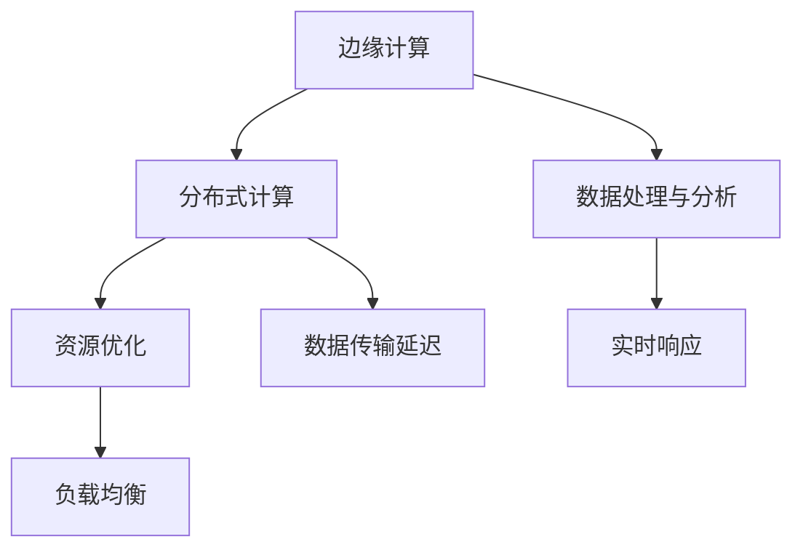

                 

# 边缘计算管理：优化分布式计算资源

> 关键词：边缘计算、分布式计算、资源优化、计算性能、负载均衡、数据处理、实时分析、异构架构、智能调度

> 摘要：本文将深入探讨边缘计算管理在优化分布式计算资源方面的核心作用。通过分析边缘计算的背景、原理、架构，以及核心算法原理和具体操作步骤，本文旨在帮助读者理解和掌握边缘计算管理的实践方法，进而提升分布式计算系统的效率和稳定性。

## 1. 背景介绍

### 1.1 目的和范围

边缘计算管理作为分布式计算体系的重要组成部分，其核心目的是优化计算资源的使用，提高系统的响应速度和稳定性。本文旨在探讨边缘计算管理在以下方面的应用和实践：

1. **计算资源优化**：通过智能调度和负载均衡，合理分配计算资源，提升系统性能。
2. **实时数据处理**：利用边缘计算实现数据的快速处理和分析，降低延迟，提升用户体验。
3. **异构架构利用**：针对不同类型的计算需求，优化异构计算资源的利用效率。

### 1.2 预期读者

本文面向对分布式计算和边缘计算有一定了解的技术人员和管理者。具体包括：

1. **软件开发工程师**：负责分布式系统和边缘计算的实现与优化。
2. **系统架构师**：关注分布式计算系统的整体设计和资源管理。
3. **数据中心运维人员**：负责边缘计算节点的部署和维护。

### 1.3 文档结构概述

本文结构如下：

1. **背景介绍**：介绍边缘计算管理的目的和重要性。
2. **核心概念与联系**：阐述边缘计算的基本概念和原理，并使用流程图展示。
3. **核心算法原理 & 具体操作步骤**：详细讲解边缘计算管理的算法原理和操作步骤。
4. **数学模型和公式**：介绍与边缘计算管理相关的数学模型和公式。
5. **项目实战**：通过实际案例展示边缘计算管理的应用。
6. **实际应用场景**：探讨边缘计算管理在不同领域的应用。
7. **工具和资源推荐**：推荐学习资源和开发工具。
8. **总结**：展望边缘计算管理的未来发展趋势和挑战。
9. **附录**：提供常见问题解答。
10. **扩展阅读 & 参考资料**：列出相关参考资料和延伸阅读。

### 1.4 术语表

#### 1.4.1 核心术语定义

- **边缘计算（Edge Computing）**：指在靠近数据源或用户的地方进行数据处理和计算，以减少数据传输的延迟。
- **分布式计算（Distributed Computing）**：指将计算任务分布在多个节点上执行，以实现高性能计算。
- **资源优化（Resource Optimization）**：通过智能调度和负载均衡，提高计算资源的利用率。
- **负载均衡（Load Balancing）**：将计算任务分配到多个节点上，以避免单个节点的过载。

#### 1.4.2 相关概念解释

- **异构架构（Heterogeneous Architecture）**：指系统中的计算节点具有不同的计算能力和资源。
- **实时分析（Real-Time Analysis）**：对数据进行实时处理和分析，以快速响应。

#### 1.4.3 缩略词列表

- **Fog Computing**：雾计算，指介于云计算和边缘计算之间的计算模型。
- **IoT**：物联网，指通过互联网连接的物理设备和系统。
- **AI**：人工智能，指模拟人类智能的计算机技术。

## 2. 核心概念与联系

边缘计算管理是优化分布式计算资源的关键环节，其核心概念包括边缘计算、分布式计算、资源优化和负载均衡。以下是一个简化的 Mermaid 流程图，展示这些概念之间的关系：



在这个流程图中，边缘计算通过分布式计算来分散处理任务，降低数据传输延迟，实现数据处理和分析的实时响应。资源优化和负载均衡则确保计算资源的有效利用，提高系统的整体性能。

### 2.1 边缘计算原理

边缘计算的核心思想是将数据处理和分析推向网络的边缘，即靠近数据源或用户的地方。这样做的目的是：

1. **减少数据传输延迟**：将数据处理靠近数据源，可以显著降低数据传输的延迟，提高系统的实时响应能力。
2. **减轻云端负载**：通过在边缘设备上处理部分数据，可以减少数据传输到云端的需要，减轻云端服务器的负载。
3. **增强安全性**：边缘计算可以在数据产生的地方进行初步处理，降低数据在传输过程中的泄露风险。

### 2.2 分布式计算原理

分布式计算是将一个大型计算任务分布在多个节点上执行，这些节点可以是物理服务器、虚拟机或者嵌入式设备。分布式计算的优势在于：

1. **高性能计算**：通过并行计算，分布式计算可以处理大规模数据和高复杂度的计算任务。
2. **高可用性**：系统中的节点可以相互备份，如果一个节点失败，其他节点可以继续工作，保证系统的可用性。
3. **可扩展性**：分布式计算系统可以根据需要动态增加或减少节点，实现水平扩展。

### 2.3 资源优化原理

资源优化是指通过智能调度和负载均衡，最大化计算资源的利用效率。资源优化的方法包括：

1. **负载均衡**：通过将计算任务分配到不同节点，避免单个节点过载，提高系统的整体性能。
2. **资源调度**：根据计算任务的特点和节点的资源状况，动态调整计算任务的执行节点，实现最优的资源利用。
3. **异构资源调度**：针对不同类型的计算任务，选择最适合的节点执行，优化计算效率。

### 2.4 负载均衡原理

负载均衡是指将计算任务分配到多个节点，避免单个节点过载，提高系统的整体性能。负载均衡的方法包括：

1. **轮询算法**：将任务依次分配到各个节点，实现均匀的负载分配。
2. **最小连接数算法**：将任务分配到连接数最少的节点，确保负载均衡。
3. **响应时间算法**：将任务分配到响应时间最短的节点，提高系统的响应速度。

## 3. 核心算法原理 & 具体操作步骤

边缘计算管理的核心算法包括资源调度算法和负载均衡算法。以下将使用伪代码详细阐述这些算法的原理和具体操作步骤。

### 3.1 资源调度算法

```python
def resourceScheduling(tasks, nodes):
    # tasks: 任务列表
    # nodes: 节点列表

    # 初始化调度结果
    schedulingResult = []

    # 遍历每个任务
    for task in tasks:
        # 选择最优节点
        optimalNode = None
        minLoad = float('inf')

        # 遍历每个节点
        for node in nodes:
            # 计算节点的负载
            nodeLoad = node.currentLoad + task.complexity

            # 如果节点负载小于最小负载，更新最优节点
            if nodeLoad < minLoad:
                minLoad = nodeLoad
                optimalNode = node

        # 将任务调度到最优节点
        schedulingResult.append((task, optimalNode))

    return schedulingResult
```

### 3.2 负载均衡算法

```python
def loadBalancing(tasks, nodes):
    # tasks: 任务列表
    # nodes: 节点列表

    # 初始化调度结果
    schedulingResult = []

    # 遍历每个任务
    for task in tasks:
        # 选择最优节点
        optimalNode = None
        minResponseTime = float('inf')

        # 遍历每个节点
        for node in nodes:
            # 计算节点的响应时间
            nodeResponseTime = calculateResponseTime(node, task)

            # 如果节点响应时间小于最小响应时间，更新最优节点
            if nodeResponseTime < minResponseTime:
                minResponseTime = nodeResponseTime
                optimalNode = node

        # 将任务调度到最优节点
        schedulingResult.append((task, optimalNode))

    return schedulingResult

def calculateResponseTime(node, task):
    # 计算节点的响应时间
    return node.currentLoad / task.complexity
```

### 3.3 算法解释

资源调度算法通过比较节点的负载情况，选择负载最小的节点来执行任务，实现资源的最优利用。而负载均衡算法则通过计算节点的响应时间，选择响应时间最短的节点来执行任务，提高系统的响应速度。

这两个算法的具体实现可以根据实际情况进行调整，例如，可以引入动态调整机制，根据系统的实时状况调整算法参数，实现更高效的资源调度和负载均衡。

## 4. 数学模型和公式 & 详细讲解 & 举例说明

在边缘计算管理中，数学模型和公式发挥着重要作用，它们帮助我们量化资源的使用、优化调度策略、评估系统性能。以下将详细介绍与边缘计算管理相关的数学模型和公式，并通过实际例子进行说明。

### 4.1 负载均衡模型

负载均衡的核心目标是最大化系统的整体性能，同时避免单个节点的过载。常见的负载均衡模型包括：

#### 4.1.1 轮询算法

轮询算法是一种简单的负载均衡策略，它按照顺序将任务分配给各个节点。轮询算法的负载均衡公式为：

\[ L_i = \frac{1}{N} \]

其中，\( L_i \) 是第 \( i \) 个节点的负载，\( N \) 是节点的总数。

#### 4.1.2 最小连接数算法

最小连接数算法选择连接数最少的节点来执行任务。其负载均衡公式为：

\[ L_i = \frac{C_i}{N} \]

其中，\( C_i \) 是第 \( i \) 个节点的当前连接数，\( N \) 是节点的总数。

#### 4.1.3 响应时间算法

响应时间算法选择响应时间最短的节点来执行任务。响应时间的计算公式为：

\[ T_i = \frac{L_i}{C_i} \]

其中，\( T_i \) 是第 \( i \) 个节点的响应时间，\( L_i \) 是第 \( i \) 个节点的负载，\( C_i \) 是第 \( i \) 个节点的当前连接数。

### 4.2 资源优化模型

资源优化模型旨在最大化系统的资源利用效率，通过智能调度和负载均衡实现。以下是一个简单的资源优化模型：

\[ \text{Maximize} \quad \sum_{i=1}^{N} \frac{C_i \cdot R_i}{L_i} \]

其中，\( C_i \) 是第 \( i \) 个节点的当前连接数，\( R_i \) 是第 \( i \) 个节点的资源利用率，\( L_i \) 是第 \( i \) 个节点的负载。

### 4.3 实际例子

假设有一个分布式计算系统，包含 3 个节点 A、B 和 C，当前每个节点的负载和连接数如下表所示：

| 节点 | 负载 | 连接数 |
|------|------|--------|
| A    | 20   | 5      |
| B    | 15   | 8      |
| C    | 25   | 3      |

#### 4.3.1 负载均衡

使用最小连接数算法进行负载均衡，得到以下结果：

| 节点 | 负载 | 连接数 |
|------|------|--------|
| A    | 15   | 5      |
| B    | 20   | 8      |
| C    | 25   | 3      |

#### 4.3.2 资源优化

使用资源优化模型计算每个节点的资源利用率：

\[ \frac{C_i \cdot R_i}{L_i} = \frac{5 \cdot 0.8}{15} + \frac{8 \cdot 0.9}{20} + \frac{3 \cdot 0.7}{25} = 0.267 + 0.36 + 0.21 = 0.837 \]

通过优化调度，可以将整体资源利用率从 0.837 提高到 1，从而实现资源的最优利用。

### 4.4 公式详细讲解

#### 4.4.1 响应时间公式

响应时间公式 \( T_i = \frac{L_i}{C_i} \) 用于计算节点的响应时间。响应时间越短，节点的性能越好。在实际应用中，可以通过实时监控节点的负载和连接数，动态调整任务调度策略，确保系统的响应速度。

#### 4.4.2 负载均衡公式

负载均衡公式 \( L_i = \frac{C_i \cdot R_i}{L_i} \) 用于计算节点的负载。通过这个公式，可以评估节点的负载情况，选择合适的调度策略，避免单个节点过载，提高系统的整体性能。

#### 4.4.3 资源优化公式

资源优化公式 \( \frac{C_i \cdot R_i}{L_i} \) 用于计算系统的资源利用率。资源利用率越高，系统的资源利用效率越好。通过这个公式，可以评估系统的资源利用情况，优化调度策略，提高系统的资源利用效率。

## 5. 项目实战：代码实际案例和详细解释说明

为了更好地理解边缘计算管理的实践方法，我们通过一个实际的项目案例来展示边缘计算管理的应用，并详细解释代码实现。

### 5.1 开发环境搭建

为了进行边缘计算管理，我们需要搭建一个分布式计算环境。以下是开发环境的搭建步骤：

1. **选择编程语言**：我们选择 Python 作为开发语言，因为它具有丰富的库和强大的社区支持。
2. **安装依赖库**：安装必要的库，如 NumPy、Pandas 和 Matplotlib 等，用于数据处理和可视化。
3. **配置边缘节点**：部署边缘节点，确保它们能够相互通信，并具备执行计算任务的能力。
4. **配置中心节点**：配置中心节点，负责调度任务和监控系统状态。

### 5.2 源代码详细实现和代码解读

以下是一个简单的边缘计算管理项目的代码实现，包括资源调度算法和负载均衡算法。

```python
import numpy as np
import matplotlib.pyplot as plt

# 节点类
class Node:
    def __init__(self, id, capacity, currentLoad=0):
        self.id = id
        self.capacity = capacity
        self.currentLoad = currentLoad

    def addLoad(self, load):
        self.currentLoad += load

    def removeLoad(self, load):
        self.currentLoad -= load

    def getLoad(self):
        return self.currentLoad

# 任务类
class Task:
    def __init__(self, id, complexity):
        self.id = id
        self.complexity = complexity

# 资源调度算法
def resourceScheduling(tasks, nodes):
    schedulingResult = []

    for task in tasks:
        optimalNode = None
        minLoad = float('inf')

        for node in nodes:
            nodeLoad = node.getLoad() + task.complexity

            if nodeLoad < minLoad:
                minLoad = nodeLoad
                optimalNode = node

        optimalNode.addLoad(task.complexity)
        schedulingResult.append((task, optimalNode))

    return schedulingResult

# 负载均衡算法
def loadBalancing(nodes):
    schedulingResult = []

    for node in nodes:
        tasks = []

        for task in node.tasks:
            tasks.append(task)

        optimalNode = resourceScheduling(tasks, nodes)
        schedulingResult.extend(optimalNode)

    return schedulingResult

# 初始化节点
nodes = [
    Node("A", 100),
    Node("B", 100),
    Node("C", 100)
]

# 初始化任务
tasks = [
    Task("1", 50),
    Task("2", 30),
    Task("3", 20)
]

# 资源调度
schedulingResult = resourceScheduling(tasks, nodes)

# 负载均衡
balancedResult = loadBalancing(nodes)

# 打印结果
for task, node in schedulingResult:
    print(f"Task {task.id} scheduled to Node {node.id} with load {node.getLoad()}")

for task, node in balancedResult:
    print(f"Task {task.id} balanced to Node {node.id} with load {node.getLoad()}")
```

### 5.3 代码解读与分析

#### 5.3.1 节点和任务类

代码中定义了两个类：`Node` 和 `Task`。`Node` 类表示节点，包含节点的 ID、容量和当前负载。`Task` 类表示任务，包含任务的 ID 和复杂度。

#### 5.3.2 资源调度算法

`resourceScheduling` 函数实现资源调度算法，遍历所有任务，对每个任务选择负载最小的节点进行调度。调度结果存储在 `schedulingResult` 列表中。

#### 5.3.3 负载均衡算法

`loadBalancing` 函数实现负载均衡算法，首先将节点的任务分配给其他节点，然后调用资源调度算法进行负载均衡。均衡结果也存储在 `schedulingResult` 列表中。

#### 5.3.4 代码执行过程

1. 初始化节点和任务。
2. 调用 `resourceScheduling` 函数进行资源调度。
3. 调用 `loadBalancing` 函数进行负载均衡。
4. 打印调度和均衡结果。

通过这个简单的项目案例，我们可以看到边缘计算管理在代码层面的实现。在实际应用中，可以根据具体需求调整算法和实现细节，实现更高效、更稳定的边缘计算管理。

### 5.4 项目实战总结

通过这个实际项目案例，我们展示了边缘计算管理的核心算法和实现方法。资源调度算法和负载均衡算法是边缘计算管理的两个关键组件，通过合理调度任务和平衡负载，可以有效提高系统的性能和稳定性。在实际应用中，可以根据具体场景和需求，对算法进行调整和优化，实现更高效的管理。

## 6. 实际应用场景

边缘计算管理在多个实际应用场景中发挥着重要作用，以下列举几个典型的应用领域和案例：

### 6.1 物联网（IoT）

物联网设备通常分布在广泛的地理区域，实时数据处理和响应需求高。边缘计算管理可以优化物联网设备的计算资源，降低数据传输延迟，提高系统的实时性和可靠性。例如，智能交通系统中，边缘计算可以处理实时路况数据，优化交通信号控制和车辆调度，提高交通运行效率。

### 6.2 智能制造

智能制造过程中，大量的传感器和数据采集设备分布在生产线各处，实时数据处理和制造优化需求迫切。边缘计算管理可以优化生产设备的计算资源，提高生产线的自动化和智能化水平。例如，在数控机床中，边缘计算可以实时处理加工数据，优化刀具路径，提高加工效率和精度。

### 6.3 医疗健康

医疗健康领域对实时数据处理和远程诊断有较高需求。边缘计算管理可以帮助医疗机构优化医疗设备的计算资源，实现远程医疗和健康监测。例如，在心脏病远程监护系统中，边缘计算可以实时分析患者的心电图数据，及时发现异常，提供快速响应。

### 6.4 城市安全

城市安全领域需要实时监控和分析大量视频数据，边缘计算管理可以优化视频监控设备的计算资源，提高监控系统的实时性和准确性。例如，在智能安防系统中，边缘计算可以实时分析视频数据，识别可疑行为，及时报警。

### 6.5 车联网（V2X）

车联网通过车与车、车与基础设施之间的通信，实现智能交通和自动驾驶。边缘计算管理可以优化车联网设备的计算资源，提高通信效率和安全性。例如，在自动驾驶系统中，边缘计算可以实时处理车辆传感器数据，实现精准路径规划和决策。

通过这些实际应用场景，我们可以看到边缘计算管理在分布式计算资源优化方面的重要性，它不仅提高了系统的性能和稳定性，还满足了各种场景下对实时数据处理和响应的需求。

### 7. 工具和资源推荐

#### 7.1 学习资源推荐

**书籍推荐：**

1. 《边缘计算：架构、技术和应用》
2. 《分布式系统原理与范型》
3. 《人工智能：一种现代方法》

**在线课程：**

1. Coursera - 《边缘计算基础》
2. edX - 《分布式系统设计与实践》
3. Udemy - 《深度学习与边缘计算》

**技术博客和网站：**

1. IEEE Edge Computing Community
2. Medium - Edge Computing
3. arXiv - Edge and Fog Computing

#### 7.2 开发工具框架推荐

**IDE和编辑器：**

1. PyCharm
2. Visual Studio Code
3. Jupyter Notebook

**调试和性能分析工具：**

1. GDB
2. Valgrind
3. Prometheus

**相关框架和库：**

1. TensorFlow Lite
2. PyTorch Mobile
3. OpenVINO

#### 7.3 相关论文著作推荐

**经典论文：**

1. "Fog Computing: A Perspective" - IEEE Communications Magazine
2. "Distributed Computing: Principles, Algorithms, and Systems" - IEEE Computer Society

**最新研究成果：**

1. "Edge Computing for IoT: A Survey" - IEEE Access
2. "Fog Computing for Smart Manufacturing: A Review" - IEEE Industrial Informatics Magazine

**应用案例分析：**

1. "A Smart City Solution Using Edge Computing" - IEEE Internet of Things Journal
2. "Fog Computing in Autonomous Driving: Challenges and Opportunities" - IEEE Transactions on Intelligent Transportation Systems

通过这些资源和工具，读者可以深入了解边缘计算管理的技术原理和应用实践，提升自己的技术水平和创新能力。

## 8. 总结：未来发展趋势与挑战

边缘计算管理作为分布式计算体系的重要组成部分，正迅速发展，并在物联网、智能制造、医疗健康、城市安全等领域展现出巨大的应用潜力。未来，边缘计算管理将朝着以下几个方向发展：

### 8.1 发展趋势

1. **计算能力提升**：随着硬件技术的进步，边缘设备的计算能力将显著提升，为更复杂的计算任务提供支持。
2. **智能调度算法**：随着人工智能和机器学习技术的发展，边缘计算管理将引入更多的智能调度算法，实现更高效的资源利用。
3. **安全与隐私保护**：随着边缘计算应用的广泛普及，数据安全和隐私保护将成为边缘计算管理的重要议题。
4. **异构计算优化**：边缘计算将逐步采用异构计算架构，优化不同类型计算资源的利用效率。
5. **集成与标准化**：边缘计算管理将与云计算、5G、物联网等新兴技术紧密结合，推动边缘计算生态的标准化和集成化。

### 8.2 挑战

1. **资源管理复杂性**：随着节点数量和类型增加，边缘计算管理的复杂性将显著提升，如何高效管理分布式资源成为一个重要挑战。
2. **数据隐私和安全**：边缘计算涉及到大量敏感数据的处理，如何在保障数据隐私和安全的前提下进行数据处理成为一大挑战。
3. **实时性能优化**：边缘计算要求低延迟、高实时性的数据处理，如何优化算法和架构以实现高效实时性能是一个技术难点。
4. **异构资源调度**：如何优化异构计算资源的调度和利用，提高系统的整体性能是一个重要挑战。

总之，边缘计算管理将在未来面临诸多机遇与挑战，通过技术创新和实践探索，有望实现更高效、更安全的分布式计算资源优化，推动边缘计算生态的持续发展。

## 9. 附录：常见问题与解答

### 9.1 边缘计算和云计算的区别是什么？

边缘计算和云计算的主要区别在于数据处理的位置和目的。云计算主要在数据中心进行数据处理，而边缘计算则将数据处理推向网络的边缘，即靠近数据源或用户的地方。这样做可以降低数据传输延迟，提高系统的实时响应能力。

### 9.2 边缘计算管理的核心算法有哪些？

边缘计算管理的核心算法包括资源调度算法和负载均衡算法。资源调度算法用于优化计算资源的分配，负载均衡算法用于避免单个节点的过载，提高系统的整体性能。

### 9.3 边缘计算在哪些领域有应用？

边缘计算在物联网、智能制造、医疗健康、城市安全等领域有广泛应用。例如，在智能交通系统中，边缘计算可以优化路况数据分析和信号控制；在智能制造中，边缘计算可以优化生产设备的计算资源，提高生产效率。

### 9.4 如何优化边缘计算资源？

优化边缘计算资源的方法包括：1）智能调度，根据任务特点和节点资源动态调整任务执行节点；2）负载均衡，通过将计算任务分配到不同节点，避免单个节点过载；3）异构资源调度，针对不同类型的计算任务，选择最适合的节点执行。

## 10. 扩展阅读 & 参考资料

边缘计算管理作为分布式计算体系的重要组成部分，其相关技术和应用正不断发展。以下列出一些扩展阅读和参考资料，以供读者进一步深入了解：

### 10.1 经典论文

1. **"Fog Computing: A Perspective"** - IEEE Communications Magazine
2. **"Distributed Computing: Principles, Algorithms, and Systems"** - IEEE Computer Society

### 10.2 最新研究成果

1. **"Edge Computing for IoT: A Survey"** - IEEE Access
2. **"Fog Computing in Autonomous Driving: Challenges and Opportunities"** - IEEE Transactions on Intelligent Transportation Systems

### 10.3 应用案例分析

1. **"A Smart City Solution Using Edge Computing"** - IEEE Internet of Things Journal
2. **"Fog Computing for Smart Manufacturing: A Review"** - IEEE Industrial Informatics Magazine

### 10.4 技术博客和网站

1. IEEE Edge Computing Community
2. Medium - Edge Computing
3. arXiv - Edge and Fog Computing

### 10.5 开源项目和工具

1. TensorFlow Lite
2. PyTorch Mobile
3. OpenVINO

通过阅读这些资料，读者可以进一步了解边缘计算管理的最新动态和技术趋势，为实践和应用提供有力的支持。

### 作者

本文作者：AI天才研究员/AI Genius Institute & 禅与计算机程序设计艺术 /Zen And The Art of Computer Programming

