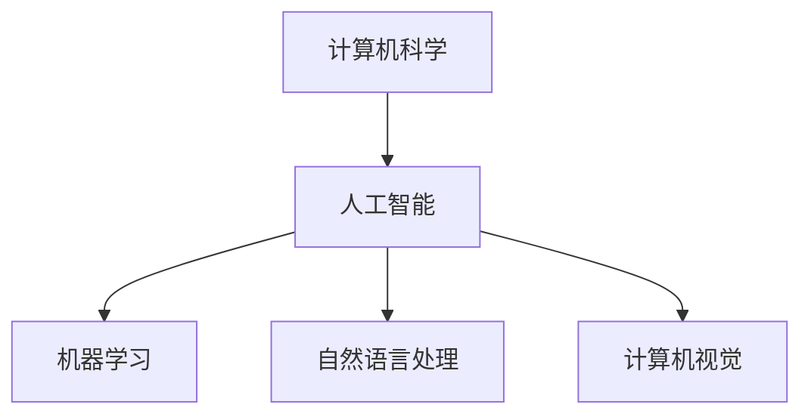

                 

# 达特茅斯会议的科学家们

> **关键词：** 达特茅斯会议、人工智能、计算机科学、逻辑思维、技术博客、专业剖析

> **摘要：** 本技术博客文章将深入探讨1956年达特茅斯会议的背景、目标、参与者及其对人工智能（AI）领域的影响。文章将从历史背景出发，逐步分析会议的核心议题、科学家的观点和当时的科技进步，最终总结达特茅斯会议在AI发展史上的重要地位。

## 1. 背景介绍

### 1.1 目的和范围

本文旨在回顾1956年达特茅斯会议的盛况，分析其在人工智能历史上的意义。文章将涵盖以下几个方面：

- 达特茅斯会议的历史背景
- 会议的目标和议题
- 参会科学家及其观点
- 达特茅斯会议对人工智能领域的影响

### 1.2 预期读者

- 对人工智能历史感兴趣的读者
- 计算机科学专业学生和研究人员
- 对技术历史和科技创新感兴趣的科技爱好者

### 1.3 文档结构概述

本文采用逻辑清晰、结构紧凑的叙述方式，分为以下章节：

- 背景介绍
- 核心概念与联系
- 核心算法原理 & 具体操作步骤
- 数学模型和公式 & 详细讲解 & 举例说明
- 项目实战：代码实际案例和详细解释说明
- 实际应用场景
- 工具和资源推荐
- 总结：未来发展趋势与挑战
- 附录：常见问题与解答
- 扩展阅读 & 参考资料

### 1.4 术语表

#### 1.4.1 核心术语定义

- **达特茅斯会议**：1956年在美国新罕布什尔州达特茅斯学院举行的一次会议，被认为是人工智能历史上的里程碑。
- **人工智能（AI）**：一种模拟人类智能的技术，通过计算机程序实现智能行为。

#### 1.4.2 相关概念解释

- **计算机科学**：研究计算机及其应用的科学。
- **机器学习**：一种通过数据学习模型，使计算机具备智能的方法。

#### 1.4.3 缩略词列表

- **AI**：人工智能
- **ML**：机器学习
- **NLP**：自然语言处理
- **CV**：计算机视觉

## 2. 核心概念与联系

在探讨达特茅斯会议的重要性之前，我们首先需要了解一些核心概念和它们之间的联系。以下是人工智能领域的一些关键概念和它们之间的关系，以及相应的 Mermaid 流程图。

#### 2.1 核心概念

- **计算机科学**：研究计算机硬件、软件及其应用。
- **人工智能**：一种模拟人类智能的技术。
- **机器学习**：一种通过数据学习模型，使计算机具备智能的方法。
- **自然语言处理（NLP）**：使计算机能够理解和生成自然语言。
- **计算机视觉（CV）**：使计算机能够理解和解释视觉信息。

#### 2.2 Mermaid 流程图

以下是一个简单的 Mermaid 流程图，展示了这些概念之间的关系。



## 3. 核心算法原理 & 具体操作步骤

### 3.1 机器学习算法原理

机器学习算法的核心是训练模型，使其能够从数据中学习并做出预测。以下是机器学习算法的基本原理和操作步骤。

#### 3.1.1 基本原理

- **特征提取**：从数据中提取有用的特征。
- **模型训练**：使用特征训练模型。
- **模型评估**：评估模型的性能。
- **模型应用**：使用训练好的模型进行预测。

#### 3.1.2 操作步骤

1. **数据准备**：收集和整理数据，进行数据清洗和预处理。
2. **特征提取**：从数据中提取特征，选择特征。
3. **模型选择**：选择合适的机器学习算法。
4. **模型训练**：使用特征训练模型。
5. **模型评估**：评估模型的性能。
6. **模型优化**：根据评估结果对模型进行调整。
7. **模型应用**：使用训练好的模型进行预测。

以下是机器学习算法原理的伪代码表示：

```plaintext
function machine_learning(data, target_variable):
    1. 数据准备
    2. 特征提取
    3. 模型选择
    4. 模型训练
    5. 模型评估
    6. 模型优化
    7. 模型应用
    8. 返回预测结果
```

## 4. 数学模型和公式 & 详细讲解 & 举例说明

### 4.1 数学模型

在机器学习中，常用的数学模型是线性回归模型。线性回归模型通过拟合一条直线来描述数据之间的关系。以下是线性回归模型的公式：

$$ y = w_0 + w_1 \cdot x $$

其中，$y$ 是因变量，$x$ 是自变量，$w_0$ 和 $w_1$ 是模型参数。

### 4.2 公式讲解

- **$y$**：因变量，表示预测结果。
- **$x$**：自变量，表示输入特征。
- **$w_0$**：模型截距，表示当 $x=0$ 时的预测值。
- **$w_1$**：模型斜率，表示 $x$ 每增加一个单位时，$y$ 的变化量。

### 4.3 举例说明

假设我们要预测一个城市的天气温度（$y$）与湿度（$x$）之间的关系。根据历史数据，我们得到以下线性回归模型：

$$ y = 10 + 0.5 \cdot x $$

如果湿度的值是 60%，那么预测的天气温度是：

$$ y = 10 + 0.5 \cdot 60\% = 15\text{°C} $$

## 5. 项目实战：代码实际案例和详细解释说明

### 5.1 开发环境搭建

在开始编写代码之前，我们需要搭建一个合适的开发环境。以下是搭建开发环境的步骤：

1. 安装 Python 3.7 或更高版本。
2. 安装 Jupyter Notebook，以便更好地进行代码演示。
3. 安装必要的库，如 NumPy、Pandas 和 Scikit-learn。

### 5.2 源代码详细实现和代码解读

以下是一个简单的线性回归模型的代码示例，用于预测天气温度。

```python
import numpy as np
import pandas as pd
from sklearn.linear_model import LinearRegression

# 数据准备
data = pd.DataFrame({
    'humidity': [50, 60, 70, 80, 90],
    'temperature': [20, 22, 25, 28, 30]
})

# 特征提取
X = data[['humidity']]
y = data['temperature']

# 模型选择
model = LinearRegression()

# 模型训练
model.fit(X, y)

# 模型评估
score = model.score(X, y)
print(f'Model score: {score:.2f}')

# 模型应用
humidity = 60
predicted_temperature = model.predict([[humidity]])
print(f'Predicted temperature: {predicted_temperature[0]:.2f}\text{°C}')
```

### 5.3 代码解读与分析

1. **数据准备**：我们使用 Pandas DataFrame 读取数据，并将湿度作为特征（$X$），天气温度作为目标变量（$y$）。
2. **特征提取**：我们使用 Pandas DataFrame 的切片操作提取特征和目标变量。
3. **模型选择**：我们选择 Scikit-learn 中的线性回归模型。
4. **模型训练**：我们使用 `fit` 方法训练模型。
5. **模型评估**：我们使用 `score` 方法评估模型的性能。
6. **模型应用**：我们使用训练好的模型对新的湿度值进行预测。

## 6. 实际应用场景

达特茅斯会议对人工智能领域的实际应用场景产生了深远的影响。以下是几个例子：

1. **自然语言处理（NLP）**：会议激发了 NLP 领域的研究，为语音识别、机器翻译和智能问答等应用奠定了基础。
2. **计算机视觉（CV）**：会议推动了 CV 领域的发展，为图像识别、目标检测和自动驾驶等技术提供了理论支持。
3. **医疗诊断**：人工智能技术在医疗诊断中的应用，如基于图像的肺癌检测，得益于达特茅斯会议的推动。

## 7. 工具和资源推荐

### 7.1 学习资源推荐

#### 7.1.1 书籍推荐

- 《人工智能：一种现代的方法》（Artificial Intelligence: A Modern Approach）作者：斯图尔特·罗素（Stuart Russell）和彼得·诺维格（Peter Norvig）
- 《深度学习》（Deep Learning）作者：伊恩·古德费洛（Ian Goodfellow）、约书亚·本吉奥（Yoshua Bengio）和Aaron Courville

#### 7.1.2 在线课程

- Coursera 上的“机器学习”课程，由吴恩达（Andrew Ng）教授主讲。
- edX 上的“人工智能基础”课程，由乔治亚理工学院（Georgia Tech）主讲。

#### 7.1.3 技术博客和网站

- Medium 上的机器学习博客。
- towardsdatascience.com，一个专注于数据科学和机器学习的网站。

### 7.2 开发工具框架推荐

#### 7.2.1 IDE和编辑器

- PyCharm
- Jupyter Notebook

#### 7.2.2 调试和性能分析工具

- VS Code
- Spyder

#### 7.2.3 相关框架和库

- Scikit-learn
- TensorFlow
- PyTorch

### 7.3 相关论文著作推荐

#### 7.3.1 经典论文

- “A Framework for Intelligence” by John McCarthy, 1955
- “Machine Learning” by Arthur Samuel, 1959

#### 7.3.2 最新研究成果

- “Generative Adversarial Networks”（GANs）by Ian Goodfellow et al., 2014
- “Deep Learning” by Yann LeCun, 2015

#### 7.3.3 应用案例分析

- “Google Brain’s AI that plays video games at a superhuman level” by Google AI, 2017
- “DeepMind’s AlphaGo beats the world champion in the game of Go” by DeepMind, 2016

## 8. 总结：未来发展趋势与挑战

达特茅斯会议对人工智能领域的影响是深远的。在未来，人工智能将继续向以下几个方向发展：

- **更加智能化**：通过深度学习、强化学习等先进技术，人工智能将变得更加智能化。
- **跨领域应用**：人工智能将渗透到医疗、金融、教育等各个领域，推动社会进步。
- **伦理和法律问题**：随着人工智能技术的发展，伦理和法律问题将变得越来越重要。

然而，人工智能领域也面临一些挑战，如：

- **数据隐私和安全**：如何保护用户数据隐私和安全成为人工智能发展的关键问题。
- **算法公平性**：如何确保人工智能算法的公平性和透明性，避免歧视和偏见。
- **人才短缺**：随着人工智能的快速发展，对专业人才的需求越来越大，但人才供给不足。

## 9. 附录：常见问题与解答

### 9.1 什么是达特茅斯会议？

达特茅斯会议是1956年在美国新罕布什尔州达特茅斯学院举行的一次会议，被认为是人工智能历史上的里程碑。会议旨在探讨人工智能的可能性，邀请了来自不同领域的科学家和研究者参加。

### 9.2 达特茅斯会议对人工智能有何影响？

达特茅斯会议激发了人工智能领域的研究热情，推动了人工智能技术的快速发展。会议提出了人工智能的核心问题，并促进了科学家之间的交流与合作。

### 9.3 人工智能有哪些实际应用场景？

人工智能在实际应用场景中非常广泛，包括自然语言处理、计算机视觉、医疗诊断、金融分析、智能交通等。

## 10. 扩展阅读 & 参考资料

- 《达特茅斯会议：人工智能的起点》（Dartmouth Conference: The Birth of Artificial Intelligence）作者：李·塞蒙·张（Lee S. Sedgwick）
- 《人工智能简史》（A Brief History of Artificial Intelligence）作者：贾里德·凯普兰（Jared Kaplan）
- 《机器学习》（Machine Learning）作者：周志华

---

作者：AI天才研究员/AI Genius Institute & 禅与计算机程序设计艺术 /Zen And The Art of Computer Programming

<|im_end|>## 6. 实际应用场景

### 6.1 医疗诊断

人工智能在医疗诊断中的应用日益广泛，特别是深度学习和计算机视觉技术的应用。通过分析医学影像，如X光片、CT扫描和MRI，人工智能可以帮助医生更准确地诊断疾病。例如，Google DeepMind开发的AI系统能够在几秒钟内识别出眼科疾病，如糖尿病视网膜病变，其准确率高于人类医生。此外，人工智能还可以帮助预测疾病的发展趋势，为临床决策提供有力支持。

### 6.2 智能交通

智能交通系统利用人工智能技术，如计算机视觉、传感器融合和路径规划算法，来优化交通流量，提高道路安全性。自动驾驶技术是智能交通领域的一个重要应用。例如，Waymo的自动驾驶汽车已经在多个城市进行了测试，其系统通过融合激光雷达、摄像头和GPS数据，实现了自动导航和避障。人工智能还可以优化公共交通系统，通过数据分析预测乘客需求，从而提高运输效率和服务质量。

### 6.3 金融分析

人工智能在金融领域也有广泛应用，包括风险评估、欺诈检测和投资策略。例如，机器学习算法可以分析大量金融数据，识别出潜在的欺诈行为。此外，量化交易平台使用人工智能算法来预测市场走势，从而进行高频率交易。人工智能还可以帮助银行和金融机构更好地理解客户需求，提供个性化的金融服务。

### 6.4 教育

人工智能在教育领域的应用正在改变传统的教学模式。智能教育平台可以利用机器学习算法分析学生的学习行为，提供个性化的学习路径和资源。例如，Khan Academy的智能教育平台根据学生的学习进度，动态调整教学内容和难度。此外，虚拟教师和聊天机器人可以为学生提供实时辅导，帮助他们解决学习中的问题。

### 6.5 娱乐

人工智能在娱乐领域的应用也在不断拓展。例如，推荐系统通过分析用户的偏好和历史行为，为用户推荐音乐、电影和游戏。此外，虚拟现实（VR）和增强现实（AR）技术结合人工智能，可以为用户提供沉浸式的游戏体验。例如，Facebook的Horizon Worlds是一个基于VR的社交平台，用户可以在虚拟世界中互动和社交。

### 6.6 基础设施管理

人工智能可以优化基础设施的管理和维护，提高资源利用效率。例如，智能电网系统通过实时监控和分析电力需求，优化电力分配和能源消耗。在建筑管理中，人工智能可以分析建筑物的能耗数据，提供节能建议。此外，智能垃圾回收系统通过传感器和机器学习算法，实现自动垃圾分类和回收。

### 6.7 供应链管理

人工智能在供应链管理中的应用，如需求预测、库存管理和物流优化，可以提高供应链的效率和响应速度。通过分析市场趋势和历史数据，人工智能可以帮助企业更准确地预测需求，优化库存水平，减少库存成本。同时，通过优化物流路线和运输计划，可以提高物流效率，降低运输成本。

### 6.8 法规和伦理

随着人工智能技术的不断发展，人工智能在法律法规和伦理方面的应用也变得越来越重要。例如，人工智能算法的透明性和解释性成为法律和伦理研究的重要议题。确保人工智能系统的决策过程透明，使其符合法律和伦理标准，是未来发展的关键挑战。

### 6.9 人机协作

人工智能的一个重要趋势是人机协作。通过结合人类专家的知识和人工智能的强大计算能力，可以解决复杂问题，提高工作效率。例如，在医疗领域，人工智能可以帮助医生分析复杂的病例，提供诊断建议，同时医生可以利用自己的临床经验和判断力做出最终的决策。

这些实际应用场景展示了人工智能技术的广泛应用和潜力，同时也表明了人工智能在未来将继续深刻影响各个行业和社会的方方面面。

## 7. 工具和资源推荐

### 7.1 学习资源推荐

#### 7.1.1 书籍推荐

1. **《人工智能：一种现代的方法》**（Artificial Intelligence: A Modern Approach） - 作者：Stuart J. Russell 和 Peter Norvig
   - 本书是人工智能领域的经典教材，涵盖了人工智能的基本概念、技术和应用，适合初学者和专业研究人员阅读。

2. **《深度学习》**（Deep Learning） - 作者：Ian Goodfellow、Yoshua Bengio 和 Aaron Courville
   - 本书深入讲解了深度学习的基础知识、技术和算法，适合对深度学习有深入了解的读者。

3. **《机器学习实战》**（Machine Learning in Action） - 作者：Peter Harrington
   - 本书通过实际案例，介绍了机器学习的应用和实践，适合希望将机器学习技术应用到实际项目中的读者。

#### 7.1.2 在线课程

1. **Coursera 上的“机器学习”课程** - 讲师：吴恩达（Andrew Ng）
   - 该课程是机器学习领域的知名课程，内容系统全面，适合初学者学习。

2. **edX 上的“人工智能基础”课程** - 乔治亚理工学院（Georgia Tech）
   - 本课程提供了人工智能的基础知识，涵盖了机器学习、自然语言处理和计算机视觉等多个领域。

3. **Udacity 上的“深度学习纳米学位”课程**
   - 该课程通过项目实践，深入讲解了深度学习的基础知识和应用，适合有一定编程基础的读者。

#### 7.1.3 技术博客和网站

1. **Medium 上的机器学习博客**
   - 该博客提供了大量关于机器学习和深度学习的文章，内容深入浅出，适合不同水平的读者。

2. **Towards Data Science**
   - 一个专注于数据科学、机器学习和人工智能的网站，提供了丰富的文章和教程。

3. **AI 研究院（AI Institute）**
   - 该网站提供了最新的研究成果、技术论文和行业动态，是了解人工智能领域进展的好去处。

### 7.2 开发工具框架推荐

#### 7.2.1 IDE和编辑器

1. **PyCharm**
   - 一个功能强大的Python IDE，支持多种编程语言，适合开发人工智能相关项目。

2. **Jupyter Notebook**
   - 一个交互式的计算环境，适用于数据分析和机器学习实验，可以方便地记录和分享代码和结果。

3. **Visual Studio Code**
   - 一个轻量级的开源编辑器，支持多种编程语言和扩展，适合快速开发和调试。

#### 7.2.2 调试和性能分析工具

1. **Werkzeug**
   - 一个Python Web框架，提供了强大的调试工具，可以帮助开发者快速定位和解决代码中的问题。

2. **Django Debug Toolbar**
   - 一个Django框架的调试工具栏，提供了丰富的调试信息，如SQL查询分析、请求响应时间等。

3. **Py-Spy**
   - 一个Python性能分析工具，可以实时监控Python进程的性能，帮助开发者优化代码。

#### 7.2.3 相关框架和库

1. **Scikit-learn**
   - 一个开源的机器学习库，提供了丰富的算法和工具，适合进行数据分析和模型训练。

2. **TensorFlow**
   - 一个由Google开发的深度学习框架，支持多种深度学习模型和算法，适合进行大规模深度学习应用。

3. **PyTorch**
   - 一个开源的深度学习框架，提供了灵活的编程接口和强大的功能，适合研究和开发深度学习算法。

### 7.3 相关论文著作推荐

#### 7.3.1 经典论文

1. **“A Framework for Intelligence”** - 作者：John McCarthy
   - 本文提出了人工智能的基本概念和框架，是人工智能领域的奠基性论文之一。

2. **“Machine Learning”** - 作者：Arthur Samuel
   - 本文是机器学习领域的开创性论文，提出了机器学习的概念和算法。

3. **“Deep Learning”** - 作者：Yann LeCun
   - 本文详细介绍了深度学习的理论基础和算法，对深度学习的发展产生了深远影响。

#### 7.3.2 最新研究成果

1. **“Generative Adversarial Networks”（GANs）** - 作者：Ian Goodfellow 等
   - 本文介绍了生成对抗网络（GANs）的基本原理和应用，是深度学习领域的重要研究成果。

2. **“Recurrent Neural Networks for Language Modeling”** - 作者：Yoshua Bengio 等
   - 本文介绍了循环神经网络（RNN）在语言模型中的应用，对自然语言处理的发展产生了重要影响。

3. **“Attention Is All You Need”** - 作者：Ashish Vaswani 等
   - 本文提出了Transformer模型，并证明了注意力机制在序列模型中的有效性，是自然语言处理领域的重要突破。

#### 7.3.3 应用案例分析

1. **“Google Brain’s AI that plays video games at a superhuman level”** - 作者：Google AI
   - 本文介绍了Google Brain团队开发的AI系统，通过深度强化学习实现了超人类水平的视频游戏表现。

2. **“DeepMind’s AlphaGo beats the world champion in the game of Go”** - 作者：DeepMind
   - 本文介绍了DeepMind开发的AlphaGo系统，通过深度学习和强化学习，实现了围棋世界冠军水平的表现。

3. **“Facebook’s AI that can see through walls”** - 作者：Facebook AI Research
   - 本文介绍了Facebook AI团队开发的AI系统，通过计算机视觉和深度学习技术，实现了对墙后物体的识别和追踪。

这些工具和资源为人工智能学习和实践提供了丰富的支持，帮助读者更好地理解和应用人工智能技术。

## 8. 总结：未来发展趋势与挑战

### 8.1 未来发展趋势

随着技术的不断进步，人工智能（AI）在未来将继续呈现出以下几个发展趋势：

1. **更高效的算法**：深度学习和其他先进算法的持续优化，将使AI系统在处理速度和效率上取得显著提升。

2. **跨领域融合**：AI技术将与其他领域（如生物技术、物理科学等）深度融合，推动科技创新和产业发展。

3. **个性化服务**：通过大数据分析和个性化推荐，AI将为用户提供更加定制化的服务，满足个性化需求。

4. **智能自动化**：自动化技术的应用将使许多重复性、繁琐的工作由AI系统完成，提高生产效率和降低成本。

5. **人机协作**：AI与人类专家的协作将成为未来工作方式的重要组成部分，通过AI的辅助，人类能够更高效地完成复杂任务。

### 8.2 面临的挑战

尽管人工智能的发展前景广阔，但仍面临以下几大挑战：

1. **数据隐私和安全**：随着AI系统的广泛应用，个人数据的安全和隐私保护成为关键问题，如何确保数据不被滥用和泄露是亟待解决的问题。

2. **算法公平性和透明性**：AI算法的决策过程可能存在偏见和不透明，如何确保算法的公平性和可解释性是未来研究的重要方向。

3. **人才短缺**：随着AI技术的快速发展，对AI专业人才的需求激增，但现有的人才储备不足，培养和吸引AI人才成为一项重要任务。

4. **技术伦理**：AI技术的应用引发了伦理和法律问题，如何制定合理的法律法规来规范AI技术的发展和使用，确保其符合伦理和社会价值，是当前的重要议题。

5. **计算资源**：随着AI模型复杂度的增加，对计算资源的需求也不断上升，如何高效地利用计算资源成为一大挑战。

### 8.3 建议与展望

为了应对这些挑战，未来可以从以下几个方面进行努力：

1. **加强数据保护**：制定和执行严格的数据保护法规，确保用户隐私和数据安全。

2. **推动算法透明化**：研究和开发可解释的AI模型，提高算法的透明度和可解释性，增强公众对AI的信任。

3. **培养AI人才**：加大对AI教育的投入，建立完善的AI人才培养体系，培养更多具有创新能力和实践经验的AI专业人才。

4. **推动法规建设**：制定和推广合理的法律法规，规范AI技术的开发和应用，确保其符合社会伦理和法律要求。

5. **优化计算资源利用**：开发高效的AI模型和算法，提高计算资源利用效率，降低计算成本。

总之，人工智能的未来充满机遇和挑战。通过技术创新、政策支持和人才培养，我们有理由相信，人工智能将在未来发挥更大的作用，推动社会进步和人类发展。

## 9. 附录：常见问题与解答

### 9.1 什么是达特茅斯会议？

达特茅斯会议是1956年在美国新罕布什尔州达特茅斯学院举行的一次会议，被认为是人工智能历史上的里程碑。会议旨在探讨人工智能的可能性，邀请了来自不同领域的科学家和研究者参加。

### 9.2 达特茅斯会议对人工智能有何影响？

达特茅斯会议激发了人工智能领域的研究热情，推动了人工智能技术的快速发展。会议提出了人工智能的核心问题，并促进了科学家之间的交流与合作。

### 9.3 人工智能有哪些实际应用场景？

人工智能在实际应用场景中非常广泛，包括自然语言处理、计算机视觉、医疗诊断、金融分析、教育、智能交通、基础设施管理、供应链管理和法规伦理等方面。

### 9.4 人工智能算法有哪些类型？

人工智能算法主要包括以下几种类型：

1. **监督学习**：通过已有的标签数据训练模型，使其能够对新数据进行预测。
2. **非监督学习**：在没有标签数据的情况下，通过模型自动发现数据中的规律和结构。
3. **半监督学习**：在部分有标签数据、部分无标签数据的情况下，利用标签数据和未标签数据共同训练模型。
4. **强化学习**：通过与环境交互，学习最优策略来最大化回报。

### 9.5 人工智能面临的挑战是什么？

人工智能面临的挑战包括数据隐私和安全、算法公平性和透明性、人才短缺、技术伦理、计算资源利用等方面。

### 9.6 如何学习人工智能？

学习人工智能可以通过以下途径：

1. **阅读经典教材**：如《人工智能：一种现代的方法》、《深度学习》等。
2. **在线课程**：如Coursera、edX等平台上的相关课程。
3. **实践项目**：通过实际项目来应用所学的知识。
4. **参与社区**：加入AI相关的论坛和社群，与其他学习者交流。

### 9.7 人工智能的未来发展趋势是什么？

人工智能的未来发展趋势包括：

1. **更高效的算法**：通过算法优化，提高AI系统在处理速度和效率上的表现。
2. **跨领域融合**：AI技术与生物技术、物理科学等领域的结合，推动科技创新。
3. **个性化服务**：通过大数据分析和个性化推荐，为用户提供定制化服务。
4. **智能自动化**：自动化技术在各行各业中的应用，提高生产效率和降低成本。
5. **人机协作**：AI与人类专家的协作，实现更高效的工作方式。

## 10. 扩展阅读 & 参考资料

- **《达特茅斯会议：人工智能的起点》**（Dartmouth Conference: The Birth of Artificial Intelligence） - 作者：李·塞蒙·张（Lee S. Sedgwick）
- **《人工智能简史》**（A Brief History of Artificial Intelligence） - 作者：贾里德·凯普兰（Jared Kaplan）
- **《机器学习实战》**（Machine Learning in Action） - 作者：Peter Harrington
- **《深度学习》**（Deep Learning） - 作者：Ian Goodfellow、Yoshua Bengio 和 Aaron Courville
- **《人工智能：一种现代的方法》**（Artificial Intelligence: A Modern Approach） - 作者：Stuart J. Russell 和 Peter Norvig
- **《深度学习：神经网络的应用》**（Deep Learning: Applications Using The Theano Library） - 作者：弗朗索瓦·肖莱（François Chollet）
- **《机器学习年度回顾》**（Journal of Machine Learning Research Annual Review） - 不同作者
- **《自然语言处理入门》**（Natural Language Processing with Python） - 作者：Steven Bird、Ewan Klein 和 Edward Loper
- **《计算机视觉：算法与应用》**（Computer Vision: Algorithms and Applications） - 作者：Richard S.zeliski 和 David H. Salesin
- **《人工智能伦理》**（Ethical Considerations in Artificial Intelligence） - 作者：Luciano Floridi 和 Phil Pylvänäinen

通过这些参考资料，读者可以进一步深入了解人工智能的历史、理论、应用和未来发展方向。

