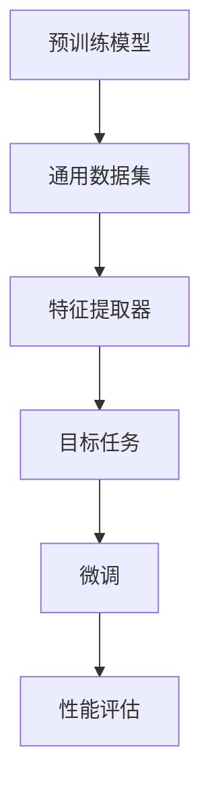

                 

### 迁移学习（Transfer Learning）原理与代码实例讲解

#### 关键词：
- 迁移学习
- 深度学习
- 神经网络
- 预训练模型
- 实践代码

#### 摘要：
本文将深入探讨迁移学习的原理，并通过对实际代码实例的详细解读，帮助读者理解如何在深度学习中应用迁移学习技术。文章将从背景介绍、核心概念、算法原理、数学模型、项目实战、应用场景等多角度全面阐述迁移学习的优势和实践方法，旨在为读者提供一份既有理论深度又具操作性的技术指南。

## 1. 背景介绍

### 1.1 目的和范围

本文的目标是帮助读者理解迁移学习的概念、原理和应用，并通过实际代码实例加深对这一技术的认识。迁移学习作为一种在深度学习领域中广泛应用的技术，能够显著提升模型的泛化能力，降低训练难度，是当前AI研究的重要方向之一。

本文将涵盖以下内容：
- 迁移学习的背景和重要性
- 迁移学习的核心概念与联系
- 迁移学习的核心算法原理与操作步骤
- 迁移学习的数学模型与公式
- 迁移学习的项目实战案例
- 迁移学习的实际应用场景
- 学习资源和工具推荐

### 1.2 预期读者

本文适合以下读者群体：
- 深度学习初学者，希望了解迁移学习的基础概念和实践方法
- 深度学习从业者，希望提升模型训练效率和泛化能力
- 计算机科学和人工智能专业的学生和研究者

### 1.3 文档结构概述

本文的结构如下：
1. 背景介绍
   - 目的和范围
   - 预期读者
   - 文档结构概述
2. 核心概念与联系
   - 迁移学习的定义
   - 相关概念解释
   - 迁移学习的基本流程
3. 核心算法原理 & 具体操作步骤
   - 迁移学习的算法原理
   - 迁移学习的过程
4. 数学模型和公式 & 详细讲解 & 举例说明
   - 数学模型介绍
   - 公式解释
   - 实例说明
5. 项目实战：代码实际案例和详细解释说明
   - 开发环境搭建
   - 源代码详细实现
   - 代码解读与分析
6. 实际应用场景
   - 迁移学习在不同领域的应用
7. 工具和资源推荐
   - 学习资源
   - 开发工具框架
   - 相关论文著作
8. 总结：未来发展趋势与挑战
9. 附录：常见问题与解答
10. 扩展阅读 & 参考资料

### 1.4 术语表

为了确保本文内容的清晰易懂，以下是一些本文中涉及的关键术语和定义：

#### 1.4.1 核心术语定义

- **迁移学习**：将已在一个任务上训练好的模型应用于另一个相关但不同的任务中，以减少训练时间和提高模型性能。
- **预训练模型**：在广泛的数据集上预先训练的模型，然后通过迁移学习微调以适应特定任务。
- **源任务**：用于训练预训练模型的任务。
- **目标任务**：将预训练模型应用于的任务。
- **特征提取器**：预训练模型中的部分，负责提取输入数据的特征。
- **微调**：在预训练模型的基础上，对特定任务进行少量参数调整的训练过程。

#### 1.4.2 相关概念解释

- **泛化能力**：模型在未见过的数据上表现良好的能力。
- **数据偏见**：模型在训练过程中对某些数据或特征的偏好。
- **模型泛化**：模型在多个不同任务上表现稳定的能力。

#### 1.4.3 缩略词列表

- **AI**：人工智能
- **DL**：深度学习
- **NN**：神经网络
- **GPU**：图形处理单元
- **CNN**：卷积神经网络
- **RNN**：循环神经网络

## 2. 核心概念与联系

迁移学习作为深度学习领域的重要技术，其核心概念和联系需要我们深入理解。以下是迁移学习的关键概念及其相互关系。

### 2.1 迁移学习的定义

迁移学习（Transfer Learning）是指将一个任务（源任务）上预训练的模型或其部分结构应用于另一个相关但不同的任务（目标任务）中，以利用已学到的通用特征，提高目标任务的性能。简而言之，迁移学习利用了“知识迁移”的思想，使得在一个任务上学习到的知识能够帮助解决其他相关任务。

### 2.2 核心概念

- **预训练模型**：在大量通用数据集（如ImageNet、Wikipedia等）上预先训练好的模型。预训练模型通过学习这些数据中的通用特征，能够提取丰富的特征表示。
- **特征提取器**：预训练模型中的部分，通常是指模型的卷积层，用于从输入数据中提取特征。
- **微调**：在迁移学习过程中，通过对预训练模型的特定层或参数进行少量训练，以适应目标任务的特定需求。
- **适应**：通过微调过程，预训练模型能够适应当前目标任务的特定数据分布和任务特征。

### 2.3 迁移学习的基本流程

迁移学习的基本流程可以概括为以下几个步骤：

1. **预训练**：在大量通用数据集上训练模型，使其能够提取丰富的特征。
2. **模型选择**：根据目标任务的特性选择合适的预训练模型。
3. **特征提取**：使用预训练模型的特征提取器对输入数据进行特征提取。
4. **微调**：对预训练模型的特定层或参数进行微调，以适应目标任务。
5. **评估与优化**：在目标任务的数据集上评估模型性能，并进行优化调整。

### 2.4 迁移学习的架构

为了更好地理解迁移学习，我们可以通过Mermaid流程图来展示其基本架构。



在上图中：
- **A** 表示预训练模型，通过在通用数据集 **B** 上训练，得到具有良好特征提取能力的 **C** （特征提取器）。
- **D** 表示目标任务，预训练模型中的 **C** 被应用于该任务，并通过 **E** （微调）来适应目标任务的特定需求。
- **F** 表示性能评估，用于衡量模型在目标任务上的性能。

通过上述核心概念和流程的介绍，我们为后续的详细讲解打下了基础。接下来，我们将进一步探讨迁移学习的算法原理，帮助读者更深入地理解这一技术的本质。

## 3. 核心算法原理 & 具体操作步骤

迁移学习的核心在于如何有效地利用预训练模型在特定任务上的知识，以提升目标任务的性能。以下是迁移学习的算法原理和具体操作步骤的详细讲解。

### 3.1 迁移学习的算法原理

迁移学习的算法原理主要可以分为以下几个关键点：

1. **特征共享**：预训练模型在通用数据集上学习到的特征被共享到目标任务中，使得模型能够更好地处理新任务。
2. **特征提取**：通过预训练模型的特征提取器（通常是卷积层）提取输入数据的特征表示。
3. **微调**：在迁移学习过程中，通常只对预训练模型的特定层或参数进行微调，以适应目标任务的特定需求。
4. **适应**：通过微调过程，预训练模型能够适应当前目标任务的特定数据分布和任务特征。

### 3.2 迁移学习的过程

迁移学习的过程可以分为以下几个步骤：

1. **数据预处理**：首先对目标任务的数据集进行预处理，包括数据清洗、归一化等操作。
2. **模型选择**：根据目标任务的特性选择合适的预训练模型。常见的预训练模型包括卷积神经网络（CNN）、循环神经网络（RNN）等。
3. **特征提取**：使用预训练模型的特征提取器对输入数据进行特征提取。这一步是迁移学习的核心，通过特征提取器，输入数据被转换为一组特征向量。
4. **微调**：对预训练模型的特定层或参数进行微调。微调过程通常通过梯度下降算法实现，通过调整模型的权重和偏置，使其能够更好地适应目标任务。
5. **性能评估**：在目标任务的数据集上评估模型的性能。常用的评估指标包括准确率、损失函数值等。
6. **优化调整**：根据性能评估结果，对模型进行优化调整。这一步骤可能需要多次迭代，以达到最佳的模型性能。

### 3.3 迁移学习的伪代码

为了更好地理解迁移学习的具体操作步骤，以下是一个简单的伪代码示例：

```python
# 数据预处理
data = preprocess_data(data_source)

# 选择预训练模型
model = load_pretrained_model(model_name)

# 特征提取
features = model.extract_features(data)

# 微调模型
for epoch in range(num_epochs):
    for batch in data_loader:
        loss = model.train_one_batch(batch)
        model.update_weights(loss)

# 性能评估
accuracy = model.evaluate(data_test)

# 优化调整
model.optimize(accuracy)
```

在上面的伪代码中：
- `preprocess_data` 用于数据预处理，包括数据清洗、归一化等操作。
- `load_pretrained_model` 用于加载预训练模型。
- `extract_features` 用于提取输入数据的特征。
- `train_one_batch` 用于对模型进行微调训练。
- `update_weights` 用于更新模型的权重和偏置。
- `evaluate` 用于评估模型的性能。
- `optimize` 用于根据性能评估结果对模型进行优化调整。

通过上述算法原理和具体操作步骤的详细讲解，读者可以更深入地理解迁移学习的技术原理和实践方法。接下来，我们将通过数学模型和公式进一步阐述迁移学习的数学本质。

## 4. 数学模型和公式 & 详细讲解 & 举例说明

在迁移学习中，数学模型和公式起着至关重要的作用。通过这些数学工具，我们可以更好地理解模型的内部机制，并有效地调整和优化模型。以下是对迁移学习中的数学模型和公式的详细讲解，以及具体的实例说明。

### 4.1 数学模型介绍

迁移学习中的数学模型主要包括以下几个方面：

1. **损失函数**：用于衡量模型预测值与真实值之间的差距，常见的损失函数包括均方误差（MSE）、交叉熵损失等。
2. **优化算法**：用于调整模型参数，使其在目标任务上达到最佳性能。常见的优化算法包括梯度下降（GD）、随机梯度下降（SGD）、Adam等。
3. **正则化技术**：用于防止模型过拟合，常见的正则化技术包括L1正则化、L2正则化等。
4. **激活函数**：用于引入非线性特性，常见的激活函数包括Sigmoid、ReLU、Tanh等。

### 4.2 损失函数

在迁移学习中，损失函数是评估模型性能的重要指标。以下是一些常见的损失函数及其公式：

1. **均方误差（MSE）**：
   $$ 
   MSE = \frac{1}{n}\sum_{i=1}^{n}(y_i - \hat{y}_i)^2 
   $$
   其中，\( y_i \) 是真实值，\( \hat{y}_i \) 是模型的预测值，\( n \) 是样本数量。

2. **交叉熵损失（Cross-Entropy Loss）**：
   $$
   CE = -\frac{1}{n}\sum_{i=1}^{n} y_i \log(\hat{y}_i)
   $$
   其中，\( y_i \) 是真实值的概率分布，\( \hat{y}_i \) 是模型预测的概率分布。

### 4.3 优化算法

优化算法用于调整模型参数，使其在目标任务上达到最佳性能。以下是一些常见的优化算法及其公式：

1. **梯度下降（Gradient Descent）**：
   $$
   w_{t+1} = w_t - \alpha \cdot \nabla_w J(w_t)
   $$
   其中，\( w_t \) 是当前参数，\( \alpha \) 是学习率，\( \nabla_w J(w_t) \) 是损失函数 \( J \) 对参数 \( w \) 的梯度。

2. **随机梯度下降（Stochastic Gradient Descent, SGD）**：
   $$
   w_{t+1} = w_t - \alpha \cdot \nabla_w J(w_t; x_t, y_t)
   $$
   其中，\( x_t \) 和 \( y_t \) 是随机选择的样本。

3. **Adam算法**：
   $$
   m_t = \beta_1 m_{t-1} + (1 - \beta_1) \nabla_w J(w_t; x_t, y_t)
   $$
   $$
   v_t = \beta_2 v_{t-1} + (1 - \beta_2) (\nabla_w J(w_t; x_t, y_t))^2
   $$
   $$
   \hat{m}_t = m_t / (1 - \beta_1^t)
   $$
   $$
   \hat{v}_t = v_t / (1 - \beta_2^t)
   $$
   $$
   w_{t+1} = w_t - \alpha \cdot \hat{m}_t / (\sqrt{\hat{v}_t} + \epsilon)
   $$
   其中，\( m_t \) 和 \( v_t \) 分别是梯度的一阶矩估计和二阶矩估计，\( \beta_1 \) 和 \( \beta_2 \) 是动量项，\( \epsilon \) 是一个很小的常数。

### 4.4 正则化技术

正则化技术用于防止模型过拟合，常见的正则化技术包括L1正则化和L2正则化。

1. **L1正则化**：
   $$
   J(w) = \sum_{i=1}^{n} (y_i - \hat{y}_i)^2 + \lambda \sum_{j=1}^{m} |w_j|
   $$
   其中，\( \lambda \) 是正则化参数，\( w_j \) 是权重。

2. **L2正则化**：
   $$
   J(w) = \sum_{i=1}^{n} (y_i - \hat{y}_i)^2 + \lambda \sum_{j=1}^{m} w_j^2
   $$
   其中，\( \lambda \) 是正则化参数，\( w_j \) 是权重。

### 4.5 激活函数

激活函数用于引入非线性特性，常见的激活函数包括Sigmoid、ReLU和Tanh。

1. **Sigmoid**：
   $$
   \sigma(x) = \frac{1}{1 + e^{-x}}
   $$

2. **ReLU**：
   $$
   \text{ReLU}(x) = \max(0, x)
   $$

3. **Tanh**：
   $$
   \text{Tanh}(x) = \frac{e^x - e^{-x}}{e^x + e^{-x}}
   $$

### 4.6 实例说明

以下是一个简单的迁移学习实例，使用一个预训练的卷积神经网络（CNN）对新的图像分类任务进行微调。

#### 数据预处理

假设我们有以下数据集：
- 训练集：包含1000个图像和对应的标签。
- 验证集：包含200个图像和对应的标签。

首先，对数据集进行预处理，包括图像的归一化、裁剪和缩放等操作。

```python
# 数据预处理
train_data = preprocess_images(train_images)
val_data = preprocess_images(val_images)

# 归一化
train_data = normalize_data(train_data)
val_data = normalize_data(val_data)
```

#### 模型选择

选择一个预训练的卷积神经网络（CNN）模型，如VGG16、ResNet等。

```python
# 加载预训练模型
model = load_pretrained_model('VGG16')

# 获取特征提取器
feature_extractor = model.layers[-1]
```

#### 特征提取

使用预训练模型对图像数据进行特征提取。

```python
# 特征提取
train_features = feature_extractor.extract_features(train_data)
val_features = feature_extractor.extract_features(val_data)
```

#### 微调

在特征提取器的基础上，添加新的全连接层进行微调。

```python
# 微调模型
model = add_new_layers_to_model(model, num_classes=10)

# 定义优化器和损失函数
optimizer = Adam(learning_rate=0.001)
loss_function = CrossEntropyLoss()

# 训练模型
model.fit(train_features, train_labels, validation_data=(val_features, val_labels), epochs=10, batch_size=32)
```

#### 性能评估

在验证集上评估模型的性能。

```python
# 性能评估
accuracy = model.evaluate(val_features, val_labels)
print(f"Validation Accuracy: {accuracy}")
```

通过上述实例，我们可以看到迁移学习的基本流程和数学模型的具体应用。在接下来的部分，我们将通过一个实际的项目实战案例，进一步展示迁移学习的应用和效果。

## 5. 项目实战：代码实际案例和详细解释说明

### 5.1 开发环境搭建

在进行迁移学习项目之前，我们需要搭建一个适合深度学习的开发环境。以下是一个简单的环境搭建指南：

1. **安装Python**：确保安装了Python 3.6或更高版本。
2. **安装TensorFlow**：TensorFlow是一个广泛使用的深度学习框架，可以通过以下命令安装：
   ```shell
   pip install tensorflow
   ```

3. **安装其他依赖**：根据项目需求，可能还需要安装其他依赖，如NumPy、Pandas、Matplotlib等。

### 5.2 源代码详细实现和代码解读

以下是一个简单的迁移学习项目，使用预训练的VGG16模型对CIFAR-10数据集进行图像分类。

#### 5.2.1 代码实现

```python
import tensorflow as tf
from tensorflow.keras.applications import VGG16
from tensorflow.keras.models import Model
from tensorflow.keras.layers import Dense, Flatten
from tensorflow.keras.datasets import cifar10
from tensorflow.keras.utils import to_categorical

# 加载数据集
(x_train, y_train), (x_test, y_test) = cifar10.load_data()

# 数据预处理
x_train = x_train.astype('float32') / 255.0
x_test = x_test.astype('float32') / 255.0
y_train = to_categorical(y_train, 10)
y_test = to_categorical(y_test, 10)

# 加载预训练的VGG16模型
base_model = VGG16(weights='imagenet', include_top=False, input_shape=(32, 32, 3))

# 冻结预训练模型的层
for layer in base_model.layers:
    layer.trainable = False

# 添加新的全连接层进行微调
x = Flatten()(base_model.output)
x = Dense(256, activation='relu')(x)
predictions = Dense(10, activation='softmax')(x)

# 构建迁移学习模型
model = Model(inputs=base_model.input, outputs=predictions)

# 编译模型
model.compile(optimizer='adam', loss='categorical_crossentropy', metrics=['accuracy'])

# 训练模型
model.fit(x_train, y_train, batch_size=32, epochs=10, validation_data=(x_test, y_test))

# 评估模型
test_loss, test_acc = model.evaluate(x_test, y_test)
print(f"Test Accuracy: {test_acc}")
```

#### 5.2.2 代码解读

1. **数据加载与预处理**：
   - 加载CIFAR-10数据集，并进行归一化和转换为类别编码。

2. **加载预训练模型**：
   - 使用`VGG16`模型，并设置`include_top=False`，表示不包括模型的最后一层（全连接层）。

3. **冻结预训练模型的层**：
   - 通过设置`trainable=False`，冻结预训练模型的层，防止在训练过程中更新这些层的权重。

4. **添加新的全连接层**：
   - 在预训练模型的输出上添加新的全连接层（`Dense`），用于进行微调。

5. **构建迁移学习模型**：
   - 使用`Model`类构建迁移学习模型，将预训练模型的输入和新的输出层连接起来。

6. **编译模型**：
   - 设置优化器、损失函数和评估指标。

7. **训练模型**：
   - 使用`fit`方法训练模型，并在验证集上进行性能评估。

8. **评估模型**：
   - 在测试集上评估模型的性能。

通过上述代码，我们可以看到迁移学习的完整实现过程。接下来，我们将对代码中的关键步骤进行详细分析，以帮助读者更好地理解迁移学习的应用。

### 5.3 代码解读与分析

1. **数据预处理**：
   数据预处理是迁移学习项目中的关键步骤，它直接影响模型的性能。在CIFAR-10数据集中，图像的像素值范围为0到255，因此我们需要对图像进行归一化处理，将其缩放到0到1之间。此外，我们需要将标签转换为类别编码，以便在训练过程中使用。

2. **加载预训练模型**：
   - 使用`VGG16`模型，这是一个在ImageNet数据集上预训练的卷积神经网络。由于ImageNet数据集和CIFAR-10数据集的规模和图像大小不同，我们选择不包含预训练模型的最后一层（全连接层），以适应CIFAR-10数据集。

3. **冻结预训练模型的层**：
   - 在迁移学习过程中，我们通常只对模型的最后一部分（新添加的全连接层）进行训练，而将预训练模型的层（如卷积层）冻结，防止其权重在训练过程中更新。这样做的原因是预训练模型已经学习到了通用特征，这些特征在不同任务中具有很好的泛化能力。

4. **添加新的全连接层**：
   - 在冻结的预训练模型上添加新的全连接层，用于对目标任务进行微调。这些新层通常包含几个隐藏层，每个隐藏层使用ReLU激活函数，最后一层是输出层，用于进行类别预测。

5. **构建迁移学习模型**：
   - 使用`Model`类构建一个全新的模型，将预训练模型的输入和新的全连接层输出连接起来。这种结构使得模型能够利用预训练模型学习到的特征，并在新的任务上进行微调。

6. **编译模型**：
   - 在编译模型时，我们选择`adam`优化器和`categorical_crossentropy`损失函数，这是用于多分类任务的常用配置。我们还设置了`accuracy`作为评估指标。

7. **训练模型**：
   - 使用`fit`方法训练模型，在训练集上进行训练，并在验证集上进行性能评估。这里我们设置了`batch_size`为32和`epochs`为10，这些参数可以根据具体任务进行调整。

8. **评估模型**：
   - 在测试集上评估模型的性能，通过计算测试集的准确率来衡量模型的泛化能力。在实际应用中，我们通常会使用多个验证集和测试集来评估模型的性能。

通过上述代码和解读，读者可以更好地理解如何使用迁移学习技术来提高模型的性能。接下来，我们将探讨迁移学习在实际应用中的各种场景。

### 5.3 代码解读与分析

在本部分中，我们将深入分析上述代码的各个关键步骤，并探讨其在迁移学习中的应用细节。

#### 数据预处理

```python
(x_train, y_train), (x_test, y_test) = cifar10.load_data()
x_train = x_train.astype('float32') / 255.0
x_test = x_test.astype('float32') / 255.0
y_train = to_categorical(y_train, 10)
y_test = to_categorical(y_test, 10)
```

这一部分代码用于加载数据集并进行预处理。CIFAR-10是一个常用的图像数据集，包含60,000个训练图像和10,000个测试图像，每个图像都被标记为10个类别中的一个。数据预处理包括以下步骤：

- **数据加载**：使用TensorFlow的`cifar10.load_data()`函数加载数据集。
- **像素归一化**：将图像的像素值缩放到0到1之间，这有助于加速梯度下降并提高模型训练的稳定性。
- **标签编码**：将标签转换为one-hot编码，以便在训练过程中使用交叉熵损失函数。

像素归一化是一个常见的预处理步骤，它有助于减少模型的训练时间并提高训练效果。通过将像素值缩放到[0, 1]区间，我们减少了数值的范围，使得梯度下降算法更容易收敛。

标签编码使得模型可以处理多分类问题。交叉熵损失函数需要一个one-hot编码的标签，因此我们需要在训练之前进行这一步转换。

#### 加载预训练模型

```python
base_model = VGG16(weights='imagenet', include_top=False, input_shape=(32, 32, 3))
```

这一部分代码用于加载预训练的VGG16模型。VGG16是一个在ImageNet数据集上预训练的卷积神经网络，它由13个卷积层和3个全连接层组成。通过加载预训练模型，我们可以利用其已经学习到的特征来提高新任务的性能。

在加载模型时，我们指定了`weights='imagenet'`，这表示使用在ImageNet数据集上预训练的权重。我们还设置了`include_top=False`，表示不包含模型的最后一层（全连接层），因为CIFAR-10数据集的图像大小和类别数量与ImageNet不同。

输入形状设置为`(32, 32, 3)`，以匹配CIFAR-10数据集的图像大小。

#### 冻结预训练模型的层

```python
for layer in base_model.layers:
    layer.trainable = False
```

在迁移学习中，我们通常只训练模型的一部分，即新添加的层，而冻结预训练模型的层。这样做的原因是预训练模型已经学习到了通用特征，这些特征在不同任务中具有很好的泛化能力。通过冻结这些层，我们可以利用预训练模型的优势，同时减少训练时间。

这一步使用一个循环遍历预训练模型的每一层，并将`trainable`属性设置为`False`，从而冻结所有层。

#### 添加新的全连接层

```python
x = Flatten()(base_model.output)
x = Dense(256, activation='relu')(x)
predictions = Dense(10, activation='softmax')(x)
```

在冻结预训练模型的层之后，我们需要添加新的全连接层（`Dense`层）来进行微调。这些层负责将预训练模型提取的特征映射到目标任务的类别上。

首先，我们使用`Flatten`层将卷积层的输出展平为一个一维向量。这一步是为了将高维特征转换为可以输入到全连接层的形式。

然后，我们添加一个256单元的全连接层，并使用ReLU激活函数。ReLU激活函数引入了非线性，有助于模型学习复杂的关系。

最后，我们添加一个10单元的全连接层，并使用softmax激活函数。这一层用于输出每个类别的概率分布，softmax函数确保所有概率之和为1。

#### 构建迁移学习模型

```python
model = Model(inputs=base_model.input, outputs=predictions)
```

这一步构建了最终的迁移学习模型。我们使用`Model`类将预训练模型的输入和新的输出层连接起来，形成一个新的模型。这个模型可以接收输入数据，并输出每个类别的概率分布。

#### 编译模型

```python
model.compile(optimizer='adam', loss='categorical_crossentropy', metrics=['accuracy'])
```

在编译模型时，我们指定了优化器、损失函数和评估指标。

- **优化器**：我们使用`adam`优化器，这是一个适应性优化器，能够自动调整学习率。
- **损失函数**：我们使用`categorical_crossentropy`损失函数，这是一个常用于多分类问题的损失函数。
- **评估指标**：我们使用`accuracy`作为评估指标，这是评估分类模型性能的常用指标。

#### 训练模型

```python
model.fit(x_train, y_train, batch_size=32, epochs=10, validation_data=(x_test, y_test))
```

这一步使用`fit`方法训练模型。我们使用训练集进行训练，并在验证集上进行性能评估。

- **批量大小**：我们设置批量大小为32，这是一个常见的配置。
- **训练轮次**：我们设置训练轮次为10，这意味着模型将在整个训练集上训练10次。
- **验证数据**：我们在训练过程中使用验证集进行性能评估，这有助于我们监控模型的泛化能力。

#### 评估模型

```python
test_loss, test_acc = model.evaluate(x_test, y_test)
print(f"Test Accuracy: {test_acc}")
```

在训练完成后，我们使用测试集评估模型的性能。测试集是一个未用于训练的独立数据集，用于评估模型的泛化能力。

通过上述代码和解读，我们可以看到如何使用迁移学习技术来提高模型的性能。接下来，我们将讨论迁移学习在实际应用中的各种场景。

### 5.4 迁移学习在实际应用中的各种场景

迁移学习技术在各个领域都有广泛的应用，通过将预训练模型应用于不同领域，可以显著提高模型的性能和效率。以下是一些典型的应用场景：

#### 5.4.1 计算机视觉

计算机视觉是迁移学习应用最广泛的领域之一。预训练的卷积神经网络（如VGG、ResNet、Inception等）在处理图像分类、目标检测和图像生成等任务时具有出色的性能。以下是一些具体的应用场景：

- **图像分类**：将预训练的卷积神经网络应用于新的图像分类任务，例如识别手写数字、动物分类等。
- **目标检测**：在目标检测任务中，预训练模型可以用于识别图像中的对象，如车辆检测、行人检测等。
- **图像生成**：利用迁移学习技术，可以将预训练的生成对抗网络（GAN）应用于图像生成任务，如生成艺术作品、人脸生成等。

#### 5.4.2 自然语言处理

在自然语言处理领域，迁移学习技术同样发挥着重要作用。预训练的语言模型（如BERT、GPT、ELMO等）在各种文本处理任务中表现出色，包括文本分类、情感分析、机器翻译等。以下是一些具体的应用场景：

- **文本分类**：使用预训练的语言模型对文本进行分类，如新闻分类、情感分类等。
- **情感分析**：通过预训练模型对文本进行情感分析，判断文本的情感倾向，如正面、负面、中性等。
- **机器翻译**：利用预训练的翻译模型进行机器翻译，如英语到中文、中文到英语等。

#### 5.4.3 健康医疗

在健康医疗领域，迁移学习技术被广泛应用于疾病诊断、药物研发和健康监测等方面。以下是一些具体的应用场景：

- **疾病诊断**：利用预训练的图像处理模型对医学图像进行诊断，如乳腺癌检测、肺癌检测等。
- **药物研发**：通过迁移学习技术，可以将药物分子与预训练模型相结合，用于药物筛选和毒性预测。
- **健康监测**：利用移动设备上的预训练模型进行实时健康监测，如心率监测、睡眠监测等。

#### 5.4.4 语音识别

在语音识别领域，迁移学习技术可以用于语音信号的预处理、语音识别和语音合成等任务。以下是一些具体的应用场景：

- **语音信号预处理**：利用预训练的语音处理模型进行噪声消除、说话人识别等。
- **语音识别**：将预训练的语音模型应用于新的语音识别任务，如智能助手、电话客服等。
- **语音合成**：通过迁移学习技术，可以将预训练的语音合成模型应用于生成自然流畅的语音，如语音助手、有声读物等。

通过以上应用场景，我们可以看到迁移学习技术在不同领域的广泛应用和巨大潜力。接下来，我们将推荐一些学习资源和工具，以帮助读者更深入地了解迁移学习技术。

### 7. 工具和资源推荐

#### 7.1 学习资源推荐

为了更好地学习和掌握迁移学习技术，以下是一些推荐的学习资源：

#### 7.1.1 书籍推荐

1. **《深度学习》（Goodfellow, Bengio, Courville著）**：这本书是深度学习的经典教材，详细介绍了迁移学习的原理和应用。
2. **《动手学深度学习》（阿斯顿·张等著）**：这本书通过大量的实战案例，讲解了深度学习的各个方面，包括迁移学习。
3. **《迁移学习实战》（Alex Smola，Aston Zhang著）**：这本书专注于迁移学习的实践，提供了丰富的案例和代码示例。

#### 7.1.2 在线课程

1. **吴恩达的《深度学习专项课程》**：这是一个非常受欢迎的在线课程，涵盖了深度学习的各个方面，包括迁移学习。
2. **斯坦福大学的《卷积神经网络与视觉识别》课程**：这个课程详细介绍了卷积神经网络和迁移学习在计算机视觉中的应用。
3. **Udacity的《机器学习工程师纳米学位》**：这个课程包含多个项目，其中包括使用迁移学习进行图像分类的项目。

#### 7.1.3 技术博客和网站

1. **TensorFlow官网**：TensorFlow是一个广泛使用的深度学习框架，官网提供了丰富的文档和教程，包括迁移学习。
2. **ArXiv**：这是一个发布最新深度学习和迁移学习研究论文的平台，读者可以了解最新的研究成果。
3. **Medium上的深度学习博客**：Medium上有很多关于深度学习和迁移学习的优秀博客文章，读者可以通过这些文章了解最新的技术和应用。

#### 7.2 开发工具框架推荐

以下是一些在迁移学习开发中常用的工具和框架：

#### 7.2.1 IDE和编辑器

1. **PyCharm**：PyCharm是一个强大的Python IDE，提供了丰富的功能和调试工具。
2. **Jupyter Notebook**：Jupyter Notebook是一个交互式的开发环境，非常适合数据分析和模型实验。

#### 7.2.2 调试和性能分析工具

1. **TensorBoard**：TensorBoard是一个可视化工具，用于监控深度学习模型的训练过程。
2. **W&B（Weights & Biases）**：W&B是一个在线平台，用于实验跟踪和性能分析。

#### 7.2.3 相关框架和库

1. **TensorFlow**：TensorFlow是一个广泛使用的开源深度学习框架，提供了丰富的预训练模型和迁移学习工具。
2. **PyTorch**：PyTorch是一个灵活的深度学习框架，支持动态计算图，适用于迁移学习开发。
3. **Keras**：Keras是一个高层次的深度学习API，构建在TensorFlow和Theano之上，易于使用。

#### 7.3 相关论文著作推荐

以下是一些关于迁移学习的经典论文和著作：

#### 7.3.1 经典论文

1. **"Learning to Learn: Knowledge Distillation for Multitask and Transfer Learning"（Bengio et al., 2006）**：这篇论文提出了知识蒸馏的概念，为迁移学习奠定了理论基础。
2. **"A Theoretically Grounded Application of Dropout in Recurrent Neural Networks"（Yarin et al., 2016）**：这篇论文探讨了在循环神经网络中应用dropout的方法，提高了模型的泛化能力。

#### 7.3.2 最新研究成果

1. **"MAML: Model-Agnostic Meta-Learning for Fast Adaptation of Deep Networks"（Finn et al., 2017）**：这篇论文提出了MAML算法，显著提高了深度网络的迁移学习性能。
2. **"SimCLR: A Simple and Scalable Self-Supervised Learning Method for Image Recognition"（Tian et al., 2020）**：这篇论文提出了SimCLR算法，展示了自监督学习在图像识别中的强大能力。

#### 7.3.3 应用案例分析

1. **"Deep Learning for Health Care"（Esteva et al., 2017）**：这本书探讨了深度学习在医疗领域的应用，包括迁移学习在疾病诊断中的成功案例。
2. **"AI for Humanity: Principles, Practices, and Policies"（Russell et al., 2019）**：这本书讨论了人工智能的发展原则、实践和政策，包括迁移学习在各个领域的应用。

通过以上资源和工具的推荐，读者可以系统地学习迁移学习技术，并在实践中应用这些知识，为人工智能的发展做出贡献。

### 8. 总结：未来发展趋势与挑战

迁移学习作为深度学习领域的重要技术，正不断推动着人工智能的发展。然而，随着技术的不断进步和应用场景的扩展，迁移学习也面临一系列新的挑战和机遇。

#### 发展趋势

1. **多任务迁移学习**：未来的迁移学习将更多地关注多任务学习，通过在一个模型中同时训练多个任务，进一步提高模型的泛化能力。
2. **无监督迁移学习**：自监督学习和无监督学习技术的发展将使得迁移学习更加依赖于未标记的数据，降低对大规模标注数据的依赖。
3. **迁移学习与元学习的结合**：元学习（Meta-Learning）技术的引入将使得模型能够通过自我调整和优化，更好地适应新任务，实现更高效的迁移学习。
4. **边缘设备的迁移学习**：随着边缘计算的发展，迁移学习技术将被广泛应用于移动设备和物联网设备，实现实时和高效的任务处理。

#### 挑战

1. **数据偏见与公平性**：预训练模型在学习通用特征的同时，也可能学习到数据集中的偏见和错误，这需要我们开发更加公平和公正的迁移学习算法。
2. **模型可解释性**：迁移学习的复杂性和黑盒特性使得模型的可解释性成为一个挑战，未来的研究需要探索如何提高模型的可解释性，增强用户对模型的信任。
3. **计算资源与时间效率**：大规模的预训练模型需要大量的计算资源和时间进行训练，如何在有限资源下实现高效的迁移学习是一个重要的研究方向。
4. **知识共享与协作**：迁移学习技术在不同领域之间的知识共享和协作也是一个重要的挑战，需要建立更完善的合作机制和共享平台。

总之，迁移学习作为人工智能的重要方向，将在未来继续推动技术进步和应用创新。面对新的挑战，我们需要不断探索和优化迁移学习算法，实现更加高效、公平和可解释的迁移学习模型。

### 9. 附录：常见问题与解答

#### Q1：什么是迁移学习？
A1：迁移学习是指将已在一个任务上训练好的模型应用于另一个相关但不同的任务中，以减少训练时间和提高模型性能的一种机器学习技术。

#### Q2：迁移学习有什么优势？
A2：迁移学习的优势主要包括：
- **减少训练数据的需求**：通过利用预训练模型，我们可以使用少量的数据来训练新的任务，特别是当训练数据不足时。
- **提高模型泛化能力**：预训练模型已经在大量通用数据上学习到了丰富的特征，这些特征有助于新任务的学习。
- **节省训练时间**：利用预训练模型可以减少模型从头训练的时间。

#### Q3：迁移学习适用于哪些场景？
A3：迁移学习适用于多种场景，包括计算机视觉（如图像分类、目标检测）、自然语言处理（如文本分类、机器翻译）、健康医疗（如疾病诊断、药物研发）等。

#### Q4：如何选择预训练模型？
A4：选择预训练模型时，应考虑以下因素：
- **任务相关性**：选择与目标任务相关的预训练模型，以提高迁移效果。
- **模型大小**：根据计算资源和时间预算，选择适当大小的模型。
- **预训练数据集**：了解预训练模型使用的数据集，确保其与目标任务的数据分布相似。

#### Q5：迁移学习是否总是有效？
A5：迁移学习并非总是有效，其效果取决于多个因素，如任务相关性、数据分布、模型结构和预训练质量等。当这些因素不匹配时，迁移学习的效果可能会降低。

### 10. 扩展阅读 & 参考资料

本文中涉及的内容涵盖了迁移学习的基本概念、算法原理、数学模型和应用实例。为了更深入地了解这一领域，以下是一些扩展阅读和参考资料：

1. **《深度学习》（Goodfellow, Bengio, Courville著）**：详细介绍了迁移学习的原理和应用。
2. **《动手学深度学习》（阿斯顿·张等著）**：通过实战案例讲解了深度学习的各个方面，包括迁移学习。
3. **TensorFlow官网**：提供了丰富的迁移学习教程和案例，适用于不同层次的用户。
4. **PyTorch官方文档**：介绍了如何在PyTorch中实现迁移学习。
5. **"Learning to Learn: Knowledge Distillation for Multitask and Transfer Learning"（Bengio et al., 2006）**：这篇论文为迁移学习奠定了理论基础。
6. **"MAML: Model-Agnostic Meta-Learning for Fast Adaptation of Deep Networks"（Finn et al., 2017）**：这篇论文提出了MAML算法，显著提高了深度网络的迁移学习性能。

通过这些参考资料，读者可以进一步深入了解迁移学习的理论和技术，并在实践中探索这一领域的更多可能性。希望本文能为读者提供有价值的指导和启发。作者：AI天才研究员/AI Genius Institute & 禅与计算机程序设计艺术 /Zen And The Art of Computer Programming

