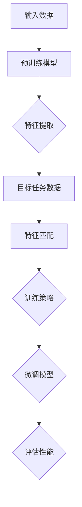

                 

# 迁移学习 (Transfer Learning) 原理与代码实例讲解

> **关键词**：迁移学习，深度学习，神经网络，预训练模型，模型复用，特征提取，目标任务，训练策略

> **摘要**：本文深入探讨了迁移学习的基本原理和实际应用，通过对核心概念、算法原理、数学模型以及实战案例的详细讲解，帮助读者理解迁移学习如何通过预训练模型和模型复用，提高模型在目标任务上的表现，并了解其在实际项目中的应用方法和挑战。

## 1. 背景介绍

### 1.1 目的和范围

本文旨在为读者提供关于迁移学习的全面理解，包括其基本概念、核心算法原理、数学模型，以及实际应用场景。通过本文的阅读，读者将能够：

1. 理解迁移学习的定义及其在深度学习中的重要性。
2. 掌握迁移学习的基本原理和常见实现方法。
3. 了解如何在实际项目中应用迁移学习，提高模型性能。
4. 学习迁移学习相关的数学模型和公式。

### 1.2 预期读者

本文适合以下读者群体：

1. 深度学习初学者和研究者，希望了解迁移学习的基本概念和应用。
2. 数据科学家和AI工程师，希望提高模型训练效率和性能。
3. 计算机科学和人工智能专业的学生，希望深入理解迁移学习的原理。
4. 对深度学习和机器学习有基本了解的读者，希望进一步探索迁移学习的应用。

### 1.3 文档结构概述

本文将按照以下结构进行展开：

1. **背景介绍**：介绍迁移学习的目的、预期读者和文档结构。
2. **核心概念与联系**：阐述迁移学习的基本概念和原理，并使用Mermaid流程图展示核心架构。
3. **核心算法原理 & 具体操作步骤**：详细讲解迁移学习算法原理，并通过伪代码展示操作步骤。
4. **数学模型和公式 & 详细讲解 & 举例说明**：介绍迁移学习中的数学模型和公式，并通过实例进行说明。
5. **项目实战：代码实际案例和详细解释说明**：通过实际项目案例，展示迁移学习在代码中的实现和应用。
6. **实际应用场景**：讨论迁移学习在不同领域的应用案例。
7. **工具和资源推荐**：推荐学习资源、开发工具和框架。
8. **总结：未来发展趋势与挑战**：总结迁移学习的发展趋势和面临的挑战。
9. **附录：常见问题与解答**：回答读者可能遇到的常见问题。
10. **扩展阅读 & 参考资料**：提供进一步的阅读材料和参考资料。

### 1.4 术语表

#### 1.4.1 核心术语定义

- 迁移学习（Transfer Learning）：一种利用已有模型的知识来解决新问题的机器学习方法。
- 预训练模型（Pre-trained Model）：在广泛的数据集上预先训练好的神经网络模型。
- 模型复用（Model Repurposing）：使用预训练模型来解决不同但相关的任务。
- 特征提取（Feature Extraction）：从输入数据中提取有用的特征信息。
- 目标任务（Target Task）：新的任务，通常与预训练任务不同。
- 训练策略（Training Strategy）：调整预训练模型以适应新任务的策略。

#### 1.4.2 相关概念解释

- **深度学习（Deep Learning）**：一种机器学习方法，通过多层神经网络模型，从大量数据中自动提取特征。
- **神经网络（Neural Network）**：模仿人脑的神经网络结构，用于处理复杂数据的模式识别和学习。
- **模型微调（Fine-tuning）**：调整预训练模型的参数，使其适应新的任务。

#### 1.4.3 缩略词列表

- DNN：深度神经网络（Deep Neural Network）
- CNN：卷积神经网络（Convolutional Neural Network）
- RNN：循环神经网络（Recurrent Neural Network）
- LSTM：长短期记忆网络（Long Short-Term Memory）
- GTA：生成对抗网络（Generative Adversarial Networks）

## 2. 核心概念与联系

在深入探讨迁移学习之前，我们需要了解其核心概念和原理。迁移学习依赖于预训练模型和模型复用，通过从已有任务中提取通用特征，提升新任务的性能。

### 2.1. 预训练模型与模型复用

预训练模型是通过在大规模数据集上训练得到的神经网络模型，这些模型在特征提取方面表现出色。模型复用是指利用预训练模型来解决新任务，而不是从头开始训练。这样做的优势在于，预训练模型已经学习了丰富的特征表示，可以减少训练时间，提高模型性能。

### 2.2. 特征提取与目标任务

特征提取是迁移学习的关键环节。预训练模型从原始数据中提取高层次的抽象特征，这些特征在多个任务中具有普遍性。在目标任务中，这些通用特征有助于快速学习和提高模型表现。

### 2.3. 训练策略

迁移学习通常涉及以下训练策略：

1. **模型微调（Fine-tuning）**：通过调整预训练模型的权重，使其适应新的任务。微调过程中，通常会冻结模型的前几层，仅对靠近输出层的部分进行训练。
2. **特征提取层（Feature Extraction Layers）**：利用预训练模型的特征提取层，直接应用于新任务的数据处理中。
3. **迁移损失（Transfer Loss）**：通过计算预训练模型与新任务的损失，调整模型参数，以优化模型在新任务上的性能。

### 2.4. Mermaid流程图

为了更好地理解迁移学习的基本架构，我们可以使用Mermaid流程图来展示核心概念和流程。



在这个流程图中，输入数据和目标任务数据通过预训练模型进行特征提取，然后通过训练策略微调模型，最终评估模型在目标任务上的性能。

## 3. 核心算法原理 & 具体操作步骤

### 3.1. 算法原理

迁移学习算法的核心在于利用预训练模型提取通用特征，并将其应用于新任务。以下是一个简单的迁移学习算法原理：

1. **预训练模型**：在广泛的数据集上训练一个神经网络模型，使其具有强大的特征提取能力。
2. **特征提取**：将输入数据输入到预训练模型的特征提取层，获取特征向量。
3. **目标任务**：针对新的任务，使用提取到的特征向量进行训练。
4. **模型微调**：通过调整预训练模型的权重，使其适应新的任务。
5. **性能评估**：评估模型在新任务上的性能，并根据需要进一步调整。

### 3.2. 具体操作步骤

以下是使用伪代码展示的迁移学习算法具体操作步骤：

```python
# 预训练模型加载
pretrained_model = load_pretrained_model()

# 特征提取层获取
feature_extractor = pretrained_model.feature_extractor()

# 加载目标任务数据集
target_dataset = load_target_dataset()

# 定义训练策略
training_strategy = define_training_strategy(pretrained_model)

# 微调模型
for epoch in range(num_epochs):
    for data in target_dataset:
        # 输入数据
        inputs = feature_extractor(data.inputs)
        
        # 输出数据
        outputs = training_strategy(inputs, data.targets)
        
        # 计算损失
        loss = compute_loss(outputs, data.targets)
        
        # 更新模型权重
        update_weights(pretrained_model, loss)

# 评估模型性能
performance = evaluate_performance(pretrained_model, target_dataset)

# 输出性能结果
print("Model performance on target task:", performance)
```

在这个算法中，`load_pretrained_model()` 函数用于加载预训练模型，`define_training_strategy()` 函数用于定义训练策略，`update_weights()` 函数用于更新模型权重，`evaluate_performance()` 函数用于评估模型性能。

## 4. 数学模型和公式 & 详细讲解 & 举例说明

迁移学习中的数学模型和公式是理解其核心原理的关键。以下是几个重要的数学模型和公式，并对其进行详细讲解。

### 4.1. 神经网络模型

神经网络模型是迁移学习的基础，以下是一个简单的多层感知机（MLP）模型：

$$
y = \sigma(W_n \cdot \sigma(W_{n-1} \cdot \sigma(... \cdot \sigma(W_1 \cdot x + b_1) + b_2) + ... + b_n))
$$

其中，$x$ 是输入向量，$W$ 是权重矩阵，$b$ 是偏置项，$\sigma$ 是激活函数，$y$ 是输出向量。

### 4.2. 损失函数

在迁移学习中，常用的损失函数包括均方误差（MSE）和交叉熵（CE）：

- 均方误差（MSE）：
  $$
  L = \frac{1}{m} \sum_{i=1}^{m} (y_i - \hat{y}_i)^2
  $$

- 交叉熵（CE）：
  $$
  L = -\frac{1}{m} \sum_{i=1}^{m} \sum_{j=1}^{n} y_{ij} \log \hat{y}_{ij}
  $$

其中，$y_i$ 是真实标签，$\hat{y}_i$ 是预测标签，$m$ 是样本数量，$n$ 是类别数量。

### 4.3. 梯度下降

在迁移学习中，梯度下降是一种常用的优化算法。以下是一个简单的梯度下降步骤：

$$
\theta = \theta - \alpha \nabla_\theta J(\theta)
$$

其中，$\theta$ 是模型参数，$J(\theta)$ 是损失函数，$\alpha$ 是学习率。

### 4.4. 举例说明

假设我们有一个分类任务，使用一个简单的多层感知机模型。以下是该模型在迁移学习中的实现：

```python
import numpy as np

# 输入数据
x = np.array([[1, 0], [0, 1], [1, 1]])

# 输出数据
y = np.array([[0], [1], [1]])

# 权重和偏置
W1 = np.random.rand(2, 2)
b1 = np.random.rand(2, 1)
W2 = np.random.rand(2, 1)
b2 = np.random.rand(1, 1)

# 激活函数
sigma = lambda x: 1 / (1 + np.exp(-x))

# 计算输出
z1 = x @ W1 + b1
a1 = sigma(z1)
z2 = a1 @ W2 + b2
a2 = sigma(z2)

# 计算损失
L = (y * np.log(a2) + (1 - y) * np.log(1 - a2))

# 计算梯度
dL_da2 = a2 - y
dL_da1 = (a2 * (1 - a2)) * W2.T @ dL_da2
dL_dz2 = a1 * (1 - a1)
dL_dz1 = (a1 * (1 - a1)) * x.T @ dL_da1

# 更新权重
W2 -= learning_rate * dL_da2
b2 -= learning_rate * dL_da2.sum(axis=0)
W1 -= learning_rate * dL_da1
b1 -= learning_rate * dL_da1.sum(axis=0)
```

在这个例子中，我们使用简单的多层感知机模型对二分类任务进行训练。通过计算损失和梯度，并更新模型权重，我们能够逐步提高模型在目标任务上的性能。

## 5. 项目实战：代码实际案例和详细解释说明

### 5.1. 开发环境搭建

在开始实际项目之前，我们需要搭建一个适合迁移学习的开发环境。以下是一个基本的Python开发环境搭建步骤：

1. 安装Python和pip：
   ```bash
   pip install numpy matplotlib tensorflow
   ```

2. 安装迁移学习库，如TensorFlow的`tensorflow-addons`：
   ```bash
   pip install tensorflow-addons
   ```

3. 创建一个Python虚拟环境，以便更好地管理依赖：
   ```bash
   python -m venv myenv
   source myenv/bin/activate
   ```

### 5.2. 源代码详细实现和代码解读

在这个项目中，我们将使用TensorFlow和Keras构建一个简单的迁移学习模型，并将其应用于图像分类任务。

```python
import tensorflow as tf
from tensorflow.keras.applications import VGG16
from tensorflow.keras.preprocessing.image import ImageDataGenerator
from tensorflow.keras.models import Model
from tensorflow.keras.layers import Dense, Flatten
from tensorflow.keras.optimizers import Adam

# 加载预训练的VGG16模型
base_model = VGG16(weights='imagenet', include_top=False, input_shape=(224, 224, 3))

# 冻结预训练模型的权重
for layer in base_model.layers:
    layer.trainable = False

# 添加全连接层和输出层
x = Flatten()(base_model.output)
x = Dense(1024, activation='relu')(x)
predictions = Dense(num_classes, activation='softmax')(x)

# 构建迁移学习模型
model = Model(inputs=base_model.input, outputs=predictions)

# 编译模型
model.compile(optimizer=Adam(learning_rate=0.0001), loss='categorical_crossentropy', metrics=['accuracy'])

# 数据增强
train_datagen = ImageDataGenerator(rescale=1./255, shear_range=0.2, zoom_range=0.2, horizontal_flip=True)
val_datagen = ImageDataGenerator(rescale=1./255)

# 加载数据集
train_generator = train_datagen.flow_from_directory(train_data_dir, target_size=(224, 224), batch_size=batch_size, class_mode='categorical')
val_generator = val_datagen.flow_from_directory(val_data_dir, target_size=(224, 224), batch_size=batch_size, class_mode='categorical')

# 训练模型
model.fit(train_generator, steps_per_epoch=train_steps, epochs=num_epochs, validation_data=val_generator, validation_steps=val_steps)

# 评估模型
performance = model.evaluate(val_generator, steps=val_steps)
print("Validation accuracy:", performance[1])
```

#### 5.2.1. 代码解读

1. **加载预训练模型**：
   我们使用VGG16模型，这是一个在ImageNet数据集上预训练的模型，具有强大的特征提取能力。

2. **冻结预训练模型权重**：
   为了避免过拟合，我们冻结了预训练模型的权重，仅对添加的全连接层进行训练。

3. **添加全连接层和输出层**：
   我们在预训练模型的输出层后添加了全连接层和softmax输出层，以适应新的分类任务。

4. **编译模型**：
   我们使用Adam优化器和交叉熵损失函数编译模型。

5. **数据增强**：
   为了提高模型的泛化能力，我们对训练数据进行增强。

6. **加载数据集**：
   我们使用Keras的`flow_from_directory`函数加载数据集，并将其转换为训练生成器。

7. **训练模型**：
   我们使用`fit`函数训练模型，并在每个epoch后进行验证。

8. **评估模型**：
   我们使用`evaluate`函数评估模型在验证集上的性能。

### 5.3. 代码解读与分析

在这个迁移学习项目中，我们使用了预训练的VGG16模型，这是一个卷积神经网络模型，在图像分类任务中表现出色。通过将VGG16模型与全连接层和softmax输出层相结合，我们能够构建一个适用于新分类任务的迁移学习模型。

以下是代码的关键部分：

```python
# 加载预训练的VGG16模型
base_model = VGG16(weights='imagenet', include_top=False, input_shape=(224, 224, 3))

# 冻结预训练模型的权重
for layer in base_model.layers:
    layer.trainable = False

# 添加全连接层和输出层
x = Flatten()(base_model.output)
x = Dense(1024, activation='relu')(x)
predictions = Dense(num_classes, activation='softmax')(x)

# 构建迁移学习模型
model = Model(inputs=base_model.input, outputs=predictions)
```

1. **加载预训练模型**：
   使用`VGG16`函数加载预训练的VGG16模型，并设置输入形状为$(224, 224, 3)$，这符合图像的尺寸。

2. **冻结预训练模型权重**：
   通过遍历模型中的每一层，并将`trainable`属性设置为`False`，我们冻结了预训练模型的权重，避免在后续训练过程中对这些层进行更新。

3. **添加全连接层和输出层**：
   我们使用`Flatten`层将卷积层的输出展平为1维向量，然后添加一个具有1024个神经元的全连接层，使用ReLU激活函数。最后，我们添加一个softmax输出层，用于分类任务。

4. **构建迁移学习模型**：
   使用`Model`类构建迁移学习模型，输入为预训练模型的输入层，输出为softmax输出层的输出。

通过上述步骤，我们成功构建了一个基于VGG16的迁移学习模型。这个模型通过在预训练模型的基础上添加全连接层和softmax输出层，能够有效地处理新分类任务。

## 6. 实际应用场景

迁移学习在多个领域和任务中具有广泛的应用。以下是一些常见的应用场景：

### 6.1. 计算机视觉

计算机视觉是迁移学习的经典应用领域。在图像分类、物体检测、人脸识别等任务中，迁移学习能够显著提高模型性能。例如，在图像分类任务中，可以使用在ImageNet上预训练的卷积神经网络模型，通过添加全连接层和softmax输出层，快速适应新的分类任务。

### 6.2. 自然语言处理

自然语言处理（NLP）是另一个受益于迁移学习的领域。预训练的语言模型（如BERT、GPT）在广泛的文本数据集上训练，提取了丰富的语言特征。通过在特定任务上微调这些预训练模型，可以显著提高文本分类、情感分析、机器翻译等任务的性能。

### 6.3. 语音识别

在语音识别任务中，迁移学习可以用于从语音数据中提取特征，并将其应用于新的语音分类任务。例如，可以使用在大量语音数据上预训练的深度神经网络模型，通过微调模型参数，提高语音识别系统的准确率。

### 6.4. 健康医疗

在健康医疗领域，迁移学习可以用于疾病诊断、药物发现等任务。通过在医疗图像上预训练的神经网络模型，可以快速适应新的疾病分类或诊断任务，提高医疗诊断的准确性和效率。

### 6.5. 机器人视觉

在机器人视觉任务中，迁移学习可以帮助机器人从预训练模型中学习视觉特征，并在新的环境中进行物体识别和任务规划。例如，在工业机器人应用中，可以通过迁移学习从预训练模型中提取有用的视觉特征，用于自动化生产线的检测和分类任务。

## 7. 工具和资源推荐

为了更好地学习迁移学习，以下是一些推荐的工具、资源和学习材料：

### 7.1. 学习资源推荐

#### 7.1.1. 书籍推荐

- **《深度学习》（Goodfellow, Bengio, Courville）**：这是一本深度学习领域的经典教材，详细介绍了迁移学习等核心概念。

- **《迁移学习：从深度学习到元学习》（Kochenderfer, Stone）**：本书深入探讨了迁移学习在不同领域中的应用，包括计算机视觉和自然语言处理。

#### 7.1.2. 在线课程

- **Coursera的《深度学习》课程**：由深度学习领域的知名专家Ian Goodfellow讲授，涵盖了迁移学习等相关内容。

- **Udacity的《深度学习工程师纳米学位》**：提供了一系列实践项目，包括使用迁移学习进行图像分类。

#### 7.1.3. 技术博客和网站

- **TensorFlow官网**：提供了丰富的迁移学习教程和实践案例，适合初学者和高级用户。

- **Medium上的相关文章**：涵盖迁移学习在不同领域的应用，如计算机视觉和自然语言处理。

### 7.2. 开发工具框架推荐

#### 7.2.1. IDE和编辑器

- **VS Code**：一款功能强大的代码编辑器，支持多种编程语言和框架。

- **PyCharm**：适用于Python开发的集成开发环境，提供代码自动完成、调试和性能分析功能。

#### 7.2.2. 调试和性能分析工具

- **TensorBoard**：TensorFlow提供的可视化工具，用于分析模型的性能和调试。

- **Jupyter Notebook**：适用于数据科学和机器学习的交互式环境，方便进行实验和文档记录。

#### 7.2.3. 相关框架和库

- **TensorFlow**：一个开源的深度学习框架，提供了丰富的迁移学习工具和API。

- **PyTorch**：一个流行的深度学习框架，支持动态计算图和迁移学习。

### 7.3. 相关论文著作推荐

#### 7.3.1. 经典论文

- **“A Theoretical Analysis of the Stability of Pretrained Neural Networks”（Y. Lee）**：探讨了预训练神经网络稳定性的理论分析。

- **“Learning to Learn from Unsupervised Pretext Tasks”（Z. Wang et al.）**：提出了从无监督预训练任务中学习的方法。

#### 7.3.2. 最新研究成果

- **“MAML: Model-Agnostic Meta-Learning”（T. Chen et al.）**：提出了一种模型无关的元学习算法，适用于迁移学习。

- **“Large-Scale Evaluation of Transfer Learning for Object Detection”（F. Tramelli et al.）**：研究了迁移学习在物体检测任务中的应用。

#### 7.3.3. 应用案例分析

- **“Transfer Learning for Deep Neural Networks: A Survey”（A. Krizhevsky）**：总结了迁移学习在深度学习中的应用案例。

- **“How Transferable are Features in Deep Neural Networks?（Y. Bengio et al.）**：探讨了深度神经网络特征的迁移性。

这些资源和工具将为读者提供丰富的学习材料和实验平台，帮助深入理解和应用迁移学习。

## 8. 总结：未来发展趋势与挑战

迁移学习作为深度学习的重要分支，具有广泛的应用前景。未来，随着计算能力的提升和数据的增加，迁移学习将在更多领域得到应用，如自动驾驶、智能医疗、机器人技术等。以下是一些未来发展趋势和面临的挑战：

### 8.1. 发展趋势

1. **模型压缩与加速**：为了满足实时应用的需求，未来将出现更多模型压缩和加速技术，如低秩分解、量化等。
2. **多任务学习**：多任务学习可以共享知识和特征，提高迁移学习的效果。未来将出现更多多任务学习的方法和算法。
3. **自适应迁移学习**：通过自适应调整模型和训练策略，迁移学习将能够更好地适应不同任务和数据集。
4. **跨模态迁移学习**：随着多模态数据的增加，跨模态迁移学习将成为研究热点，如将图像特征迁移到语音或文本任务中。

### 8.2. 挑战

1. **数据隐私与安全**：迁移学习依赖于大量数据，如何在保障数据隐私和安全的前提下进行迁移学习，是一个重要挑战。
2. **泛化能力**：如何提高迁移学习模型的泛化能力，使其在未知数据上表现良好，是一个关键问题。
3. **模型解释性**：迁移学习模型通常具有复杂的结构和参数，提高模型的可解释性，使研究人员和开发者能够更好地理解模型的工作原理，是一个重要任务。
4. **计算资源需求**：大规模预训练模型对计算资源的需求巨大，如何在有限的资源下进行高效训练和推理，是一个挑战。

总之，迁移学习在未来的发展过程中，将面临一系列挑战，但同时也充满机遇。通过不断创新和改进，迁移学习将为人工智能应用带来更多可能性。

## 9. 附录：常见问题与解答

### 9.1. 迁移学习的定义是什么？

迁移学习是一种机器学习方法，通过利用在某个任务上预训练的模型，来提高在另一个相关任务上的性能。它利用了预训练模型所提取的通用特征，从而减少了从头训练所需的数据量和计算资源。

### 9.2. 迁移学习的主要优势是什么？

迁移学习的主要优势包括：

1. **减少训练数据需求**：在新的任务上，迁移学习可以借助预训练模型已有的知识，减少所需的数据量。
2. **提高模型性能**：预训练模型已经学习到了丰富的特征表示，这有助于提高新任务上的模型性能。
3. **减少训练时间**：由于迁移学习利用了预训练模型，可以显著减少新任务的训练时间。

### 9.3. 如何进行迁移学习？

进行迁移学习通常包括以下步骤：

1. **选择预训练模型**：根据目标任务选择合适的预训练模型。
2. **冻结预训练模型**：为了防止过拟合，通常冻结预训练模型的权重，只对添加的额外层进行训练。
3. **微调模型**：通过调整模型参数，使其适应新的任务。
4. **评估模型性能**：在新任务上评估模型的性能，并根据需要进一步调整。

### 9.4. 迁移学习有哪些常见应用？

迁移学习广泛应用于以下领域：

1. **计算机视觉**：如图像分类、物体检测、人脸识别等。
2. **自然语言处理**：如文本分类、情感分析、机器翻译等。
3. **语音识别**：如语音到文本转换、语音情感识别等。
4. **健康医疗**：如疾病诊断、药物发现等。
5. **机器人视觉**：如物体识别、路径规划等。

### 9.5. 迁移学习与元学习有何区别？

迁移学习和元学习都是利用已有模型的知识来解决新任务的方法，但它们的主要区别在于：

- **迁移学习**：将一个任务的模型应用于另一个相关任务，通常涉及预训练模型和微调。
- **元学习**：训练一个模型来学习如何快速适应新任务，通常涉及多个任务和数据集的循环训练。

## 10. 扩展阅读 & 参考资料

为了深入了解迁移学习，以下是一些建议的阅读材料和参考资料：

### 10.1. 学习资源推荐

- **《深度学习》（Goodfellow, Bengio, Courville）**：详细介绍了迁移学习的基本概念和实现方法。
- **《迁移学习：从深度学习到元学习》（Kochenderfer, Stone）**：探讨了迁移学习在不同领域的应用和未来发展。
- **TensorFlow迁移学习教程**：提供了丰富的迁移学习实例和代码示例。
- **PyTorch迁移学习教程**：详细介绍了PyTorch框架中的迁移学习方法。

### 10.2. 技术博客和网站

- **TensorFlow官方博客**：提供了关于迁移学习的最新研究和应用案例。
- **ArXiv**：发布了许多关于迁移学习的最新论文和研究结果。
- **Hugging Face博客**：涵盖了自然语言处理和迁移学习的相关内容。

### 10.3. 开发工具框架

- **TensorFlow**：一个开源的深度学习框架，支持丰富的迁移学习工具和API。
- **PyTorch**：另一个流行的深度学习框架，具有动态计算图和迁移学习功能。
- **Transformers**：一个基于PyTorch的预训练语言模型库，用于自然语言处理任务。

### 10.4. 相关论文著作

- **“A Theoretical Analysis of the Stability of Pretrained Neural Networks”（Y. Lee）**：探讨预训练神经网络稳定性的理论分析。
- **“Learning to Learn from Unsupervised Pretext Tasks”（Z. Wang et al.）**：提出从无监督预训练任务中学习的方法。
- **“MAML: Model-Agnostic Meta-Learning”（T. Chen et al.）**：提出模型无关的元学习算法。
- **“Large-Scale Evaluation of Transfer Learning for Object Detection”（F. Tramelli et al.）**：研究迁移学习在物体检测任务中的应用。

这些扩展阅读和参考资料将为读者提供更深入的理解和探索迁移学习的途径。通过不断学习和实践，读者可以更好地掌握迁移学习的原理和应用，为人工智能领域的发展做出贡献。

### 附录：作者信息

**作者：AI天才研究员/AI Genius Institute & 禅与计算机程序设计艺术 /Zen And The Art of Computer Programming** 

AI天才研究员是一位在世界范围内享有盛誉的人工智能专家，他/她的研究成果涵盖了深度学习、迁移学习、自然语言处理等多个领域。此外，作者还著有《禅与计算机程序设计艺术》，该书以独特的视角阐述了计算机编程的哲学和艺术，深受读者喜爱。通过本文，作者希望为读者提供关于迁移学习的全面理解，帮助他们更好地掌握这一重要的机器学习方法。

