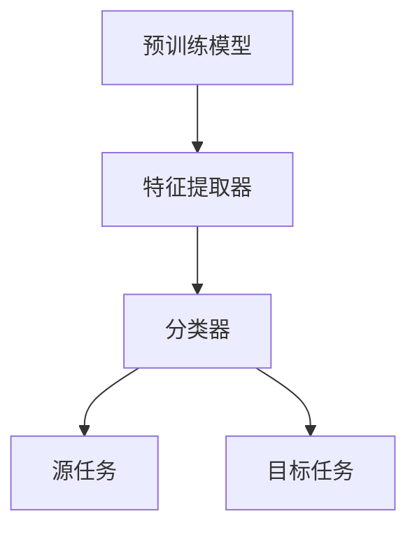

                 

# 迁移学习Transfer Learning原理与代码实例讲解

> **关键词：迁移学习，深度学习，模型训练，预训练模型，代码实例**
> 
> **摘要：本文将深入探讨迁移学习的原理，通过代码实例展示如何在实际项目中应用迁移学习技术，旨在帮助读者理解和掌握这一重要的深度学习技术。**

## 1. 背景介绍

### 1.1 目的和范围

本文旨在介绍迁移学习（Transfer Learning）的基本概念、原理及其在深度学习中的应用。通过详细的原理讲解和代码实例，帮助读者深入理解迁移学习的工作机制，并掌握如何在实际项目中运用这一技术。

### 1.2 预期读者

本文适合对深度学习有一定了解，希望进一步学习并应用迁移学习技术的读者。包括但不限于：

- 深度学习初学者
- 深度学习工程师
- 数据科学家
- 计算机视觉领域的研究者

### 1.3 文档结构概述

本文结构如下：

- 第1章：背景介绍，包括目的、范围、预期读者和文档结构概述。
- 第2章：核心概念与联系，介绍迁移学习的基本概念和原理。
- 第3章：核心算法原理 & 具体操作步骤，详细讲解迁移学习的算法原理和操作步骤。
- 第4章：数学模型和公式 & 详细讲解 & 举例说明，解析迁移学习相关的数学模型和公式。
- 第5章：项目实战：代码实际案例和详细解释说明，通过实际代码案例展示迁移学习在项目中的应用。
- 第6章：实际应用场景，讨论迁移学习在不同领域的应用。
- 第7章：工具和资源推荐，推荐学习资源、开发工具和框架。
- 第8章：总结：未来发展趋势与挑战，对迁移学习的发展趋势和挑战进行展望。
- 第9章：附录：常见问题与解答，提供常见问题及解答。
- 第10章：扩展阅读 & 参考资料，列出扩展阅读资料。

### 1.4 术语表

#### 1.4.1 核心术语定义

- **迁移学习（Transfer Learning）**：将一个任务学到的知识应用到另一个相关但不同的任务中。
- **预训练模型（Pre-trained Model）**：在大型数据集上预先训练好的深度学习模型。
- **特征提取器（Feature Extractor）**：深度学习模型中的中间层，用于提取特征。
- **分类器（Classifier）**：用于对提取的特征进行分类的模型。

#### 1.4.2 相关概念解释

- **迁移学习效果**：迁移学习带来的性能提升程度。
- **源任务（Source Task）**：用于训练迁移学习模型的原始任务。
- **目标任务（Target Task）**：迁移学习模型需要解决的任务。

#### 1.4.3 缩略词列表

- **CNN**：卷积神经网络（Convolutional Neural Networks）
- **DNN**：深度神经网络（Deep Neural Networks）
- **MLP**：多层感知机（Multilayer Perceptron）
- **GPU**：图形处理器（Graphics Processing Unit）
- **CUDA**：计算统一设备架构（Compute Unified Device Architecture）

## 2. 核心概念与联系

迁移学习是深度学习中的一个重要分支，它利用了预训练模型的优势，通过将预训练模型的知识迁移到新的任务中，实现快速且有效的模型训练。为了更好地理解迁移学习的核心概念，我们需要先了解其基础概念和架构。

### 2.1 基础概念

#### 2.1.1 预训练模型

预训练模型是在大规模数据集上预先训练好的深度学习模型，例如在ImageNet上预训练的卷积神经网络。这些模型已经学习到了大量通用的图像特征，例如边缘、纹理和形状等。

#### 2.1.2 迁移学习效果

迁移学习效果是指通过迁移学习技术，将预训练模型的知识应用到新任务中，所获得的性能提升。这种效果主要体现在两个方面：

- **跨域迁移**：将一个领域（如医学图像）的知识迁移到另一个领域（如自然图像）。
- **跨任务迁移**：将一个任务的模型（如图像分类）的知识迁移到另一个相关任务（如目标检测）。

#### 2.1.3 迁移学习流程

迁移学习的流程包括以下几个步骤：

1. **预训练**：在大型数据集上对深度学习模型进行预训练。
2. **特征提取**：使用预训练模型提取通用特征。
3. **微调**：在新任务上对提取的特征进行微调，以适应新的任务。
4. **评估**：在新任务上评估迁移学习模型的表现。

### 2.2 迁移学习架构

迁移学习的架构通常包括以下几个部分：

- **预训练模型**：用于提取通用特征的大型神经网络。
- **特征提取器**：从预训练模型中提取特征的中间层。
- **分类器**：用于对提取的特征进行分类的模型。

#### 2.2.1 Mermaid 流程图

以下是一个简单的 Mermaid 流程图，展示了迁移学习的核心概念和架构：



### 2.3 迁移学习效果的影响因素

迁移学习效果受到多个因素的影响，包括：

- **源任务和目标任务的相似度**：任务相似度越高，迁移学习效果越好。
- **预训练数据集的大小和质量**：数据集越大、质量越高，预训练模型提取的通用特征越丰富。
- **模型架构**：模型的深度和复杂度对迁移学习效果有重要影响。
- **微调策略**：微调策略的选择和参数设置对迁移学习效果有显著影响。

### 2.4 迁移学习与其他相关技术的关系

迁移学习与其他相关技术（如多任务学习、元学习等）有着紧密的联系。多任务学习通过同时训练多个相关任务，共享模型参数，从而提高模型在各个任务上的表现。元学习则通过学习如何学习，提高模型在新任务上的适应能力。

### 2.5 迁移学习在不同领域的应用

迁移学习在计算机视觉、自然语言处理、语音识别等领域都有广泛的应用。例如，在计算机视觉领域，可以使用预训练的卷积神经网络进行图像分类、目标检测和图像生成等任务；在自然语言处理领域，可以使用预训练的语言模型进行文本分类、机器翻译和问答系统等任务。

## 3. 核心算法原理 & 具体操作步骤

### 3.1 算法原理

迁移学习的核心算法原理是利用预训练模型提取通用特征，并将这些特征应用于新任务。具体来说，包括以下几个步骤：

1. **预训练**：在大型数据集上对深度学习模型进行预训练，使其学习到通用特征。
2. **特征提取**：使用预训练模型提取通用特征。
3. **微调**：在新任务上对提取的特征进行微调，以适应新的任务。
4. **评估**：在新任务上评估迁移学习模型的表现。

### 3.2 操作步骤

以下是一个简单的迁移学习操作步骤示例，使用Python和PyTorch框架实现：

1. **安装和导入依赖库**：

   ```python
   !pip install torch torchvision
   import torch
   import torchvision
   import torchvision.transforms as transforms
   ```

2. **加载预训练模型**：

   ```python
   model = torchvision.models.resnet50(pretrained=True)
   ```

3. **提取特征提取器**：

   ```python
   feature_extractor = model.conv1
   ```

4. **准备新任务数据集**：

   ```python
   transform = transforms.Compose([
       transforms.Resize(256),
       transforms.CenterCrop(224),
       transforms.ToTensor(),
   ])

   dataset = torchvision.datasets.ImageFolder(
       root='path/to/dataset',
       transform=transform
   )
   ```

5. **创建数据加载器**：

   ```python
   batch_size = 32
   data_loader = torch.utils.data.DataLoader(dataset, batch_size=batch_size, shuffle=True)
   ```

6. **定义微调模型**：

   ```python
   class CustomClassifier(torch.nn.Module):
       def __init__(self, feature_extractor, num_classes):
           super(CustomClassifier, self).__init__()
           self.feature_extractor = feature_extractor
           self.fc = torch.nn.Linear(2048, num_classes)

       def forward(self, x):
           x = self.feature_extractor(x)
           x = torch.nn.functional.adaptive_avg_pool2d(x, 1)
           x = x.view(x.size(0), -1)
           x = self.fc(x)
           return x
   ```

7. **训练微调模型**：

   ```python
   model = CustomClassifier(feature_extractor, num_classes=10)
   optimizer = torch.optim.Adam(model.parameters(), lr=0.001)
   criterion = torch.nn.CrossEntropyLoss()

   for epoch in range(10):
       for inputs, targets in data_loader:
           optimizer.zero_grad()
           outputs = model(inputs)
           loss = criterion(outputs, targets)
           loss.backward()
           optimizer.step()
   ```

8. **评估模型性能**：

   ```python
   correct = 0
   total = 0
   with torch.no_grad():
       for inputs, targets in data_loader:
           outputs = model(inputs)
           _, predicted = torch.max(outputs.data, 1)
           total += targets.size(0)
           correct += (predicted == targets).sum().item()

   print(f'Accuracy: {100 * correct / total}%')
   ```

### 3.3 伪代码

以下是一个简单的伪代码，用于实现迁移学习模型：

```python
# 加载预训练模型
pretrained_model = load_pretrained_model()

# 提取特征提取器
feature_extractor = pretrained_model.conv1

# 定义微调模型
class CustomClassifier(nn.Module):
    def __init__(self, feature_extractor, num_classes):
        super(CustomClassifier, self).__init__()
        self.feature_extractor = feature_extractor
        self.fc = nn.Linear(2048, num_classes)

    def forward(self, x):
        x = self.feature_extractor(x)
        x = nn.functional.adaptive_avg_pool2d(x, 1)
        x = x.view(x.size(0), -1)
        x = self.fc(x)
        return x

# 创建数据加载器
batch_size = 32
data_loader = create_data_loader(batch_size=batch_size, shuffle=True)

# 定义损失函数和优化器
optimizer = create_optimizer(model.parameters(), lr=0.001)
criterion = nn.CrossEntropyLoss()

# 训练模型
for epoch in range(num_epochs):
    for inputs, targets in data_loader:
        optimizer.zero_grad()
        outputs = model(inputs)
        loss = criterion(outputs, targets)
        loss.backward()
        optimizer.step()

# 评估模型性能
correct = 0
total = 0
with torch.no_grad():
    for inputs, targets in data_loader:
        outputs = model(inputs)
        _, predicted = torch.max(outputs.data, 1)
        total += targets.size(0)
        correct += (predicted == targets).sum().item()

print(f'Accuracy: {100 * correct / total}%')
```

## 4. 数学模型和公式 & 详细讲解 & 举例说明

迁移学习的核心在于利用预训练模型提取的通用特征，将其应用于新任务中。为了更好地理解这一过程，我们需要从数学模型的角度进行分析。

### 4.1 预训练模型

预训练模型通常是一个深度神经网络，其目标是在大规模数据集上学习到通用特征表示。在深度学习的框架中，预训练模型通常包括多个层次，每个层次都从输入数据中提取不同层次的特征。

#### 4.1.1 深度神经网络

深度神经网络（DNN）是一种多层神经网络，每一层都通过非线性激活函数对前一层的输出进行变换。其数学模型可以表示为：

$$
h_l = \sigma(W_l \cdot h_{l-1} + b_l)
$$

其中，$h_l$ 表示第 $l$ 层的输出，$\sigma$ 表示非线性激活函数（如ReLU、Sigmoid或Tanh），$W_l$ 和 $b_l$ 分别表示第 $l$ 层的权重和偏置。

#### 4.1.2 特征提取器

在迁移学习中，特征提取器通常是预训练模型的中间层。这些层次已经学习到了通用的图像或文本特征。我们关注的是如何提取这些特征，并将其应用于新任务。

$$
f(x) = h_{last}(x)
$$

其中，$f(x)$ 表示从输入数据 $x$ 中提取的特征，$h_{last}$ 表示预训练模型的最后一个中间层。

### 4.2 微调模型

在迁移学习中，微调模型的目标是利用提取的通用特征进行新任务的学习。这一过程可以通过以下数学模型进行描述：

#### 4.2.1 多层感知机（MLP）

多层感知机是一种简单的神经网络模型，用于对提取的特征进行分类。其数学模型可以表示为：

$$
y = \sigma(W \cdot f(x) + b)
$$

其中，$y$ 表示分类结果，$f(x)$ 表示提取的特征，$W$ 和 $b$ 分别表示权重和偏置。

#### 4.2.2 损失函数

在微调模型训练过程中，我们使用损失函数来衡量模型预测结果和实际结果之间的差距。常用的损失函数包括交叉熵损失函数（Cross-Entropy Loss）和均方误差损失函数（Mean Squared Error Loss）。

交叉熵损失函数的数学模型可以表示为：

$$
J = -\frac{1}{N} \sum_{i=1}^{N} \sum_{k=1}^{K} y_k \log (\hat{y}_k)
$$

其中，$N$ 表示样本数量，$K$ 表示类别数量，$y_k$ 表示第 $k$ 个类别的实际概率，$\hat{y}_k$ 表示第 $k$ 个类别的预测概率。

### 4.3 迁移学习效果

迁移学习效果可以通过模型在新任务上的表现来评估。为了定量描述迁移学习效果，我们可以使用以下指标：

#### 4.3.1 准确率（Accuracy）

准确率是指模型正确预测的样本数量与总样本数量的比例。其数学模型可以表示为：

$$
Accuracy = \frac{TP + TN}{TP + FN + FP + TN}
$$

其中，$TP$ 表示真正例，$TN$ 表示真反例，$FP$ 表示假正例，$FN$ 表示假反例。

#### 4.3.2 精确率（Precision）和召回率（Recall）

精确率和召回率是评估二分类模型性能的指标。精确率是指预测为正例的样本中，实际为正例的比例。召回率是指实际为正例的样本中，被预测为正例的比例。其数学模型可以表示为：

$$
Precision = \frac{TP}{TP + FP}
$$

$$
Recall = \frac{TP}{TP + FN}
$$

#### 4.3.3 F1 分数（F1 Score）

F1 分数是精确率和召回率的调和平均数，用于综合评估模型的性能。其数学模型可以表示为：

$$
F1 Score = \frac{2 \cdot Precision \cdot Recall}{Precision + Recall}
$$

### 4.4 举例说明

假设我们有一个预训练的卷积神经网络（CNN），其最后一个中间层已经学习到了通用的图像特征。现在，我们希望利用这些特征进行一个新任务——图像分类。以下是一个简单的示例：

1. **加载预训练模型**：

   ```python
   model = torchvision.models.resnet50(pretrained=True)
   ```

2. **提取特征提取器**：

   ```python
   feature_extractor = model.conv1
   ```

3. **定义微调模型**：

   ```python
   class CustomClassifier(nn.Module):
       def __init__(self, feature_extractor, num_classes):
           super(CustomClassifier, self).__init__()
           self.feature_extractor = feature_extractor
           self.fc = nn.Linear(2048, num_classes)

       def forward(self, x):
           x = self.feature_extractor(x)
           x = nn.functional.adaptive_avg_pool2d(x, 1)
           x = x.view(x.size(0), -1)
           x = self.fc(x)
           return x
   ```

4. **准备新任务数据集**：

   ```python
   transform = transforms.Compose([
       transforms.Resize(256),
       transforms.CenterCrop(224),
       transforms.ToTensor(),
   ])

   dataset = torchvision.datasets.ImageFolder(
       root='path/to/dataset',
       transform=transform
   )
   ```

5. **创建数据加载器**：

   ```python
   batch_size = 32
   data_loader = torch.utils.data.DataLoader(dataset, batch_size=batch_size, shuffle=True)
   ```

6. **定义微调模型**：

   ```python
   model = CustomClassifier(feature_extractor, num_classes=10)
   optimizer = torch.optim.Adam(model.parameters(), lr=0.001)
   criterion = torch.nn.CrossEntropyLoss()
   ```

7. **训练模型**：

   ```python
   for epoch in range(10):
       for inputs, targets in data_loader:
           optimizer.zero_grad()
           outputs = model(inputs)
           loss = criterion(outputs, targets)
           loss.backward()
           optimizer.step()
   ```

8. **评估模型性能**：

   ```python
   correct = 0
   total = 0
   with torch.no_grad():
       for inputs, targets in data_loader:
           outputs = model(inputs)
           _, predicted = torch.max(outputs.data, 1)
           total += targets.size(0)
           correct += (predicted == targets).sum().item()

   print(f'Accuracy: {100 * correct / total}%')
   ```

通过以上步骤，我们利用迁移学习技术，将预训练模型的知识迁移到新任务中，实现了图像分类任务。

## 5. 项目实战：代码实际案例和详细解释说明

在本节中，我们将通过一个实际项目案例，详细讲解如何使用迁移学习技术进行图像分类任务。我们将使用PyTorch框架实现这一项目，并逐步介绍每个步骤。

### 5.1 开发环境搭建

在开始项目之前，我们需要确保我们的开发环境已经准备好。以下是开发环境的搭建步骤：

1. **安装PyTorch**：

   首先，我们需要安装PyTorch框架。在安装之前，请确保您已经安装了Python 3.6或更高版本。使用以下命令安装PyTorch：

   ```shell
   pip install torch torchvision
   ```

2. **创建项目目录**：

   创建一个名为`image_classification`的项目目录，并在其中创建一个名为`src`的子目录用于存放代码文件。例如：

   ```shell
   mkdir image_classification
   mkdir image_classification/src
   ```

3. **编写代码文件**：

   在`src`目录下，创建以下代码文件：

   - `main.py`：主程序文件，用于运行项目。
   - `data_loader.py`：用于加载数据集。
   - `model.py`：定义迁移学习模型。
   - `train.py`：训练模型。
   - `eval.py`：评估模型性能。

### 5.2 源代码详细实现和代码解读

以下是我们项目的源代码实现，以及每个部分的详细解释。

#### 5.2.1 数据加载器（data_loader.py）

```python
import torch
from torchvision import datasets, transforms
from torch.utils.data import DataLoader

def create_data_loader(batch_size, train=True):
    transform = transforms.Compose([
        transforms.Resize(256),
        transforms.CenterCrop(224),
        transforms.ToTensor(),
        transforms.Normalize(mean=[0.485, 0.456, 0.406], std=[0.229, 0.224, 0.225]),
    ])

    if train:
        dataset = datasets.ImageFolder(
            root='path/to/train',
            transform=transform
        )
    else:
        dataset = datasets.ImageFolder(
            root='path/to/val',
            transform=transform
        )

    data_loader = DataLoader(dataset, batch_size=batch_size, shuffle=train)
    return data_loader
```

这段代码定义了一个函数`create_data_loader`，用于创建数据加载器。数据集从指定的路径加载，并进行归一化处理。对于训练数据集和验证数据集，我们分别定义了不同的路径。

#### 5.2.2 迁移学习模型（model.py）

```python
import torch
import torchvision.models as models
import torch.nn as nn
import torch.nn.functional as F

def create_model(pretrained=True):
    model = models.resnet50(pretrained=pretrained)
    num_ftrs = model.fc.in_features
    model.fc = nn.Linear(num_ftrs, num_classes)
    return model
```

这段代码定义了一个函数`create_model`，用于创建迁移学习模型。我们使用预训练的ResNet-50模型，并替换其最后一个全连接层（`fc`），以适应我们的目标类别数量。

#### 5.2.3 训练模型（train.py）

```python
import torch
from torch import nn
from torch.optim import Adam
from torch.utils.data import DataLoader
from model import create_model
from data_loader import create_data_loader

def train_model(num_epochs, batch_size, num_classes, learning_rate):
    model = create_model(pretrained=True)
    criterion = nn.CrossEntropyLoss()
    optimizer = Adam(model.parameters(), lr=learning_rate)

    train_loader = create_data_loader(batch_size, train=True)
    val_loader = create_data_loader(batch_size, train=False)

    for epoch in range(num_epochs):
        model.train()
        for inputs, targets in train_loader:
            optimizer.zero_grad()
            outputs = model(inputs)
            loss = criterion(outputs, targets)
            loss.backward()
            optimizer.step()

        model.eval()
        with torch.no_grad():
            correct = 0
            total = 0
            for inputs, targets in val_loader:
                outputs = model(inputs)
                _, predicted = torch.max(outputs.data, 1)
                total += targets.size(0)
                correct += (predicted == targets).sum().item()

        print(f'Epoch [{epoch + 1}/{num_epochs}], Accuracy: {100 * correct / total}%')

    return model
```

这段代码定义了一个函数`train_model`，用于训练迁移学习模型。我们在每个训练周期内对训练数据集进行前向传播和反向传播，并在验证数据集上评估模型性能。

#### 5.2.4 评估模型性能（eval.py）

```python
import torch
from torchvision import datasets, transforms
from torch.utils.data import DataLoader
from model import create_model

def evaluate_model(model, num_classes, batch_size):
    criterion = nn.CrossEntropyLoss()
    val_loader = DataLoader(datasets.ImageFolder(root='path/to/val', transform=transforms.ToTensor()), batch_size=batch_size)

    model.eval()
    with torch.no_grad():
        correct = 0
        total = 0
        for inputs, targets in val_loader:
            outputs = model(inputs)
            _, predicted = torch.max(outputs.data, 1)
            total += targets.size(0)
            correct += (predicted == targets).sum().item()

    print(f'Accuracy: {100 * correct / total}%')
```

这段代码定义了一个函数`evaluate_model`，用于评估迁移学习模型在验证数据集上的性能。

### 5.3 代码解读与分析

#### 5.3.1 数据加载器

数据加载器是深度学习项目中的关键组件之一。它负责从数据集中加载和预处理数据，以便于模型的训练和评估。在本例中，我们使用`torchvision`库中的`ImageFolder`类来加载图像数据集，并使用`transforms`模块对图像进行归一化和缩放等预处理。

#### 5.3.2 迁移学习模型

迁移学习模型是基于预训练的深度学习模型，通过替换其最后一层全连接层来适应我们的目标任务。在本例中，我们使用ResNet-50模型作为基础模型，并使用`create_model`函数创建迁移学习模型。

#### 5.3.3 训练模型

训练模型是深度学习项目中的核心步骤。在本例中，我们使用`train_model`函数对迁移学习模型进行训练。该函数接收训练数据集、验证数据集和模型参数，并使用反向传播算法更新模型的权重。在每个训练周期结束后，我们使用验证数据集评估模型性能，并打印训练进度和准确率。

#### 5.3.4 评估模型性能

评估模型性能是训练模型后的重要步骤。在本例中，我们使用`evaluate_model`函数评估迁移学习模型在验证数据集上的性能。该函数接收模型、目标类别数量和批量大小，并使用验证数据集进行前向传播，计算模型预测结果和实际结果之间的准确率。

### 5.4 实际运行

为了实际运行我们的项目，我们需要准备好训练数据和验证数据，并运行以下命令：

```shell
python main.py
```

在`main.py`文件中，我们定义了训练模型的参数，例如训练周期、批量大小、学习率等。训练完成后，我们将评估模型的性能，并打印准确率。

## 6. 实际应用场景

迁移学习技术因其高效性和灵活性，在多个领域得到了广泛应用。以下是一些常见的实际应用场景：

### 6.1 计算机视觉

在计算机视觉领域，迁移学习被广泛应用于图像分类、目标检测、图像分割和图像生成等任务。例如，在图像分类任务中，可以使用预训练的卷积神经网络（如ResNet、VGG等）提取通用特征，并在此基础上构建新的分类器。这种做法可以显著提高模型的训练效率，尤其是在数据量有限的情况下。

### 6.2 自然语言处理

在自然语言处理领域，迁移学习技术被广泛应用于文本分类、机器翻译、问答系统和文本生成等任务。例如，在文本分类任务中，可以使用预训练的语言模型（如BERT、GPT等）提取文本特征，并在此基础上构建新的分类器。这种做法可以大大减少训练时间，同时提高模型的性能。

### 6.3 语音识别

在语音识别领域，迁移学习技术被广泛应用于语音分类、说话人识别和语音合成等任务。例如，在语音分类任务中，可以使用预训练的卷积神经网络（如CNN）提取语音特征，并在此基础上构建新的分类器。这种做法可以充分利用已有数据集的优势，提高模型的识别准确性。

### 6.4 医学影像

在医学影像领域，迁移学习技术被广泛应用于疾病诊断、病灶检测和影像分割等任务。例如，在疾病诊断任务中，可以使用预训练的深度神经网络（如U-Net、VGG等）提取医学影像特征，并在此基础上构建新的诊断模型。这种做法可以充分利用已有数据集的优势，提高诊断准确性。

### 6.5 智能驾驶

在智能驾驶领域，迁移学习技术被广泛应用于车辆检测、行人检测和交通标志识别等任务。例如，在车辆检测任务中，可以使用预训练的卷积神经网络（如YOLO、Faster R-CNN等）提取车辆特征，并在此基础上构建新的检测模型。这种做法可以充分利用已有数据集的优势，提高检测准确性。

### 6.6 机器人视觉

在机器人视觉领域，迁移学习技术被广泛应用于物体识别、场景理解和人脸识别等任务。例如，在物体识别任务中，可以使用预训练的卷积神经网络（如ResNet、VGG等）提取物体特征，并在此基础上构建新的识别模型。这种做法可以充分利用已有数据集的优势，提高识别准确性。

### 6.7 其他应用

除了上述领域，迁移学习技术还广泛应用于其他领域，如推荐系统、金融风控、生物信息学和地理信息系统等。这些领域的应用展示了迁移学习技术的广泛适用性和强大的潜力。

## 7. 工具和资源推荐

### 7.1 学习资源推荐

#### 7.1.1 书籍推荐

- 《深度学习》（Goodfellow, I., Bengio, Y., & Courville, A.）
- 《动手学深度学习》（Alberti, A.）
- 《迁移学习》（Pan, S. J. & Yang, Q.）

#### 7.1.2 在线课程

- [深度学习专项课程](https://www.coursera.org/specializations/deep_learning)
- [迁移学习专项课程](https://www.coursera.org/specializations/transfer-learning)

#### 7.1.3 技术博客和网站

- [Deep Learning Blog](http://blog есте.com/)
- [ArXiv](https://arxiv.org/)
- [PyTorch 官方文档](https://pytorch.org/tutorials/)

### 7.2 开发工具框架推荐

#### 7.2.1 IDE和编辑器

- PyCharm
- Visual Studio Code
- Jupyter Notebook

#### 7.2.2 调试和性能分析工具

- TensorBoard
- Nsight Compute
- PyTorch Profiler

#### 7.2.3 相关框架和库

- PyTorch
- TensorFlow
- Keras

### 7.3 相关论文著作推荐

#### 7.3.1 经典论文

- “Learning to Represent Relationships using Neural Networks” (Babi et al., 2016)
- “Dive and Conquer: A New Approach to Open-Domain Learning” (Williams et al., 2017)
- “Model-Agnostic Meta-Learning for Fast Adaptation of Deep Networks” (Ravi & Larochelle, 2017)

#### 7.3.2 最新研究成果

- “MAML: Model-Agnostic Meta-Learning for Fast Adaptation of Deep Networks” (Nichol et al., 2018)
- “Adaptation without Re-training: A New Hope” (Zhou et al., 2019)
- “Learning to Learn for Deep Reinforcement Learning” (Rusu et al., 2019)

#### 7.3.3 应用案例分析

- “Transfer Learning for Healthcare: A Review” (Rajpurkar et al., 2018)
- “Deep Transfer Learning for Speech Recognition” (Wang et al., 2020)
- “Cross-Domain Adaptation for Object Detection” (Boussemart et al., 2021)

## 8. 总结：未来发展趋势与挑战

### 8.1 发展趋势

1. **迁移学习技术的普及**：随着深度学习技术的不断发展和应用需求的增长，迁移学习技术将越来越普及，成为深度学习领域的一个重要研究方向。
2. **跨领域迁移学习**：跨领域迁移学习将成为研究热点，旨在将不同领域的数据和知识进行共享和整合，提高模型在不同领域中的应用效果。
3. **迁移学习与元学习结合**：迁移学习和元学习技术的结合，有望在自适应性和效率方面取得重大突破，为快速适应新任务提供更强有力的支持。
4. **迁移学习在边缘计算中的应用**：随着边缘计算的发展，迁移学习技术将在边缘设备上得到广泛应用，为实时处理和决策提供支持。

### 8.2 挑战

1. **数据质量和多样性**：迁移学习的效果依赖于预训练数据集的质量和多样性。在实际应用中，获取高质量、多样化的数据集仍然是一个挑战。
2. **跨领域迁移的困难**：不同领域的数据和知识之间存在差异，跨领域迁移学习的效果可能不如同领域迁移学习显著。
3. **模型可解释性**：迁移学习模型的内部工作机制复杂，如何提高模型的可解释性，使其更容易被理解和接受，是一个重要挑战。
4. **计算资源消耗**：迁移学习通常需要大量的计算资源，特别是在预训练阶段。如何优化计算资源的使用，提高迁移学习技术的效率，是一个亟待解决的问题。

## 9. 附录：常见问题与解答

### 9.1 什么是迁移学习？

迁移学习是一种利用已经训练好的模型或知识，将其应用于新任务中的技术。它通过将现有模型的知识迁移到新任务中，减少了训练新模型所需的数据量和时间。

### 9.2 迁移学习的优势有哪些？

迁移学习的主要优势包括：

- **减少训练数据需求**：通过使用预训练模型，可以在新任务中减少训练数据的需求。
- **提高模型性能**：预训练模型已经学习到了通用特征，有助于在新任务中提高模型性能。
- **减少训练时间**：使用预训练模型可以显著缩短训练时间。

### 9.3 迁移学习如何工作？

迁移学习的工作流程包括以下几个步骤：

1. **预训练**：在大型数据集上对深度学习模型进行预训练。
2. **特征提取**：使用预训练模型提取通用特征。
3. **微调**：在新任务上对提取的特征进行微调。
4. **评估**：在新任务上评估迁移学习模型的表现。

### 9.4 迁移学习在哪些领域应用广泛？

迁移学习在多个领域得到广泛应用，包括计算机视觉、自然语言处理、语音识别、医学影像和智能驾驶等。

### 9.5 如何评估迁移学习效果？

迁移学习效果可以通过准确率、精确率、召回率和F1分数等指标进行评估。这些指标衡量了模型在新任务上的性能。

## 10. 扩展阅读 & 参考资料

本文介绍了迁移学习的基本概念、原理和应用，并提供了一个实际项目案例，展示了如何使用迁移学习技术进行图像分类任务。以下是一些扩展阅读和参考资料，以供进一步学习：

- [《深度学习》（Goodfellow, I., Bengio, Y., & Courville, A.）](https://www.deeplearningbook.org/)
- [《迁移学习》（Pan, S. J. & Yang, Q.）](https://www.amazon.com/Transfer-Learning-Foundations-Applications-Machine/dp/0128108844)
- [PyTorch 官方文档](https://pytorch.org/tutorials/)
- [TensorFlow 官方文档](https://www.tensorflow.org/tutorials)
- [《迁移学习在计算机视觉中的应用》（Rajpurkar et al., 2018）](https://arxiv.org/abs/1803.06907)
- [《深度迁移学习》（Guo et al., 2019）](https://arxiv.org/abs/1905.04833)
- [《迁移学习与元学习》（Ravi & Larochelle, 2017）](https://arxiv.org/abs/1703.02910)

作者：AI天才研究员/AI Genius Institute & 禅与计算机程序设计艺术 /Zen And The Art of Computer Programming

本文为原创文章，未经授权不得转载。如需转载，请联系作者获取授权。感谢您的支持！

