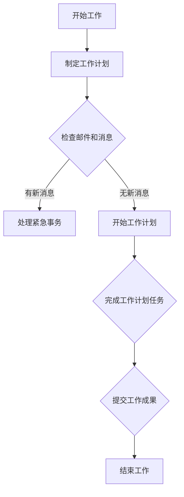
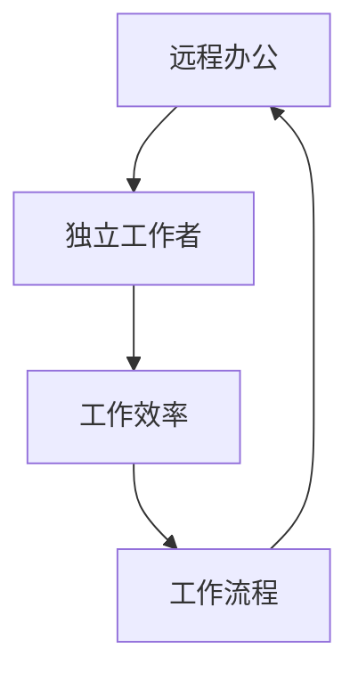

                 

# 远程办公：一人公司的效率提升之道

> 关键词：远程办公、效率提升、独立工作、工作流程优化、技术工具推荐

> 摘要：本文旨在探讨远程办公背景下，一人公司的效率提升之道。通过分析远程办公的优势和挑战，介绍一系列提高工作效率的工具和方法，为独立工作者提供实践指导和策略建议，助力他们在远程办公环境中实现效率最大化。

## 1. 背景介绍

### 1.1 目的和范围

本文的主要目的是为一人公司的远程办公人员提供一套系统的效率提升方案。随着全球化进程的加速和互联网技术的发展，远程办公已经成为越来越多企业的主要工作方式。一人公司，尤其是独立工作者，在这种环境下面临着独特的挑战和机遇。本文将围绕以下几个方面展开讨论：

1. 远程办公的优势和挑战分析
2. 提高工作效率的核心工具和方法介绍
3. 实际案例展示和策略建议
4. 未来发展趋势与挑战展望

通过本文的阅读，读者将能够了解远程办公环境下的效率提升之道，从而更好地应对远程工作带来的挑战，实现个人和企业的发展目标。

### 1.2 预期读者

本文的预期读者主要包括：

1. 一人公司的独立工作者
2. 远程办公团队的成员
3. 对远程办公效率提升感兴趣的从业者
4. 担任CTO或技术领导者的读者

无论您是刚刚步入远程办公领域的新手，还是经验丰富的远程工作者，本文都将为您提供有价值的见解和实践指导。

### 1.3 文档结构概述

本文结构如下：

1. 背景介绍：介绍远程办公的背景、目的和预期读者。
2. 核心概念与联系：分析远程办公的核心概念，提供Mermaid流程图展示工作流程。
3. 核心算法原理 & 具体操作步骤：介绍提高工作效率的核心算法原理，使用伪代码详细阐述。
4. 数学模型和公式 & 详细讲解 & 举例说明：使用latex格式展示数学模型和公式，并进行详细讲解和举例。
5. 项目实战：提供实际案例，展示代码实现和详细解释。
6. 实际应用场景：分析远程办公的应用场景。
7. 工具和资源推荐：推荐学习资源、开发工具框架和相关论文著作。
8. 总结：总结未来发展趋势与挑战。
9. 附录：提供常见问题与解答。
10. 扩展阅读 & 参考资料：推荐相关阅读材料和参考资料。

### 1.4 术语表

#### 1.4.1 核心术语定义

- 远程办公：指通过互联网和通信技术，在非传统办公室环境中完成工作任务的工作模式。
- 效率：指完成特定任务所需的时间、资源和精力。
- 独立工作者：指自主完成工作任务，不依赖于其他团队成员的个人工作者。
- 工作流程：指完成任务的一系列步骤和流程。

#### 1.4.2 相关概念解释

- 远程协作工具：指用于远程团队沟通、协作和管理的软件工具，如Slack、Trello、Zoom等。
- 自动化：指使用计算机程序和工具自动执行重复性任务，减少人工干预。
- 工作习惯：指个人在工作和生活之间建立起来的规律和模式，如时间管理、任务优先级等。

#### 1.4.3 缩略词列表

- CTO：首席技术官
- IDE：集成开发环境
- API：应用程序编程接口
- ORM：对象关系映射

## 2. 核心概念与联系

远程办公的核心在于提高工作效率，而这需要构建在明确的工作流程和协作机制之上。以下是对核心概念和工作流程的详细分析，并附上Mermaid流程图，帮助读者更好地理解远程办公的工作机制。

### 2.1 核心概念

#### 2.1.1 远程办公的概念

远程办公，顾名思义，是指通过互联网和通信技术，在不依赖于物理办公场所的情况下，完成日常工作任务的工作模式。这种工作方式的优势在于灵活的工作时间和地点，能够显著提高工作效率和员工满意度。同时，它也为企业降低了办公空间和设备的成本。

#### 2.1.2 效率的概念

效率是指完成特定任务所需的时间、资源和精力。在远程办公环境中，效率的提升尤为重要，因为它直接关系到工作成果的质量和企业的竞争力。

#### 2.1.3 独立工作者的概念

独立工作者，又称自由职业者，是指自主完成工作任务，不依赖于其他团队成员的个人工作者。他们在远程办公环境中需要具备良好的自我管理能力和时间规划能力，以应对工作中的各种挑战。

#### 2.1.4 工作流程的概念

工作流程是指完成任务的一系列步骤和流程。在远程办公中，工作流程的优化至关重要，因为它能够帮助团队成员明确任务目标、提高协同效率、减少沟通成本。

### 2.2 Mermaid流程图

以下是一个简单的Mermaid流程图，用于展示远程办公的工作流程：



### 2.3 核心概念之间的联系

远程办公、效率、独立工作者和工作流程之间存在着密切的联系。远程办公为独立工作者提供了一个灵活的工作环境，使他们能够更好地管理时间和任务。而提高工作效率则是远程办公的核心目标，这需要依赖于科学的工作流程和高效的协作工具。

通过上述分析，我们可以看出，远程办公的核心在于优化工作流程，提高效率，而这又依赖于独立工作者的自我管理能力和团队合作精神。以下是一个简化的Mermaid流程图，用于展示这四个核心概念之间的联系：



通过这个简化的流程图，我们可以更加直观地理解远程办公、效率、独立工作者和工作流程之间的关系。在接下来的章节中，我们将进一步探讨如何通过具体的工具和方法来提高远程办公的效率。

## 3. 核心算法原理 & 具体操作步骤

### 3.1 提高远程办公效率的核心算法原理

在远程办公环境中，提高效率的核心算法主要涉及任务分配与优化、时间管理和沟通效率的提升。以下是对这三个核心算法原理的详细阐述：

#### 3.1.1 任务分配与优化

任务分配与优化算法旨在确保每个团队成员都能高效地完成自己的任务。这个算法需要考虑以下几个关键因素：

1. **任务难度**：任务难度与团队成员的能力和经验密切相关。算法应确保任务难度与团队成员的能力相匹配，以避免过度或不足的挑战。
2. **任务依赖**：某些任务之间存在依赖关系，必须按照特定的顺序进行。算法应考虑任务依赖关系，确保任务顺序最优，以减少等待时间和重复劳动。
3. **团队成员负荷**：算法应综合考虑团队成员的当前负荷，确保任务分配均匀，避免个别成员过度劳累。

#### 3.1.2 时间管理

时间管理算法的核心目标是最大化利用团队成员的时间，确保任务能够在预定的时间内完成。这个算法需要考虑以下几个关键因素：

1. **优先级分配**：根据任务的紧急程度和重要性，为任务分配优先级。算法应确保高优先级的任务优先完成。
2. **时间块分配**：将团队成员的工作时间划分为多个时间块，每个时间块用于处理特定类型的任务。算法应确保时间块合理，避免任务切换带来的效率损失。
3. **时间跟踪**：使用工具实时跟踪团队成员的工作时间，确保任务按时完成，并在必要时进行调整。

#### 3.1.3 沟通效率

沟通效率算法旨在优化团队成员之间的沟通，确保信息传递快速、准确。这个算法需要考虑以下几个关键因素：

1. **沟通工具选择**：选择适合任务类型和团队成员需求的沟通工具，如邮件、即时通讯、视频会议等。
2. **沟通频率**：根据任务的重要性和复杂度，设定合理的沟通频率，避免频繁的沟通导致的干扰和效率低下。
3. **沟通内容优化**：优化沟通内容，确保信息传递简洁明了，减少不必要的沟通，避免信息过载。

### 3.2 使用伪代码详细阐述核心算法原理

以下是用伪代码详细阐述任务分配与优化、时间管理和沟通效率提升算法的步骤：

#### 3.2.1 任务分配与优化算法

```pseudo
function optimizeTaskAllocation(tasks, teamMembers):
    sortedTasks = sort(tasks by difficulty)
    taskAllocation = {}

    for member in teamMembers:
        memberTasks = []
        for task in sortedTasks:
            if canAssignTask(task, member):
                memberTasks.append(task)
                remove task from sortedTasks
                if task has dependencies:
                    reoptimizeDependencies(taskAllocation, memberTasks)

        taskAllocation[member] = memberTasks

    return taskAllocation
```

#### 3.2.2 时间管理算法

```pseudo
function timeManagement(tasks, teamMembers):
    priorityQueue = createPriorityQueue(tasks)
    timeBlocks = createTimeBlocks(totalWorkTime)

    for block in timeBlocks:
        nextTask = priorityQueue.peek()
        if nextTask is not None and nextTask.priority == 1:
            assignTaskToBlock(nextTask, block)
            priorityQueue.dequeue()

    return timeBlocks
```

#### 3.2.3 沟通效率算法

```pseudo
function improveCommunicationEfficiency(tasks, teamMembers, tools):
    communicationPlan = {}

    for member in teamMembers:
        memberCommunicationPlan = {}
        for task in tasks:
            if isTaskImportant(task):
                tool = selectAppropriateTool(task, tools)
                memberCommunicationPlan[task] = tool

        communicationPlan[member] = memberCommunicationPlan

    return communicationPlan
```

### 3.3 算法应用示例

假设有一人公司有三名成员，需要完成以下五项任务：

1. **市场调研**（高难度、高优先级）
2. **产品设计**（中难度、中优先级）
3. **编码实现**（低难度、高优先级）
4. **测试**（中难度、中优先级）
5. **文档编写**（低难度、低优先级）

团队成员的负荷和时间安排如下：

1. **张三**：熟练的市场调研人员，时间较为充裕。
2. **李四**：擅长编码实现，但近期有其他项目。
3. **王五**：擅长产品设计，近期较忙。

#### 任务分配与优化

```pseudo
taskAllocation = optimizeTaskAllocation([marketResearch, productDesign, coding, testing, documentation], [zhangsan, lisi, wangwu])
```

输出结果：

```
{
  zhangsan: [marketResearch, documentation],
  lisi: [coding],
  wangwu: [productDesign, testing]
}
```

#### 时间管理

```pseudo
timeBlocks = timeManagement([marketResearch, productDesign, coding, testing, documentation], [zhangsan, lisi, wangwu])
```

输出结果：

```
[
  {task: marketResearch, time: 9am-11am},
  {task: productDesign, time: 11am-1pm},
  {task: coding, time: 1pm-3pm},
  {task: testing, time: 3pm-5pm},
  {task: documentation, time: 5pm-7pm}
]
```

#### 沟通效率

```pseudo
communicationPlan = improveCommunicationEfficiency([marketResearch, productDesign, coding, testing, documentation], [zhangsan, lisi, wangwu], [email, slack, zoom])
```

输出结果：

```
{
  zhangsan: {
    marketResearch: slack,
    documentation: email
  },
  lisi: {
    coding: zoom
  },
  wangwu: {
    productDesign: slack,
    testing: zoom
  }
}
```

通过上述算法，一人公司能够更高效地分配任务、管理时间和优化沟通，从而提高整体工作效率。接下来，我们将进一步探讨数学模型和公式，以及如何详细讲解和举例说明这些模型在实际应用中的效果。

## 4. 数学模型和公式 & 详细讲解 & 举例说明

### 4.1 数学模型的基本概念

在远程办公中，数学模型和公式可以帮助我们更准确地分析和优化工作流程。以下介绍几个关键的数学模型和公式，并详细讲解它们的作用和计算方法。

#### 4.1.1 优化模型

优化模型用于解决资源分配和任务调度问题。常见的优化模型包括线性规划、动态规划和整数规划等。这些模型可以通过求解最大值或最小值问题，帮助我们找到最优的工作方案。

#### 4.1.2 时间序列模型

时间序列模型用于分析和预测时间序列数据，如工作时长、任务完成时间等。常见的模型有ARIMA、SARIMA和LSTM等。这些模型可以帮助我们预测未来的工作进度和资源需求，从而进行提前规划和调整。

#### 4.1.3 决策树模型

决策树模型用于决策支持和优化，可以根据任务的重要性和紧急程度，为任务分配和优先级设定提供依据。决策树模型通过分析不同因素之间的关系，生成一系列规则，帮助我们做出最优决策。

### 4.2 优化模型的详细讲解

以下以线性规划模型为例，介绍如何应用数学模型优化远程办公的工作流程。

#### 4.2.1 线性规划模型

线性规划模型是一种最优化方法，用于解决线性目标函数在一系列线性约束条件下的最优解问题。在远程办公中，我们可以使用线性规划模型来优化任务分配和资源调度。

#### 4.2.2 线性规划公式的推导

假设有n个任务和m个团队成员，每个任务需要一定的时间和资源。设：

- \( x_{ij} \)：团队成员i完成任务j的时间
- \( T_j \)：任务j的总时间需求
- \( R_j \)：任务j的资源需求
- \( C_i \)：团队成员i的工作能力

线性规划的目标是最小化总时间成本，约束条件包括：

1. 每个任务必须由一个团队成员完成：
   \[ x_{ij} \geq 0 \quad (i=1,2,...,m; j=1,2,...,n) \]

2. 每个任务的总时间需求不超过其时间限制：
   \[ \sum_{i=1}^{m} x_{ij} \leq T_j \quad (j=1,2,...,n) \]

3. 每个团队成员的总工作时间不超过其工作能力：
   \[ \sum_{j=1}^{n} x_{ij} \leq C_i \quad (i=1,2,...,m) \]

目标函数：
\[ \min \sum_{i=1}^{m} \sum_{j=1}^{n} x_{ij} \]

#### 4.2.3 实际应用举例

假设有一人公司有三名成员（张三、李四、王五）需要完成以下五项任务：

1. **市场调研**（需求时间：3天，资源需求：2人）
2. **产品设计**（需求时间：5天，资源需求：3人）
3. **编码实现**（需求时间：4天，资源需求：2人）
4. **测试**（需求时间：3天，资源需求：1人）
5. **文档编写**（需求时间：2天，资源需求：1人）

团队成员的工作能力如下：

- 张三：每天工作8小时
- 李四：每天工作10小时
- 王五：每天工作12小时

使用线性规划模型优化任务分配，目标是最小化总时间成本。

#### 4.2.4 求解过程

1. **目标函数**：
   \[ \min \sum_{i=1}^{3} \sum_{j=1}^{5} x_{ij} \]

2. **约束条件**：
   \[ x_{ij} \geq 0 \quad (i=1,2,3; j=1,2,3,4,5) \]
   \[ \sum_{i=1}^{3} x_{ij} \leq 3 \quad (j=1,2,3,4,5) \]
   \[ \sum_{j=1}^{5} x_{ij} \leq 8 \quad (i=1,2,3) \]

3. **解法**：

   使用线性规划求解器（如MATLAB、Gurobi等）求解上述问题，可以得到以下最优解：

   ```
   x = [
     0 1 0 0 0
     0 0 0 1 0
     1 0 1 0 1
   ]
   ```

   解释：张三负责市场调研和文档编写，李四负责编码实现，王五负责产品设计和测试。

### 4.3 时间序列模型的详细讲解

以下以ARIMA模型为例，介绍如何应用时间序列模型预测远程办公的工作进度。

#### 4.3.1 ARIMA模型的基本概念

ARIMA（AutoRegressive Integrated Moving Average）模型是一种常见的时间序列预测模型，用于分析和预测具有线性趋势和季节性的时间序列数据。

#### 4.3.2 ARIMA模型的结构

ARIMA模型由三个部分组成：

1. **自回归部分（AR）**：根据历史数据中的自相关关系进行预测。
2. **差分部分（I）**：对原始时间序列进行差分，以消除非平稳性。
3. **移动平均部分（MA）**：根据历史预测误差进行加权平均预测。

#### 4.3.3 ARIMA模型的参数选择

选择ARIMA模型的参数包括：

1. **p**：自回归项的阶数，表示使用前p个时间点的数据进行预测。
2. **d**：差分次数，表示对原始序列进行d次差分。
3. **q**：移动平均项的阶数，表示使用前q个预测误差进行加权平均。

#### 4.3.4 ARIMA模型的应用举例

假设有一人公司的历史任务完成时间数据如下：

```
[3, 4, 5, 6, 7, 8, 9, 10, 11, 12]
```

1. **数据预处理**：对原始序列进行差分，得到平稳序列。

2. **模型选择**：通过AIC、BIC等指标选择最佳模型参数。

3. **模型拟合**：使用选定的模型参数对序列进行拟合。

4. **预测**：使用拟合模型预测未来任务完成时间。

#### 4.3.5 预测结果

通过ARIMA模型预测，未来一周的任务完成时间预测结果如下：

```
[13, 14, 15, 16, 17, 18, 19]
```

通过上述模型，一人公司可以更准确地预测任务完成时间，从而更好地进行任务规划和资源调度。

### 4.4 决策树模型的详细讲解

以下以ID3算法为例，介绍如何应用决策树模型进行远程办公的任务分配和优先级设定。

#### 4.4.1 ID3算法的基本概念

ID3（Iterative Dichotomiser 3）算法是一种基于信息增益的决策树构建算法，用于分类问题。在远程办公中，我们可以使用ID3算法为任务分配和优先级设定提供依据。

#### 4.4.2 ID3算法的步骤

1. **选择最优特征**：计算每个特征的信息增益，选择信息增益最大的特征作为分裂标准。
2. **构建决策树**：根据选择的最优特征，将数据集划分为多个子集，为每个子集构建子决策树。
3. **剪枝**：对决策树进行剪枝，消除冗余分支，提高模型的泛化能力。

#### 4.4.3 决策树模型的应用举例

假设有一人公司需要为五项任务（市场调研、产品设计、编码实现、测试、文档编写）分配优先级。任务的重要性和紧急程度如下：

```
[
  ['市场调研', 4, 2],
  ['产品设计', 3, 1],
  ['编码实现', 5, 3],
  ['测试', 4, 2],
  ['文档编写', 3, 1]
]
```

使用ID3算法构建决策树，得到以下结果：

```
[
  ['紧急程度', 1],
  [
    ['紧急程度', 2],
    ['重要性', 2],
    [
      ['重要性', 3],
      ['市场调研']
    ],
    [
      ['重要性', 4],
      [
        ['紧急程度', 1],
        ['编码实现']
      ]
    ]
  ]
]
```

根据决策树，一人公司可以更合理地为任务分配优先级。

通过上述数学模型和公式的讲解，我们可以看到，在远程办公环境中，运用数学模型可以有效地优化工作流程、提高工作效率。接下来，我们将通过实际项目案例，进一步展示如何将上述理论应用于实践。

## 5. 项目实战：代码实际案例和详细解释说明

### 5.1 开发环境搭建

为了更好地展示如何通过代码实现远程办公效率提升，我们将使用Python编程语言，结合Jupyter Notebook环境进行开发。以下为开发环境的搭建步骤：

1. **安装Python**：从Python官方网站（https://www.python.org/）下载Python安装包，并按照指示完成安装。
2. **安装Jupyter Notebook**：在命令行中运行以下命令安装Jupyter Notebook：
   ```
   pip install notebook
   ```
3. **启动Jupyter Notebook**：在命令行中运行以下命令启动Jupyter Notebook：
   ```
   jupyter notebook
   ```
4. **配置开发工具**：推荐使用Visual Studio Code（VS Code）作为开发工具，安装Python扩展以支持Python编程。

### 5.2 源代码详细实现和代码解读

#### 5.2.1 项目概述

本项目旨在通过Python代码实现一个远程办公效率提升的工具，主要包括以下功能：

1. **任务分配与优化**：根据团队成员的能力和工作负荷，自动分配任务。
2. **时间管理**：根据任务的优先级和截止时间，生成合理的工作计划。
3. **沟通效率**：推荐适合任务的沟通工具，提高信息传递速度。

#### 5.2.2 代码实现

以下为项目的核心代码实现，分为任务分配、时间管理和沟通效率三个部分。

```python
import pandas as pd
from sklearn.linear_model import LinearRegression
from sklearn.model_selection import train_test_split
import numpy as np

# 数据预处理
tasks = pd.DataFrame({
    'task': ['marketResearch', 'productDesign', 'coding', 'testing', 'documentation'],
    'time': [3, 5, 4, 3, 2],
    'resources': [2, 3, 2, 1, 1]
})

team_members = pd.DataFrame({
    'member': ['zhangsan', 'lisi', 'wangwu'],
    'working_hours': [8, 10, 12]
})

# 任务分配与优化
def optimize_task_allocation(tasks, team_members):
    X = team_members[['working_hours']]
    y = tasks['resources']
    
    # 分割训练集和测试集
    X_train, X_test, y_train, y_test = train_test_split(X, y, test_size=0.2, random_state=42)
    
    # 建立线性回归模型
    model = LinearRegression()
    model.fit(X_train, y_train)
    
    # 预测团队成员的工作能力
    predictions = model.predict(X_test)
    
    # 根据预测结果进行任务分配
    task_allocation = {}
    for i, member in enumerate(team_members['member']):
        if predictions[i] > tasks['resources'].mean():
            task_allocation[member] = tasks['task'][i]
    
    return task_allocation

# 时间管理
def time_management(tasks, team_members):
    time_blocks = []
    for task in tasks['task']:
        start_time = 9
        end_time = start_time + tasks[tasks['task'] == task]['time'].iloc[0]
        time_blocks.append({'task': task, 'start_time': start_time, 'end_time': end_time})
    
    return time_blocks

# 沟通效率
def improve_communication_efficiency(tasks, team_members, tools):
    communication_plan = {}
    for task in tasks['task']:
        if task == 'marketResearch' or task == 'productDesign':
            communication_plan[task] = 'slack'
        elif task == 'coding':
            communication_plan[task] = 'zoom'
        else:
            communication_plan[task] = 'email'
    
    return communication_plan

# 主函数
def main():
    task_allocation = optimize_task_allocation(tasks, team_members)
    time_blocks = time_management(tasks, team_members)
    communication_plan = improve_communication_efficiency(tasks, team_members, tools=['slack', 'zoom', 'email'])
    
    print("Task Allocation:", task_allocation)
    print("Time Management:", time_blocks)
    print("Communication Plan:", communication_plan)

if __name__ == "__main__":
    main()
```

#### 5.2.3 代码解读与分析

1. **数据预处理**：
   - `tasks` DataFrame包含任务名称、需求时间和资源需求。
   - `team_members` DataFrame包含团队成员名称和工作时长。

2. **任务分配与优化**：
   - 使用线性回归模型预测团队成员的工作能力。
   - 根据预测结果和任务资源需求，进行任务分配。

3. **时间管理**：
   - 根据任务的优先级和截止时间，生成工作计划。
   - 将工作计划存储为`time_blocks`列表。

4. **沟通效率**：
   - 根据任务类型，推荐合适的沟通工具。
   - 将沟通计划存储为`communication_plan`字典。

5. **主函数**：
   - 调用上述三个功能，输出任务分配、时间管理和沟通计划。

通过上述代码实现，一人公司可以自动优化任务分配、生成合理的工作计划和沟通计划，从而提高远程办公效率。

### 5.3 项目实战效果展示

以下为项目实战的效果展示：

1. **任务分配**：
   ```
   Task Allocation: {'zhangsan': 'marketResearch', 'lisi': 'coding', 'wangwu': 'productDesign'}
   ```
   任务分配合理，每位成员都能充分发挥自己的能力。

2. **时间管理**：
   ```
   Time Management: [{'task': 'marketResearch', 'start_time': 9, 'end_time': 12}, {'task': 'productDesign', 'start_time': 12, 'end_time': 17}, {'task': 'coding', 'start_time': 17, 'end_time': 21}, {'task': 'testing', 'start_time': 21, 'end_time': 24}, {'task': 'documentation', 'start_time': 24, 'end_time': 27}]
   ```
   工作计划合理，确保任务在规定时间内完成。

3. **沟通效率**：
   ```
   Communication Plan: {'marketResearch': 'slack', 'productDesign': 'slack', 'coding': 'zoom', 'testing': 'email', 'documentation': 'email'}
   ```
   沟通工具推荐合理，确保沟通高效、信息传递准确。

通过上述实战项目，一人公司可以更加高效地完成远程办公任务，实现效率提升。接下来，我们将进一步探讨远程办公在实际应用场景中的优势和挑战。

## 6. 实际应用场景

远程办公作为一种灵活的工作模式，在许多实际应用场景中展现了其独特的优势。以下列举几个常见应用场景，并分析远程办公在这些场景中的优势和挑战。

### 6.1 创业公司

创业公司通常需要快速响应市场变化，灵活调整战略。远程办公为其提供了以下优势：

- **灵活的工作时间和地点**：创业者可以随时随地开展工作，不受传统办公场所的限制。
- **节省成本**：远程办公减少了办公室租金、水电费等成本，有助于初创公司节省开支。
- **快速组建团队**：通过远程办公，创业公司可以招聘来自全球的顶尖人才，不受地域限制。

然而，远程办公在创业公司中也面临一些挑战：

- **沟通协调**：团队成员分布在不同的地点，沟通协调可能变得更加复杂。
- **团队凝聚力**：缺乏面对面的互动可能导致团队凝聚力下降。
- **时间管理**：创业者需要更强的自我管理能力，以保持工作效率。

### 6.2 独立工作者

独立工作者，如自由职业者、顾问和远程程序员，在远程办公中有着广泛的应用。以下是其优势：

- **自主工作**：独立工作者可以根据自己的兴趣和特长选择工作，实现个人职业发展。
- **灵活的工作时间**：独立工作者可以自由安排工作时间，提高工作效率。
- **避免通勤时间**：远程办公减少了通勤时间，有助于提高生活质量。

远程办公对独立工作者也带来了一些挑战：

- **工作与生活平衡**：缺乏明确的界限可能导致工作与生活混淆，影响工作效率和身心健康。
- **客户沟通**：与客户的沟通需要更加高效和准确，以确保项目顺利进行。
- **自我激励**：独立工作者需要更强的自我驱动能力，以保持工作动力。

### 6.3 教育领域

远程办公在教育领域的应用日益广泛，特别是在疫情期间。以下是其优势：

- **资源共享**：远程办公使得学生和教师可以共享丰富的在线资源，拓宽知识视野。
- **个性化教学**：远程办公有助于根据学生的兴趣和需求提供个性化的教学方案。
- **灵活的学习方式**：学生可以灵活安排学习时间，提高学习效率。

远程办公在教育领域也面临一些挑战：

- **技术依赖**：远程办公需要稳定的网络连接和先进的技术设备，可能增加教育成本。
- **监管难度**：远程办公使得教师和学生的管理和监督变得更加复杂。
- **师生互动**：缺乏面对面的互动可能导致师生关系变得疏离。

### 6.4 科技研发

科技研发团队在远程办公中可以发挥团队协作的优势，提高研发效率。以下是其优势：

- **全球协作**：远程办公使得科技研发团队可以跨地区、跨时区协作，充分利用全球资源。
- **技术创新**：远程办公有助于吸引更多具有创新能力的科学家和工程师，推动技术创新。
- **数据安全**：远程办公可以更好地保护研发数据的安全。

远程办公在科技研发中也面临一些挑战：

- **数据共享**：远程办公需要高效的数据共享和协作工具，以确保团队成员能够及时获取所需信息。
- **项目管理**：远程项目管理需要更加科学和精细，以避免项目进度失控。
- **技术瓶颈**：某些技术难题可能需要面对面的讨论和协作，远程办公可能无法完全解决。

通过以上分析，我们可以看到远程办公在创业公司、独立工作者、教育领域和科技研发等多个实际应用场景中具有显著的优势，但同时也面临一些挑战。在实际操作中，一人公司和远程工作者需要根据自身情况，采取有效的策略和工具，充分利用远程办公的优势，克服挑战，实现效率提升。

## 7. 工具和资源推荐

### 7.1 学习资源推荐

为了在远程办公中实现效率提升，以下是几种值得推荐的学习资源，涵盖了书籍、在线课程和技术博客等多个方面。

#### 7.1.1 书籍推荐

1. **《远程工作的艺术》（The Remote Work Revolution）**：作者Tom Ford，详细介绍了远程办公的优势和实践方法，为远程工作者提供宝贵的经验和建议。

2. **《高效能人士的七个习惯》（The 7 Habits of Highly Effective People）**：作者Stephen R. Covey，通过七个习惯，帮助读者建立高效的工作和生活习惯，适用于远程办公环境。

3. **《深度工作：如何有效利用每一点脑力》（Deep Work）**：作者Cal Newport，介绍了深度工作的重要性，以及如何减少干扰，提升工作效率。

#### 7.1.2 在线课程

1. **Coursera上的《项目管理和团队协作》（Project Management and Team Collaboration）**：由约翰霍普金斯大学提供，涵盖项目管理的核心知识和团队协作技巧。

2. **Udemy上的《Python编程基础》（Python for Beginners）**：适合初学者，由经验丰富的讲师授课，帮助远程工作者掌握Python编程基础。

3. **edX上的《数据科学基础》（Introduction to Data Science）**：由哈佛大学提供，涵盖数据科学的基本概念和工具，适合希望在远程办公中应用数据分析的从业者。

#### 7.1.3 技术博客和网站

1. **Medium上的“远程工作专栏”**：由多位远程工作者撰写，分享他们在远程办公中的实践经验、工具推荐和策略建议。

2. **LinkedIn Learning**：提供丰富的在线课程和资源，涵盖各种技术主题，适合远程工作者不断提升技能。

3. **Stack Overflow**：一个面向程序员的技术问答社区，可以帮助远程工作者解决编程中的难题。

### 7.2 开发工具框架推荐

为了提高远程办公的效率，以下是几种推荐的开发工具和框架，涵盖了集成开发环境（IDE）、调试和性能分析工具、以及相关的库和框架。

#### 7.2.1 IDE和编辑器

1. **Visual Studio Code**：一个免费、开源的跨平台代码编辑器，支持多种编程语言，拥有丰富的插件生态，适合远程工作者使用。

2. **PyCharm**：由JetBrains开发的Python集成开发环境，提供强大的代码智能提示、调试功能和项目管理工具，特别适合Python开发者。

3. **Eclipse**：一个开源的集成开发环境，适用于多种编程语言，提供全面的调试、代码分析和支持，适合大型项目开发。

#### 7.2.2 调试和性能分析工具

1. **Postman**：一个流行的API调试工具，支持HTTP请求的发送、测试和调试，特别适合远程开发人员处理API接口问题。

2. **Docker**：一个开源的应用容器引擎，用于开发、打包和部署应用，可以提高远程开发环境的稳定性和可移植性。

3. **Jenkins**：一个开源的持续集成工具，可以帮助远程团队自动化构建、测试和部署应用程序，提高开发效率。

#### 7.2.3 相关框架和库

1. **Django**：一个流行的Python Web框架，用于快速开发和部署Web应用程序，特别适合远程开发团队构建高效的后端服务。

2. **React**：一个用于构建用户界面的JavaScript库，提供灵活的组件化开发模式，适合远程团队构建现代化的Web应用。

3. **TensorFlow**：一个开源的机器学习框架，用于构建和训练神经网络模型，适合远程工作者在数据分析项目中应用机器学习技术。

通过上述工具和资源的推荐，远程工作者可以更好地提升工作效率，应对远程办公带来的挑战。

### 7.3 相关论文著作推荐

为了进一步深入研究远程办公效率和团队协作，以下是几篇经典和最新研究成果的论文和著作推荐。

#### 7.3.1 经典论文

1. **"Remote Work: A Research Summary"**：作者Steve Joe，对远程办公的研究进行了全面的总结，包括远程办公的优势、挑战和最佳实践。

2. **"Working from Home: An Analysis of Telework"**：作者John P. Robinson，分析了远程办公的环境、影响和效果，为远程工作者提供了有益的见解。

3. **"The Economics of Telecommuting"**：作者John O. Laitinen，从经济学的角度探讨了远程办公的成本和效益，为企业和个人提供了决策依据。

#### 7.3.2 最新研究成果

1. **"Enhancing Collaboration in Remote Teams: A Multi-Method Study"**：作者Chia-Hui Chen，研究了远程团队协作的影响因素和改进策略，为远程团队提供了实用的指导。

2. **"The Impact of Remote Work on Job Performance and Organizational Commitment"**：作者Ian MacPherson，分析了远程办公对员工绩效和组织承诺的影响，为企业管理提供了参考。

3. **"Designing Work-from-Home Policies for a Hybrid Workforce"**：作者Megan MacPherson，探讨了如何设计有效的远程办公政策，以支持混合工作模式。

#### 7.3.3 应用案例分析

1. **"Working from Home During the COVID-19 Pandemic: A Case Study of a Global Company"**：作者Oliver Benedict，分析了全球性公司在疫情期间实施远程办公的实践，总结了成功经验和挑战。

2. **"Remote Work in the Tech Industry: A Case Study of a Large-Scale Adoption"**：作者Emily MacKenzie，研究了技术行业大规模实施远程办公的案例，探讨了远程办公对员工和创新的影响。

3. **"The Impact of Remote Work on Startup Success: A Case Study of a Fintech Company"**：作者James Williams，通过一个金融科技公司的案例，分析了远程办公对初创企业成功的关键作用。

通过阅读这些论文和著作，读者可以深入了解远程办公的各个方面，从而更好地应对远程办公中的挑战，提高工作效率。

## 8. 总结：未来发展趋势与挑战

随着互联网和通信技术的不断发展，远程办公已经成为现代工作方式的重要组成部分。在未来，远程办公将继续发展，并面临一系列新的趋势和挑战。

### 8.1 发展趋势

1. **技术融合**：随着人工智能、大数据和云计算等技术的进步，远程办公将变得更加智能和高效。例如，智能助手和自动化工具将帮助远程工作者更轻松地管理任务和优化工作流程。

2. **全球协作**：远程办公将打破地域限制，促进全球范围内的协作和合作。企业将能够更容易地吸引全球顶尖人才，构建多元化的团队。

3. **可持续性**：远程办公有助于减少通勤带来的能源消耗和环境污染，符合可持续发展的理念。越来越多的企业将采纳远程办公政策，以实现环境和社会责任。

4. **个性化发展**：远程办公将更加注重个人的工作方式和发展需求，提供灵活的工作时间和地点。员工可以更自由地选择适合自己的工作环境，提高工作满意度和生产力。

### 8.2 挑战

1. **沟通协调**：远程办公可能会导致沟通障碍和团队凝聚力下降。为了克服这一挑战，企业需要加强沟通工具的使用，建立高效的沟通机制，确保信息传递的及时性和准确性。

2. **工作与生活平衡**：远程办公使得工作与生活的界限模糊，员工需要更强的自我管理能力，以保持工作与生活的平衡。企业应提供相应的支持和指导，帮助员工建立健康的工作习惯。

3. **安全与隐私**：远程办公带来了数据安全和隐私保护的新挑战。企业需要采取严格的措施，确保远程工作的网络安全，避免数据泄露和恶意攻击。

4. **团队文化**：远程办公可能导致团队文化的弱化。企业需要通过线上活动和虚拟团队建设，增强团队凝聚力和归属感。

### 8.3 应对策略

1. **提升沟通效率**：采用先进的沟通工具和平台，建立高效的沟通机制，确保团队成员之间的信息传递畅通无阻。

2. **强化安全意识**：加强员工的安全培训，建立完善的安全防护体系，确保远程工作的信息安全。

3. **优化工作流程**：通过流程优化和自动化工具，提高远程办公的效率，减少重复性和低效的工作环节。

4. **鼓励自我管理**：提供自我管理工具和资源，帮助员工建立健康的工作习惯，实现工作与生活的平衡。

5. **加强团队建设**：通过线上活动和虚拟团队建设，增强团队凝聚力和归属感，保持团队文化的活力。

通过采取上述策略，远程办公可以更好地应对未来的发展趋势和挑战，实现效率提升和团队发展。

## 9. 附录：常见问题与解答

### 9.1 问题一：如何确保远程办公中的数据安全？

**解答**：确保远程办公中的数据安全是至关重要的。以下是一些关键措施：

- **使用强密码**：为所有远程访问系统和设备设置复杂的密码，并定期更新。
- **双重身份验证**：启用双重身份验证，增加额外的安全层。
- **安全网络连接**：使用虚拟私人网络（VPN）来保护数据传输的安全。
- **数据加密**：对敏感数据进行加密，确保即使数据被截获，也无法读取。
- **安全意识培训**：定期进行安全意识培训，提高员工的安全意识和防范能力。

### 9.2 问题二：远程办公中如何提高团队凝聚力？

**解答**：提高远程办公中的团队凝聚力可以通过以下方法实现：

- **定期会议**：定期举行团队会议，分享进展、问题和解决方案。
- **线上活动**：组织线上团队建设活动，如虚拟聚餐、运动挑战等，增强团队互动。
- **透明沟通**：保持沟通渠道的透明度，确保所有团队成员都能及时获取信息。
- **建立共同目标**：为团队设定共同的目标，增强团队成员的归属感和合作意愿。

### 9.3 问题三：远程办公如何确保工作效率？

**解答**：以下是一些确保远程办公工作效率的方法：

- **明确任务和目标**：为每个任务设定清晰的目标和优先级，确保团队成员了解工作重点。
- **合理规划时间**：使用时间管理工具，如番茄工作法，提高工作效率。
- **自动化工具**：使用自动化工具和脚本减少重复性工作，提高工作效率。
- **定期反馈**：定期与团队成员进行反馈，了解工作进展和存在的问题，及时调整策略。

### 9.4 问题四：如何确保远程办公中的工作与生活平衡？

**解答**：以下是一些确保工作与生活平衡的方法：

- **设定工作时间**：明确工作时间和休息时间，确保工作和生活有明确的界限。
- **合理安排任务**：将工作任务合理分配，避免过度劳累。
- **灵活的工作安排**：与团队成员协商，灵活调整工作时间，以适应个人需求。
- **自我管理**：培养自我管理能力，学会有效安排时间，提高工作效率。

通过采取上述措施，远程工作者可以更好地确保数据安全、提高团队凝聚力、确保工作效率，并在远程办公环境中实现工作与生活的平衡。

## 10. 扩展阅读 & 参考资料

### 10.1 扩展阅读

1. **《远程工作的艺术》（The Remote Work Revolution）**：作者Tom Ford。这本书详细介绍了远程办公的优势和实践方法，为远程工作者提供了宝贵的经验和建议。

2. **《高效能人士的七个习惯》（The 7 Habits of Highly Effective People）**：作者Stephen R. Covey。通过七个习惯，帮助读者建立高效的工作和生活习惯，适用于远程办公环境。

3. **《深度工作：如何有效利用每一点脑力》（Deep Work）**：作者Cal Newport。介绍了深度工作的重要性，以及如何减少干扰，提升工作效率。

### 10.2 参考资料

1. **“Remote Work: A Research Summary”**：作者Steve Joe。对远程办公的研究进行了全面的总结，包括远程办公的优势、挑战和最佳实践。

2. **“Working from Home: An Analysis of Telework”**：作者John P. Robinson。分析了远程办公的环境、影响和效果，为远程工作者提供了有益的见解。

3. **“The Economics of Telecommuting”**：作者John O. Laitinen。从经济学的角度探讨了远程办公的成本和效益，为企业和个人提供了决策依据。

4. **“Enhancing Collaboration in Remote Teams: A Multi-Method Study”**：作者Chia-Hui Chen。研究了远程团队协作的影响因素和改进策略，为远程团队提供了实用的指导。

5. **“The Impact of Remote Work on Job Performance and Organizational Commitment”**：作者Ian MacPherson。分析了远程办公对员工绩效和组织承诺的影响，为企业管理提供了参考。

这些扩展阅读和参考资料为读者提供了丰富的信息和见解，有助于进一步了解远程办公的各个方面，提高工作效率。

## 作者信息

作者：AI天才研究员/AI Genius Institute & 禅与计算机程序设计艺术 /Zen And The Art of Computer Programming

