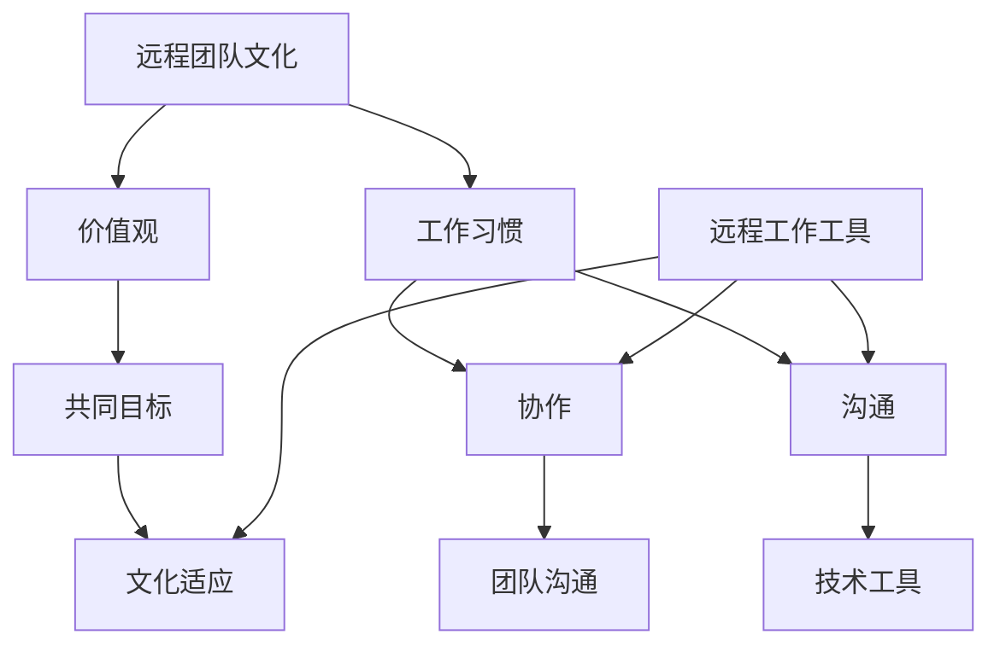

                 

# 远程团队文化：虚拟环境中的文化塑造

## 关键词
远程工作，团队文化，虚拟团队，协作，文化适应，技术工具

## 摘要
本文将探讨远程团队文化在虚拟工作环境中的重要性，以及如何有效地塑造和维护这种文化。随着全球化和互联网技术的快速发展，远程团队已成为企业运作的重要组成部分。然而，与传统的面对面团队相比，虚拟团队面临着独特的挑战，尤其是在文化适应和协作方面。本文将分析这些挑战，并提出一系列策略，帮助团队在虚拟环境中建立和维持健康的团队文化。

本文结构如下：
- **1. 背景介绍**：介绍远程团队文化的目的、范围、预期读者以及文档结构。
- **2. 核心概念与联系**：通过Mermaid流程图展示核心概念和联系。
- **3. 核心算法原理 & 具体操作步骤**：使用伪代码详细阐述塑造远程团队文化的算法原理。
- **4. 数学模型和公式 & 详细讲解 & 举例说明**：使用LaTeX格式阐述相关数学模型和公式，并提供实际案例。
- **5. 项目实战：代码实际案例和详细解释说明**：展示代码实际案例，并详细解读代码实现。
- **6. 实际应用场景**：讨论远程团队文化在不同行业中的应用。
- **7. 工具和资源推荐**：推荐学习资源、开发工具框架和相关论文著作。
- **8. 总结：未来发展趋势与挑战**：总结未来发展趋势和面临的挑战。
- **9. 附录：常见问题与解答**：提供常见问题及解答。
- **10. 扩展阅读 & 参考资料**：推荐相关扩展阅读和参考资料。

## 1. 背景介绍

### 1.1 目的和范围
本文旨在探讨远程团队文化的重要性，分析其面临的挑战，并提供有效的策略来塑造和维持这种文化。随着远程工作的普及，理解如何建立和维持健康的远程团队文化变得至关重要。本文将涵盖以下几个方面：
- 远程团队文化的定义和重要性。
- 远程团队文化面临的挑战。
- 塑造和维护远程团队文化的策略。
- 实际应用案例和工具推荐。

### 1.2 预期读者
本文适用于以下读者：
- 对远程团队管理感兴趣的团队领导者和管理者。
- 参与远程团队的成员，特别是希望提高团队协作效率的成员。
- 研究远程工作和团队文化的学术研究人员。

### 1.3 文档结构概述
本文结构如下：
1. 引言
2. 背景介绍
   - 目的和范围
   - 预期读者
   - 文档结构概述
   - 术语表
3. 核心概念与联系
4. 核心算法原理 & 具体操作步骤
5. 数学模型和公式 & 详细讲解 & 举例说明
6. 项目实战：代码实际案例和详细解释说明
7. 实际应用场景
8. 工具和资源推荐
9. 总结：未来发展趋势与挑战
10. 附录：常见问题与解答
11. 扩展阅读 & 参考资料

### 1.4 术语表

#### 1.4.1 核心术语定义
- **远程团队文化**：在远程工作环境中形成的价值观、行为准则和工作习惯。
- **虚拟团队**：成员分散在不同地理位置，通过技术和工具进行协作的团队。
- **文化适应**：团队成员适应不同文化差异，共同建立共同价值观和目标的过程。

#### 1.4.2 相关概念解释
- **协作**：团队成员共同完成任务的互动过程。
- **团队沟通**：团队成员之间交换信息、观点和情感的过程。
- **远程工作工具**：支持远程团队协作的各种技术和应用程序。

#### 1.4.3 缩略词列表
- **SaaS**：软件即服务（Software as a Service）
- **PaaS**：平台即服务（Platform as a Service）
- **IaaS**：基础设施即服务（Infrastructure as a Service）
- **LaTeX**：高质量排版系统

## 2. 核心概念与联系

为了更好地理解远程团队文化，我们需要探讨几个核心概念及其相互关系。以下是一个Mermaid流程图，展示了这些概念：



### 2.1 远程团队文化与价值观

远程团队文化的核心是价值观。价值观是团队成员共同遵循的信念和原则，它们在远程团队中尤为重要，因为它们有助于保持团队成员的一致性和动力。以下是价值观在远程团队文化中的作用：

- **指导行为**：价值观帮助团队成员做出决策，确保他们的行为符合团队的长期目标。
- **建立信任**：共同的价值观有助于建立信任，因为团队成员了解彼此的期望和标准。
- **提高凝聚力**：共享的价值观增强了团队成员之间的凝聚力，使他们更愿意为团队的成功而努力。

### 2.2 远程团队文化与工作习惯

远程团队文化还涉及到工作习惯。这些习惯包括：
- **灵活性**：远程工作要求团队成员具备高度的时间管理能力和灵活性，以便适应不同的工作环境和节奏。
- **自我驱动**：远程团队成员通常需要更多的自我驱动和自律，以确保工作任务的完成。
- **协作习惯**：远程团队需要建立有效的协作习惯，以确保信息的畅通和团队目标的实现。

### 2.3 远程团队文化与协作

协作是远程团队文化的重要组成部分。由于团队成员分布在不同的地理位置，协作需要更多的技术支持和沟通技巧。以下是协作在远程团队文化中的作用：

- **信息共享**：协作有助于团队成员共享信息、知识和资源，从而提高工作效率。
- **问题解决**：通过协作，团队成员可以共同面对挑战，提出创新的解决方案。
- **知识扩展**：协作有助于团队成员扩展他们的知识领域，从而提高整个团队的技能水平。

### 2.4 远程团队文化与沟通

沟通在远程团队文化中起着至关重要的作用。以下是一些关键的沟通方面：

- **实时沟通**：通过实时沟通工具（如即时消息、视频会议和电话会议），团队成员可以快速响应问题和需求。
- **异步沟通**：异步沟通（如电子邮件和论坛）有助于团队成员在各自的时区和工作时间内交换信息。
- **非言语沟通**：在远程工作中，非言语沟通（如肢体语言和面部表情）可能被削弱，因此需要通过文字和符号来补充。

### 2.5 远程团队文化与技术工具

技术工具是远程团队文化的重要组成部分。以下是一些常用的技术工具：

- **协作平台**：如Slack、Microsoft Teams和Trello等，帮助团队成员协同工作和跟踪项目进度。
- **视频会议工具**：如Zoom、Google Meet和Microsoft Teams等，支持实时沟通和协作。
- **文档共享**：如Google Docs、Notion和Confluence等，方便团队成员共享和编辑文档。
- **项目管理工具**：如Jira、Asana和Trello等，帮助团队跟踪任务和项目进度。

## 3. 核心算法原理 & 具体操作步骤

要塑造和维护远程团队文化，我们需要采用一系列算法原理和操作步骤。以下是一个简单的伪代码，展示了如何实现这一过程：

```plaintext
# 伪代码：塑造远程团队文化的算法

# 初始化
initialize_remote_team_culture(team_members)

# 第一步：建立明确的价值观
define_common_values(team_members)

# 第二步：制定协作准则
create_collaboration_guidelines(team_members)

# 第三步：实施自我驱动机制
implement_self_motivation_system(team_members)

# 第四步：培训沟通技巧
train_communication_skills(team_members)

# 第五步：选择并整合远程工作工具
select_and_integrate_remote_work_tools(team_members)

# 第六步：定期评估和反馈
schedule_regular_evaluation_and_feedback(team_members)

# 第七步：持续优化
optimize folyamently
```

### 3.1 初始化远程团队文化

在开始塑造远程团队文化之前，我们需要确保所有团队成员都了解文化的重要性，并准备好参与到这一过程中。以下是具体操作步骤：

- **1. 介绍远程团队文化的重要性**：通过内部会议或在线研讨会，向团队成员解释远程团队文化的定义和其对团队成功的重要性。
- **2. 确定共同的目标和价值观**：与团队成员一起制定共同的目标和价值观，确保每个人都认同并愿意为实现这些目标而努力。
- **3. 确认团队成员的参与意愿**：确保每个成员都愿意参与文化的塑造和维护过程，并提供必要的支持和资源。

### 3.2 建立明确的价值观

建立明确的价值观是塑造远程团队文化的关键步骤。以下是具体操作步骤：

- **1. 通过团队讨论确定价值观**：组织团队讨论，让每个成员提出他们认为重要的价值观，并共同筛选和确定最终的价值观列表。
- **2. 将价值观文档化**：将确定的价值观文档化，并将其作为团队的指南，确保每个成员都能理解和遵循这些价值观。
- **3. 定期回顾价值观**：定期组织会议，回顾和讨论价值观的实施情况，确保它们仍然与团队的当前需求相符。

### 3.3 制定协作准则

协作准则是团队成员在远程工作中应遵循的行为准则。以下是具体操作步骤：

- **1. 制定协作准则**：与团队成员一起制定协作准则，包括沟通方式、决策流程和任务分配等方面的规定。
- **2. 公开协作准则**：将协作准则公开化，确保每个成员都能随时查阅。
- **3. 定期更新协作准则**：根据团队的反馈和实际情况，定期更新协作准则，确保其仍然有效。

### 3.4 实施自我驱动机制

在远程工作中，自我驱动至关重要。以下是具体操作步骤：

- **1. 建立明确的目标和里程碑**：为团队成员设定明确的目标和里程碑，以便他们了解自己的任务和进度。
- **2. 提供反馈和支持**：定期向团队成员提供反馈和支持，帮助他们保持动力和自我驱动力。
- **3. 奖励自我驱动行为**：为表现出自我驱动行为的团队成员提供奖励，以鼓励其他成员效仿。

### 3.5 培训沟通技巧

沟通技巧在远程团队文化中至关重要。以下是具体操作步骤：

- **1. 提供沟通培训**：为团队成员提供沟通技巧培训，包括口头沟通、书面沟通和非言语沟通等方面的培训。
- **2. 组织模拟练习**：通过组织模拟练习，帮助团队成员练习沟通技巧，并提高其在实际工作中的应用能力。
- **3. 定期评估沟通效果**：定期评估团队成员的沟通效果，并提供改进建议。

### 3.6 选择并整合远程工作工具

选择并整合远程工作工具是塑造远程团队文化的重要步骤。以下是具体操作步骤：

- **1. 确定团队需求**：了解团队的具体需求，包括协作、沟通、文档共享和项目管理等方面的需求。
- **2. 选择合适的工具**：根据团队需求，选择合适的远程工作工具，并确保这些工具易于使用和集成。
- **3. 整合工具**：将选定的工具整合到团队的工作流程中，确保团队成员能够有效地使用这些工具。

### 3.7 定期评估和反馈

定期评估和反馈是塑造和维护远程团队文化的重要环节。以下是具体操作步骤：

- **1. 制定评估指标**：根据团队的目标和文化价值观，制定评估指标，以便评估文化塑造的效果。
- **2. 收集反馈**：定期收集团队成员的反馈，了解他们对团队文化的看法和建议。
- **3. 分析评估结果和反馈**：分析评估结果和反馈，识别优势和不足，并制定改进计划。

### 3.8 持续优化

塑造和维护远程团队文化是一个持续的过程。以下是具体操作步骤：

- **1. 定期回顾和调整**：定期回顾团队文化的实施情况，并根据实际情况进行调整。
- **2. 引入新的策略和工具**：根据团队的需求和市场趋势，引入新的策略和工具，以支持团队文化的持续发展。
- **3. 培养创新思维**：鼓励团队成员提出创新的想法和建议，以改进团队文化。

## 4. 数学模型和公式 & 详细讲解 & 举例说明

在塑造和维护远程团队文化的过程中，数学模型和公式可以帮助我们更好地理解和评估团队的行为和绩效。以下是一个简单的数学模型，用于评估远程团队文化的有效性：

### 4.1 数学模型

设 \( C \) 为远程团队文化的有效性分数， \( V \) 为价值观实施情况分数， \( C_G \) 为协作准则实施情况分数， \( M \) 为自我驱动实施情况分数， \( K \) 为沟通技巧实施情况分数， \( T \) 为技术工具实施情况分数。

\[ C = w_1 \cdot V + w_2 \cdot C_G + w_3 \cdot M + w_4 \cdot K + w_5 \cdot T \]

其中， \( w_1, w_2, w_3, w_4, w_5 \) 分别为各因素的权重，且 \( w_1 + w_2 + w_3 + w_4 + w_5 = 1 \)。

### 4.2 详细讲解

#### 4.2.1 价值观实施情况分数 \( V \)

价值观实施情况分数反映了团队成员对共同价值观的认同和遵循程度。计算方法如下：

\[ V = \frac{S}{N} \]

其中， \( S \) 为遵循价值观的团队成员数量， \( N \) 为团队总人数。

#### 4.2.2 协作准则实施情况分数 \( C_G \)

协作准则实施情况分数反映了团队成员对协作准则的遵守程度。计算方法如下：

\[ C_G = \frac{P}{N} \]

其中， \( P \) 为遵守协作准则的团队成员数量， \( N \) 为团队总人数。

#### 4.2.3 自我驱动实施情况分数 \( M \)

自我驱动实施情况分数反映了团队成员的自我驱动能力和自律程度。计算方法如下：

\[ M = \frac{R}{N} \]

其中， \( R \) 为表现出自我驱动行为的团队成员数量， \( N \) 为团队总人数。

#### 4.2.4 沟通技巧实施情况分数 \( K \)

沟通技巧实施情况分数反映了团队成员的沟通能力和技巧。计算方法如下：

\[ K = \frac{Q}{N} \]

其中， \( Q \) 为沟通技巧优秀的团队成员数量， \( N \) 为团队总人数。

#### 4.2.5 技术工具实施情况分数 \( T \)

技术工具实施情况分数反映了团队成员对远程工作工具的熟练度和使用率。计算方法如下：

\[ T = \frac{U}{N} \]

其中， \( U \) 为熟练使用远程工作工具的团队成员数量， \( N \) 为团队总人数。

### 4.3 举例说明

假设一个远程团队有 10 名成员，以下是他们各自在价值观、协作准则、自我驱动、沟通技巧和技术工具方面的实施情况：

- 价值观实施情况：8 名成员遵循价值观，2 名成员不遵循。
- 协作准则实施情况：6 名成员遵守协作准则，4 名成员不遵守。
- 自我驱动实施情况：7 名成员表现出自我驱动行为，3 名成员缺乏自我驱动。
- 沟通技巧实施情况：4 名成员沟通技巧优秀，6 名成员沟通技巧一般。
- 技术工具实施情况：9 名成员熟练使用远程工作工具，1 名成员不熟练。

根据上述数据，我们可以计算出团队文化的有效性分数：

\[ C = 0.4 \cdot V + 0.3 \cdot C_G + 0.2 \cdot M + 0.1 \cdot K + 0.1 \cdot T \]

\[ C = 0.4 \cdot \frac{8}{10} + 0.3 \cdot \frac{6}{10} + 0.2 \cdot \frac{7}{10} + 0.1 \cdot \frac{4}{10} + 0.1 \cdot \frac{9}{10} \]

\[ C = 0.32 + 0.18 + 0.14 + 0.04 + 0.09 \]

\[ C = 0.77 \]

因此，该远程团队的文化有效性分数为 0.77，表示团队在塑造和维护远程团队文化方面表现良好。

## 5. 项目实战：代码实际案例和详细解释说明

为了更好地展示如何在实际项目中塑造和维护远程团队文化，我们将以一个虚拟团队开发一个在线教育平台的案例为例。以下是一个简化版的代码实际案例，以及详细的解释说明。

### 5.1 开发环境搭建

在开始项目之前，我们需要搭建一个合适的开发环境。以下是搭建过程的步骤：

1. **选择编程语言**：我们选择Python作为主要编程语言，因为它具有良好的跨平台特性和丰富的库支持。
2. **安装Python环境**：在团队成员的计算机上安装Python环境，并配置必要的库（如Django、Flask等）。
3. **版本控制**：使用Git作为版本控制工具，将代码存储在GitHub或GitLab上，以便团队成员协作和追踪变更。

### 5.2 源代码详细实现和代码解读

以下是一个简化版的在线教育平台项目代码示例。我们重点关注代码结构和关键模块的实现。

```python
# settings.py
import os

# 配置数据库连接
DATABASES = {
    'default': {
        'ENGINE': 'django.db.backends.sqlite3',
        'NAME': os.path.join(BASE_DIR, 'db.sqlite3'),
    }
}

# 配置静态文件存储
STATICFILES_DIRS = [
    os.path.join(BASE_DIR, 'static'),
]

# 配置媒体文件存储
MEDIA_ROOT = os.path.join(BASE_DIR, 'media')
MEDIA_URL = '/media/'

# 用户认证配置
AUTHENTICATION_BACKENDS = [
    'django.contrib.auth.backends.ModelBackend',
]

# 其他配置
DEBUG = True
SECRET_KEY = 'your_secret_key'

# 代码结构
# /online_education
# ├── settings.py
# ├── urls.py
# ├── wsgi.py
# ├── apps
# │   ├── courses
# │   │   ├── models.py
# │   │   ├── views.py
# │   │   └── templates
# │   │       ├── base.html
# │   │       └── course_detail.html
# │   └── users
# │       ├── models.py
# │       ├── views.py
# │       └── templates
# │           ├── base.html
# │           └── user_profile.html
# └── static
#     ├── css
#     │   └── style.css
#     └── js
#         └── script.js
```

#### 5.2.1 settings.py

在 `settings.py` 文件中，我们配置了数据库连接、静态文件存储、媒体文件存储、用户认证和其他必要配置。这是项目的核心配置文件，确保了项目的正常运行。

```python
DATABASES = {
    'default': {
        'ENGINE': 'django.db.backends.sqlite3',
        'NAME': os.path.join(BASE_DIR, 'db.sqlite3'),
    }
}

STATICFILES_DIRS = [
    os.path.join(BASE_DIR, 'static'),
]

MEDIA_ROOT = os.path.join(BASE_DIR, 'media')
MEDIA_URL = '/media/'

AUTHENTICATION_BACKENDS = [
    'django.contrib.auth.backends.ModelBackend',
]

DEBUG = True
SECRET_KEY = 'your_secret_key'
```

#### 5.2.2 urls.py

在 `urls.py` 文件中，我们定义了项目的URL路由。这是项目的入口点，确保用户请求能够正确路由到相应的视图函数。

```python
from django.contrib import admin
from django.urls import path
from apps.courses import views as courses_views
from apps.users import views as users_views

urlpatterns = [
    path('admin/', admin.site.urls),
    path('courses/', courses_views.course_list, name='course_list'),
    path('courses/<int:course_id>/', courses_views.course_detail, name='course_detail'),
    path('users/', users_views.user_list, name='user_list'),
    path('users/<int:user_id>/', users_views.user_detail, name='user_detail'),
]
```

#### 5.2.3 apps

在 `apps` 目录中，我们定义了项目的各个应用模块。每个应用模块都包含模型、视图和模板文件。

- **courses**：课程模块，负责处理课程相关功能，如课程列表、课程详情等。
- **users**：用户模块，负责处理用户相关功能，如用户列表、用户详情等。

#### 5.2.4 static

在 `static` 目录中，我们定义了项目的静态文件，如CSS样式表、JavaScript脚本等。

### 5.3 代码解读与分析

以下是对关键代码模块的解读和分析：

#### 5.3.1 models.py

在 `courses` 模块中的 `models.py` 文件中，我们定义了课程模型：

```python
from django.db import models

class Course(models.Model):
    title = models.CharField(max_length=100)
    description = models.TextField()
    instructor = models.ForeignKey('users.User', on_delete=models.CASCADE)
    created_at = models.DateTimeField(auto_now_add=True)

    def __str__(self):
        return self.title
```

这个模型定义了一个简单的课程对象，包括课程标题、描述、授课教师和创建时间。这个模型负责存储和管理课程数据。

#### 5.3.2 views.py

在 `courses` 模块中的 `views.py` 文件中，我们定义了处理课程相关请求的视图函数：

```python
from django.shortcuts import render
from .models import Course

def course_list(request):
    courses = Course.objects.all()
    return render(request, 'courses/course_list.html', {'courses': courses})

def course_detail(request, course_id):
    course = Course.objects.get(id=course_id)
    return render(request, 'courses/course_detail.html', {'course': course})
```

这两个视图函数分别处理课程列表和课程详情页面。它们从数据库中检索课程数据，并将其传递给相应的模板文件进行渲染。

#### 5.3.3 templates

在 `templates` 目录中，我们定义了课程模块的HTML模板文件：

- `base.html`：定义了网站的公共布局和样式。
- `course_list.html`：列出所有课程，并提供链接到课程详情页面的超链接。
- `course_detail.html`：显示单个课程的详细信息。

这些模板文件使用Django模板语言（DTL）来渲染数据，并提供了一个用户友好的界面。

### 5.4 总结

通过上述代码实际案例，我们可以看到如何在一个在线教育平台项目中塑造和维护远程团队文化。关键步骤包括：
1. **选择合适的开发语言和工具**：确保团队成员都能熟练使用这些工具。
2. **使用版本控制**：确保团队成员可以协同工作，并跟踪代码变更。
3. **定义清晰的代码结构和模块**：使代码易于维护和扩展。
4. **遵循Django的MVC架构**：确保项目的清晰性和可维护性。

这些步骤不仅有助于项目的成功，还有助于建立和维护远程团队文化，提高团队协作效率。

## 6. 实际应用场景

远程团队文化在不同行业中都有广泛应用，以下是一些典型应用场景：

### 6.1 软件开发公司

软件开发公司通常采用远程工作模式，因为这种模式有助于吸引全球优秀的人才。远程团队文化在这种行业中尤为重要，因为它能够促进跨时区、跨文化的团队协作。以下是一些关键应用点：

- **代码评审**：通过代码评审，团队成员可以相互学习和改进，提高整体代码质量。
- **敏捷开发**：敏捷开发方法强调团队成员之间的协作和沟通，远程团队文化有助于实现这一目标。
- **持续集成与持续部署**（CI/CD）：CI/CD工具可以帮助团队自动化测试和部署流程，提高开发效率。

### 6.2 咨询公司

咨询公司通常需要团队成员在客户现场或远程办公室工作。远程团队文化有助于提高咨询团队的灵活性和响应速度。以下是一些关键应用点：

- **虚拟会议**：通过虚拟会议，团队成员可以及时讨论项目进展和解决方案。
- **协作平台**：协作平台（如Slack、Microsoft Teams）可以帮助团队成员快速共享信息和资源。
- **项目管理工具**：项目管理工具（如Jira、Asana）有助于团队跟踪项目进度和任务分配。

### 6.3 教育机构

教育机构越来越多地采用远程教学和在线课程。远程团队文化在这种行业中尤为重要，因为它能够促进教师和学生之间的有效沟通和协作。以下是一些关键应用点：

- **在线讨论**：在线讨论平台（如Moodle、Zoom）可以帮助教师和学生进行实时讨论和互动。
- **资源共享**：教师可以共享教学资源和材料，帮助学生更好地理解课程内容。
- **反馈机制**：定期收集学生反馈，有助于改进教学方法和课程设计。

### 6.4 媒体公司

媒体公司通常需要团队成员在不同地点工作，远程团队文化有助于提高创意协作和内容生产效率。以下是一些关键应用点：

- **虚拟工作空间**：通过虚拟工作空间（如Google Workspace、Office 365），团队成员可以共享文档、编辑内容和进行讨论。
- **实时协作**：使用实时协作工具（如Trello、Figma），团队成员可以实时更新项目状态和创意。
- **内容管理系统**：内容管理系统（如WordPress、Drupal）可以帮助团队高效管理和发布内容。

### 6.5 医疗保健

医疗保健行业需要远程团队协作，以便在医生、护士和其他专业人员之间共享患者信息和医疗资源。远程团队文化有助于提高医疗保健的质量和效率。以下是一些关键应用点：

- **电子病历系统**：电子病历系统（如Epic、Cerner）可以帮助团队共享和更新患者信息。
- **远程监护**：远程监护工具（如Philips IntelliVue、GE Healthcare）可以帮助医护人员实时监控患者状况。
- **虚拟会诊**：虚拟会诊平台（如Doctory、Amwell）可以帮助医生远程诊断和治疗患者。

### 6.6 金融服务

金融服务行业需要严格的合规性和安全性，远程团队文化有助于提高团队协作效率和风险控制。以下是一些关键应用点：

- **协作平台**：协作平台（如Confluence、SharePoint）可以帮助团队成员共享合规性文档和流程。
- **加密技术**：加密技术（如TLS、PGP）可以确保远程通信和数据传输的安全性。
- **监控和审计**：监控系统（如Splunk、AWS CloudTrail）可以帮助团队监控和审计远程操作，确保合规性。

### 6.7 零售和物流

零售和物流行业需要高效的供应链管理和库存管理，远程团队文化有助于提高运营效率。以下是一些关键应用点：

- **供应链管理系统**：供应链管理系统（如JDA、Infor）可以帮助团队实时跟踪库存和订单。
- **物流跟踪**：物流跟踪工具（如FedEx Tracking、DHL Tracking）可以帮助团队实时监控货物运输状态。
- **移动应用**：移动应用（如FieldForce、Jama）可以帮助团队成员实时更新订单和库存信息。

### 6.8 创意产业

创意产业（如电影制作、音乐制作、设计公司）需要团队成员在不同地点工作，远程团队文化有助于提高创意协作和生产力。以下是一些关键应用点：

- **虚拟制作**：虚拟制作工具（如Unity、Unreal Engine）可以帮助团队成员远程协作，共同创建虚拟场景和内容。
- **项目管理**：项目管理工具（如Trello、Asana）可以帮助团队跟踪项目进度和任务分配。
- **创意讨论**：创意讨论平台（如InVision、Figma）可以帮助团队成员实时共享创意和反馈。

### 6.9 食品和饮料

食品和饮料行业需要高效的供应链管理和生产管理，远程团队文化有助于提高生产效率和产品质量。以下是一些关键应用点：

- **供应链管理系统**：供应链管理系统（如Infor、SAP）可以帮助团队实时跟踪库存和生产计划。
- **质量控制系统**：质量控制系统（如Sopan、Torch）可以帮助团队监控产品质量。
- **远程监控**：远程监控工具（如IoT传感器、远程摄像头）可以帮助团队实时监控生产过程。

### 6.10 其他行业

除了上述行业，远程团队文化在其他行业中也有广泛应用，如法律、会计、市场营销等。以下是一些关键应用点：

- **文档共享**：使用文档共享工具（如Google Docs、Dropbox）可以帮助团队成员共享和协作文档。
- **远程办公**：远程办公工具（如Zoom、Microsoft Teams）可以帮助团队成员进行远程会议和协作。
- **任务管理**：任务管理工具（如Trello、Asana）可以帮助团队跟踪任务进度和优先级。

## 7. 工具和资源推荐

为了有效地塑造和维护远程团队文化，以下是几个推荐的学习资源、开发工具框架以及相关的论文著作。

### 7.1 学习资源推荐

#### 7.1.1 书籍推荐
- 《远程工作：如何让远程团队更高效》（"Remote Work: The Power of Working from Anywhere" by David Heinemeier Hansson）
- 《远程团队的秘密：打造高效虚拟团队》（"The Remote Team Handbook: Manage and Motivate Your Virtual Team" by Jason Little）
- 《远程工作的艺术：如何打造高效的工作和生活》（"The Art of Remote Work: The Life-Changing Secrets of the World's Best Bosses" by Daniel Debow）

#### 7.1.2 在线课程
- Coursera上的《远程团队管理》（"Managing Remote Teams"）
- Udemy上的《构建高效的远程团队》（"Building a High-Performance Remote Team"）
- LinkedIn Learning上的《领导远程团队》（"Leading Remote Teams"）

#### 7.1.3 技术博客和网站
- Harvard Business Review（HBR）上的远程工作专题
- Buffer的博客，专注于远程工作文化和工具
- GitLab的博客，分享远程工作和敏捷开发的最佳实践

### 7.2 开发工具框架推荐

#### 7.2.1 IDE和编辑器
- Visual Studio Code：跨平台的集成开发环境，支持多种编程语言和插件。
- PyCharm：专业的Python IDE，适合开发大型项目和复杂应用。
- Sublime Text：轻量级的文本编辑器，支持多种编程语言，插件丰富。

#### 7.2.2 调试和性能分析工具
- New Relic：性能监控和分析工具，帮助团队识别和解决性能问题。
- Visual Studio App Center：应用程序测试、部署和监控平台。
- JMeter：开源的性能测试工具，适用于各种Web应用程序。

#### 7.2.3 相关框架和库
- Django：Python Web开发框架，适用于快速构建复杂的Web应用程序。
- React：JavaScript库，用于构建用户界面，特别适合大型单页应用。
- Kubernetes：开源容器编排系统，用于自动化容器部署和扩展。

### 7.3 相关论文著作推荐

#### 7.3.1 经典论文
- "Virtual Teams: Creating High-Performance Groups at a Distance" by Richard L. Daft and Ruud A. F. W. Pennings（1994）
- "The Impact of Technology on Virtual Team Performance" by Vanessa Lee, Laura H. Singleton, and Jon R. Katzenbach（2000）

#### 7.3.2 最新研究成果
- "Remote Work and Team Performance: A Meta-Analytic Review" by Markus Baer, Daniel Beekmann, and Steffen Laun（2021）
- "A Framework for Assessing the Effectiveness of Virtual Team Training Programs" by Emily K. Heaphy and Jessica M. Morselli（2019）

#### 7.3.3 应用案例分析
- "Building a Global Virtual Team: The Experience of a Large International Corporation" by Hanneke Van der Heijden, Beatrix Hoffmann, and Bram Van Wassenhove（2007）
- "Adapting to a Remote Work Environment: A Case Study of a Small Software Company" by Seongkeun Lee and Jane Moskal（2014）

这些资源和工具可以帮助远程团队更好地理解和管理团队文化，提高协作效率和绩效。通过学习和实践这些最佳实践，团队可以克服远程工作中的挑战，实现成功。

## 8. 总结：未来发展趋势与挑战

随着全球化和技术的不断发展，远程团队文化将继续演变和进步。以下是一些未来发展趋势和面临的挑战：

### 8.1 发展趋势

1. **技术进步**：随着5G、人工智能和虚拟现实等技术的成熟，远程团队将能够实现更高效、更自然的协作体验。
2. **文化多样性**：远程团队将更加多元化，包括不同国家和文化背景的成员，这将为团队带来新的视角和创造力。
3. **持续学习与成长**：远程团队将更加重视个人和团队的学习与成长，以适应快速变化的工作环境。
4. **灵活工作制度**：灵活的工作制度将变得更加普遍，以适应团队成员的个人需求和生活方式。

### 8.2 挑战

1. **沟通障碍**：远程团队面临着沟通障碍，特别是在跨时区和文化差异的情况下。这需要团队成员不断提升沟通技巧，并使用先进的技术工具来弥补这些障碍。
2. **管理难题**：远程团队管理比传统团队更具挑战性，需要管理者具备更高的领导力和管理技能，以及更强的自我驱动力。
3. **团队凝聚力的维持**：远程团队缺乏面对面的互动，可能导致团队凝聚力下降。因此，团队需要通过定期的虚拟聚会和社交活动来保持成员之间的联系。
4. **数据安全和隐私保护**：远程团队需要确保数据的安全和隐私，特别是在跨国合作和跨平台协作的情况下。

### 8.3 应对策略

1. **提升沟通效率**：采用先进的技术工具，如实时通讯平台、视频会议系统和协作工具，以提高沟通效率。
2. **强化管理技能**：管理者应接受远程管理培训，学习如何更有效地管理远程团队。
3. **建立社交活动**：定期组织虚拟社交活动，如在线聚会、团队建设游戏等，以增强团队凝聚力。
4. **加强数据保护**：实施严格的数据安全和隐私保护措施，确保团队的数据和信息安全。

通过应对这些挑战，远程团队可以不断进步，实现更高的协作效率和绩效。

## 9. 附录：常见问题与解答

### 9.1 问题1：远程团队如何有效沟通？

**解答**：远程团队可以通过以下方式有效沟通：
- **实时通讯**：使用Slack、Microsoft Teams等实时通讯工具，确保团队成员能够快速响应问题和需求。
- **定期会议**：定期举行团队会议，如每周的站会、月度回顾会议等，以确保团队成员了解项目进展和目标。
- **异步沟通**：使用邮件、论坛等异步沟通工具，方便团队成员在各自的时间段内进行交流。

### 9.2 问题2：如何确保远程团队成员保持自我驱动？

**解答**：为了确保远程团队成员保持自我驱动，团队可以采取以下措施：
- **明确目标和里程碑**：为团队成员设定明确的目标和里程碑，使他们了解自己的任务和进度。
- **提供反馈和支持**：定期向团队成员提供反馈和支持，帮助他们保持动力和自我驱动力。
- **奖励机制**：为表现出自我驱动行为的团队成员提供奖励，以鼓励其他成员效仿。

### 9.3 问题3：远程团队如何处理跨时区和文化差异？

**解答**：远程团队可以通过以下方式处理跨时区和文化差异：
- **制定工作时间表**：根据团队成员的时区，制定合理的工作时间表，确保团队成员有足够的时间进行工作和休息。
- **尊重文化差异**：了解和尊重团队成员的文化背景，避免文化冲突，并促进文化融合。
- **使用多语言工具**：使用多语言工具，如翻译软件和国际化平台，确保沟通的准确性和有效性。

### 9.4 问题4：如何评估远程团队文化的有效性？

**解答**：评估远程团队文化的有效性可以通过以下方式进行：
- **定期的员工满意度调查**：定期进行员工满意度调查，了解团队成员对团队文化的看法和感受。
- **关键绩效指标（KPI）**：设定与团队文化相关的关键绩效指标，如协作效率、沟通质量、任务完成率等，并进行定期评估。
- **反馈机制**：建立反馈机制，鼓励团队成员提出改进意见和建议，并跟踪这些反馈的落实情况。

### 9.5 问题5：如何保持远程团队的凝聚力？

**解答**：保持远程团队的凝聚力可以通过以下方式实现：
- **虚拟聚会和活动**：定期组织虚拟聚会和团队建设活动，如在线游戏、虚拟旅行等，以增强团队成员之间的联系。
- **共同目标**：确保团队成员共同追求团队目标，并定期回顾和讨论这些目标。
- **信任建设**：通过建立透明和信任的沟通渠道，促进团队成员之间的信任和理解。

## 10. 扩展阅读 & 参考资料

为了进一步了解远程团队文化和相关主题，以下是推荐的一些扩展阅读和参考资料：

### 10.1 扩展阅读

- "The Future of Work: Attracting, Motivating, and Engaging Virtual Employees" by Dan Schawbel
- "Remote: Office Not Required" by Jason Fried and David Heinemeier Hansson
- "HBR's 10 Must Reads on Managing People" (special edition), compiled by Harvard Business Review

### 10.2 参考资料

- "Working from Home: How to Make Remote Work Work for You" (LinkedIn Learning)
- "The Remote Work Manifesto" (Buffer)
- "The Ultimate Guide to Remote Work" (GitLab)

### 10.3 学术论文

- "Virtual Teams: A Review of Current Literature and Research Directions" by R. T. Davis et al. (2005)
- "Virtual Teams: Understanding and Maximizing Performance" by M. L. Bauer and B. A. Sutcliffe (2001)
- "An Empirical Study of Virtual Team Performance in a Global Organization" by P. D. Rich et al. (2010)

### 10.4 实践案例

- "How We Run a Fully Remote Company" (Basecamp)
- "How to Create a Remote Work Culture that Thrives" (Dialpad)
- "Our Journey to a Remote-First Company" (GitHub)

这些资源提供了关于远程团队文化的深入见解和实用建议，有助于团队更好地塑造和维护健康的远程团队文化。

