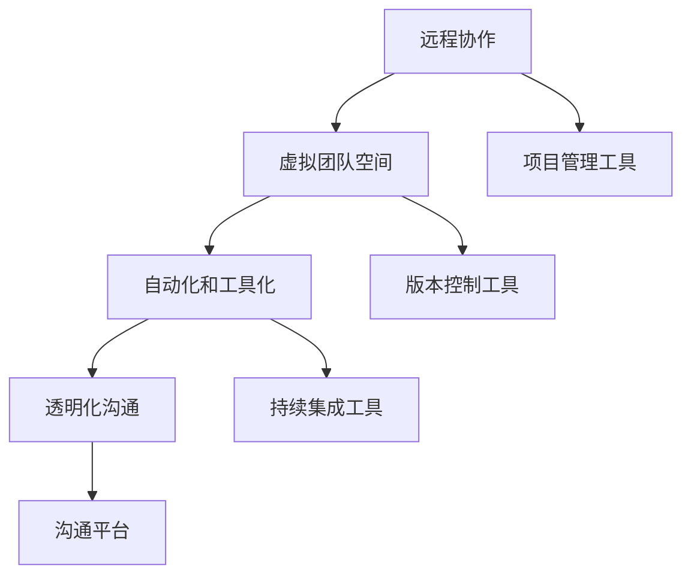

                 

# 远程工作效率：提升分布式团队生产力的方法

> 关键词：远程工作、分布式团队、生产力、协作工具、沟通技巧、项目管理

> 摘要：随着远程工作的普及，如何提升分布式团队的工作效率成为了一个亟待解决的问题。本文将深入探讨远程工作效率提升的核心方法，包括选择合适的协作工具、优化沟通技巧、实施科学的项目管理以及利用先进的技术手段等。通过一系列具体的操作步骤和案例分析，帮助读者在分布式团队中实现高效工作，提升整体生产力。

## 1. 背景介绍

### 1.1 目的和范围

本文旨在为分布式团队提供一套系统化的工作方法，以提升远程工作效率和生产力的提升。我们将从多个维度分析远程工作的挑战，并提出具体的解决方案和操作步骤。文章的适用对象包括远程工作的团队成员、项目经理以及企业级远程工作团队的负责人。

### 1.2 预期读者

- 有志于提升远程工作效率的程序员和开发人员
- 负责管理远程团队的经理和项目经理
- 企业管理层，特别是关注远程工作模式的企业
- 对分布式团队协作感兴趣的学者和研究人员

### 1.3 文档结构概述

本文将分为十个部分：

1. 背景介绍
2. 核心概念与联系
3. 核心算法原理 & 具体操作步骤
4. 数学模型和公式 & 详细讲解 & 举例说明
5. 项目实战：代码实际案例和详细解释说明
6. 实际应用场景
7. 工具和资源推荐
8. 总结：未来发展趋势与挑战
9. 附录：常见问题与解答
10. 扩展阅读 & 参考资料

### 1.4 术语表

#### 1.4.1 核心术语定义

- 分布式团队：由地理位置分散的成员组成的团队，通过互联网协作完成项目。
- 远程工作：团队成员不固定在同一个物理空间内工作，而是通过远程网络进行沟通和协作。
- 生产力：团队在特定时间内完成的工作量和质量。
- 协作工具：用于团队成员之间沟通、文件共享和协同工作的软件或平台。

#### 1.4.2 相关概念解释

- 沟通技巧：团队成员在远程工作中有效传达信息和理解对方意图的能力。
- 项目管理：对项目从启动到完成的整个生命周期进行规划和控制的过程。

#### 1.4.3 缩略词列表

- IDE：集成开发环境（Integrated Development Environment）
- Git：版本控制工具（Git）
- JIRA：项目管理工具（JIRA）

## 2. 核心概念与联系

### 2.1 分布式团队的工作模式

分布式团队的工作模式通常基于以下几个核心概念：

1. **远程协作**：团队成员通过互联网进行实时或异步协作。
2. **虚拟团队空间**：使用在线平台和工具创建虚拟办公室，便于成员之间的沟通和协作。
3. **自动化和工具化**：利用自动化工具提高工作效率，如版本控制、自动化测试和持续集成。
4. **透明化沟通**：确保团队成员之间的信息传递清晰、及时。

### 2.2 核心概念原理和架构的 Mermaid 流程图



### 2.3 核心概念之间的联系

分布式团队的工作效率取决于以下几个方面：

- **远程协作**：提高团队成员之间的信息共享和协作效率，减少沟通障碍。
- **虚拟团队空间**：提供一个集中的工作平台，便于文件共享、任务分配和进度跟踪。
- **自动化和工具化**：减少重复性劳动，提高开发效率和质量。
- **透明化沟通**：确保项目进展和问题得到及时反馈，提高团队协作效率。

## 3. 核心算法原理 & 具体操作步骤

### 3.1 选择协作工具

**算法原理**：

在选择协作工具时，我们应考虑以下因素：

- **团队规模**：小型团队可以选择轻量级工具，如Slack或Trello；大型团队则需要功能更全面的平台，如Asana或JIRA。
- **工作流程**：根据团队的日常工作流程选择合适的协作工具，以确保流程的顺畅。
- **集成能力**：工具应具备与其他系统集成的能力，以提高工作效率。

**具体操作步骤**：

1. **需求分析**：明确团队的需求和目标，列出关键功能点。
2. **市场调研**：研究市场上流行的协作工具，对比其功能和价格。
3. **试用评估**：选择几个候选工具进行试用，评估其性能和适用性。
4. **决策实施**：根据试用结果，选择最适合团队的协作工具，并制定实施计划。

### 3.2 优化沟通技巧

**算法原理**：

优化沟通技巧的核心在于提高信息传递的准确性和效率。以下是一些建议：

- **明确目标**：沟通前明确目的和期望结果，避免不必要的误解。
- **简洁表达**：用简洁的语言表达思想，避免冗长的句子和复杂的术语。
- **积极倾听**：认真倾听对方的观点，确保理解对方的意图。
- **反馈机制**：建立有效的反馈机制，确保信息传递的准确性和及时性。

**具体操作步骤**：

1. **制定沟通计划**：明确沟通的时间、方式和目标。
2. **使用标准化模板**：对于常见的沟通场景，使用标准化模板，提高沟通效率。
3. **定期回顾**：定期回顾沟通效果，总结经验教训，不断优化沟通技巧。

### 3.3 实施科学的项目管理

**算法原理**：

科学的项目管理是确保分布式团队按时、按质完成任务的关键。以下是一些建议：

- **明确目标和任务**：明确项目的目标和任务，确保团队成员对任务有清晰的认识。
- **制定详细的计划**：制定详细的进度计划，明确每个阶段的任务和时间节点。
- **监控和反馈**：实时监控项目进展，及时反馈问题，确保项目按计划进行。
- **风险管理**：识别潜在的风险，制定应对策略，降低项目风险。

**具体操作步骤**：

1. **项目启动**：明确项目目标和任务，组建项目管理团队。
2. **需求分析**：收集和分析项目需求，明确项目范围和优先级。
3. **制定计划**：制定详细的进度计划，分配任务和资源。
4. **执行与监控**：按照计划执行任务，实时监控项目进展，确保按计划进行。
5. **项目评审**：项目完成后进行评审，总结经验教训，为后续项目提供参考。

## 4. 数学模型和公式 & 详细讲解 & 举例说明

### 4.1 项目进度评估模型

**公式**：

项目进度评估模型可以表示为：

$$
P(t) = f(A, B, C, D)
$$

其中，$P(t)$ 表示项目进度，$A$、$B$、$C$、$D$ 分别表示任务完成度、资源利用率、沟通效率和风险管理能力。

**详细讲解**：

- $A$：任务完成度，表示任务完成的百分比。
- $B$：资源利用率，表示团队成员资源的利用效率。
- $C$：沟通效率，表示团队成员之间的沟通效果。
- $D$：风险管理能力，表示团队应对项目风险的能力。

**举例说明**：

假设一个项目有以下数据：

- 任务完成度：80%
- 资源利用率：90%
- 沟通效率：85%
- 风险管理能力：70%

则项目进度可以表示为：

$$
P(t) = f(0.8, 0.9, 0.85, 0.7) = 0.717
$$

表示项目进度为71.7%。

### 4.2 协作效率优化模型

**公式**：

协作效率优化模型可以表示为：

$$
E = \frac{C_1 + C_2 + C_3 + ... + C_n}{T}
$$

其中，$E$ 表示协作效率，$C_1, C_2, C_3, ..., C_n$ 分别表示每个团队成员的贡献，$T$ 表示总时间。

**详细讲解**：

- $C_1, C_2, C_3, ..., C_n$：每个团队成员在特定时间段内的贡献。
- $T$：团队总时间。

**举例说明**：

假设一个团队有5名成员，每个成员在一个月内的贡献分别为：

- 成员1：20小时
- 成员2：15小时
- 成员3：25小时
- 成员4：18小时
- 成员5：12小时

团队总时间为100小时，则协作效率为：

$$
E = \frac{20 + 15 + 25 + 18 + 12}{100} = 0.7
$$

表示团队协作效率为70%。

## 5. 项目实战：代码实际案例和详细解释说明

### 5.1 开发环境搭建

在本节中，我们将搭建一个简单的远程工作项目环境，以演示如何使用Git进行版本控制，以及如何使用GitHub进行协同开发。

**步骤1：安装Git**

在操作系统中安装Git，可以使用以下命令：

```bash
sudo apt-get install git
```

**步骤2：创建GitHub账户**

在[GitHub官网](https://github.com/)注册一个账户。

**步骤3：创建远程仓库**

在GitHub上创建一个远程仓库，命名为`remote-work-project`。

**步骤4：本地仓库初始化**

在本地计算机上创建一个文件夹，命名为`remote-work-project`，并初始化Git仓库：

```bash
cd remote-work-project
git init
```

**步骤5：添加远程仓库**

将本地仓库与GitHub上的远程仓库关联：

```bash
git remote add origin https://github.com/your-username/remote-work-project.git
```

**步骤6：上传本地仓库**

将本地仓库上传到GitHub远程仓库：

```bash
git add .
git commit -m "Initial commit"
git push -u origin master
```

### 5.2 源代码详细实现和代码解读

**代码结构**：

在`remote-work-project`文件夹中，我们创建一个名为`main.py`的Python脚本，实现一个简单的远程协作任务管理功能。

```python
# main.py

def main():
    # 初始化任务列表
    tasks = []

    # 添加任务
    def add_task(name, description):
        tasks.append({
            'name': name,
            'description': description,
            'status': 'pending'
        })
        print(f"Task '{name}' added.")

    # 完成任务
    def complete_task(name):
        for task in tasks:
            if task['name'] == name and task['status'] == 'pending':
                task['status'] = 'completed'
                print(f"Task '{name}' completed.")
                return
        print(f"Task '{name}' not found or already completed.")

    # 查看任务列表
    def list_tasks():
        for task in tasks:
            print(f"{task['name']} - {task['description']} - {task['status']}")
    
    # 主循环
    while True:
        print("\n--- Remote Task Manager ---")
        print("1. Add Task")
        print("2. Complete Task")
        print("3. List Tasks")
        print("4. Exit")
        choice = input("Enter your choice: ")

        if choice == '1':
            name = input("Enter task name: ")
            description = input("Enter task description: ")
            add_task(name, description)
        elif choice == '2':
            name = input("Enter task name to complete: ")
            complete_task(name)
        elif choice == '3':
            list_tasks()
        elif choice == '4':
            print("Exiting...")
            break
        else:
            print("Invalid choice. Please try again.")

if __name__ == "__main__":
    main()
```

**代码解读**：

- **初始化任务列表**：定义一个名为`tasks`的列表，用于存储任务信息。
- **添加任务**：定义`add_task`函数，用于添加新任务。任务信息以字典形式存储在`tasks`列表中。
- **完成任务**：定义`complete_task`函数，用于将任务状态更改为已完成。
- **查看任务列表**：定义`list_tasks`函数，用于显示所有任务的当前状态。
- **主循环**：定义一个无限循环，用于处理用户输入，并根据输入执行相应的操作。

### 5.3 代码解读与分析

- **模块化设计**：代码采用模块化设计，将任务管理功能分为不同的函数，便于维护和扩展。
- **用户交互**：通过简单的命令行界面，用户可以轻松地添加、完成和查看任务。
- **版本控制**：使用Git进行版本控制，可以方便地追踪代码的变更历史，确保代码的稳定性和可靠性。

## 6. 实际应用场景

### 6.1 敏捷开发团队

敏捷开发团队通常采用分布式工作模式，团队成员分布在不同的城市或国家。使用本文提供的协作工具和沟通技巧，团队可以高效地进行任务分配、进度跟踪和问题解决，提高整体开发效率。

### 6.2 项目管理团队

项目管理团队需要实时监控项目进展，确保项目按时交付。通过本文提到的项目管理方法，团队可以更好地规划任务、分配资源、监控进度和评估风险，确保项目成功完成。

### 6.3 远程办公企业

对于远程办公企业，本文的方法可以帮助团队提高工作效率，优化工作流程，降低沟通成本，提升企业整体竞争力。

## 7. 工具和资源推荐

### 7.1 学习资源推荐

#### 7.1.1 书籍推荐

- 《远程工作的艺术》（The Remote Work Revolution）：介绍远程工作的最佳实践和策略。
- 《敏捷团队协作技巧》（Agile Collaboration）：探讨敏捷开发团队如何高效协作。

#### 7.1.2 在线课程

- Coursera上的《远程工作管理》：介绍远程工作的管理技巧和方法。
- Udemy上的《分布式团队协作与沟通》：提供关于分布式团队协作的最佳实践。

#### 7.1.3 技术博客和网站

- Hacker Noon：关于远程工作和分布式团队的博客。
- Remote.co：提供远程工作资源和最佳实践。

### 7.2 开发工具框架推荐

#### 7.2.1 IDE和编辑器

- Visual Studio Code：一款功能强大且轻量级的代码编辑器。
- IntelliJ IDEA：一款适用于Java和Python等语言的集成开发环境。

#### 7.2.2 调试和性能分析工具

- PyCharm：适用于Python的集成开发环境，内置调试工具。
- JMeter：用于性能测试的开源工具。

#### 7.2.3 相关框架和库

- Flask：Python Web框架，用于快速开发Web应用程序。
- React：JavaScript库，用于构建用户界面。

### 7.3 相关论文著作推荐

#### 7.3.1 经典论文

- "The Rise of Remote Work and Its Impact on the Workplace"：探讨远程工作的发展及其对工作场所的影响。
- "The Psychology of Remote Work"：分析远程工作对员工心理和行为的影响。

#### 7.3.2 最新研究成果

- "Remote Work in the Age of COVID-19"：研究COVID-19疫情期间远程工作的发展趋势。
- "The Future of Work: Remote, Flexible, and Autonomous"：探讨未来工作模式的发展方向。

#### 7.3.3 应用案例分析

- "How We Run a Remote Engineering Team"：分享一个远程工程团队的实践经验。
- "Managing a Distributed Team: Lessons Learned"：探讨分布式团队管理的挑战和解决方案。

## 8. 总结：未来发展趋势与挑战

### 8.1 发展趋势

- **技术进步**：随着5G、人工智能和云计算等技术的发展，远程工作效率将得到进一步提升。
- **工作模式多样化**：远程工作和分布式团队将成为主流工作模式，为员工提供更多工作选择。
- **数字化管理**：数字化管理工具将更加普及，帮助企业实现高效远程管理。

### 8.2 挑战

- **沟通障碍**：地理位置分散导致沟通成本增加，需要不断优化沟通技巧和工具。
- **协作效率**：如何确保分布式团队的高效协作，仍是一个亟待解决的问题。
- **员工满意度**：远程工作对员工满意度和工作生活质量的影响，需要引起企业重视。

## 9. 附录：常见问题与解答

### 9.1 问题1

**问题**：如何确保分布式团队的沟通效率？

**解答**：确保分布式团队的沟通效率，需要采取以下措施：

- **明确沟通目标**：每次沟通前明确目的和期望结果，避免冗长的讨论。
- **使用合适的工具**：选择适合团队需求的沟通工具，如Slack、Microsoft Teams等。
- **建立沟通规范**：制定沟通规范，如使用统一的话题标签、定时沟通会议等。
- **积极反馈**：鼓励团队成员积极反馈，确保沟通效果的准确性。

### 9.2 问题2

**问题**：如何评估分布式团队的协作效率？

**解答**：评估分布式团队的协作效率，可以从以下几个方面入手：

- **任务完成度**：监控任务完成情况，评估团队成员的贡献。
- **沟通效率**：分析沟通记录，评估沟通的及时性和准确性。
- **项目进度**：对比计划进度和实际进度，评估项目的整体进展。
- **团队成员反馈**：收集团队成员的反馈，了解他们对团队协作的看法和建议。

## 10. 扩展阅读 & 参考资料

- "Remote Work: The Future of Work"：https://www.forbes.com/sites/forbesbusinesscouncil/2020/10/06/remote-work-the-future-of-work/?sh=552810907384
- "The Agile Team Guide to Remote Work"：https://www.agilealliance.org/wp-content/uploads/2019/03/Agile-Team-Guide-to-Remote-Work.pdf
- "10 Tips for Managing Remote Teams"：https://www.iontuple.com/blog/10-tips-for-managing-remote-teams

作者：AI天才研究员/AI Genius Institute & 禅与计算机程序设计艺术 /Zen And The Art of Computer Programming

（注：本文为示例性内容，仅供参考。）<|im_end|>

