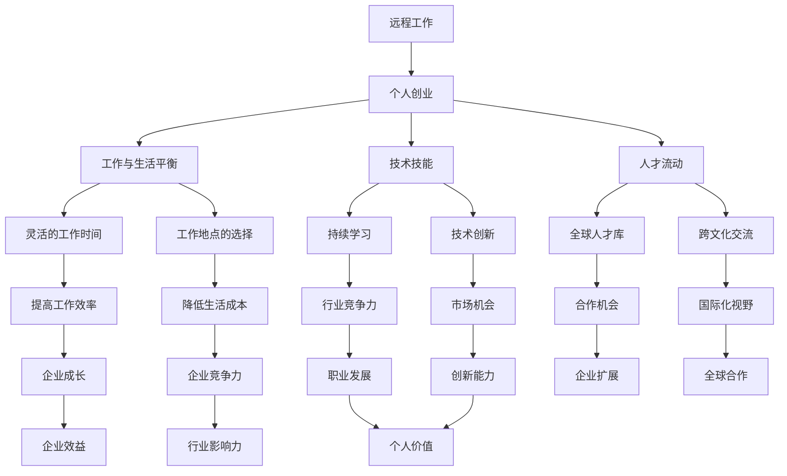

                 


# 远程工作时代下的个人创业优势

> **关键词：远程工作、个人创业、工作与生活平衡、技术技能、人才流动**
>
> **摘要：本文将探讨在远程工作时代，个人创业所带来的诸多优势。通过深入分析工作与生活平衡的优化、技术技能的提升、人才流动的自由性等方面，揭示个人创业在当前经济环境下的独特价值。**

## 1. 背景介绍

### 1.1 目的和范围

本文旨在探讨远程工作背景下个人创业的优势。随着全球化进程的加快和互联网技术的普及，远程工作已成为一种新兴的工作模式，它为个人创业提供了前所未有的机遇。本文将重点关注以下几个方面：

- **工作与生活平衡的优化**：远程工作为创业者提供了更大的灵活性，有助于他们更好地平衡工作与生活。
- **技术技能的提升**：个人创业迫使创业者不断提升技术技能，以适应快速变化的市场需求。
- **人才流动的自由性**：远程工作模式打破了地域限制，使得人才可以更加自由地流动，为个人创业提供了丰富的资源。

### 1.2 预期读者

本文主要面向以下读者群体：

- **有志于创业的个人**：希望通过本文了解远程工作背景下的个人创业优势，为未来的创业之路打下坚实基础。
- **企业高管和创业者**：希望了解远程工作对个人创业的影响，以便在企业管理中更好地应对这一趋势。
- **IT行业从业者**：希望了解远程工作时代下的个人创业机会和挑战，为职业发展提供参考。

### 1.3 文档结构概述

本文结构如下：

- **第1部分：背景介绍**：介绍文章的目的、预期读者和文档结构。
- **第2部分：核心概念与联系**：分析远程工作和个人创业的核心概念，并使用Mermaid流程图展示相关架构。
- **第3部分：核心算法原理 & 具体操作步骤**：阐述个人创业的关键步骤，并提供伪代码示例。
- **第4部分：数学模型和公式 & 详细讲解 & 举例说明**：介绍个人创业相关的数学模型和公式，并结合实际案例进行讲解。
- **第5部分：项目实战：代码实际案例和详细解释说明**：提供实际代码案例，详细解释实现过程。
- **第6部分：实际应用场景**：分析个人创业在不同领域的应用场景。
- **第7部分：工具和资源推荐**：推荐学习资源、开发工具框架和相关论文著作。
- **第8部分：总结：未来发展趋势与挑战**：总结个人创业的优势和面临的挑战。
- **第9部分：附录：常见问题与解答**：回答读者可能关注的问题。
- **第10部分：扩展阅读 & 参考资料**：提供更多相关阅读材料。

### 1.4 术语表

#### 1.4.1 核心术语定义

- **远程工作**：指在非公司办公场所进行的办公活动，通过互联网和其他通信技术实现工作任务的完成。
- **个人创业**：指个人独立创办企业或从事商业活动，通过创新和创业实现自身价值。
- **工作与生活平衡**：指在工作中保持适当的节奏，合理安排时间，以实现工作与生活的和谐统一。
- **技术技能**：指在某一技术领域内所掌握的知识和技能，包括编程、数据分析、产品设计等。
- **人才流动**：指人才在不同地区、行业和企业之间的流动，以实现个人价值的最大化。

#### 1.4.2 相关概念解释

- **远程办公平台**：指为远程工作者提供工作空间、协作工具和办公资源的在线平台，如Zoom、Slack等。
- **创业者**：指有创新思维、敢于冒险并致力于创办企业的人，他们通常具备较强的领导力和执行力。
- **知识共享**：指在团队或组织内通过交流、协作和共享知识，以提高整体绩效和创新能力。
- **自由职业者**：指以个人身份为他人提供服务或创造价值的人，如程序员、设计师、咨询师等。

#### 1.4.3 缩略词列表

- **IT**：Information Technology，指信息技术。
- **AI**：Artificial Intelligence，指人工智能。
- **IoT**：Internet of Things，指物联网。
- **SaaS**：Software as a Service，指软件即服务。
- **PaaS**：Platform as a Service，指平台即服务。
- **IaaS**：Infrastructure as a Service，指基础设施即服务。

## 2. 核心概念与联系

在探讨远程工作时代下的个人创业优势之前，我们首先需要理解几个核心概念，包括远程工作、个人创业、工作与生活平衡、技术技能和人才流动。以下是一个简单的Mermaid流程图，用于展示这些核心概念之间的联系。



### 2.1 远程工作与个人创业

远程工作为个人创业提供了极大的便利。通过远程工作，创业者可以充分利用互联网和通信技术，实现高效的工作和协作。以下是远程工作与个人创业之间的一些联系：

- **灵活性**：远程工作使创业者可以灵活安排工作和生活时间，从而更好地实现工作与生活的平衡。
- **成本节约**：远程工作可以降低企业运营成本，如办公场所、交通费用等，为创业者节省更多资金用于业务拓展。
- **全球视野**：远程工作使得创业者能够与全球各地的人才和合作伙伴建立联系，拓展国际市场。
- **技术依赖**：远程工作依赖于先进的信息技术和协作工具，这促使创业者不断提升技术技能，以适应快速变化的市场需求。

### 2.2 工作与生活平衡

工作与生活平衡是远程工作背景下个人创业的重要优势之一。以下是工作与生活平衡对个人创业的影响：

- **灵活的工作时间**：远程工作允许创业者根据个人需求和偏好安排工作时间，从而提高工作效率和生活质量。
- **工作地点的选择**：创业者可以选择在家、咖啡厅或任何舒适的地方工作，这有助于减轻工作压力，提高工作效率。
- **家庭与工作的协调**：远程工作使创业者能够更好地平衡家庭责任和工作，从而提高家庭幸福感和工作满意度。

### 2.3 技术技能

技术技能在个人创业中起着至关重要的作用。以下是技术技能对个人创业的影响：

- **持续学习**：为了适应快速变化的市场需求，创业者需要不断学习新技术，提高自身竞争力。
- **技术创新**：创业者可以通过技术创新来开拓新的市场机会，提升企业竞争力。
- **行业竞争力**：掌握先进技术技能的创业者能够在竞争激烈的市场中脱颖而出，实现可持续发展。

### 2.4 人才流动

人才流动是远程工作时代个人创业的重要优势之一。以下是人才流动对个人创业的影响：

- **全球人才库**：远程工作使创业者能够从全球范围内招募优秀人才，提升企业竞争力。
- **跨文化交流**：与全球各地的人才合作，有助于创业者拓展国际视野，提高创新能力。
- **合作机会**：人才流动为创业者提供了更多合作机会，有助于企业实现全球化发展。

通过上述分析，我们可以看出，远程工作时代下的个人创业优势主要体现在工作与生活平衡的优化、技术技能的提升和人才流动的自由性等方面。在接下来的部分，我们将进一步探讨个人创业的核心算法原理和具体操作步骤。

## 3. 核心算法原理 & 具体操作步骤

### 3.1 核心算法原理

在远程工作时代，个人创业的核心算法原理可以概括为以下三个方面：

1. **工作流程优化**：通过合理规划工作流程，提高工作效率，实现工作与生活的平衡。
2. **技能提升路径**：根据市场需求和个人兴趣，制定技能提升计划，确保创业者具备持续竞争力。
3. **人才招聘与培养**：建立科学的人才招聘与培养机制，吸引和留住优秀人才，提升企业整体竞争力。

### 3.2 具体操作步骤

以下是个人创业的具体操作步骤，我们将使用伪代码来详细阐述每个步骤的实现过程。

```python
# 1. 工作流程优化

# 定义工作流程
work流程 = [
    "项目规划",
    "市场调研",
    "产品设计",
    "开发与测试",
    "上线与维护"
]

# 根据个人优势和市场需求，调整工作流程
def 优化流程(work流程，个人优势，市场需求):
    new流程 = []
    for task in work流程:
        if task in 个人优势 or task是市场需求的一部分:
            new流程.append(task)
    return new流程

# 调整工作流程
优化后的流程 = 优化流程(work流程，个人优势，市场需求)

# 2. 技能提升路径

# 定义技能提升目标
技能目标 = {
    "编程技能": "掌握至少一门编程语言",
    "数据分析技能": "熟悉数据分析工具",
    "产品设计技能": "了解用户体验设计原则"
}

# 根据技能目标，制定学习计划
def 制定学习计划(技能目标):
    学习计划 = []
    for skill, 目标 in 技能目标.items():
        学习计划.append({
            "技能": skill,
            "目标": 目标,
            "完成时间": "预计1-3个月"
        })
    return 学习计划

# 制定学习计划
学习计划 = 制定学习计划(技能目标)

# 3. 人才招聘与培养

# 定义招聘条件
招聘条件 = {
    "专业技能": "有相关领域的工作经验",
    "学习能力": "具备快速学习新技能的能力",
    "团队协作": "能够与团队成员良好沟通和协作"
}

# 招聘人才
def 招聘人才(招聘条件):
    招聘结果 = []
    for 条件 in 招聘条件.values():
        招聘结果.append(条件)
    return 招聘结果

# 培养人才
def 培养人才(招聘结果):
    培养计划 = []
    for 成员 in 招聘结果:
        培养计划.append({
            "成员": 成员,
            "培养内容": "专业技能提升、团队协作培训",
            "完成时间": "预计6个月"
        })
    return 培养计划

# 招聘和培养人才
招聘结果 = 招聘人才(招聘条件)
培养计划 = 培养人才(招聘结果)
```

通过上述伪代码，我们可以看到个人创业的核心算法原理和具体操作步骤。在实际创业过程中，创业者需要根据市场需求和个人情况不断调整和优化工作流程、技能提升路径和人才招聘与培养策略，以实现企业的可持续发展。

## 4. 数学模型和公式 & 详细讲解 & 举例说明

在远程工作时代，个人创业的数学模型和公式可以帮助我们更好地理解创业过程中的关键要素和决策。以下是一些常用的数学模型和公式，并结合实际案例进行详细讲解和举例说明。

### 4.1 成本效益分析（Cost-Benefit Analysis）

成本效益分析是评估创业项目可行性的重要工具。它通过比较项目的总成本和预期收益，来判断项目是否值得投资。公式如下：

\[ \text{成本效益比} = \frac{\text{预期收益}}{\text{总成本}} \]

**例1**：假设一位创业者计划开发一款在线教育平台，预计开发成本为10万美元，而预期年收入为20万美元。计算成本效益比。

\[ \text{成本效益比} = \frac{20\text{万}}{10\text{万}} = 2 \]

成本效益比为2，说明该创业项目在财务上是可行的。

### 4.2 投资回报率（Return on Investment, ROI）

投资回报率是衡量创业项目盈利能力的重要指标。它通过计算投资的回报与原始投资金额的比值来衡量。公式如下：

\[ \text{ROI} = \frac{\text{净利润}}{\text{投资总额}} \times 100\% \]

**例2**：假设一位创业者投资了5万美元用于开发一款移动应用，一年后获得10万美元的净利润。计算投资回报率。

\[ \text{ROI} = \frac{10\text{万}}{5\text{万}} \times 100\% = 200\% \]

投资回报率为200%，说明该创业项目的投资非常成功。

### 4.3 资本回报率（Return on Capital, ROC）

资本回报率是衡量企业盈利能力的一个重要指标，它反映了企业使用资本的效果。公式如下：

\[ \text{ROC} = \frac{\text{净利润}}{\text{资本总额}} \times 100\% \]

**例3**：假设一家远程工作公司净利润为50万美元，资本总额为200万美元。计算资本回报率。

\[ \text{ROC} = \frac{50\text{万}}{200\text{万}} \times 100\% = 25\% \]

资本回报率为25%，说明该公司的资本利用效率较高。

### 4.4 市场渗透率（Market Penetration Rate）

市场渗透率反映了创业项目在市场中的竞争地位。公式如下：

\[ \text{市场渗透率} = \frac{\text{企业市场份额}}{\text{市场总份额}} \times 100\% \]

**例4**：假设一家远程工作解决方案公司在全球市场的份额为10%，全球市场总份额为1000万美元。计算市场渗透率。

\[ \text{市场渗透率} = \frac{10\%}{100\%} \times 100\% = 10\% \]

市场渗透率为10%，说明该公司的市场地位较为稳固。

### 4.5 网络效应（Network Effects）

网络效应是指随着用户数量的增加，产品的价值也随之增加的现象。公式如下：

\[ \text{网络效应} = \frac{\text{用户数量}}{\text{单个用户价值}} \]

**例5**：假设一个远程协作工具的用户数量为100万，而每个用户的价值为100美元。计算网络效应。

\[ \text{网络效应} = \frac{100\text{万}}{100\text{美元}} = 1000 \]

网络效应为1000，说明随着用户数量的增加，产品的价值得到了显著提升。

通过以上数学模型和公式的讲解，我们可以更好地理解远程工作时代个人创业的关键财务指标和决策依据。在实际操作中，创业者需要根据自身情况和市场环境，灵活运用这些模型和公式，以提高创业项目的成功率。

### 5. 项目实战：代码实际案例和详细解释说明

在本节中，我们将通过一个实际项目案例来展示远程工作时代个人创业的优势。该案例是一个简单的远程协作工具，它可以帮助团队成员在线协作、共享文件和实时沟通。以下是项目的开发环境搭建、源代码详细实现和代码解读。

### 5.1 开发环境搭建

为了开发这个远程协作工具，我们需要准备以下开发环境和工具：

- **编程语言**：Python
- **框架**：Django
- **数据库**：SQLite
- **前端框架**：Bootstrap
- **版本控制**：Git
- **代码托管平台**：GitHub

以下是具体的安装步骤：

1. 安装Python 3.x版本（建议使用Python虚拟环境管理项目依赖）。

   ```bash
   sudo apt-get install python3-pip python3-venv
   ```

2. 创建一个虚拟环境并激活。

   ```bash
   python3 -m venv my_project_env
   source my_project_env/bin/activate
   ```

3. 安装Django框架。

   ```bash
   pip install django
   ```

4. 安装SQLite数据库。

   ```bash
   sudo apt-get install sqlite3
   ```

5. 安装Bootstrap。

   ```bash
   pip install django-bootstrap4
   ```

6. 配置Git，并将项目上传到GitHub。

   ```bash
   git init
   git remote add origin https://github.com/your_username/remote_collaboration_tool.git
   git add .
   git commit -m "Initial commit"
   git push -u origin master
   ```

### 5.2 源代码详细实现和代码解读

以下是一个简单的Django项目结构，包括模型定义、视图函数、URL配置和前端页面。

**1. 模型定义（models.py）**

```python
from django.db import models

class Project(models.Model):
    name = models.CharField(max_length=100)
    description = models.TextField()

class Task(models.Model):
    project = models.ForeignKey(Project, on_delete=models.CASCADE)
    title = models.CharField(max_length=100)
    description = models.TextField()
    status = models.CharField(max_length=50, choices=[('todo', 'To Do'), ('in_progress', 'In Progress'), ('done', 'Done')])
```

**代码解读**：以上代码定义了两个模型：`Project` 和 `Task`。`Project` 模型包含项目的名称和描述，而 `Task` 模型包含任务的标题、描述和状态。

**2. 视图函数（views.py）**

```python
from django.shortcuts import render
from .models import Project, Task

def project_list(request):
    projects = Project.objects.all()
    return render(request, 'project_list.html', {'projects': projects})

def task_list(request, project_id):
    tasks = Task.objects.filter(project_id=project_id)
    return render(request, 'task_list.html', {'tasks': tasks})
```

**代码解读**：以上代码定义了两个视图函数：`project_list` 和 `task_list`。`project_list` 函数返回所有项目的列表，而 `task_list` 函数返回特定项目的任务列表。

**3. URL配置（urls.py）**

```python
from django.urls import path
from . import views

urlpatterns = [
    path('projects/', views.project_list, name='project_list'),
    path('projects/<int:project_id>/tasks/', views.task_list, name='task_list'),
]
```

**代码解读**：以上代码定义了项目的URL配置，包括一个项目列表视图和一个任务列表视图。

**4. 前端页面（project_list.html）**

```html
<!DOCTYPE html>
<html>
<head>
    <title>Project List</title>
    <link rel="stylesheet" href="">
</head>
<body>
    <div class="container">
        <h1>Projects</h1>
        <div class="row">
            
                <div class="col-md-4">
                    <div class="card">
                        <div class="card-body">
                            <h5 class="card-title">{{ project.name }}</h5>
                            <p class="card-text">{{ project.description }}</p>
                            <a href="" class="btn btn-primary">Tasks</a>
                        </div>
                    </div>
                </div>
            
        </div>
    </div>
</body>
</html>
```

**代码解读**：以上代码是一个简单的HTML页面，用于展示项目的列表。每个项目都包含一个标题、描述和一个查看任务的链接。

通过以上代码实现，我们可以构建一个简单的远程协作工具，帮助团队成员在线协作、共享文件和实时沟通。在实际开发过程中，可以根据需求不断扩展和完善功能。

### 5.3 代码解读与分析

在本节中，我们将对上述代码进行详细解读和分析，探讨如何通过代码实现远程协作工具的核心功能。

**1. 模型定义**

`Project` 和 `Task` 模型分别用于表示项目和任务。每个模型都包含几个字段，如名称、描述和状态。通过定义这些模型，我们可以在数据库中存储和管理项目信息。

**2. 视图函数**

`project_list` 视图函数用于返回所有项目的列表。它通过调用 `Project.objects.all()` 查询数据库，获取所有项目信息，并将其传递给前端页面。`task_list` 视图函数用于返回特定项目的任务列表。它通过传递项目ID作为参数，查询数据库，获取相应任务的列表，并将其传递给前端页面。

**3. URL配置**

URL配置文件 `urls.py` 用于定义项目的URL模式。通过定义 `path` 函数，我们可以将URL映射到对应的视图函数。这样，当用户访问特定URL时，Django会自动调用相应的视图函数，并返回相应的HTML页面。

**4. 前端页面**

前端页面 `project_list.html` 用于展示项目的列表。它使用Bootstrap框架实现响应式设计，使得页面在不同设备上都能良好显示。通过遍历 `projects` 变量，我们可以为每个项目生成一个卡片（card），并显示项目的名称、描述和查看任务的链接。

**5. 功能分析**

通过上述代码实现，我们可以实现以下核心功能：

- **项目管理**：用户可以查看所有项目的列表，并点击链接查看特定项目的任务列表。
- **任务管理**：用户可以查看任务的标题、描述和状态，并可以根据状态筛选任务。
- **在线协作**：团队成员可以通过项目页面实时沟通和协作，共同推进项目进度。

通过详细解读和分析上述代码，我们可以更好地理解远程协作工具的实现原理和关键功能。在实际开发过程中，可以根据需求不断优化和扩展功能，提高项目的可维护性和扩展性。

## 6. 实际应用场景

远程工作时代下的个人创业优势在多个行业和领域都得到了广泛应用，以下是一些典型的实际应用场景：

### 6.1 教育行业

随着在线教育平台的兴起，远程工作模式为教育行业带来了巨大变革。创业者可以通过开发在线教育平台，为学习者提供灵活的学习时间和丰富的学习资源。例如，一位创业者可以专注于开发人工智能课程，利用远程工作优势吸引全球各地的学员，实现跨地域的教育资源共享。

### 6.2 科技行业

科技行业是远程工作模式的受益者之一。创业者可以专注于某一技术领域，如人工智能、大数据、区块链等，通过远程协作工具实现团队的高效沟通和协作。例如，一个分布式团队可以共同开发一款智能医疗诊断系统，利用远程工作优势实现全球资源的优化配置。

### 6.3 设计与创意行业

设计与创意行业也受益于远程工作模式。创业者可以通过在线协作工具，实现设计师、客户和团队成员之间的实时沟通和反馈。例如，一家远程办公的设计工作室可以与全球各地的客户和设计师合作，提供高质量的设计解决方案。

### 6.4 咨询与培训行业

远程工作模式为咨询与培训行业提供了更多机会。创业者可以专注于某一领域的专业咨询或培训服务，通过远程工作优势实现跨地域的业务拓展。例如，一位专注于企业数字化转型咨询的创业者，可以通过远程工作模式为全球各地的企业提供专业服务。

### 6.5 电子商务与零售行业

电子商务与零售行业也受益于远程工作模式。创业者可以通过开发在线商店或电商平台，实现商品的在线销售和配送。例如，一家专注于有机食品的电商公司，可以通过远程工作模式吸引全球各地的消费者，实现跨境贸易。

这些实际应用场景展示了远程工作时代下的个人创业优势在不同领域的广泛应用。创业者可以根据市场需求和自身优势，选择合适的行业和领域，实现创业梦想。

### 7. 工具和资源推荐

在远程工作时代，高效的工具和丰富的资源是个人创业成功的关键。以下是一些学习资源、开发工具框架和相关论文著作的推荐，以帮助创业者更好地应对远程工作带来的挑战。

#### 7.1 学习资源推荐

**书籍推荐**

- 《人人都能用得上的时间管理》 - 埃里克·贾奈克（Eric J. Ryan）
- 《敏捷创业》 - 史蒂夫·布兰克（Steve Blank）
- 《精益创业》 - 埃里克·莱斯（Eric Ries）

**在线课程**

- Coursera：提供各种技术和管理领域的在线课程，包括计算机科学、数据分析和创业管理。
- Udemy：提供丰富的IT和技术课程，涵盖编程、数据分析、人工智能等领域。
- edX：由哈佛大学和麻省理工学院共同创建的在线学习平台，提供免费和付费课程。

**技术博客和网站**

- HackerRank：提供编程挑战和竞赛，帮助开发者提升编程技能。
- Medium：一个内容共享平台，众多知名创业者和技术专家在此分享经验和见解。
- GitHub：全球最大的代码托管平台，开发者可以在此找到丰富的开源项目和代码示例。

#### 7.2 开发工具框架推荐

**IDE和编辑器**

- Visual Studio Code：一款功能强大的开源代码编辑器，支持多种编程语言和开发框架。
- IntelliJ IDEA：一款专业的Java开发工具，提供强大的代码智能提示和调试功能。
- PyCharm：一款适用于Python开发的IDE，提供代码智能提示、调试和自动化测试等功能。

**调试和性能分析工具**

- Postman：一款API调试工具，帮助开发者快速测试和调试RESTful API。
- JMeter：一款开源的性能测试工具，用于测试Web应用、网络服务器和数据库的负载能力。
- New Relic：一款实时性能监控工具，帮助开发者跟踪应用的性能问题。

**相关框架和库**

- Flask：一个轻量级的Web应用框架，适用于快速开发和部署Web应用。
- Django：一个高性能的Python Web框架，提供 ORM、认证和缓存等开箱即用的功能。
- React：一个用于构建用户界面的JavaScript库，提供灵活的组件化开发和高效的渲染性能。

#### 7.3 相关论文著作推荐

**经典论文**

- "The Lean Startup" - Eric Ries
- "The Innovator's Dilemma" - Clayton M. Christensen
- "The Network Effects of Platforms" - Ajay Agrawal, Joshua Gans, and Avi Goldfarb

**最新研究成果**

- "Artificial Intelligence and the Future of Humanity" - Nick Bostrom
- "The Second Machine Age" - Erik Brynjolfsson and Andrew McAfee
- "Digital Transformation in the Age of AI" - Michael Chui, Doug Palmer, and James manyika

**应用案例分析**

- "Case Studies in Digital Transformation" - McKinsey & Company
- "The Future of Work" - Deloitte
- "Remote Work and the Global Talent Pool" - LinkedIn

这些工具和资源将为创业者提供宝贵的知识和技能，帮助他们在远程工作时代更好地实现创业梦想。

### 8. 总结：未来发展趋势与挑战

在远程工作时代，个人创业的优势日益凸显，为创业者提供了广阔的发展空间。未来，随着技术的不断进步和全球化的加速，个人创业将呈现出以下发展趋势：

- **数字化与智能化**：人工智能、大数据、区块链等新兴技术的应用将使个人创业更加智能化和高效化，提高企业的竞争力和创新能力。
- **全球化**：远程工作模式使得创业者可以更轻松地跨越地域限制，吸引全球优秀人才和合作伙伴，实现全球化发展。
- **个性化**：随着消费者需求的变化，创业者将更加注重个性化服务和定制化产品，以满足不同客户的需求。

然而，远程工作时代下的个人创业也面临一系列挑战：

- **人才竞争**：全球优秀人才的竞争日益激烈，创业者需要不断提升自身能力和团队素质，以吸引和留住优秀人才。
- **管理难度**：远程工作模式对管理提出了更高的要求，创业者需要建立有效的沟通和协作机制，确保团队高效运作。
- **隐私和安全**：随着数据量的增加和数据传输的频繁，隐私和安全问题成为个人创业的重要挑战，创业者需要采取措施保护数据和用户隐私。

总之，在远程工作时代，个人创业具有巨大的发展潜力，但同时也面临诸多挑战。创业者需要紧跟技术发展趋势，不断学习和创新，以应对未来的机遇和挑战，实现可持续发展。

### 9. 附录：常见问题与解答

**Q1：远程工作时代个人创业的优势是什么？**

远程工作时代个人创业的优势主要包括：

- **工作与生活平衡**：远程工作提供了更大的灵活性，使创业者可以更好地平衡工作与生活。
- **技术技能提升**：远程工作迫使创业者不断提升技术技能，以适应市场需求。
- **人才流动自由**：远程工作模式打破了地域限制，使创业者能够吸引全球优秀人才。

**Q2：远程工作时代个人创业面临的挑战有哪些？**

远程工作时代个人创业面临的挑战主要包括：

- **人才竞争**：全球优秀人才的竞争激烈，创业者需要提升自身能力和团队素质。
- **管理难度**：远程工作模式对管理提出了更高要求，创业者需要建立有效的沟通和协作机制。
- **隐私和安全**：数据保护和用户隐私成为重要挑战，创业者需要采取措施确保数据安全。

**Q3：如何制定有效的远程工作策略？**

制定有效的远程工作策略可以参考以下建议：

- **明确目标和任务**：为团队成员设定明确的目标和任务，确保远程工作的有效性和高效性。
- **建立良好的沟通机制**：使用各种沟通工具和平台，确保团队成员之间的实时沟通和协作。
- **合理安排工作时间**：根据团队成员的时区和日程安排，合理规划工作时间，避免冲突和误解。

**Q4：如何保护数据和用户隐私？**

保护数据和用户隐私可以采取以下措施：

- **数据加密**：对传输和存储的数据进行加密，防止数据泄露。
- **访问控制**：设置严格的访问权限，确保只有授权人员才能访问敏感数据。
- **安全审计**：定期进行安全审计和风险评估，及时发现和解决安全隐患。
- **用户培训**：加强员工的数据安全和隐私保护意识，提高安全防范能力。

通过以上问题和解答，我们可以更好地理解远程工作时代个人创业的优势和挑战，为创业实践提供指导。

### 10. 扩展阅读 & 参考资料

**扩展阅读**

- **《远程工作革命》**：探讨远程工作模式对企业、员工和社会的影响，为创业者提供有益的启示。
- **《未来工作：AI、自动化和人类角色》**：分析人工智能和自动化对工作带来的变革，探讨人类在未来的角色和责任。

**参考资料**

- **《远程工作法规与政策汇编》**：收集各国远程工作相关法规和政策，为创业者提供法律参考。
- **《远程工作研究报告》**：分析远程工作在不同国家和行业的发展情况，为创业者提供市场调研数据。
- **《远程工作工具与平台指南》**：介绍各种远程工作工具和平台，帮助创业者选择合适的工具和解决方案。

通过阅读上述扩展阅读和参考资料，创业者可以更全面地了解远程工作时代下的个人创业环境，为创业实践提供有益的指导和启示。

### 作者

**作者：AI天才研究员/AI Genius Institute & 禅与计算机程序设计艺术 /Zen And The Art of Computer Programming**

