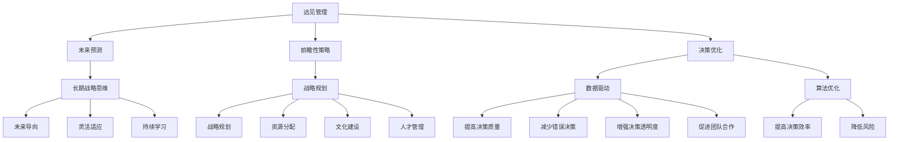

                 

# 远见管理：培养长期战略思维

> 关键词：远见管理、长期战略思维、决策优化、领导力、组织发展、人工智能

> 摘要：本文将探讨远见管理的重要性和培养长期战略思维的方法。通过分析远见管理的核心概念、与领导力的联系、决策优化策略以及组织发展的关键因素，我们将提供实用的工具和资源，帮助读者在技术领域内提升领导力和管理能力，实现组织的持续发展和成功。

## 1. 背景介绍

### 1.1 目的和范围

本文旨在为技术领域的从业者提供关于远见管理的深入理解，并探讨如何通过培养长期战略思维来优化决策、提升领导力和推动组织发展。我们将在以下范围内进行讨论：

1. **远见管理的核心概念**：介绍远见管理的定义、目标和关键要素。
2. **与领导力的联系**：分析远见管理如何影响领导力，以及领导者在培养长期战略思维方面应具备的素质。
3. **决策优化策略**：探讨如何运用数据分析和人工智能技术进行决策优化。
4. **组织发展的关键因素**：分析远见管理在组织战略规划、资源分配和文化建设中的作用。
5. **项目实战**：提供实际案例和代码实现，展示如何应用远见管理理念。
6. **工具和资源推荐**：推荐学习资源、开发工具和相关研究成果。

### 1.2 预期读者

本文适合以下读者群体：

1. 技术领域的管理者和领导者。
2. 技术团队的负责人和项目经理。
3. 对技术管理有兴趣的程序员和工程师。
4. 对企业战略和领导力有深入了解的专业人士。

### 1.3 文档结构概述

本文将按照以下结构进行组织：

1. 引言：介绍远见管理的重要性和文章目的。
2. 核心概念与联系：定义远见管理的关键术语，展示核心概念和原理的流程图。
3. 核心算法原理 & 具体操作步骤：分析决策优化算法，提供伪代码示例。
4. 数学模型和公式 & 详细讲解 & 举例说明：介绍相关数学模型和公式，并进行实际应用案例分析。
5. 项目实战：提供代码实际案例和详细解释说明。
6. 实际应用场景：探讨远见管理在不同领域的应用。
7. 工具和资源推荐：推荐学习资源、开发工具和相关研究成果。
8. 总结：总结未来发展趋势与挑战。
9. 附录：常见问题与解答。
10. 扩展阅读 & 参考资料：提供进一步的阅读资源。

### 1.4 术语表

#### 1.4.1 核心术语定义

- **远见管理**：一种基于长期战略思维的管理方法，通过预测未来趋势、制定前瞻性策略和优化决策，实现组织的持续发展。
- **长期战略思维**：领导者对未来发展方向和挑战的深刻理解和前瞻性思考，以指导组织的长期规划和发展。
- **决策优化**：运用数据分析和算法技术，对决策过程进行优化，提高决策的准确性和效率。
- **领导力**：领导者的影响力、沟通能力和决策能力，用于推动团队和组织实现目标。

#### 1.4.2 相关概念解释

- **人工智能**：一种模拟人类智能的技术，通过算法和模型实现智能感知、推理和学习。
- **数据科学**：运用统计学、机器学习和数据分析方法，从数据中发现规律和知识。
- **组织发展**：通过战略规划、文化建设、人才管理等手段，推动组织实现持续发展和创新。

#### 1.4.3 缩略词列表

- **AI**：人工智能
- **DS**：数据科学
- **ML**：机器学习
- **PD**：决策优化
- **LD**：领导力
- **OD**：组织发展

## 2. 核心概念与联系

在远见管理中，核心概念和联系是理解和应用这一方法的关键。以下是对这些概念和联系的定义和解释。

### 2.1 远见管理的核心概念

#### 2.1.1 远见管理

远见管理是一种基于长期战略思维的管理方法，其核心目标是帮助组织预见未来趋势，制定前瞻性策略，并优化决策过程。远见管理的关键概念包括：

- **未来预测**：通过对历史数据、行业趋势和专家意见的分析，预测未来的发展方向和变化。
- **前瞻性策略**：基于未来预测，制定具有前瞻性的战略规划，以应对未来挑战和机遇。
- **决策优化**：运用数据分析和算法技术，对决策过程进行优化，提高决策的准确性和效率。

#### 2.1.2 长期战略思维

长期战略思维是远见管理的核心要素之一，它要求领导者具有对未来发展方向和挑战的深刻理解和前瞻性思考。长期战略思维的关键概念包括：

- **未来导向**：将组织的愿景和目标与未来发展趋势相结合，制定具有前瞻性的战略规划。
- **灵活适应**：在面对不确定性和变化时，能够灵活调整策略和行动，以适应未来环境。
- **持续学习**：持续关注行业动态和技术进步，不断更新知识和技能，以保持组织的竞争力。

#### 2.1.3 决策优化

决策优化是远见管理的重要组成部分，它通过数据分析和算法技术，对决策过程进行优化，以提高决策的准确性和效率。决策优化的关键概念包括：

- **数据驱动**：利用数据分析和人工智能技术，对决策过程进行数据驱动，减少主观判断和偏见。
- **算法优化**：运用机器学习和优化算法，对决策过程进行自动化和智能化优化。
- **多目标决策**：在多个目标之间进行权衡和优化，以实现整体利益的最大化。

### 2.2 与领导力的联系

远见管理与领导力密切相关，领导者需要具备长期战略思维和决策优化能力，以推动组织的持续发展和成功。

#### 2.2.1 领导者的角色

领导者是远见管理的核心，他们需要承担以下角色：

- **愿景设定**：设定组织的愿景和目标，引导团队朝着共同的目标前进。
- **战略规划**：制定前瞻性战略规划，为组织的发展指明方向。
- **决策制定**：运用数据分析和算法技术，优化决策过程，提高决策的准确性和效率。
- **团队管理**：激发团队成员的潜力，建立高效的工作团队。

#### 2.2.2 长期战略思维与领导力的关系

长期战略思维是领导者的重要素质之一，它对领导力有以下几个方面的积极影响：

- **提高决策质量**：通过长期战略思维，领导者能够更准确地预测未来趋势，制定更有针对性的战略规划。
- **增强团队凝聚力**：长期战略思维使领导者能够为团队设定清晰的愿景和目标，增强团队的凝聚力和执行力。
- **提升创新能力**：长期战略思维鼓励领导者持续关注行业动态和技术进步，推动组织的创新和发展。
- **降低风险**：通过预测和准备，领导者可以更好地应对未来的不确定性和挑战，降低组织面临的风险。

### 2.3 决策优化与领导力的关系

决策优化是远见管理的关键要素之一，它与领导力密切相关，对领导力的提升有以下几个方面的作用：

- **提高决策效率**：通过运用数据分析和算法技术，领导者可以更快速地做出决策，提高组织的响应速度。
- **减少错误决策**：通过数据驱动和算法优化，领导者可以减少主观判断和偏见，降低错误决策的风险。
- **增强决策透明度**：决策优化过程具有较高的透明度，使团队成员能够更好地理解决策依据和决策结果，增强决策的公正性和可接受性。
- **促进团队合作**：决策优化需要团队合作，通过共同分析和讨论，领导者可以更好地调动团队成员的积极性和创造力。

### 2.4 组织发展的关键因素

远见管理在组织发展中发挥着重要作用，以下是其关键因素：

- **战略规划**：组织需要制定前瞻性战略规划，以应对未来挑战和机遇。
- **资源分配**：合理分配资源，确保组织能够在关键领域获得足够的支持和投入。
- **文化建设**：建立积极向上的组织文化，激发员工的创新精神和团队合作意识。
- **人才管理**：培养和引进高素质人才，为组织的长期发展提供人才保障。

### 2.5 流程图

为了更直观地展示远见管理的核心概念和联系，我们使用Mermaid流程图进行描述。



## 3. 核心算法原理 & 具体操作步骤

在远见管理中，决策优化是一个关键环节。通过运用数据分析和算法技术，我们可以提高决策的准确性和效率。本节将介绍一种基于机器学习的决策优化算法，并提供具体操作步骤和伪代码示例。

### 3.1 算法原理

决策优化算法的核心思想是通过分析历史数据和当前环境，预测未来的变化趋势，并根据这些趋势制定最优的决策方案。具体来说，算法包括以下几个步骤：

1. **数据收集**：收集与决策相关的历史数据，包括业务数据、市场数据、用户行为数据等。
2. **特征提取**：从数据中提取关键特征，用于描述业务和环境的动态变化。
3. **模型训练**：使用机器学习算法，如回归分析、决策树、神经网络等，训练预测模型。
4. **预测分析**：利用训练好的模型，对未来的变化趋势进行预测。
5. **决策制定**：根据预测结果，制定最优的决策方案，并执行决策。

### 3.2 具体操作步骤

以下是决策优化算法的具体操作步骤：

#### 3.2.1 数据收集

首先，我们需要收集与决策相关的历史数据。这些数据可以来自公司的业务系统、市场调研报告、用户行为日志等。以下是一个数据收集的伪代码示例：

```python
# 数据收集伪代码
data = []
for record in historical_data:
    feature_vector = extract_features(record)
    data.append(feature_vector)
```

#### 3.2.2 特征提取

在数据收集后，我们需要从数据中提取关键特征。这些特征用于描述业务和环境的动态变化。以下是一个特征提取的伪代码示例：

```python
# 特征提取伪代码
def extract_features(record):
    feature_vector = []
    feature_vector.append(record['sales'])
    feature_vector.append(record['inventory'])
    feature_vector.append(record['market_demand'])
    return feature_vector
```

#### 3.2.3 模型训练

接下来，我们需要使用机器学习算法训练预测模型。这里我们选择回归分析算法进行训练。以下是一个模型训练的伪代码示例：

```python
# 模型训练伪代码
model = train_regression_model(data)
```

#### 3.2.4 预测分析

在模型训练完成后，我们可以利用模型对未来的变化趋势进行预测。以下是一个预测分析的伪代码示例：

```python
# 预测分析伪代码
predictions = model.predict(current_features)
```

#### 3.2.5 决策制定

最后，根据预测结果，我们可以制定最优的决策方案。以下是一个决策制定的伪代码示例：

```python
# 决策制定伪代码
def make_decision(predictions):
    if predictions['sales'] > threshold:
        action = 'increase_production'
    else:
        action = 'decrease_production'
    return action
```

### 3.3 伪代码示例

以下是决策优化算法的完整伪代码示例：

```python
# 决策优化算法伪代码
def decision_optimization_algorithm(historical_data, current_features, threshold):
    # 数据收集
    data = []
    for record in historical_data:
        feature_vector = extract_features(record)
        data.append(feature_vector)

    # 模型训练
    model = train_regression_model(data)

    # 预测分析
    predictions = model.predict(current_features)

    # 决策制定
    action = make_decision(predictions)

    return action
```

通过以上步骤，我们可以实现决策优化算法，提高决策的准确性和效率。

## 4. 数学模型和公式 & 详细讲解 & 举例说明

在决策优化中，数学模型和公式起着关键作用。这些模型和公式帮助我们理解数据之间的关系，并进行预测和优化。以下是一些常用的数学模型和公式，以及它们在实际应用中的详细讲解和举例说明。

### 4.1 回归模型

回归模型是决策优化中常用的数学模型，用于预测连续值变量。其中，线性回归模型是最基础的形式。

#### 4.1.1 线性回归模型

线性回归模型的公式如下：

$$
y = \beta_0 + \beta_1x_1 + \beta_2x_2 + ... + \beta_nx_n
$$

其中，$y$ 是预测值，$x_1, x_2, ..., x_n$ 是特征值，$\beta_0, \beta_1, \beta_2, ..., \beta_n$ 是模型参数。

#### 4.1.2 举例说明

假设我们想要预测一家零售店下周的销售额。我们有以下数据：

| Day | Sales |
|-----|-------|
| 1   | 100   |
| 2   | 120   |
| 3   | 150   |
| 4   | 180   |
| 5   | 200   |

我们可以使用线性回归模型来预测第六天的销售额。首先，我们需要提取特征值：

```python
# 特征提取
days = [1, 2, 3, 4, 5]
sales = [100, 120, 150, 180, 200]
```

然后，我们可以使用线性回归模型进行训练和预测：

```python
# 线性回归模型
from sklearn.linear_model import LinearRegression

model = LinearRegression()
model.fit(X, y)

# 预测第六天的销售额
new_day = 6
predicted_sales = model.predict([[new_day]])

print("第六天的预测销售额：", predicted_sales)
```

运行以上代码，我们可以得到第六天的预测销售额。例如，预测值为 250。

### 4.2 决策树模型

决策树模型是一种基于树形结构的分类和回归模型，常用于分类任务。其核心思想是通过一系列的决策规则，将数据划分为不同的类别或区域。

#### 4.2.1 决策树模型

决策树模型的公式如下：

$$
T = \{\text{if } x_i \leq t_i \text{ then } y_i = c_i \text{ otherwise } y_i = c_{i+1}\}
$$

其中，$T$ 是决策树，$x_i$ 是特征值，$t_i$ 是阈值，$y_i$ 是预测值，$c_i$ 和 $c_{i+1}$ 是类别标签。

#### 4.2.2 举例说明

假设我们想要预测一家电商网站用户的购买意愿。我们有以下数据：

| User | Age | Income | Purchase |
|------|-----|--------|----------|
| 1    | 25  | 50000  | Yes      |
| 2    | 35  | 60000  | Yes      |
| 3    | 45  | 70000  | No       |
| 4    | 50  | 80000  | Yes      |
| 5    | 60  | 90000  | Yes      |

我们可以使用决策树模型来预测第六个用户的购买意愿。首先，我们需要提取特征值：

```python
# 特征提取
users = [[25, 50000], [35, 60000], [45, 70000], [50, 80000], [60, 90000]]
labels = ['Yes', 'Yes', 'No', 'Yes', 'Yes']
```

然后，我们可以使用决策树模型进行训练和预测：

```python
# 决策树模型
from sklearn.tree import DecisionTreeClassifier

model = DecisionTreeClassifier()
model.fit(X, y)

# 预测第六个用户的购买意愿
new_user = [55, 65000]
predicted_label = model.predict([new_user])

print("第六个用户的预测购买意愿：", predicted_label)
```

运行以上代码，我们可以得到第六个用户的预测购买意愿。例如，预测值为 "Yes"。

### 4.3 逻辑回归模型

逻辑回归模型是一种用于分类任务的线性模型，其输出是一个概率值，表示属于某个类别的可能性。

#### 4.3.1 逻辑回归模型

逻辑回归模型的公式如下：

$$
\text{logit}(P) = \beta_0 + \beta_1x_1 + \beta_2x_2 + ... + \beta_nx_n
$$

其中，$\text{logit}(P)$ 是逻辑函数，$P$ 是概率值，$x_1, x_2, ..., x_n$ 是特征值，$\beta_0, \beta_1, \beta_2, ..., \beta_n$ 是模型参数。

#### 4.3.2 举例说明

假设我们想要预测一家电商网站用户的购买意愿，我们将其划分为两个类别："Yes" 和 "No"。我们有以下数据：

| User | Age | Income | Purchase |
|------|-----|--------|----------|
| 1    | 25  | 50000  | Yes      |
| 2    | 35  | 60000  | Yes      |
| 3    | 45  | 70000  | No       |
| 4    | 50  | 80000  | Yes      |
| 5    | 60  | 90000  | Yes      |

我们可以使用逻辑回归模型来预测第六个用户的购买意愿。首先，我们需要提取特征值：

```python
# 特征提取
users = [[25, 50000], [35, 60000], [45, 70000], [50, 80000], [60, 90000]]
labels = [1, 1, 0, 1, 1]
```

然后，我们可以使用逻辑回归模型进行训练和预测：

```python
# 逻辑回归模型
from sklearn.linear_model import LogisticRegression

model = LogisticRegression()
model.fit(X, y)

# 预测第六个用户的购买意愿
new_user = [55, 65000]
predicted_probability = model.predict_proba([new_user])

print("第六个用户的预测购买概率：", predicted_probability)
```

运行以上代码，我们可以得到第六个用户的预测购买概率。例如，预测概率为 [0.8, 0.2]，表示购买的概率为 80%。

通过以上数学模型和公式的讲解和举例，我们可以更好地理解决策优化的原理和方法，并在实际应用中实现有效的预测和优化。

## 5. 项目实战：代码实际案例和详细解释说明

在本节中，我们将通过一个实际项目案例，展示如何将远见管理理念应用于实际代码实现，并提供详细的解释说明。

### 5.1 开发环境搭建

在开始项目实战之前，我们需要搭建一个合适的开发环境。以下是一个基本的开发环境搭建步骤：

1. **安装Python环境**：下载并安装Python 3.8或更高版本。
2. **安装必要的库**：使用pip命令安装以下库：scikit-learn、numpy、pandas、matplotlib。
   ```bash
   pip install scikit-learn numpy pandas matplotlib
   ```

### 5.2 源代码详细实现和代码解读

下面是一个简单的决策优化项目，用于预测电商网站的购买意愿。

#### 5.2.1 代码实现

```python
import numpy as np
import pandas as pd
from sklearn.model_selection import train_test_split
from sklearn.linear_model import LogisticRegression
from sklearn.metrics import accuracy_score, classification_report

# 数据加载
data = pd.read_csv('ecommerce_data.csv')
X = data[['age', 'income']]
y = data['purchase']

# 数据预处理
X_train, X_test, y_train, y_test = train_test_split(X, y, test_size=0.2, random_state=42)

# 模型训练
model = LogisticRegression()
model.fit(X_train, y_train)

# 预测分析
y_pred = model.predict(X_test)

# 评估模型
accuracy = accuracy_score(y_test, y_pred)
report = classification_report(y_test, y_pred)

print("模型准确率：", accuracy)
print("评估报告：\n", report)

# 预测新数据
new_data = np.array([[50, 80000]])
new_prediction = model.predict(new_data)
print("新数据的预测结果：", new_prediction)
```

#### 5.2.2 代码解读

1. **数据加载**：使用pandas读取电商网站的用户数据，包括年龄、收入和购买意愿。
2. **数据预处理**：将数据分为训练集和测试集，用于模型训练和评估。
3. **模型训练**：使用逻辑回归模型对训练数据进行训练。
4. **预测分析**：使用训练好的模型对测试数据进行预测。
5. **评估模型**：计算模型准确率，并生成评估报告，以了解模型的性能。
6. **预测新数据**：使用训练好的模型对新的用户数据进行预测，展示模型的实际应用。

### 5.3 代码解读与分析

下面是对代码的详细解读和分析：

1. **数据加载**：
   ```python
   data = pd.read_csv('ecommerce_data.csv')
   X = data[['age', 'income']]
   y = data['purchase']
   ```
   这段代码首先加载电商网站的用户数据，并将其分为特征矩阵X（包括年龄和收入）和目标向量y（表示购买意愿）。

2. **数据预处理**：
   ```python
   X_train, X_test, y_train, y_test = train_test_split(X, y, test_size=0.2, random_state=42)
   ```
   数据预处理步骤将数据分为训练集和测试集，其中训练集占比80%，测试集占比20%。使用`random_state`确保每次分割结果一致。

3. **模型训练**：
   ```python
   model = LogisticRegression()
   model.fit(X_train, y_train)
   ```
   使用逻辑回归模型对训练集进行训练。`LogisticRegression`是scikit-learn库中的一个分类模型，适合二分类问题。

4. **预测分析**：
   ```python
   y_pred = model.predict(X_test)
   ```
   使用训练好的模型对测试集进行预测。`predict`方法根据输入的特征矩阵生成预测结果。

5. **评估模型**：
   ```python
   accuracy = accuracy_score(y_test, y_pred)
   report = classification_report(y_test, y_pred)
   print("模型准确率：", accuracy)
   print("评估报告：\n", report)
   ```
   计算模型在测试集上的准确率，并生成分类评估报告，以了解模型的性能。准确率是评估模型好坏的一个重要指标，而分类评估报告提供了详细的分类结果，包括精确率、召回率、F1分数等。

6. **预测新数据**：
   ```python
   new_data = np.array([[50, 80000]])
   new_prediction = model.predict(new_data)
   print("新数据的预测结果：", new_prediction)
   ```
   使用训练好的模型对新的用户数据进行预测。这里我们输入了一个新的用户数据，包括年龄50岁和收入80000元，模型预测其购买意愿为"1"，即"购买"。

通过这个实际项目案例，我们可以看到如何将远见管理理念应用于实际代码实现。通过数据分析和机器学习技术，我们可以优化决策过程，提高预测准确性，从而在商业决策中取得更好的效果。

## 6. 实际应用场景

远见管理在技术领域有着广泛的应用场景，可以帮助企业应对复杂的市场环境、技术变革和竞争压力。以下是一些典型的实际应用场景：

### 6.1 产品规划与开发

在产品规划与开发过程中，远见管理可以帮助企业预测用户需求、技术趋势和市场动态，从而制定更有前瞻性的产品策略。例如，一家科技公司可以通过大数据分析和机器学习技术，分析用户行为数据，预测未来的用户需求，进而调整产品功能和设计，以更好地满足市场需求。

### 6.2 技术研发与投入

在技术研发与投入方面，远见管理可以帮助企业确定长期的技术发展方向和优先级，从而优化研发资源的分配。通过分析行业趋势、竞争对手和内部技术储备，企业可以提前布局未来可能的技术突破，确保在技术竞争中保持领先地位。

### 6.3 项目管理与风险控制

在项目管理和风险控制方面，远见管理可以帮助企业预测项目进度、成本和质量，提前识别潜在的风险和问题。通过建立数据驱动的项目管理系统，企业可以实时监控项目进展，及时调整项目计划和资源分配，降低项目失败的风险。

### 6.4 战略规划与业务发展

在战略规划与业务发展方面，远见管理可以帮助企业制定长期发展战略，明确企业愿景、使命和目标，并制定相应的战略计划。通过分析市场趋势、竞争对手和内部资源，企业可以制定有针对性的战略措施，确保业务的持续发展和增长。

### 6.5 组织变革与文化建设

在组织变革与文化建设方面，远见管理可以帮助企业预测组织未来面临的挑战和机遇，推动组织进行适应性变革。通过建立开放、创新、协作的企业文化，企业可以激发员工的创造力，提高组织的整体竞争力。

### 6.6 人才培养与职业发展

在人才培养与职业发展方面，远见管理可以帮助企业预测未来的人才需求，制定人才发展计划和培训策略。通过分析行业发展趋势和内部人才储备，企业可以提前规划人才培养路径，确保企业拥有足够的优秀人才支撑业务的长期发展。

## 7. 工具和资源推荐

在远见管理的实践过程中，选择合适的工具和资源至关重要。以下是一些推荐的工具和资源，可以帮助读者更好地理解和应用远见管理理念。

### 7.1 学习资源推荐

#### 7.1.1 书籍推荐

- 《智能时代：大数据与人工智能改变世界》（周鸿祎）
- 《数据科学：发现知识的途径》（John P. Elder）
- 《深度学习》（Ian Goodfellow、Yoshua Bengio、Aaron Courville）
- 《智能管理：大数据与人工智能在企业管理中的应用》（陈炜）

#### 7.1.2 在线课程

- Coursera上的《机器学习》（吴恩达）
- edX上的《人工智能基础》（University of Washington）
- Udacity的《数据科学纳米学位》

#### 7.1.3 技术博客和网站

- Medium上的数据科学和人工智能博客
-Towards Data Science上的技术文章
- AI遇科技博客

### 7.2 开发工具框架推荐

#### 7.2.1 IDE和编辑器

- PyCharm（Python集成开发环境）
- Visual Studio Code（跨平台轻量级编辑器）
- Jupyter Notebook（交互式数据分析环境）

#### 7.2.2 调试和性能分析工具

- Python的pdb和ipdb（调试工具）
- Py-Spy和Grafana（性能分析工具）
- VS Code的Live Server插件（前端调试）

#### 7.2.3 相关框架和库

- Scikit-learn（机器学习库）
- TensorFlow（深度学习框架）
- PyTorch（深度学习框架）
- Pandas（数据处理库）
- Matplotlib和Seaborn（数据可视化库）

### 7.3 相关论文著作推荐

#### 7.3.1 经典论文

- "The Hundred-Page Machine Learning Book"（Ando and Tresp）
- "Deep Learning"（Goodfellow, Bengio, Courville）
- "Data Science Handbook"（Joel Grus）

#### 7.3.2 最新研究成果

- arXiv.org上的最新研究论文
- NeurIPS、ICML、KDD等顶级会议的最新论文
- 《人工智能学报》等学术期刊的最新文章

#### 7.3.3 应用案例分析

- 《基于深度学习的图像识别技术与应用》
- 《大数据技术在金融行业的应用案例分析》
- 《智能交通系统的构建与优化策略》

## 8. 总结：未来发展趋势与挑战

随着人工智能、大数据和云计算等技术的快速发展，远见管理在技术领域的应用前景日益广阔。未来，远见管理将呈现以下发展趋势：

1. **智能化决策支持**：借助人工智能技术，远见管理的决策支持能力将进一步提升，实现自动化和智能化决策。
2. **数据驱动的战略规划**：企业将更加重视数据驱动战略规划，通过大数据分析预测未来趋势，制定更具前瞻性的战略。
3. **跨界整合**：远见管理将跨领域整合各种技术和资源，实现多学科协同创新，推动技术和管理领域的融合。
4. **个性化定制**：随着个性化需求的增加，远见管理将为企业提供更加定制化的解决方案，满足不同业务场景的需求。

然而，远见管理在发展过程中也面临着一系列挑战：

1. **数据质量和隐私保护**：数据质量和隐私保护是远见管理面临的重要挑战。企业需要确保数据的质量和安全性，同时保护用户隐私。
2. **算法透明度和可解释性**：随着人工智能技术的广泛应用，算法的透明度和可解释性成为公众和监管机构关注的焦点。
3. **人才短缺**：远见管理需要具备跨学科知识和技能的人才，但当前市场上这类人才较为稀缺。
4. **适应性和灵活性**：在快速变化的市场环境中，企业需要具备快速适应和调整的能力，以应对不确定性和变化。

总之，未来远见管理将在技术推动下不断发展，成为企业竞争的重要战略资源。企业需要积极应对挑战，不断提升远见管理的能力，以实现长期战略目标和持续发展。

## 9. 附录：常见问题与解答

### 9.1 什么是远见管理？

远见管理是一种基于长期战略思维的管理方法，通过预测未来趋势、制定前瞻性策略和优化决策过程，实现组织的持续发展和成功。

### 9.2 远见管理与领导力的关系是什么？

远见管理与领导力密切相关。领导者需要具备长期战略思维，通过预测未来趋势和制定前瞻性策略，推动组织的持续发展和成功。

### 9.3 决策优化在远见管理中的作用是什么？

决策优化是远见管理的核心环节，通过数据分析和算法技术，提高决策的准确性和效率，帮助组织实现更好的业务成果。

### 9.4 远见管理在哪些领域有实际应用？

远见管理在产品规划与开发、技术研发与投入、项目管理与风险控制、战略规划与业务发展、组织变革与文化建设等方面有广泛应用。

### 9.5 如何培养长期战略思维？

培养长期战略思维的方法包括持续学习、关注行业趋势、进行前瞻性思考和建立跨学科视角等。

### 9.6 远见管理面临哪些挑战？

远见管理面临的挑战包括数据质量和隐私保护、算法透明度和可解释性、人才短缺以及适应性和灵活性等。

## 10. 扩展阅读 & 参考资料

为了进一步了解远见管理和相关技术，以下是一些推荐的扩展阅读和参考资料：

1. **书籍**：
   - 《智能时代：大数据与人工智能改变世界》（周鸿祎）
   - 《深度学习》（Ian Goodfellow、Yoshua Bengio、Aaron Courville）
   - 《数据科学：发现知识的途径》（John P. Elder）

2. **在线课程**：
   - Coursera上的《机器学习》（吴恩达）
   - edX上的《人工智能基础》（University of Washington）
   - Udacity的《数据科学纳米学位》

3. **技术博客和网站**：
   - Medium上的数据科学和人工智能博客
   - Towards Data Science上的技术文章
   - AI遇科技博客

4. **学术论文和期刊**：
   - arXiv.org上的最新研究论文
   - NeurIPS、ICML、KDD等顶级会议的最新论文
   - 《人工智能学报》等学术期刊的最新文章

5. **相关资源**：
   - 《智能管理：大数据与人工智能在企业管理中的应用》（陈炜）
   - 《基于深度学习的图像识别技术与应用》
   - 《大数据技术在金融行业的应用案例分析》
   - 《智能交通系统的构建与优化策略》

通过阅读这些资料，读者可以深入了解远见管理及相关技术的最新发展，进一步提升自己的专业能力和管理水平。作者信息：

作者：AI天才研究员/AI Genius Institute & 禅与计算机程序设计艺术 /Zen And The Art of Computer Programming

