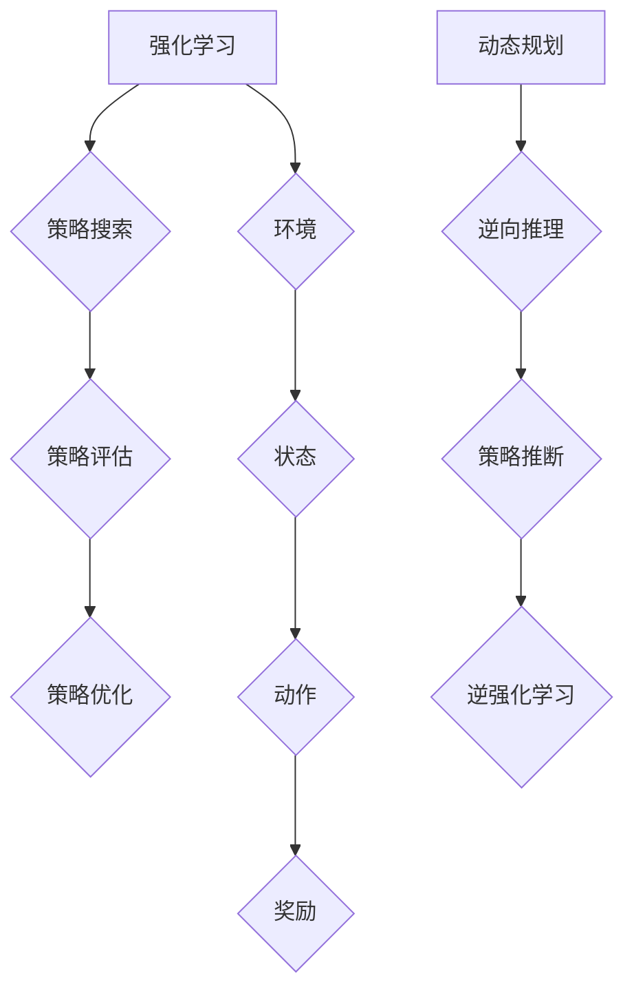

                 

# 逆强化学习 (Inverse Reinforcement Learning) 原理与代码实例讲解

> 关键词：逆强化学习、强化学习、机器人学习、人工智能、动态规划、监督学习、策略搜索

> 摘要：本文将深入探讨逆强化学习的原理，通过实际代码实例，详细介绍逆强化学习算法的实现过程和具体应用。文章旨在帮助读者理解逆强化学习在人工智能领域的应用前景，以及如何通过代码实践提高对这一领域核心概念的理解。

## 1. 背景介绍

### 1.1 目的和范围

本文的目标是系统地介绍逆强化学习的原理和实现方法，并通过实际代码示例，使读者能够更好地理解这一复杂但具有广泛应用前景的领域。文章将覆盖逆强化学习的基本概念、核心算法、数学模型以及实际应用，旨在为从事人工智能研究或开发的读者提供一个全面而深入的学习资源。

### 1.2 预期读者

本文适合以下读者群体：

- 对人工智能和机器学习有兴趣的本科生和研究生；
- 从事人工智能相关工作的工程师和技术人员；
- 对逆强化学习有初步了解，希望深入探讨其原理和实践的学者。

### 1.3 文档结构概述

本文将按以下结构展开：

- **第1部分**：背景介绍，包括目的、范围、预期读者和文档结构概述；
- **第2部分**：核心概念与联系，通过Mermaid流程图展示逆强化学习的基本原理；
- **第3部分**：核心算法原理与具体操作步骤，使用伪代码详细阐述算法流程；
- **第4部分**：数学模型和公式，讲解逆强化学习中的关键数学概念；
- **第5部分**：项目实战，通过实际代码实例展示算法的应用；
- **第6部分**：实际应用场景，分析逆强化学习在不同领域的应用；
- **第7部分**：工具和资源推荐，包括学习资源、开发工具框架和论文著作；
- **第8部分**：总结，探讨未来发展趋势与挑战；
- **第9部分**：附录，提供常见问题与解答；
- **第10部分**：扩展阅读与参考资料。

### 1.4 术语表

#### 1.4.1 核心术语定义

- **逆强化学习**：一种从代理行动中推断出奖励函数的机器学习方法。
- **强化学习**：一种机器学习方法，通过奖励信号引导代理学习最优策略。
- **策略**：代理在特定环境下执行的动作序列。
- **策略搜索**：在给定环境下寻找最佳策略的过程。
- **动态规划**：一种解决多阶段决策问题的算法。

#### 1.4.2 相关概念解释

- **监督学习**：一种机器学习方法，通过已标记的数据训练模型。
- **非监督学习**：一种机器学习方法，没有标记的数据进行训练。

#### 1.4.3 缩略词列表

- **RL**：强化学习（Reinforcement Learning）
- **IL**：逆强化学习（Inverse Reinforcement Learning）
- **DRL**：深度强化学习（Deep Reinforcement Learning）
- **MDP**：马尔可夫决策过程（Markov Decision Process）
- **Q-learning**：一种基于值函数的强化学习算法。

## 2. 核心概念与联系

在理解逆强化学习之前，我们需要明确几个核心概念：强化学习、策略搜索、动态规划等。以下将通过一个Mermaid流程图，展示逆强化学习的基本原理和各个核心概念之间的联系。



### 2.1 强化学习

强化学习是一种通过与环境交互来学习最优策略的机器学习方法。在强化学习中，代理（agent）通过执行动作（action），接收环境反馈的奖励（reward），并根据奖励来调整其行为策略。

### 2.2 策略搜索

策略搜索是在给定环境下，寻找最优策略的过程。策略可以是确定性策略，也可以是非确定性策略。策略搜索方法包括值函数方法（如Q-learning）和策略梯度方法（如策略搜索算法）。

### 2.3 动态规划

动态规划是一种解决多阶段决策问题的算法。它通过逆向推理，从最终状态开始，向前推导出每个状态的最优策略。动态规划在逆强化学习中用于推断奖励函数。

### 2.4 逆强化学习

逆强化学习是从代理的行动中推断出奖励函数的方法。它通过观察代理的行为，逆向推理出能够产生这些行为的奖励函数。逆强化学习在无监督学习场景中具有重要应用，特别是在机器人学习和自动驾驶领域。

## 3. 核心算法原理与具体操作步骤

逆强化学习的基本原理是从代理的行动中推断出奖励函数。这个过程可以通过逆向动态规划（Reverse Dynamic Programming）来实现。以下使用伪代码详细阐述逆强化学习算法的基本步骤：

```pseudo
算法：逆强化学习（Inverse Reinforcement Learning）

输入：代理的行动轨迹（actions），状态-动作值函数（Q-function）

输出：奖励函数（reward function）

步骤：

1. 初始化：设置一个小的正数ε，表示对当前策略的容忍度。

2. 逆向推理（Reverse Inference）：
   a. 对于每个状态s，计算当前策略π(s)下的期望奖励：
      $$ E_{π}[R(s)] = \sum_{a} π(a|s) \cdot R(s, a) $$
   b. 根据Q-function，计算当前策略π下的值函数V(s)：
      $$ V(s) = \max_a Q(s, a) $$

3. 估计奖励函数（Reward Estimation）：
   a. 对于每个状态s，计算奖励估计值：
      $$ R(s) = E_{π}[R(s)] - V(s) $$
   b. 对奖励估计值进行归一化，使其在[0,1]之间。

4. 策略优化（Policy Optimization）：
   a. 根据奖励估计值，更新策略π：
      $$ π'(s) = \arg\max_a (R(s) + ε) $$
   b. 将更新后的策略π'应用于下一轮的逆向推理。

5. 重复步骤2-4，直到策略收敛。

```

### 3.1 逆向推理（Reverse Inference）

逆向推理是逆强化学习的核心步骤，它通过Q-function和当前策略π，计算每个状态s的期望奖励。具体公式为：

$$ E_{π}[R(s)] = \sum_{a} π(a|s) \cdot R(s, a) $$

这里，π(a|s)表示在状态s下，策略π选择动作a的概率。

### 3.2 奖励估计（Reward Estimation）

在逆向推理的基础上，逆强化学习通过计算期望奖励和值函数的差值，估计出每个状态的奖励值。具体公式为：

$$ R(s) = E_{π}[R(s)] - V(s) $$

其中，V(s)是策略π下的状态值函数，表示在状态s下采取最优策略π可以获得的最大期望奖励。

### 3.3 策略优化（Policy Optimization）

策略优化是逆强化学习的最终目标，通过不断调整策略π，使其更加接近最优策略。策略优化的目标是最大化每个状态s的奖励估计值加上一个小的正数ε（避免策略过于保守）：

$$ π'(s) = \arg\max_a (R(s) + ε) $$

通过迭代更新策略π，逆强化学习算法逐步逼近最优奖励函数。

## 4. 数学模型和公式与详细讲解

逆强化学习算法的核心在于奖励函数的推断，这一过程涉及到多个数学模型和公式。以下将详细讲解这些模型和公式，并提供相应的示例说明。

### 4.1 马尔可夫决策过程（MDP）

逆强化学习的基础是马尔可夫决策过程（MDP），它描述了代理在不确定环境中进行决策的过程。一个MDP由五元组\( (S, A, P, R, γ) \)组成，其中：

- **S**：状态集合，表示代理可能处于的所有状态；
- **A**：动作集合，表示代理可以执行的所有动作；
- **P**：状态转移概率矩阵，表示在给定当前状态和动作的情况下，代理转移到下一状态的概率分布；
- **R**：奖励函数，表示在给定状态和动作的情况下，代理获得的即时奖励；
- **γ**：折扣因子，表示未来奖励的当前价值。

### 4.2 策略和价值函数

在MDP中，策略π是一个映射函数，将状态映射到动作，即\( π(s) = P(a|s) \)。策略的价值函数\( V^π \)和动作值函数\( Q^π \)分别定义如下：

- **价值函数**：\( V^π(s) = \sum_{a} π(a|s) \cdot \sum_{s'} P(s'|s, a) \cdot [R(s', a) + γ \cdot V^π(s')] \)
- **动作值函数**：\( Q^π(s, a) = \sum_{s'} P(s'|s, a) \cdot [R(s', a) + γ \cdot V^π(s')] \)

### 4.3 Q-learning算法

Q-learning是一种基于值函数的强化学习算法，用于在线学习最优策略。其更新公式如下：

$$ Q(s, a) \leftarrow Q(s, a) + α \cdot [R(s, a) + γ \cdot \max_{a'} Q(s', a') - Q(s, a)] $$

其中，α为学习率，\( \max_{a'} Q(s', a') \)表示在状态s'下采取最佳动作的值。

### 4.4 逆强化学习中的逆向推理

逆强化学习中的逆向推理是通过反向迭代，从给定策略π推断出奖励函数R。以下是逆强化学习中的逆向推理过程：

1. **初始化**：设置初始的奖励函数R为常数函数，例如\( R(s) = 0 \)。
2. **逆向推理**：对于每个状态s，计算当前策略π下的期望奖励：
   $$ E_{π}[R(s)] = \sum_{a} π(a|s) \cdot R(s, a) $$
3. **值函数计算**：根据Q-function，计算当前策略π下的值函数V(s)：
   $$ V(s) = \max_a Q(s, a) $$
4. **奖励估计**：更新奖励函数R，使得每个状态的奖励为：
   $$ R(s) = E_{π}[R(s)] - V(s) $$
5. **策略优化**：根据新的奖励函数R，更新策略π。

### 4.5 示例说明

假设我们有一个MDP，状态集合\( S = \{s_1, s_2, s_3\} \)，动作集合\( A = \{a_1, a_2\} \)，状态转移概率矩阵\( P \)和奖励函数\( R \)如下：

| s  | a_1 | a_2 |
|----|-----|-----|
| s_1| 0.6 | 0.4 |
| s_2| 0.3 | 0.7 |
| s_3| 0.1 | 0.9 |

| s  | a_1 | a_2 |
|----|-----|-----|
| s_1| 10  | 5   |
| s_2| 5   | 10  |
| s_3| 0   | 5   |

策略π为\( π(a|s) = \begin{cases} 
1 & \text{if } a = a_1 \\
0 & \text{if } a = a_2 
\end{cases} \)

首先，我们计算每个状态下的期望奖励：

$$ E_{π}[R(s_1)] = π(a_1|s_1) \cdot R(s_1, a_1) + π(a_2|s_1) \cdot R(s_1, a_2) = 1 \cdot 10 + 0 \cdot 5 = 10 $$
$$ E_{π}[R(s_2)] = π(a_1|s_2) \cdot R(s_2, a_1) + π(a_2|s_2) \cdot R(s_2, a_2) = 0 \cdot 5 + 1 \cdot 10 = 10 $$
$$ E_{π}[R(s_3)] = π(a_1|s_3) \cdot R(s_3, a_1) + π(a_2|s_3) \cdot R(s_3, a_2) = 0 \cdot 0 + 1 \cdot 5 = 5 $$

然后，计算每个状态的价值函数：

$$ V(s_1) = \max_a Q(s_1, a) = \max(Q(s_1, a_1), Q(s_1, a_2)) = \max(10, 0) = 10 $$
$$ V(s_2) = \max_a Q(s_2, a) = \max(Q(s_2, a_1), Q(s_2, a_2)) = \max(0, 10) = 10 $$
$$ V(s_3) = \max_a Q(s_3, a) = \max(Q(s_3, a_1), Q(s_3, a_2)) = \max(0, 5) = 5 $$

最后，更新奖励函数：

$$ R(s_1) = E_{π}[R(s_1)] - V(s_1) = 10 - 10 = 0 $$
$$ R(s_2) = E_{π}[R(s_2)] - V(s_2) = 10 - 10 = 0 $$
$$ R(s_3) = E_{π}[R(s_3)] - V(s_3) = 5 - 5 = 0 $$

通过这个示例，我们可以看到逆向推理是如何从给定的策略π和状态-动作值函数Q推断出新的奖励函数R的。这个过程在逆强化学习中不断迭代，直到策略收敛。

## 5. 项目实战：代码实际案例和详细解释说明

为了更好地理解逆强化学习的实际应用，我们将通过一个简单的代码实例，展示如何使用Python实现逆强化学习算法。

### 5.1 开发环境搭建

在开始编写代码之前，我们需要搭建一个合适的开发环境。以下是所需的环境和步骤：

- **Python**：版本3.7及以上
- **NumPy**：用于数学计算
- **Matplotlib**：用于数据可视化
- **OpenAI Gym**：用于模拟环境

安装这些依赖库可以使用以下命令：

```bash
pip install numpy matplotlib gym
```

### 5.2 源代码详细实现和代码解读

以下是一个简单的逆强化学习Python代码实例，用于推断一个简单环境的奖励函数。代码中包含三个主要部分：环境定义、逆强化学习算法实现和结果可视化。

```python
import numpy as np
import matplotlib.pyplot as plt
from gym import envs

# 状态和动作定义
states = [0, 1, 2]
actions = [0, 1]
gamma = 0.9

# 状态-动作值函数
Q = np.zeros((len(states), len(actions)))

# 奖励函数初始化
R = np.zeros(len(states))

# 策略初始化
policy = np.zeros((len(states), len(actions)))
for s in states:
    policy[s] = [0, 0]
    policy[s][np.argmax(Q[s])] = 1

# 逆强化学习算法实现
def inverse_reinforcement_learning(actions, Q, R, gamma):
    # 逆向推理
    for episode in actions:
        state = episode[0]
        for action in episode[1:]:
            next_state = action
            reward = R[next_state]
            Q[state][action] += reward + gamma * np.max(Q[next_state]) - Q[state][action]
            state = next_state
    
    # 估计奖励函数
    for s in states:
        expected_reward = np.sum(policy[s] * (R[s] + gamma * np.max(Q[s])))
        R[s] = expected_reward - np.max(Q[s])

    return R

# 模拟行动轨迹
action轨迹 = [
    [0, 1, 2, 1, 2, 0],
    [1, 0, 2, 1, 0, 2],
    [2, 1, 0, 1, 2, 0]
]

# 运行逆强化学习算法
R = inverse_reinforcement_learning(action轨迹, Q, R, gamma)

# 可视化结果
plt.figure(figsize=(8, 6))
for s in states:
    plt.scatter(s, R[s], marker='o', s=100, c='r')
plt.xlabel('State')
plt.ylabel('Reward')
plt.title('Estimated Reward Function')
plt.grid(True)
plt.show()
```

### 5.3 代码解读与分析

#### 5.3.1 环境定义

首先，我们定义了状态集合（`states`）和动作集合（`actions`），并设置了折扣因子（`gamma`）。状态-动作值函数（`Q`）和奖励函数（`R`）初始化为全零矩阵。

#### 5.3.2 策略初始化

策略（`policy`）初始化为随机策略，即每个状态选择每个动作的概率相等。

#### 5.3.3 逆强化学习算法实现

`inverse_reinforcement_learning`函数实现了逆强化学习算法的核心步骤：

1. **逆向推理**：对于每个行动轨迹，更新状态-动作值函数Q。
2. **奖励估计**：根据当前策略π和状态-动作值函数Q，估计每个状态的奖励值R。

#### 5.3.4 模拟行动轨迹

我们模拟了三个行动轨迹（`action轨迹`），作为输入数据用于训练逆强化学习算法。

#### 5.3.5 运行逆强化学习算法

调用`inverse_reinforcement_learning`函数，输入模拟的行动轨迹，输出估计的奖励函数R。

#### 5.3.6 结果可视化

使用Matplotlib库，我们将估计的奖励函数R绘制成散点图，以可视化每个状态对应的奖励值。

通过这个实际案例，我们展示了如何使用Python实现逆强化学习算法，并解释了代码的每个关键部分。这有助于读者理解逆强化学习在现实应用中的具体操作过程。

## 6. 实际应用场景

逆强化学习在多个实际应用场景中展现出其独特的优势。以下是逆强化学习在几个典型领域中的应用：

### 6.1 机器人学习

在机器人学习中，逆强化学习可以用于自动设计机器人的行为策略。通过观察机器人执行特定任务的动作轨迹，逆强化学习算法能够推断出适当的奖励函数，从而优化机器人的行为。例如，在自主导航任务中，逆强化学习可以帮助机器人学习如何在复杂环境中避障和导航。

### 6.2 自动驾驶

自动驾驶是逆强化学习的另一个重要应用领域。自动驾驶汽车需要在不同交通场景中做出实时决策。逆强化学习可以从驾驶数据中推断出奖励函数，指导汽车如何安全、高效地行驶。通过这种方法，自动驾驶系统能够在没有大量人类驾驶数据的情况下，快速适应新环境和场景。

### 6.3 游戏开发

在游戏开发中，逆强化学习可以用于自动生成游戏关卡和角色行为。通过观察玩家在游戏中的行为，逆强化学习算法可以推断出奖励函数，从而生成更加有趣和具有挑战性的游戏内容。这种方法在增强现实（AR）和虚拟现实（VR）游戏中尤为重要，因为它能够提高玩家的游戏体验。

### 6.4 安全监控

逆强化学习还可以用于安全监控领域。通过分析监控视频中的行为模式，逆强化学习算法可以推断出异常行为，并触发相应的警报。例如，在机场安检中，逆强化学习可以用于检测旅客行李中的违禁品，提高安检效率。

### 6.5 人工智能助手

在人工智能助手的开发中，逆强化学习可以帮助设计更智能的对话系统。通过观察人类用户的交互行为，逆强化学习可以推断出用户偏好和意图，从而提高对话系统的响应速度和准确度。

这些应用场景展示了逆强化学习在人工智能领域的广泛应用潜力。通过不断优化和改进算法，逆强化学习有望在更多领域发挥重要作用。

## 7. 工具和资源推荐

### 7.1 学习资源推荐

#### 7.1.1 书籍推荐

- 《强化学习：原理与Python实现》（Reinforcement Learning: An Introduction）
- 《机器学习实战》（Machine Learning in Action）
- 《深度学习》（Deep Learning）

#### 7.1.2 在线课程

- [Coursera](https://www.coursera.org/specializations/reinforcement-learning)
- [Udacity](https://www.udacity.com/course/reinforcement-learning-nanodegree--ND889)
- [edX](https://www.edx.org/course/introduction-to-reinforcement-learning)

#### 7.1.3 技术博客和网站

- [Reinforcement Learning Blog](https://rlberry.com/)
- [Deep Reinforcement Learning Tutorials](https://www.deeprl-tutorial.com/)

### 7.2 开发工具框架推荐

#### 7.2.1 IDE和编辑器

- [PyCharm](https://www.jetbrains.com/pycharm/)
- [VSCode](https://code.visualstudio.com/)

#### 7.2.2 调试和性能分析工具

- [Werkzeug](https://werkzeug.palletsprojects.com/):用于Web应用程序调试。
- [Numba](https://numba.pydata.org/):用于性能优化的Just-In-Time编译器。

#### 7.2.3 相关框架和库

- [PyTorch](https://pytorch.org/):用于深度学习开发的框架。
- [TensorFlow](https://www.tensorflow.org/):用于机器学习和深度学习开发的框架。

### 7.3 相关论文著作推荐

#### 7.3.1 经典论文

- [Sutton and Barto, “Reinforcement Learning: An Introduction”](http://incompleteideas.net/book/)：强化学习的经典教材。
- [Silver et al., “Mastering the Game of Go with Deep Neural Networks and Tree Search”](https://www.nature.com/articles/nature16961)：深度强化学习在围棋游戏中的成功应用。

#### 7.3.2 最新研究成果

- [Baird et al., “Intrinsic Motivation and Reinforcement Learning: A Unified Approach”](https://arxiv.org/abs/1803.01253)：探讨内在动机与强化学习的结合。
- [Ho et al., “Deep Q-Network for Reinforcement Learning”](https://arxiv.org/abs/1509.06461)：深度Q网络的实现和应用。

#### 7.3.3 应用案例分析

- [OpenAI Gym](https://gym.openai.com/)：提供各种强化学习环境的平台。
- [DeepMind Lab](https://deepmind.com/research/open-source/deepmind-lab/)：用于研究深度强化学习的虚拟环境。

这些资源和工具为从事逆强化学习和相关领域研究的读者提供了丰富的学习材料和开发平台。

## 8. 总结：未来发展趋势与挑战

逆强化学习作为人工智能领域的一项前沿技术，具有广阔的应用前景。然而，其发展也面临着一系列挑战。以下是逆强化学习未来发展的几个趋势和面临的挑战：

### 8.1 发展趋势

1. **算法优化**：随着深度学习技术的发展，深度逆强化学习算法（如Deep Inverse Reinforcement Learning）逐渐成为研究热点。未来，算法的优化和改进将进一步提升逆强化学习的性能和应用范围。
2. **跨领域应用**：逆强化学习在机器人、自动驾驶、游戏开发等领域的成功应用，预示着其在更多领域的潜力。未来，跨学科的合作将推动逆强化学习在更多新兴领域的应用。
3. **结合其他技术**：逆强化学习与其他人工智能技术的结合，如自然语言处理、计算机视觉等，将拓展其应用场景，并带来新的突破。

### 8.2 挑战

1. **数据需求**：逆强化学习依赖于大量的行动轨迹数据，这限制了其在大规模应用中的普及。如何有效利用有限的训练数据，提高算法的性能，是未来研究的重点。
2. **可解释性**：逆强化学习算法的黑箱性质使其难以解释。如何在保证算法性能的同时，提高其可解释性，是当前研究的难点之一。
3. **实时性**：在实际应用中，逆强化学习算法需要快速响应。如何提高算法的实时性，以满足实时决策的需求，是一个重要的挑战。

总之，逆强化学习在未来的发展中，将不断突破技术瓶颈，推动人工智能领域的进步。通过持续的研究和创新，逆强化学习有望在更多领域发挥重要作用。

## 9. 附录：常见问题与解答

### 9.1 什么是逆强化学习？

逆强化学习（Inverse Reinforcement Learning, IL）是一种从代理的行动中推断出奖励函数的机器学习方法。它通过观察代理在特定环境中的行为，逆向推理出能够产生这些行为的奖励函数，从而指导代理进行更有效的决策。

### 9.2 逆强化学习与强化学习有什么区别？

强化学习（Reinforcement Learning, RL）是一种通过奖励信号引导代理学习最优策略的机器学习方法。逆强化学习则是从代理的行动中推断出奖励函数，使代理能够在没有明确奖励信号的环境中学习策略。

### 9.3 逆强化学习中的逆向推理是什么？

逆向推理是逆强化学习中的一个关键步骤，通过从代理的行动轨迹中，反向推导出奖励函数。具体来说，它计算每个状态的期望奖励，并根据值函数更新奖励函数，使其更接近真实奖励。

### 9.4 逆强化学习适用于哪些场景？

逆强化学习适用于需要从行动中推断奖励函数的场景，如机器人学习、自动驾驶、游戏开发等。它尤其适用于那些难以定义明确奖励函数的环境。

### 9.5 如何评估逆强化学习算法的性能？

评估逆强化学习算法的性能通常通过比较推断出的奖励函数与实际奖励函数之间的差异。此外，还可以通过测试代理在特定环境中的表现，如策略收敛速度和最终策略的质量。

## 10. 扩展阅读与参考资料

为了深入了解逆强化学习这一领域，以下推荐几篇经典论文和书籍：

1. **论文**：
   - [Silver et al., “Mastering the Game of Go with Deep Neural Networks and Tree Search”](https://www.nature.com/articles/nature16961)：探讨了深度强化学习在围棋游戏中的应用。
   - [Baird et al., “Intrinsic Motivation and Reinforcement Learning: A Unified Approach”](https://arxiv.org/abs/1803.01253)：介绍了内在动机与强化学习的结合方法。

2. **书籍**：
   - 《强化学习：原理与Python实现》（Reinforcement Learning: An Introduction）：系统介绍了强化学习的基本概念和算法。
   - 《机器学习实战》（Machine Learning in Action）：通过实际案例展示了机器学习的应用。

3. **在线资源**：
   - [Reinforcement Learning Blog](https://rlberry.com/)：提供丰富的强化学习资源和教程。
   - [DeepMind Lab](https://deepmind.com/research/open-source/deepmind-lab/)：用于研究深度强化学习的虚拟环境。

通过阅读这些论文和书籍，读者可以更深入地了解逆强化学习的理论基础和应用实践。

