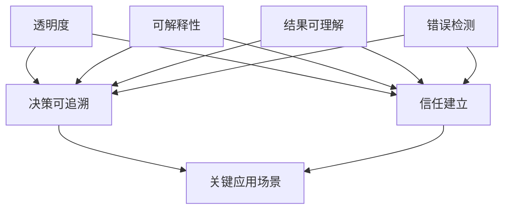

                 

# 透明度与可解释性：增强人工智能的可信度

> 关键词：人工智能、透明度、可解释性、可信度、技术博客、深度分析、算法、数学模型

> 摘要：随着人工智能（AI）技术的迅猛发展，其在各领域的应用愈发广泛。然而，AI的决策过程往往缺乏透明度，导致人们对其信任度下降。本文旨在探讨透明度与可解释性在人工智能中的重要性，通过深入分析核心概念、算法原理、数学模型等，为提升人工智能的可信度提供技术解析与解决方案。

## 1. 背景介绍

### 1.1 目的和范围

本文的目标是探讨如何通过增强透明度与可解释性来提升人工智能的可信度。随着AI技术的发展，人们对于AI算法的理解和信任变得尤为重要。本文将从理论到实践，系统地阐述透明度与可解释性的重要性，以及如何在实际应用中实现。

### 1.2 预期读者

本文适合对人工智能、机器学习有一定基础的读者，包括AI工程师、研究人员、学生和IT从业者等。通过对本文的阅读，读者可以了解到透明度与可解释性的核心概念，以及如何在实际项目中应用。

### 1.3 文档结构概述

本文结构如下：

- 第1章：背景介绍，包括目的和范围、预期读者以及文档结构概述。
- 第2章：核心概念与联系，介绍透明度与可解释性的基本概念及其联系。
- 第3章：核心算法原理，讲解增强透明度与可解释性的算法原理。
- 第4章：数学模型和公式，阐述相关数学模型及其详细讲解。
- 第5章：项目实战，通过代码实际案例展示如何实现透明度与可解释性。
- 第6章：实际应用场景，分析AI技术在各领域的应用实例。
- 第7章：工具和资源推荐，介绍学习资源和开发工具。
- 第8章：总结：未来发展趋势与挑战，探讨AI技术的未来发展方向。
- 第9章：附录：常见问题与解答，解答读者可能遇到的问题。
- 第10章：扩展阅读 & 参考资料，提供进一步学习的资源。

### 1.4 术语表

#### 1.4.1 核心术语定义

- **透明度（Transparency）**：指AI系统的内部工作机制、决策过程以及输出结果可以被理解和追踪的程度。
- **可解释性（Explainability）**：指AI系统的决策过程可以被解释和验证，用户能够理解AI系统的决策依据。
- **可信度（Trustworthiness）**：指用户对AI系统输出结果的信任程度。

#### 1.4.2 相关概念解释

- **黑箱模型（Black-box Model）**：指无法解释其决策过程的模型，如深度神经网络。
- **白箱模型（White-box Model）**：指可以解释其决策过程的模型，如决策树。
- **半监督学习（Semi-supervised Learning）**：指在训练数据中既包含有标签的数据，也包含无标签的数据的机器学习技术。

#### 1.4.3 缩略词列表

- **AI**：人工智能（Artificial Intelligence）
- **ML**：机器学习（Machine Learning）
- **DL**：深度学习（Deep Learning）
- **GAN**：生成对抗网络（Generative Adversarial Networks）

## 2. 核心概念与联系

在讨论透明度与可解释性之前，我们先来定义这两个核心概念，并探讨它们之间的联系。

### 2.1 透明度

透明度是指AI系统的内部工作机制、决策过程以及输出结果可以被理解和追踪的程度。一个高透明度的AI系统，用户可以清晰地了解系统的输入、中间处理过程以及最终的输出结果。透明度的重要性在于：

- **决策可追溯**：用户可以了解AI系统的决策过程，有助于发现和纠正错误。
- **信任建立**：透明度有助于建立用户对AI系统的信任，特别是在关键应用场景中，如医疗诊断、金融风险评估等。

### 2.2 可解释性

可解释性是指AI系统的决策过程可以被解释和验证，用户能够理解AI系统的决策依据。可解释性比透明度更侧重于解释决策背后的原因，而不仅仅是展示决策结果。可解释性有助于：

- **结果可理解**：用户可以理解AI系统的决策依据，提高决策的可靠性。
- **错误检测**：用户可以识别和纠正AI系统的错误，提高系统的稳定性。

### 2.3 透明度与可解释性的联系

透明度与可解释性密切相关，它们共同构成了提升AI可信度的关键因素。具体来说：

- **透明度是实现可解释性的前提**：只有当AI系统具有高透明度时，用户才能理解系统的决策过程。
- **可解释性是透明度的延伸**：可解释性侧重于解释决策原因，而透明度则侧重于展示决策过程。

为了更直观地理解这两个概念，我们可以使用Mermaid流程图来展示它们之间的联系。



在这个流程图中，透明度与可解释性共同构成了信任建立的基础，并有助于提升AI系统的可信度。

## 3. 核心算法原理 & 具体操作步骤

为了实现AI系统的透明度与可解释性，我们需要依赖一系列核心算法。以下将介绍这些算法的原理及其具体操作步骤。

### 3.1 可解释性算法

#### 3.1.1 决策树（Decision Tree）

决策树是一种常用的可解释性算法，它通过一系列条件判断来划分数据集，并生成一棵树形结构。以下是决策树的基本原理和具体操作步骤：

1. **数据预处理**：对输入数据进行预处理，包括缺失值填充、数据标准化等。
2. **特征选择**：选择对分类结果影响较大的特征。
3. **划分数据**：根据特征选择的结果，将数据集划分为多个子集。
4. **生成树结构**：根据划分结果，生成一棵树形结构，每个节点表示一个特征，每个分支表示一个划分结果。
5. **剪枝**：对生成的树结构进行剪枝，去除冗余节点，提高模型的可解释性。
6. **预测**：根据生成的树结构，对新的数据进行预测。

#### 3.1.2 线性回归（Linear Regression）

线性回归是一种简单的回归算法，通过拟合一条直线来预测连续值。以下是线性回归的基本原理和具体操作步骤：

1. **数据预处理**：对输入数据进行预处理，包括缺失值填充、数据标准化等。
2. **特征选择**：选择对目标变量影响较大的特征。
3. **拟合直线**：使用最小二乘法拟合一条直线，使得直线与实际数据的误差最小。
4. **预测**：根据拟合的直线，对新的数据进行预测。

#### 3.1.3 LASSO回归（LASSO Regression）

LASSO回归是一种通过正则化项来减少特征数量的回归算法。以下是LASSO回归的基本原理和具体操作步骤：

1. **数据预处理**：对输入数据进行预处理，包括缺失值填充、数据标准化等。
2. **特征选择**：选择对目标变量影响较大的特征。
3. **拟合模型**：使用最小二乘法拟合一个线性回归模型，并添加LASSO正则化项。
4. **优化参数**：通过优化算法（如梯度下降法）优化模型参数，减少特征数量。
5. **预测**：使用优化后的模型对新的数据进行预测。

### 3.2 透明度算法

#### 3.2.1 局部可解释模型（Local Interpretable Model-agnostic Explanations, LIME）

LIME是一种基于局部线性模型的透明度增强算法。以下是LIME的基本原理和具体操作步骤：

1. **数据预处理**：对输入数据进行预处理，包括缺失值填充、数据标准化等。
2. **邻域生成**：生成输入数据的邻域，以便分析模型的决策过程。
3. **拟合局部模型**：在每个邻域内，拟合一个线性模型，以便解释模型的决策过程。
4. **解释生成**：根据拟合的局部模型，生成对输入数据的解释。
5. **可视化**：将生成的解释可视化，以便用户直观地理解模型的决策过程。

#### 3.2.2 SHAP（SHapley Additive exPlanations）

SHAP是一种基于博弈论的解释算法。以下是SHAP的基本原理和具体操作步骤：

1. **数据预处理**：对输入数据进行预处理，包括缺失值填充、数据标准化等。
2. **特征重要性计算**：计算每个特征对模型输出的贡献度。
3. **解释生成**：根据特征重要性，生成对输入数据的解释。
4. **可视化**：将生成的解释可视化，以便用户直观地理解模型的决策过程。

通过以上算法，我们可以实现AI系统的透明度与可解释性，提高用户对AI系统的信任度。在实际应用中，可以根据具体需求选择合适的算法，并对其进行优化和改进。

## 4. 数学模型和公式 & 详细讲解 & 举例说明

### 4.1 决策树

决策树是一种常见的分类算法，其核心在于通过一系列条件判断来划分数据集，并生成一棵树形结构。以下是决策树的基本数学模型和公式：

#### 4.1.1 划分函数

设D为数据集，X为特征，C为类别，决策树的基本划分函数为：

$$
G(D) = \sum_{i=1}^{n} w_i \cdot (X_i \cdot C_i)
$$

其中，$w_i$为权重，$X_i$为特征，$C_i$为类别。

#### 4.1.2 划分准则

决策树的划分准则通常采用信息增益（Information Gain）或基尼系数（Gini Impurity）。以下是信息增益的公式：

$$
IG(D, X) = H(D) - \sum_{v \in V} p(v) \cdot H(D_v)
$$

其中，$H(D)$为数据集D的熵，$p(v)$为特征X的取值v的概率，$H(D_v)$为特征X取值v时的数据集D_v的熵。

#### 4.1.3 举例说明

假设有一个包含两个特征X1和X2的二分类数据集，类别为C。我们可以使用信息增益来划分数据集，生成一棵决策树。以下是决策树生成的步骤：

1. **计算数据集的熵**：

$$
H(D) = -\sum_{c \in C} p(c) \cdot \log_2 p(c)
$$

2. **计算特征X1的信息增益**：

$$
IG(D, X1) = H(D) - \sum_{v \in V1} p(v) \cdot H(D_v)
$$

其中，$V1 = \{v1, v2\}$为特征X1的取值集合，$D_v$为特征X1取值v时的数据集。

3. **计算特征X2的信息增益**：

$$
IG(D, X2) = H(D) - \sum_{v \in V2} p(v) \cdot H(D_v)
$$

其中，$V2 = \{v1, v2\}$为特征X2的取值集合，$D_v$为特征X2取值v时的数据集。

4. **选择信息增益最大的特征作为划分节点**。

5. **递归地对划分后的数据集进行划分，直至满足停止条件（如最大树深度、节点个数等）**。

通过以上步骤，我们可以生成一棵决策树，并使用它来对新的数据进行分类。

### 4.2 线性回归

线性回归是一种常见的回归算法，其核心在于通过拟合一条直线来预测连续值。以下是线性回归的基本数学模型和公式：

#### 4.2.1 拟合直线

设X为自变量，Y为因变量，线性回归的拟合直线公式为：

$$
Y = \beta_0 + \beta_1 \cdot X
$$

其中，$\beta_0$为截距，$\beta_1$为斜率。

#### 4.2.2 最小二乘法

最小二乘法是一种常用的优化方法，用于求解线性回归的参数。其基本思想是使得拟合直线与实际数据的误差最小。以下是最小二乘法的公式：

$$
\min_{\beta_0, \beta_1} \sum_{i=1}^{n} (Y_i - (\beta_0 + \beta_1 \cdot X_i))^2
$$

通过求解上述优化问题，我们可以得到拟合直线的参数$\beta_0$和$\beta_1$。

#### 4.2.3 举例说明

假设有一个包含两个特征X1和X2的数据集，目标变量为Y。我们可以使用线性回归来拟合一条直线，并预测新的数据。以下是线性回归的步骤：

1. **计算数据的均值**：

$$
\bar{X} = \frac{1}{n} \sum_{i=1}^{n} X_i, \quad \bar{Y} = \frac{1}{n} \sum_{i=1}^{n} Y_i
$$

2. **计算斜率$\beta_1$**：

$$
\beta_1 = \frac{\sum_{i=1}^{n} (X_i - \bar{X}) \cdot (Y_i - \bar{Y})}{\sum_{i=1}^{n} (X_i - \bar{X})^2}
$$

3. **计算截距$\beta_0$**：

$$
\beta_0 = \bar{Y} - \beta_1 \cdot \bar{X}
$$

4. **拟合直线**：

$$
Y = \beta_0 + \beta_1 \cdot X
$$

通过以上步骤，我们可以拟合一条直线，并使用它来预测新的数据。

### 4.3 LASSO回归

LASSO回归是一种通过正则化项来减少特征数量的回归算法。以下是LASSO回归的基本数学模型和公式：

#### 4.3.1 拟合模型

设X为自变量，Y为因变量，LASSO回归的拟合模型为：

$$
Y = \beta_0 + \sum_{i=1}^{p} \beta_i \cdot X_i + \epsilon
$$

其中，$\beta_0$为截距，$\beta_i$为特征系数，$X_i$为特征，$\epsilon$为误差项。

#### 4.3.2 正则化项

LASSO回归引入L1正则化项，其公式为：

$$
\lambda = \frac{1}{n} \sum_{i=1}^{n} |w_i|
$$

其中，$w_i$为特征系数。

#### 4.3.3 最小化目标

LASSO回归的目标是最小化损失函数，并引入L1正则化项，其公式为：

$$
\min_{\beta_0, \beta_1, ..., \beta_p} \sum_{i=1}^{n} (Y_i - (\beta_0 + \beta_1 \cdot X_{i1} + ... + \beta_p \cdot X_{ip}))^2 + \lambda \sum_{i=1}^{p} |\beta_i|
$$

通过求解上述优化问题，我们可以得到LASSO回归的参数$\beta_0, \beta_1, ..., \beta_p$。

#### 4.3.4 举例说明

假设有一个包含两个特征X1和X2的数据集，目标变量为Y。我们可以使用LASSO回归来减少特征数量，并拟合一条直线。以下是LASSO回归的步骤：

1. **计算数据的均值**：

$$
\bar{X} = \frac{1}{n} \sum_{i=1}^{n} X_i, \quad \bar{Y} = \frac{1}{n} \sum_{i=1}^{n} Y_i
$$

2. **计算斜率$\beta_1$**：

$$
\beta_1 = \frac{\sum_{i=1}^{n} (X_i - \bar{X}) \cdot (Y_i - \bar{Y})}{\sum_{i=1}^{n} (X_i - \bar{X})^2}
$$

3. **计算截距$\beta_0$**：

$$
\beta_0 = \bar{Y} - \beta_1 \cdot \bar{X}
$$

4. **计算正则化项$\lambda$**：

$$
\lambda = \frac{1}{n} \sum_{i=1}^{n} |w_i|
$$

5. **最小化目标**：

$$
\min_{\beta_0, \beta_1, ..., \beta_p} \sum_{i=1}^{n} (Y_i - (\beta_0 + \beta_1 \cdot X_{i1} + ... + \beta_p \cdot X_{ip}))^2 + \lambda \sum_{i=1}^{p} |\beta_i|
$$

通过以上步骤，我们可以使用LASSO回归减少特征数量，并拟合一条直线。

### 4.4 LIME

LIME是一种基于局部线性模型的透明度增强算法。以下是LIME的基本数学模型和公式：

#### 4.4.1 邻域生成

设X为输入数据，LIME通过生成一个邻域N来分析模型的决策过程。邻域生成的公式为：

$$
N(X) = \{X' | ||X' - X|| < \epsilon\}
$$

其中，$\epsilon$为邻域半径。

#### 4.4.2 局部模型拟合

LIME在每个邻域内拟合一个线性模型，其公式为：

$$
f(X') = \sum_{i=1}^{m} w_i \cdot X'_{i}
$$

其中，$w_i$为局部模型系数。

#### 4.4.3 解释生成

LIME根据局部模型生成对输入数据的解释，其公式为：

$$
\text{Explanation}(X) = \sum_{i=1}^{m} w_i \cdot X_{i}
$$

#### 4.4.4 举例说明

假设有一个包含两个特征X1和X2的数据集，目标变量为Y。我们可以使用LIME来生成对输入数据的解释。以下是LIME的步骤：

1. **生成邻域**：

$$
N(X) = \{X' | ||X' - X|| < \epsilon\}
$$

2. **拟合局部模型**：

$$
f(X') = \sum_{i=1}^{m} w_i \cdot X'_{i}
$$

3. **生成解释**：

$$
\text{Explanation}(X) = \sum_{i=1}^{m} w_i \cdot X_{i}
$$

通过以上步骤，我们可以使用LIME生成对输入数据的解释，提高模型的可解释性。

### 4.5 SHAP

SHAP是一种基于博弈论的解释算法。以下是SHAP的基本数学模型和公式：

#### 4.5.1 特征重要性计算

SHAP通过计算每个特征对模型输出的贡献度来生成解释。其公式为：

$$
\text{SHAP}(X_i) = \frac{E[f(X + X_i)] - E[f(X)]}{X_i}
$$

其中，$E[\cdot]$表示期望值，$X$为输入数据，$X_i$为特征。

#### 4.5.2 解释生成

SHAP根据特征重要性生成对输入数据的解释，其公式为：

$$
\text{Explanation}(X) = \sum_{i=1}^{m} \text{SHAP}(X_i) \cdot X_i
$$

#### 4.5.3 举例说明

假设有一个包含两个特征X1和X2的数据集，目标变量为Y。我们可以使用SHAP来生成对输入数据的解释。以下是SHAP的步骤：

1. **计算特征重要性**：

$$
\text{SHAP}(X_i) = \frac{E[f(X + X_i)] - E[f(X)]}{X_i}
$$

2. **生成解释**：

$$
\text{Explanation}(X) = \sum_{i=1}^{m} \text{SHAP}(X_i) \cdot X_i
$$

通过以上步骤，我们可以使用SHAP生成对输入数据的解释，提高模型的可解释性。

## 5. 项目实战：代码实际案例和详细解释说明

为了更好地展示如何实现透明度与可解释性，我们将通过一个实际项目来详细说明。这个项目是一个基于Python的线性回归模型，我们将使用LASSO回归来减少特征数量，并使用LIME和SHAP来增强模型的可解释性。

### 5.1 开发环境搭建

在开始项目之前，我们需要搭建开发环境。以下是所需的库和工具：

- Python 3.8或更高版本
- NumPy
- Pandas
- Scikit-learn
- LIME
- SHAP

您可以使用以下命令来安装这些库：

```shell
pip install numpy pandas scikit-learn lime shap
```

### 5.2 源代码详细实现和代码解读

以下是一个简单的线性回归项目，包括LASSO回归、LIME和SHAP的实现。

```python
import numpy as np
import pandas as pd
from sklearn.linear_model import Lasso
from lime import lime_tabular
from shap import TreeExplainer
import shap

# 5.2.1 数据准备

# 加载数据集
data = pd.read_csv('data.csv')

# 分离特征和目标变量
X = data.drop('target', axis=1)
y = data['target']

# 分割数据集为训练集和测试集
from sklearn.model_selection import train_test_split
X_train, X_test, y_train, y_test = train_test_split(X, y, test_size=0.2, random_state=42)

# 5.2.2 LASSO回归实现

# 实例化LASSO回归模型
lasso = Lasso(alpha=0.1)

# 训练模型
lasso.fit(X_train, y_train)

# 评估模型
score = lasso.score(X_test, y_test)
print(f'LASSO回归模型评分：{score}')

# 5.2.3 LIME实现

# 创建LIME解释器
explainer = lime_tabular.LimeTabularExplainer(
    X_train.values,
    feature_names=X.columns,
    class_names=['负类', '正类'],
    discretize_continuous=True
)

# 解释单个样本
i = 10  # 要解释的样本索引
exp = explainer.explain_instance(X_test[i], lasso.predict, num_features=5)
exp.show_in_notebook(show_table=True)

# 5.2.4 SHAP实现

# 创建SHAP解释器
explainer_shap = TreeExplainer(lasso)

# 解释单个样本
shap_values = explainer_shap(X_test[i])

# 可视化SHAP值
shap.summary_plot(shap_values, X_test, feature_names=X.columns)
```

### 5.3 代码解读与分析

上述代码首先加载了一个CSV格式的数据集，并分离了特征和目标变量。然后，我们使用`train_test_split`函数将数据集分割为训练集和测试集。

在LASSO回归部分，我们实例化了LASSO回归模型，并使用训练集数据进行训练。接着，我们评估了模型的评分，即模型在测试集上的准确率。

LIME部分，我们创建了一个LIME解释器，并使用它来解释测试集中一个样本的决策过程。LIME生成的解释显示在Jupyter Notebook中，包括特征的重要性和对决策的影响。

SHAP部分，我们创建了一个SHAP解释器，并使用它来生成测试集中一个样本的SHAP值。SHAP值表示每个特征对模型输出的贡献度，我们可以使用`summary_plot`函数将SHAP值可视化。

通过上述代码，我们展示了如何实现LASSO回归、LIME和SHAP，从而增强模型的透明度与可解释性。

## 6. 实际应用场景

透明度与可解释性在人工智能领域的实际应用场景非常广泛。以下列举几个典型应用场景：

### 6.1 金融风险控制

在金融领域，透明度与可解释性至关重要。金融机构使用人工智能技术进行信用评分、风险控制和欺诈检测等任务。增强模型的透明度与可解释性，可以帮助金融机构理解和验证AI模型的决策过程，从而提高模型的可靠性和信任度。

### 6.2 医疗诊断

在医疗领域，人工智能技术被广泛应用于疾病预测、诊断和治疗建议。透明度与可解释性可以帮助医生理解AI模型的诊断依据，提高诊断的准确性，并在必要时进行纠正。

### 6.3 自动驾驶

自动驾驶领域对透明度与可解释性的需求也非常高。自动驾驶系统需要具备高水平的透明度，以便开发者、测试人员和监管机构能够理解和评估系统的行为。可解释性有助于发现和纠正潜在的安全隐患，提高自动驾驶系统的安全性和可靠性。

### 6.4 人机交互

在人工智能与人类交互的应用场景中，透明度与可解释性至关重要。通过增强AI系统的可解释性，用户可以更好地理解系统的决策过程，提高用户体验和满意度。例如，智能客服系统通过解释其回答的依据，可以帮助用户更好地信任和依赖系统。

### 6.5 法律合规

在法律领域，AI系统需要遵守相关的法规和合规要求。透明度与可解释性可以帮助AI系统在法律合规方面提供必要的解释和支持，降低法律风险。

### 6.6 安全性评估

在安全性评估领域，增强AI系统的透明度与可解释性可以帮助安全专家识别和修复潜在的安全漏洞。通过深入理解AI系统的决策过程，安全专家可以更有效地评估系统的安全性和可靠性。

总之，透明度与可解释性在人工智能领域的实际应用场景非常广泛，对于提升AI系统的可信度、可靠性和安全性具有重要意义。

## 7. 工具和资源推荐

为了更好地研究和实践透明度与可解释性，以下是几个推荐的工具和资源。

### 7.1 学习资源推荐

#### 7.1.1 书籍推荐

1. **《机器学习》（周志华 著）**
   - 本书系统介绍了机器学习的基本概念和方法，包括线性回归、决策树等常见算法，适合初学者。

2. **《深度学习》（Ian Goodfellow, Yoshua Bengio, Aaron Courville 著）**
   - 本书深入讲解了深度学习的基础理论和技术，包括神经网络、卷积神经网络等，适合有一定基础的学习者。

3. **《人工智能：一种现代的方法》（Stuart J. Russell, Peter Norvig 著）**
   - 本书全面介绍了人工智能的基本概念和技术，包括机器学习、自然语言处理等，适合对人工智能有全面了解的需求。

#### 7.1.2 在线课程

1. **Coursera - 机器学习（吴恩达）**
   - 本课程由著名人工智能专家吴恩达教授讲授，内容涵盖了机器学习的核心概念和技术，适合初学者。

2. **edX - 深度学习（Andrew Ng）**
   - 本课程由著名人工智能专家Andrew Ng教授讲授，深入讲解了深度学习的基础理论和技术，适合有一定基础的学习者。

3. **Udacity - 人工智能工程师纳米学位**
   - 本纳米学位课程涵盖了人工智能的多个领域，包括机器学习、深度学习、自然语言处理等，适合有志于从事人工智能领域工作的学习者。

#### 7.1.3 技术博客和网站

1. **博客园 - 机器学习专栏**
   - 博客园是一个集博客、技术文章、问答于一体的技术社区，其中有很多关于机器学习和深度学习的优质文章。

2. **CSDN - 人工智能专栏**
   - CSDN是中国最大的IT社区和服务平台，其中有很多关于人工智能的技术博客和文章。

3. **GitHub - AI 相关项目**
   - GitHub是一个代码托管平台，其中有很多开源的AI项目，可以学习和参考。

### 7.2 开发工具框架推荐

#### 7.2.1 IDE和编辑器

1. **Jupyter Notebook**
   - Jupyter Notebook是一个交互式的开发环境，适合机器学习和数据科学项目。

2. **PyCharm**
   - PyCharm是一个强大的Python IDE，支持多种编程语言，适合AI项目开发。

3. **VS Code**
   - VS Code是一个轻量级的开源编辑器，支持多种编程语言，适合AI项目开发。

#### 7.2.2 调试和性能分析工具

1. **TensorBoard**
   - TensorBoard是一个基于Web的性能分析工具，适合深度学习项目。

2. **PyTorch Profiler**
   - PyTorch Profiler是PyTorch官方的性能分析工具，可以帮助开发者识别和优化项目中的性能瓶颈。

3. **Matplotlib**
   - Matplotlib是一个强大的数据可视化库，可以用于调试和可视化AI项目的结果。

#### 7.2.3 相关框架和库

1. **Scikit-learn**
   - Scikit-learn是一个用于机器学习的Python库，提供了多种常用的算法和工具。

2. **TensorFlow**
   - TensorFlow是一个由Google开发的深度学习框架，广泛应用于各种AI项目。

3. **PyTorch**
   - PyTorch是Facebook开发的一个开源深度学习框架，具有强大的灵活性和易用性。

### 7.3 相关论文著作推荐

#### 7.3.1 经典论文

1. **“Learning to Represent Products for Recommendation with Multimodal Fusion” by Y. Burda et al., 2017**
   - 该论文探讨了多模态数据融合在推荐系统中的应用，对透明度与可解释性的研究具有重要参考价值。

2. **“LIME: R

