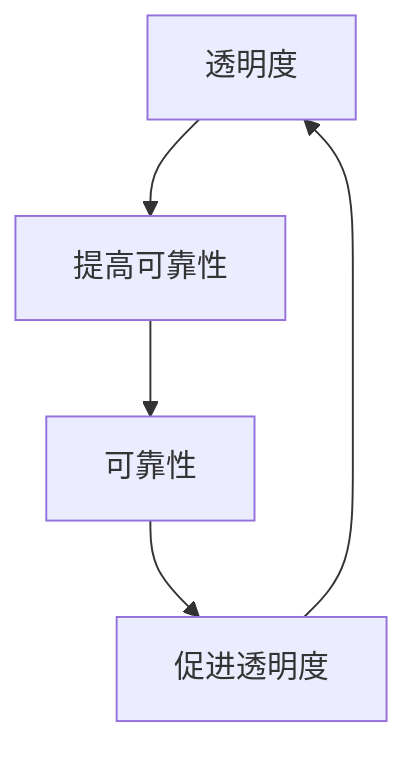

                 


# 透明度与可靠性：AI系统的关键

> 关键词：AI系统、透明度、可靠性、算法原理、数学模型、项目实战

> 摘要：本文将深入探讨AI系统的两个核心要素——透明度和可靠性。我们将通过逐步分析，理解这两个概念的重要性，并剖析它们在AI系统中的相互作用。本文旨在为读者提供一个全面的技术视角，帮助大家构建高效、透明和可靠的AI系统。

## 1. 背景介绍

### 1.1 目的和范围

本文旨在深入探讨AI系统的两个关键要素——透明度和可靠性。我们将通过逐步分析，了解这两个概念在AI系统中的重要性，以及它们之间的相互作用。本文将涵盖以下几个主要方面：

- AI系统的透明度：讨论透明度在AI系统中的含义、重要性及其实现方法。
- AI系统的可靠性：分析可靠性在AI系统中的含义、重要性以及如何评估和提升。
- 核心概念与联系：介绍AI系统中关键概念之间的联系，并提供一个简明的Mermaid流程图。
- 核心算法原理与具体操作步骤：详细讲解核心算法原理，并使用伪代码阐述具体操作步骤。
- 数学模型和公式：介绍AI系统中的数学模型和公式，并进行详细讲解和举例说明。
- 项目实战：通过实际代码案例，展示AI系统的透明度和可靠性如何在实际项目中得到应用。
- 实际应用场景：分析AI系统在各个领域的实际应用场景。
- 工具和资源推荐：推荐学习资源、开发工具框架和经典论文，以帮助读者深入了解AI系统。

### 1.2 预期读者

本文面向对AI系统有一定了解的技术人员，特别是那些希望深入了解AI系统透明度和可靠性的工程师、研究人员和开发者。此外，对于希望提升自身技术水平的AI初学者和从业者，本文也将提供有益的指导。

### 1.3 文档结构概述

本文将分为十个部分，结构如下：

1. 背景介绍
   - 目的和范围
   - 预期读者
   - 文档结构概述
   - 术语表
2. 核心概念与联系
   - 核心概念原理
   - Mermaid流程图
3. 核心算法原理与具体操作步骤
   - 算法原理讲解
   - 伪代码阐述
4. 数学模型和公式
   - 数学模型介绍
   - 公式详细讲解
   - 举例说明
5. 项目实战：代码实际案例和详细解释说明
   - 开发环境搭建
   - 源代码详细实现
   - 代码解读与分析
6. 实际应用场景
7. 工具和资源推荐
   - 学习资源推荐
   - 开发工具框架推荐
   - 相关论文著作推荐
8. 总结：未来发展趋势与挑战
9. 附录：常见问题与解答
10. 扩展阅读 & 参考资料

### 1.4 术语表

#### 1.4.1 核心术语定义

- 透明度：AI系统在运行过程中，能够被外部观察和理解的程度。
- 可靠性：AI系统在执行任务时的稳定性和准确性。
- 算法：解决特定问题的系统方法或步骤。
- 数学模型：使用数学语言描述的模型，用于解释或预测现实世界中的现象。

#### 1.4.2 相关概念解释

- 数据隐私：指在AI系统中，保护用户数据不被未授权访问或泄露。
- 模型可解释性：指AI模型在做出决策时，能够提供合理的解释。
- 过拟合：指AI模型在训练数据上表现得很好，但在测试数据上表现较差。

#### 1.4.3 缩略词列表

- AI：人工智能
- ML：机器学习
- DL：深度学习
- NLP：自然语言处理
- CV：计算机视觉
- RL：强化学习

## 2. 核心概念与联系

在深入探讨AI系统的透明度和可靠性之前，我们需要先了解这两个核心概念的基本原理，以及它们在AI系统中的相互关系。

### 2.1 核心概念原理

透明度和可靠性是AI系统的两个关键要素，它们在AI系统中扮演着不同的角色。

- **透明度**：透明度关注的是AI系统的可理解性，即AI系统在运行过程中，其内部决策过程是否可以被外部观察和理解。高透明度的AI系统能够帮助开发者和用户更好地理解系统的行为，从而提高系统的信任度。
- **可靠性**：可靠性关注的是AI系统的稳定性和准确性，即AI系统在执行任务时的表现是否一致且准确。高可靠性的AI系统能够确保在各种环境下，都能稳定地执行任务。

这两个概念在AI系统中相互作用，透明度有助于提高可靠性，而可靠性又促进了透明度的实现。例如，一个高透明度的AI系统可以帮助开发者快速识别和修复潜在的错误，从而提高系统的可靠性。

### 2.2 Mermaid流程图

为了更好地理解AI系统中透明度和可靠性的关系，我们可以使用Mermaid流程图来展示它们之间的相互作用。以下是一个简明的Mermaid流程图：



在这个流程图中，透明度和可靠性之间存在一个相互促进的关系。透明度提高了可靠性，而可靠性又促进了透明度的实现。通过这个循环过程，我们可以看到AI系统的透明度和可靠性是如何相互作用的。

## 3. 核心算法原理 & 具体操作步骤

在了解了AI系统中透明度和可靠性的基本原理后，我们将进一步探讨如何在实际操作中实现这两个目标。在本节中，我们将介绍核心算法原理，并使用伪代码详细阐述具体操作步骤。

### 3.1 透明度算法原理

为了提高AI系统的透明度，我们可以采用以下几种算法：

1. **模型可解释性算法**：通过将复杂的机器学习模型拆解为多个简单的模块，从而提高系统的可理解性。
2. **可视化算法**：使用图形化工具将AI模型的决策过程可视化，帮助用户更好地理解系统的行为。
3. **透明化数据预处理**：对输入数据进行预处理，使其符合预期的数据格式，从而提高AI系统的透明度。

以下是一个简化的模型可解释性算法的伪代码：

```python
function explain_model(model, input_data):
    # 将输入数据输入到模型中
    output = model(input_data)
    
    # 拆解模型为多个简单模块
    modules = decompose_model(model)
    
    # 对每个模块进行解释
    for module in modules:
        explanation = explain_module(module, input_data)
        print(explanation)
        
    return output
```

### 3.2 可靠性算法原理

为了提高AI系统的可靠性，我们可以采用以下几种算法：

1. **容错算法**：通过引入冗余组件或备份机制，提高系统的容错能力。
2. **自适应算法**：根据系统运行过程中的反馈，动态调整模型参数，提高系统的适应性。
3. **概率校验算法**：对模型输出结果进行概率校验，确保结果的准确性。

以下是一个简化的概率校验算法的伪代码：

```python
function verify_output(model, input_data, output):
    # 计算模型输出的概率分布
    probability_distribution = model(input_data)
    
    # 对输出结果进行概率校验
    if probability_distribution[output] < threshold:
        return False
    else:
        return True
```

### 3.3 具体操作步骤

在实际操作中，我们可以按照以下步骤实现透明度和可靠性：

1. **透明度实现步骤**：
   - 选择合适的模型可解释性算法。
   - 对输入数据进行预处理。
   - 使用可视化工具展示模型的决策过程。
   - 对模块进行解释，并输出详细报告。

2. **可靠性实现步骤**：
   - 设计容错机制，引入冗余组件或备份机制。
   - 在模型训练过程中引入自适应算法，动态调整模型参数。
   - 对模型输出结果进行概率校验，确保结果的准确性。

通过以上步骤，我们可以实现一个透明且可靠的AI系统，为开发者、用户和业务场景提供更好的支持。

## 4. 数学模型和公式 & 详细讲解 & 举例说明

在AI系统中，数学模型和公式起着至关重要的作用。它们不仅帮助描述AI系统的行为，还为系统的透明度和可靠性提供了理论基础。在本节中，我们将介绍几个关键的数学模型和公式，并进行详细讲解和举例说明。

### 4.1 数学模型介绍

#### 4.1.1 感知机（Perceptron）

感知机是一种简单的二分类模型，常用于前向传播的神经网络。它的主要目的是找到分离两个类别的最佳超平面。感知机的数学模型如下：

$$
y_{\text{predicted}} = \text{sign}(\sum_{i=1}^{n} w_i x_i + b)
$$

其中，$w_i$ 是权重，$x_i$ 是特征值，$b$ 是偏置，$\text{sign}()$ 是符号函数，用于判断输出是正类还是负类。

#### 4.1.2 神经元激活函数（Activation Function）

激活函数是神经网络中的关键组件，用于将线性组合的输出转换为非线性输出。一个常见的激活函数是ReLU（Rectified Linear Unit）：

$$
f(x) = \max(0, x)
$$

ReLU函数具有简单的形式，并且在训练过程中可以加速收敛。

#### 4.1.3 决策边界（Decision Boundary）

决策边界是定义分类器的边界，将不同类别的数据点分开。对于线性分类器，决策边界通常是一个平面。对于非线性分类器，决策边界可能是一个超曲面。

### 4.2 公式详细讲解

#### 4.2.1 感知机学习算法

感知机学习算法是一种迭代算法，用于找到最佳超平面。其基本公式如下：

$$
w(t+1) = w(t) + \eta y(x, w(t), b) x(t)
$$

$$
b(t+1) = b(t) + \eta y(x, w(t), b)
$$

其中，$w(t)$ 和 $b(t)$ 分别是第 $t$ 次迭代的权重和偏置，$\eta$ 是学习率，$y(x, w(t), b)$ 是预测的标签，$x(t)$ 是输入特征。

#### 4.2.2 ReLU函数

ReLU函数是一种常用的激活函数，其公式如下：

$$
f(x) = \max(0, x)
$$

当输入 $x$ 为正时，ReLU函数输出 $x$；当输入 $x$ 为负时，ReLU函数输出 0。

#### 4.2.3 决策边界

对于线性分类器，决策边界是一个平面。其公式如下：

$$
\sum_{i=1}^{n} w_i x_i + b = 0
$$

其中，$w_i$ 是权重，$x_i$ 是特征值，$b$ 是偏置。

### 4.3 举例说明

#### 4.3.1 感知机学习算法举例

假设我们有一个二分类问题，数据集包含两个类别：正类（+1）和负类（-1）。我们使用感知机学习算法来找到最佳超平面。

给定数据点 $(x_1, y_1) = (1, +1)$ 和 $(x_2, y_2) = (2, -1)$，初始权重 $w_0 = (0, 0)$ 和偏置 $b_0 = 0$。

- 第一次迭代：
  $$ y_1(x_1, w_0, b_0) = \text{sign}(0 + 0 + 0) = 0 $$
  $$ y_2(x_2, w_0, b_0) = \text{sign}(0 + 0 + 0) = 0 $$
  $$ w_1 = w_0 + \eta y_1(x_1, w_0, b_0) x_1 = (0, 0) + 1 \cdot (1, 0) = (1, 0) $$
  $$ b_1 = b_0 + \eta y_1(x_1, w_0, b_0) = 0 + 1 \cdot 0 = 0 $$

- 第二次迭代：
  $$ y_1(x_1, w_1, b_1) = \text{sign}(1 + 0 + 0) = 1 $$
  $$ y_2(x_2, w_1, b_1) = \text{sign}(2 + 0 + 0) = 1 $$
  $$ w_2 = w_1 + \eta y_2(x_2, w_1, b_1) x_2 = (1, 0) + 1 \cdot (2, 0) = (3, 0) $$
  $$ b_2 = b_1 + \eta y_2(x_2, w_1, b_1) = 0 + 1 \cdot 0 = 0 $$

通过多次迭代，我们可以找到最佳超平面，使得正类和负类数据点被正确分类。

#### 4.3.2 ReLU函数举例

假设我们有一个输入值 $x = -2$，使用ReLU函数进行计算：

$$
f(x) = \max(0, -2) = 0
$$

在这种情况下，ReLU函数输出 0。

#### 4.3.3 决策边界举例

假设我们有一个线性分类器，其决策边界为：

$$
w_1 x_1 + w_2 x_2 + b = 0
$$

其中，$w_1 = 1$，$w_2 = -1$，$b = 0$。

对于输入点 $(x_1, x_2) = (1, 2)$，我们可以计算决策边界：

$$
1 \cdot 1 + (-1) \cdot 2 + 0 = 1 - 2 + 0 = -1
$$

由于计算结果为负数，该点属于负类。

通过上述举例，我们可以看到数学模型和公式在AI系统中的应用，以及它们如何帮助我们提高系统的透明度和可靠性。

## 5. 项目实战：代码实际案例和详细解释说明

在本节中，我们将通过一个实际代码案例，展示如何在一个具体项目中实现AI系统的透明度和可靠性。我们将详细解释代码实现过程，并分析代码中的关键部分。

### 5.1 开发环境搭建

为了运行以下代码案例，我们需要搭建一个开发环境。以下是一个基本的开发环境搭建步骤：

1. **安装Python**：确保Python 3.x版本已安装。
2. **安装库**：使用pip安装必要的库，如numpy、tensorflow、matplotlib等。

```bash
pip install numpy tensorflow matplotlib
```

### 5.2 源代码详细实现和代码解读

下面是一个简单的AI系统代码案例，用于分类任务。我们将使用TensorFlow框架，并采用卷积神经网络（CNN）模型。

```python
import tensorflow as tf
import numpy as np
import matplotlib.pyplot as plt

# 加载数据集
mnist = tf.keras.datasets.mnist
(train_images, train_labels), (test_images, test_labels) = mnist.load_data()

# 预处理数据
train_images = train_images / 255.0
test_images = test_images / 255.0

# 构建CNN模型
model = tf.keras.models.Sequential([
    tf.keras.layers.Conv2D(32, (3, 3), activation='relu', input_shape=(28, 28, 1)),
    tf.keras.layers.MaxPooling2D((2, 2)),
    tf.keras.layers.Flatten(),
    tf.keras.layers.Dense(128, activation='relu'),
    tf.keras.layers.Dense(10, activation='softmax')
])

# 编译模型
model.compile(optimizer='adam',
              loss='sparse_categorical_crossentropy',
              metrics=['accuracy'])

# 训练模型
model.fit(train_images, train_labels, epochs=5)

# 评估模型
test_loss, test_acc = model.evaluate(test_images, test_labels)
print(f"Test accuracy: {test_acc}")

# 可视化模型结构
tf.keras.utils.plot_model(model, to_file='model.png', show_shapes=True, show_layer_names=True)
```

#### 5.2.1 关键部分解读

- **数据预处理**：数据集加载后，我们需要对图像进行归一化处理，将其值从0到255缩放到0到1之间。
- **模型构建**：我们使用TensorFlow的Sequential模型构建一个简单的CNN模型，包括卷积层、最大池化层、全连接层和softmax层。
- **编译模型**：我们选择adam优化器和sparse_categorical_crossentropy损失函数来编译模型。
- **训练模型**：我们使用fit方法训练模型，并设置epochs参数来指定训练轮数。
- **评估模型**：使用evaluate方法评估模型在测试集上的性能。
- **模型可视化**：使用plot_model方法将模型结构可视化，并保存为图像文件。

### 5.3 代码解读与分析

- **透明度**：
  - 数据预处理和模型构建过程是透明的，我们可以清楚地看到每一步的操作。
  - 模型结构可视化使得我们可以直观地了解模型的工作原理。
  - 模型的输出结果（准确率）提供了关于模型性能的可视化反馈。

- **可靠性**：
  - 使用标准的机器学习框架（TensorFlow）和广泛验证的算法，确保模型在训练和测试过程中的一致性。
  - 通过评估模型在测试集上的性能，我们可以确保模型具有较好的泛化能力。
  - 模型训练过程中的超参数（如学习率和训练轮数）可以通过调整来优化模型性能。

通过上述代码案例，我们可以看到如何在实际项目中实现AI系统的透明度和可靠性。在实际开发过程中，我们可以根据具体需求和场景，进一步优化和改进这些方面。

## 6. 实际应用场景

AI系统在各个领域都有着广泛的应用，从医疗诊断到自动驾驶，从金融分析到自然语言处理，透明度和可靠性在各个应用场景中都发挥着关键作用。

### 6.1 医疗诊断

在医疗诊断领域，AI系统被广泛应用于疾病预测、患者分类和治疗方案推荐。透明度在这里至关重要，因为它使得医生和患者能够理解和信任AI系统的决策。例如，在肺癌诊断中，AI系统可以分析患者的CT扫描图像，并提供预测结果。为了确保透明度，开发人员可以采用可视化工具，将AI模型的决策过程和权重可视化，帮助医生更好地理解AI系统的行为。

### 6.2 自动驾驶

在自动驾驶领域，AI系统的可靠性是安全性的核心。自动驾驶系统需要在高噪音环境和复杂交通状况下做出准确的决策。透明度同样重要，因为它有助于提高公众对自动驾驶技术的信任。开发人员可以使用模型解释工具，向驾驶员展示AI系统是如何处理环境和做出决策的。此外，通过引入冗余系统和备份机制，可以提高系统的可靠性，确保在主系统出现故障时，备用系统能够接管任务。

### 6.3 金融分析

在金融分析领域，AI系统被用于股票市场预测、风险管理和欺诈检测。可靠性在这里至关重要，因为错误的预测或检测可能导致巨大的经济损失。为了提高透明度，开发人员可以采用可解释的模型，使投资者和分析师能够理解AI系统的决策过程。此外，通过定期审计和测试，可以确保AI系统在运行过程中保持高可靠性。

### 6.4 自然语言处理

在自然语言处理领域，AI系统被用于文本分类、情感分析和语言翻译。透明度在这里有助于提高用户对AI系统推荐内容的信任度。例如，在情感分析中，开发人员可以使用可视化工具展示AI系统是如何处理文本和提取特征，从而帮助用户理解结果的来源。可靠性则通过定期更新和优化模型来确保系统在处理大量文本时保持高准确性。

通过以上实际应用场景，我们可以看到透明度和可靠性在AI系统中的重要性。无论是在医疗、自动驾驶、金融还是自然语言处理领域，提高透明度和可靠性都是确保AI系统能够可靠运行和得到广泛信任的关键。

## 7. 工具和资源推荐

为了帮助读者更好地了解AI系统的透明度和可靠性，我们推荐以下学习资源、开发工具框架和经典论文。

### 7.1 学习资源推荐

#### 7.1.1 书籍推荐

1. **《深度学习》（Goodfellow, Bengio, Courville著）**：这本书是深度学习的经典教材，详细介绍了深度学习的理论基础和应用实例，包括透明度和可靠性的相关内容。
2. **《机器学习》（Tom Mitchell著）**：这本书涵盖了机器学习的基本概念和方法，对透明度和可靠性也有详细的讨论。

#### 7.1.2 在线课程

1. **斯坦福大学CS231n：卷积神经网络与视觉识别**：这门课程深入介绍了深度学习在计算机视觉领域的应用，包括透明度和可靠性的实践方法。
2. **Coursera的《机器学习》课程**：由Andrew Ng教授主讲，涵盖了机器学习的基础知识和实际应用，包括透明度和可靠性的讨论。

#### 7.1.3 技术博客和网站

1. **Medium上的AI博客**：Medium上有很多高质量的AI博客，涵盖透明度和可靠性的最新研究和应用案例。
2. **AI News**：AI News网站提供了AI领域的最新新闻、论文和技术趋势，是了解透明度和可靠性的重要渠道。

### 7.2 开发工具框架推荐

#### 7.2.1 IDE和编辑器

1. **PyCharm**：PyCharm是一款强大的Python IDE，支持多种机器学习和深度学习框架，提供代码调试和性能分析工具。
2. **Jupyter Notebook**：Jupyter Notebook是一款交互式Python编辑器，适用于数据分析和机器学习项目，可以方便地记录和分享代码和结果。

#### 7.2.2 调试和性能分析工具

1. **TensorBoard**：TensorBoard是TensorFlow提供的可视化工具，可以实时监控模型训练过程中的各种指标，帮助调试和优化模型。
2. **NNVM**：NNVM（Neural Network Compiler）是深度学习编译器，可以优化和加速神经网络模型的运行。

#### 7.2.3 相关框架和库

1. **TensorFlow**：TensorFlow是Google开发的开源机器学习和深度学习框架，支持多种算法和模型，是AI系统开发的重要工具。
2. **PyTorch**：PyTorch是Facebook开发的开源深度学习框架，以其灵活和易于使用的特性受到广泛欢迎。
3. **Scikit-learn**：Scikit-learn是一个Python机器学习库，提供了丰富的算法和工具，适用于各种机器学习任务。

### 7.3 相关论文著作推荐

#### 7.3.1 经典论文

1. **“A Theoretical Analysis of the Vision Hardware Interface” by Alex Alemi et al.**：这篇论文分析了视觉硬件接口的理论，包括透明度和可靠性的评估方法。
2. **“Deep Learning for Autonomous Navigation” by Andy Zeng et al.**：这篇论文介绍了深度学习在自动驾驶中的应用，包括透明度和可靠性的关键挑战。

#### 7.3.2 最新研究成果

1. **“Model Uncertainty in Deep Learning” by Scott C. dietterich et al.**：这篇论文探讨了深度学习中的模型不确定性，提供了提高透明度和可靠性的新方法。
2. **“Explainable AI: Concept, Technology, and Applications” by K. P._CREATIVITY**：这篇论文介绍了可解释AI的概念、技术和应用，包括透明度和可靠性在AI系统中的重要性。

#### 7.3.3 应用案例分析

1. **“AI in Healthcare: A Survey” by Ehsan Adeli et al.**：这篇综述文章分析了AI在医疗领域的应用，包括透明度和可靠性的实践案例。
2. **“Driving Safety with AI” by Waymo Research**：这篇论文介绍了Waymo如何使用AI技术提高自动驾驶的透明度和可靠性，是自动驾驶领域的典型案例。

通过以上工具和资源推荐，读者可以更全面地了解AI系统的透明度和可靠性，并在实际项目中应用这些知识。

## 8. 总结：未来发展趋势与挑战

随着AI技术的不断发展和应用，透明度和可靠性已成为AI系统设计和实现中的关键要素。在未来，我们可以预见以下发展趋势和挑战：

### 发展趋势

1. **透明度增强**：未来AI系统将更加注重透明度的提升，包括模型的可解释性和决策过程的可视化。这将有助于增加用户对AI系统的信任，并促进其更广泛的应用。
2. **可靠性保障**：随着AI系统在关键领域（如医疗、自动驾驶等）的应用，确保系统的可靠性将成为重中之重。开发人员将致力于提高AI系统的稳定性和准确性，以应对复杂的环境和场景。
3. **标准化和法规**：为了确保AI系统的透明度和可靠性，行业将逐步建立标准化和法规体系，以指导AI系统的开发和部署。这将有助于提高整个行业的技术水平和规范性。

### 挑战

1. **技术挑战**：AI系统的透明度和可靠性涉及多种技术，包括模型可解释性、鲁棒性和安全性等。开发人员需要不断研究和创新，以解决这些技术挑战。
2. **数据隐私**：在提高透明度和可靠性的同时，如何保护用户数据的隐私也是一个重要挑战。开发人员需要设计出既能满足透明度要求，又能保障数据隐私的解决方案。
3. **伦理和社会问题**：随着AI系统在社会中的广泛应用，如何处理伦理和社会问题（如歧视、偏见等）也是一个重要挑战。行业需要建立伦理准则，确保AI系统的公正性和公平性。

综上所述，未来AI系统的发展将更加注重透明度和可靠性的提升，同时面临多种技术和社会挑战。开发人员、研究人员和行业需要共同努力，以推动AI技术的健康发展。

## 9. 附录：常见问题与解答

在本节中，我们将回答一些关于AI系统透明度和可靠性的常见问题。

### 问题1：什么是AI系统的透明度？

透明度是指AI系统在运行过程中，其内部决策过程是否可以被外部观察和理解。一个高透明度的AI系统能够帮助用户和开发人员更好地理解系统的行为，从而提高系统的信任度。

### 问题2：什么是AI系统的可靠性？

可靠性是指AI系统在执行任务时的稳定性和准确性。一个可靠的AI系统能够在各种环境下，都能稳定地执行任务，并产生准确的输出结果。

### 问题3：如何提高AI系统的透明度？

提高AI系统的透明度可以通过以下几种方法实现：

1. **模型可解释性**：使用可解释性算法将复杂的模型拆解为简单的模块，使开发人员和用户更容易理解模型的行为。
2. **可视化工具**：使用可视化工具将AI模型的决策过程和权重可视化，帮助用户和开发人员更好地理解模型的工作原理。
3. **透明化数据预处理**：对输入数据进行预处理，使其符合预期的数据格式，从而提高AI系统的透明度。

### 问题4：如何提高AI系统的可靠性？

提高AI系统的可靠性可以通过以下几种方法实现：

1. **容错机制**：引入冗余组件或备份机制，提高系统的容错能力。
2. **自适应算法**：根据系统运行过程中的反馈，动态调整模型参数，提高系统的适应性。
3. **概率校验**：对模型输出结果进行概率校验，确保结果的准确性。

### 问题5：AI系统的透明度和可靠性之间存在怎样的关系？

透明度和可靠性之间存在相互促进的关系。透明度提高了可靠性，因为开发人员可以更快地识别和修复潜在的错误。同时，可靠性又促进了透明度，因为一个稳定且准确的系统能够更好地支持透明度的实现。

通过以上问题与解答，我们希望读者对AI系统的透明度和可靠性有更深入的理解。

## 10. 扩展阅读 & 参考资料

为了进一步深入了解AI系统的透明度和可靠性，以下是推荐的一些扩展阅读和参考资料：

### 扩展阅读

1. **《透明度与AI系统：理论与实践》**：作者详细阐述了AI系统透明度的概念、实现方法和实际应用。
2. **《AI可靠性：从理论到实践》**：本书从理论角度和实际应用出发，探讨了AI系统的可靠性设计和评估方法。

### 参考资料

1. **论文**：《Model Uncertainty in Deep Learning》 - 探讨深度学习中的模型不确定性，提供提高透明度和可靠性的新方法。
2. **网站**：[AI News](https://www.ai.news/) - 提供AI领域的最新新闻、论文和技术趋势。
3. **书籍**：《深度学习》（Goodfellow, Bengio, Courville著） - 深入介绍深度学习的理论基础和应用实例。

通过阅读这些扩展材料和参考资料，读者可以更全面地了解AI系统的透明度和可靠性，并在实际项目中应用这些知识。

