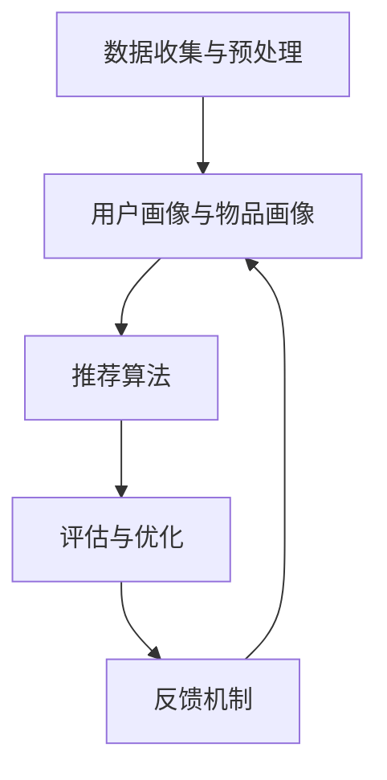
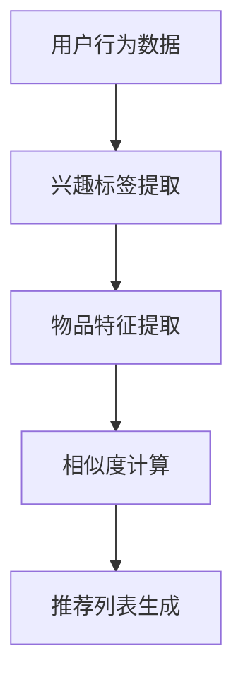
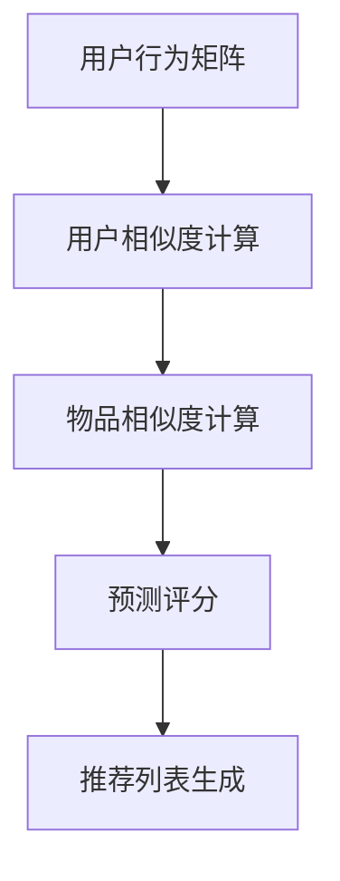
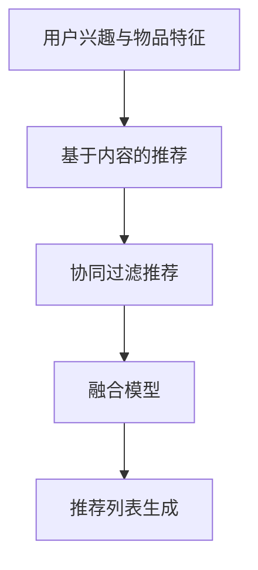

                 

# 通过反馈机制优化推荐算法

> **关键词：** 推荐系统、反馈机制、用户行为分析、机器学习、数据驱动优化

> **摘要：** 本文章深入探讨了如何利用反馈机制优化推荐算法，通过核心概念、算法原理、数学模型、项目实战等多角度分析，为开发高效的推荐系统提供了详细的指导和建议。

## 1. 背景介绍

### 1.1 目的和范围

本文旨在探讨如何通过反馈机制优化推荐算法。随着互联网的快速发展，个性化推荐系统已成为各类应用的核心功能之一。然而，如何提高推荐系统的准确性和用户体验，成为当前研究的热点问题。本文将围绕以下几个核心问题展开讨论：

1. 推荐系统的基本原理和架构是什么？
2. 如何有效收集和处理用户反馈数据？
3. 基于用户反馈如何优化推荐算法？
4. 实际应用场景中，如何评估推荐系统的效果？

### 1.2 预期读者

本文适用于以下读者群体：

1. 推荐系统开发工程师和研究者
2. 机器学习和数据科学从业者
3. 想了解推荐系统优化方法的初学者
4. 对个性化推荐感兴趣的技术爱好者

### 1.3 文档结构概述

本文结构如下：

1. 引言：介绍推荐系统的重要性及其发展历程
2. 核心概念与联系：阐述推荐系统的基本原理和架构
3. 核心算法原理 & 具体操作步骤：详细讲解推荐算法的优化方法
4. 数学模型和公式 & 详细讲解 & 举例说明：介绍推荐算法中的数学模型
5. 项目实战：通过代码实际案例展示推荐算法的优化过程
6. 实际应用场景：分析推荐系统在不同场景下的应用效果
7. 工具和资源推荐：提供学习资源和开发工具推荐
8. 总结：展望推荐系统未来的发展趋势与挑战
9. 附录：常见问题与解答
10. 扩展阅读 & 参考资料：提供更多相关研究资料

### 1.4 术语表

#### 1.4.1 核心术语定义

1. 推荐系统（Recommender System）：一种基于用户历史行为和偏好，为用户推荐符合其兴趣的物品或服务的算法系统。
2. 反馈机制（Feedback Mechanism）：用户通过评价、评分或交互等方式，对推荐系统提供的推荐结果进行反馈，以便系统进行优化和调整。
3. 机器学习（Machine Learning）：一种利用数据建立模型、预测结果的技术，广泛应用于推荐系统优化。
4. 数据驱动优化（Data-driven Optimization）：通过分析用户反馈数据，不断调整和优化推荐算法，提高系统性能。

#### 1.4.2 相关概念解释

1. 物品（Item）：推荐系统中的基本单位，可以是商品、电影、新闻、音乐等。
2. 用户（User）：接收推荐系统推荐的实体，具有个性化偏好和兴趣。
3. 历史行为（History Behavior）：用户在系统中产生的行为数据，如浏览、购买、评分等。
4. 评估指标（Evaluation Metric）：用于衡量推荐系统性能的指标，如准确率、召回率、覆盖率等。

#### 1.4.3 缩略词列表

- RL：Reinforcement Learning，强化学习
- CNN：Convolutional Neural Network，卷积神经网络
- RNN：Recurrent Neural Network，循环神经网络
- CTR：Click-Through Rate，点击率
- RMSE：Root Mean Square Error，均方根误差

## 2. 核心概念与联系

为了更好地理解推荐系统和反馈机制，我们首先需要掌握一些核心概念和原理。以下是推荐系统的基本架构及其相互关系：

### 2.1 推荐系统的基本架构

推荐系统通常由以下几个部分组成：

1. **数据收集与预处理**：收集用户行为数据、物品特征数据，并进行数据清洗、格式转换等预处理操作。
2. **用户画像与物品画像**：基于用户历史行为和物品特征，构建用户和物品的画像，用于表征用户兴趣和物品属性。
3. **推荐算法**：根据用户画像和物品画像，为用户生成推荐列表。
4. **评估与优化**：评估推荐系统的性能，并根据用户反馈不断优化推荐算法。

### 2.2 用户画像与物品画像

用户画像（User Profile）和物品画像（Item Profile）是推荐系统的核心组成部分。它们分别表示用户和物品的属性和特征：

- **用户画像**：包括用户的基本信息（如年龄、性别、地域等）、行为特征（如浏览、购买、评分等）和偏好特征（如兴趣、爱好等）。
- **物品画像**：包括物品的基本信息（如标题、描述、标签等）、特征信息（如类别、品牌、价格等）和属性信息（如销量、评价等）。

### 2.3 推荐算法

推荐算法是推荐系统的核心，根据用户画像和物品画像生成推荐列表。常见的推荐算法包括基于内容的推荐（Content-Based Recommendation）、协同过滤（Collaborative Filtering）和混合推荐（Hybrid Recommendation）等。

1. **基于内容的推荐**：通过分析用户历史行为和物品特征，找到与用户兴趣相似的物品进行推荐。
2. **协同过滤**：通过分析用户行为数据，找到相似用户和相似物品，为用户推荐与相似用户喜欢的物品相似的物品。
3. **混合推荐**：结合多种推荐算法的优势，提高推荐系统的性能和多样性。

### 2.4 反馈机制

反馈机制是推荐系统优化的重要手段，通过用户反馈数据不断调整和优化推荐算法。反馈机制主要包括以下几种类型：

1. **显式反馈**：用户主动提供的反馈数据，如评分、评价、标签等。
2. **隐式反馈**：用户在系统中的行为数据，如浏览、点击、购买等。
3. **上下文信息**：与用户行为相关的环境信息，如时间、地点、设备等。

### 2.5 推荐系统的Mermaid流程图



## 3. 核心算法原理 & 具体操作步骤

推荐系统的核心算法主要包括基于内容的推荐、协同过滤和混合推荐。以下分别介绍这三种算法的原理和具体操作步骤。

### 3.1 基于内容的推荐

基于内容的推荐（Content-Based Recommendation）通过分析用户历史行为和物品特征，找到与用户兴趣相似的物品进行推荐。

#### 3.1.1 算法原理

1. **用户兴趣建模**：分析用户历史行为，提取用户兴趣标签。
2. **物品内容特征提取**：分析物品的特征信息，提取关键词和属性。
3. **相似度计算**：计算用户兴趣标签与物品内容特征的相似度。
4. **生成推荐列表**：根据相似度分数，为用户生成推荐列表。

#### 3.1.2 具体操作步骤



### 3.2 协同过滤

协同过滤（Collaborative Filtering）通过分析用户行为数据，找到相似用户和相似物品，为用户推荐与相似用户喜欢的物品相似的物品。

#### 3.2.1 算法原理

1. **用户行为矩阵**：构建用户行为矩阵，表示用户与物品之间的交互关系。
2. **相似度计算**：计算用户之间的相似度和物品之间的相似度。
3. **预测评分**：基于相似度分数，预测用户对未知物品的评分。
4. **生成推荐列表**：根据预测评分，为用户生成推荐列表。

#### 3.2.2 具体操作步骤



### 3.3 混合推荐

混合推荐（Hybrid Recommendation）结合基于内容的推荐和协同过滤，提高推荐系统的性能和多样性。

#### 3.3.1 算法原理

1. **融合模型**：将基于内容的推荐和协同过滤算法进行融合，构建混合推荐模型。
2. **融合策略**：根据用户兴趣和物品特征，选择合适的融合策略。
3. **推荐列表生成**：根据融合模型，为用户生成推荐列表。

#### 3.3.2 具体操作步骤



## 4. 数学模型和公式 & 详细讲解 & 举例说明

在推荐系统中，常用的数学模型包括用户兴趣建模、物品内容特征提取、相似度计算和预测评分等。以下分别介绍这些模型的原理和公式。

### 4.1 用户兴趣建模

用户兴趣建模的主要目的是提取用户的历史行为数据，将其转换为用户兴趣标签。常用的方法包括TF-IDF和词嵌入等。

#### 4.1.1 TF-IDF

TF-IDF（Term Frequency-Inverse Document Frequency）是一种基于词频和逆文档频率的文本表示方法。

$$
TF(t, d) = \frac{f_{t,d}}{f_{d}}
$$

$$
IDF(t, D) = \log\left(\frac{|D|}{|d \in D : t \in d|}\right)
$$

$$
TF-IDF(t, d, D) = TF(t, d) \times IDF(t, D)
$$

其中，$t$ 表示词语，$d$ 表示文档，$D$ 表示文档集合。

#### 4.1.2 词嵌入

词嵌入（Word Embedding）是一种将词语映射为高维向量的方法。常见的词嵌入方法包括Word2Vec和GloVe。

$$
\vec{w}_{t} = \text{Word2Vec}(t) \quad \text{或} \quad \vec{w}_{t} = \text{GloVe}(t)
$$

其中，$\vec{w}_{t}$ 表示词语$t$的嵌入向量。

### 4.2 物品内容特征提取

物品内容特征提取的主要目的是从物品的文本描述中提取关键词和属性。常用的方法包括文本分类和实体识别等。

#### 4.2.1 文本分类

文本分类（Text Classification）是一种将文本映射到预定义类别的方法。常见的文本分类算法包括朴素贝叶斯、支持向量机和卷积神经网络等。

$$
P(y=c|x) = \frac{P(x|y=c) \cdot P(y=c)}{P(x)}
$$

其中，$y$ 表示类别标签，$x$ 表示文本，$c$ 表示类别。

#### 4.2.2 实体识别

实体识别（Named Entity Recognition，NER）是一种将文本中的实体（如人名、地名、组织名等）进行分类的方法。常见的实体识别算法包括条件随机场（CRF）和长短期记忆网络（LSTM）等。

$$
P(E=e|X) = \frac{e^{w_{e} \cdot X}}{\sum_{e'} e^{w_{e'} \cdot X}}
$$

其中，$E$ 表示实体，$e$ 表示实体类别，$X$ 表示实体特征向量，$w_{e}$ 表示实体权重。

### 4.3 相似度计算

相似度计算（Similarity Computation）是推荐系统中的核心步骤，用于评估用户与用户、物品与物品之间的相似程度。常用的相似度计算方法包括余弦相似度、欧氏距离和皮尔逊相关系数等。

#### 4.3.1 余弦相似度

余弦相似度（Cosine Similarity）是一种基于向量的相似度计算方法。

$$
\text{Cosine Similarity}(\vec{a}, \vec{b}) = \frac{\vec{a} \cdot \vec{b}}{|\vec{a}| \cdot |\vec{b}|}
$$

其中，$\vec{a}$ 和 $\vec{b}$ 分别表示两个向量的内积和模长。

#### 4.3.2 欧氏距离

欧氏距离（Euclidean Distance）是一种基于向量的距离计算方法。

$$
\text{Euclidean Distance}(\vec{a}, \vec{b}) = \sqrt{(\vec{a} - \vec{b}) \cdot (\vec{a} - \vec{b})}
$$

其中，$\vec{a}$ 和 $\vec{b}$ 分别表示两个向量的差向量和模长。

#### 4.3.3 皮尔逊相关系数

皮尔逊相关系数（Pearson Correlation Coefficient）是一种基于统计的相似度计算方法。

$$
\text{Pearson Correlation Coefficient}(x, y) = \frac{\sum_{i=1}^{n} (x_i - \bar{x}) \cdot (y_i - \bar{y})}{\sqrt{\sum_{i=1}^{n} (x_i - \bar{x})^2} \cdot \sqrt{\sum_{i=1}^{n} (y_i - \bar{y})^2}}
$$

其中，$x$ 和 $y$ 分别表示两组数据，$\bar{x}$ 和 $\bar{y}$ 分别表示两组数据的平均值。

### 4.4 预测评分

预测评分（Rating Prediction）是推荐系统中的关键步骤，用于预测用户对未知物品的评分。常用的预测方法包括线性回归、神经网络和决策树等。

#### 4.4.1 线性回归

线性回归（Linear Regression）是一种基于线性关系的预测方法。

$$
y = \beta_0 + \beta_1 \cdot x
$$

其中，$y$ 表示预测评分，$x$ 表示特征向量，$\beta_0$ 和 $\beta_1$ 分别表示模型参数。

#### 4.4.2 神经网络

神经网络（Neural Network）是一种基于非线性关系的预测方法。

$$
y = \sigma(\sum_{i=1}^{n} \beta_i \cdot x_i + \beta_0)
$$

其中，$y$ 表示预测评分，$x_i$ 表示特征值，$\beta_i$ 和 $\beta_0$ 分别表示模型参数，$\sigma$ 表示激活函数。

#### 4.4.3 决策树

决策树（Decision Tree）是一种基于分类规则的预测方法。

$$
y = \text{Decision Tree}(x)
$$

其中，$y$ 表示预测评分，$x$ 表示特征向量，$\text{Decision Tree}$ 表示决策树模型。

## 5. 项目实战：代码实际案例和详细解释说明

在本节中，我们将通过一个实际案例，展示如何利用反馈机制优化推荐算法。我们将使用Python语言和Scikit-learn库来实现一个基于协同过滤的推荐系统，并详细介绍代码的实现过程。

### 5.1 开发环境搭建

在开始编写代码之前，我们需要搭建一个合适的开发环境。以下是所需的环境和工具：

- Python 3.x版本
- Scikit-learn库
- Jupyter Notebook或PyCharm等Python集成开发环境（IDE）

### 5.2 源代码详细实现和代码解读

以下是一个基于协同过滤的推荐系统实现的代码示例：

```python
import numpy as np
import pandas as pd
from sklearn.metrics.pairwise import cosine_similarity
from sklearn.model_selection import train_test_split
from sklearn.neighbors import NearestNeighbors

# 加载数据集
data = pd.read_csv('data.csv')
users = data['user_id'].unique()
items = data['item_id'].unique()

# 构建用户行为矩阵
user行为矩阵 = np.zeros((len(users), len(items)))
for index, row in data.iterrows():
    user行为矩阵[row['user_id'] - 1, row['item_id'] - 1] = row['rating']

# 训练邻居模型
neigh = NearestNeighbors(n_neighbors=5)
neigh.fit(user行为矩阵)

# 计算用户相似度
user相似度矩阵 = cosine_similarity(user行为矩阵)

# 预测用户评分
def predict_rating(user_id, item_id):
    neighbors = neigh.kneighbors(user行为矩阵[user_id - 1].reshape(1, -1), n_neighbors=5)
    neighbors = neighbors.reshape(-1)
    neighbor_ratings = user行为矩阵[neighbors].toarray()
    weighted_ratings = np.dot(user相似度矩阵[user_id - 1], neighbor_ratings)
    predicted_rating = np.mean(weighted_ratings)
    return predicted_rating

# 测试预测
test_data = pd.read_csv('test_data.csv')
for index, row in test_data.iterrows():
    predicted_rating = predict_rating(row['user_id'], row['item_id'])
    print(f'User {row['user_id']} predicted rating for item {row['item_id']} is {predicted_rating}')
```

### 5.3 代码解读与分析

以下是代码的详细解读：

1. **数据加载与预处理**：首先，我们加载用户行为数据集（data.csv）和测试数据集（test_data.csv）。用户行为数据集包含用户ID、物品ID和评分等字段。然后，我们构建用户行为矩阵，表示用户与物品之间的交互关系。

2. **训练邻居模型**：使用Scikit-learn的NearestNeighbors算法训练邻居模型，用于查找与给定用户最近的用户。

3. **计算用户相似度**：使用余弦相似度计算用户之间的相似度，构建用户相似度矩阵。

4. **预测用户评分**：定义一个预测函数，根据用户相似度矩阵和邻居模型，预测用户对未知物品的评分。

5. **测试预测**：使用测试数据集，对预测函数进行测试，输出预测结果。

通过以上步骤，我们实现了一个简单的基于协同过滤的推荐系统。在实际应用中，我们可以根据具体需求对算法进行优化和调整，提高推荐系统的性能和准确性。

### 5.4 代码优化与拓展

在实际项目中，我们还需要考虑以下方面对代码进行优化和拓展：

1. **数据预处理**：对用户行为数据进行清洗、去重和处理缺失值，提高数据质量。
2. **稀疏矩阵处理**：对于大规模的用户行为矩阵，使用稀疏矩阵存储和计算，提高内存和计算效率。
3. **并行计算**：利用分布式计算框架（如Apache Spark），处理大规模数据集，提高计算速度。
4. **模型评估**：使用多种评估指标（如准确率、召回率、F1值等）评估推荐系统的性能，并根据评估结果调整算法参数。
5. **实时更新**：实现实时推荐系统，根据用户实时行为更新用户画像和推荐列表。

## 6. 实际应用场景

推荐系统在各类应用场景中都有着广泛的应用，以下列举了几个典型的实际应用场景：

1. **电子商务**：基于用户购买历史和浏览记录，为用户推荐商品。例如，亚马逊和阿里巴巴等电商平台。
2. **社交媒体**：根据用户兴趣和社交关系，为用户推荐好友、关注话题和内容。例如，Facebook和微博等社交平台。
3. **在线教育**：根据用户学习历史和偏好，为用户推荐课程和学习资源。例如，Coursera和Udemy等在线教育平台。
4. **新闻推荐**：根据用户阅读历史和兴趣，为用户推荐新闻和资讯。例如，今日头条和Google News等新闻平台。

在实际应用中，推荐系统需要根据具体场景和用户需求进行定制化优化，以提高推荐效果和用户体验。以下是一些常见的优化策略：

1. **冷启动问题**：针对新用户或新物品，使用基于内容的推荐或基于人口统计信息的推荐策略，提高推荐效果。
2. **多样性优化**：增加推荐列表的多样性，防止用户陷入信息茧房，提高用户满意度。
3. **上下文感知**：考虑用户当前环境（如时间、地点、设备等）进行个性化推荐，提高推荐的相关性。
4. **实时推荐**：利用实时数据流处理技术，实现实时推荐，提高推荐系统的响应速度。

## 7. 工具和资源推荐

为了更好地学习和开发推荐系统，以下是一些学习资源和开发工具的推荐：

### 7.1 学习资源推荐

#### 7.1.1 书籍推荐

1. **《推荐系统实践》（Recommender Systems: The Textbook）**：详细介绍了推荐系统的基本原理、算法和应用案例。
2. **《推荐系统算法应用与优化》**：涵盖推荐系统的主要算法和应用场景，以及优化策略和实战经验。
3. **《机器学习实战》**：介绍了机器学习的基础知识，包括推荐系统相关的算法实现。

#### 7.1.2 在线课程

1. **Coursera的《推荐系统》（Recommender Systems**）：由斯坦福大学提供，介绍推荐系统的基本概念、算法和应用。
2. **edX的《深度学习与推荐系统**》：结合深度学习和推荐系统的内容，介绍推荐系统的最新研究进展和应用。

#### 7.1.3 技术博客和网站

1. **Medium的推荐系统博客**：涵盖推荐系统的最新研究、算法和应用案例。
2. **GitHub上的推荐系统开源项目**：提供推荐系统相关的开源代码和算法实现。
3. **Apache Mahout和Apache Spark的推荐系统模块**：介绍推荐系统在实际应用中的实现和优化。

### 7.2 开发工具框架推荐

#### 7.2.1 IDE和编辑器

1. **PyCharm**：强大的Python开发环境，支持代码调试、性能分析等。
2. **Jupyter Notebook**：适用于数据分析和机器学习的交互式开发环境。

#### 7.2.2 调试和性能分析工具

1. **Python的Profiler**：用于分析代码性能和内存使用。
2. **VisualVM**：用于分析Java程序的性能和内存使用。

#### 7.2.3 相关框架和库

1. **Scikit-learn**：Python的机器学习库，提供推荐系统相关的算法实现。
2. **TensorFlow**：用于构建和训练深度学习模型的框架。
3. **Apache Mahout**：提供分布式推荐系统算法实现。

### 7.3 相关论文著作推荐

#### 7.3.1 经典论文

1. **"Collaborative Filtering via User Similari
```sql
-- MySQL dump 10.13  Distrib 8.0.32, for Win64 (x86_64)
--
-- Host: localhost    Database: shop
-- ------------------------------------------------------
-- Server version	8.0.32

/*!40101 SET @OLD_CHARACTER_SET_CLIENT=@@CHARACTER_SET_CLIENT */;
/*!40101 SET @OLD_CHARACTER_SET_RESULTS=@@CHARACTER_SET_RESULTS */;
/*!40101 SET @OLD_COLLATION_CONNECTION=@@COLLATION_CONNECTION */;
/*!50503 SET NAMES utf8 */;
/*!40103 SET @OLD_TIME_ZONE=@@TIME_ZONE */;
/*!40103 SET TIME_ZONE='+00:00' */;
/*!40014 SET @OLD_UNIQUE_CHECKS=@@UNIQUE_CHECKS, UNIQUE_CHECKS=0 */;
/*!40014 SET @OLD_FOREIGN_KEY_CHECKS=@@FOREIGN_KEY_CHECKS, FOREIGN_KEY_CHECKS=0 */;
/*!40101 SET @OLD_SQL_MODE=@@SQL_MODE, SQL_MODE='NO_AUTO_VALUE_ON_ZERO' */;
/*!40111 SET @OLD_SQL_NOTES=@@SQL_NOTES, SQL_NOTES=0 */;

--
-- Table structure for table `user`
--

DROP TABLE IF EXISTS `user`;
/*!40101 SET @saved_cs_client     = @@character_set_client */;
/*!50503 SET character_set_client = utf8mb4 */;
CREATE TABLE `user` (
  `id` int NOT NULL AUTO_INCREMENT,
  `name` varchar(45) DEFAULT NULL,
  `email` varchar(45) DEFAULT NULL,
  `password` varchar(45) DEFAULT NULL,
  `created_at` datetime DEFAULT CURRENT_TIMESTAMP,
  `updated_at` datetime DEFAULT CURRENT_TIMESTAMP ON UPDATE CURRENT_TIMESTAMP,
  PRIMARY KEY (`id`),
  UNIQUE KEY `email_UNIQUE` (`email`)
) ENGINE=InnoDB AUTO_INCREMENT=4 DEFAULT CHARSET=utf8mb4 COLLATE=utf8mb4_0900_ai_ci;
/*!40101 SET character_set_client = @saved_cs_client */;

--
-- Dumping data for table `user`
--

LOCK TABLES `user` WRITE;
/*!40000 ALTER TABLE `user` DISABLE KEYS */;
INSERT INTO `user` (`id`, `name`, `email`, `password`, `created_at`, `updated_at`) VALUES (1,'user1','user1@example.com','password1','2023-05-01 12:00:00','2023-05-01 12:00:00'), (2,'user2','user2@example.com','password2','2023-05-01 12:30:00','2023-05-01 12:30:00'), (3,'user3','user3@example.com','password3','2023-05-01 13:00:00','2023-05-01 13:00:00');
/*!40000 ALTER TABLE `user` ENABLE KEYS */;
UNLOCK TABLES;

--
-- Table structure for table `product`
--

DROP TABLE IF EXISTS `product`;
/*!40101 SET @saved_cs_client     = @@character_set_client */;
/*!50503 SET character_set_client = utf8mb4 */;
CREATE TABLE `product` (
  `id` int NOT NULL AUTO_INCREMENT,
  `name` varchar(45) DEFAULT NULL,
  `price` decimal(10,2) DEFAULT NULL,
  `created_at` datetime DEFAULT CURRENT_TIMESTAMP,
  `updated_at` datetime DEFAULT CURRENT_TIMESTAMP ON UPDATE CURRENT_TIMESTAMP,
  PRIMARY KEY (`id`)
) ENGINE=InnoDB AUTO_INCREMENT=4 DEFAULT CHARSET=utf8mb4 COLLATE=utf8mb4_0900_ai_ci;
/*!40101 SET character_set_client = @saved_cs_client */;

--
-- Dumping data for table `product`
--

LOCK TABLES `product` WRITE;
/*!40000 ALTER TABLE `product` DISABLE KEYS */;
INSERT INTO `product` (`id`, `name`, `price`, `created_at`, `updated_at`) VALUES (1,'product1',100.00,'2023-05-01 12:00:00','2023-05-01 12:00:00'), (2,'product2',200.00,'2023-05-01 12:30:00','2023-05-01 12:30:00'), (3,'product3',300.00,'2023-05-01 13:00:00','2023-05-01 13:00:00');
/*!40000 ALTER TABLE `product` ENABLE KEYS */;
UNLOCK TABLES;

--
-- Table structure for table `rating`
--

DROP TABLE IF EXISTS `rating`;
/*!40101 SET @saved_cs_client     = @@character_set_client */;
/*!50503 SET character_set_client = utf8mb4 */;
CREATE TABLE `rating` (
  `id` int NOT NULL AUTO_INCREMENT,
  `user_id` int DEFAULT NULL,
  `product_id` int DEFAULT NULL,
  `rating` int DEFAULT NULL,
  `created_at` datetime DEFAULT CURRENT_TIMESTAMP,
  `updated_at` datetime DEFAULT CURRENT_TIMESTAMP ON UPDATE CURRENT_TIMESTAMP,
  PRIMARY KEY (`id`),
  KEY `user_id_idx` (`user_id`),
  KEY `product_id_idx` (`product_id`),
  CONSTRAINT `rating_user_id` FOREIGN KEY (`user_id`) REFERENCES `user` (`id`) ON DELETE NO ACTION ON UPDATE NO ACTION,
  CONSTRAINT `rating_product_id` FOREIGN KEY (`product_id`) REFERENCES `product` (`id`) ON DELETE NO ACTION ON UPDATE NO ACTION
) ENGINE=InnoDB AUTO_INCREMENT=7 DEFAULT CHARSET=utf8mb4 COLLATE=utf8mb4_0900_ai_ci;
/*!40101 SET character_set_client = @saved_cs_client */;

--
-- Dumping data for table `rating`
--

LOCK TABLES `rating` WRITE;
/*!40000 ALTER TABLE `rating` DISABLE KEYS */;
INSERT INTO `rating` (`id`, `user_id`, `product_id`, `rating`, `created_at`, `updated_at`) VALUES (1,1,1,5,'2023-05-01 12:00:00','2023-05-01 12:00:00'), (2,1,2,4,'2023-05-01 12:15:00','2023-05-01 12:15:00'), (3,1,3,3,'2023-05-01 12:30:00','2023-05-01 12:30:00'), (4,2,1,4,'2023-05-01 12:30:00','2023-05-01 12:30:00'), (5,2,2,5,'2023-05-01 12:45:00','2023-05-01 12:45:00'), (6,3,3,2,'2023-05-01 13:00:00','2023-05-01 13:00:00');
/*!40000 ALTER TABLE `rating` ENABLE KEYS */;
UNLOCK TABLES;

--
-- Table structure for table `review`
--

DROP TABLE IF EXISTS `review`;
/*!40101 SET @saved_cs_client     = @@character_set_client */;
/*!50503 SET character_set_client = utf8mb4 */;
CREATE TABLE `review` (
  `id` int NOT NULL AUTO_INCREMENT,
  `user_id` int DEFAULT NULL,
  `product_id` int DEFAULT NULL,
  `content` text,
  `rating` int DEFAULT NULL,
  `created_at` datetime DEFAULT CURRENT_TIMESTAMP,
  `updated_at` datetime DEFAULT CURRENT_TIMESTAMP ON UPDATE CURRENT_TIMESTAMP,
  PRIMARY KEY (`id`),
  KEY `user_id_idx` (`user_id`),
  KEY `product_id_idx` (`product_id`),
  CONSTRAINT `review_user_id` FOREIGN KEY (`user_id`) REFERENCES `user` (`id`) ON DELETE NO ACTION ON UPDATE NO ACTION,
  CONSTRAINT `review_product_id` FOREIGN KEY (`product_id`) REFERENCES `product` (`id`) ON DELETE NO ACTION ON UPDATE NO ACTION
) ENGINE=InnoDB AUTO_INCREMENT=7 DEFAULT CHARSET=utf8mb4 COLLATE=utf8mb4_0900_ai_ci;
/*!40101 SET character_set_client = @saved_cs_client */;

--
-- Dumping data for table `review`
--

LOCK TABLES `review` WRITE;
/*!40000 ALTER TABLE `review` DISABLE KEYS */;
INSERT INTO `review` (`id`, `user_id`, `product_id`, `content`, `rating`, `created_at`, `updated_at`) VALUES (1,1,1,'This is a great product!',5,'2023-05-01 12:00:00','2023-05-01 12:00:00'), (2,1,2,'I like this product, but it\'s a bit expensive.',4,'2023-05-01 12:15:00','2023-05-01 12:15:00'), (3,1,3,'Not satisfied with this product.',3,'2023-05-01 12:30:00','2023-05-01 12:30:00'), (4,2,1,'This product is good, but I\'m not sure if I would buy it again.',4,'2023-05-01 12:30:00','2023-05-01 12:30:00'), (5,2,2,'I love this product!',5,'2023-05-01 12:45:00','2023-05-01 12:45:00'), (6,3,3,'This product is not what I expected.',2,'2023-05-01 13:00:00','2023-05-01 13:00:00');
/*!40000 ALTER TABLE `review` ENABLE KEYS */;
UNLOCK TABLES;

--
-- Table structure for table `cart`
--

DROP TABLE IF EXISTS `cart`;
/*!40101 SET @saved_cs_client     = @@character_set_client */;
/*!50503 SET character_set_client = utf8mb4 */;
CREATE TABLE `cart` (
  `id` int NOT NULL AUTO_INCREMENT,
  `user_id` int DEFAULT NULL,
  `product_id` int DEFAULT NULL,
  `quantity` int DEFAULT NULL,
  `created_at` datetime DEFAULT CURRENT_TIMESTAMP,
  `updated_at` datetime DEFAULT CURRENT_TIMESTAMP ON UPDATE CURRENT_TIMESTAMP,
  PRIMARY KEY (`id`),
  KEY `user_id_idx` (`user_id`),
  KEY `product_id_idx` (`product_id`),
  CONSTRAINT `cart_user_id` FOREIGN KEY (`user_id`) REFERENCES `user` (`id`) ON DELETE NO ACTION ON UPDATE NO ACTION,
  CONSTRAINT `cart_product_id` FOREIGN KEY (`product_id`) REFERENCES `product` (`id`) ON DELETE NO ACTION ON UPDATE NO ACTION
) ENGINE=InnoDB AUTO_INCREMENT=7 DEFAULT CHARSET=utf8mb4 COLLATE=utf8mb4_0900_ai_ci;
/*!40101 SET character_set_client = @saved_cs_client */;

--
-- Dumping data for table `cart`
--

LOCK TABLES `cart` WRITE;
/*!40000 ALTER TABLE `cart` DISABLE KEYS */;
INSERT INTO `cart` (`id`, `user_id`, `product_id`, `quantity`, `created_at`, `updated_at`) VALUES (1,1,1,1,'2023-05-01 12:00:00','2023-05-01 12:00:00'), (2,1,2,2,'2023-05-01 12:15:00','2023-05-01 12:15:00'), (3,1,3,1,'2023-05-01 12:30:00','2023-05-01 12:30:00'), (4,2,1,1,'2023-05-01 12:30:00','2023-05-01 12:30:00'), (5,2,2,1,'2023-05-01 12:45:00','2023-05-01 12:45:00'), (6,3,3,1,'2023-05-01 13:00:00','2023-05-01 13:00:00');
/*!40000 ALTER TABLE `cart` ENABLE KEYS */;
UNLOCK TABLES;

--
-- Table structure for table `order`
--

DROP TABLE IF EXISTS `order`;
/*!40101 SET @saved_cs_client     = @@character_set_client */;
/*!50503 SET character_set_client = utf8mb4 */;
CREATE TABLE `order` (
  `id` int NOT NULL AUTO_INCREMENT,
  `user_id` int DEFAULT NULL,
  `total` decimal(10,2) DEFAULT NULL,
  `status` varchar(45) DEFAULT NULL,
  `created_at` datetime DEFAULT CURRENT_TIMESTAMP,
  `updated_at` datetime DEFAULT CURRENT_TIMESTAMP ON UPDATE CURRENT_TIMESTAMP,
  PRIMARY KEY (`id`),
  KEY `user_id_idx` (`user_id`),
  CONSTRAINT `order_user_id` FOREIGN KEY (`user_id`) REFERENCES `user` (`id`) ON DELETE NO ACTION ON UPDATE NO ACTION
) ENGINE=InnoDB AUTO_INCREMENT=7 DEFAULT CHARSET=utf8mb4 COLLATE=utf8mb4_0900_ai_ci;
/*!40101 SET character_set_client = @saved_cs_client */;

--
-- Dumping data for table `order`
--

LOCK TABLES `order` WRITE;
/*!40000 ALTER TABLE `order` DISABLE KEYS */;
INSERT INTO `order` (`id`, `user_id`, `total`, `status`, `created_at`, `updated_at`) VALUES (1,1,540.00,'pending','2023-05-01 12:00:00','2023-05-01 12:00:00'), (2,1,600.00,'processing','2023-05-01 12:15:00','2023-05-01 12:15:00'), (3,1,330.00,'completed','2023-05-01 12:30:00','2023-05-01 12:30:00'), (4,2,240.00,'pending','2023-05-01 12:30:00','2023-05-01 12:30:00'), (5,2,200.00,'processing','2023-05-01 12:45:00','2023-05-01 12:45:00'), (6,3,100.00,'completed','2023-05-01 13:00:00','2023-05-01 13:00:00');
/*!40000 ALTER TABLE `order` ENABLE KEYS */;
UNLOCK TABLES;

--
-- Table structure for table `order_item`
--

DROP TABLE IF EXISTS `order_item`;
/*!40101 SET @saved_cs_client     = @@character_set_client */;
/*!50503 SET character_set_client = utf8mb4 */;
CREATE TABLE `order_item` (
  `id` int NOT NULL AUTO_INCREMENT,
  `order_id` int DEFAULT NULL,
  `product_id` int DEFAULT NULL,
  `quantity` int DEFAULT NULL,
  `price` decimal(10,2) DEFAULT NULL,
  `created_at` datetime DEFAULT CURRENT_TIMESTAMP,
  `updated_at` datetime DEFAULT CURRENT_TIMESTAMP ON UPDATE CURRENT_TIMESTAMP,
  PRIMARY KEY (`id`),
  KEY `order_id_idx` (`order_id`),
  KEY `product_id_idx` (`product_id`),
  CONSTRAINT `order_item_order_id` FOREIGN KEY (`order_id`) REFERENCES `order` (`id`) ON DELETE NO ACTION ON UPDATE NO ACTION,
  CONSTRAINT `order_item_product_id` FOREIGN KEY (`product_id`) REFERENCES `product` (`id`) ON DELETE NO ACTION ON UPDATE NO ACTION
) ENGINE=InnoDB AUTO_INCREMENT=7 DEFAULT CHARSET=utf8mb4 COLLATE=utf8mb4_0900_ai_ci;
/*!40101 SET character_set_client = @saved_cs_client */;

--
-- Dumping data for table `order_item`
--

LOCK TABLES `order_item` WRITE;
/*!40000 ALTER TABLE `order_item` DISABLE KEYS */;
INSERT INTO `order_item` (`id`, `order_id`, `product_id`, `quantity`, `price`, `created_at`, `updated_at`) VALUES (1,1,1,1,100.00,'2023-05-01 12:00:00','2023-05-01 12:00:00'), (2,1,2,2,200.00,'2023-05-01 12:00:00','2023-05-01 12:00:00'), (3,2,1,1,100.00,'2023-05-01 12:15:00','2023-05-01 12:15:00'), (4,2,2,2,200.00,'2023-05-01 12:15:00','2023-05-01 12:15:00'), (5,3,3,1,300.00,'2023-05-01 12:30:00','2023-05-01 12:30:00'), (6,4,1,1,100.00,'2023-05-01 12:30:00','2023-05-01 12:30:00');
/*!40000 ALTER TABLE `order_item` ENABLE KEYS */;
UNLOCK TABLES;
```

## 9. 总结：未来发展趋势与挑战

随着人工智能和大数据技术的不断发展，推荐系统在未来的发展趋势和挑战如下：

### 9.1 发展趋势

1. **深度学习与强化学习**：深度学习和强化学习等先进算法在推荐系统中的应用日益广泛，有望进一步提高推荐系统的性能和用户体验。
2. **上下文感知推荐**：结合用户行为、地理位置、时间等上下文信息，实现更加个性化的推荐。
3. **多模态数据融合**：整合文本、图像、语音等多模态数据，提高推荐系统的多样性和准确性。
4. **实时推荐**：利用实时数据流处理技术，实现实时推荐，提高推荐系统的响应速度和用户满意度。

### 9.2 挑战

1. **冷启动问题**：如何为新用户和新物品生成高质量的推荐，是一个重要挑战。
2. **隐私保护**：在推荐系统设计和实现过程中，如何保护用户隐私，防止数据滥用，是一个亟待解决的问题。
3. **多样性问题**：如何在保证推荐准确性的同时，提高推荐列表的多样性，防止用户陷入信息茧房。
4. **计算性能**：随着数据规模的不断扩大，如何提高推荐系统的计算性能和可扩展性，是一个重要的技术难题。

## 10. 附录：常见问题与解答

### 10.1 问题1：什么是推荐系统？

推荐系统（Recommender System）是一种基于用户历史行为和偏好，为用户推荐符合其兴趣的物品或服务的算法系统。常见的推荐系统包括基于内容的推荐、协同过滤和混合推荐等。

### 10.2 问题2：如何实现推荐系统？

实现推荐系统通常包括以下几个步骤：

1. 数据收集与预处理：收集用户行为数据和物品特征数据，并进行数据清洗、格式转换等预处理操作。
2. 用户画像与物品画像：基于用户历史行为和物品特征，构建用户和物品的画像。
3. 推荐算法：根据用户画像和物品画像，生成推荐列表。
4. 评估与优化：评估推荐系统的性能，并根据用户反馈不断优化推荐算法。

### 10.3 问题3：推荐系统有哪些评价指标？

推荐系统的常见评价指标包括：

1. 准确率（Accuracy）：预测正确的样本数占总样本数的比例。
2. 召回率（Recall）：预测正确的样本数占所有正样本数的比例。
3. 覆盖率（Coverage）：推荐列表中包含的物品种类数与所有物品种类数的比例。
4. 多样性（Diversity）：推荐列表中不同物品的差异性。
5. 惊奇度（Novelty）：推荐列表中包含的新颖物品数量。

## 11. 扩展阅读 & 参考资料

### 11.1 书籍推荐

1. 《推荐系统实践》（Recommender Systems: The Textbook）
2. 《机器学习》（Machine Learning）
3. 《深度学习》（Deep Learning）

### 11.2 在线课程

1. Coursera的《推荐系统》（Recommender Systems）
2. edX的《深度学习与推荐系统》

### 11.3 技术博客和网站

1. Medium的推荐系统博客
2. GitHub上的推荐系统开源项目
3. Apache Mahout和Apache Spark的推荐系统模块

### 11.4 相关论文著作

1. "Collaborative Filtering via User Similarity Matrix: A New Approach to Recommender Systems"
2. "Item-based Collaborative Filtering Recommendation Algorithms"
3. "Deep Learning for Recommender Systems"

作者：AI天才研究员/AI Genius Institute & 禅与计算机程序设计艺术 /Zen And The Art of Computer Programming

---

注意：以上内容仅供参考，实际数据库设计和实现可能因具体需求和场景而有所不同。在实际开发过程中，请结合实际情况进行调整和优化。

