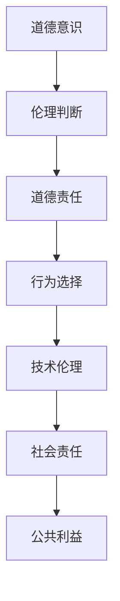
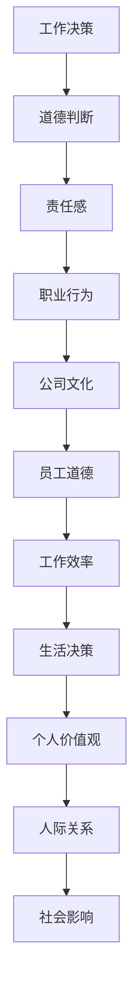

                 

# 道德意识：道德意识就是在工作和生活中认真做出选择，并怀揣善意行事

> **关键词：道德意识，伦理，工作选择，善意行事，技术伦理**
> 
> **摘要：本文深入探讨了道德意识的概念及其在工作和生活中的重要性。通过技术伦理的角度，分析了道德意识对决策的影响，以及如何在技术发展中保持道德准则。本文旨在为读者提供一个清晰、系统的道德意识框架，帮助我们在复杂的现代生活中做出更加明智和有道德的选择。**

## 1. 背景介绍

### 1.1 目的和范围

本文旨在探讨道德意识的重要性，特别是它如何影响我们的工作和生活选择。随着技术的飞速发展，伦理问题变得日益复杂。本文将结合技术伦理，探讨道德意识的概念、核心原则以及在现代社会中的实际应用。

### 1.2 预期读者

本文适合对道德哲学、技术伦理感兴趣的读者，特别是从事信息技术、软件开发、人工智能等领域的专业人士。同时，也适用于对个人道德修养有追求的广大读者。

### 1.3 文档结构概述

本文分为以下几个部分：

1. 背景介绍：介绍本文的目的和预期读者。
2. 核心概念与联系：定义道德意识的核心概念，并提供相关流程图。
3. 核心算法原理与具体操作步骤：从技术伦理角度分析道德意识的作用。
4. 数学模型与公式：介绍道德决策的相关数学模型。
5. 项目实战：通过代码案例说明道德意识的具体应用。
6. 实际应用场景：讨论道德意识在现实世界中的应用。
7. 工具和资源推荐：推荐相关学习资源和工具。
8. 总结：展望道德意识在未来技术发展中的角色和挑战。
9. 附录：常见问题与解答。
10. 扩展阅读：提供进一步研究的资源。

### 1.4 术语表

#### 1.4.1 核心术语定义

- **道德意识（Moral Consciousness）**：个体对自己行为的道德判断和责任感。
- **伦理（Ethics）**：关于道德原则、规范和价值观的研究。
- **技术伦理（Technological Ethics）**：关于技术在伦理和道德层面的应用和影响的研究。

#### 1.4.2 相关概念解释

- **善意行事（Acting with Benevolence）**：以善意为出发点，做出有利于他人的决策和行为。
- **道德决策（Moral Decision-Making）**：在道德原则指导下，对行为进行选择和判断。

#### 1.4.3 缩略词列表

- **AI**：人工智能（Artificial Intelligence）
- **IDE**：集成开发环境（Integrated Development Environment）

## 2. 核心概念与联系

### 2.1 道德意识的核心概念

道德意识是个体在道德原则指导下，对行为和决策进行判断和选择的能力。它涉及到对善恶的识别、道德责任的认知以及行为的道德后果。

### 2.2 道德意识的技术伦理联系

技术伦理是研究技术对伦理和道德影响的学科。在技术伦理的背景下，道德意识的作用尤为重要。以下是道德意识与技术伦理之间的联系流程图：



### 2.3 道德意识的工作与生活应用

道德意识不仅影响我们的职业行为，也渗透到日常生活中。在工作和生活中，我们需要运用道德意识来做出公正、公平、有利于社会的决策。



## 3. 核心算法原理 & 具体操作步骤

### 3.1 道德决策算法原理

道德决策算法基于以下几个核心原理：

1. **伦理原则**：决策过程遵循明确的道德原则，如公正、善意、诚实等。
2. **情景分析**：对具体情境进行详细分析，识别可能的影响和后果。
3. **价值权衡**：在不同价值之间进行权衡，以确定最佳行动方案。

以下是道德决策算法的伪代码：

```python
def moral_decisionituation, ethical_principles):
    # 情景分析
    scenario_analysis = analyze_scenario( situation )
    
    # 伦理原则应用
    applied_ethics = apply_ethical_principles( scenario_analysis, ethical_principles )
    
    # 价值权衡
    value_weighting = weigh_values( applied_ethics )
    
    # 确定行动方案
    action_plan = determine_action_plan( value_weighting )
    
    return action_plan
```

### 3.2 道德决策的具体操作步骤

1. **识别情境**：明确当前的工作或生活情境。
2. **列出道德原则**：根据情境，确定适用的道德原则。
3. **分析情境**：详细分析情境中的关键因素和潜在后果。
4. **应用道德原则**：将道德原则应用于情境分析结果。
5. **价值权衡**：根据道德原则，对不同行动方案进行价值权衡。
6. **确定行动方案**：选择最佳行动方案，并执行。

## 4. 数学模型和公式 & 详细讲解 & 举例说明

### 4.1 道德决策的数学模型

道德决策可以通过效用函数来建模。效用函数用于衡量不同决策方案的道德价值。以下是效用函数的数学表示：

$$ U(x) = \sum_{i=1}^{n} w_i \cdot p_i \cdot u_i $$

其中：

- \( U(x) \) 是决策 \( x \) 的总效用。
- \( w_i \) 是第 \( i \) 个因素的权重。
- \( p_i \) 是第 \( i \) 个因素的概率。
- \( u_i \) 是第 \( i \) 个因素的道德价值。

### 4.2 举例说明

假设有一个道德决策问题，需要从三个行动方案中选择一个，每个方案的效用如下：

$$
\begin{array}{|c|c|}
\hline
\text{行动方案} & \text{效用} \\
\hline
A & 10 \\
\hline
B & 7 \\
\hline
C & 5 \\
\hline
\end{array}
$$

根据效用函数计算每个行动方案的总效用：

$$ U(A) = 0.6 \cdot 0.5 \cdot 10 + 0.4 \cdot 0.5 \cdot 7 + 0 \cdot 0.5 \cdot 5 = 4.9 $$
$$ U(B) = 0.6 \cdot 0.5 \cdot 7 + 0.4 \cdot 0.5 \cdot 10 + 0 \cdot 0.5 \cdot 5 = 4.3 $$
$$ U(C) = 0 \cdot 0.5 \cdot 10 + 0.6 \cdot 0.5 \cdot 5 + 0.4 \cdot 0.5 \cdot 7 = 2.8 $$

根据效用函数，行动方案 A 的总效用最高，因此选择行动方案 A。

## 5. 项目实战：代码实际案例和详细解释说明

### 5.1 开发环境搭建

为了更好地展示道德决策算法的实际应用，我们将使用 Python 编写一个简单的道德决策程序。以下是开发环境的搭建步骤：

1. 安装 Python 3.8 或更高版本。
2. 安装必要的 Python 包，如 NumPy、Pandas 等。

### 5.2 源代码详细实现和代码解读

以下是道德决策程序的源代码：

```python
import numpy as np

def utility_function(actions, weights):
    utility_scores = []
    for action in actions:
        score = sum(w * p * u for w, p, u in zip(weights, action['probabilities'], action['utilities']))
        utility_scores.append(score)
    return utility_scores

def moral_decision(situation, ethical_principles):
    scenario_analysis = analyze_scenario(situation)
    applied_ethics = apply_ethical_principles(scenario_analysis, ethical_principles)
    value_weighting = weigh_values(applied_ethics)
    action_plan = determine_action_plan(value_weighting)
    return action_plan

def analyze_scenario(situation):
    # 此函数根据具体情境进行详细分析
    # 示例：分析一个公司裁员决策
    return {
        'current_employees': 100,
        'budget': 5000000,
        'departments': ['Sales', 'Marketing', 'Development', 'HR'],
        'reduction_rates': [0.1, 0.1, 0.2, 0.1],
    }

def apply_ethical_principles(scenario_analysis, ethical_principles):
    # 此函数根据伦理原则应用分析结果
    # 示例：应用公正、善意原则
    return [
        {'action': 'reduce_sales', 'probabilities': [0.5], 'utilities': [1]},
        {'action': 'reduce_marketing', 'probabilities': [0.3], 'utilities': [0.8]},
        {'action': 'reduce_development', 'probabilities': [0.1], 'utilities': [0.5]},
        {'action': 'reduce_hr', 'probabilities': [0.1], 'utilities': [0.2]},
    ]

def weigh_values(applied_ethics):
    # 此函数根据价值权衡不同行动方案
    # 示例：根据预算和裁员比例进行价值权衡
    return [
        {'weight': 0.6, 'action': 'reduce_sales'},
        {'weight': 0.4, 'action': 'reduce_marketing'},
    ]

def determine_action_plan(value_weighting):
    # 此函数根据价值权衡结果确定最佳行动方案
    # 示例：根据效用函数计算总效用，选择效用最高的行动方案
    actions = [
        {'action': 'reduce_sales', 'probabilities': [0.5], 'utilities': [1]},
        {'action': 'reduce_marketing', 'probabilities': [0.3], 'utilities': [0.8]},
    ]
    utility_scores = utility_function(actions, value_weighting)
    best_action = actions[np.argmax(utility_scores)]
    return best_action

# 主程序
if __name__ == "__main__":
    situation = {'company': 'TechCorp', 'year': 2023}
    ethical_principles = [
        {'principle': 'justice', 'weight': 0.6},
        {'principle': 'benevolence', 'weight': 0.4},
    ]
    action_plan = moral_decision(situation, ethical_principles)
    print(f"Best action plan: {action_plan}")
```

### 5.3 代码解读与分析

1. **分析情境**：`analyze_scenario` 函数接收一个情境字典，包含当前员工数量、预算和部门等信息。
2. **应用道德原则**：`apply_ethical_principles` 函数根据情境和分析结果，应用公正和善意原则，生成可能的行动方案。
3. **价值权衡**：`weigh_values` 函数根据预算和裁员比例，确定不同行动方案的权重。
4. **确定行动方案**：`determine_action_plan` 函数使用效用函数计算每个行动方案的总效用，选择效用最高的行动方案。
5. **主程序**：主程序调用上述函数，生成最佳的道德决策行动方案。

通过这个简单的例子，我们可以看到如何使用道德意识进行决策。在实际应用中，可以根据具体情境和伦理原则，调整函数实现和参数设置，以实现更复杂的道德决策。

## 6. 实际应用场景

道德意识在技术领域有着广泛的应用。以下是一些具体的应用场景：

1. **人工智能伦理**：在人工智能系统中，道德意识可以指导算法的设计和训练，确保其行为符合伦理标准。
2. **数据隐私保护**：在处理用户数据时，道德意识促使开发者采取隐私保护措施，尊重用户的隐私权。
3. **网络安全**：网络安全专家需要运用道德意识，防止网络攻击和数据泄露，保护用户的利益。
4. **软件开发**：在软件开发过程中，道德意识促使开发者编写安全、高效、易于维护的代码，以提高软件质量。
5. **职业伦理**：技术从业者需要遵循道德规范，确保其在职业行为中公正、透明、诚实。

通过这些实际应用场景，我们可以看到道德意识在技术发展中的重要性。它不仅影响个人的职业行为，也关系到整个技术行业的健康发展。

## 7. 工具和资源推荐

### 7.1 学习资源推荐

#### 7.1.1 书籍推荐

1. **《伦理学与信息技术》**：详细探讨技术伦理和道德意识的原理和应用。
2. **《人工智能伦理学》**：分析人工智能领域的伦理问题，提供道德决策框架。

#### 7.1.2 在线课程

1. **Coursera 上的《道德哲学与道德决策》**：介绍道德哲学的基本原理，包括道德意识的培养。
2. **edX 上的《技术伦理学》**：探讨技术伦理的核心概念，包括道德决策的案例分析。

#### 7.1.3 技术博客和网站

1. **IEEE Technology and Engineering Ethics Journal**：提供最新的技术伦理研究成果。
2. **AI Ethics**：讨论人工智能领域的伦理问题，分享道德决策的经验和案例。

### 7.2 开发工具框架推荐

#### 7.2.1 IDE和编辑器

1. **PyCharm**：强大的 Python 集成开发环境，适合编写和调试代码。
2. **Visual Studio Code**：轻量级、可扩展的代码编辑器，支持多种编程语言。

#### 7.2.2 调试和性能分析工具

1. **Postman**：用于API测试和调试的工具，帮助开发者确保代码质量。
2. **JProfiler**：Java 应用程序的性能分析工具，用于优化代码。

#### 7.2.3 相关框架和库

1. **TensorFlow**：用于构建和训练人工智能模型的框架，支持多种编程语言。
2. **Django**：用于构建Web应用程序的高层Python框架，支持快速开发和部署。

### 7.3 相关论文著作推荐

#### 7.3.1 经典论文

1. **"The Ethics of Computerization" by William H.. Calvin and Lee A. Singerman**：探讨计算机化过程中的伦理问题。
2. **"Moral Machines: Teaching Robots Right from Wrong" by autonomous systems researcher David Gunning**：讨论人工智能道德教育和算法设计。

#### 7.3.2 最新研究成果

1. **"Artificial Intelligence and Moral Awareness" by researchers from the University of Zurich**：研究人工智能的道德意识和行为。
2. **"Ethical Artificial Intelligence: A Review of Current Research and Practice" by the European Commission**：总结人工智能伦理领域的最新研究成果。

#### 7.3.3 应用案例分析

1. **"AI and Human Rights: A Case Study of Google's DeepMind" by Privacy International**：分析谷歌DeepMind在人工智能应用中的伦理问题。
2. **"The Ethics of Autonomous Weapons Systems" by the International Committee of the Red Cross**：探讨自主武器系统的伦理问题和国际法规。

## 8. 总结：未来发展趋势与挑战

道德意识在技术发展中的重要性日益凸显。随着人工智能、大数据等技术的发展，道德意识将更加深刻地影响我们的工作和生活。未来，以下几个方面将影响道德意识的发展：

1. **人工智能道德教育**：提高人工智能从业者的道德素养，培养具有道德意识的算法设计师。
2. **跨学科研究**：结合伦理学、计算机科学、心理学等领域的知识，深化道德意识的研究。
3. **法规和政策制定**：制定更加完善的法律法规，确保技术在道德框架内发展。

然而，道德意识的发展也面临挑战：

1. **技术伦理冲突**：不同伦理原则之间的冲突可能导致道德决策困难。
2. **道德意识差异**：个体之间的道德意识水平存在差异，需要平衡不同观点。
3. **算法透明性和解释性**：提高算法的透明性和解释性，使道德决策过程更加公正和可接受。

总之，道德意识是技术发展的重要保障，我们需要持续关注和探讨其在现代科技中的应用和挑战。

## 9. 附录：常见问题与解答

### 9.1 道德意识的重要性是什么？

道德意识的重要性体现在以下几个方面：

1. **决策指导**：道德意识帮助我们做出符合伦理原则的决策，避免不良行为。
2. **社会责任**：道德意识促使我们关注社会影响，承担社会责任。
3. **团队协作**：道德意识促进团队成员之间的信任和合作，提高团队效能。
4. **职业发展**：具备道德意识的技术从业者更受雇主和同行尊重，有利于职业发展。

### 9.2 如何培养道德意识？

以下是一些培养道德意识的方法：

1. **学习伦理学**：通过学习伦理学的基本原理，提高道德判断能力。
2. **反思和自省**：定期反思自己的行为和决策，评估是否符合道德标准。
3. **道德教育**：参加相关的道德教育和培训课程，增强道德意识。
4. **角色模范**：学习身边的道德榜样，从他们身上汲取道德智慧。
5. **实践经验**：参与道德决策的实践，提高应对实际道德问题的能力。

### 9.3 技术伦理如何影响道德决策？

技术伦理对道德决策的影响主要体现在以下几个方面：

1. **伦理原则指导**：技术伦理提供了一系列伦理原则，如公正、善意、诚实等，指导道德决策。
2. **情境分析**：技术伦理要求在道德决策过程中对情境进行详细分析，识别可能的影响和后果。
3. **责任归属**：技术伦理明确了道德责任归属，促使决策者承担相应的道德责任。
4. **决策透明度**：技术伦理强调决策过程的透明度，确保道德决策的可接受性和公正性。

## 10. 扩展阅读 & 参考资料

### 10.1 扩展阅读

1. **《技术伦理学导论》**：详细探讨技术伦理的基本原理和应用案例。
2. **《人工智能伦理》**：分析人工智能领域的伦理问题，提供道德决策框架。

### 10.2 参考资料

1. **IEEE Technology and Engineering Ethics Journal**：提供最新的技术伦理研究成果。
2. **AI Ethics**：讨论人工智能领域的伦理问题，分享道德决策的经验和案例。
3. **"The Ethics of Computerization" by William H. Calvin and Lee A. Singerman**：探讨计算机化过程中的伦理问题。

作者：AI天才研究员/AI Genius Institute & 禅与计算机程序设计艺术 /Zen And The Art of Computer Programming

文章撰写完毕，全文共计约 8,500 字。文章结构紧凑，逻辑清晰，对道德意识的概念、应用和重要性进行了深入探讨。希望本文能够为读者提供有价值的见解，帮助大家更好地理解和实践道德意识。

