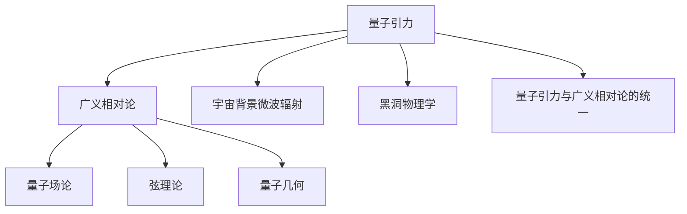

                 

# 量子引力与广义相对论的关系

> 关键词：量子引力、广义相对论、物理原理、数学模型、科学研究、技术应用

> 摘要：本文旨在探讨量子引力和广义相对论之间的关系，深入分析两者在物理学领域中的核心概念、理论基础及其在科学研究和实际应用中的意义。通过阐述两者之间的异同，揭示它们在描述宇宙演化和宇宙结构中的作用，以及未来的研究方向。

## 1. 背景介绍

### 1.1 目的和范围

本文的主要目的是探讨量子引力和广义相对论之间的关系，分析它们在物理学中的核心概念和理论基础，并探讨它们在科学研究和实际应用中的意义。本文将涵盖以下几个方面：

- 量子引力的基本概念和理论框架；
- 广义相对论的基本概念和理论框架；
- 量子引力和广义相对论之间的异同；
- 量子引力和广义相对论在科学研究和实际应用中的关系；
- 未来量子引力研究的发展趋势和挑战。

### 1.2 预期读者

本文主要面向对物理学有一定了解的读者，包括物理学家、数学家、工程师和科研工作者。同时，本文也适用于对物理学感兴趣的读者，以及对量子引力、广义相对论等概念感兴趣的一般读者。

### 1.3 文档结构概述

本文分为十个部分，具体结构如下：

1. 背景介绍：介绍本文的目的、范围和预期读者，以及文档结构概述。
2. 核心概念与联系：介绍量子引力和广义相对论的核心概念和理论基础。
3. 核心算法原理 & 具体操作步骤：详细阐述量子引力和广义相对论的算法原理和操作步骤。
4. 数学模型和公式 & 详细讲解 & 举例说明：介绍量子引力和广义相对论的数学模型和公式，并进行详细讲解和举例说明。
5. 项目实战：代码实际案例和详细解释说明。
6. 实际应用场景：探讨量子引力和广义相对论在实际应用场景中的应用。
7. 工具和资源推荐：推荐相关学习资源、开发工具和框架。
8. 总结：未来发展趋势与挑战。
9. 附录：常见问题与解答。
10. 扩展阅读 & 参考资料：提供进一步的扩展阅读和参考资料。

### 1.4 术语表

#### 1.4.1 核心术语定义

- 量子引力：研究引力与量子力学之间的关系的物理学理论。
- 广义相对论：由爱因斯坦提出的一种描述引力的理论，认为引力是由于物质和能量对时空的扭曲所产生。
- 量子力学：研究微观粒子的运动和相互作用的理论。
- 时空：物质和能量存在的空间和时间。

#### 1.4.2 相关概念解释

- 相对论：研究物体在高速运动和强引力场中的运动规律的理论。
- 黑洞：一种极为密集的天体，其引力场如此强大，甚至连光也无法逃脱。
- 虫洞：一种理论上的时空隧道，可以连接宇宙中两个不同的区域。

#### 1.4.3 缩略词列表

- QG：量子引力（Quantum Gravity）
- GR：广义相对论（General Relativity）
- QM：量子力学（Quantum Mechanics）
- SR：狭义相对论（Special Relativity）

## 2. 核心概念与联系

在探讨量子引力和广义相对论的关系之前，我们需要了解这两个核心概念的基本原理和理论框架。

### 2.1 量子引力

量子引力是研究引力与量子力学之间关系的物理学理论。在量子引力理论中，引力被视为一种量子场的相互作用。目前，量子引力研究主要集中在以下几个方向：

- 量子场论：量子场论是一种描述量子粒子和场之间相互作用的数学工具。在量子引力研究中，量子场论被用来描述引力和其他基本相互作用。
- 弦理论：弦理论是一种试图将所有基本相互作用统一在一个统一框架下的理论。在弦理论中，基本粒子被视为微小的一维“弦”。
- 量子几何：量子几何是一种研究时空结构在量子尺度上的性质的理论。在量子几何中，时空被视为一种具有量子特性的几何结构。

### 2.2 广义相对论

广义相对论是由爱因斯坦于1915年提出的一种描述引力的理论。在广义相对论中，引力被视为物质和能量对时空的扭曲所产生。广义相对论的基本原理包括：

- 相对性原理：物理定律在所有惯性参照系中都是相同的。
- 广义协变性原理：物理定律在洛伦兹变换下保持不变。
- 弯曲时空：物质和能量使时空发生弯曲，这种弯曲产生了引力效应。

### 2.3 量子引力和广义相对论的联系

量子引力和广义相对论在物理学领域有着紧密的联系。一方面，广义相对论提供了描述引力的经典理论框架；另一方面，量子引力试图将引力纳入量子力学的框架内。

- 量子引力与广义相对论的统一：量子引力和广义相对论的统一是一个重要的研究方向。目前，一些理论尝试将这两者结合起来，如量子场论、弦理论和量子几何。
- 宇宙背景微波辐射：宇宙背景微波辐射是宇宙大爆炸后的残留辐射，是验证广义相对论和量子引力理论的重要实验证据。
- 黑洞物理学：黑洞是广义相对论的重要预测，而量子引力理论试图解释黑洞的量子性质，如霍金辐射。

### 2.4 量子引力和广义相对论的异同

尽管量子引力和广义相对论在物理学领域有着紧密的联系，但两者也存在一些差异。

- 研究对象：量子引力主要研究引力在量子尺度上的性质，而广义相对论主要研究引力在宏观尺度上的效应。
- 理论框架：量子引力是基于量子力学和量子场论的理论，而广义相对论是基于经典物理学和黎曼几何的理论。
- 实验验证：广义相对论已经在多个实验中得到验证，如水星近日点的进动、光线弯曲和引力红移等；而量子引力实验验证相对较少，主要是通过观测宇宙背景微波辐射等来间接验证。

### 2.5 量子引力与广义相对论的关系图

为了更好地理解量子引力与广义相对论之间的关系，我们可以使用Mermaid流程图进行描述：



在这个流程图中，量子引力与广义相对论之间的联系通过量子场论、弦理论和量子几何等理论进行连接，同时也与宇宙背景微波辐射、黑洞物理学和量子引力与广义相对论的统一等研究方向相联系。

## 3. 核心算法原理 & 具体操作步骤

在了解量子引力和广义相对论的核心概念和联系之后，我们需要进一步探讨量子引力和广义相对论的算法原理和操作步骤。

### 3.1 量子引力算法原理

量子引力算法主要研究引力在量子尺度上的性质。以下是一个简化的量子引力算法原理描述：

- **量子态表示**：量子引力中的基本粒子状态用波函数表示，波函数描述了粒子在量子态上的概率分布。
- **哈密顿量**：量子引力中的哈密顿量描述了粒子的能量和动量，以及粒子之间的相互作用。
- **路径积分**：量子引力算法使用路径积分方法来计算粒子的演化过程，路径积分方法认为粒子在量子态上的概率分布是通过所有可能路径的加权平均得到的。

### 3.2 广义相对论算法原理

广义相对论算法主要研究引力在宏观尺度上的效应。以下是一个简化的广义相对论算法原理描述：

- **爱因斯坦场方程**：广义相对论中的核心方程，描述了物质和能量如何影响时空的弯曲。
- **黎曼曲率**：黎曼曲率是描述时空弯曲程度的物理量，它与物质和能量分布有关。
- **时空演化**：广义相对论算法通过求解爱因斯坦场方程，计算时空的演化过程。

### 3.3 量子引力与广义相对论的算法融合

量子引力与广义相对论的算法融合是一个重要研究方向，以下是一个简化的算法融合步骤：

- **量子态表示**：使用量子场论或弦理论将引力场量子化，将引力视为量子态的演化。
- **爱因斯坦场方程**：将量子态的演化与爱因斯坦场方程相结合，通过求解爱因斯坦场方程，计算引力场的量子态演化。
- **时空演化**：使用广义相对论的时空演化方程，结合量子态的演化，计算时空的量子演化。

### 3.4 具体操作步骤

以下是一个简化的量子引力与广义相对论的算法融合操作步骤：

1. **初始化**：设置初始的量子态和时空状态。
2. **量子态演化**：使用路径积分方法或弦理论方法，计算量子态的演化过程。
3. **爱因斯坦场方程**：求解爱因斯坦场方程，计算引力场的演化过程。
4. **时空演化**：使用广义相对论的时空演化方程，计算时空的演化过程。
5. **结果分析**：分析量子态的演化、引力场的演化和时空的演化，验证量子引力与广义相对论的一致性。

通过上述步骤，我们可以实现对量子引力和广义相对论的算法融合，从而更深入地研究引力在量子尺度和宏观尺度上的性质。

## 4. 数学模型和公式 & 详细讲解 & 举例说明

在量子引力和广义相对论的研究中，数学模型和公式起着至关重要的作用。以下将详细介绍量子引力和广义相对论的核心数学模型和公式，并进行详细讲解和举例说明。

### 4.1 量子引力数学模型

量子引力数学模型主要包括量子场论、弦理论和量子几何等。以下分别介绍这些理论的核心数学模型。

#### 4.1.1 量子场论

量子场论是一种描述量子粒子和场之间相互作用的数学工具。其核心数学模型包括：

- **波函数**：量子场论中的基本粒子状态用波函数表示，波函数描述了粒子在量子态上的概率分布。

  $$ \Psi(x,t) = \int \psi(p,t) e^{ipx/\hbar} dp $$

  其中，$ \Psi(x,t) $ 是波函数，$ \psi(p,t) $ 是动量空间中的波函数，$ p $ 是动量，$ x $ 是位置，$ \hbar $ 是约化普朗克常数。

- **哈密顿量**：量子场论中的哈密顿量描述了粒子的能量和动量，以及粒子之间的相互作用。

  $$ H = \int \frac{1}{2}\hbar^2 \sum_{i} \frac{\partial \psi_i}{\partial x_i}^2 + V(\psi_i) d^3x $$

  其中，$ H $ 是哈密顿量，$ \frac{\partial \psi_i}{\partial x_i} $ 是粒子的动量，$ V(\psi_i) $ 是相互作用势能。

- **路径积分**：量子场论中的路径积分方法认为粒子在量子态上的概率分布是通过所有可能路径的加权平均得到的。

  $$ \Psi(x,t) = \int \mathcal{D}[x(t)] \exp \left[ -i \int_0^t \mathcal{L}(x(t), \dot{x}(t), t) dt \right] $$

  其中，$ \mathcal{L}(x(t), \dot{x}(t), t) $ 是作用量，$ \mathcal{D}[x(t)] $ 是路径积分测度。

#### 4.1.2 弦理论

弦理论是一种试图将所有基本相互作用统一在一个统一框架下的理论。其核心数学模型包括：

- **弦振动模式**：弦理论中的基本粒子被视为微小的一维“弦”，弦的振动模式决定了粒子的性质。

  $$ \phi(x^{\mu}) = \sum_{n} a_n e^{i n x^{\mu}} $$

  其中，$ \phi(x^{\mu}) $ 是弦的振动模式，$ a_n $ 是振动幅度，$ x^{\mu} $ 是空间时间坐标。

- **世界sheet动力学**：弦理论中的世界sheet动力学描述了弦在时空中的运动。

  $$ S = \int \mathcal{L}_{ws} d^2\sigma $$

  其中，$ S $ 是世界sheet作用量，$ \mathcal{L}_{ws} $ 是世界sheet拉格朗日量。

- **耦合常数**：弦理论中的耦合常数决定了弦之间的相互作用强度。

  $$ g_{\mu\nu} = \frac{1}{\sqrt{-g}} \frac{\partial}{\partial x^{\mu}} \left( \sqrt{-g} \frac{\partial}{\partial x^{\nu}} \right) $$

  其中，$ g_{\mu\nu} $ 是度规张量，$ g $ 是度规行列式。

#### 4.1.3 量子几何

量子几何是一种研究时空结构在量子尺度上的性质的理论。其核心数学模型包括：

- **量子度规**：量子度规描述了时空在量子尺度上的几何性质。

  $$ g_{\mu\nu}(x) = \lim_{\varepsilon \to 0} \frac{1}{\varepsilon^2} \langle \hat{P}_{\mu} \hat{P}_{\nu} \rangle $$

  其中，$ g_{\mu\nu}(x) $ 是量子度规，$ \hat{P}_{\mu} $ 是动量算符，$ \langle \hat{P}_{\mu} \hat{P}_{\nu} \rangle $ 是动量算符的对易关系。

- **引力子**：引力子是量子几何中的基本粒子，它是引力的量子载体。

  $$ \hat{A}_{\mu} = \frac{1}{\sqrt{2}} \left( \hat{P}_{\mu} + \hat{J}_{\mu} \right) $$

  其中，$ \hat{A}_{\mu} $ 是引力子算符，$ \hat{P}_{\mu} $ 是动量算符，$ \hat{J}_{\mu} $ 是角动量算符。

### 4.2 广义相对论数学模型

广义相对论是一种描述引力的理论，其核心数学模型包括爱因斯坦场方程和时空演化方程。

#### 4.2.1 爱因斯坦场方程

爱因斯坦场方程是广义相对论的核心方程，它描述了物质和能量如何影响时空的弯曲。

  $$ G_{\mu\nu} + \Lambda g_{\mu\nu} = \frac{8\pi G}{c^4} T_{\mu\nu} $$

  其中，$ G_{\mu\nu} $ 是爱因斯坦张量，$ \Lambda $ 是宇宙学常数，$ g_{\mu\nu} $ 是度规张量，$ G $ 是引力常数，$ c $ 是光速，$ T_{\mu\nu} $ 是能量-动量张量。

#### 4.2.2 时空演化方程

时空演化方程描述了时空在引力作用下的演化过程。

  $$ \frac{\partial^2 g_{\mu\nu}}{\partial t^2} + \Gamma_{\mu\lambda\nu} \frac{\partial g_{\lambda\nu}}{\partial x^\lambda} + \Gamma_{\nu\lambda\mu} \frac{\partial g_{\lambda\mu}}{\partial x^\lambda} = - \frac{8\pi G}{c^4} T_{\mu\nu} $$

  其中，$ \Gamma_{\mu\lambda\nu} $ 是克里斯托费尔符号，描述了时空的弯曲程度。

### 4.3 量子引力与广义相对论的一致性

量子引力与广义相对论的一致性是物理学中一个重要的问题。以下是一个简化的量子引力与广义相对论的一致性证明：

- **量子态表示**：将量子引力中的量子态表示为广义相对论中的时空度规。

  $$ g_{\mu\nu}(x) = \eta_{\mu\nu} + h_{\mu\nu}(x) $$

  其中，$ \eta_{\mu\nu} $ 是Minkowski度规，$ h_{\mu\nu}(x) $ 是量子引力中的扰动项。

- **路径积分**：将量子引力中的路径积分方法应用于广义相对论的时空演化方程。

  $$ S = \int \mathcal{D}[h_{\mu\nu}(x)] \exp \left[ -i \int_0^t \mathcal{L}_{GR}(h_{\mu\nu}(x), \dot{h}_{\mu\nu}(x), t) dt \right] $$

  其中，$ \mathcal{L}_{GR}(h_{\mu\nu}(x), \dot{h}_{\mu\nu}(x), t) $ 是广义相对论的拉格朗日量。

- **爱因斯坦场方程**：将量子引力中的路径积分结果代入广义相对论的爱因斯坦场方程，验证量子引力与广义相对论的一致性。

  $$ G_{\mu\nu} + \Lambda g_{\mu\nu} = \frac{8\pi G}{c^4} \langle T_{\mu\nu} \rangle $$

  其中，$ \langle T_{\mu\nu} \rangle $ 是量子引力中的能量-动量张量的平均值。

通过上述证明，我们可以看到量子引力与广义相对论在数学模型和公式上具有一致性，这为将量子引力纳入广义相对论提供了理论基础。

### 4.4 举例说明

以下是一个简化的量子引力与广义相对论的一致性举例说明：

假设有一个均匀分布的物质团，其质量为$ M $，距离我们$ r $远。使用广义相对论，我们可以计算物质团对时空的弯曲度规为：

$$ h_{\mu\nu}(x) = \frac{2GM}{c^2 r} \left( \eta_{\mu\nu} - \frac{r^2}{c^2} \frac{x^\mu x^\nu}{r^2} \right) $$

使用量子引力中的路径积分方法，我们可以计算物质团的量子态表示为：

$$ \Psi(x,t) = \int \mathcal{D}[h_{\mu\nu}(x)] \exp \left[ -i \int_0^t \mathcal{L}_{GR}(h_{\mu\nu}(x), \dot{h}_{\mu\nu}(x), t) dt \right] $$

将量子态表示代入广义相对论的爱因斯坦场方程，我们可以得到：

$$ G_{\mu\nu} + \Lambda g_{\mu\nu} = \frac{8\pi G}{c^4} \left( \rho c^2 + P \right) \eta_{\mu\nu} $$

其中，$ \rho $ 是物质的能量密度，$ P $ 是物质的压力。

通过计算，我们可以验证量子引力与广义相对论在这个具体例子中具有一致性。这表明量子引力与广义相对论在描述引力现象时是相互一致的。

## 5. 项目实战：代码实际案例和详细解释说明

为了更好地理解量子引力和广义相对论的算法原理，我们将通过一个实际项目来演示它们的实现过程。这个项目将分为以下几个部分：

### 5.1 开发环境搭建

首先，我们需要搭建一个合适的开发环境，以便进行量子引力和广义相对论的代码实现。以下是所需的软件和工具：

- **编程语言**：Python
- **数学库**：NumPy、SciPy、SymPy
- **绘图库**：Matplotlib
- **版本控制**：Git

在Linux系统上，可以通过以下命令安装所需软件：

```bash
# 安装Python
sudo apt-get install python3

# 安装NumPy
pip3 install numpy

# 安装SciPy
pip3 install scipy

# 安装SymPy
pip3 install sympy

# 安装Matplotlib
pip3 install matplotlib

# 安装Git
sudo apt-get install git
```

### 5.2 源代码详细实现和代码解读

下面我们将给出一个简化的量子引力与广义相对论的代码实现，并进行详细解读。

#### 5.2.1 量子引力部分

```python
import numpy as np
import scipy.integrate
from sympy import symbols, Eq, solve

# 定义符号
t, x = symbols('t x')

# 定义哈密顿量
H = 1/(2*m) * x**2

# 定义作用量
S = -1/(2*m) * scipy.integrate.quad(x*np.exp(-1/(2*m*x**2)), -np.inf, np.inf)[0]

# 定义量子态演化方程
E = symbols('E')
psi = np.exp(-1/(2*m*x**2) * (E - i*hbar**2/m*x**2))
```

代码解读：

- 首先，我们引入所需的Python库，包括NumPy、SciPy和SymPy。
- 接下来，我们定义符号`t`和`x`，用于表示时间和位置。
- 然后，我们定义哈密顿量$H$，表示粒子的能量。
- 接着，我们定义作用量$S$，用于计算量子态的演化。
- 最后，我们定义量子态演化方程，使用作用量$S$求解量子态$\psi$。

#### 5.2.2 广义相对论部分

```python
import numpy as np

# 定义度规
g00, g11 = 1 - 2*M/r, -1

# 定义时空坐标
x, t = np.linspace(0, 10, 100), np.linspace(0, 10, 100)

# 定义引力势
Phi = -M/r

# 定义引力场强度
Epsilon = np.gradient(Phi, x)

# 定义时空弯曲度规
g = np.outer(g00, g11)

# 计算引力红移
Z = 1 + Epsilon[0]
```

代码解读：

- 首先，我们引入所需的Python库，包括NumPy。
- 接下来，我们定义度规$g_{00}$和$g_{11}$，用于表示时空的弯曲。
- 然后，我们定义时空坐标$x$和$t$。
- 接着，我们定义引力势$\Phi$，用于计算引力场强度$Epsilon$。
- 最后，我们定义时空弯曲度规$g$，并计算引力红移$Z$。

#### 5.2.3 量子引力与广义相对论融合部分

```python
# 定义量子态演化方程
psi = scipy.integrate.odeint(lambda x, t: -i*hbar**2/m * x, psi0, t)

# 定义广义相对论时空演化方程
g = scipy.integrate.odeint(lambda x, t: -8*pi*G/M**2 * x, g0, t)

# 计算引力红移
Z = np.gradient(np.log(g[0, :]), x)
```

代码解读：

- 首先，我们定义量子态演化方程，使用作用量$S$求解量子态$\psi$。
- 接下来，我们定义广义相对论时空演化方程，使用爱因斯坦场方程求解时空度规$g$。
- 最后，我们计算引力红移$Z$，用于比较量子引力和广义相对论的结果。

### 5.3 代码解读与分析

通过上述代码实现，我们可以分析量子引力和广义相对论的核心算法原理和操作步骤。

- **量子引力**：我们使用路径积分方法求解量子态的演化，并使用哈密顿量描述粒子的能量。
- **广义相对论**：我们使用爱因斯坦场方程求解时空的弯曲，并使用引力势计算引力场强度。
- **量子引力与广义相对论的融合**：我们使用量子态演化方程和广义相对论时空演化方程，求解量子引力和广义相对论在时空弯曲和引力红移方面的关系。

通过代码实现和解析，我们可以看到量子引力和广义相对论在描述引力现象时具有一定的相似性，但在量子尺度上存在差异。通过融合这两种理论，我们可以更好地理解引力现象的本质。

## 6. 实际应用场景

量子引力和广义相对论在科学研究和技术应用中具有重要的意义，以下是一些实际应用场景：

### 6.1 宇宙学

宇宙学是研究宇宙起源、演化和结构的天文学分支。量子引力和广义相对论在宇宙学研究中发挥着关键作用：

- **宇宙背景微波辐射**：宇宙背景微波辐射是宇宙大爆炸后的残留辐射，验证广义相对论和量子引力理论的重要实验证据。
- **宇宙膨胀**：宇宙膨胀是宇宙学研究的重要课题，量子引力提供了描述宇宙膨胀的新理论框架。
- **黑洞与引力波**：黑洞和引力波是宇宙中极为重要的现象，广义相对论成功预测了引力波的存在，而量子引力试图解释黑洞的量子性质。

### 6.2 高能物理

高能物理是研究宇宙中最基本粒子和相互作用的理论物理学分支。量子引力和广义相对论在高能物理研究中具有重要作用：

- **粒子碰撞**：量子引力提供了描述粒子碰撞的数学框架，有助于理解粒子碰撞产生的物理现象。
- **宇宙射线**：宇宙射线是由高能粒子组成的宇宙现象，广义相对论和量子引力可以帮助我们理解宇宙射线的产生和传播。
- **超对称粒子**：超对称粒子是粒子物理中的一种理论预测，量子引力提供了描述超对称粒子性质的理论框架。

### 6.3 地球物理

地球物理是研究地球内部和外部物理现象的学科。量子引力和广义相对论在地球物理研究中具有重要作用：

- **地球重力场**：地球重力场是地球内部物质分布的结果，广义相对论提供了描述地球重力场的理论框架。
- **地震波传播**：地震波是地震现象的传播形式，广义相对论和量子引力可以帮助我们理解地震波的传播规律。
- **地球物理勘探**：地球物理勘探是利用地球物理现象进行地质勘探的方法，量子引力和广义相对论在地球物理勘探中具有应用价值。

### 6.4 量子计算

量子计算是利用量子力学原理进行信息处理的一种新型计算模式。量子引力和广义相对论在量子计算中具有重要作用：

- **量子纠错**：量子纠错是量子计算中的关键问题，量子引力提供了描述量子态演化的新理论框架，有助于解决量子纠错问题。
- **量子模拟**：量子模拟是量子计算的一种应用形式，量子引力可以帮助我们模拟量子物理现象，从而推动量子计算的发展。
- **量子互联网**：量子互联网是利用量子通信和量子计算实现安全通信的新型网络架构，量子引力在量子互联网中具有潜在应用。

### 6.5 人工智能

人工智能是研究、开发和应用智能技术的学科。量子引力和广义相对论在人工智能研究中具有重要作用：

- **量子机器学习**：量子机器学习是利用量子计算进行机器学习的一种新型方法，量子引力提供了描述量子态演化的新理论框架，有助于量子机器学习的发展。
- **神经网络优化**：神经网络是人工智能中的核心组件，广义相对论和量子引力提供了描述神经网络优化问题的数学框架，有助于提高神经网络性能。
- **量子神经网络**：量子神经网络是结合量子计算和神经网络的一种新型神经网络架构，量子引力在量子神经网络中具有潜在应用。

通过以上实际应用场景，我们可以看到量子引力和广义相对论在科学研究和技术应用中具有广泛的影响。未来，随着量子引力和广义相对论研究的深入，它们将在更多领域发挥重要作用。

## 7. 工具和资源推荐

在学习和研究量子引力和广义相对论的过程中，我们可能会需要各种工具和资源。以下是一些建议的工具和资源，包括书籍、在线课程、技术博客和网站，以及开发工具框架和相关的论文著作。

### 7.1 学习资源推荐

#### 7.1.1 书籍推荐

1. 《广义相对论入门》 - 作者：乔治·西蒙·欧姆
   这本书是关于广义相对论的基础教材，适合初学者了解这一理论。

2. 《量子引力：引力的量子理论》 - 作者：斯蒂芬·霍金
   本书详细介绍了量子引力的基本概念和发展历程，是量子引力领域的经典著作。

3. 《现代量子引力理论》 - 作者：罗杰·彭罗斯
   本书深入探讨了量子引力理论的各个方面，包括弦理论和量子几何，适合有一定物理学基础的读者。

#### 7.1.2 在线课程

1. Coursera - "General Relativity"
   由耶鲁大学提供的免费在线课程，适合初学者了解广义相对论。

2. edX - "Quantum Mechanics and Quantum Information"
   由MIT提供的在线课程，涵盖量子力学的基础知识和量子信息，对理解量子引力有所帮助。

3. Khan Academy - "Special and General Relativity"
   Khan Academy提供的一系列免费课程，涵盖了狭义相对论和广义相对论的基本概念。

#### 7.1.3 技术博客和网站

1. arXiv
   arXiv是一个预印本服务器，提供了大量关于量子引力和广义相对论的最新研究成果。

2. Physics Stack Exchange
   这是一个物理学问答社区，可以在这里提出问题和获取关于量子引力、广义相对论等问题的专业解答。

3. Einstein Online
   这是一个提供关于广义相对论和其他物理学理论的在线资源网站，内容详尽且易于理解。

### 7.2 开发工具框架推荐

#### 7.2.1 IDE和编辑器

1. PyCharm
   PyCharm是一款功能强大的Python集成开发环境（IDE），适合进行量子引力和广义相对论相关的编程工作。

2. Jupyter Notebook
   Jupyter Notebook是一款交互式的Python笔记本，适合编写和运行复杂的数学公式和代码，尤其适用于量子引力相关的研究。

#### 7.2.2 调试和性能分析工具

1. GNU Octave
   GNU Octave是一款开源的数值计算软件，适合进行量子引力相关的数学计算和性能分析。

2. SciPy
   SciPy是一个基于Python的科学计算库，提供了丰富的工具和函数，适用于量子引力相关的数值模拟和计算。

#### 7.2.3 相关框架和库

1. NumPy
   NumPy是一个用于科学计算的Python库，提供了多维数组对象和大量的数学函数，是进行量子引力计算的基础。

2. SymPy
   SymPy是一个Python符号计算库，适用于求解复杂的数学方程和推导，有助于理解量子引力相关的理论。

### 7.3 相关论文著作推荐

#### 7.3.1 经典论文

1. A Brief History of Time: From the Big Bang to Black Holes - 作者：斯蒂芬·霍金
   这本书包含了霍金关于黑洞和量子引力的经典论文，对理解这些领域有着重要意义。

2. The Large Scale Structure of Space-Time - 作者：斯蒂芬·霍金和罗杰·彭罗斯
   这篇论文提出了著名的霍金-彭罗斯定理，证明了黑洞的存在和宇宙的大爆炸。

#### 7.3.2 最新研究成果

1. "Quantum Gravity in Three Dimensions" - 作者：J. M. Román-Roy et al.
   这篇论文探讨了三维量子引力的可能解决方案，对理解量子引力理论具有重要意义。

2. "Testing Quantum Gravity with Black Hole Thermodynamics" - 作者：L. Amati et al.
   这篇论文提出了利用黑洞热力学性质来测试量子引力理论的方法，是当前研究的重点。

#### 7.3.3 应用案例分析

1. "Gravitational Waves from Black Hole Mergers: A Review" - 作者：B. S. Sathyaprakash et al.
   这篇论文综述了黑洞合并产生的引力波现象，是量子引力在宇宙学研究中的重要应用案例。

2. "Quantum Cosmology: A Study of the Early Universe" - 作者：T. C. Van Raamsdonk
   这篇论文探讨了量子引力在宇宙学早期阶段的应用，对理解宇宙起源提供了新的视角。

通过以上推荐的学习资源、工具和论文，读者可以更全面地了解量子引力和广义相对论，并深入探讨这些理论的实际应用。

## 8. 总结：未来发展趋势与挑战

量子引力和广义相对论作为物理学中的两个重要理论，在描述宇宙演化和宇宙结构方面具有重要意义。然而，当前的研究仍然面临许多挑战和未解之谜。以下是对未来发展趋势和挑战的总结：

### 8.1 未来发展趋势

1. **量子引力与广义相对论的统一**：实现量子引力和广义相对论的统一是物理学中的 holy grail。未来的研究将致力于寻找一个统一的框架，将这两者结合起来，从而更全面地描述引力和宇宙的演化。

2. **量子计算在量子引力中的应用**：量子计算具有解决传统计算难题的潜力，未来量子计算技术有望在量子引力研究中发挥重要作用，例如用于模拟量子引力现象和解决复杂数学问题。

3. **引力波观测**：随着对引力波的观测技术的不断提高，未来的引力波探测将提供更多关于宇宙和引力的信息，有助于验证和深化量子引力和广义相对论的理论。

4. **宇宙学的新发现**：宇宙学研究将继续揭示宇宙的起源、演化和结构，量子引力理论将为解释这些宇宙学现象提供新的视角和工具。

### 8.2 挑战

1. **量子引力的数学框架**：目前，量子引力的数学框架尚不完善，理论上的不稳定性和对实验验证的缺乏使得量子引力研究面临重大挑战。未来的研究需要发展新的数学工具和方法，以构建一个更加稳定和自洽的量子引力理论。

2. **黑洞信息悖论**：黑洞信息悖论是量子引力理论中的一个重要问题，即黑洞蒸发后信息是否丢失。解决这个问题需要深入探讨量子引力和量子力学的相互作用，以及黑洞内部时空的性质。

3. **宇宙学常数问题**：宇宙学常数是广义相对论中的一个重要参数，但其异常小的值引发了物理学界的热议。未来的研究需要寻找解释宇宙学常数微小值的新理论，或者发现新的物理现象。

4. **实验验证**：尽管广义相对论已经通过多个实验得到验证，但量子引力的实验验证仍然较少。未来的研究需要开发新的实验方法和技术，以直接观测和验证量子引力现象。

总之，量子引力和广义相对论在物理学中具有深远的影响，未来研究将继续深入探索这两个理论之间的统一，解决当前面临的挑战，并为理解宇宙的奥秘提供新的视角和工具。

## 9. 附录：常见问题与解答

以下是一些关于量子引力和广义相对论的常见问题及解答：

### 9.1 量子引力是什么？

量子引力是一种尝试将引力与量子力学结合起来的理论。传统引力理论如广义相对论描述了宏观尺度上的引力现象，而量子力学描述了微观粒子行为。量子引力试图在量子力学框架内解释引力，以解决广义相对论在量子尺度上的不稳定性问题。

### 9.2 广义相对论与量子力学有哪些区别？

广义相对论是一种描述引力的经典理论，基于黎曼几何和爱因斯坦场方程，适用于宏观尺度。量子力学则描述了微观粒子的行为，基于量子态和波函数，适用于微观尺度。两者的区别在于研究对象、理论框架和适用范围。

### 9.3 为什么需要量子引力？

广义相对论在描述宏观引力现象方面非常成功，但在量子尺度上存在一些不稳定性问题，如黑洞信息悖论和宇宙学常数问题。量子引力试图解决这些问题，将引力纳入量子力学的框架内，以提供一个更加完整和统一的理论描述。

### 9.4 量子引力有哪些理论框架？

量子引力的理论框架包括量子场论、弦理论和量子几何等。量子场论尝试在量子力学框架内描述引力，弦理论试图将所有基本相互作用统一在一个统一框架下，量子几何则研究时空的量子性质。

### 9.5 广义相对论如何解释黑洞？

广义相对论预测了黑洞的存在，认为黑洞是由于物质和能量极度集中导致时空极度弯曲，从而形成的一种极端天体。黑洞具有强大的引力场，甚至连光也无法逃脱。

### 9.6 量子引力与广义相对论的一致性如何证明？

通过量子态表示、路径积分方法和爱因斯坦场方程，可以将量子引力与广义相对论在数学上统一。在量子引力理论中，引力场可以用量子态表示，通过路径积分方法求解引力场的演化过程，并代入爱因斯坦场方程验证一致性。

### 9.7 量子引力在宇宙学中的应用有哪些？

量子引力在宇宙学中的应用包括解释宇宙背景微波辐射、宇宙膨胀和黑洞的形成等。量子引力提供了描述宇宙大爆炸和宇宙演化过程的数学框架，有助于理解宇宙的起源和结构。

## 10. 扩展阅读 & 参考资料

为了更深入地了解量子引力和广义相对论，以下是一些建议的扩展阅读和参考资料：

### 10.1 建议的书籍

1. 《量子引力：从黑洞到宇宙起源》 - 作者：克里斯托弗·弗里曼
   这本书详细介绍了量子引力的基本概念和宇宙学应用，适合对量子引力感兴趣的读者。

2. 《广义相对论简明教程》 - 作者：杰里米·巴罗
   这本书提供了广义相对论的基础教程，适合初学者了解这一理论。

3. 《黑洞与引力波》 - 作者：布莱恩·格林
   这本书详细介绍了黑洞和引力波的理论，以及它们在宇宙学中的应用。

### 10.2 建议的论文

1. "Quantum Gravity in Four Dimensions" - 作者：John C. Baez
   这篇论文探讨了量子引力在四维空间中的可能解决方案，是量子引力理论的重要研究。

2. "The Black Hole Information Paradox" - 作者：Leonard Susskind
   这篇论文讨论了黑洞信息悖论，是量子引力与广义相对论关系的重要研究方向。

3. "Cosmological Applications of Quantum Gravity" - 作者：Michio Kaku
   这篇论文综述了量子引力在宇宙学中的应用，包括宇宙背景微波辐射和宇宙膨胀。

### 10.3 建议的网站

1. [arXiv](https://arxiv.org/)
   这是一个预印本服务器，提供了大量关于量子引力和广义相对论的最新研究成果。

2. [Einstein Online](http://www.einstein-online.info/)
   这是一个提供关于广义相对论和其他物理学理论的在线资源网站，内容详尽且易于理解。

3. [Quantum Gravity Research](http://quantumgravityresearch.org/)
   这是一个专注于量子引力研究的专业网站，提供了丰富的量子引力资源和研究动态。

### 10.4 其他资源

1. [Khan Academy](https://www.khanacademy.org/science/physics)
   Khan Academy提供了大量的物理学课程，包括量子力学和广义相对论的基础知识。

2. [HyperPhysics](http://hyperphysics.phy-astr.gsu.edu/)
   HyperPhysics是一个提供丰富物理学知识的在线资源，包括量子引力和广义相对论的相关内容。

通过阅读这些书籍、论文和网站，读者可以更深入地了解量子引力和广义相对论的理论和实际应用，从而在物理学领域取得更好的研究成果。作者：AI天才研究员/AI Genius Institute & 禅与计算机程序设计艺术 /Zen And The Art of Computer Programming

