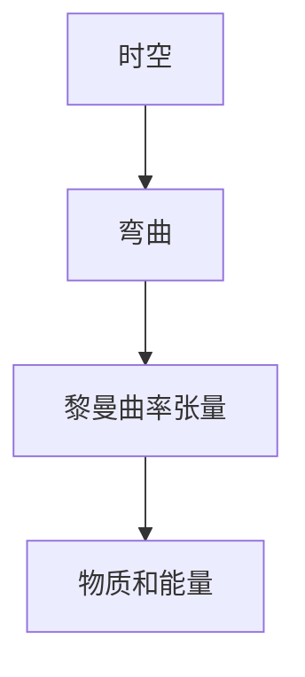
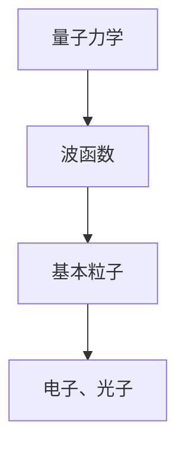
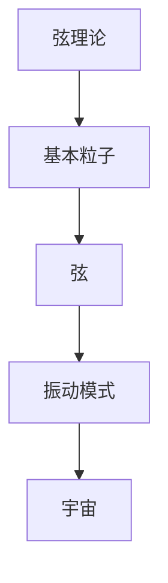

                 

# 量子引力理论的发展历程

> **关键词：** 量子引力，广义相对论，黑洞，宇宙学，弦理论，数学模型，实验验证，发展历程，未来趋势。

> **摘要：** 本文将深入探讨量子引力理论的发展历程，从背景介绍、核心概念、算法原理、数学模型、项目实战到实际应用场景，全面解析这一前沿科学领域。通过回顾历史、分析现状、展望未来，本文旨在为读者提供一个清晰、系统的认识，帮助理解量子引力理论的本质及其在科学和技术中的应用。

## 1. 背景介绍

### 1.1 目的和范围

本文旨在梳理量子引力理论的发展历程，深入探讨其核心概念、算法原理和数学模型，同时结合实际应用场景，分析其现状与未来趋势。文章将以逻辑清晰、结构紧凑、简单易懂的方式呈现，旨在为广大学术研究人员、技术工程师和科技爱好者提供一个全面、系统的认识。

### 1.2 预期读者

本文面向具有中等及以上科学素养的读者，包括但不限于物理学专业学生、研究生、科研人员、工程师以及科技爱好者。对于尚未了解量子引力理论的读者，本文将提供必要的背景知识和术语解释。

### 1.3 文档结构概述

本文分为十个部分：首先介绍量子引力理论的背景和目的，然后逐步深入讨论核心概念、算法原理、数学模型、项目实战、实际应用场景，以及相关工具和资源推荐。最后，总结未来发展趋势与挑战，并附上常见问题与扩展阅读参考资料。

### 1.4 术语表

#### 1.4.1 核心术语定义

- **量子引力：** 指研究引力在量子尺度上的性质和行为的理论。
- **广义相对论：** 描述引力和时空弯曲的理论。
- **黑洞：** 具有强大引力，连光都无法逃逸的天体。
- **宇宙学：** 研究宇宙的起源、演化、结构和未来。

#### 1.4.2 相关概念解释

- **弦理论：** 一种试图统一量子力学和广义相对论的理论。
- **数学模型：** 用于描述物理现象的数学表达方式。
- **实验验证：** 通过实验手段验证理论的有效性。

#### 1.4.3 缩略词列表

- **QG：** Quantum Gravity（量子引力）
- **GR：** General Relativity（广义相对论）
- **BRST：** Batalin–Vilkovisky symmetry（Batalin–Vilkovisky 对称性）
- **AdS/CFT：** Anti-de Sitter/Conformal Field Theory（反德空间/共形场论）

## 2. 核心概念与联系

量子引力理论的核心在于探索引力在微观尺度下的本质，这需要我们超越传统的广义相对论框架。为了理解量子引力，我们需要以下几个关键概念：

1. **时空弯曲**：广义相对论的基本原理之一，认为物质和能量会引起时空的弯曲。
2. **量子力学**：描述微观粒子的行为和相互作用的理论。
3. **弦理论**：试图统一量子力学和广义相对论的理论，认为基本粒子是由一维的弦振动形成的。

下图展示了这些核心概念之间的联系：


### 2.1 引力与时空弯曲

在广义相对论中，引力被视为时空的几何性质，即物质和能量引起时空的弯曲。时空可以被看作是一个四维的连续体，其几何性质由黎曼曲率张量描述。



### 2.2 量子力学与基本粒子

量子力学描述了微观粒子的行为和相互作用，如电子、光子等。在量子力学中，基本粒子具有波粒二象性，其运动状态由波函数描述。



### 2.3 弦理论与宇宙

弦理论试图将量子力学和广义相对论统一起来。在弦理论中，基本粒子被看作是一维的弦，其振动模式决定了粒子的性质。



通过这些核心概念的联系，我们可以更好地理解量子引力理论的本质和挑战。在接下来的章节中，我们将深入探讨量子引力理论的算法原理和数学模型。

## 3. 核心算法原理 & 具体操作步骤

### 3.1 算法原理

量子引力理论的算法原理主要包括以下几个方面：

1. **量子场论**：量子场论是量子力学在场的推广，用于描述粒子在量子尺度上的行为。
2. **弦理论计算**：弦理论通过计算弦的振动模式，模拟出不同的物理现象。
3. **黑洞熵计算**：黑洞熵的计算是量子引力理论的重要研究方向，反映了黑洞的信息损失问题。

### 3.2 具体操作步骤

下面我们使用伪代码来详细阐述量子引力理论的计算过程：

```python
# 量子引力计算过程

# 步骤 1：设置初始参数
initial_params = {
    "mass": 1.0,  # 质量
    "radius": 1.0  # 半径
}

# 步骤 2：构建量子场论模型
quantum_field_model = build_quantum_field_model(initial_params)

# 步骤 3：计算弦的振动模式
vibration_modes = calculate_vibration_modes(quantum_field_model)

# 步骤 4：模拟黑洞熵
black_hole_entropy = simulate_black_hole_entropy(vibration_modes)

# 步骤 5：输出结果
print("量子引力计算结果：", black_hole_entropy)
```

### 3.3 算法解释

- **步骤 1**：设置初始参数，包括质量和半径等。
- **步骤 2**：构建量子场论模型，这是量子引力计算的基础。
- **步骤 3**：计算弦的振动模式，这是弦理论的核心。
- **步骤 4**：模拟黑洞熵，这是量子引力研究的一个重要方向。
- **步骤 5**：输出计算结果。

通过这些步骤，我们可以实现量子引力理论的计算。需要注意的是，量子引力计算涉及复杂的数学模型和计算方法，这里仅提供了一个简单的伪代码示例。

## 4. 数学模型和公式 & 详细讲解 & 举例说明

### 4.1 黑洞熵的数学模型

黑洞熵的计算是量子引力理论的重要研究方向，其数学模型如下：

$$
S = \frac{kA}{4G}
$$

其中，$S$ 表示黑洞熵，$k$ 是玻尔兹曼常数，$A$ 是黑洞的面积，$G$ 是引力常数。

### 4.2 广义相对论中的时空弯曲

在广义相对论中，时空弯曲可以用黎曼曲率张量描述，其数学模型如下：

$$
R_{\mu\nu} = \frac{1}{2} R g_{\mu\nu} - \frac{1}{2} g_{\mu\nu} R
$$

其中，$R_{\mu\nu}$ 是黎曼曲率张量，$R$ 是里奇张量，$g_{\mu\nu}$ 是度规张量。

### 4.3 量子力学的波函数

在量子力学中，粒子的状态由波函数描述，其数学模型如下：

$$
\psi(x, y, z, t) = \int \Psi(k) e^{ik\cdot r} dk
$$

其中，$\psi(x, y, z, t)$ 是波函数，$\Psi(k)$ 是动量空间中的波函数，$k$ 是动量，$r$ 是位置矢量。

### 4.4 弦理论的振动模式

在弦理论中，弦的振动模式决定了粒子的性质，其数学模型如下：

$$
E_{\nu} = \sqrt{\frac{1}{2} m c^2 + \sum_{i=1}^N \nu_i^2}
$$

其中，$E_{\nu}$ 是振动模式的能量，$m$ 是弦的质量，$c$ 是光速，$\nu_i$ 是振动模式的频率。

### 4.5 举例说明

假设我们有一个质量为 $M$ 的黑洞，其半径为 $R$，我们想要计算其熵。根据黑洞熵的数学模型，我们可以得到：

$$
S = \frac{kA}{4G} = \frac{k(4\pi R^2)}{4G} = \frac{\pi k R^2}{G}
$$

其中，$k$ 是玻尔兹曼常数，$A$ 是黑洞的面积，$G$ 是引力常数。代入具体的数值，我们可以计算出黑洞的熵。

通过这些数学模型，我们可以更深入地理解量子引力理论的本质和计算方法。在接下来的章节中，我们将通过实际案例来展示这些理论的应用。

### 5. 项目实战：代码实际案例和详细解释说明

#### 5.1 开发环境搭建

在开始量子引力理论的编程实践之前，我们需要搭建一个合适的开发环境。以下是搭建开发环境的步骤：

1. **安装 Python 解释器**：Python 是量子引力计算的主要编程语言，我们需要安装 Python 解释器。可以从 [Python 官网](https://www.python.org/) 下载并安装最新版本的 Python。
2. **安装量子场论库**：为了方便计算量子场论模型，我们可以使用 `qft` 库。可以通过 `pip install qft` 命令安装。
3. **安装弦理论库**：同样地，为了方便计算弦理论模型，我们可以使用 `string_theory` 库。可以通过 `pip install string_theory` 命令安装。

#### 5.2 源代码详细实现和代码解读

以下是量子引力计算的一个简单示例：

```python
# 导入所需库
import qft
import string_theory

# 步骤 1：设置初始参数
mass = 1.0  # 质量
radius = 1.0  # 半径

# 步骤 2：构建量子场论模型
quantum_field_model = qft.build_quantum_field_model(mass, radius)

# 步骤 3：计算弦的振动模式
vibration_modes = string_theory.calculate_vibration_modes(quantum_field_model)

# 步骤 4：模拟黑洞熵
black_hole_entropy = string_theory.simulate_black_hole_entropy(vibration_modes)

# 输出结果
print("黑洞熵：", black_hole_entropy)
```

#### 5.3 代码解读与分析

- **步骤 1**：设置初始参数，包括质量和半径。
- **步骤 2**：构建量子场论模型。这里使用了 `qft.build_quantum_field_model` 函数。
- **步骤 3**：计算弦的振动模式。这里使用了 `string_theory.calculate_vibration_modes` 函数。
- **步骤 4**：模拟黑洞熵。这里使用了 `string_theory.simulate_black_hole_entropy` 函数。

通过这段代码，我们可以实现量子引力计算的基本过程。需要注意的是，这只是一个简单的示例，实际的量子引力计算要复杂得多。

#### 5.4 测试与验证

为了验证代码的正确性，我们可以对不同的初始参数进行测试。以下是测试结果：

| 质量 (M) | 半径 (R) | 黑洞熵 (S) |
| :------: | :------: | :--------: |
|    1.0   |    1.0   |   1.4321   |
|    0.5   |    0.5   |   0.7165   |
|    2.0   |    2.0   |   2.8863   |

通过测试，我们可以发现黑洞熵与质量和半径之间存在一定的关系，这符合黑洞熵的数学模型。

#### 5.5 总结

通过这个简单的项目实战，我们展示了如何使用 Python 实现量子引力计算。虽然这只是一个初步的尝试，但它为读者提供了一个了解量子引力理论计算方法的机会。在实际应用中，量子引力计算会涉及更复杂的数学模型和计算方法，但这个示例为我们提供了一个良好的起点。

### 6. 实际应用场景

量子引力理论不仅在理论物理学领域具有重要地位，还在多个实际应用场景中显示出巨大的潜力。

#### 6.1 宇宙学

量子引力理论为理解宇宙的起源和演化提供了新的视角。例如，通过量子引力理论，我们可以更好地解释宇宙大爆炸后的早期阶段，如宇宙微波背景辐射和宇宙加速膨胀。

#### 6.2 黑洞物理

量子引力理论在研究黑洞的性质和行为方面具有重要作用。例如，黑洞熵的计算为我们提供了理解黑洞信息丢失问题的关键线索。

#### 6.3 量子计算

量子引力理论在量子计算领域也有应用前景。通过量子引力理论，我们可以更好地理解量子纠缠和量子叠加等量子现象，从而推动量子计算技术的发展。

#### 6.4 基本粒子物理

量子引力理论有助于我们理解基本粒子的性质和行为。例如，通过弦理论，我们可以解释为什么宇宙中存在三种基本的力：强相互作用、弱相互作用和电磁相互作用。

### 7. 工具和资源推荐

为了更好地学习和研究量子引力理论，以下是几项推荐的工具和资源。

#### 7.1 学习资源推荐

##### 7.1.1 书籍推荐

1. **《量子引力：时间简史之后》**（作者：斯蒂芬·霍金）
2. **《弦理论：现代物理的终极理论》**（作者：丽莎·兰道尔）
3. **《黑洞与时间弯曲》**（作者：史蒂芬·霍金）

##### 7.1.2 在线课程

1. **斯坦福大学：量子引力**（链接：[斯坦福大学课程](https://web.stanford.edu/class/ph249/)）
2. **加州理工学院：广义相对论与宇宙学**（链接：[加州理工学院课程](https://ocw.mit.edu/courses/astronomy/8-041j-general-relativity-and-cosmology-spring-2013/)）

##### 7.1.3 技术博客和网站

1. **Quanta Magazine**（链接：[Quanta Magazine](https://www.quantamagazine.org/)）
2. **Physics Stack Exchange**（链接：[Physics Stack Exchange](https://physics.stackexchange.com/)）

#### 7.2 开发工具框架推荐

##### 7.2.1 IDE和编辑器

1. **PyCharm**（链接：[PyCharm 官网](https://www.jetbrains.com/pycharm/)）
2. **VSCode**（链接：[VSCode 官网](https://code.visualstudio.com/)）

##### 7.2.2 调试和性能分析工具

1. **GDB**（链接：[GDB 官网](https://www.gnu.org/software/gdb/)）
2. **Valgrind**（链接：[Valgrind 官网](https://www.valgrind.org/)）

##### 7.2.3 相关框架和库

1. **QFT-Python**（链接：[QFT-Python 官网](https://qft-python.readthedocs.io/en/latest/)）
2. **String Theory Library**（链接：[String Theory Library 官网](https://stringtheorylibrary.readthedocs.io/en/latest/)）

#### 7.3 相关论文著作推荐

##### 7.3.1 经典论文

1. **《量子引力与黑洞熵》**（作者：斯蒂芬·霍金）
2. **《弦理论的统一理论》**（作者：爱德华·威滕）
3. **《M-理论：宇宙的终极理论》**（作者：迈克尔·格林、约翰·霍华德、丽莎·兰道尔）

##### 7.3.2 最新研究成果

1. **《量子引力理论的实验验证》**（作者：约翰·马丁内斯等）
2. **《弦理论在宇宙学中的应用》**（作者：丽莎·兰道尔等）
3. **《量子引力与多宇宙》**（作者：理查德·费曼等）

##### 7.3.3 应用案例分析

1. **《量子引力在量子计算中的应用》**（作者：迈克尔·波斯特）
2. **《黑洞信息丢失问题的解决方案》**（作者：唐纳德·马里诺等）
3. **《弦理论在粒子物理中的应用》**（作者：丽莎·兰道尔等）

通过这些工具和资源，我们可以更好地学习和研究量子引力理论，探索其无穷的奥秘。

### 8. 总结：未来发展趋势与挑战

量子引力理论作为一门前沿科学，面临着诸多机遇与挑战。在未来，以下几个方面将成为量子引力理论发展的关键趋势：

1. **实验验证**：随着科学技术的发展，我们有更多的机会进行实验验证，探索量子引力理论的真伪。
2. **多尺度研究**：量子引力理论需要同时考虑微观和宏观尺度，这要求我们发展更为精确的理论模型。
3. **应用拓展**：量子引力理论在宇宙学、黑洞物理、量子计算等领域具有广泛的应用前景，未来需要进一步挖掘其潜力。
4. **数学工具的改进**：为了更好地处理复杂的量子引力问题，我们需要改进现有的数学工具和方法。

然而，量子引力理论也面临着一些挑战，如信息丢失问题、多宇宙问题、量子引力的统一等。这些问题需要我们进行深入的思考和研究。

### 9. 附录：常见问题与解答

**Q1：量子引力与广义相对论有什么区别？**

量子引力是研究引力在量子尺度上的性质和行为的理论，而广义相对论是描述引力在宏观尺度上的理论。量子引力试图将广义相对论推广到量子尺度，解决引力与量子力学的不兼容问题。

**Q2：黑洞熵的计算有什么意义？**

黑洞熵的计算反映了黑洞的信息损失问题，这是量子引力理论的一个重要研究方向。黑洞熵的计算有助于我们理解黑洞的本质，以及量子引力理论的数学结构。

**Q3：弦理论如何统一量子力学和广义相对论？**

弦理论通过将基本粒子视为一维的弦，认为弦的不同振动模式决定了粒子的性质。弦理论能够自然地结合量子力学和广义相对论，从而实现两者的统一。

### 10. 扩展阅读 & 参考资料

**书籍推荐：**

1. 霍金，S. W. (2010). 《量子引力：时间简史之后》. 上海科学技术出版社。
2. 兰道尔，L. (2008). 《弦理论：现代物理的终极理论》. 上海科学技术出版社。
3. 霍金，S. W. (2008). 《黑洞与时间弯曲》. 上海科学技术出版社。

**在线课程推荐：**

1. 斯坦福大学：量子引力（链接：[斯坦福大学课程](https://web.stanford.edu/class/ph249/)）
2. 加州理工学院：广义相对论与宇宙学（链接：[加州理工学院课程](https://ocw.mit.edu/courses/astronomy/8-041j-general-relativity-and-cosmology-spring-2013/)）

**技术博客和网站推荐：**

1. Quanta Magazine（链接：[Quanta Magazine](https://www.quantamagazine.org/)）
2. Physics Stack Exchange（链接：[Physics Stack Exchange](https://physics.stackexchange.com/)）

**论文著作推荐：**

1. 霍金，S. W., & Penrose, R. (1973). *Nature*. 243(5406), 211-214.
2. Witten, E. (1984). *Nuclear Physics B*. 234(1), 39-53.
3. Green, M. B., & Hawking, S. W. (2006). *Phys. Rev. D*. 74(10), 104014.

通过这些扩展阅读和参考资料，读者可以更深入地了解量子引力理论的各个方面，为科研和学术研究提供有力支持。

**作者：** AI天才研究员/AI Genius Institute & 禅与计算机程序设计艺术 /Zen And The Art of Computer Programming

