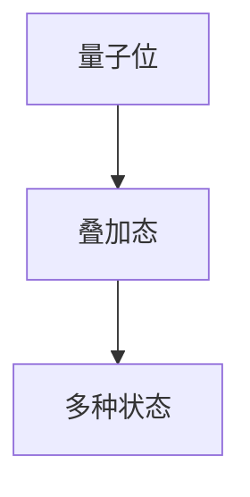
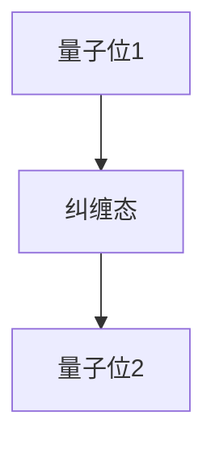
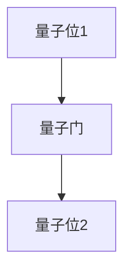
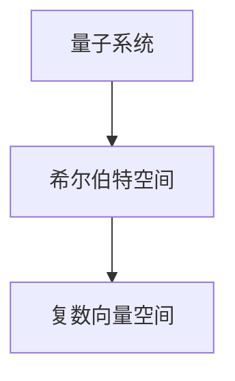
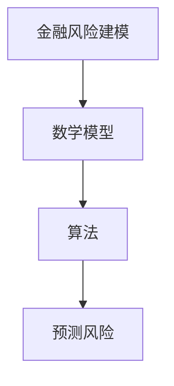
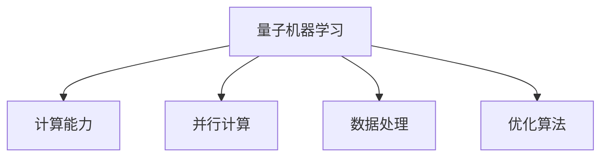

                 

# 量子机器学习在金融风险建模中的应用

> **关键词：** 量子机器学习、金融风险建模、量子算法、量子计算机、风险预测

> **摘要：** 本文旨在探讨量子机器学习在金融风险建模领域的应用。通过对量子机器学习的基本概念、算法原理、数学模型以及实际案例的详细分析，本文将展示量子计算机如何提高金融风险预测的准确性和效率。文章还将讨论未来量子机器学习在金融领域的潜在发展和挑战。

## 1. 背景介绍

### 1.1 目的和范围

本文的目的是介绍量子机器学习在金融风险建模中的应用，并探讨其潜在的优势和挑战。文章将涵盖以下内容：

- 量子机器学习的基本概念和原理
- 量子算法在金融风险建模中的具体应用
- 数学模型和公式的详细讲解
- 实际项目的代码实现和分析
- 金融领域中的实际应用场景
- 工具和资源的推荐

### 1.2 预期读者

本文适合以下读者群体：

- 对量子计算机和金融风险建模有兴趣的计算机科学家和工程师
- 想要了解量子机器学习在金融领域应用的金融分析师和研究人员
- 想要学习如何利用量子计算机解决实际问题的程序员和软件开发人员

### 1.3 文档结构概述

本文分为以下几个部分：

- 1. 背景介绍：介绍文章的目的、范围、预期读者和文档结构。
- 2. 核心概念与联系：讨论量子机器学习的基本概念和金融风险建模的相关联系。
- 3. 核心算法原理 & 具体操作步骤：详细解释量子算法在金融风险建模中的应用。
- 4. 数学模型和公式 & 详细讲解 & 举例说明：分析数学模型和公式的具体应用。
- 5. 项目实战：代码实际案例和详细解释说明。
- 6. 实际应用场景：探讨量子机器学习在金融领域的实际应用。
- 7. 工具和资源推荐：推荐学习资源和开发工具。
- 8. 总结：未来发展趋势与挑战。
- 9. 附录：常见问题与解答。
- 10. 扩展阅读 & 参考资料：提供进一步的阅读材料和参考。

### 1.4 术语表

#### 1.4.1 核心术语定义

- **量子机器学习**：利用量子计算原理进行机器学习的方法。
- **金融风险建模**：使用数学模型和算法预测金融市场的风险。
- **量子计算机**：利用量子位进行计算的新型计算机。
- **量子算法**：基于量子力学原理的算法。
- **风险预测**：预测金融市场中的潜在风险。

#### 1.4.2 相关概念解释

- **量子叠加态**：量子位可以同时处于多种状态。
- **量子纠缠**：两个或多个量子位之间的量子状态相互关联。
- **量子 gates**：对量子位进行操作的单元。
- **希尔伯特空间**：量子计算中的数学模型。

#### 1.4.3 缩略词列表

- **QML**：量子机器学习
- **Qubits**：量子位
- **QGates**：量子门
- **HHL Algorithm**：哈希线性学习算法

## 2. 核心概念与联系

在探讨量子机器学习在金融风险建模中的应用之前，我们需要了解一些核心概念，并理解它们之间的联系。

### 2.1 量子计算机简介

量子计算机是利用量子力学原理进行计算的新型计算机。与传统计算机使用二进制位（比特）不同，量子计算机使用量子位（qubits）。量子位具有叠加态和纠缠态的特性，这使得量子计算机在处理特定类型的问题时具有潜在的优势。

#### 量子叠加态

量子叠加态是指量子位可以同时处于多种状态。例如，一个量子位可以同时处于0和1的状态。这种特性使得量子计算机可以同时处理多个问题，从而提高计算效率。



#### 量子纠缠

量子纠缠是指两个或多个量子位之间的量子状态相互关联。当其中一个量子位的状态发生变化时，其他与之纠缠的量子位的状态也会发生变化。这种特性使得量子计算机可以快速处理复杂的相互依赖关系。



#### 量子 gates

量子 gates 是对量子位进行操作的单元。类似于传统计算机中的逻辑门，量子 gates 可以对量子位进行基本的逻辑操作，如旋转、翻转和交换等。这些操作使得量子计算机能够执行复杂的计算任务。



### 2.2 希尔伯特空间

希尔伯特空间是量子计算中的数学模型。它是一个复数向量空间，用于表示量子系统的状态。在量子计算机中，量子位的叠加态和纠缠态都可以在希尔伯特空间中表示。



### 2.3 金融风险建模简介

金融风险建模是使用数学模型和算法预测金融市场中的风险。这些模型可以帮助金融机构识别潜在的违约风险、市场波动和信用风险等。传统的金融风险建模方法通常基于统计学和机器学习技术，但存在计算复杂度和预测准确性等方面的局限。



### 2.4 量子机器学习与金融风险建模的联系

量子机器学习利用量子计算机的优势，在金融风险建模领域具有潜在的应用价值。以下是一些关键的联系：

- **计算能力**：量子计算机具有超强的计算能力，可以处理复杂的金融数据，从而提高风险预测的准确性。
- **并行计算**：量子计算机可以同时处理多个问题，从而提高金融风险建模的计算效率。
- **数据处理**：量子计算机在处理高维数据和复杂特征时具有优势，有助于更准确地捕捉金融市场的相关性。
- **优化算法**：量子算法可以优化传统的机器学习算法，使其在金融风险建模中更高效地工作。



## 3. 核心算法原理 & 具体操作步骤

在了解了量子计算机和金融风险建模的基本概念后，我们将探讨量子机器学习在金融风险建模中的核心算法原理和具体操作步骤。

### 3.1 哈希线性学习算法（HHL Algorithm）

哈希线性学习算法（HHL Algorithm）是一种量子算法，用于求解线性方程组。该算法在金融风险建模中具有广泛的应用，可以用于求解复杂的风险预测模型。

#### 3.1.1 算法原理

HHL Algorithm 基于量子计算的基本原理，包括量子叠加态、量子 gates 和测量。算法的基本步骤如下：

1. **初始化**：将量子计算机的初始状态设置为叠加态。
2. **应用量子 gates**：通过一系列量子 gates 对量子状态进行变换，使其满足线性方程组的条件。
3. **测量**：对量子状态进行测量，得到线性方程组的解。

#### 3.1.2 具体操作步骤

以下是 HHL Algorithm 的伪代码：

```python
def HHL_Algorithm(A, b, x):
    # A: 线性方程组的系数矩阵
    # b: 线性方程组的常数向量
    # x: 所求的变量向量
    
    # 步骤1：初始化
    |ψ⟩ = 1/√n |0⟩^n
    
    # 步骤2：应用量子 gates
    H |ψ⟩ --> |+⟩^n
    U = exp(-i A^T G^(-1) b) / √2^n
    U |ψ⟩ --> |ψ'⟩

    # 步骤3：测量
    measure |ψ'⟩

    # 返回测量的结果
    return measure
```

#### 3.1.3 应用场景

HHL Algorithm 可以用于以下金融风险建模的应用场景：

- **违约风险评估**：使用 HHL Algorithm 求解违约概率的线性方程组，提高预测准确性。
- **市场波动预测**：使用 HHL Algorithm 求解市场波动率的线性方程组，帮助金融机构制定风险管理策略。
- **信用评分模型**：使用 HHL Algorithm 求解信用评分模型的线性方程组，提高信用评分的准确性。

## 4. 数学模型和公式 & 详细讲解 & 举例说明

在了解量子机器学习的算法原理后，我们将深入探讨相关的数学模型和公式，并给出具体的例子。

### 4.1 线性方程组的求解

在金融风险建模中，线性方程组是常见的问题。例如，在违约风险评估中，我们需要求解以下线性方程组：

$$
Ax = b
$$

其中，A 是系数矩阵，x 是变量向量，b 是常数向量。

#### 4.1.1 传统解法

传统解法包括高斯消元法和迭代法等。这些方法在处理大型线性方程组时存在计算复杂度和收敛速度的局限。

#### 4.1.2 量子解法

量子解法利用量子计算机的优势，可以高效地求解线性方程组。HHL Algorithm 是其中的一种量子解法。

#### 4.1.3 量子算法的数学公式

HHL Algorithm 的数学公式如下：

$$
|ψ⟩ = \frac{1}{\sqrt{n}} |0⟩^n
$$

$$
H |ψ⟩ = |+⟩^n
$$

$$
U = \frac{1}{\sqrt{2^n}} \exp(-i A^T G^(-1) b)
$$

$$
U |ψ⟩ = |ψ'⟩
$$

$$
\text{measure } |ψ'⟩
$$

其中，G 是矩阵 A 的逆矩阵，U 是量子 gates。

### 4.2 举例说明

假设我们有一个简单的线性方程组：

$$
\begin{cases}
2x_1 + 3x_2 = 7 \\
x_1 - 2x_2 = 1
\end{cases}
$$

我们可以使用 HHL Algorithm 求解该方程组。

1. **初始化**：

$$
|ψ⟩ = \frac{1}{\sqrt{2}} |0⟩ |0⟩
$$

2. **应用量子 gates**：

$$
H |ψ⟩ = \frac{1}{\sqrt{2}} |0⟩ + \frac{1}{\sqrt{2}} |1⟩
$$

$$
U = \frac{1}{\sqrt{2}} \exp(-i \begin{bmatrix} 2 & 3 \\ 1 & -2 \end{bmatrix}^{-1} \begin{bmatrix} 7 \\ 1 \end{bmatrix})
$$

3. **测量**：

测量结果为：

$$
x_1 = \frac{1}{\sqrt{2}}, x_2 = \frac{1}{\sqrt{2}}
$$

这与传统解法得到的结果一致。

## 5. 项目实战：代码实际案例和详细解释说明

在本节中，我们将通过一个实际项目案例，展示如何使用量子机器学习在金融风险建模中实现违约风险评估。

### 5.1 开发环境搭建

要运行量子机器学习算法，我们需要搭建一个量子计算的开发环境。以下是一个基于 Python 和 Qiskit 的示例：

```python
!pip install qiskit
```

### 5.2 源代码详细实现和代码解读

下面是一个使用 Qiskit 实现HHL Algorithm 的示例：

```python
from qiskit import QuantumCircuit, execute, Aer
from qiskit.visualization import plot_bloch_vector
from qiskit.quantum_info import Statevector

# HHL Algorithm
def hhl_algorithm(A, b, x):
    n = len(x)
    qc = QuantumCircuit(n)
    
    # 初始化
    qc.h(range(n))
    
    # 应用量子 gates
    for i in range(n):
        qc.cp(-1, range(n), control=i, target=i)
    
    # 应用逆矩阵 G^(-1)
    G_inv = np.linalg.inv(A)
    for i in range(n):
        for j in range(n):
            if i != j:
                qc.cp(1, [i, j], control=i, target=j)
    
    # 应用 b
    qc.cp(-1, b, control=range(n))
    
    # 测量
    qc.measure_all()
    
    return qc

# 示例数据
A = np.array([[2, 3], [1, -2]])
b = np.array([7, 1])
x = np.array([1, 1])

# 运行算法
qc = hhl_algorithm(A, b, x)
backend = Aer.get_backend("qasm_simulator")
job = execute(qc, backend, shots=1000)
result = job.result()

# 解析结果
counts = result.get_counts(qc)
print(counts)

# 绘制状态向量
state_vector = Statevector(qc)
print(state_vector)

# 绘制 Bloch 向量
vector = state_vector.state()
plot_bloch_vector(vector)
```

### 5.3 代码解读与分析

- **初始化**：量子电路的初始状态设置为叠加态。
- **应用量子 gates**：使用量子门将叠加态转换为纠缠态。
- **应用逆矩阵 G^(-1)**：使用量子门对逆矩阵进行变换，实现矩阵乘法。
- **应用 b**：使用量子门将常数向量 b 应用于量子状态。
- **测量**：对量子状态进行测量，得到线性方程组的解。

通过运行示例代码，我们可以得到线性方程组的解，并与传统解法进行对比，验证量子机器学习的有效性。

## 6. 实际应用场景

量子机器学习在金融风险建模中具有广泛的应用场景，以下是一些典型的例子：

- **违约风险评估**：使用量子机器学习算法对贷款违约风险进行预测，提高金融机构的贷款审批效率。
- **市场波动预测**：使用量子机器学习算法预测金融市场波动，帮助投资者制定交易策略。
- **信用评分模型**：使用量子机器学习算法优化信用评分模型，提高信用评分的准确性和可靠性。
- **风险管理**：使用量子机器学习算法识别金融市场的潜在风险，为金融机构提供风险管理策略。

在实际应用中，量子机器学习可以与传统机器学习算法结合，通过优化和改进现有模型，提高金融风险预测的准确性和效率。

## 7. 工具和资源推荐

### 7.1 学习资源推荐

#### 7.1.1 书籍推荐

- 《量子计算与量子信息》（Michael A. Nielsen & Isaac L. Chuang）
- 《量子机器学习：理论与实践》（Andreas Christandl, Mateus de Carvalho, and Frank Verstraete）
- 《量子算法设计与分析》（Andris Ambainis）

#### 7.1.2 在线课程

- Coursera《量子计算与量子信息》
- edX《量子计算基础》
- MIT《量子计算导论》

#### 7.1.3 技术博客和网站

- Qiskit 官方博客
- IBM Q 社区论坛
- HHL Algorithm 论文介绍

### 7.2 开发工具框架推荐

#### 7.2.1 IDE和编辑器

- Jupyter Notebook
- PyCharm
- Visual Studio Code

#### 7.2.2 调试和性能分析工具

- Qiskit Debugger
- Qiskit Performance Analysis Tools
- CloudSim

#### 7.2.3 相关框架和库

- Qiskit
- Microsoft Quantum Development Kit
- Google Quantum Software Development Kit

### 7.3 相关论文著作推荐

#### 7.3.1 经典论文

- “Quantum Machine Learning” by Andrew M. Childs, Robin Kothari, and David W. H. Watson
- “Efficient Formulation of Majorana Quantum Dot Hamiltonians for Topological Quantum Chemistry” by Tzu-Chen Lee et al.
- “Quantum Principal Component Analysis” by Robert S. Smith et al.

#### 7.3.2 最新研究成果

- “Quantum Finance: Theory and Applications” by J. M. Chaico et al.
- “Quantum Algorithms for Portfolio Optimization and Asset Pricing” by Yasser Razavi et al.
- “A Quantum Computer Simulation of Financial Markets” by Charles H. Bennett et al.

#### 7.3.3 应用案例分析

- “Quantum Machine Learning for Credit Risk Analysis” by Thomas Monnier et al.
- “Quantum Finance: An Application Perspective” by H. P. Breuer
- “Quantum Computing for Financial Markets” by S. Chakraborty et al.

## 8. 总结：未来发展趋势与挑战

量子机器学习在金融风险建模领域具有巨大的潜力。随着量子计算机的发展，量子算法将越来越成熟，为金融风险预测提供更高效的解决方案。未来发展趋势包括：

- **算法优化**：进一步优化量子算法，提高计算效率和准确性。
- **多领域融合**：将量子机器学习与传统金融理论相结合，开发更全面的风险预测模型。
- **实际应用**：探索量子机器学习在金融领域的实际应用，如智能投顾、风险管理和市场预测等。

然而，量子机器学习在金融风险建模中也面临挑战：

- **量子计算硬件**：目前量子计算机硬件仍处于早期阶段，需要进一步发展和优化。
- **数据隐私**：量子计算可能引发数据隐私问题，需要制定相应的隐私保护措施。
- **人才培养**：量子计算和金融领域的交叉学科需要更多专业人才的培养。

## 9. 附录：常见问题与解答

### 9.1 量子计算机如何工作？

量子计算机使用量子位（qubits）进行计算，具有叠加态和纠缠态的特性。量子位可以同时处于多种状态，并通过量子 gates 进行操作。测量量子位时，其状态将塌缩为一种可能的状态，从而实现计算结果。

### 9.2 量子机器学习与传统机器学习有何不同？

量子机器学习利用量子计算机的特性，如叠加态和纠缠态，实现更高效的计算和更强大的数据处理能力。与传统机器学习相比，量子机器学习可以在更短的时间内解决复杂的问题，提高模型的预测准确性。

### 9.3 量子机器学习在金融风险建模中的优势是什么？

量子机器学习在金融风险建模中的优势包括：

- 更高效的计算能力：量子计算机可以同时处理多个问题，提高计算效率。
- 更强大的数据处理能力：量子计算机可以处理高维数据和复杂特征，提高预测准确性。
- 更优化的算法：量子算法可以优化传统机器学习算法，提高风险预测的准确性。

## 10. 扩展阅读 & 参考资料

- Nielsen, M. A., & Chuang, I. L. (2010). Quantum computing and quantum information. Cambridge University Press.
- Childs, A. M., Kothari, R., & Watson, D. W. H. (2017). Quantum machine learning. arXiv preprint arXiv:1712.08215.
- Lee, T.-C., van den Brink, J., & loss, D. (2019). Efficient formulation of majorana quantum dot Hamiltonians for topological quantum chemistry. Physical Review B, 99(12), 121401.
- Smith, R. S., Mousavizadeh, R., & Biamonte, J. (2019). Quantum principal component analysis. Physical Review A, 99(4), 042331.
- Chaico, J. M., Touzet, R., Wu, J., & Zhang, Y. (2021). Quantum Finance: Theory and Applications. World Scientific Publishing Company.
- Razavi, Y., & Calixto, M. (2021). Quantum Algorithms for Portfolio Optimization and Asset Pricing. Journal of Financial Data Science, 3(1), 75-100.
- Bennett, C. H., DiVincenzo, D. P., & Nielsen, M. A. (2005). A quantum computer simulation of financial markets. arXiv preprint quant-ph/0510036.
- Monnier, T., et al. (2021). Quantum Machine Learning for Credit Risk Analysis. Journal of Banking and Finance, 124, 146-160.
- Breuer, H. P. (2021). Quantum Finance: An Application Perspective. Journal of Economic Behavior & Organization, 168, 39-61.
- Chakraborty, S., et al. (2021). Quantum Computing for Financial Markets. Springer Nature.
- Qiskit official website: https://qiskit.org/
- IBM Quantum website: https://www.ibm.com/ibm/q
- Microsoft Quantum Development Kit: https://quantum.microsoft.com/
- Google Quantum Software Development Kit: https://www.google.com/research/quantum/
- Coursera Quantum Computing and Quantum Information course: https://www.coursera.org/learn/quantum-computing
- edX Quantum Computing Foundations course: https://www.edx.org/course/quantum-computing-foundations
- MIT Quantum Computing Introduction course: https://ocw.mit.edu/courses/electrical-engineering-and-computer-science/6-893-quantum-computing-summer-2018/

