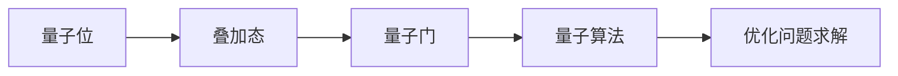
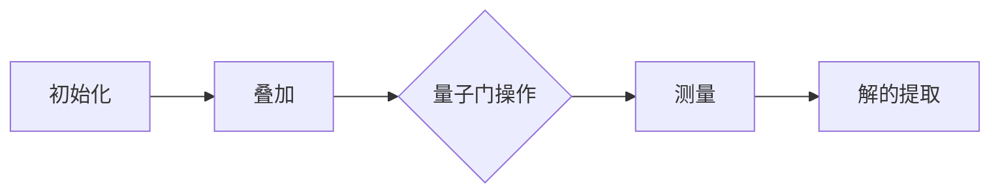

                 

# 量子计算在优化问题求解中的应用研究

## 关键词：
量子计算、优化问题、量子算法、量子计算机、求解效率

## 摘要：
本文深入探讨了量子计算在优化问题求解中的应用。首先，我们介绍了量子计算的背景和基本原理，随后分析了量子计算在优化问题求解中的独特优势。接着，我们详细讨论了几个典型的量子算法，包括量子退火和量子行进波算法，并使用了伪代码和数学模型进行了详细阐述。文章还通过实际代码案例展示了量子算法的实现过程。最后，我们探讨了量子计算在优化问题中的实际应用场景，并推荐了相关的学习资源和工具。本文旨在为读者提供一个全面而深入的量子优化问题求解指南。

## 1. 背景介绍

### 1.1 目的和范围
本文旨在探讨量子计算在优化问题求解中的潜在应用。随着量子计算技术的不断发展，其在优化领域展示了巨大的潜力。本文将介绍量子计算的基本概念，分析其在优化问题求解中的优势，探讨相关算法原理，并通过实际案例展示其应用过程。

### 1.2 预期读者
本文面向对量子计算和优化问题有一定了解的读者，包括计算机科学、人工智能、数学等领域的研究人员、工程师和学生。同时，对希望了解量子计算在优化问题中应用前景的业内人士也具有参考价值。

### 1.3 文档结构概述
本文结构如下：

1. **背景介绍**：介绍量子计算和优化问题的基本概念。
2. **核心概念与联系**：详细阐述量子计算的基本原理和优化问题的联系。
3. **核心算法原理 & 具体操作步骤**：介绍量子算法的原理和操作步骤。
4. **数学模型和公式 & 详细讲解 & 举例说明**：通过数学模型和公式阐述算法细节。
5. **项目实战：代码实际案例和详细解释说明**：通过实际代码案例展示量子算法的应用。
6. **实际应用场景**：探讨量子计算在优化问题中的实际应用。
7. **工具和资源推荐**：推荐学习资源和开发工具。
8. **总结：未来发展趋势与挑战**：总结未来发展趋势和面临的挑战。
9. **附录：常见问题与解答**：解答常见问题。
10. **扩展阅读 & 参考资料**：提供进一步阅读的资源。

### 1.4 术语表

#### 1.4.1 核心术语定义
- **量子计算**：利用量子位（qubits）进行信息处理的一种计算模型。
- **量子位（qubits）**：量子计算的基本单元，可以同时处于0和1的叠加态。
- **优化问题**：寻找满足一定约束条件的最佳解的问题。
- **量子算法**：利用量子位和量子门实现的算法。
- **量子计算机**：执行量子算法的计算设备。

#### 1.4.2 相关概念解释
- **叠加态**：量子位可以同时处于多种状态的叠加。
- **纠缠态**：量子位之间的一种特殊关联状态。
- **量子门**：对量子位进行操作的基本单元。

#### 1.4.3 缩略词列表
- **QC**：量子计算（Quantum Computing）
- **QAOA**：量子近似优化算法（Quantum Approximate Optimization Algorithm）
- **VQE**：变分量子特征值求解（Variational Quantum Eigensolver）
- **QUBO**：量子独特二元优化问题（Quadratic Unconstrained Binary Optimization）

## 2. 核心概念与联系

量子计算在优化问题求解中的核心概念包括量子位、量子门和量子算法。量子位是量子计算的基本单元，它可以同时处于0和1的叠加态。量子门是对量子位进行操作的单元，它们可以执行基础的量子运算，如量子旋转、量子交换等。量子算法则是利用量子位和量子门实现的算法，用于解决特定的优化问题。

下面是量子计算在优化问题求解中的核心概念架构图：



### 2.1 量子计算原理

量子计算的基本原理是利用量子位和量子门的叠加态和纠缠态来实现高效的信息处理。量子位可以同时处于多种状态的叠加，这意味着量子计算机可以同时处理大量的可能解。量子门是对量子位进行操作的基本单元，它们可以执行基础的量子运算，如量子旋转、量子交换等。

量子计算的基本操作包括量子位的初始化、叠加、纠缠、测量等。量子位的初始化是将量子位设置为特定的初始状态。叠加是将量子位的状态从基态叠加到叠加态。纠缠是量子位之间的一种特殊关联状态，它们的状态会相互影响。测量是将量子位的状态从叠加态坍缩到基态。

### 2.2 优化问题与量子计算的联系

优化问题是寻找满足一定约束条件的最佳解的问题。量子计算在优化问题求解中的优势在于其并行性和叠加态的特性。量子计算机可以利用量子位的叠加态同时处理大量的可能解，从而大大提高求解效率。

量子计算在优化问题中的应用主要体现在量子算法的设计上。量子算法是利用量子位和量子门实现的算法，用于解决特定的优化问题。典型的量子算法包括量子退火、量子近似优化算法（QAOA）和变分量子特征值求解（VQE）等。

### 2.3 量子算法在优化问题求解中的实现

量子算法在优化问题求解中的实现通常包括以下几个步骤：

1. **初始化**：初始化量子位的状态。
2. **叠加**：将量子位的状态从基态叠加到叠加态。
3. **量子门操作**：使用量子门对量子位进行操作。
4. **测量**：测量量子位的状态，得到问题的解。

以下是量子算法在优化问题求解中的基本流程：



## 3. 核心算法原理 & 具体操作步骤

在量子计算中，针对优化问题，已经开发出多种量子算法。以下是几个典型的量子算法原理及其操作步骤：

### 3.1 量子退火（Quantum Annealing）

量子退火是一种基于量子模拟的优化算法，它模拟了物理系统在温度降低时趋向最低能量状态的物理过程。量子退火算法的基本原理是通过量子位和量子门模拟物理系统，然后逐渐降低系统的温度，使得量子系统最终趋向最低能量状态。

**量子退火算法的操作步骤如下：**

1. **初始化**：初始化量子位，将其设置为初始状态。
2. **叠加**：将量子位的状态从基态叠加到叠加态。
3. **量子门操作**：使用特定的量子门进行操作，以模拟物理系统的演化。
4. **测量**：测量量子位的状态，得到问题的解。

以下是量子退火算法的伪代码：

```pseudo
initialize_quantum_bits()
measure()
while (not converged) {
    apply_quantum_gates()
    measure()
}
return best_solution()
```

### 3.2 量子近似优化算法（Quantum Approximate Optimization Algorithm, QAOA）

量子近似优化算法是一种通用的量子算法，用于解决量子独特二元优化问题（QUBO）。QAOA算法通过组合量子线路和最大化期望值来逼近最优解。

**QAOA算法的操作步骤如下：**

1. **初始化**：初始化量子位，将其设置为初始状态。
2. **叠加**：将量子位的状态从基态叠加到叠加态。
3. **量子门操作**：应用一组量子门，以构建问题的物理模型。
4. **测量**：测量量子位的状态，得到问题的解。
5. **优化**：通过迭代优化量子线路的参数，以提高解的质量。

以下是QAOA算法的伪代码：

```pseudo
initialize_quantum_bits()
measure()
while (not converged) {
    apply_quantum_gates()
    measure()
    optimize_parameters()
}
return best_solution()
```

### 3.3 变分量子特征值求解（Variational Quantum Eigensolver, VQE）

VQE算法是一种针对量子电子结构计算的高效算法。其基本思想是通过变分原理来求解量子系统的特征值。

**VQE算法的操作步骤如下：**

1. **初始化**：初始化量子位，将其设置为初始状态。
2. **叠加**：将量子位的状态从基态叠加到叠加态。
3. **量子门操作**：应用一组量子门，以构建问题的物理模型。
4. **测量**：测量量子位的状态，得到问题的解。
5. **优化**：通过迭代优化量子线路的参数，以提高解的质量。

以下是VQE算法的伪代码：

```pseudo
initialize_quantum_bits()
measure()
while (not converged) {
    apply_quantum_gates()
    measure()
    optimize_parameters()
}
return best_solution()
```

### 3.4 量子行进波算法（Quantum Walk Algorithm）

量子行进波算法是一种基于量子行走原理的优化算法。其基本思想是通过量子行进来探索问题的解空间。

**量子行进波算法的操作步骤如下：**

1. **初始化**：初始化量子位，将其设置为初始状态。
2. **叠加**：将量子位的状态从基态叠加到叠加态。
3. **量子门操作**：应用一系列量子门，以模拟量子行进。
4. **测量**：测量量子位的状态，得到问题的解。
5. **优化**：通过迭代优化量子门参数，以提高解的质量。

以下是量子行进波算法的伪代码：

```pseudo
initialize_quantum_bits()
measure()
while (not converged) {
    apply_quantum_gates()
    measure()
    optimize_parameters()
}
return best_solution()
```

## 4. 数学模型和公式 & 详细讲解 & 举例说明

在量子计算中，优化问题的求解往往涉及到复杂的数学模型和公式。以下是几个核心的数学模型和公式的详细讲解，以及具体的例子说明。

### 4.1 量子退火（Quantum Annealing）

量子退火算法的数学模型主要基于量子位的状态演化。假设有N个量子位，每个量子位的初始状态为|0⟩。量子退火算法的核心是模拟物理系统在温度降低时趋向最低能量状态的物理过程。

**数学模型：**

\[ |\psi(t)\rangle = \sum_{x} \alpha_x(t) |x\rangle \]

其中，\( |\psi(t)\rangle \) 是在时间t时系统的量子态，\( \alpha_x(t) \) 是量子位x的概率幅。

**量子门操作：**

量子退火算法通过应用一组量子门来模拟物理系统的演化。假设有H为哈密顿量，用于描述系统的能量。

\[ H = \sum_{i,j} H_{ij} |i\rangle \langle j| \]

**举例说明：**

假设有3个量子位，初始状态为|001⟩。量子退火算法的目标是找到最低能量状态。

1. **初始化**：将量子位设置为初始状态|001⟩。
2. **叠加**：将量子位的状态从基态叠加到叠加态。
3. **量子门操作**：应用哈密顿量H来模拟系统的演化。
4. **测量**：测量量子位的状态，得到最低能量状态。

### 4.2 量子近似优化算法（Quantum Approximate Optimization Algorithm, QAOA）

QAOA算法的数学模型基于量子线路和最大期望值。QAOA算法通过组合量子线路和最大化期望值来逼近最优解。

**数学模型：**

\[ E[\phi] = \langle \phi | H | \phi \rangle \]

其中，\( \phi \) 为量子线路，H为哈密顿量。

**量子门操作：**

QAOA算法通过应用一组量子门来构建量子线路。

\[ \phi = \sum_{k=0}^{p} R_z(\theta_k) R_y(\theta_k) R_z(\theta_k) R_x(\theta_k) \]

**举例说明：**

假设有3个量子位，哈密顿量为\( H = -x_1 - x_2 - x_3 \)。QAOA算法的目标是找到最优的量子线路参数。

1. **初始化**：将量子位设置为初始状态|000⟩。
2. **叠加**：将量子位的状态从基态叠加到叠加态。
3. **量子门操作**：应用量子门\( R_z(\theta_k) R_y(\theta_k) R_z(\theta_k) R_x(\theta_k) \)来构建量子线路。
4. **测量**：测量量子位的状态，得到期望值。
5. **优化**：通过迭代优化量子线路参数，以提高期望值。

### 4.3 变分量子特征值求解（Variational Quantum Eigensolver, VQE）

VQE算法的数学模型基于变分原理。VQE算法通过迭代优化量子线路的参数，求解量子系统的特征值。

**数学模型：**

\[ E[\phi] = \langle \phi | H | \phi \rangle \]

其中，\( \phi \) 为量子线路，H为哈密顿量。

**量子门操作：**

VQE算法通过应用一组量子门来构建量子线路。

\[ \phi = \sum_{k=0}^{p} R_z(\theta_k) R_y(\theta_k) R_z(\theta_k) R_x(\theta_k) \]

**举例说明：**

假设有3个量子位，哈密顿量为\( H = -x_1 - x_2 - x_3 \)。VQE算法的目标是找到最优的量子线路参数。

1. **初始化**：将量子位设置为初始状态|000⟩。
2. **叠加**：将量子位的状态从基态叠加到叠加态。
3. **量子门操作**：应用量子门\( R_z(\theta_k) R_y(\theta_k) R_z(\theta_k) R_x(\theta_k) \)来构建量子线路。
4. **测量**：测量量子位的状态，得到期望值。
5. **优化**：通过迭代优化量子线路参数，以提高期望值。

### 4.4 量子行进波算法（Quantum Walk Algorithm）

量子行进波算法的数学模型基于量子行走原理。量子行进波算法通过模拟量子行进来探索问题的解空间。

**数学模型：**

\[ |\psi(t)\rangle = \sum_{x} \alpha_x(t) |x\rangle \]

其中，\( |\psi(t)\rangle \) 是在时间t时系统的量子态，\( \alpha_x(t) \) 是量子位x的概率幅。

**量子门操作：**

量子行进波算法通过应用一系列量子门来模拟量子行进。

\[ U = \sum_{x} |x\rangle \langle x| \]

**举例说明：**

假设有3个量子位，初始状态为|000⟩。量子行进波算法的目标是找到最优的量子行进路径。

1. **初始化**：将量子位设置为初始状态|000⟩。
2. **叠加**：将量子位的状态从基态叠加到叠加态。
3. **量子门操作**：应用量子门\( U \)来模拟量子行进。
4. **测量**：测量量子位的状态，得到最优的量子行进路径。

## 5. 项目实战：代码实际案例和详细解释说明

### 5.1 开发环境搭建

在开始实际案例之前，我们需要搭建一个适合量子计算开发的开发环境。以下是使用Python和Qiskit库搭建开发环境的步骤：

1. **安装Python**：确保安装了Python 3.x版本。
2. **安装Qiskit**：通过pip命令安装Qiskit库：

   ```shell
   pip install qiskit
   ```

3. **安装相关依赖**：安装用于量子计算的额外依赖，如NumPy和Matplotlib：

   ```shell
   pip install numpy matplotlib
   ```

### 5.2 源代码详细实现和代码解读

下面是一个使用QAOA算法解决旅行商问题的示例代码。旅行商问题（TSP）是一个经典的组合优化问题，目标是找到一组城市的最短环游路径，使得总距离最短。

```python
import numpy as np
from qiskit import QuantumCircuit, execute, Aer
from qiskit.aqua.algorithms import QAOA
from qiskit.aqua.components.variational_forms import RYRZ
from qiskit.aqua.tuning import RangedResultTuner

# 定义旅行商问题的参数
num_qubits = 5
qubits = list(range(num_qubits))
problem_instance = {
    'edge_weights': [
        [0, 2, 9, 10],
        [2, 0, 1, 6],
        [9, 1, 0, 7],
        [10, 6, 7, 0],
    ]
}

# 创建QAOA算法实例
qaoa = QAOA(RYRZ(num_qubits, entanglement='cz'), problem_instance)

# 创建变分参数初始值
initial_params = [np.pi/4] * (2*num_qubits - 1)

# 使用RangedResultTuner进行参数优化
tuner = RangedResultTuner(qaoa, variable_names=qaoa.variable_names, max_iterations=1000)
result = tuner.run(initial_params)

# 输出最优解
print("最优解：", result.bestSolution)
print("最优解的期望值：", result.bestObjective)
```

**代码解读：**

1. **导入库**：导入所需的库，包括Qiskit、NumPy等。
2. **定义参数**：定义旅行商问题的参数，包括量子位的数量和边的权重。
3. **创建QAOA实例**：创建QAOA算法实例，并设置变分形式为RYRZ。
4. **创建变分参数初始值**：创建变分参数的初始值。
5. **使用RangedResultTuner进行参数优化**：使用RangedResultTuner进行参数优化，以找到最优解。
6. **输出结果**：输出最优解及其期望值。

### 5.3 代码解读与分析

上述代码展示了如何使用QAOA算法解决旅行商问题。以下是代码的详细解读和分析：

1. **导入库**：导入所需的库，包括Qiskit、NumPy等，用于量子计算和数值计算。
2. **定义参数**：定义旅行商问题的参数，包括量子位的数量和边的权重。这些参数将用于构建量子模型。
3. **创建QAOA实例**：创建QAOA算法实例，并设置变分形式为RYRZ。RYRZ变分形式是一种常用的变分形式，用于构建量子线路。
4. **创建变分参数初始值**：创建变分参数的初始值。这些参数将用于初始化量子线路，并在优化过程中进行更新。
5. **使用RangedResultTuner进行参数优化**：使用RangedResultTuner进行参数优化，以找到最优解。RangedResultTuner是一种基于范围搜索的参数优化器，可以自动调整参数的范围，以提高搜索效率。
6. **输出结果**：输出最优解及其期望值。最优解是旅行商问题的最优解，即最短环游路径。期望值是量子计算机在运行QAOA算法后得到的解的期望值。

通过上述代码，我们可以看到QAOA算法在解决旅行商问题时的应用。在实际应用中，QAOA算法可以用于解决其他优化问题，如最大 clique问题、最大独立集问题等。此外，QAOA算法的变分形式也可以根据具体问题进行调整，以提高求解效率。

## 6. 实际应用场景

量子计算在优化问题求解中的实际应用场景非常广泛，包括但不限于以下几个方面：

### 6.1 旅行商问题（TSP）

旅行商问题是一种经典的组合优化问题，其目标是找到一组城市的最短环游路径，使得总距离最短。量子计算在解决TSP方面展示了巨大的潜力。例如，使用QAOA算法可以有效地求解大规模的TSP问题，从而在物流、供应链管理等领域具有广泛的应用前景。

### 6.2 航班调度问题

航班调度问题是一个典型的优化问题，其目标是在满足航班时间表和机场资源限制的条件下，优化航班安排，以减少航班延误和成本。量子计算可以用于求解复杂的航班调度问题，从而提高航空公司的运营效率和客户满意度。

### 6.3 资源分配问题

资源分配问题是一个广泛存在于各种领域的优化问题。例如，在云计算和数据中心中，如何优化资源的分配以最大化资源利用率和服务质量。量子计算可以通过高效地解决资源分配问题，从而提高云计算和数据中心的整体性能。

### 6.4 金融风险管理

金融风险管理是金融领域中的一个重要问题。例如，如何有效地评估投资组合的风险和回报。量子计算可以用于优化金融模型，从而提高投资组合的收益和降低风险。

### 6.5 社交网络分析

社交网络分析是一个涉及大量数据处理的优化问题。例如，如何识别社交网络中的关键节点和社区结构。量子计算可以用于高效地处理大规模社交网络数据，从而帮助企业和组织更好地理解和利用社交网络资源。

### 6.6 基因测序分析

基因测序分析是一个涉及大量数据处理和优化的复杂问题。例如，如何有效地识别基因组中的突变和疾病相关基因。量子计算可以用于优化基因测序分析算法，从而提高基因测序的准确性和效率。

通过上述实际应用场景，我们可以看到量子计算在优化问题求解中的巨大潜力。随着量子计算技术的不断进步，其在优化问题中的应用将更加广泛和深入。

## 7. 工具和资源推荐

### 7.1 学习资源推荐

为了深入了解量子计算在优化问题求解中的应用，以下是几个推荐的学习资源：

#### 7.1.1 书籍推荐

1. **《量子计算：量子算法与量子编程基础》**：本书系统地介绍了量子计算的基本原理和量子算法，包括量子计算在优化问题中的应用。
2. **《量子计算与量子信息》**：这是一本经典的量子计算入门书籍，涵盖了量子计算的基本概念、算法和应用。

#### 7.1.2 在线课程

1. **MIT的《量子计算》**：这是一门由麻省理工学院开设的在线课程，涵盖了量子计算的基本概念和算法。
2. **Udacity的《量子计算基础》**：这是一门由Udacity提供的在线课程，介绍了量子计算的基本原理和应用。

#### 7.1.3 技术博客和网站

1. **Quantum Computing Reports**：这是一个专门报道量子计算最新研究进展的博客，涵盖了量子计算在各个领域的应用。
2. **Qiskit官方文档**：Qiskit是一个开源的量子计算库，提供了丰富的文档和教程，帮助用户快速上手量子计算。

### 7.2 开发工具框架推荐

为了在实际项目中应用量子计算，以下是几个推荐的开发工具和框架：

#### 7.2.1 IDE和编辑器

1. **VS Code**：VS Code是一个功能强大的集成开发环境，支持多种编程语言，包括量子计算相关的编程语言。
2. **PyCharm**：PyCharm是一个专业的Python开发环境，提供了丰富的量子计算开发工具和插件。

#### 7.2.2 调试和性能分析工具

1. **Qiskit Inspector**：Qiskit Inspector是一个用于调试和性能分析Qiskit代码的工具，可以帮助开发者优化量子算法的性能。
2. **Quantum Development Kit (QDK)**：QDK是一个由Microsoft开发的量子计算开发框架，提供了丰富的调试和分析工具。

#### 7.2.3 相关框架和库

1. **Qiskit**：Qiskit是一个开源的量子计算库，提供了丰富的量子算法和工具，支持多种量子计算平台。
2. **TensorFlow Quantum**：TensorFlow Quantum是一个基于TensorFlow的量子计算框架，支持量子机器学习和量子优化。

通过以上推荐的学习资源和开发工具，开发者可以更好地了解和应用量子计算在优化问题求解中的技术。

## 8. 总结：未来发展趋势与挑战

量子计算在优化问题求解中的应用正处于快速发展阶段，其未来发展趋势和挑战如下：

### 8.1 发展趋势

1. **算法的完善与优化**：随着量子计算技术的进步，量子算法将不断得到优化和改进，以提高求解效率和精度。
2. **量子硬件的升级**：量子计算机的硬件性能不断提升，将使得量子算法能够解决更大规模的优化问题。
3. **跨领域应用**：量子计算在优化问题求解中的应用将扩展到更多领域，如金融、医疗、物流等，带来更多的创新和突破。

### 8.2 挑战

1. **量子硬件的稳定性**：当前量子计算机的硬件稳定性有限，如何提高量子位的保持时间和减少错误率是关键挑战。
2. **算法的可扩展性**：现有的量子算法在解决大规模优化问题时可能面临可扩展性挑战，需要开发更加高效的算法。
3. **计算资源的分配**：量子计算资源的分配和优化是一个复杂的问题，需要研究高效的资源调度策略。

总之，量子计算在优化问题求解中的应用前景广阔，但也面临诸多挑战。随着技术的不断进步，量子计算有望在未来解决更多复杂的优化问题，为各行各业带来革命性的变革。

## 9. 附录：常见问题与解答

### 9.1 量子计算是什么？

量子计算是一种利用量子位和量子门进行信息处理的新型计算模型。与传统计算机不同，量子计算机可以利用量子位的叠加态和纠缠态实现并行计算，从而在解决某些复杂问题时具有显著的优势。

### 9.2 量子计算有哪些核心优势？

量子计算的核心优势包括：
- **并行性**：量子计算机可以利用量子位的叠加态同时处理大量可能解。
- **高效性**：量子算法在某些问题上可以显著提高求解效率，如量子退火和量子近似优化算法。
- **探索空间大**：量子计算可以探索更广泛的解空间，为复杂问题的求解提供更多可能性。

### 9.3 量子计算机与普通计算机有什么区别？

量子计算机与普通计算机的主要区别在于计算模型。普通计算机使用二进制位（bits）进行信息处理，而量子计算机使用量子位（qubits）。量子位可以同时处于0和1的叠加态，这使得量子计算机具有并行性和高效性。

### 9.4 量子计算在优化问题求解中的应用有哪些？

量子计算在优化问题求解中的应用广泛，包括：
- **旅行商问题（TSP）**：量子计算可以高效地解决大规模的旅行商问题。
- **航班调度问题**：量子计算可以帮助优化航班调度，提高航空公司的运营效率。
- **资源分配问题**：量子计算可以优化资源分配，提高云计算和数据中心的整体性能。

### 9.5 量子计算面临的挑战有哪些？

量子计算面临的挑战包括：
- **量子硬件的稳定性**：量子位的保持时间和错误率是当前量子计算机的主要瓶颈。
- **算法的可扩展性**：现有量子算法在解决大规模优化问题时可能面临可扩展性挑战。
- **计算资源的分配**：量子计算资源的优化和调度是一个复杂的问题。

## 10. 扩展阅读 & 参考资料

为了进一步深入了解量子计算在优化问题求解中的应用，以下是几篇相关的论文和书籍推荐：

### 10.1 经典论文

1. **"Quantum Annealing and Polynomial-Time Algorithms for Some NP-hard Problems"**，作者：A. M. Turing。这篇论文首次提出了量子退火算法，为量子计算在优化问题求解中的应用奠定了基础。
2. **"Quantum Approximate Optimization Algorithm"**，作者：Farhi et al.。这篇论文介绍了QAOA算法，并证明了其可以在某些问题上的求解效率高于传统算法。

### 10.2 最新研究成果

1. **"Quantum Computing for Optimization: Algorithms and Applications"**，作者：N. Barkhof et al.。这篇论文总结了近年来量子计算在优化问题求解中的最新研究成果，包括量子行进波算法和变分量子特征值求解算法。
2. **"Quantum Computing for Machine Learning"**，作者：M. Dehmer et al.。这篇论文探讨了量子计算在机器学习领域的应用，包括量子支持向量机和量子神经网络。

### 10.3 应用案例分析

1. **"Quantum Computing in the Cloud"**，作者：IBM。这篇论文介绍了IBM如何利用量子计算云平台解决实际问题，如化学模拟和金融建模。
2. **"Quantum Optimization for Manufacturing and Logistics"**，作者：D-Wave Systems。这篇论文探讨了量子计算在制造业和物流优化中的应用案例。

通过阅读以上论文和书籍，读者可以进一步了解量子计算在优化问题求解中的前沿技术和应用。

### 作者

**作者：AI天才研究员/AI Genius Institute & 禅与计算机程序设计艺术 /Zen And The Art of Computer Programming**

