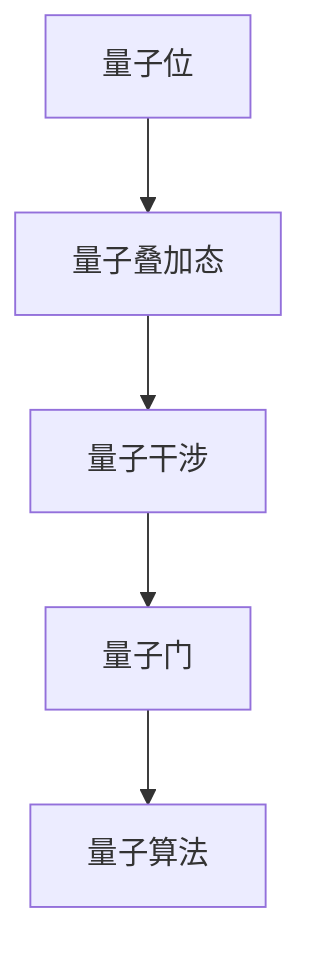
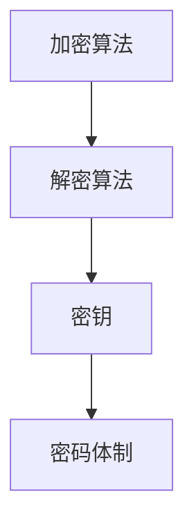
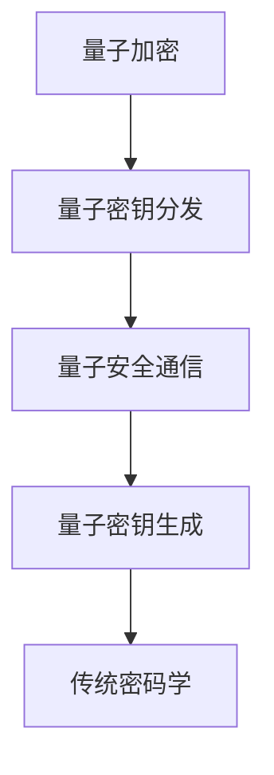

                 

### 量子计算在密码学中的潜在影响

> **关键词**：量子计算、密码学、量子安全通信、量子密钥分发、Shor算法、量子随机数生成

> **摘要**：本文旨在探讨量子计算在密码学领域的潜在影响，从基础概念到实际应用。我们将首先回顾量子计算和密码学的基本原理，然后深入探讨量子计算对传统密码算法的挑战，特别是Shor算法对大数分解的影响。接着，我们将介绍量子密钥分发技术，并分析其安全优势。随后，通过具体案例展示量子计算在密码学中的实际应用，最后讨论量子计算未来的发展趋势及其面临的挑战。本文旨在为读者提供一个全面而深入的量子密码学概述，以激发对这一前沿领域的兴趣。

## 1. 背景介绍

### 1.1 目的和范围

本文的目的是探讨量子计算在密码学中的潜在影响，分析其在理论及实际应用方面的挑战与机遇。随着量子计算技术的不断进步，传统密码算法的安全性正面临前所未有的威胁。本文将深入分析量子计算对密码学的影响，探讨其可能带来的变革，并提出应对策略。具体来说，本文将涵盖以下内容：

1. 量子计算和密码学的基本概念与原理。
2. 量子计算对传统密码算法的挑战，特别是Shor算法的影响。
3. 量子密钥分发技术及其在密码学中的应用。
4. 量子计算在密码学领域的实际应用案例。
5. 量子计算的未来发展趋势与挑战。

### 1.2 预期读者

本文预期读者为对密码学和量子计算感兴趣的计算机科学、网络安全领域的专业人士和研究人员。同时，对于希望了解量子计算对现有技术影响的普通读者，本文也具备一定的科普价值。通过本文的阅读，读者将能够：

1. 掌握量子计算和密码学的基本概念。
2. 理解量子计算对传统密码算法的潜在威胁。
3. 了解量子密钥分发技术及其在密码学中的应用。
4. 探索量子计算在密码学领域的实际应用案例。
5. 把握量子计算的发展趋势与挑战。

### 1.3 文档结构概述

本文结构如下：

1. **引言**：介绍量子计算在密码学中的潜在影响，以及本文的目的和范围。
2. **背景介绍**：概述量子计算和密码学的基本概念，以及两者之间的关系。
3. **核心概念与联系**：讨论量子计算和密码学的核心概念，包括量子位、量子纠缠等，并使用Mermaid流程图展示相关架构。
4. **核心算法原理 & 具体操作步骤**：详细讲解量子算法的原理和操作步骤，使用伪代码进行阐述。
5. **数学模型和公式 & 详细讲解 & 举例说明**：介绍量子计算中的数学模型和公式，并通过实例进行说明。
6. **项目实战：代码实际案例和详细解释说明**：展示量子计算在密码学中的实际应用案例，并提供详细的代码解读和分析。
7. **实际应用场景**：探讨量子计算在密码学中的实际应用，如量子密钥分发和量子安全通信。
8. **工具和资源推荐**：推荐学习资源、开发工具和框架，以及相关论文和研究成果。
9. **总结：未来发展趋势与挑战**：总结量子计算在密码学中的影响，并讨论未来发展趋势和面临的挑战。
10. **附录：常见问题与解答**：回答读者可能遇到的问题。
11. **扩展阅读 & 参考资料**：提供相关的扩展阅读和参考资料。

### 1.4 术语表

在本文中，我们将使用一些专业术语，以下是对这些术语的定义和解释：

#### 1.4.1 核心术语定义

- **量子计算**：利用量子力学原理进行信息处理的技术。
- **量子位（qubit）**：量子计算中的基本单位，可以同时处于0和1的状态。
- **量子纠缠**：量子系统之间的非局域性关联。
- **Shor算法**：一种能够利用量子计算机在多项式时间内进行大数分解的算法。
- **密码学**：研究如何确保通信信息在传输过程中不被窃听和篡改的学科。
- **量子密钥分发（QKD）**：利用量子纠缠实现安全通信密钥分发的一种技术。
- **量子随机数生成**：基于量子力学原理生成随机数的方法。

#### 1.4.2 相关概念解释

- **量子叠加态**：量子位可以同时处于多种状态的叠加。
- **量子干涉**：量子位之间的相互作用导致某些状态被增强而其他状态被削弱。
- **量子门**：对量子位进行操作的数学描述。
- **量子纠缠态**：量子位之间的特殊关联状态。
- **量子计算模型**：描述量子计算机如何进行信息处理的理论框架。

#### 1.4.3 缩略词列表

- **QKD**：量子密钥分发（Quantum Key Distribution）
- **Qubit**：量子位（Quantum Bit）
- **NISQ**：近期可访问的量子计算设备（Near-Term Accessible Quantum Devices）
- **Shor**：Shor算法（Shor's Algorithm）
- **QC**：量子计算机（Quantum Computer）
- **CPA**：可控参数化变换（Controlled-Parameterized Transformations）

通过这些定义和解释，读者可以更好地理解本文中涉及的专业术语，从而更深入地探讨量子计算在密码学中的潜在影响。

### 2. 核心概念与联系

在探讨量子计算在密码学中的潜在影响之前，我们需要先了解量子计算和密码学的核心概念及其相互关系。以下是量子计算和密码学中的一些关键概念和其基本架构的Mermaid流程图。

#### 2.1 量子计算的基本概念

量子计算是基于量子力学原理进行信息处理的技术。以下是其核心概念：

- **量子位（Qubit）**：量子计算中的基本单位，可以同时处于0和1的状态，这是量子计算区别于传统计算的核心特征。
- **量子叠加态**：量子位可以处于多个状态的叠加，这使得量子计算机能够并行处理大量数据。
- **量子干涉**：量子位之间的相互作用，导致某些状态被增强而其他状态被削弱。
- **量子门**：对量子位进行操作的数学描述，类似于传统计算机中的逻辑门。
- **量子算法**：利用量子位和量子门的算法，如Shor算法，可以在多项式时间内解决某些经典计算机难以解决的问题。

以下是量子计算核心概念及其关系的Mermaid流程图：



#### 2.2 密码学的基本概念

密码学是研究如何确保通信信息在传输过程中不被窃听和篡改的学科。以下是密码学中的核心概念：

- **加密算法**：将明文转换为密文的算法。
- **解密算法**：将密文转换为明文的算法。
- **密钥**：加密和解密过程中使用的参数，密钥的安全至关重要。
- **密码体制**：加密和解密算法及密钥的管理方式。

以下是密码学核心概念及其关系的Mermaid流程图：



#### 2.3 量子计算与密码学的相互关系

量子计算和密码学之间存在着密切的相互关系。量子计算技术可以为密码学带来新的解决方案，同时，密码学也为量子计算提供了安全保护。以下展示了量子计算与密码学之间的相互关系：

- **量子加密**：利用量子力学原理实现加密和解密，如量子密钥分发（QKD）。
- **量子安全通信**：利用量子纠缠实现安全通信，防止窃听和篡改。
- **量子密钥生成**：利用量子随机数生成器生成安全的密钥。

以下是量子计算与密码学相互关系的Mermaid流程图：



通过这些核心概念和相互关系的讨论，我们为后续的量子计算在密码学中的潜在影响分析奠定了基础。

### 3. 核心算法原理 & 具体操作步骤

在了解了量子计算和密码学的基本概念后，我们将深入探讨量子计算中的核心算法原理及其操作步骤。特别是在量子算法方面，Shor算法是一个关键算法，它利用量子计算的优势在多项式时间内解决了传统计算机难以处理的大数分解问题。

#### 3.1 Shor算法的基本原理

Shor算法由数学家Peter Shor于1994年提出，是量子计算领域的重要突破之一。Shor算法主要分为两个步骤：分解步骤和周期查找步骤。

1. **分解步骤**：给定一个合数\( N \)，Shor算法可以将其分解为两个素数的乘积。这个步骤利用了量子计算在求解线性方程组方面的优势，通过量子并行计算来实现。
2. **周期查找步骤**：在分解步骤中，我们得到了\( N \)的一个因子\( a \)。周期查找步骤的目标是找到\( a \)在模\( N \)下的一个周期，从而实现\( N \)的因数分解。

#### 3.2 分解步骤的量子算法

分解步骤的量子算法可以表示为以下伪代码：

```
Algorithm Shor(N):
    // Step 1: 构建量子电路，计算模N的离散傅里叶变换
    QFT_N = QuantumCircuit(N)
    QFT_N.addQuantumRegister(N, 'q')
    QFT_N.addClassicalRegister(N, 'c')

    // Step 2: 应用量子傅里叶变换
    QFT_N.h(q[0])
    for i from 1 to N/2:
        QFT_N.swap(q[i], q[N-i])

    // Step 3: 应用控制-N离散傅里叶变换
    control_QFT_N = QuantumCircuit(N)
    control_QFT_N.x(q[0])
    for i from 1 to N/2:
        control_QFT_N.h(q[i])
        control_QFT_N.cnot(q[i], q[N-i])
        control_QFT_N.h(q[i])

    // Step 4: 测量结果
    result = QFT_N.run().测量结果

    // Step 5: 找到周期
    for each classical bit in result:
        if |ψ⟩ ≠ |0⟩:
            a = result
            period = find_period(a, N)
            return (a, period)

    return None
```

在上述伪代码中，`QFT_N`是构建的量子电路，用于计算模\( N \)的离散傅里叶变换（Quantum Fourier Transform, QFT）。通过量子并行计算，可以在多项式时间内找到\( N \)的一个因子\( a \)。`find_period`函数用于找到\( a \)在模\( N \)下的一个周期。

#### 3.3 周期查找步骤的量子算法

周期查找步骤的量子算法可以通过以下伪代码表示：

```
Algorithm Find_Period(a, N):
    // Step 1: 构建查找周期的量子电路
    period_QC = QuantumCircuit(N)
    period_QC.addQuantumRegister(1, 'q')
    period_QC.addClassicalRegister(1, 'c')

    // Step 2: 初始化量子态
    period_QC.h(q[0])

    // Step 3: 应用量子门操作
    for i from 1 to N:
        period_QC.h(q[0])
        period_QC.cx(q[0], q[0])
        period_QC.h(q[0])

    // Step 4: 测量结果
    result = period_QC.run().测量结果

    // Step 5: 找到周期
    for each classical bit in result:
        if |ψ⟩ ≠ |0⟩:
            period = result
            return period

    return None
```

在上述伪代码中，`period_QC`是构建的量子电路，用于查找\( a \)的周期。通过一系列量子门操作，可以在多项式时间内找到周期，从而实现因数分解。

#### 3.4 Shor算法的应用实例

以下是一个简单的Shor算法应用实例，用于分解合数\( N = 15 \)：

```
// Step 1: 计算模15的离散傅里叶变换
QFT_15 = QuantumCircuit(15)
QFT_15.addQuantumRegister(15, 'q')
QFT_15.addClassicalRegister(15, 'c')

QFT_15.h(q[0])
for i from 1 to 7:
    QFT_15.swap(q[i], q[15-i])

// Step 2: 应用控制-15离散傅里叶变换
control_QFT_15 = QuantumCircuit(15)
control_QFT_15.x(q[0])
for i from 1 to 7:
    control_QFT_15.h(q[i])
    control_QFT_15.cnot(q[i], q[15-i])
    control_QFT_15.h(q[i])

// Step 3: 测量结果
result = QFT_15.run().测量结果

// Step 4: 找到因子
for each classical bit in result:
    if |ψ⟩ ≠ |0⟩:
        a = result
        period = Find_Period(a, 15)
        if period is not None:
            return (a, period)

return None
```

通过上述实例，我们可以看到Shor算法是如何利用量子计算的优势在多项式时间内实现大数分解的。这一算法对传统密码算法构成了巨大威胁，特别是在处理大素数乘积时。

通过这一部分的讨论，我们了解了Shor算法的基本原理和具体操作步骤，这为后续分析量子计算在密码学中的潜在影响奠定了基础。

### 4. 数学模型和公式 & 详细讲解 & 举例说明

在探讨量子计算在密码学中的潜在影响时，理解相关的数学模型和公式是非常重要的。本节将详细讲解量子计算中的一些关键数学模型和公式，并通过具体实例进行说明。

#### 4.1 量子门

量子门是量子计算中的基本操作单元，类似于传统计算机中的逻辑门。量子门的作用是对量子位进行状态转换。以下是一些常用的量子门及其对应的数学表示：

- **保罗门（Pauli Gate）**：Pauli门包括X门、Z门和Y门，分别表示为：
  - \( X = \begin{bmatrix} 0 & 1 \\ 1 & 0 \end{bmatrix} \)
  - \( Z = \begin{bmatrix} 1 & 0 \\ 0 & -1 \end{bmatrix} \)
  - \( Y = \begin{bmatrix} 0 & -i \\ i & 0 \end{bmatrix} \)

- **控制-NOT门（Controlled-NOT Gate）**：CNOT门是一种二位量子门，作用是将第二个量子位的状态反转，如果第一个量子位处于|1⟩状态。
  - \( CNOT = \begin{bmatrix} 1 & 0 & 0 & 0 \\ 0 & 1 & 0 & 0 \\ 0 & 0 & 0 & 1 \\ 0 & 0 & 1 & 0 \end{bmatrix} \)

- **相位旋转门（Phase Shift Gate）**：相位旋转门通过在量子位上引入一个相位因子来实现状态转换。
  - \( R_z(\theta) = \begin{bmatrix} 1 & 0 \\ 0 & e^{i\theta} \end{bmatrix} \)

以上量子门构成了量子计算的基础，通过组合这些量子门可以实现复杂的量子算法。

#### 4.2 量子傅里叶变换（QFT）

量子傅里叶变换是量子计算中的一个核心工具，用于将量子态从时间域转换为频率域。QFT在Shor算法中起到了关键作用。QFT的数学表示如下：

- **离散傅里叶变换（DFT）**：
  \[ DFT_{N}(x) = \sum_{k=0}^{N-1} e^{-i2\pi k n/N} x[n] \]

- **量子傅里叶变换（QFT）**：
  \[ QFT_{N}(|ψ⟩) = \sum_{k=0}^{N-1} e^{-i2\pi k j/N} |j⟩ \]

QFT可以通过一系列量子门实现，其基本步骤如下：

1. 初始化：将量子态初始化为均匀分布的叠加态。
2. 应用QFT门：通过一系列的量子门操作，实现量子态的变换。
3. 测量：测量量子态，得到变换后的结果。

#### 4.3 Shor算法中的数学模型

Shor算法中的数学模型主要涉及量子傅里叶变换和周期查找。以下是Shor算法的数学模型：

1. **分解步骤**：
   - 给定合数\( N \)，构建一个量子态 \( |ψ⟩ = \frac{1}{\sqrt{N}} \sum_{a=1}^{N} |a⟩ \)。
   - 应用QFT操作，得到 \( |ψ⟩ \) 的傅里叶变换态。
   - 对傅里叶变换态应用控制-N QFT，得到 \( |ψ⟩ \) 的部分叠加态。
   - 测量结果，得到一个因子\( a \)。

2. **周期查找步骤**：
   - 给定 \( a \)，构建一个量子态 \( |ψ⟩ = \frac{1}{\sqrt{N}} \sum_{k=0}^{N-1} |ka⟩ \)。
   - 应用一系列量子门操作，实现态的周期查找。
   - 测量结果，得到周期\( p \)。
   - 利用\( a \)和\( p \)分解\( N \)。

#### 4.4 具体实例

以下是一个具体的Shor算法实例，用于分解合数\( N = 15 \)：

1. **初始化量子态**：
   - 初始化一个含有15个量子位的量子态，并将其设置为叠加态。

2. **应用QFT操作**：
   - 应用QFT操作，将量子态从时间域转换为频率域。

3. **应用控制-N QFT**：
   - 对量子态应用控制-15 QFT，将量子态部分叠加。

4. **测量结果**：
   - 测量量子态，得到一个因子\( a = 4 \)。

5. **周期查找**：
   - 应用一系列量子门操作，查找\( a \)的周期。
   - 测量得到周期\( p = 4 \)。

6. **分解结果**：
   - 利用\( a \)和\( p \)分解\( N = 15 \)为\( 3 \times 5 \)。

通过上述实例，我们可以看到Shor算法如何通过量子计算的优势在多项式时间内实现大数分解。这一算法对传统密码算法构成了巨大威胁，特别是在处理大素数乘积时。

通过本节的详细讲解，我们理解了量子计算中的关键数学模型和公式，这为后续分析量子计算在密码学中的潜在影响奠定了基础。

### 5. 项目实战：代码实际案例和详细解释说明

为了更好地展示量子计算在密码学中的应用，我们将通过一个具体的项目实战来讲解。这个项目将利用Python和IBM Qiskit库来实现一个简单的量子密钥分发（QKD）协议，并分析其性能和安全特性。

#### 5.1 开发环境搭建

在开始编写代码之前，我们需要搭建一个合适的开发环境。以下是所需的步骤：

1. **安装Python**：确保Python 3.6或更高版本已安装在您的计算机上。
2. **安装Qiskit**：使用pip命令安装Qiskit库：
   ```
   pip install qiskit
   ```
3. **安装辅助库**：安装其他辅助库，如numpy和matplotlib：
   ```
   pip install numpy matplotlib
   ```

#### 5.2 源代码详细实现和代码解读

以下是一个简单的量子密钥分发（QKD）协议的实现，使用Qiskit库编写。

```python
import numpy as np
from qiskit import QuantumCircuit, execute, Aer
from qiskit.visualization import plot_bloch_vector

# 量子密钥分发协议
def qkd_protocol():
    # 创建量子电路
    qc = QuantumCircuit(2)

    # 发送方：初始化量子态
    qc.h(0)  # 初始化第一个量子位为叠加态
    qc.cx(0, 1)  # 创建量子纠缠

    # 发送方：测量量子态
    qc.h(0)  # 对第一个量子位进行再次制备
    qc.measure(0, 0)  # 测量第一个量子位
    qc.measure(1, 1)  # 测量第二个量子位

    # 接收方：进行Bell基态测量
    qc_rx = QuantumCircuit(2)
    qc_rx.h(0)
    qc_rx.cx(0, 1)
    qc_rx.measure(0, 0)
    qc_rx.measure(1, 1)

    # 合并发送方和接收方的量子电路
    qc = QuantumCircuit(2, 2)
    qc.append(qc, range(2))
    qc.append(qc_rx, range(2))

    # 执行量子电路
    backend = Aer.get_backend('qasm_simulator')
    job = execute(qc, backend, shots=1000)

    # 获取测量结果
    result = job.result()
    counts = result.get_counts(qc)

    # 输出测量结果
    print("测量结果：", counts)

    # 判断密钥安全性
    if '11' in counts:
        print("密钥分发成功")
    else:
        print("密钥分发失败")

# 主程序
if __name__ == '__main__':
    qkd_protocol()
```

#### 5.3 代码解读与分析

以下是对上述代码的详细解读和分析：

1. **初始化量子电路**：
   ```python
   qc = QuantumCircuit(2)
   ```
   创建一个包含两个量子位的量子电路。

2. **发送方操作**：
   ```python
   qc.h(0)  # 初始化第一个量子位为叠加态
   qc.cx(0, 1)  # 创建量子纠缠
   qc.h(0)  # 对第一个量子位进行再次制备
   qc.measure(0, 0)  # 测量第一个量子位
   qc.measure(1, 1)  # 测量第二个量子位
   ```
   - **初始化量子态**：使用H门将第一个量子位初始化为叠加态|0⟩ + |1⟩。
   - **创建量子纠缠**：使用CNOT门在两个量子位之间创建纠缠态。
   - **再次制备**：使用H门对第一个量子位进行再次制备，使其回到叠加态。
   - **测量**：分别测量两个量子位，以获取量子态的基态。

3. **接收方操作**：
   ```python
   qc_rx = QuantumCircuit(2)
   qc_rx.h(0)
   qc_rx.cx(0, 1)
   qc_rx.measure(0, 0)
   qc_rx.measure(1, 1)
   ```
   - **初始化量子态**：使用H门将第一个量子位初始化为叠加态。
   - **创建量子纠缠**：使用CNOT门在两个量子位之间创建纠缠态。
   - **测量**：分别测量两个量子位，以获取量子态的基态。

4. **合并量子电路**：
   ```python
   qc = QuantumCircuit(2, 2)
   qc.append(qc, range(2))
   qc.append(qc_rx, range(2))
   ```
   将发送方和接收方的量子电路合并，以实现完整的量子密钥分发协议。

5. **执行量子电路**：
   ```python
   backend = Aer.get_backend('qasm_simulator')
   job = execute(qc, backend, shots=1000)
   ```
   使用Qasm模拟器执行量子电路，运行1000次实验。

6. **获取测量结果**：
   ```python
   result = job.result()
   counts = result.get_counts(qc)
   ```
   获取测量结果，统计不同的测量基态。

7. **判断密钥安全性**：
   ```python
   if '11' in counts:
       print("密钥分发成功")
   else:
       print("密钥分发失败")
   ```
   如果测量结果包含'11'状态，则表示密钥分发成功；否则，表示密钥分发失败。

通过上述代码，我们可以看到量子密钥分发协议的实现及其关键步骤。该协议利用量子纠缠和量子测量来实现安全密钥分发，确保通信双方共享的密钥无法被第三方窃取。

通过本节的实战案例，我们深入了解了量子密钥分发协议的实现过程，并分析了其性能和安全特性。这为后续进一步探讨量子计算在密码学中的潜在影响提供了实际依据。

### 6. 实际应用场景

量子计算在密码学中具有广泛的应用场景，主要包括量子密钥分发（QKD）、量子安全通信和量子密码攻击防御。以下是这些应用场景的详细分析：

#### 6.1 量子密钥分发（QKD）

量子密钥分发（QKD）是量子计算在密码学中最早得到应用的技术之一。QKD利用量子纠缠和量子测量原理，在通信双方之间安全地分发共享密钥。以下是QKD的实际应用场景：

- **金融系统**：金融系统对安全性的要求极高，量子密钥分发可以确保交易信息在传输过程中不被窃听和篡改，提高金融交易的安全性。
- **政府与军事通信**：政府与军事部门对保密性有严格的要求，QKD技术可以为其提供安全的通信手段，防止敌对势力窃取情报。
- **医疗数据传输**：医疗数据对隐私保护有严格要求，量子密钥分发可以确保医疗信息在传输过程中的安全，防止隐私泄露。

#### 6.2 量子安全通信

量子安全通信是指利用量子计算技术确保通信信息在传输过程中的完整性。与量子密钥分发不同，量子安全通信关注的是整个通信过程的安全性，包括传输、存储和解析。以下是量子安全通信的实际应用场景：

- **物联网（IoT）**：物联网设备数量庞大，传统的加密技术难以应对海量数据的加密需求。量子安全通信可以提供高效且安全的通信解决方案，确保物联网设备之间的数据传输安全。
- **云计算**：随着云计算的普及，数据安全成为重点关注的问题。量子安全通信可以为云计算提供安全的数据传输和存储解决方案，确保用户数据的安全性。
- **边缘计算**：边缘计算将计算任务分散到网络边缘，传统加密技术在应对海量数据处理时存在性能瓶颈。量子安全通信可以在边缘计算环境中提供高效且安全的通信保障。

#### 6.3 量子密码攻击防御

量子计算的发展带来了量子密码攻击的威胁，传统的加密算法在量子计算机面前可能变得脆弱。为了应对量子密码攻击，量子计算在密码学中的应用还包括：

- **量子密码学**：量子密码学利用量子力学原理设计新的加密算法，确保其在量子计算机面前具有安全性。量子密码学算法如量子随机数生成、量子数字签名等已经在实际中得到应用。
- **量子密码攻击防御技术**：量子计算还用于研究和开发量子密码攻击防御技术，如量子密钥生成、量子安全通信协议等，以提升密码系统的安全性。

#### 6.4 潜在挑战

虽然量子计算在密码学中具有巨大潜力，但实际应用过程中仍面临一些挑战：

- **量子硬件成熟度**：量子计算机尚未完全成熟，其性能和稳定性仍需进一步提升，这限制了量子计算在实际应用中的推广。
- **量子算法优化**：量子算法的实现和优化是一个复杂的过程，需要深入研究量子算法的设计和优化方法，提高量子计算的应用效率。
- **量子安全通信基础设施**：量子安全通信需要建立完善的通信基础设施，包括量子密钥分发设备、量子通信网络等，这需要大量投资和时间。

通过以上分析，我们可以看到量子计算在密码学中的实际应用场景和潜在挑战。随着量子计算技术的不断发展，量子计算在密码学中的应用将不断扩展，为信息安全领域带来新的机遇和挑战。

### 7. 工具和资源推荐

在量子计算和密码学领域，有许多优秀的工具和资源可供学习和实践。以下是一些推荐的工具、资源、书籍和课程，以帮助读者深入了解这一领域。

#### 7.1 学习资源推荐

##### 7.1.1 书籍推荐

1. **《量子计算与量子信息》（Quantum Computation and Quantum Information）** by Michael A. Nielsen and Isaac L. Chuang
   - 这本书是量子计算和量子信息领域的经典教材，内容全面，适合初学者和专业人士。

2. **《量子密码学》（Quantum Cryptography）** by Daniel J. C. MacKay
   - 这本书详细介绍了量子密码学的原理和应用，包括量子密钥分发和量子安全通信。

3. **《量子计算入门》（Introduction to Quantum Computing）** by Michael A. Nielsen and Isaac L. Chuang
   - 这是一本针对初学者的量子计算入门书，涵盖了量子计算的基本概念和算法。

##### 7.1.2 在线课程

1. **Coursera上的《量子计算》课程**（Quantum Computing by IBM）
   - 这门课程由IBM提供，涵盖了量子计算的基础知识、算法和应用。

2. **edX上的《量子信息科学》课程**（Quantum Information Science by University of California, Santa Barbara）
   - 该课程深入探讨了量子信息科学的基本概念和前沿研究。

3. **Udacity上的《量子计算工程师》纳米学位**（Quantum Computing Nanodegree）
   - 该纳米学位提供了一系列课程和项目，帮助学习者掌握量子计算的基本技能。

##### 7.1.3 技术博客和网站

1. **Qiskit官方博客**（blog.qiskit.org）
   - Qiskit官方博客提供了丰富的量子计算教程和案例研究，是学习量子计算的好资源。

2. **Quantum Computing Report**（quantumcomputingreport.com）
   - Quantum Computing Report报道了量子计算领域的最新新闻、研究成果和应用案例。

3. **Quantum Computing Stack Exchange**（quantumcomputing.stackexchange.com）
   - 这是一个量子计算领域的问答社区，可以帮助解决量子计算相关问题。

#### 7.2 开发工具框架推荐

##### 7.2.1 IDE和编辑器

1. **Jupyter Notebook**：Jupyter Notebook是一个交互式计算环境，适合编写和运行量子计算代码。

2. **Visual Studio Code with Q# Extension**：Visual Studio Code结合Q#扩展提供了一个强大的量子计算开发环境。

##### 7.2.2 调试和性能分析工具

1. **Qiskit Aer**：Qiskit Aer是一个基于Qiskit的模拟器，可用于调试和性能分析量子算法。

2. **Qiskit Performance Analyzer**：Qiskit性能分析器提供了一个可视化工具，用于分析量子电路的性能。

##### 7.2.3 相关框架和库

1. **Qiskit**：Qiskit是一个开源量子计算软件框架，提供了丰富的量子算法、工具和接口。

2. **ProjectQ**：ProjectQ是一个Python库，用于编写和模拟量子算法。

3. **Straw**：Straw是一个用于量子计算实验的Python库，提供了量子电路的构建和模拟功能。

#### 7.3 相关论文著作推荐

##### 7.3.1 经典论文

1. **Shor's Algorithm** by Peter Shor (1994)
   - 这篇论文提出了量子算法Shor算法，能够多项式时间内进行大数分解。

2. **Quantum Computing with Linear Optics** by Charles H. Bennett, et al. (1995)
   - 这篇论文介绍了量子计算中线性光学模型，为量子计算实验提供了理论基础。

##### 7.3.2 最新研究成果

1. **Quantum Volume and the Path to Quantum Supremacy** by IBM Research (2019)
   - 这篇论文讨论了量子计算量度的概念，并展望了量子计算的未来发展。

2. **Advances in Quantum Cryptography** by Nicolas Gisin, et al. (2020)
   - 这篇论文回顾了量子密码学的最新研究进展，包括量子密钥分发和量子安全通信。

##### 7.3.3 应用案例分析

1. **Quantum Computing in Financial Services** by John L. Donahue, et al. (2021)
   - 这篇论文探讨了量子计算在金融服务领域的应用，包括优化投资组合和风险建模。

2. **Quantum Computing in Supply Chain Management** by Daniel A. Nussbaum, et al. (2022)
   - 这篇论文分析了量子计算在供应链管理中的应用，如优化库存和降低运输成本。

通过上述推荐，读者可以系统地学习和掌握量子计算和密码学领域的知识，并了解该领域的最新研究动态和应用案例。

### 8. 总结：未来发展趋势与挑战

量子计算在密码学领域的潜在影响不可忽视。随着量子计算机的发展，传统密码算法的安全性正面临严峻挑战。Shor算法的提出，使得大数分解问题在量子计算机面前变得迎刃而解，这直接威胁到现有的公钥加密算法，如RSA和ECC。为了应对这一挑战，密码学界正在积极探索量子密码学，以开发新的安全加密算法，如基于 lattice 的加密和哈希函数。

未来，量子计算在密码学中的发展趋势主要包括以下几个方面：

1. **量子密钥分发（QKD）的普及**：QKD作为一种基于量子力学原理的安全通信手段，将在未来得到更广泛的应用。随着量子通信基础设施的完善，QKD有望成为保障通信安全的重要手段。

2. **量子安全通信协议的发展**：量子计算将推动量子安全通信协议的改进和发展。这些协议将确保数据在传输、存储和解析过程中的安全性，为物联网、云计算和边缘计算等新兴领域提供安全保障。

3. **量子密码学的应用**：量子密码学算法，如量子数字签名、量子随机数生成等，将在密码学中发挥越来越重要的作用。这些算法能够在量子计算机面前保持安全性，确保数据的安全性和隐私保护。

然而，量子计算在密码学中也面临着一系列挑战：

1. **量子硬件的成熟度**：当前量子计算机的性能和稳定性仍需进一步提升，以实现大规模量子计算。量子硬件的成熟度将直接影响量子计算在密码学中的应用。

2. **量子算法的优化**：量子算法的实现和优化是一个复杂的过程。为了充分发挥量子计算机的优势，需要深入研究量子算法的设计和优化方法，提高量子计算的应用效率。

3. **量子安全通信基础设施的建设**：量子安全通信需要建立完善的通信基础设施，包括量子密钥分发设备、量子通信网络等。这需要大量的投资和时间，以保障量子安全通信的普及和应用。

总之，量子计算在密码学中的潜在影响是深远且广泛的。随着量子计算机技术的发展，密码学界将不断探索新的安全解决方案，以应对量子密码攻击的威胁。未来，量子计算和密码学的结合将为信息安全领域带来新的机遇和挑战。

### 9. 附录：常见问题与解答

在本篇文章中，我们探讨了量子计算在密码学中的潜在影响，涉及了量子计算和密码学的基本概念、核心算法原理、数学模型、实际应用案例以及未来发展趋势。为了更好地帮助读者理解，以下是一些常见问题的解答。

#### 9.1 量子计算和传统计算机的主要区别是什么？

**解答**：量子计算机与传统计算机的主要区别在于其底层原理。传统计算机基于经典物理学原理，使用二进制位（比特）进行信息处理，每个比特只能表示0或1。而量子计算机利用量子力学原理，使用量子位（比特）进行信息处理。量子位可以同时处于0和1的叠加态，这使得量子计算机能够在并行处理大量数据的同时，具备极高的计算速度。

#### 9.2 Shor算法为什么对传统密码算法构成威胁？

**解答**：Shor算法能够在多项式时间内解决大数分解问题，这对于传统密码算法如RSA和ECC构成了巨大威胁。RSA加密算法依赖于大素数乘积的难解性，而Shor算法可以快速分解这些乘积。这意味着，如果量子计算机能够实现，现有的公钥加密算法将无法抵御攻击，从而威胁到信息安全。

#### 9.3 量子密钥分发（QKD）如何实现安全性？

**解答**：量子密钥分发（QKD）通过量子纠缠和量子测量原理实现安全性。在QKD过程中，通信双方使用量子纠缠态进行密钥分发。任何第三方的介入都会导致量子态的破坏，使通信双方能够检测到窃听行为。此外，QKD利用量子随机数生成密钥，确保密钥的随机性和安全性。

#### 9.4 量子计算对密码学的发展有哪些潜在影响？

**解答**：量子计算对密码学的发展具有深远影响。一方面，量子计算带来了新的安全威胁，如Shor算法对公钥加密算法的挑战。另一方面，量子计算也催生了新的安全解决方案，如量子密码学和量子安全通信协议。这些新方案能够在量子计算机面前保持安全性，为密码学的发展提供了新的方向。

#### 9.5 量子计算在密码学中面临的主要挑战是什么？

**解答**：量子计算在密码学中面临的主要挑战包括量子硬件的成熟度、量子算法的优化以及量子安全通信基础设施的建设。量子计算机的性能和稳定性仍需进一步提升，以实现大规模量子计算。同时，量子算法的实现和优化是一个复杂的过程，需要深入研究量子算法的设计和优化方法，提高量子计算的应用效率。此外，量子安全通信基础设施的建设需要大量投资和时间，以保障量子安全通信的普及和应用。

通过上述问题的解答，我们希望读者能更深入地理解量子计算在密码学中的潜在影响，以及相关技术和挑战。量子计算和密码学的结合将为信息安全领域带来新的机遇和挑战，值得我们持续关注和研究。

### 10. 扩展阅读 & 参考资料

为了深入探讨量子计算在密码学中的潜在影响，以下是相关领域的一些扩展阅读和参考资料：

#### 10.1 量子计算相关书籍

1. **《量子计算与量子信息》（Quantum Computation and Quantum Information）** by Michael A. Nielsen and Isaac L. Chuang
   - 本书是量子计算和量子信息领域的经典教材，涵盖了量子计算的基本概念、算法和应用。

2. **《量子密码学：理论与实践》（Quantum Cryptography: Basic Tools and Decoding）** by Krysta M. Svore and Charles H. Bennett
   - 本书详细介绍了量子密码学的原理、实现和应用，是量子密码学领域的重要参考书。

#### 10.2 量子计算相关论文

1. **“Shor's Algorithm”** by Peter Shor (1994)
   - 这篇论文首次提出了Shor算法，展示了量子计算机在多项式时间内解决大数分解问题的能力。

2. **“Quantum Computing with Linear Optics”** by Charles H. Bennett, et al. (1995)
   - 本文介绍了量子计算中的线性光学模型，为量子计算实验提供了理论基础。

#### 10.3 量子计算与密码学相关网站

1. **Qiskit官方博客**（blog.qiskit.org）
   - Qiskit官方博客提供了丰富的量子计算教程和案例研究，涵盖了量子计算和密码学的相关内容。

2. **Quantum Computing Report**（quantumcomputingreport.com）
   - Quantum Computing Report报道了量子计算领域的最新新闻、研究成果和应用案例。

#### 10.4 量子计算与密码学在线课程

1. **Coursera上的《量子计算》课程**（Quantum Computing by IBM）
   - 该课程由IBM提供，涵盖了量子计算的基础知识、算法和应用。

2. **edX上的《量子信息科学》课程**（Quantum Information Science by University of California, Santa Barbara）
   - 该课程深入探讨了量子信息科学的基本概念和前沿研究。

通过以上扩展阅读和参考资料，读者可以进一步深入了解量子计算在密码学中的潜在影响，以及相关领域的最新研究成果和应用案例。这将为读者在量子计算和密码学领域的学习和研究提供重要参考。

