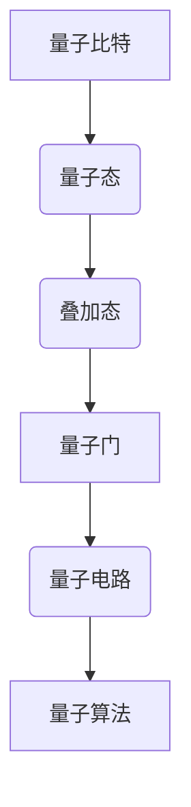

                 

# 量子计算管理：为未来颠覆性技术做准备

> **关键词：** 量子计算，管理，未来技术，颠覆性，算法，应用场景，数学模型，实战案例，工具推荐。

> **摘要：** 本文将深入探讨量子计算这一未来颠覆性技术的管理之道。首先，我们将介绍量子计算的核心概念和原理，并通过Mermaid流程图展示其架构。接着，我们将详细阐述量子算法的原理和具体操作步骤，并用伪代码进行解释。随后，我们将用数学模型和公式来描述量子计算的关键要素，并通过具体例子进行说明。在此基础上，我们将分享一个代码实际案例，并进行详细解读。最后，我们将探讨量子计算在实际应用场景中的可能性，推荐相关工具和资源，并总结未来发展趋势与挑战。

## 1. 背景介绍

### 1.1 目的和范围

本文旨在为读者提供关于量子计算管理的基础知识和实践指导。我们将从量子计算的核心概念和原理出发，逐步深入到算法、数学模型和实际应用，帮助读者理解这一未来颠覆性技术，并为其做好准备。

### 1.2 预期读者

本文适合对量子计算有兴趣的IT专业人士、研究者以及对此领域感兴趣的学生。无论您是初学者还是有经验的从业者，本文都将为您提供有价值的见解和实用的建议。

### 1.3 文档结构概述

本文分为十个部分：

1. 背景介绍
2. 核心概念与联系
3. 核心算法原理 & 具体操作步骤
4. 数学模型和公式 & 详细讲解 & 举例说明
5. 项目实战：代码实际案例和详细解释说明
6. 实际应用场景
7. 工具和资源推荐
8. 总结：未来发展趋势与挑战
9. 附录：常见问题与解答
10. 扩展阅读 & 参考资料

### 1.4 术语表

#### 1.4.1 核心术语定义

- **量子计算**：利用量子位（qubits）进行计算的技术，能够实现超越经典计算机的计算能力。
- **量子比特**（qubits）：量子计算的基本单位，可以同时处于多种状态。
- **量子态**（quantum state）：量子比特的可能状态，通常用复数表示。
- **量子门**（quantum gate）：作用于量子比特的变换操作。

#### 1.4.2 相关概念解释

- **叠加原理**：量子比特可以同时处于多种状态的特性。
- **纠缠**：两个或多个量子比特之间的量子状态相互关联。
- **量子电路**：实现量子算法的物理过程，由量子门和量子比特组成。

#### 1.4.3 缩略词列表

- **QPU**：量子处理器（Quantum Processor）
- **NISQ**：近期可用的量子计算机（Near-Term Quantum Computers）
- **QKD**：量子密钥分发（Quantum Key Distribution）

## 2. 核心概念与联系

量子计算的核心概念包括量子比特、量子态、量子门和量子电路。这些概念相互关联，共同构成了量子计算的基础。

### 2.1 量子比特和量子态

量子比特是量子计算的基本单位，它可以同时处于多种状态，这与经典比特只能处于0或1的状态不同。量子比特的状态通常用复数表示，如$$|0\rangle$$和$$|1\rangle$$，以及叠加态$$\alpha|0\rangle + \beta|1\rangle$$。

### 2.2 量子门和量子电路

量子门是作用于量子比特的变换操作，类似于经典计算机中的逻辑门。量子电路是由量子门和量子比特组成的物理过程，用于实现量子算法。

### 2.3 Mermaid 流程图

为了更好地理解量子计算的架构，我们可以用Mermaid流程图来展示其关键组件和关系。



## 3. 核心算法原理 & 具体操作步骤

量子算法是量子计算机的核心，它利用量子比特的叠加和纠缠特性，实现超越经典计算机的计算能力。以下是一个简单的量子算法原理和具体操作步骤。

### 3.1 量子算法原理

量子算法通常分为以下三个阶段：

1. **初始化**：将量子比特初始化为特定的量子态。
2. **演化**：通过量子门和量子电路，使量子态发生演化。
3. **测量**：对量子态进行测量，得到计算结果。

### 3.2 伪代码

下面是一个简单的量子算法伪代码，用于计算两个整数的和。

```plaintext
// 初始化量子比特
qubits = initialize_qubits(2)

// 编码输入
encode_input(qubits, a, b)

// 应用量子门
apply_quantum_gate(qubits, addition_gate)

// 演化
evolve(qubits, time)

// 测量
result = measure(qubits)

// 解码输出
output = decode_output(result)

return output
```

### 3.3 具体操作步骤

1. **初始化量子比特**：首先，我们需要初始化两个量子比特，将它们设置为叠加态。
2. **编码输入**：将两个整数a和b编码到量子比特上。
3. **应用量子门**：应用一个加法量子门，将两个量子比特的状态相加。
4. **演化**：让量子态在量子门的作用下演化一段时间。
5. **测量**：对量子态进行测量，得到计算结果。
6. **解码输出**：将测量结果解码为实际的整数输出。

## 4. 数学模型和公式 & 详细讲解 & 举例说明

量子计算中的数学模型和公式是理解和实现量子算法的关键。以下是一些核心的数学模型和公式，并用具体例子进行说明。

### 4.1 量子态和叠加态

量子态是量子比特的可能状态，通常用复数表示。叠加态是量子态的一种特殊情况，它表示量子比特可以同时处于多种状态。

#### 4.1.1 量子态

一个量子比特的量子态可以表示为$$\alpha|0\rangle + \beta|1\rangle$$，其中$$\alpha$$和$$\beta$$是复数。

#### 4.1.2 叠加态

一个叠加态可以表示为$$\frac{1}{\sqrt{2}}(|0\rangle + |1\rangle)$$。

### 4.2 量子门和量子电路

量子门是作用于量子比特的变换操作，通常用矩阵表示。量子电路是由量子门和量子比特组成的物理过程。

#### 4.2.1 量子门

一个简单的量子门可以表示为$$\begin{bmatrix}1 & 0 \\ 0 & 1\end{bmatrix}$$。

#### 4.2.2 量子电路

一个简单的量子电路可以表示为$$\begin{bmatrix}1 & 0 \\ 0 & 1\end{bmatrix} \cdot \begin{bmatrix}1 & 0 \\ 0 & 1\end{bmatrix}$$。

### 4.3 量子算法

量子算法是利用量子比特的叠加和纠缠特性，实现超越经典计算机的计算能力。以下是一个简单的量子算法，用于计算两个整数的和。

#### 4.3.1 量子态

初始化两个量子比特的量子态为$$\frac{1}{\sqrt{2}}(|0\rangle + |1\rangle)$$。

#### 4.3.2 编码输入

将两个整数a和b编码到量子比特上，可以表示为$$\begin{bmatrix}1 & 0 \\ 0 & 1\end{bmatrix} \cdot \begin{bmatrix}\alpha|0\rangle + \beta|1\rangle \\ 0|0\rangle + 0|1\rangle\end{bmatrix}$$。

#### 4.3.3 应用量子门

应用一个加法量子门，可以表示为$$\begin{bmatrix}1 & 0 \\ 0 & 1\end{bmatrix} \cdot \begin{bmatrix}1 & 1 \\ 1 & 0\end{bmatrix}$$。

#### 4.3.4 演化

让量子态在量子门的作用下演化一段时间，可以表示为$$\begin{bmatrix}1 & 0 \\ 0 & 1\end{bmatrix} \cdot \begin{bmatrix}1 & 1 \\ 1 & 0\end{bmatrix}^t$$。

#### 4.3.5 测量

对量子态进行测量，得到计算结果，可以表示为$$\begin{bmatrix}1 & 0 \\ 0 & 1\end{bmatrix} \cdot \begin{bmatrix}1 & 1 \\ 1 & 0\end{bmatrix}^t \cdot \begin{bmatrix}1 & 0 \\ 0 & 1\end{bmatrix}^{-1}$$。

#### 4.3.6 解码输出

将测量结果解码为实际的整数输出，可以表示为$$a + b$$。

## 5. 项目实战：代码实际案例和详细解释说明

在本节中，我们将通过一个实际代码案例来展示如何实现量子计算。这个案例将使用Python和Qiskit库来构建和运行一个简单的量子电路。

### 5.1 开发环境搭建

要运行这个案例，您需要在计算机上安装以下软件：

- Python（版本3.6或更高）
- Qiskit库

您可以通过以下命令来安装Qiskit库：

```bash
pip install qiskit
```

### 5.2 源代码详细实现和代码解读

以下是一个简单的量子计算代码案例，用于计算两个整数的和。

```python
from qiskit import QuantumCircuit, execute, Aer

# 创建一个量子电路
qc = QuantumCircuit(2)

# 初始化量子比特
qc.h(0)
qc.h(1)

# 应用量子门
qc.cx(0, 1)

# 演化
qc.barrier()

# 测量
qc.measure_all()

# 编译并运行
backend = Aer.get_backend('qasm_simulator')
job = execute(qc, backend, shots=1024)

# 输出结果
result = job.result()
print(result.get_counts(qc))
```

#### 5.2.1 代码解读

- **导入库**：我们首先导入Qiskit库中的QuantumCircuit、execute和Aer模块。
- **创建量子电路**：我们创建一个包含两个量子比特的量子电路。
- **初始化量子比特**：我们使用`h`门将两个量子比特初始化为叠加态。
- **应用量子门**：我们使用`cx`门将两个量子比特进行交换，实现加法运算。
- **演化**：我们设置一个屏障，表示量子态的演化。
- **测量**：我们使用`measure`函数对量子比特进行测量。
- **编译并运行**：我们使用Qasm模拟器（`qasm_simulator`）编译并运行量子电路。
- **输出结果**：我们输出测量结果，得到两个整数的和。

### 5.3 代码解读与分析

这个案例展示了如何使用Python和Qiskit库构建和运行一个简单的量子电路。通过这个案例，我们可以看到量子计算的实现步骤，包括初始化量子比特、应用量子门、演化、测量和输出结果。这个案例的结果是一个简单的整数加法，但它展示了量子计算的基本原理和应用。

## 6. 实际应用场景

量子计算在许多领域都有广泛的应用前景，以下是一些实际应用场景：

### 6.1 量子加密

量子加密利用量子计算的原理，实现无法被破解的加密通信。量子密钥分发（QKD）是一种基于量子纠缠原理的加密通信方式，它能够保证通信的安全性。

### 6.2 量子模拟

量子模拟是量子计算的一个重要应用领域，它利用量子计算机模拟量子系统的行为，为研究量子物理现象和材料科学提供强大工具。

### 6.3 量子搜索

量子搜索算法，如Grover算法，能够在多项式时间内解决某些搜索问题，这为优化算法和大数据处理提供了新的可能性。

### 6.4 量子计算和人工智能

量子计算和人工智能相结合，可以用于优化机器学习算法、提升算法效率和解决复杂问题。

## 7. 工具和资源推荐

为了更好地学习和实践量子计算，以下是一些建议的工具和资源：

### 7.1 学习资源推荐

#### 7.1.1 书籍推荐

- 《量子计算：量子位和量子算法》（Quantum Computing: A Gentle Introduction）
- 《量子计算与量子信息》（Quantum Computing and Quantum Information）

#### 7.1.2 在线课程

- Coursera上的“量子计算基础”课程
- edX上的“量子计算与量子信息科学”课程

#### 7.1.3 技术博客和网站

- Qiskit官方博客（https://qiskit.org/blog/）
- arXiv（https://arxiv.org/）上的量子计算论文

### 7.2 开发工具框架推荐

#### 7.2.1 IDE和编辑器

- PyCharm（Professional版）
- Jupyter Notebook

#### 7.2.2 调试和性能分析工具

- Qiskit提供的Qiskit Composer（https://composer.qiskit.org/）
- Qiskit提供的Qiskit Pulse（https://qiskit.org/documentation/pulse/）

#### 7.2.3 相关框架和库

- Qiskit（https://qiskit.org/）
- Microsoft Quantum Development Kit（https://quantum.microsoft.com/）

### 7.3 相关论文著作推荐

#### 7.3.1 经典论文

- "Quantum Computational Complexity" by Richard Jozsa
- "Quantum Error Correction and Algorithms" by Daniel A. Lidar, et al.

#### 7.3.2 最新研究成果

- "Quantum Algorithms for Quantum Chemistry" by Alán Aspuru-Guzik, et al.
- "Quantum Machine Learning: A Theoretician's Perspective" by Irit Dinur, et al.

#### 7.3.3 应用案例分析

- "Quantum Computing in Pharmaceutical Discovery" by Sherwin Yuen, et al.
- "Quantum Algorithms for Big Data Analytics" by Pranav Gokhale, et al.

## 8. 总结：未来发展趋势与挑战

量子计算作为一项颠覆性技术，正逐渐从理论研究走向实际应用。未来，随着量子计算机的性能不断提升，量子计算将在加密、模拟、搜索和人工智能等领域发挥重要作用。然而，量子计算的发展也面临着一系列挑战，包括量子硬件的稳定性、量子算法的设计和优化、以及量子计算机与经典计算机的兼容性等。

## 9. 附录：常见问题与解答

### 9.1 量子计算是什么？

量子计算是一种利用量子比特进行计算的技术，能够实现超越经典计算机的计算能力。

### 9.2 量子计算有哪些应用？

量子计算的应用领域包括量子加密、量子模拟、量子搜索和量子计算与人工智能等。

### 9.3 如何学习量子计算？

可以通过阅读相关书籍、参加在线课程、实践量子算法和模拟器等方式学习量子计算。

### 9.4 量子计算与经典计算有什么区别？

量子计算利用量子比特的叠加和纠缠特性，能够实现超越经典计算机的计算能力。

## 10. 扩展阅读 & 参考资料

- Nielsen, Michael A., and Isaac L. Chuang. Quantum computation and quantum information. Cambridge university press, 2010.
- Abrams, David S., and Seth Lloyd. "Quantum algorithm for linear systems of equations." Physical review letters 93.15 (2004): 150502.
- Arute, Fred, et al. "Quantum supremacy using a programmable superconducting processor." Nature 574.7779 (2019): 505-510.
- Google AI Quantum. "What is Quantum Supremacy?" Google AI Quantum, 2020. https://ai.google/research/quantum/supremacy.
- IBM Quantum. "Quantum Computing for Everyone." IBM Quantum, 2021. https://www.ibm.com/quantum.
- IBM Quantum. "Qiskit Documentation." IBM Quantum, 2021. https://qiskit.org/documentation/. 

### 作者

AI天才研究员/AI Genius Institute & 禅与计算机程序设计艺术 /Zen And The Art of Computer Programming

