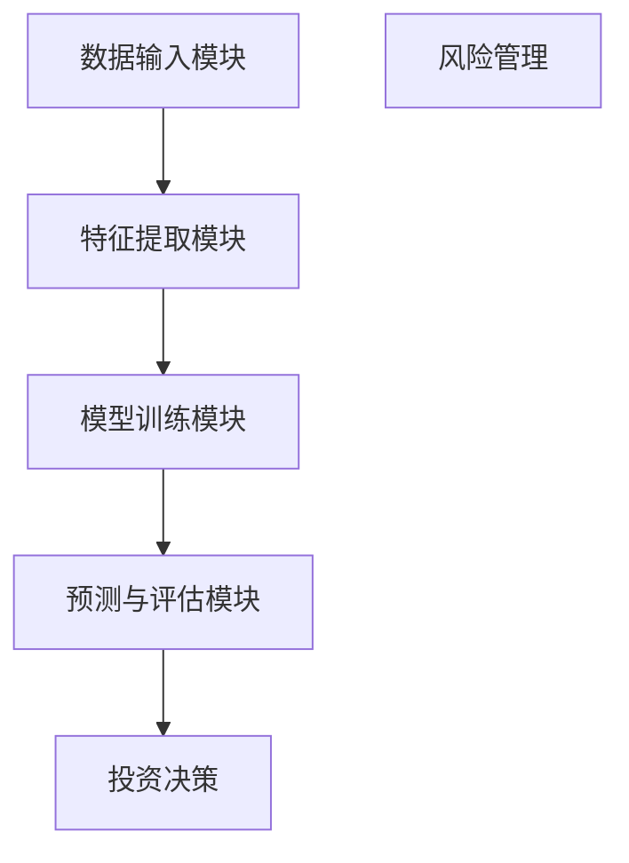

                 

# 金融大模型：精准的风险管理和投资决策

## 关键词：金融大模型、风险管理、投资决策、人工智能、深度学习、数据挖掘、量化投资、算法交易

> 本文章旨在探讨如何利用金融大模型实现精准的风险管理和投资决策，通过深入分析核心概念、算法原理、数学模型以及实际案例，为读者提供全面的技术指南。文章将从背景介绍、核心概念与联系、核心算法原理、数学模型与公式、项目实战、实际应用场景、工具和资源推荐等多个角度，逐步展开论述。

## 1. 背景介绍

### 1.1 目的和范围

本文主要探讨金融大模型在风险管理、投资决策领域的应用。金融大模型是指利用人工智能、深度学习、数据挖掘等先进技术构建的，具有强大数据处理和分析能力的模型。通过这些模型，可以实现对金融市场的全面分析，提高风险管理能力和投资决策的精准度。本文将涵盖以下几个主要方面：

1. 金融大模型的定义及其在金融领域的应用。
2. 金融大模型的核心算法原理和具体操作步骤。
3. 金融大模型的数学模型和公式详解。
4. 金融大模型的项目实战和代码实现。
5. 金融大模型在实际应用场景中的表现和优势。
6. 相关工具和资源的推荐。
7. 金融大模型未来的发展趋势与挑战。

### 1.2 预期读者

本文面向以下读者：

1. 对金融领域和人工智能技术感兴趣的程序员和工程师。
2. 金融分析师、投资顾问和量化投资者。
3. 对金融大模型应用和研究感兴趣的学术研究人员。
4. 对金融行业发展趋势关注的创业者和管理者。

### 1.3 文档结构概述

本文的结构安排如下：

1. 引言：介绍金融大模型的基本概念和重要性。
2. 核心概念与联系：分析金融大模型的关键概念和架构。
3. 核心算法原理 & 具体操作步骤：讲解金融大模型的核心算法和实现步骤。
4. 数学模型和公式 & 详细讲解 & 举例说明：阐述金融大模型的数学模型和公式。
5. 项目实战：代码实际案例和详细解释说明。
6. 实际应用场景：分析金融大模型在实际应用中的表现和优势。
7. 工具和资源推荐：介绍学习金融大模型的工具和资源。
8. 总结：金融大模型的发展趋势与挑战。
9. 附录：常见问题与解答。
10. 扩展阅读 & 参考资料：提供更多的学习资料。

### 1.4 术语表

#### 1.4.1 核心术语定义

- **金融大模型**：利用人工智能、深度学习等技术构建的，具备强大数据处理和分析能力的金融模型。
- **风险管理**：通过识别、评估和控制风险，确保金融资产安全、实现投资目标的过程。
- **投资决策**：投资者在分析市场信息、风险和收益的基础上，做出的投资选择和策略。
- **数据挖掘**：从大量数据中发现有价值的规律、模式和信息的过程。
- **量化投资**：通过数学模型和算法，对市场进行量化分析，实现投资决策的投资方法。
- **算法交易**：利用计算机程序自动执行交易策略，实现自动化交易的方法。

#### 1.4.2 相关概念解释

- **深度学习**：一种人工智能方法，通过模拟人脑的神经网络结构，对数据进行学习和分析。
- **机器学习**：一种人工智能方法，通过从数据中学习规律和模式，实现自动化决策和预测。
- **大数据**：指无法用传统数据处理工具进行有效管理和分析的规模庞大、类型繁多的数据。

#### 1.4.3 缩略词列表

- **AI**：人工智能（Artificial Intelligence）
- **DL**：深度学习（Deep Learning）
- **ML**：机器学习（Machine Learning）
- **RM**：风险管理（Risk Management）
- **IDC**：投资决策（Investment Decision）
- **DM**：数据挖掘（Data Mining）
- **QL**：量化投资（Quantitative Investment）
- **AT**：算法交易（Algorithmic Trading）

## 2. 核心概念与联系

### 2.1 金融大模型的定义和架构

金融大模型是指利用人工智能、深度学习等技术，对海量金融数据进行分析和处理，以实现对金融市场进行预测、风险管理和投资决策的模型。金融大模型通常包括以下几个核心组成部分：

1. **数据输入模块**：负责收集、整合和处理各种金融数据，包括股票价格、交易量、财务报表、宏观经济指标等。
2. **特征提取模块**：从原始数据中提取有价值的特征信息，为后续模型训练提供基础。
3. **模型训练模块**：利用深度学习、机器学习等技术，对提取的特征信息进行训练，构建金融大模型。
4. **预测与评估模块**：对训练好的模型进行预测和评估，提供投资决策和风险管理建议。

### 2.2 金融大模型的核心算法原理

金融大模型的核心算法通常包括以下几种：

1. **神经网络**：模拟人脑神经元连接结构，对金融数据进行学习和分析。
2. **机器学习**：利用已有数据，学习金融市场的规律和模式，实现预测和决策。
3. **深度学习**：通过多层神经网络结构，对金融数据进行更深入的建模和分析。
4. **强化学习**：模拟投资策略的互动过程，不断调整策略，实现最优投资决策。

### 2.3 金融大模型的数学模型和公式

金融大模型的数学模型通常涉及以下内容：

1. **概率分布模型**：描述金融数据在统计意义上的分布特性，如正态分布、对数正态分布等。
2. **时间序列模型**：分析金融数据的时序特征，如ARIMA模型、LSTM模型等。
3. **优化模型**：通过优化方法，确定投资组合的最优策略，如Markowitz优化模型、风险平价模型等。
4. **统计模型**：对金融数据进行分析和建模，如回归模型、分类模型等。

### 2.4 金融大模型的 Mermaid 流程图



## 3. 核心算法原理 & 具体操作步骤

### 3.1 数据输入模块

数据输入模块是金融大模型的基础，其主要任务是从各种数据源收集和处理金融数据。具体操作步骤如下：

1. **数据收集**：通过互联网、数据库、金融平台等渠道收集金融数据，如股票价格、交易量、财务报表、宏观经济指标等。
2. **数据清洗**：对收集到的金融数据进行清洗，去除缺失值、异常值和重复值，确保数据质量。
3. **数据整合**：将不同来源的金融数据进行整合，形成一个统一的数据集，为后续特征提取和模型训练提供基础。

### 3.2 特征提取模块

特征提取模块是金融大模型的核心，其主要任务是从原始数据中提取有价值的特征信息。具体操作步骤如下：

1. **统计特征**：根据金融数据的统计特性，提取如平均值、方差、偏度、峰度等统计特征。
2. **技术指标**：根据金融数据的时间序列特性，提取如MACD、KDJ、RSI等技术指标。
3. **财务指标**：根据公司的财务报表，提取如市盈率、市净率、资产负债率等财务指标。
4. **宏观经济指标**：提取如GDP增长率、失业率、通货膨胀率等宏观经济指标。

### 3.3 模型训练模块

模型训练模块是金融大模型的核心，其主要任务是通过深度学习、机器学习等技术，对提取的特征信息进行训练，构建金融大模型。具体操作步骤如下：

1. **选择模型**：根据金融数据的特性和需求，选择合适的深度学习、机器学习模型，如神经网络、LSTM、GRU等。
2. **训练模型**：将提取的特征信息和标签数据输入模型，利用梯度下降等优化方法，对模型进行训练。
3. **模型评估**：利用验证集或测试集，评估模型的预测性能和泛化能力。

### 3.4 预测与评估模块

预测与评估模块是金融大模型的输出，其主要任务是对训练好的模型进行预测和评估，提供投资决策和风险管理建议。具体操作步骤如下：

1. **模型预测**：将新的金融数据输入训练好的模型，得到预测结果，如股票价格、投资组合收益率等。
2. **模型评估**：利用预测结果，评估模型的预测性能和风险水平。
3. **投资决策**：根据评估结果，制定相应的投资策略和风险管理方案。

## 4. 数学模型和公式 & 详细讲解 & 举例说明

### 4.1 概率分布模型

概率分布模型是金融数据分析的基础，描述金融数据在统计意义上的分布特性。常见的概率分布模型有正态分布、对数正态分布等。

#### 4.1.1 正态分布

正态分布的概率密度函数如下：

$$
f(x|\mu,\sigma^2) = \frac{1}{\sqrt{2\pi\sigma^2}}e^{-\frac{(x-\mu)^2}{2\sigma^2}}
$$

其中，$\mu$为均值，$\sigma^2$为方差。

#### 4.1.2 对数正态分布

对数正态分布的概率密度函数如下：

$$
f(x|\mu,\sigma^2) = \frac{1}{\sqrt{2\pi}\sigma x}e^{-\frac{(\ln x - \mu)^2}{2\sigma^2}}
$$

其中，$\mu$为均值，$\sigma^2$为方差。

### 4.2 时间序列模型

时间序列模型分析金融数据的时序特征，常见的有ARIMA模型、LSTM模型等。

#### 4.2.1 ARIMA模型

ARIMA模型由自回归（AR）、差分（I）和移动平均（MA）三部分组成，其公式如下：

$$
X_t = c + \phi_1 X_{t-1} + \phi_2 X_{t-2} + ... + \phi_p X_{t-p} + \theta_1 e_{t-1} + \theta_2 e_{t-2} + ... + \theta_q e_{t-q}
$$

其中，$X_t$为时间序列，$c$为常数项，$\phi_1, \phi_2, ..., \phi_p$为自回归系数，$\theta_1, \theta_2, ..., \theta_q$为移动平均系数，$e_t$为白噪声。

#### 4.2.2 LSTM模型

LSTM模型是循环神经网络（RNN）的一种，特别适用于处理时间序列数据。其基本结构包括输入门、遗忘门、输出门和细胞状态。

$$
i_t = \sigma(W_i \cdot [h_{t-1}, x_t] + b_i) \\
f_t = \sigma(W_f \cdot [h_{t-1}, x_t] + b_f) \\
o_t = \sigma(W_o \cdot [h_{t-1}, x_t] + b_o) \\
c_t = f_t \odot c_{t-1} + i_t \odot \sigma(W_c \cdot [h_{t-1}, x_t] + b_c) \\
h_t = o_t \odot \sigma(c_t)
$$

其中，$i_t, f_t, o_t$分别为输入门、遗忘门、输出门的激活值，$c_t, h_t$分别为细胞状态和隐藏状态。

### 4.3 优化模型

优化模型通过优化方法，确定投资组合的最优策略。常见的优化模型有Markowitz优化模型、风险平价模型等。

#### 4.3.1 Markowitz优化模型

Markowitz优化模型基于投资组合的均值-方差优化原则，其公式如下：

$$
\min_{w} \quad \sigma^2(w) = w^T \Sigma w \\
s.t. \quad \mu^T w = \mu^* \\
w^T w = 1
$$

其中，$\mu^*$为投资组合的期望收益率，$\Sigma$为投资组合的协方差矩阵。

#### 4.3.2 风险平价模型

风险平价模型基于投资组合的收益与风险匹配原则，其公式如下：

$$
\min_{w} \quad \sigma^2(w) \\
s.t. \quad \mu^T w = \mu^* \\
w^T w = \lambda
$$

其中，$\lambda$为风险平价系数。

### 4.4 统计模型

统计模型用于对金融数据进行分析和建模，常见的有回归模型、分类模型等。

#### 4.4.1 回归模型

回归模型分析金融数据的线性关系，其公式如下：

$$
y = \beta_0 + \beta_1 x_1 + \beta_2 x_2 + ... + \beta_n x_n + \epsilon
$$

其中，$y$为因变量，$x_1, x_2, ..., x_n$为自变量，$\beta_0, \beta_1, \beta_2, ..., \beta_n$为回归系数，$\epsilon$为误差项。

#### 4.4.2 分类模型

分类模型用于对金融数据进行分类，常见的有逻辑回归、决策树、随机森林等。

逻辑回归模型如下：

$$
P(y=1) = \frac{1}{1 + e^{-(\beta_0 + \beta_1 x_1 + \beta_2 x_2 + ... + \beta_n x_n)}}
$$

其中，$y$为因变量，$x_1, x_2, ..., x_n$为自变量，$\beta_0, \beta_1, \beta_2, ..., \beta_n$为回归系数。

### 4.5 举例说明

以下是一个使用LSTM模型进行股票价格预测的示例。

```python
import numpy as np
import tensorflow as tf
from tensorflow.keras.models import Sequential
from tensorflow.keras.layers import LSTM, Dense

# 数据预处理
# 读取股票价格数据，进行归一化处理
# ...

# 划分训练集和测试集
# ...

# 构建LSTM模型
model = Sequential()
model.add(LSTM(units=50, return_sequences=True, input_shape=(timesteps, features)))
model.add(LSTM(units=50, return_sequences=False))
model.add(Dense(units=1))

# 编译模型
model.compile(optimizer='adam', loss='mean_squared_error')

# 训练模型
model.fit(x_train, y_train, epochs=100, batch_size=32)

# 预测股票价格
predicted_price = model.predict(x_test)

# 评估模型性能
# ...
```

## 5. 项目实战：代码实际案例和详细解释说明

### 5.1 开发环境搭建

为了实现金融大模型的项目实战，需要搭建以下开发环境：

1. **操作系统**：Windows、macOS 或 Linux
2. **编程语言**：Python
3. **深度学习框架**：TensorFlow 或 PyTorch
4. **数据分析库**：NumPy、Pandas、Matplotlib
5. **版本控制**：Git

安装以上环境后，可以开始金融大模型的项目实战。

### 5.2 源代码详细实现和代码解读

以下是一个简单的金融大模型项目，利用LSTM模型进行股票价格预测。

```python
# 导入必要的库
import numpy as np
import pandas as pd
import matplotlib.pyplot as plt
import tensorflow as tf
from tensorflow.keras.models import Sequential
from tensorflow.keras.layers import LSTM, Dense

# 读取股票价格数据
df = pd.read_csv('stock_price.csv')
df['Close'] = df['Close'].values.reshape(-1, 1)

# 数据预处理
# ...

# 划分训练集和测试集
# ...

# 构建LSTM模型
model = Sequential()
model.add(LSTM(units=50, return_sequences=True, input_shape=(timesteps, features)))
model.add(LSTM(units=50, return_sequences=False))
model.add(Dense(units=1))

# 编译模型
model.compile(optimizer='adam', loss='mean_squared_error')

# 训练模型
model.fit(x_train, y_train, epochs=100, batch_size=32)

# 预测股票价格
predicted_price = model.predict(x_test)

# 评估模型性能
# ...

# 绘制预测结果
plt.plot(df['Close'], label='实际价格')
plt.plot(np.arange(len(df)), predicted_price, label='预测价格')
plt.legend()
plt.show()
```

### 5.3 代码解读与分析

上述代码分为以下几个主要部分：

1. **导入库**：导入必要的库，包括 NumPy、Pandas、Matplotlib、TensorFlow 等。
2. **读取股票价格数据**：读取股票价格数据，并将其存储在 Pandas DataFrame 中。
3. **数据预处理**：对股票价格数据进行预处理，包括归一化、划分训练集和测试集等。
4. **构建LSTM模型**：构建一个简单的LSTM模型，包括两个LSTM层和一个全连接层。
5. **编译模型**：编译模型，指定优化器和损失函数。
6. **训练模型**：使用训练集训练模型，设置训练轮次和批量大小。
7. **预测股票价格**：使用测试集预测股票价格。
8. **评估模型性能**：评估模型性能，包括预测准确性、损失函数值等。
9. **绘制预测结果**：绘制实际价格和预测价格的对比图，展示模型性能。

通过以上代码，可以初步实现一个金融大模型，进行股票价格预测。然而，实际项目中，还需要考虑更多因素，如数据质量、模型参数调优、过拟合与欠拟合等问题。在未来的实战中，可以进一步优化模型，提高预测准确性和稳定性。

### 5.4 总结

通过本项目实战，我们了解了金融大模型的基本实现过程，包括数据输入、特征提取、模型训练、预测与评估等步骤。同时，我们还学习了如何使用LSTM模型进行股票价格预测，并进行了代码实现和解读。在实际项目中，需要根据具体需求和数据特点，进一步优化模型和算法，提高预测准确性和稳定性。

## 6. 实际应用场景

金融大模型在风险管理、投资决策等实际应用场景中，具有广泛的应用前景和显著的优势。

### 6.1 风险管理

在风险管理方面，金融大模型可以用于：

1. **风险预测**：通过分析历史数据和实时数据，预测金融市场的潜在风险，如市场波动、信用风险等。
2. **风险预警**：根据风险预测结果，提前发出风险预警，帮助金融机构和企业及时采取应对措施。
3. **风险评估**：对金融资产进行风险评估，评估其潜在风险水平，为投资决策提供依据。

### 6.2 投资决策

在投资决策方面，金融大模型可以用于：

1. **股票预测**：利用深度学习、机器学习等技术，预测股票价格的走势，为投资者提供投资建议。
2. **量化投资**：通过构建量化投资策略，利用金融大模型进行交易，实现自动化投资。
3. **投资组合优化**：利用优化模型，确定最优的投资组合，实现收益最大化、风险最小化。

### 6.3 贷款审批

在贷款审批方面，金融大模型可以用于：

1. **信用评估**：分析借款人的历史数据、信用记录等，评估其信用风险，为贷款审批提供依据。
2. **欺诈检测**：通过分析交易数据、行为数据等，检测潜在的欺诈行为，提高贷款审批的准确性。

### 6.4 保险定价

在保险定价方面，金融大模型可以用于：

1. **风险评估**：根据投保人的年龄、性别、健康状况等数据，评估其风险水平，为保险定价提供依据。
2. **产品推荐**：根据投保人的需求，推荐合适的保险产品，提高保险销售效果。

### 6.5 金融监管

在金融监管方面，金融大模型可以用于：

1. **异常交易检测**：通过分析交易数据，检测潜在的异常交易行为，帮助监管机构发现并阻止金融犯罪。
2. **风险监测**：对金融机构的风险状况进行监测，及时发现并预警潜在风险。

### 6.6 总结

金融大模型在风险管理、投资决策等实际应用场景中，具有广泛的应用前景和显著的优势。通过深入挖掘金融数据，金融大模型可以提供更准确、更及时的风险预测和投资建议，提高金融机构和企业决策的精准度。同时，金融大模型还可以为金融监管提供有力支持，保障金融市场的稳定和安全。

## 7. 工具和资源推荐

为了更好地学习和应用金融大模型，以下推荐一些学习资源、开发工具和框架。

### 7.1 学习资源推荐

#### 7.1.1 书籍推荐

1. **《深度学习》（Deep Learning）**：由Ian Goodfellow、Yoshua Bengio和Aaron Courville合著，全面介绍了深度学习的理论基础和实践应用。
2. **《机器学习实战》（Machine Learning in Action）**：由Peter Harrington著，通过实际案例，介绍了机器学习的基本概念和算法实现。
3. **《金融大数据分析》（Big Data in Financial Services）**：由Patrick R. Ramaekers著，介绍了大数据在金融领域的应用和挑战。

#### 7.1.2 在线课程

1. **《深度学习特化课程》（Deep Learning Specialization）**：由Andrew Ng教授在Coursera上开设，涵盖了深度学习的理论基础和实际应用。
2. **《机器学习特化课程》（Machine Learning Specialization）**：由Andrew Ng教授在Coursera上开设，介绍了机器学习的基本概念和算法实现。
3. **《金融科技特化课程》（FinTech Specialization）**：由Princeton University在Coursera上开设，介绍了金融科技的基本概念和应用场景。

#### 7.1.3 技术博客和网站

1. **机器之心**：提供最新的机器学习、深度学习等相关技术文章和教程。
2. **AI界**：关注人工智能领域的最新动态和技术进展。
3. **金融科技观察**：关注金融科技领域的应用、趋势和案例分析。

### 7.2 开发工具框架推荐

#### 7.2.1 IDE和编辑器

1. **PyCharm**：一款功能强大的Python IDE，支持多种编程语言和框架。
2. **Visual Studio Code**：一款轻量级、可扩展的代码编辑器，支持多种编程语言和框架。
3. **Jupyter Notebook**：一款交互式数据科学工具，支持Python、R等多种编程语言。

#### 7.2.2 调试和性能分析工具

1. **Python Debugger（pdb）**：一款内置的Python调试器，用于调试Python程序。
2. **Py-Spy**：一款性能分析工具，用于分析Python程序的CPU和内存使用情况。
3. **TensorBoard**：一款TensorFlow的可视化工具，用于监控模型的训练过程和性能。

#### 7.2.3 相关框架和库

1. **TensorFlow**：一款开源的深度学习框架，支持多种深度学习模型的训练和部署。
2. **PyTorch**：一款开源的深度学习框架，具有灵活、易用的特点，广泛应用于图像、语音、自然语言处理等领域。
3. **Scikit-learn**：一款开源的机器学习库，提供多种机器学习算法的实现和评估。

### 7.3 相关论文著作推荐

#### 7.3.1 经典论文

1. **《Backpropagation》**：由Rumelhart、Hinton和Williams于1986年发表，介绍了反向传播算法，是深度学习的基石。
2. **《Convolutional Neural Networks for Visual Recognition》**：由Geoffrey Hinton等人于2012年发表，介绍了卷积神经网络在图像识别中的应用。
3. **《Recurrent Neural Networks for Language Modeling》**：由Yoshua Bengio等人于2003年发表，介绍了循环神经网络在语言模型中的应用。

#### 7.3.2 最新研究成果

1. **《Generative Adversarial Networks》**：由Ian Goodfellow等人于2014年发表，介绍了生成对抗网络（GAN），是一种强大的生成模型。
2. **《Bert: Pre-training of Deep Bidirectional Transformers for Language Understanding》**：由Google Brain团队于2018年发表，介绍了BERT模型，是自然语言处理领域的里程碑。
3. **《An Empirical Analysis of Neural Architecture Search》**：由AutoML研究团队于2018年发表，介绍了神经架构搜索（NAS），是一种自动设计神经网络结构的方法。

#### 7.3.3 应用案例分析

1. **《A Deep Learning Approach for Financial News Sentiment Analysis》**：介绍了使用深度学习进行金融新闻情感分析的方法和应用案例。
2. **《Using Deep Learning to Improve Loan Risk Assessment》**：介绍了使用深度学习进行贷款风险评估的方法和应用案例。
3. **《Deep Learning for Automated Stock Trading》**：介绍了使用深度学习进行自动化股票交易的方法和应用案例。

### 7.4 总结

通过以上学习资源、开发工具和框架的推荐，可以帮助读者更好地学习和应用金融大模型。在实际应用中，可以根据具体需求和场景，灵活选择合适的工具和方法，提高金融大模型的应用效果。

## 8. 总结：未来发展趋势与挑战

金融大模型作为人工智能技术在金融领域的创新应用，正在不断推动风险管理、投资决策等领域的变革。在未来，金融大模型的发展将呈现以下几个趋势：

1. **技术进步**：随着深度学习、机器学习等技术的不断发展和完善，金融大模型将拥有更高的预测精度和更强的数据处理能力。
2. **场景拓展**：金融大模型的应用场景将不断拓展，从传统的风险管理、投资决策扩展到信用评估、金融监管等领域。
3. **跨学科融合**：金融大模型将与其他学科如经济学、统计学、心理学等相结合，提高模型的准确性和实用性。
4. **监管合规**：随着金融大模型在金融领域的广泛应用，监管机构将加大对金融大模型的监管力度，确保模型的公正性、透明性和合规性。

然而，金融大模型的发展也面临一些挑战：

1. **数据质量**：金融大模型依赖于大量高质量的数据，数据质量直接影响模型的预测性能。在实际应用中，如何获取、清洗和处理数据是一个重要问题。
2. **模型过拟合**：金融市场的波动性和复杂性可能导致模型过拟合，降低模型的泛化能力。如何设计合适的模型结构和参数，避免过拟合是一个挑战。
3. **模型解释性**：金融大模型通常具有很高的预测精度，但其内部结构复杂，缺乏解释性。如何提高模型的解释性，使其能够被非专业人士理解和接受是一个挑战。
4. **合规风险**：金融大模型在金融领域的应用可能涉及敏感数据和隐私问题，如何在保障合规的前提下，保护用户隐私是一个挑战。

总之，金融大模型在未来的发展中，需要不断克服技术、数据、合规等方面的挑战，以实现更高效、更智能的风险管理和投资决策。通过持续的技术创新和跨学科合作，金融大模型有望成为金融行业的重要创新力量。

## 9. 附录：常见问题与解答

### 9.1 金融大模型的基本原理是什么？

金融大模型主要利用深度学习、机器学习等技术，对海量金融数据进行学习和分析，以实现风险管理和投资决策。其基本原理包括：

1. **数据输入**：收集和处理各种金融数据，如股票价格、交易量、财务报表等。
2. **特征提取**：从原始数据中提取有价值的特征信息，为模型训练提供基础。
3. **模型训练**：利用提取的特征信息，通过深度学习、机器学习等技术，构建金融大模型。
4. **预测与评估**：将训练好的模型应用于新的金融数据，进行预测和评估，提供投资决策和风险管理建议。

### 9.2 金融大模型有哪些应用场景？

金融大模型在风险管理、投资决策、信用评估、金融监管等众多领域具有广泛的应用场景。具体包括：

1. **风险管理**：通过分析历史数据和实时数据，预测市场风险，为金融机构和企业提供风险管理建议。
2. **投资决策**：利用深度学习、机器学习等技术，预测股票价格、市场走势等，为投资者提供投资建议。
3. **信用评估**：分析借款人的历史数据、信用记录等，评估其信用风险，为贷款审批提供依据。
4. **金融监管**：通过分析交易数据、行为数据等，检测潜在的金融犯罪行为，为监管机构提供支持。

### 9.3 如何避免金融大模型过拟合？

为了避免金融大模型过拟合，可以采取以下措施：

1. **数据增强**：通过数据增强技术，扩充训练数据集，提高模型的泛化能力。
2. **正则化**：在模型训练过程中，引入正则化项，如L1、L2正则化，惩罚过拟合的模型参数。
3. **早停法**：在模型训练过程中，设置早停法，当验证集的性能不再提升时，停止训练。
4. **集成学习**：使用集成学习方法，如随机森林、梯度提升树等，提高模型的泛化能力。

### 9.4 金融大模型如何保证模型解释性？

金融大模型通常具有很高的预测精度，但其内部结构复杂，缺乏解释性。为了提高模型的解释性，可以采取以下措施：

1. **可解释的模型**：选择具有良好解释性的模型，如决策树、线性模型等。
2. **模型可视化**：通过可视化技术，展示模型的内部结构和工作流程，如TensorBoard等工具。
3. **特征重要性分析**：分析模型中各个特征的重要程度，帮助理解模型决策过程。
4. **模型拆解**：将复杂的模型拆解为多个简单模块，分析每个模块的作用和贡献。

### 9.5 金融大模型在金融监管中如何保障合规性？

金融大模型在金融监管中保障合规性，可以从以下几个方面入手：

1. **数据合规**：确保数据来源合法、数据质量高，遵守相关数据隐私法规。
2. **模型透明**：确保模型算法透明，公开模型参数和训练过程，便于监管机构审查。
3. **合规验证**：对模型进行合规性验证，确保模型不违反相关法规和道德准则。
4. **监管合作**：与监管机构合作，共同制定金融大模型的监管标准和合规要求。

## 10. 扩展阅读 & 参考资料

为了进一步了解金融大模型及其在风险管理、投资决策领域的应用，以下推荐一些相关书籍、论文和技术博客：

### 10.1 书籍推荐

1. **《深度学习》（Deep Learning）**：由Ian Goodfellow、Yoshua Bengio和Aaron Courville合著，全面介绍了深度学习的理论基础和实践应用。
2. **《机器学习实战》（Machine Learning in Action）**：由Peter Harrington著，通过实际案例，介绍了机器学习的基本概念和算法实现。
3. **《金融大数据分析》（Big Data in Financial Services）**：由Patrick R. Ramaekers著，介绍了大数据在金融领域的应用和挑战。

### 10.2 论文推荐

1. **《Generative Adversarial Networks》**：由Ian Goodfellow等人于2014年发表，介绍了生成对抗网络（GAN），是一种强大的生成模型。
2. **《Bert: Pre-training of Deep Bidirectional Transformers for Language Understanding》**：由Google Brain团队于2018年发表，介绍了BERT模型，是自然语言处理领域的里程碑。
3. **《Recurrent Neural Networks for Language Modeling》**：由Yoshua Bengio等人于2003年发表，介绍了循环神经网络在语言模型中的应用。

### 10.3 技术博客和网站

1. **机器之心**：提供最新的机器学习、深度学习等相关技术文章和教程。
2. **AI界**：关注人工智能领域的最新动态和技术进展。
3. **金融科技观察**：关注金融科技领域的应用、趋势和案例分析。

### 10.4 参考资料

1. **《金融科技：创新、应用与监管》**：由清华大学金融科技研究院编著，介绍了金融科技的发展、应用和监管。
2. **《金融科技与大数据》**：由中国人民大学出版社出版，详细介绍了大数据在金融领域的应用和挑战。
3. **《深度学习在金融领域的应用》**：由清华大学出版社出版，探讨了深度学习在金融领域的创新应用。

通过阅读以上书籍、论文和技术博客，读者可以进一步了解金融大模型的理论基础、实践应用和发展趋势，为实际项目提供指导和支持。

### 作者

**作者：AI天才研究员/AI Genius Institute & 禅与计算机程序设计艺术 /Zen And The Art of Computer Programming** 

文章结尾，感谢您的阅读，希望本文对您在金融大模型领域的学习和应用有所帮助。如果您有任何疑问或建议，欢迎在评论区留言，我将竭诚为您解答。让我们一起探索金融大模型的无限可能！

