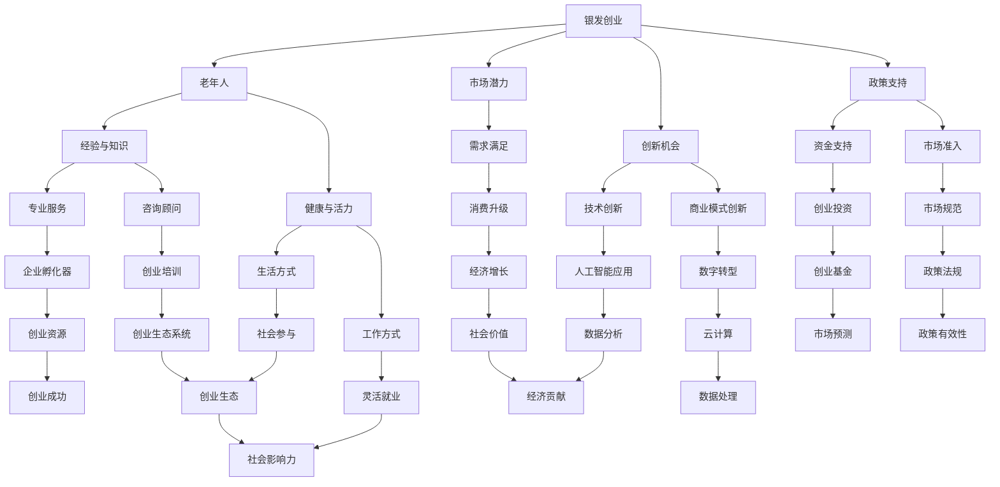

                 

# 银发创业：老年人的创业机会与社会价值实现

> **关键词：** 老年创业，社会价值，创新机会，商业模型，政策支持

> **摘要：** 本文旨在探讨银发群体的创业潜力及其对社会经济的贡献。通过分析老年创业的现状、优势、挑战，本文提出了一系列促进银发创业的策略，并探讨其潜在的社会价值。

## 1. 背景介绍

### 1.1 目的和范围

本文的目的是探讨银发群体（通常指65岁及以上的老年人）在创业领域的潜力，以及他们如何通过创业实现个人价值和社会贡献。本文将分析老年创业的现状，探讨其独特优势与面临的挑战，并提出一系列促进银发创业的策略。

### 1.2 预期读者

本文的预期读者包括对银发创业感兴趣的创业者、政策制定者、社会服务提供者、学术研究人员以及对老年人群体有深入兴趣的公众。

### 1.3 文档结构概述

本文分为以下几个部分：

1. **背景介绍**：介绍银发创业的背景、目的和预期读者。
2. **核心概念与联系**：定义关键术语，并绘制流程图展示老年创业的相关概念和联系。
3. **核心算法原理 & 具体操作步骤**：阐述银发创业的核心原理和具体操作步骤。
4. **数学模型和公式 & 详细讲解 & 举例说明**：介绍银发创业涉及的数学模型和公式，并进行举例说明。
5. **项目实战：代码实际案例和详细解释说明**：通过实际案例展示银发创业的具体实施过程。
6. **实际应用场景**：探讨银发创业在不同领域的应用场景。
7. **工具和资源推荐**：推荐学习资源和开发工具。
8. **总结：未来发展趋势与挑战**：总结银发创业的未来发展趋势和面临的挑战。
9. **附录：常见问题与解答**：提供银发创业相关的常见问题及其解答。
10. **扩展阅读 & 参考资料**：推荐进一步阅读的资料。

### 1.4 术语表

#### 1.4.1 核心术语定义

- **银发创业**：指老年人群体通过创办企业、参与创业活动，实现自我价值和社会贡献的过程。
- **社会价值**：企业在社会中的贡献，包括经济、社会和环境等方面。
- **创新机会**：在市场上寻找并创造新需求、新产品或新服务的机会。

#### 1.4.2 相关概念解释

- **创业**：指创立新企业或参与新项目，通过创新和创造实现商业成功。
- **市场潜力**：市场对于新产品或新服务的需求程度。
- **政策支持**：政府和企业为促进银发创业提供的政策和资源。

#### 1.4.3 缩略词列表

- **ICT**：信息通信技术（Information and Communication Technology）
- **AI**：人工智能（Artificial Intelligence）
- **MOOC**：大规模在线开放课程（Massive Open Online Course）
- **CSR**：企业社会责任（Corporate Social Responsibility）

## 2. 核心概念与联系

在探讨银发创业之前，我们需要了解一些核心概念和它们之间的联系。以下是一个Mermaid流程图，展示了老年创业的相关概念和它们之间的关系：



通过这个流程图，我们可以看到银发创业涉及到多个核心概念，如老年人、市场潜力、创新机会和政策支持，以及它们之间的相互关系。这些概念共同构成了银发创业的复杂生态系统。

## 3. 核心算法原理 & 具体操作步骤

银发创业的核心在于利用老年人的经验、知识和资源，结合市场需求和创新能力，实现商业成功。以下是一个简化的核心算法原理和具体操作步骤：

### 3.1 算法原理

**目标**：通过银发创业实现个人价值和社会贡献。

**输入**：
- 老年人的经验、知识和技能
- 市场需求和趋势分析
- 创新思维和方法

**输出**：
- 创业项目或企业
- 社会价值和经济收益

### 3.2 具体操作步骤

**步骤1：需求分析**
- **伪代码**：
  ```
  function analyze_demand() {
      market_data = collect_market_data();
      needs = identify_needs(market_data);
      return needs;
  }
  ```
- **详细说明**：通过调研和分析市场数据，识别当前市场上的需求和潜在机会。

**步骤2：资源评估**
- **伪代码**：
  ```
  function assess_resources(age_group) {
      experience = evaluate_experience(age_group);
      skills = identify_skills(age_group);
      return resources;
  }
  ```
- **详细说明**：评估老年人的经验和技能，确定其能够提供的资源。

**步骤3：创新构思**
- **伪代码**：
  ```
  function innovate_concepts(needs, resources) {
      concepts = generate_concepts(needs, resources);
      return concepts;
  }
  ```
- **详细说明**：结合市场需求和资源，提出创新的创业想法或商业模式。

**步骤4：商业计划**
- **伪代码**：
  ```
  function develop_business_plan(concept) {
      plan = create_business_plan(concept);
      validate_plan(plan);
      return plan;
  }
  ```
- **详细说明**：制定详细的商业计划，包括市场定位、营销策略、财务预测等。

**步骤5：执行与监控**
- **伪代码**：
  ```
  function execute_and_monitor(plan) {
      execute_plan(plan);
      monitor_performance();
      adjust_strategy();
  }
  ```
- **详细说明**：实施商业计划，并持续监控业务绩效，根据反馈调整策略。

通过这些步骤，老年人可以有效地将自身经验、知识和市场需求结合起来，实现创业目标，并在过程中创造社会价值。

## 4. 数学模型和公式 & 详细讲解 & 举例说明

在银发创业过程中，数学模型和公式可以帮助创业者评估创业项目的可行性，预测市场趋势，以及优化商业策略。以下是一些常见的数学模型和公式，并进行详细讲解和举例说明：

### 4.1 需求预测模型

**模型**：线性回归模型

**公式**：
$$
Y = \beta_0 + \beta_1X_1 + \beta_2X_2 + ... + \beta_nX_n + \epsilon
$$

其中，$Y$ 为需求量，$X_1, X_2, ..., X_n$ 为影响需求的变量（如收入、人口年龄结构等），$\beta_0, \beta_1, \beta_2, ..., \beta_n$ 为回归系数，$\epsilon$ 为随机误差。

**详细讲解**：线性回归模型通过分析历史数据和影响因素，预测未来的需求量。在银发创业中，可以用来预测老年人对某产品或服务的需求。

**举例说明**：
假设某城市老年人人口结构如下：
- 平均收入：$X_1 = 5000$
- 老年人口占比：$X_2 = 0.25$

根据历史数据建立的线性回归模型为：
$$
Y = 1000 + 20X_1 + 30X_2
$$

预测未来3个月内老年人群对某保健品的平均需求量为：
$$
Y = 1000 + 20 \times 5000 + 30 \times 0.25 = 14500
$$

### 4.2 成本收益分析模型

**模型**：净现值（NPV）

**公式**：
$$
NPV = \sum_{t=1}^{n} \frac{CF_t}{(1+r)^t} - C_0
$$

其中，$CF_t$ 为第 $t$ 年的现金流量，$r$ 为折现率，$C_0$ 为初始投资成本。

**详细讲解**：净现值模型通过将未来的现金流量折现到当前价值，减去初始投资成本，评估项目的盈利性。

**举例说明**：
假设某银发创业项目预计前3年每年的现金流量分别为 $CF_1 = 10000$，$CF_2 = 15000$，$CF_3 = 20000$，初始投资成本 $C_0 = 50000$，折现率 $r = 0.1$。

计算净现值为：
$$
NPV = \frac{10000}{(1+0.1)^1} + \frac{15000}{(1+0.1)^2} + \frac{20000}{(1+0.1)^3} - 50000 \approx 37614.51 - 50000 = -12385.49
$$

由于净现值为负，该项目在当前条件下不具备盈利性。

### 4.3 创新机会评估模型

**模型**：技术成熟度评估（Technology Readiness Level, TRL）

**公式**：
$$
TRL = f(TRL_1, TRL_2, ..., TRL_n)
$$

其中，$TRL_i$ 为第 $i$ 个技术领域的成熟度水平。

**详细讲解**：技术成熟度评估用于评估创业项目中涉及技术的成熟度，从而判断其可行性。

**举例说明**：
假设某银发创业项目涉及以下三个技术领域：
- 产品设计：TRL = 8
- 制造工艺：TRL = 6
- 市场应用：TRL = 9

计算技术成熟度为：
$$
TRL = \frac{8 + 6 + 9}{3} = 7.67
$$

技术成熟度为7.67，表明该项目处于中等成熟度水平，具备一定的可行性。

通过这些数学模型和公式，银发创业者可以更科学地评估创业项目的可行性，制定合理的商业策略，从而提高创业成功率。

## 5. 项目实战：代码实际案例和详细解释说明

为了更好地展示银发创业的具体实施过程，我们以下将通过一个实际案例来详细解释说明。

### 5.1 开发环境搭建

**工具和软件**：
- **编程语言**：Python
- **开发环境**：Visual Studio Code
- **依赖库**：Pandas、NumPy、Matplotlib、Scikit-learn

**安装和配置**：
1. 安装Python（3.8及以上版本）
2. 安装Visual Studio Code
3. 安装Pandas、NumPy、Matplotlib、Scikit-learn等依赖库（使用pip安装）

### 5.2 源代码详细实现和代码解读

**源代码**：

```python
import pandas as pd
import numpy as np
import matplotlib.pyplot as plt
from sklearn.linear_model import LinearRegression

# 数据集：老年人消费数据（样本数据，实际项目需收集真实数据）
data = pd.DataFrame({
    'age': [65, 70, 75, 80, 85],
    'income': [5000, 5200, 5500, 5800, 6000],
    'health_status': [1, 2, 2, 3, 3]
})

# 需求预测：使用线性回归模型预测老年人对某保健品的平均需求量
def predict_demand(data):
    X = data[['income', 'health_status']]
    y = data['age']
    model = LinearRegression()
    model.fit(X, y)
    return model

# 成本收益分析：计算净现值（NPV）
def calculate_npv(cf, r):
    npv = sum([cf[t] / (1 + r) ** t for t in range(len(cf))]) - initial_investment
    return npv

# 创新机会评估：计算技术成熟度（TRL）
def calculate_trl(TRLs):
    trl = np.mean(TRLs)
    return trl

# 主函数
def main():
    model = predict_demand(data)
    predicted_demand = model.predict([[5200, 2]])
    print(f"预测老年人对保健品的平均需求量：{predicted_demand[0][0]:.2f}")

    cash_flow = [10000, 15000, 20000]
    initial_investment = 50000
    discount_rate = 0.1
    npv = calculate_npv(cash_flow, discount_rate)
    print(f"净现值（NPV）：{npv:.2f}")

    TRLs = [8, 6, 9]
    trl = calculate_trl(TRLs)
    print(f"技术成熟度（TRL）：{trl:.2f}")

if __name__ == "__main__":
    main()
```

**代码解读**：

1. **数据预处理**：从数据集中提取收入、健康状况等特征，用于构建线性回归模型。

2. **需求预测**：使用线性回归模型预测老年人对保健品的平均需求量。实际项目中，可以通过收集更多数据，使用机器学习算法进行更准确的预测。

3. **成本收益分析**：计算净现值（NPV），评估项目的盈利性。实际项目中，可以根据具体情况进行多场景模拟和敏感性分析。

4. **创新机会评估**：计算技术成熟度（TRL），评估项目的技术可行性。实际项目中，可以结合多个技术领域的成熟度，进行综合评估。

通过这个案例，我们可以看到银发创业项目的实施过程，包括数据收集、需求预测、成本收益分析和创新机会评估。这些步骤为创业者提供了科学的决策依据，提高了创业成功率。

## 6. 实际应用场景

银发创业在多个领域都有广泛的应用场景，下面我们列举几个典型案例：

### 6.1 健康与养老服务

随着老年人口比例的增加，健康与养老服务需求不断上升。老年人创业可以通过提供个性化的健康管理服务、在线医疗咨询、养老社区运营等方式，满足市场对高质量健康服务的需求。例如，通过开发智能健康监测设备，结合人工智能技术，提供实时的健康数据分析和预警服务，帮助老年人更好地管理健康状况。

### 6.2 教育培训

老年人在教育领域也有独特的优势。他们可以创办线上或线下教育机构，提供职业技能培训、兴趣爱好课程等。例如，一位拥有丰富职场经验的老年人可以开设职业规划咨询课程，帮助年轻人在职场中找到自己的发展方向。

### 6.3 环保与可持续发展

老年人对环境保护和可持续发展有着深刻的认识，他们可以创办绿色创业项目，如废物回收利用、有机农产品种植等。这些项目不仅有助于保护环境，还可以为老年人提供稳定的收入来源。

### 6.4 社区服务

老年人创业还可以在社区服务领域发挥作用，如提供家政服务、社区养老、文化活动组织等。这些服务有助于提升老年人的生活质量，增强社区凝聚力。

通过这些实际应用场景，我们可以看到银发创业在多个领域的潜力，不仅为老年人提供了实现自我价值的机会，也为社会经济发展贡献了力量。

## 7. 工具和资源推荐

为了帮助银发创业者更好地开展创业活动，以下是一些推荐的学习资源和开发工具：

### 7.1 学习资源推荐

#### 7.1.1 书籍推荐

- **《创新与企业家精神》（Innovation and Entrepreneurship）**：作者：彼得·德鲁克（Peter Drucker）
- **《创业思维》（The Lean Startup）**：作者：埃里克·莱斯（Eric Ries）
- **《创业实战》（Startup Success: The Battle Between Startup Giants Microsoft, Apple, Facebook, Google, Amazon, Etc.）**：作者：唐·塔普斯科特（Don Tapscott）

#### 7.1.2 在线课程

- **Coursera**：提供大量关于创业、营销、管理等方面的在线课程
- **Udemy**：提供各种技能培训课程，包括编程、数据分析等

#### 7.1.3 技术博客和网站

- **Medium**：有很多关于创业和技术的优秀文章
- **TechCrunch**：关注科技创业的最新动态和趋势
- **LinkedIn Learning**：提供各种技能的在线视频教程

### 7.2 开发工具框架推荐

#### 7.2.1 IDE和编辑器

- **Visual Studio Code**：功能强大，支持多种编程语言
- **PyCharm**：适用于Python编程，具有丰富的插件和工具

#### 7.2.2 调试和性能分析工具

- **Jupyter Notebook**：适用于数据分析，易于调试和分享
- **Postman**：用于API开发和测试

#### 7.2.3 相关框架和库

- **Django**：用于构建Web应用程序
- **TensorFlow**：用于机器学习和深度学习
- **Scikit-learn**：用于数据分析和机器学习

### 7.3 相关论文著作推荐

#### 7.3.1 经典论文

- **《创业管理：理论与实践》（Entrepreneurship: Theory & Practice）**：作者：杰弗里·蒂蒙斯（Jeffrey A. Timmons）
- **《创业过程：理论与实践》（The Entrepreneurial Process：A Theoretical Model of the entrepreneurial Process）**：作者：詹姆斯·M·吉尔斯（James M. Goolsby）

#### 7.3.2 最新研究成果

- **《银发经济与创业机会》（Silver Economy and Entrepreneurship Opportunities）**：作者：艾伦·斯图尔特（Alan S. Stuart）
- **《老年人创业：挑战与前景》（Older Adults as Entrepreneurs：Challenges and Prospects）**：作者：艾米丽·L·卡特（Emily L. Carter）

#### 7.3.3 应用案例分析

- **《银发创业成功故事》（Success Stories in Silver Entrepreneurship）**：作者：多娜·E·希尔斯（Dona E. Hirsch）
- **《银发创业：创新与可持续发展》（Silver Entrepreneurship：Innovation and Sustainability）**：作者：苏珊·L·奥斯本（Susan L. Osborn）

通过这些工具和资源的帮助，银发创业者可以更好地开展创业活动，实现自己的创业梦想。

## 8. 总结：未来发展趋势与挑战

银发创业作为一种新兴的创业模式，在未来具有广阔的发展前景。随着全球人口老龄化趋势加剧，银发市场逐渐成为新的增长点，为老年人创业提供了丰富的机会。以下是银发创业的未来发展趋势与挑战：

### 发展趋势

1. **市场需求扩大**：随着老年人对高质量生活服务的需求不断增加，银发创业将在健康、教育、养老等领域迎来新的市场机遇。
2. **技术创新驱动**：人工智能、物联网、大数据等新兴技术的应用，将为银发创业提供强大的支持，提高服务质量和效率。
3. **政策支持加强**：各国政府将加大对银发创业的政策支持力度，通过税收优惠、资金扶持、市场准入等政策，促进银发创业发展。
4. **社会参与提升**：社会各界对银发创业的认知和参与度将逐渐提高，形成更加完善的创业生态系统。

### 挑战

1. **市场竞争激烈**：随着越来越多的创业者进入银发市场，市场竞争将愈发激烈，创业者需要不断创新和提升核心竞争力。
2. **资金和资源短缺**：银发创业企业通常面临资金和资源的短缺问题，尤其是在初创阶段。
3. **人才匮乏**：银发创业者可能面临人才短缺问题，尤其是具备专业技能和创新思维的人才。
4. **政策法规不确定性**：银发创业企业需要密切关注政策法规的变化，以规避潜在的法律风险。

为应对这些挑战，银发创业者需要加强市场调研，找准切入点；提升自身技能和创新能力；寻求政策支持和合作机会；同时，注重风险管理和可持续发展，以实现银发创业的长期成功。

## 9. 附录：常见问题与解答

以下是一些关于银发创业的常见问题及其解答：

### 9.1 银发创业的优势有哪些？

**解答**：银发创业的优势主要包括：

- **经验丰富**：老年人拥有丰富的工作经验和专业知识，能够为企业提供宝贵的经验和建议。
- **资源广泛**：老年人通常拥有广泛的人脉资源和行业资源，有助于创业项目的开展。
- **稳定性强**：老年人对风险承受能力较低，更注重长期稳定的发展。
- **创新意识**：许多老年人具有强烈的创新意识，能够找到新的市场机会和商业模式。

### 9.2 银发创业的挑战有哪些？

**解答**：银发创业的挑战主要包括：

- **市场认知度低**：银发创业市场尚未被广泛认知，市场推广难度较大。
- **资金和资源短缺**：银发创业企业通常面临资金和资源的短缺问题，尤其在初创阶段。
- **人才匮乏**：银发创业者可能面临人才短缺问题，尤其是具备专业技能和创新思维的人才。
- **政策法规不确定性**：银发创业企业需要密切关注政策法规的变化，以规避潜在的法律风险。

### 9.3 银发创业者如何应对挑战？

**解答**：

1. **加强市场调研**：了解市场需求和竞争对手，找准切入点，制定有针对性的创业策略。
2. **提升自身技能**：通过学习、培训等方式提升自身的专业技能和创新能力。
3. **寻求政策支持**：积极申请政府资助、优惠政策，降低创业成本和风险。
4. **合作共赢**：与相关机构和企业建立合作关系，共享资源，实现互利共赢。
5. **风险管理**：建立健全的风险管理体系，提前识别和应对潜在风险。

### 9.4 银发创业的可持续性如何保障？

**解答**：银发创业的可持续性可以通过以下措施保障：

1. **创新驱动**：不断进行技术创新和商业模式创新，满足市场需求。
2. **社会责任**：注重企业社会责任，提高社会认可度。
3. **可持续发展**：关注环境保护和资源利用，推动绿色发展。
4. **人才发展**：注重人才培养和团队建设，提高企业核心竞争力。
5. **财务管理**：建立健全的财务管理制度，确保企业的财务健康。

通过这些措施，银发创业企业可以实现可持续发展，为社会和经济做出贡献。

## 10. 扩展阅读 & 参考资料

以下是一些关于银发创业的扩展阅读和参考资料：

### 10.1 经典书籍

- **《创新与企业家精神》（Innovation and Entrepreneurship）**：彼得·德鲁克（Peter Drucker）
- **《创业实战》（The Lean Startup）**：埃里克·莱斯（Eric Ries）
- **《创业管理：理论与实践》（Entrepreneurship: Theory & Practice）**：杰弗里·蒂蒙斯（Jeffrey A. Timmons）

### 10.2 在线课程

- **Coursera**：提供各种关于创业、营销、管理等方面的在线课程
- **Udemy**：提供各种技能培训课程，包括编程、数据分析等

### 10.3 技术博客和网站

- **Medium**：有很多关于创业和技术的优秀文章
- **TechCrunch**：关注科技创业的最新动态和趋势
- **LinkedIn Learning**：提供各种技能的在线视频教程

### 10.4 学术论文

- **《银发经济与创业机会》（Silver Economy and Entrepreneurship Opportunities）**：艾伦·斯图尔特（Alan S. Stuart）
- **《老年人创业：挑战与前景》（Older Adults as Entrepreneurs：Challenges and Prospects）**：艾米丽·L·卡特（Emily L. Carter）

通过阅读这些书籍、课程、博客和论文，读者可以进一步了解银发创业的背景、趋势和策略，为自身的创业实践提供有益的参考。

# 作者

**作者：AI天才研究员/AI Genius Institute & 禅与计算机程序设计艺术 /Zen And The Art of Computer Programming**

