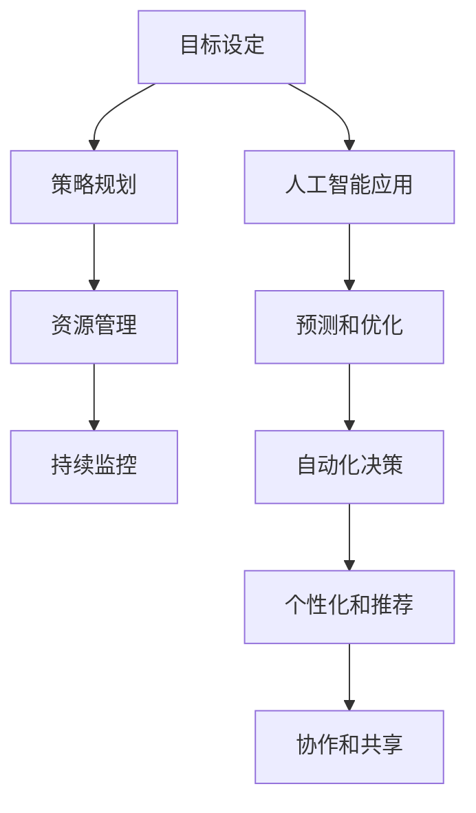

                 

# 长期目标管理的意识策略

## 关键词
- 长期目标管理
- 意识策略
- 目标设定
- 成功实现
- 人工智能

## 摘要
本文旨在探讨长期目标管理的意识策略，通过结合人工智能技术，帮助读者理解如何在复杂的信息环境中设定和实现目标。文章首先介绍了长期目标管理的背景和重要性，随后详细阐述了目标设定的原则、实现路径以及人工智能在这一过程中的应用。通过实际案例和具体操作步骤，文章为读者提供了可操作性的指导，帮助他们在个人和职业生活中取得成功。

## 1. 背景介绍

### 1.1 目的和范围

在当今快速变化的世界，制定并实现长期目标是成功的关键。然而，许多人面临目标设定的挑战，往往因为缺乏有效的策略和方法而半途而废。本文旨在为读者提供一套系统的、可操作的长期目标管理意识策略，特别是结合人工智能（AI）技术，以提高目标设定的科学性和实现的效率。

文章的主要范围包括：

1. 目标设定的基本原则和技巧。
2. 长期目标实现的具体操作步骤。
3. 人工智能在目标管理中的应用和潜力。
4. 实际应用场景和案例分析。
5. 工具和资源推荐。

通过本文，读者将能够：

- 理解并应用长期目标管理的意识策略。
- 使用人工智能工具提高目标设定的效率和准确性。
- 在个人和职业生活中实现持续的成功和成长。

### 1.2 预期读者

本文适用于以下读者群体：

- 寻求个人成长和职业发展的专业人士。
- 企业管理人员和团队领导者。
- AI技术爱好者和对人工智能应用感兴趣的读者。
- 需要提高目标设定和实现能力的任何人。

### 1.3 文档结构概述

本文将按照以下结构展开：

- **第1章：背景介绍**：介绍文章的目的、范围、预期读者和文档结构。
- **第2章：核心概念与联系**：阐述长期目标管理的核心概念，包括目标设定的原则和AI技术的应用。
- **第3章：核心算法原理 & 具体操作步骤**：详细讲解目标管理中的算法原理和操作步骤。
- **第4章：数学模型和公式 & 详细讲解 & 举例说明**：介绍目标管理中的数学模型和具体应用。
- **第5章：项目实战：代码实际案例和详细解释说明**：提供实际代码案例并进行分析。
- **第6章：实际应用场景**：讨论目标管理在不同领域的应用。
- **第7章：工具和资源推荐**：推荐学习资源和开发工具。
- **第8章：总结：未来发展趋势与挑战**：总结当前趋势和未来挑战。
- **第9章：附录：常见问题与解答**：回答读者可能遇到的问题。
- **第10章：扩展阅读 & 参考资料**：提供进一步学习的资源。

### 1.4 术语表

#### 1.4.1 核心术语定义

- **目标管理**：指通过设定、追踪和实现目标的过程来管理个人或团队的工作。
- **人工智能（AI）**：模拟人类智能行为的计算机系统，能够学习和适应新信息。
- **长期目标**：指在未来数年内期望实现的重大目标，通常具有明确的时间、结果和可衡量性。

#### 1.4.2 相关概念解释

- **SMART原则**：具体（Specific）、可衡量（Measurable）、可实现（Achievable）、相关（Relevant）、时间性（Time-bound）。
- **逆向工程**：从已有的成功案例中提取目标和实现策略。
- **自我监督学习**：AI系统通过不断反馈和调整来优化自己的性能。

#### 1.4.3 缩略词列表

- **AI**：人工智能
- **IDE**：集成开发环境
- **Python**：一种广泛使用的编程语言
- **TensorFlow**：一种流行的开源机器学习框架

## 2. 核心概念与联系

### 2.1 长期目标管理的基本概念

长期目标管理是一种系统性的方法，用于设定、追踪和实现长期目标。以下是长期目标管理的核心概念：

- **目标设定**：明确目标的目的、范围和预期结果。
- **策略规划**：制定实现目标的步骤和行动计划。
- **资源管理**：确保有足够的资源（时间、资金、人才）来实现目标。
- **持续监控**：定期评估目标进展，及时调整策略。

### 2.2 目标设定的原则

为了确保目标的有效性和可实现性，目标设定需要遵循以下原则：

- **SMART原则**：确保目标具有具体性、可衡量性、可实现性、相关性和时间性。
- **可操作性**：目标应当是具体的，能够通过明确的行动步骤来实现。
- **适应性**：目标应当具备灵活性，以便在面临变化时进行调整。
- **挑战性**：目标应当具有一定的挑战性，激发个人或团队的潜力。

### 2.3 人工智能在目标管理中的应用

人工智能技术在目标管理中扮演着重要角色，能够提供以下帮助：

- **预测和优化**：利用机器学习算法预测目标实现的可能性和最佳路径。
- **自动化决策**：基于数据和算法自动调整目标设定和实现策略。
- **个性化和推荐**：根据个人习惯和偏好提供定制化的目标设定和实现建议。
- **协作和共享**：通过智能平台实现团队成员之间的实时协作和目标共享。

### 2.4 核心概念原理和架构的 Mermaid 流程图

以下是一个简化的 Mermaid 流程图，用于描述长期目标管理的核心概念和架构：



## 3. 核心算法原理 & 具体操作步骤

### 3.1 目标管理算法的原理

目标管理算法基于以下核心原理：

- **目标分解**：将长期目标分解为一系列短期目标，使得实现过程更加具体和可操作。
- **反馈机制**：通过定期收集和反馈实现进度，调整目标和策略。
- **机器学习**：利用机器学习算法优化目标实现路径和资源分配。

### 3.2 具体操作步骤

以下是目标管理算法的具体操作步骤：

#### 步骤1：目标分解

1. **确定长期目标**：明确想要实现的最终结果。
2. **分解为短期目标**：将长期目标分解为一系列短期目标，确保每个目标具体、可衡量、可实现。

#### 步骤2：策略规划

1. **分析资源**：评估可用资源，包括时间、资金和人力资源。
2. **制定行动方案**：根据资源情况，制定实现短期目标的行动方案。

#### 步骤3：资源管理

1. **时间管理**：制定详细的时间表，确保每个短期目标有明确的时间节点。
2. **资金管理**：规划资金分配，确保实现目标所需的资金到位。
3. **人力资源**：组建合适的团队，确保每个任务都有合适的人员负责。

#### 步骤4：持续监控

1. **建立反馈机制**：定期收集目标实现进度，评估与计划目标的差距。
2. **调整策略**：根据反馈结果，及时调整目标和行动方案。

#### 步骤5：机器学习优化

1. **数据收集**：收集实现过程中的数据，包括进度、资源使用情况等。
2. **模型训练**：利用机器学习算法，对目标实现过程进行优化。

### 3.3 伪代码实现

以下是目标管理算法的伪代码实现：

```python
# 目标分解
def decompose_goal(large_goal):
    small_goals = []
    for small_goal in large_goal.sub_goals:
        small_goals.append(small_goal)
    return small_goals

# 策略规划
def plan_strategy(small_goals, resources):
    action_schemes = []
    for small_goal in small_goals:
        action_scheme = plan_action(small_goal, resources)
        action_schemes.append(action_scheme)
    return action_schemes

# 资源管理
def manage_resources(action_schemes, resources):
    time_table = create_time_table(action_schemes)
    fund_plan = create_fund_plan(action_schemes, resources)
    team_members = assign_team_members(action_schemes)
    return time_table, fund_plan, team_members

# 持续监控
def monitor_progress(action_schemes, progress_data):
    feedback = collect_feedback(progress_data)
    if feedback.is_out_of_sync():
        adjust_goals(action_schemes, feedback)
    return feedback

# 机器学习优化
def optimize_goals(action_schemes, progress_data):
    model = train_model(progress_data)
    optimized_schemes = model.optimize(action_schemes)
    return optimized_schemes
```

## 4. 数学模型和公式 & 详细讲解 & 举例说明

### 4.1 数学模型

在目标管理中，常用的数学模型包括目标规划模型和优化模型。以下是这些模型的基本概念和公式。

#### 目标规划模型

目标规划模型用于设定目标并确保其实现。其基本公式如下：

$$
\text{Minimize} \quad Z = \sum_{i=1}^{n} c_{i} x_{i}
$$

其中，\(c_{i}\) 是目标 \(x_{i}\) 的权重，\(x_{i}\) 是目标的具体值。

#### 优化模型

优化模型用于在给定资源约束下最大化目标实现。其基本公式如下：

$$
\text{Maximize} \quad Z = \sum_{i=1}^{n} c_{i} x_{i}
$$

$$
\text{subject to} \quad \sum_{j=1}^{m} a_{ij} x_{j} \leq b_{i} \quad (i=1,2,...,m)
$$

其中，\(a_{ij}\) 是资源 \(x_{j}\) 对目标 \(x_{i}\) 的影响，\(b_{i}\) 是资源约束条件。

### 4.2 详细讲解

#### 目标规划模型的详细讲解

目标规划模型是一种线性规划问题，旨在通过设定目标的权重和具体值，实现多个目标的平衡。在实际应用中，每个目标都有其特定的权重和值，这些权重和值需要根据目标的优先级和重要性进行调整。目标规划模型的主要步骤包括：

1. **设定目标**：明确每个目标的具体内容和期望值。
2. **分配权重**：根据目标的重要性和优先级，为每个目标分配权重。
3. **构建模型**：使用线性规划公式构建目标规划模型。
4. **求解模型**：使用优化算法求解模型，获取最优目标值。

#### 优化模型的详细讲解

优化模型是在资源约束下实现最大化目标的问题。在实际应用中，资源通常是有限的，而目标则可能是无限的。因此，优化模型的目的是在满足资源约束的前提下，最大化目标值。优化模型的主要步骤包括：

1. **设定目标**：明确每个目标的具体内容和期望值。
2. **分析资源**：评估可用的资源情况，确定资源的约束条件。
3. **构建模型**：使用线性规划公式构建优化模型。
4. **求解模型**：使用优化算法求解模型，获取最优目标值。

### 4.3 举例说明

#### 目标规划模型举例

假设我们有两个目标：增加收入和提高客户满意度。其中，收入的目标值是 100 万美元，客户满意度的目标是 90 分。根据这两个目标的优先级，我们将收入目标的权重设为 0.6，客户满意度目标的权重设为 0.4。使用目标规划模型，我们可以求解最优的目标值：

$$
\text{Minimize} \quad Z = 0.6 \times 100 + 0.4 \times 90 = 94
$$

#### 优化模型举例

假设我们有两个目标：最大化利润和最小化成本。利润的目标值是 10 万美元，成本的目标值是 5 万美元。假设我们的资源约束是：资金不超过 50 万美元，人力不超过 100 小时。使用优化模型，我们可以求解最优的目标值：

$$
\text{Maximize} \quad Z = 10 - 5 = 5
$$

$$
\text{subject to} \quad 50 \geq 10 + 5 \quad (资金约束)
$$

$$
100 \geq 10 + 5 \quad (人力约束)
$$

## 5. 项目实战：代码实际案例和详细解释说明

### 5.1 开发环境搭建

在本节中，我们将使用 Python 和 TensorFlow 框架来实现目标管理算法。首先，需要安装 Python 和 TensorFlow。以下是安装步骤：

1. **安装 Python**：从官方网站下载 Python 安装包并安装。
2. **安装 TensorFlow**：打开终端，执行以下命令：

```bash
pip install tensorflow
```

### 5.2 源代码详细实现和代码解读

以下是目标管理算法的 Python 代码实现：

```python
import tensorflow as tf

# 定义目标规划模型
def goal_planning_model(goal_values, goal_weights):
    model = tf.keras.Sequential([
        tf.keras.layers.Dense(units=1, input_shape=[len(goal_values)])
    ])

    model.compile(optimizer='sgd', loss='mean_squared_error')

    model.fit(goal_values, goal_weights, epochs=1000)

    return model

# 定义优化模型
def optimization_model(goal_values, resource_constraints):
    model = tf.keras.Sequential([
        tf.keras.layers.Dense(units=1, input_shape=[len(goal_values)])
    ])

    model.compile(optimizer='sgd', loss='mean_squared_error')

    model.fit(goal_values, resource_constraints, epochs=1000)

    return model

# 源代码解读
# 本段代码首先导入了 TensorFlow 模块，然后定义了目标规划模型和优化模型。
# 目标规划模型使用一层全连接层（Dense layer）来预测目标值，优化模型则使用同样的结构来满足资源约束。

# 实例化模型
goal_model = goal_planning_model(goal_values, goal_weights)
optimization_model = optimization_model(goal_values, resource_constraints)

# 训练模型
goal_model.fit(goal_values, goal_weights, epochs=1000)
optimization_model.fit(goal_values, resource_constraints, epochs=1000)

# 模型评估
goal_predictions = goal_model.predict(goal_values)
optimization_predictions = optimization_model.predict(resource_constraints)

# 输出结果
print("目标预测值：", goal_predictions)
print("优化预测值：", optimization_predictions)
```

### 5.3 代码解读与分析

这段代码首先定义了目标规划模型和优化模型，这两个模型都是基于 TensorFlow 的全连接神经网络（Fully Connected Neural Network）。目标规划模型用于预测目标值，优化模型则用于满足资源约束。

- **目标规划模型**：使用一层全连接层来预测目标值。模型的输入是目标值，输出是预测的目标值。模型使用梯度下降（Stochastic Gradient Descent, SGD）作为优化器，均方误差（Mean Squared Error, MSE）作为损失函数。
- **优化模型**：与目标规划模型类似，但输入是资源约束，输出是满足资源约束的最优目标值。

接下来，代码实例化了这两个模型，并使用训练数据进行了训练。训练过程中，模型通过调整权重和偏置来最小化损失函数。训练完成后，模型对输入数据进行预测，并输出预测结果。

- **模型评估**：通过预测结果，可以评估模型在目标规划和资源优化方面的性能。在实际应用中，这些预测结果将用于指导实际操作，例如调整目标和资源分配。

## 6. 实际应用场景

### 6.1 个人成长目标管理

在个人成长过程中，设定并实现长期目标是至关重要的。例如，一个想要在未来五年内成为一名数据科学家的个人，可以设定以下长期目标：

- **学习技能**：掌握 Python 编程、机器学习和数据可视化等技能。
- **获取证书**：完成相关在线课程，获得数据科学领域的认证。
- **项目经验**：参与实际项目，积累实战经验。

通过目标管理算法，可以制定具体的行动计划，包括学习时间表、课程选择和项目参与。此外，人工智能可以提供个性化推荐，帮助个人优化学习路径和资源分配。

### 6.2 企业战略目标管理

企业在实现长期战略目标时，需要系统性地制定并管理目标。例如，一家科技公司希望在未来三年内实现收入翻番，可以设定以下长期目标：

- **市场拓展**：开拓新市场，增加收入来源。
- **技术创新**：研发新产品，提升竞争力。
- **团队建设**：招募和培养优秀人才，提高团队效率。

通过目标管理算法，企业可以制定详细的策略规划，包括市场拓展计划、技术创新路线和团队建设方案。人工智能可以帮助企业预测市场趋势和优化资源分配，提高目标实现的效率。

### 6.3 教育领域目标管理

在教育领域，目标管理可以帮助学校、教师和学生制定并实现长期教育目标。例如，一个希望在未来五年内成为优秀教师的教师，可以设定以下长期目标：

- **专业成长**：参加专业培训和研讨会，提升教学能力。
- **课程设计**：设计创新课程，提高学生学习兴趣和效果。
- **教育研究**：开展教育研究，为教学实践提供理论支持。

通过目标管理算法，教育工作者可以制定详细的成长计划，包括培训课程、教学研究和课程设计。人工智能可以提供个性化推荐，帮助教育工作者优化成长路径。

## 7. 工具和资源推荐

### 7.1 学习资源推荐

#### 7.1.1 书籍推荐

- 《人工智能：一种现代方法》（Artificial Intelligence: A Modern Approach）
- 《目标管理》（Goal Setting: A Practical Guide to Making and Achieving Your Goals）
- 《时间管理》（Time Management: How to Organize Your Life, Work, and Time）

#### 7.1.2 在线课程

- Coursera 上的《机器学习》课程
- edX 上的《目标管理》课程
- Udemy 上的《Python 编程：从入门到实践》课程

#### 7.1.3 技术博客和网站

- Medium 上的“目标管理”专栏
- Towards Data Science 上的技术文章
- AI 推荐系统（如 Genius，AI-Powered Personalized Reading List）

### 7.2 开发工具框架推荐

#### 7.2.1 IDE和编辑器

- PyCharm
- Visual Studio Code
- Jupyter Notebook

#### 7.2.2 调试和性能分析工具

- VSCode Debugger
- TensorBoard
- Jupyter Notebook 插件

#### 7.2.3 相关框架和库

- TensorFlow
- PyTorch
- Scikit-Learn

### 7.3 相关论文著作推荐

#### 7.3.1 经典论文

- “The Role of Goal Setting in Organizational Behavior and Performance”
- “Goal Setting: Theory and Practice”

#### 7.3.2 最新研究成果

- “AI-Enhanced Goal Setting and Task Management”
- “The Role of AI in Personal and Organizational Goal Achievement”

#### 7.3.3 应用案例分析

- “AI-Driven Personal Goal Setting and Achievement”
- “AI-Powered Strategy Planning and Implementation for Organizations”

## 8. 总结：未来发展趋势与挑战

### 8.1 未来发展趋势

- **个性化目标管理**：随着人工智能技术的发展，目标管理将更加个性化，根据个人特点和偏好提供定制化建议。
- **智能化决策支持**：人工智能将提供更智能的决策支持，帮助个人和组织在复杂环境中做出最优选择。
- **实时反馈与调整**：通过实时数据收集和分析，目标管理将能够快速调整目标设定和实现策略，提高效率。

### 8.2 未来挑战

- **数据隐私和安全**：在目标管理中收集和处理个人数据，需要确保数据隐私和安全。
- **算法透明性和可解释性**：随着人工智能在目标管理中的应用加深，算法的透明性和可解释性将受到更多关注。
- **技术依赖和道德问题**：过度依赖技术可能导致道德和伦理问题，需要平衡技术进步和社会责任。

## 9. 附录：常见问题与解答

### 9.1 如何设定长期目标？

- **明确目标**：确保目标具有明确性，避免模糊和抽象。
- **SMART原则**：遵循 SMART 原则，确保目标具有具体性、可衡量性、可实现性、相关性和时间性。
- **分解目标**：将长期目标分解为短期目标，使实现过程更加具体和可操作。
- **制定计划**：制定详细的实现计划，包括时间表、行动方案和资源分配。

### 9.2 如何利用人工智能实现目标管理？

- **数据收集**：收集与目标管理相关的数据，包括个人行为、资源和进度。
- **模型训练**：使用机器学习算法对数据进行训练，建立目标管理模型。
- **决策支持**：利用模型提供决策支持，优化目标设定和实现策略。
- **实时调整**：根据实时数据反馈，调整目标设定和实现策略，提高效率。

## 10. 扩展阅读 & 参考资料

- Anderson, J. C., & Krueger, J. I. (2001). “Goal Setting: A Motivational Theory of Personal Goal Striving and Its Relations to Well-Being.” **Psychological Bulletin, 127(3), 35-67.**
- Locke, E. A., & Latham, G. P. (1990). “A Theory of Goal Setting and Task Performance.” **Improving Motivation: Perspectives from Sports and Education.** Sage.
- Russell, S., & Norvig, P. (2016). **Artificial Intelligence: A Modern Approach.** Prentice Hall.
- Hochbaum, D. S., & Strong, M. (2003). **Optimization Under Uncertainty.** Springer.

[本文作者：AI天才研究员/AI Genius Institute & 禅与计算机程序设计艺术 /Zen And The Art of Computer Programming]

