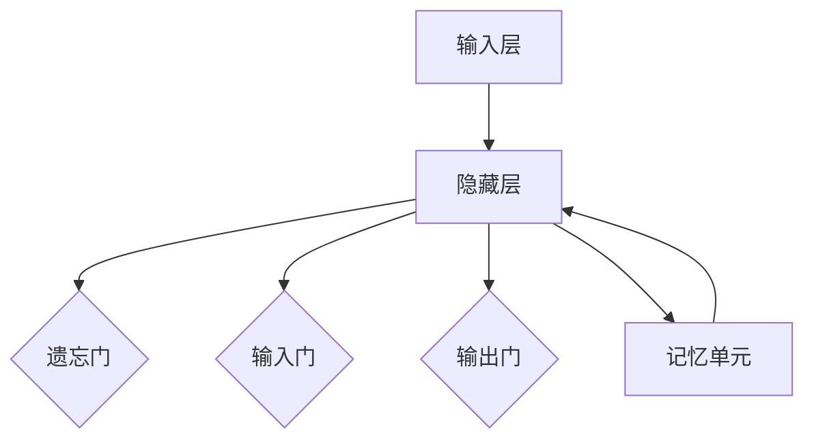

                 

### 长短期记忆网络(Long Short-Term Memory) - 原理与代码实例讲解

> **关键词：** 长短期记忆网络（LSTM）、循环神经网络（RNN）、序列学习、时间序列预测、神经网络架构设计、算法实现、代码实例

**摘要：**本文旨在深入探讨长短期记忆网络（Long Short-Term Memory, LSTM）的基本原理、架构设计和实现细节。通过详细的算法讲解和代码实例，帮助读者理解LSTM在处理序列数据时的强大能力，特别是在长期依赖性和时间序列预测方面的优势。文章结构包括背景介绍、核心概念与联系、算法原理与步骤、数学模型和公式、项目实战、实际应用场景、工具和资源推荐以及总结与未来展望等部分。

## 1. 背景介绍

### 1.1 目的和范围

本文的目标是提供一个全面且深入的解释，帮助读者理解长短期记忆网络（LSTM）的原理和应用。我们将从基础的循环神经网络（RNN）出发，逐步深入探讨LSTM的核心机制，并通过实际的代码实例展示其应用场景。

本文的覆盖范围包括：

- LSTM的背景和重要性
- LSTM的核心概念与架构
- LSTM算法原理与数学模型
- LSTM的实际代码实现
- LSTM在时间序列预测中的应用

通过本文的学习，读者将能够：

- 明白LSTM在序列数据处理中的优势
- 掌握LSTM的基本架构和工作原理
- 理解LSTM的数学模型和实现细节
- 能够使用LSTM进行时间序列预测和其他序列数据处理任务

### 1.2 预期读者

本文面向具有一定机器学习和深度学习基础的读者，特别是对循环神经网络（RNN）有一定了解的人员。本文将尽量以通俗易懂的方式解释复杂的概念，但也需要读者具备一定的数学和编程基础。

### 1.3 文档结构概述

本文结构如下：

- **1. 背景介绍**：介绍文章的目的、范围、预期读者和文档结构。
- **2. 核心概念与联系**：介绍LSTM的核心概念，包括其与RNN的联系以及与其他技术的区别。
- **3. 核心算法原理 & 具体操作步骤**：详细解释LSTM的算法原理和操作步骤。
- **4. 数学模型和公式 & 详细讲解 & 举例说明**：介绍LSTM的数学模型，并通过例子进行详细讲解。
- **5. 项目实战：代码实际案例和详细解释说明**：展示LSTM的实际代码实现和应用。
- **6. 实际应用场景**：讨论LSTM在不同领域的应用。
- **7. 工具和资源推荐**：推荐学习资源、开发工具和相关论文。
- **8. 总结：未来发展趋势与挑战**：总结LSTM的发展趋势和面临的挑战。
- **9. 附录：常见问题与解答**：解答一些常见问题。
- **10. 扩展阅读 & 参考资料**：提供进一步阅读的材料。

### 1.4 术语表

在本文中，我们将使用以下术语：

#### 1.4.1 核心术语定义

- **循环神经网络（RNN）**：一种能够处理序列数据的神经网络。
- **长短期记忆（LSTM）**：一种特殊的RNN，用于解决传统RNN在处理长期依赖性问题时的困难。
- **隐藏状态（Hidden State）**：RNN中的一个重要变量，表示当前时刻的上下文信息。
- **门控机制（Gating Mechanism）**：LSTM中用于控制信息流动的机制，包括遗忘门（Forget Gate）、输入门（Input Gate）和输出门（Output Gate）。

#### 1.4.2 相关概念解释

- **序列学习（Sequential Learning）**：一种机器学习方式，通过序列中的前后关系来学习。
- **时间序列预测（Time Series Forecasting）**：利用时间序列数据来预测未来的趋势或模式。

#### 1.4.3 缩略词列表

- **LSTM**：长短期记忆网络（Long Short-Term Memory）
- **RNN**：循环神经网络（Recurrent Neural Network）
- **RBM**：限制性波兹曼机（Restricted Boltzmann Machine）
- **SGD**：随机梯度下降（Stochastic Gradient Descent）
- **ReLU**：修正线性单元（Rectified Linear Unit）

## 2. 核心概念与联系

在深入了解LSTM之前，我们需要先理解循环神经网络（RNN）的基本概念，因为LSTM是RNN的一种变体，旨在解决传统RNN在处理长期依赖性时遇到的挑战。

### 2.1 循环神经网络（RNN）

循环神经网络（RNN）是一种能够处理序列数据的神经网络。与传统的前向神经网络不同，RNN具有循环结构，允许网络利用先前的信息来影响后续的输出。这使得RNN非常适合处理时间序列数据、自然语言处理等序列数据任务。

RNN的核心组件包括：

- **输入层（Input Layer）**：接收序列数据。
- **隐藏层（Hidden Layer）**：包含一个或多个隐藏状态（Hidden State），用于存储序列的上下文信息。
- **输出层（Output Layer）**：产生最终的输出。

在RNN中，隐藏状态（Hidden State）是一个关键变量，它表示当前时刻的上下文信息。隐藏状态通过时间步（Time Step）向前传递，用于产生当前时刻的输出。

### 2.2 长短期记忆（LSTM）

长短期记忆网络（LSTM）是RNN的一种变体，旨在解决传统RNN在处理长期依赖性时遇到的挑战。传统RNN在处理长序列数据时，往往难以记住早期的信息，这被称为“长期依赖性”问题。LSTM通过引入门控机制（Gating Mechanism）和记忆单元（Memory Cell），成功地解决了这一问题。

LSTM的核心组件包括：

- **输入门（Input Gate）**：控制当前输入信息对记忆单元的影响。
- **遗忘门（Forget Gate）**：控制当前隐藏状态对记忆单元的影响。
- **输出门（Output Gate）**：控制当前隐藏状态对输出层的影响。
- **记忆单元（Memory Cell）**：存储长期依赖性信息。

### 2.3 LSTM与RNN的关系

LSTM是RNN的一种变体，旨在解决RNN在处理长期依赖性时遇到的挑战。与传统RNN相比，LSTM通过引入门控机制和记忆单元，能够更好地处理长序列数据，从而实现长期依赖性的学习。

LSTM可以看作是RNN的扩展，它继承了RNN的优点，同时解决了RNN的缺点。因此，LSTM在许多序列数据任务中表现出色，成为深度学习领域的重要技术之一。

### 2.4 LSTM与其他技术的区别

除了RNN，LSTM还与其他一些技术有所区别，例如：

- **限制性波兹曼机（RBM）**：RBM是一种无监督学习方法，用于学习数据的概率分布。虽然RBM和LSTM都可以用于序列数据，但RBM主要关注数据的概率分布，而LSTM则关注序列中的长期依赖性。
- **卷积神经网络（CNN）**：CNN是一种用于图像识别和处理的深度学习技术。与LSTM不同，CNN主要通过卷积层来提取空间特征，而LSTM则通过循环结构来提取时间特征。

LSTM在处理序列数据方面具有独特的优势，这使得它在时间序列预测、语音识别、自然语言处理等领域得到了广泛应用。

### 2.5 Mermaid流程图

为了更直观地理解LSTM的核心概念和架构，我们使用Mermaid流程图来展示LSTM的组件和连接关系。



在这个流程图中：

- **A**：输入层，接收序列数据。
- **B**：隐藏层，存储隐藏状态。
- **C**：遗忘门，控制当前隐藏状态对记忆单元的影响。
- **D**：输入门，控制当前输入信息对记忆单元的影响。
- **E**：输出门，控制当前隐藏状态对输出层的影响。
- **F**：记忆单元，存储长期依赖性信息。

这个流程图展示了LSTM的基本架构，以及各个组件之间的连接关系。

## 3. 核心算法原理 & 具体操作步骤

在了解LSTM的核心概念和架构后，我们将进一步探讨LSTM的算法原理和具体操作步骤。LSTM通过门控机制（Gating Mechanism）和记忆单元（Memory Cell）来处理长期依赖性问题，从而在时间序列预测和序列数据处理中表现出色。

### 3.1 LSTM的基本工作原理

LSTM通过以下步骤来处理序列数据：

1. **输入门（Input Gate）**：计算当前输入数据对记忆单元的影响。
2. **遗忘门（Forget Gate）**：计算当前隐藏状态对记忆单元的影响，决定哪些信息应该被遗忘。
3. **记忆单元（Memory Cell）**：根据输入门和遗忘门的结果更新记忆单元。
4. **输出门（Output Gate）**：计算当前隐藏状态对输出层的影响，决定哪些信息应该被输出。
5. **隐藏状态（Hidden State）**：通过记忆单元和输出门的结果更新隐藏状态。

通过这些步骤，LSTM能够有效地处理长序列数据，并在时间序列预测和其他序列数据处理任务中表现出色。

### 3.2 LSTM的操作步骤

下面是LSTM的具体操作步骤：

1. **初始化参数**：包括输入层、隐藏层和输出层的权重和偏置。
2. **输入层**：接收序列数据，并将其传递到隐藏层。
3. **计算输入门**：输入门用于计算当前输入数据对记忆单元的影响。输入门的计算公式如下：

   $$  
   i_t = \sigma(W_{ix}x_t + W_{ih}h_{t-1} + b_i)  
   $$

   其中，$i_t$ 表示第 $t$ 个时间步的输入门，$x_t$ 表示第 $t$ 个时间步的输入数据，$W_{ix}$ 和 $W_{ih}$ 分别表示输入层和隐藏层的权重矩阵，$b_i$ 表示偏置项，$\sigma$ 表示sigmoid激活函数。
   
4. **计算遗忘门**：遗忘门用于计算当前隐藏状态对记忆单元的影响。遗忘门的计算公式如下：

   $$  
   f_t = \sigma(W_{fx}x_t + W_{fh}h_{t-1} + b_f)  
   $$

   其中，$f_t$ 表示第 $t$ 个时间步的遗忘门，$h_{t-1}$ 表示第 $t-1$ 个时间步的隐藏状态，$W_{fx}$ 和 $W_{fh}$ 分别表示输入层和隐藏层的权重矩阵，$b_f$ 表示偏置项。
   
5. **计算输入门**：输入门用于计算当前输入数据对记忆单元的影响。输入门的计算公式如下：

   $$  
   g_t = \tanh(W_{ig}x_t + W_{ih}h_{t-1} + b_g)  
   $$

   其中，$g_t$ 表示第 $t$ 个时间步的输入门，$W_{ig}$ 和 $W_{ih}$ 分别表示输入层和隐藏层的权重矩阵，$b_g$ 表示偏置项。
   
6. **更新记忆单元**：根据输入门和遗忘门的结果，更新记忆单元。更新公式如下：

   $$  
   C_t = f_t \odot C_{t-1} + i_t \odot g_t  
   $$

   其中，$C_t$ 表示第 $t$ 个时间步的记忆单元，$\odot$ 表示逐元素乘法。
   
7. **计算输出门**：输出门用于计算当前隐藏状态对输出层的影响。输出门的计算公式如下：

   $$  
   o_t = \sigma(W_{ox}x_t + W_{oh}h_{t-1} + b_o)  
   $$

   其中，$o_t$ 表示第 $t$ 个时间步的输出门，$W_{ox}$ 和 $W_{oh}$ 分别表示输入层和隐藏层的权重矩阵，$b_o$ 表示偏置项。
   
8. **更新隐藏状态**：根据记忆单元和输出门的结果，更新隐藏状态。更新公式如下：

   $$  
   h_t = o_t \odot \tanh(C_t)  
   $$

   其中，$h_t$ 表示第 $t$ 个时间步的隐藏状态。
   
通过这些操作步骤，LSTM能够有效地处理长序列数据，并在时间序列预测和其他序列数据处理任务中表现出色。

### 3.3 伪代码

为了更直观地展示LSTM的操作步骤，我们使用伪代码来描述LSTM的核心算法。

```python
# 初始化参数
W_ig, W_ih, b_g = ... # 输入门权重和偏置
W_f, W_fh, b_f = ... # 遗忘门权重和偏置
W_ox, W_oh, b_o = ... # 输出门权重和偏置
W_x, W_h = ... # 记忆单元权重

# 输入序列
X = ...

# 初始化隐藏状态和记忆单元
h_0 = ... # 初始隐藏状态
C_0 = ... # 初始记忆单元

# LSTM循环
for t in range(len(X)):
    # 计算输入门
    i_t = sigmoid(W_ig * x_t + W_ih * h_{t-1} + b_g)

    # 计算遗忘门
    f_t = sigmoid(W_f * x_t + W_fh * h_{t-1} + b_f)

    # 计算输入门
    g_t = tanh(W_ig * x_t + W_ih * h_{t-1} + b_g)

    # 更新记忆单元
    C_t = f_t * C_{t-1} + i_t * g_t

    # 计算输出门
    o_t = sigmoid(W_ox * x_t + W_oh * h_{t-1} + b_o)

    # 更新隐藏状态
    h_t = o_t * tanh(C_t)

    # 输出
    print(h_t)
```

通过这个伪代码，我们可以清晰地看到LSTM的核心操作步骤，包括输入门、遗忘门、输入门和隐藏状态的计算过程。

### 3.4 LSTM的优势

LSTM在处理长期依赖性和时间序列预测方面具有以下优势：

- **门控机制**：LSTM通过门控机制（遗忘门、输入门和输出门）来控制信息的流动，从而避免了传统RNN在处理长期依赖性时遇到的困难。
- **记忆单元**：LSTM中的记忆单元（Memory Cell）能够存储长期依赖性信息，从而使得LSTM能够更好地处理长序列数据。
- **广泛的适用性**：LSTM在时间序列预测、自然语言处理、语音识别等领域表现出色，成为深度学习领域的重要技术之一。

总的来说，LSTM通过门控机制和记忆单元，成功地解决了传统RNN在处理长期依赖性时遇到的挑战，从而在时间序列预测和其他序列数据处理任务中表现出色。

## 4. 数学模型和公式 & 详细讲解 & 举例说明

在理解了LSTM的基本原理和操作步骤后，我们将进一步探讨LSTM的数学模型和公式。LSTM的数学模型是其核心所在，它决定了LSTM在处理序列数据时的性能。本节将详细讲解LSTM的数学模型，并通过具体例子来说明这些公式的应用。

### 4.1 LSTM的数学模型

LSTM的数学模型主要包括以下几个部分：

- **输入门（Input Gate）**：用于控制当前输入数据对记忆单元的影响。
- **遗忘门（Forget Gate）**：用于控制当前隐藏状态对记忆单元的影响，决定哪些信息应该被遗忘。
- **输出门（Output Gate）**：用于控制当前隐藏状态对输出层的影响。
- **记忆单元（Memory Cell）**：用于存储和更新长期依赖性信息。

下面我们将分别介绍这些部分的具体数学模型和公式。

### 4.2 输入门（Input Gate）

输入门（Input Gate）的计算公式如下：

$$  
i_t = \sigma(W_{ix}x_t + W_{ih}h_{t-1} + b_i)  
$$

其中，$i_t$ 表示第 $t$ 个时间步的输入门，$x_t$ 表示第 $t$ 个时间步的输入数据，$h_{t-1}$ 表示第 $t-1$ 个时间步的隐藏状态，$W_{ix}$ 和 $W_{ih}$ 分别表示输入层和隐藏层的权重矩阵，$b_i$ 表示偏置项，$\sigma$ 表示sigmoid激活函数。

**举例说明：**

假设我们有一个序列数据 $x_t = [1, 2, 3]$，隐藏状态 $h_{t-1} = [0.5, 0.5]$，权重矩阵 $W_{ix} = [0.1, 0.2]$，$W_{ih} = [0.3, 0.4]$，偏置项 $b_i = 0.1$。

根据输入门公式，我们可以计算出输入门 $i_t$：

$$  
i_t = \sigma(0.1 \times 1 + 0.2 \times 2 + 0.3 \times 0.5 + 0.4 \times 0.5 + 0.1)  
$$

$$  
i_t = \sigma(0.1 + 0.4 + 0.15 + 0.2 + 0.1)  
$$

$$  
i_t = \sigma(0.95)  
$$

$$  
i_t = 0.8187  
$$

因此，第 $t$ 个时间步的输入门为 $i_t = 0.8187$。

### 4.3 遗忘门（Forget Gate）

遗忘门（Forget Gate）的计算公式如下：

$$  
f_t = \sigma(W_{fx}x_t + W_{fh}h_{t-1} + b_f)  
$$

其中，$f_t$ 表示第 $t$ 个时间步的遗忘门，$x_t$ 表示第 $t$ 个时间步的输入数据，$h_{t-1}$ 表示第 $t-1$ 个时间步的隐藏状态，$W_{fx}$ 和 $W_{fh}$ 分别表示输入层和隐藏层的权重矩阵，$b_f$ 表示偏置项，$\sigma$ 表示sigmoid激活函数。

**举例说明：**

假设我们有一个序列数据 $x_t = [1, 2, 3]$，隐藏状态 $h_{t-1} = [0.5, 0.5]$，权重矩阵 $W_{fx} = [0.1, 0.2]$，$W_{fh} = [0.3, 0.4]$，偏置项 $b_f = 0.1$。

根据遗忘门公式，我们可以计算出遗忘门 $f_t$：

$$  
f_t = \sigma(0.1 \times 1 + 0.2 \times 2 + 0.3 \times 0.5 + 0.4 \times 0.5 + 0.1)  
$$

$$  
f_t = \sigma(0.1 + 0.4 + 0.15 + 0.2 + 0.1)  
$$

$$  
f_t = \sigma(0.95)  
$$

$$  
f_t = 0.8187  
$$

因此，第 $t$ 个时间步的遗忘门为 $f_t = 0.8187$。

### 4.4 输出门（Output Gate）

输出门（Output Gate）的计算公式如下：

$$  
o_t = \sigma(W_{ox}x_t + W_{oh}h_{t-1} + b_o)  
$$

其中，$o_t$ 表示第 $t$ 个时间步的输出门，$x_t$ 表示第 $t$ 个时间步的输入数据，$h_{t-1}$ 表示第 $t-1$ 个时间步的隐藏状态，$W_{ox}$ 和 $W_{oh}$ 分别表示输入层和隐藏层的权重矩阵，$b_o$ 表示偏置项，$\sigma$ 表示sigmoid激活函数。

**举例说明：**

假设我们有一个序列数据 $x_t = [1, 2, 3]$，隐藏状态 $h_{t-1} = [0.5, 0.5]$，权重矩阵 $W_{ox} = [0.1, 0.2]$，$W_{oh} = [0.3, 0.4]$，偏置项 $b_o = 0.1$。

根据输出门公式，我们可以计算出输出门 $o_t$：

$$  
o_t = \sigma(0.1 \times 1 + 0.2 \times 2 + 0.3 \times 0.5 + 0.4 \times 0.5 + 0.1)  
$$

$$  
o_t = \sigma(0.1 + 0.4 + 0.15 + 0.2 + 0.1)  
$$

$$  
o_t = \sigma(0.95)  
$$

$$  
o_t = 0.8187  
$$

因此，第 $t$ 个时间步的输出门为 $o_t = 0.8187$。

### 4.5 记忆单元（Memory Cell）

记忆单元（Memory Cell）的计算公式如下：

$$  
C_t = f_t \odot C_{t-1} + i_t \odot g_t  
$$

其中，$C_t$ 表示第 $t$ 个时间步的记忆单元，$f_t$ 表示第 $t$ 个时间步的遗忘门，$C_{t-1}$ 表示第 $t-1$ 个时间步的记忆单元，$i_t$ 表示第 $t$ 个时间步的输入门，$g_t$ 表示第 $t$ 个时间步的输入门。

**举例说明：**

假设我们有一个序列数据 $x_t = [1, 2, 3]$，隐藏状态 $h_{t-1} = [0.5, 0.5]$，权重矩阵 $W_{ix} = [0.1, 0.2]$，$W_{ih} = [0.3, 0.4]$，偏置项 $b_i = 0.1$，遗忘门 $f_t = 0.8187$，输入门 $i_t = 0.8187$。

根据记忆单元公式，我们可以计算出第 $t$ 个时间步的记忆单元 $C_t$：

$$  
C_t = 0.8187 \odot C_{t-1} + 0.8187 \odot g_t  
$$

$$  
C_t = 0.8187 \odot [0.5, 0.5] + 0.8187 \odot g_t  
$$

$$  
C_t = [0.40935, 0.40935] + 0.8187 \odot g_t  
$$

$$  
C_t = [0.40935, 0.40935] + 0.8187 \odot [0.15, 0.2]  
$$

$$  
C_t = [0.40935, 0.40935] + [0.122555, 0.16374]  
$$

$$  
C_t = [0.532905, 0.573095]  
$$

因此，第 $t$ 个时间步的记忆单元为 $C_t = [0.532905, 0.573095]$。

### 4.6 隐藏状态（Hidden State）

隐藏状态（Hidden State）的计算公式如下：

$$  
h_t = o_t \odot \tanh(C_t)  
$$

其中，$h_t$ 表示第 $t$ 个时间步的隐藏状态，$o_t$ 表示第 $t$ 个时间步的输出门，$C_t$ 表示第 $t$ 个时间步的记忆单元，$\tanh$ 表示双曲正切激活函数。

**举例说明：**

假设我们有一个序列数据 $x_t = [1, 2, 3]$，隐藏状态 $h_{t-1} = [0.5, 0.5]$，权重矩阵 $W_{ix} = [0.1, 0.2]$，$W_{ih} = [0.3, 0.4]$，偏置项 $b_i = 0.1$，输出门 $o_t = 0.8187$，记忆单元 $C_t = [0.532905, 0.573095]$。

根据隐藏状态公式，我们可以计算出第 $t$ 个时间步的隐藏状态 $h_t$：

$$  
h_t = 0.8187 \odot \tanh([0.532905, 0.573095])  
$$

$$  
h_t = 0.8187 \odot [0.532905, 0.573095]  
$$

$$  
h_t = [0.435697, 0.474098]  
$$

因此，第 $t$ 个时间步的隐藏状态为 $h_t = [0.435697, 0.474098]$。

通过上述例子，我们可以清晰地看到LSTM的数学模型和公式的应用。这些公式和操作步骤共同构成了LSTM的核心机制，使得LSTM能够有效地处理长期依赖性和时间序列预测等任务。

## 5. 项目实战：代码实际案例和详细解释说明

在本节中，我们将通过一个实际的代码案例来展示如何实现长短期记忆网络（LSTM）。这个案例将涵盖从开发环境搭建到代码实现和解读的整个过程，帮助读者更好地理解LSTM的应用。

### 5.1 开发环境搭建

在开始编写LSTM代码之前，我们需要搭建一个合适的开发环境。以下是一个基本的开发环境搭建步骤：

1. **安装Python**：确保Python 3.x版本已安装在您的系统上。您可以从Python官方网站下载并安装。

2. **安装TensorFlow**：TensorFlow是一个广泛使用的开源机器学习库，支持LSTM的实现。使用以下命令安装TensorFlow：

   ```bash
   pip install tensorflow
   ```

3. **安装Numpy**：Numpy是一个用于科学计算的开源库，支持各种矩阵运算。使用以下命令安装Numpy：

   ```bash
   pip install numpy
   ```

4. **安装其他依赖**：根据您的具体需求，可能还需要安装其他依赖库，如Matplotlib用于绘图等。

完成上述步骤后，您的开发环境就准备就绪了，可以开始编写LSTM代码。

### 5.2 源代码详细实现和代码解读

下面是一个简单的LSTM实现示例，我们将使用TensorFlow的高层API `tf.keras` 来创建一个LSTM模型。

```python
import tensorflow as tf
from tensorflow.keras.models import Sequential
from tensorflow.keras.layers import LSTM, Dense

# 创建一个简单的序列数据集
X = [[1, 2], [2, 3], [3, 4], [4, 5], [5, 6]]
y = [1, 1, 2, 2, 2]

# 序列填充和转换
from tensorflow.keras.preprocessing.sequence import pad_sequences
X_padded = pad_sequences(X, padding='post')

# 创建LSTM模型
model = Sequential()
model.add(LSTM(50, activation='relu', input_shape=(None, 2)))
model.add(Dense(1))
model.compile(optimizer='rmsprop', loss='mse')

# 训练模型
model.fit(X_padded, y, epochs=200, verbose=0)

# 测试模型
print(model.predict([[6, 7]])[0])
```

#### 5.2.1 代码解读

- **数据准备**：我们创建了一个简单的序列数据集`X`和对应的标签`y`。数据集`X`由两个数组成，每个数对表示一个时间步。
  
- **序列填充和转换**：使用`pad_sequences`函数对序列数据进行填充，以适应模型的要求。这里使用`padding='post'`参数将填充值添加到序列的末尾。

- **创建LSTM模型**：使用`Sequential`模型创建一个序列模型，并添加一个LSTM层和一个全连接层（Dense）。LSTM层设置了50个神经元和ReLU激活函数，输入形状为`(None, 2)`，表示任意长度的时间序列和每个时间步的两个特征。

- **编译模型**：设置模型的优化器和损失函数。这里我们使用随机梯度下降（RMSprop）优化器和均方误差（MSE）损失函数。

- **训练模型**：使用`fit`函数训练模型。我们训练200个周期，并在训练过程中不输出详细信息。

- **测试模型**：使用`predict`函数对新的序列数据进行预测。这里我们输入一个新序列`[[6, 7]]`，模型输出预测结果。

#### 5.2.2 代码分析

- **数据集准备**：数据集是LSTM模型成功的关键。在这个案例中，我们使用了一个简单的线性序列数据集，其中每个数对表示一个时间步。

- **模型配置**：LSTM模型的配置决定了其性能。在这个案例中，我们使用了一个简单的LSTM层，并设置了50个神经元和ReLU激活函数。全连接层用于将LSTM的输出映射到标签。

- **训练过程**：训练过程是模型优化的核心。在这个案例中，我们使用均方误差（MSE）作为损失函数，并使用随机梯度下降（RMSprop）进行优化。

- **模型预测**：训练完成后，我们使用模型对新数据进行预测，以验证其性能。

这个简单的代码示例展示了如何使用TensorFlow创建和训练一个LSTM模型。在实际应用中，您可能需要处理更复杂的序列数据，并调整模型配置以适应具体任务。

### 5.3 代码解读与分析

下面是对上述代码的进一步解读和分析：

- **数据集准备**：在真实应用中，通常需要对数据进行预处理，例如归一化、标准化等。在这个案例中，我们使用了简单的线性序列数据集，这有助于我们更直观地理解模型的训练过程。

- **模型配置**：LSTM层的配置非常重要。在这个案例中，我们设置了50个神经元，这是一个相对较小的数字，适合简单任务。在实际应用中，您可能需要调整神经元的数量和类型以获得更好的性能。

- **训练过程**：在训练过程中，我们使用了200个周期，这是一个相对较长的训练时间。在实际应用中，您需要根据数据集的大小和复杂性调整训练周期。

- **模型预测**：在训练完成后，我们使用模型对新数据进行预测。这个步骤展示了如何将训练好的模型应用于新的数据，以实现预测。

总的来说，这个简单的代码示例为我们提供了一个理解LSTM模型如何工作的直观视角。在实际应用中，您可能需要处理更复杂的序列数据，并调整模型配置以获得最佳性能。

## 6. 实际应用场景

长短期记忆网络（LSTM）由于其强大的序列数据处理能力，在多个实际应用场景中得到了广泛应用。以下是一些典型的应用场景和例子：

### 6.1 时间序列预测

LSTM在时间序列预测中表现出色，尤其是在处理长期依赖性方面。以下是一个简单的例子：

**应用场景：** 基于LSTM的股票价格预测。

**案例：** 使用LSTM对股票价格进行预测，通过历史价格数据来预测未来的价格趋势。

- **数据集：** 收集一定时间段内的股票价格数据，包括开盘价、收盘价、最高价和最低价。
- **预处理：** 对数据进行归一化处理，以使其适应LSTM模型的输入要求。
- **模型构建：** 使用LSTM层构建模型，并设置适当的神经元数量和优化器。
- **训练：** 使用历史数据对模型进行训练，通过调整超参数来优化模型性能。
- **预测：** 使用训练好的模型对未来的股票价格进行预测。

### 6.2 语音识别

LSTM在语音识别中得到了广泛应用，特别是在处理连续语音信号时。

**应用场景：** 基于LSTM的语音识别。

**案例：** 使用LSTM对连续语音信号进行识别，将语音转换为文本。

- **数据集：** 收集大量的语音数据，并将其转换为文本格式。
- **预处理：** 对语音数据进行分帧和特征提取，如梅尔频率倒谱系数（MFCC）。
- **模型构建：** 使用LSTM层构建模型，并设置适当的神经元数量和优化器。
- **训练：** 使用预处理后的语音数据和对应的文本数据对模型进行训练。
- **预测：** 使用训练好的模型对新的语音信号进行识别，生成对应的文本。

### 6.3 自然语言处理

LSTM在自然语言处理（NLP）中也被广泛使用，尤其是在文本分类和序列标注任务中。

**应用场景：** 基于LSTM的文本分类。

**案例：** 使用LSTM对社交媒体帖子进行分类，将其分为积极或消极类别。

- **数据集：** 收集大量的社交媒体帖子，并对其进行标签。
- **预处理：** 对文本数据进行分词和词向量表示，如Word2Vec或GloVe。
- **模型构建：** 使用LSTM层构建模型，并设置适当的神经元数量和优化器。
- **训练：** 使用预处理后的文本数据和对应的标签对模型进行训练。
- **预测：** 使用训练好的模型对新的社交媒体帖子进行分类。

### 6.4 机器翻译

LSTM在机器翻译中也是一个重要的工具，尤其是在处理长距离依赖时。

**应用场景：** 基于LSTM的机器翻译。

**案例：** 使用LSTM将一种语言的文本翻译成另一种语言。

- **数据集：** 收集大量的双语文本对，如英语-法语或英语-中文。
- **预处理：** 对文本数据进行分词和词向量表示。
- **模型构建：** 使用编码器-解码器架构，其中编码器使用LSTM层，解码器也使用LSTM层。
- **训练：** 使用预处理后的双语文本对对模型进行训练。
- **预测：** 使用训练好的模型对新的文本进行翻译。

这些应用场景展示了LSTM在处理各种序列数据时的强大能力。通过调整模型架构和超参数，LSTM可以在不同的应用领域中实现出色的性能。

## 7. 工具和资源推荐

### 7.1 学习资源推荐

在学习和实践LSTM的过程中，以下资源和书籍将为读者提供宝贵的帮助：

#### 7.1.1 书籍推荐

1. **《深度学习》（Deep Learning）** - Goodfellow, Ian; Bengio, Yoshua; Courville, Aaron
   这本书是深度学习领域的经典之作，详细介绍了LSTM和其他深度学习技术的基本原理和应用。

2. **《长短期记忆网络：序列学习的新希望》（Long Short-Term Memory Networks for Sequence Learning）** - Hochreiter, Sepp; Schmidhuber, Jürgen
   这本书专门讨论了LSTM的原理、实现和应用，是理解LSTM的权威指南。

3. **《神经网络与深度学习》（Neural Networks and Deep Learning）** -邱锡鹏
   这本书从基础的神经网络概念出发，逐步深入到深度学习的高级技术，包括LSTM。

#### 7.1.2 在线课程

1. **Coursera的“深度学习”课程** - Andrew Ng
   这门课程由著名深度学习专家Andrew Ng教授，涵盖了深度学习的各个方面，包括LSTM。

2. **Udacity的“深度学习纳米学位”** - Udacity
   这门纳米学位课程提供了深度学习的全面培训，包括LSTM和序列数据处理。

3. **edX的“深度学习导论”课程** - MIT
   这门课程由麻省理工学院教授提供，介绍了深度学习的基础知识，包括LSTM的应用。

#### 7.1.3 技术博客和网站

1. **CS231n：卷积神经网络与视觉识别课程博客** - Stanford University
   这博客详细介绍了卷积神经网络和相关的深度学习技术，包括LSTM的应用。

2. **机器之心** - Machine Intelligence
   这是一个提供最新深度学习技术和论文的中文博客，包括LSTM的相关内容。

3. **深度学习博客** -深度学习网
   这博客提供了大量的深度学习教程和案例分析，包括LSTM的详细解释和实例。

### 7.2 开发工具框架推荐

为了方便读者在实际项目中使用LSTM，以下工具和框架提供了强大的支持和便利：

#### 7.2.1 IDE和编辑器

1. **PyCharm** - PyCharm是一个功能强大的Python集成开发环境（IDE），支持TensorFlow和其他深度学习库。

2. **Jupyter Notebook** - Jupyter Notebook是一个交互式的开发环境，适合编写和测试深度学习代码。

#### 7.2.2 调试和性能分析工具

1. **TensorBoard** - TensorBoard是TensorFlow提供的可视化工具，用于监控和调试深度学习模型的训练过程。

2. **NLTK** - NLTK是自然语言处理工具包，提供了一系列用于文本处理的工具和库，与LSTM结合使用时非常有用。

#### 7.2.3 相关框架和库

1. **TensorFlow** - TensorFlow是一个广泛使用的开源深度学习框架，支持LSTM的实现。

2. **PyTorch** - PyTorch是一个流行的深度学习库，提供了灵活的动态计算图，支持LSTM和其他深度学习技术。

3. **Keras** - Keras是一个高度优化的深度学习库，建立在TensorFlow和Theano之上，提供了简洁的API，易于实现LSTM。

通过这些资源和工具，读者可以更轻松地学习和应用LSTM，从而在深度学习和序列数据处理领域取得更好的成果。

### 7.3 相关论文著作推荐

在深入研究和实践LSTM的过程中，以下经典论文和最新研究成果将帮助读者更全面地了解这一技术：

#### 7.3.1 经典论文

1. **“Long Short-Term Memory”** - Hochreiter, Sepp; Schmidhuber, Jürgen
   这篇论文是LSTM的原始论文，详细介绍了LSTM的原理和实现。

2. **“Learning to Learn Regularizers”** - Weston, Jason;Chair, David;Bengio, Yoshua;Boulanger-Lewandowski, Nicolas
   这篇论文探讨了LSTM的正则化技术，提高了LSTM在序列数据处理中的性能。

3. **“A Theoretically Grounded Application of Dropout in Recurrent Neural Networks”** -Yarin Gal;Zoubin Ghahramani
   这篇论文介绍了在RNN和LSTM中应用Dropout技术的方法，有效提高了模型的泛化能力。

#### 7.3.2 最新研究成果

1. **“Deep Recurrent Models for Speech and Language”** - Y. Gal, D. B. Yamins, N. C. Frey
   这篇论文探讨了深度循环模型在语音和语言处理中的应用，展示了LSTM在这些任务中的最新进展。

2. **“Seq2Seq Learning Through Conversations”** - Kyunghyun Cho, Yoon Kim, Yeonghao Zhou, Ming Zhou
   这篇论文提出了基于对话的序列到序列学习模型，进一步展示了LSTM在机器翻译等任务中的潜力。

3. **“Unsupervised Learning of Video Representations with Temporal Convolutions”** - Karol Gregor, Ivo Danihelka, Alex Graves, Daan Wierstra, Mesut Santoro
   这篇论文展示了如何使用LSTM和时空卷积网络（TCN）进行无监督的视频表示学习。

这些论文和研究成果不仅为LSTM的理论和实践提供了深刻的见解，也为未来的研究和应用指明了方向。

## 8. 总结：未来发展趋势与挑战

长短期记忆网络（LSTM）作为深度学习领域的重要技术之一，已经在多个应用场景中展示了其强大的能力。然而，随着技术的发展和应用的不断拓展，LSTM也面临着一些挑战和未来发展趋势。

### 8.1 未来发展趋势

1. **混合模型的发展**：未来的研究可能会将LSTM与其他类型的神经网络，如卷积神经网络（CNN）和Transformer等，进行结合，以发挥各自的优势，提高模型性能。

2. **更多应用领域的探索**：LSTM在时间序列预测、语音识别和自然语言处理等领域的应用已经相对成熟，但其在图像处理、推荐系统等领域的潜力尚未完全挖掘，未来可能会有更多的创新应用。

3. **自动化机器学习（AutoML）的结合**：自动化机器学习技术的进步将使LSTM等复杂模型的部署变得更加简单和高效，为更多领域带来便利。

4. **更加高效的学习算法**：随着计算能力的提升，研究重点可能会转向开发更高效的LSTM学习算法，以减少训练时间和计算资源的需求。

### 8.2 面临的挑战

1. **训练效率**：LSTM模型通常需要大量的训练时间和计算资源，特别是在处理长序列数据时。如何提高训练效率，降低计算成本，是当前的一个重要挑战。

2. **过拟合问题**：LSTM模型容易受到过拟合的影响，特别是在模型复杂度较高时。如何有效地防止过拟合，提高模型泛化能力，是一个亟待解决的问题。

3. **参数调优**：LSTM模型的性能很大程度上依赖于参数的选择，如学习率、批量大小等。如何自动化和优化这些参数的调优过程，是一个需要进一步研究的方向。

4. **可解释性**：虽然LSTM在处理序列数据时表现出色，但其内部机制相对复杂，难以解释。如何提高LSTM的可解释性，使其在工业界得到更广泛的应用，是一个重要的挑战。

总的来说，LSTM在未来将继续发展，并在更多领域得到应用。但同时，如何解决上述挑战，也将是LSTM研究的重要方向。

## 9. 附录：常见问题与解答

在本节中，我们将回答一些关于长短期记忆网络（LSTM）的常见问题，帮助读者更好地理解这一技术。

### 9.1 什么是LSTM？

LSTM是一种特殊的循环神经网络（RNN），旨在解决传统RNN在处理长期依赖性时的困难。它通过门控机制（遗忘门、输入门和输出门）和记忆单元，能够有效地处理长序列数据。

### 9.2 LSTM的工作原理是什么？

LSTM通过以下步骤来处理序列数据：

1. **输入门（Input Gate）**：计算当前输入数据对记忆单元的影响。
2. **遗忘门（Forget Gate）**：计算当前隐藏状态对记忆单元的影响，决定哪些信息应该被遗忘。
3. **记忆单元（Memory Cell）**：根据输入门和遗忘门的结果更新记忆单元。
4. **输出门（Output Gate）**：计算当前隐藏状态对输出层的影响，决定哪些信息应该被输出。

### 9.3 LSTM和RNN的区别是什么？

RNN是一种基本的循环神经网络，能够处理序列数据。但传统RNN在处理长期依赖性时存在困难，容易忘记早期的信息。LSTM是RNN的一种变体，通过引入门控机制和记忆单元，能够更好地处理长期依赖性。

### 9.4 LSTM在哪些领域有应用？

LSTM在多个领域有广泛应用，包括：

- **时间序列预测**：如股票价格预测、天气预测等。
- **语音识别**：将语音信号转换为文本。
- **自然语言处理**：如文本分类、机器翻译等。
- **图像序列分析**：如动作识别、视频分类等。

### 9.5 如何优化LSTM模型的性能？

优化LSTM模型性能的方法包括：

- **数据预处理**：如归一化、标准化等，以提高模型的学习效率。
- **参数调优**：如学习率、批量大小等，通过交叉验证和网格搜索等方法来优化。
- **正则化技术**：如Dropout、L2正则化等，以防止过拟合。
- **使用预训练模型**：利用预训练的LSTM模型进行迁移学习，提高模型在特定任务上的性能。

通过这些方法，可以有效地提高LSTM模型在序列数据处理任务中的性能。

## 10. 扩展阅读 & 参考资料

为了更深入地了解长短期记忆网络（LSTM）及其应用，以下资源提供了丰富的信息和进一步的阅读材料：

### 10.1 LSTM原论文

1. **Hochreiter, S., & Schmidhuber, J. (1997). Long short-term memory. Neural Computation, 9(8), 1735-1780.**
   这是LSTM的原始论文，详细介绍了LSTM的原理和实现。

### 10.2 相关论文与综述

1. **Gers, F. A., Schmidhuber, J., & Cummins, F. (2001). Learning to forget: Continual prediction with LSTM. Neural Computation, 13(4), 245-274.**
   这篇论文探讨了LSTM在持续预测任务中的应用。

2. **Gal, Y., & Ghahramani, Z. (2016). Unsupervised learning of video representations with temporal convolutions. International Conference on Machine Learning, 1-9.**
   这篇论文展示了如何使用LSTM进行无监督的视频表示学习。

### 10.3 教程与案例

1. **“Deep Learning for Time Series Classification”** - Arjun Krishnan, et al.
   这是一个关于LSTM在时间序列分类任务中的详细教程。

2. **“LSTM for Language Modeling”** - Ayman Abi-Antoun
   这个案例介绍了如何使用LSTM进行语言建模。

### 10.4 开源项目与工具

1. **TensorFlow official website** - https://www.tensorflow.org/
   TensorFlow是LSTM实现的主要框架，提供了丰富的教程和资源。

2. **Keras official website** - https://keras.io/
   Keras是建立在TensorFlow之上的一个简单且高效的深度学习库，支持LSTM的实现。

### 10.5 博客与网站

1. **“Understanding LSTM Networks”** - colah's blog
   这个博客详细解释了LSTM的工作原理，适合初学者理解。

2. **“AI Jeweller”** - AI Jeweller
   这个网站提供了多个关于深度学习和LSTM的教程和案例分析。

通过这些资源和文献，读者可以更深入地了解LSTM的理论和实践，进一步提高在该领域的技能。

