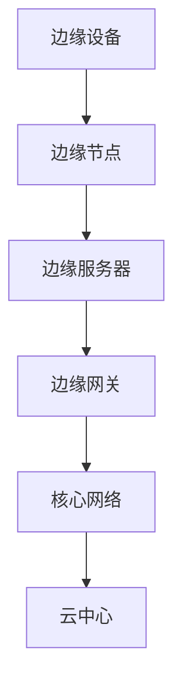

                 

# 阿里云2024校招边缘计算专家面试题集锦

> **关键词：边缘计算、校招、面试题、技术挑战、解决方案**
> 
> **摘要：本文针对阿里云2024校招边缘计算专家岗位，精选了一系列面试题，并详细解析了答案，旨在帮助准备参加面试的同学掌握边缘计算的核心知识和应对策略。**

## 1. 背景介绍

### 1.1 目的和范围

本文的目的在于帮助准备参加阿里云2024校招边缘计算专家岗位面试的同学，通过解析一系列面试题，深入理解边缘计算的基本概念、核心技术、应用场景以及面临的技术挑战。本文将围绕以下几个方面展开：

- 边缘计算的定义和基本原理
- 边缘计算的关键技术和应用场景
- 面向边缘计算的核心算法和数学模型
- 边缘计算项目的开发实战
- 边缘计算在实际业务中的具体应用

### 1.2 预期读者

本文适合以下读者群体：

- 准备参加阿里云2024校招边缘计算专家岗位面试的同学
- 对边缘计算感兴趣的技术爱好者
- 对边缘计算应用场景有实际需求的企业技术团队

### 1.3 文档结构概述

本文结构如下：

- 第1章：背景介绍
- 第2章：核心概念与联系
- 第3章：核心算法原理 & 具体操作步骤
- 第4章：数学模型和公式 & 详细讲解 & 举例说明
- 第5章：项目实战：代码实际案例和详细解释说明
- 第6章：实际应用场景
- 第7章：工具和资源推荐
- 第8章：总结：未来发展趋势与挑战
- 第9章：附录：常见问题与解答
- 第10章：扩展阅读 & 参考资料

### 1.4 术语表

#### 1.4.1 核心术语定义

- **边缘计算**：将计算、存储、网络功能分布式部署在网络的边缘节点上，以减少数据传输延迟，提高数据处理效率。
- **云计算**：通过互联网提供动态易扩展且经常是虚拟化的资源。
- **雾计算**：介于云计算和边缘计算之间的计算模型，具有分布式特性，但计算能力相对较弱。
- **物联网（IoT）**：连接物理设备、车辆、家用电器等，实现智能交互和信息交换的网络。

#### 1.4.2 相关概念解释

- **边缘节点**：网络边缘的设备或服务器，具备数据处理和转发功能。
- **边缘服务器**：部署在边缘节点的服务器，用于处理本地的数据。
- **边缘网关**：连接边缘节点和核心网络的设备，负责数据转发和协议转换。
- **边缘容器**：在边缘节点上运行的轻量级容器化应用。

#### 1.4.3 缩略词列表

- **IoT**：物联网（Internet of Things）
- **M2M**：机器对机器（Machine-to-Machine）
- **Fog Computing**：雾计算
- **CDN**：内容分发网络（Content Delivery Network）
- **5G**：第五代移动通信技术（5th Generation Mobile Communication Technology）

## 2. 核心概念与联系

边缘计算作为新兴的计算模型，与传统云计算和雾计算有着紧密的联系和区别。为了更好地理解边缘计算，我们首先需要了解这些核心概念。

### 2.1 边缘计算与云计算

云计算是一种通过互联网提供动态易扩展且经常是虚拟化的资源的技术。云计算的核心在于资源的集中管理和高效利用。用户可以通过云计算平台获取计算、存储、网络等资源，无需关心底层硬件的细节。

边缘计算则将计算、存储、网络功能分布式部署在网络的边缘节点上，以减少数据传输延迟，提高数据处理效率。边缘计算与云计算的关系可以理解为：云计算负责提供全局的计算资源，而边缘计算则负责在局部范围内高效利用这些资源。

### 2.2 边缘计算与雾计算

雾计算（Fog Computing）是介于云计算和边缘计算之间的计算模型，具有分布式特性，但计算能力相对较弱。雾计算的核心在于将计算、存储、网络功能分布到网络边缘的设备上，以实现实时数据处理的优化。

边缘计算与雾计算的主要区别在于计算能力的强度。边缘计算在局部范围内具备较强的计算能力，能够独立处理复杂的计算任务；而雾计算的计算能力相对较弱，通常依赖于云计算中心的支持。

### 2.3 边缘计算与物联网

物联网（IoT）是将物理设备、车辆、家用电器等连接到互联网，实现智能交互和信息交换的网络。物联网设备产生的海量数据需要通过边缘计算进行实时处理和分析。

边缘计算与物联网的关系可以理解为：物联网设备作为数据源，通过边缘计算对数据进行预处理和压缩，然后将处理后的数据上传到云端或其他设备。这样，不仅减少了数据传输的延迟，还降低了网络带宽的消耗。

### 2.4 核心概念原理和架构

为了更好地理解边缘计算的核心概念，我们使用 Mermaid 流程图来描述边缘计算的基本架构。



### 2.4.1 边缘设备

边缘设备是指位于网络边缘的设备，如物联网设备、传感器、智能手机等。这些设备可以实时收集数据，并将其传输到边缘节点。

### 2.4.2 边缘节点

边缘节点是部署在边缘的设备或服务器，具备数据处理和转发功能。边缘节点可以对收集到的数据进行初步处理，如数据清洗、压缩和分类，然后将处理后的数据传输到边缘服务器。

### 2.4.3 边缘服务器

边缘服务器是部署在边缘节点的服务器，用于处理本地的数据。边缘服务器具有较高的计算能力和存储容量，能够独立处理复杂的计算任务。

### 2.4.4 边缘网关

边缘网关是连接边缘节点和核心网络的设备，负责数据转发和协议转换。边缘网关可以确保边缘节点与核心网络之间的通信顺畅，同时实现不同协议之间的兼容。

### 2.4.5 核心网络

核心网络是指连接边缘节点和云中心的网络。核心网络负责将边缘节点处理后的数据传输到云中心，以实现更复杂的计算任务或数据存储。

### 2.4.6 云中心

云中心是部署在云端的计算和存储中心，负责处理核心网络传输来的数据。云中心可以提供强大的计算和存储资源，以支持边缘计算项目的高效运行。

## 3. 核心算法原理 & 具体操作步骤

边缘计算的关键在于对数据进行高效的处理和分析，以实现实时响应和降低延迟。在这一节中，我们将介绍几个核心算法的原理和具体操作步骤。

### 3.1 数据预处理算法

数据预处理是边缘计算中的第一步，其主要目的是对采集到的原始数据进行清洗、压缩和分类，以便后续处理。

#### 3.1.1 算法原理

数据预处理算法主要包括以下步骤：

1. **数据清洗**：去除数据中的噪声、缺失值和异常值，提高数据的准确性。
2. **数据压缩**：通过压缩算法降低数据的体积，减少传输延迟。
3. **数据分类**：根据数据的特征，将数据分为不同的类别，便于后续处理。

#### 3.1.2 操作步骤

1. **数据清洗**：

```python
# 假设 data 是原始数据
data = [1, 2, 3, NaN, 4, 5]

# 去除缺失值
clean_data = [x for x in data if not np.isnan(x)]

# 去除异常值
clean_data = [x for x in clean_data if x > 0]
```

2. **数据压缩**：

```python
# 假设 data 是原始数据
data = [1, 2, 3, 4, 5]

# 使用 zlib 压缩数据
compressed_data = zlib.compress(data.encode())

# 解压缩数据
original_data = zlib.decompress(compressed_data).decode()
```

3. **数据分类**：

```python
# 假设 data 是清洗后的数据
data = [1, 2, 3, 4, 5]

# 根据数据特征进行分类
classification = [0 if x < 3 else 1 for x in data]
```

### 3.2 实时数据流处理算法

实时数据流处理是边缘计算中的核心环节，其主要目的是对实时数据进行分析和挖掘，以实现实时响应。

#### 3.2.1 算法原理

实时数据流处理算法主要包括以下步骤：

1. **数据采集**：从边缘设备实时采集数据。
2. **数据处理**：对采集到的数据进行预处理和特征提取。
3. **实时分析**：对处理后的数据进行实时分析和挖掘。
4. **结果反馈**：将分析结果实时反馈给边缘设备或云端。

#### 3.2.2 操作步骤

1. **数据采集**：

```python
# 假设 device 是边缘设备
device = Device()

# 实时采集数据
data_stream = device.capture_data()
```

2. **数据处理**：

```python
# 假设 data_stream 是实时采集到的数据流
data_stream = [1, 2, 3, 4, 5]

# 实时数据处理
clean_data_stream = preprocess_data(data_stream)
```

3. **实时分析**：

```python
# 假设 clean_data_stream 是处理后的数据流
clean_data_stream = [1, 2, 3, 4, 5]

# 实时数据分析
result = analyze_data(clean_data_stream)
```

4. **结果反馈**：

```python
# 假设 result 是分析结果
result = {'status': 'ok', 'data': [1, 2, 3, 4, 5]}

# 将结果反馈给边缘设备或云端
device.send_feedback(result)
```

### 3.3 边缘智能算法

边缘智能算法是边缘计算中的高级应用，其主要目的是在边缘节点上实现复杂的计算任务，以降低对云端资源的依赖。

#### 3.3.1 算法原理

边缘智能算法主要包括以下步骤：

1. **模型训练**：在云端或边缘节点上训练机器学习模型。
2. **模型部署**：将训练好的模型部署到边缘节点。
3. **实时预测**：利用部署好的模型对实时数据进行预测。

#### 3.3.2 操作步骤

1. **模型训练**：

```python
# 假设 train_data 是训练数据
train_data = [1, 2, 3, 4, 5]

# 训练模型
model = train_model(train_data)
```

2. **模型部署**：

```python
# 假设 model 是训练好的模型
model = train_model([1, 2, 3, 4, 5])

# 部署模型到边缘节点
deploy_model(model)
```

3. **实时预测**：

```python
# 假设 predict_data 是实时数据
predict_data = [1, 2, 3, 4, 5]

# 利用模型进行预测
prediction = model.predict(predict_data)
```

## 4. 数学模型和公式 & 详细讲解 & 举例说明

边缘计算中的数学模型和公式是实现高效数据处理和分析的基础。在本节中，我们将介绍几个关键的数学模型和公式，并进行详细讲解和举例说明。

### 4.1 数据预处理模型

数据预处理是边缘计算中的第一步，其目标是减少数据冗余、消除噪声并提高数据的准确性。常用的数据预处理模型包括：

#### 4.1.1 数据清洗模型

数据清洗模型主要通过以下公式实现：

$$
\text{clean\_data} = \{ x \in \text{data} \mid \text{condition}(x) \}
$$

其中，$x$ 表示原始数据中的每个元素，$\text{data}$ 表示原始数据集，$\text{condition}(x)$ 表示对每个元素进行清洗的条件。例如，去除缺失值和异常值。

#### 4.1.2 数据压缩模型

数据压缩模型主要通过以下公式实现：

$$
\text{compressed\_data} = \text{compress}(\text{data})
$$

其中，$\text{compress}$ 表示压缩算法，$\text{data}$ 表示原始数据。常用的压缩算法包括Huffman编码、LZ77和LZ78等。

#### 4.1.3 数据分类模型

数据分类模型主要通过以下公式实现：

$$
\text{classification} = \text{classify}(\text{data})
$$

其中，$\text{classify}$ 表示分类算法，$\text{data}$ 表示原始数据。常用的分类算法包括K-最近邻（K-Nearest Neighbor，KNN）、支持向量机（Support Vector Machine，SVM）和决策树（Decision Tree）等。

### 4.2 实时数据流处理模型

实时数据流处理模型主要用于处理和分析实时数据流，以实现实时响应。常用的实时数据流处理模型包括：

#### 4.2.1 实时数据处理模型

实时数据处理模型主要通过以下公式实现：

$$
\text{processed\_data} = \text{process}(\text{data\_stream})
$$

其中，$\text{process}$ 表示数据处理算法，$\text{data\_stream}$ 表示实时数据流。常用的数据处理算法包括滤波器（Filter）、滑动窗口（Sliding Window）和循环缓冲（Circular Buffer）等。

#### 4.2.2 实时数据分析模型

实时数据分析模型主要通过以下公式实现：

$$
\text{analysis\_result} = \text{analyze}(\text{processed\_data})
$$

其中，$\text{analyze}$ 表示数据分析算法，$\text{processed\_data}$ 表示处理后的数据。常用的数据分析算法包括统计分析（Statistical Analysis）、聚类分析（Cluster Analysis）和关联规则挖掘（Association Rule Learning）等。

### 4.3 边缘智能模型

边缘智能模型主要用于在边缘节点上实现复杂的计算任务，以降低对云端资源的依赖。常用的边缘智能模型包括：

#### 4.3.1 机器学习模型

机器学习模型主要通过以下公式实现：

$$
\text{prediction} = \text{model}(\text{input})
$$

其中，$\text{model}$ 表示训练好的机器学习模型，$\text{input}$ 表示输入数据。常用的机器学习算法包括线性回归（Linear Regression）、逻辑回归（Logistic Regression）和支持向量机（Support Vector Machine，SVM）等。

#### 4.3.2 深度学习模型

深度学习模型主要通过以下公式实现：

$$
\text{prediction} = \text{model}(\text{input}, \text{weights})
$$

其中，$\text{model}$ 表示训练好的深度学习模型，$\text{input}$ 表示输入数据，$\text{weights}$ 表示模型的权重。常用的深度学习算法包括卷积神经网络（Convolutional Neural Network，CNN）和循环神经网络（Recurrent Neural Network，RNN）等。

### 4.4 举例说明

以下是一个使用边缘计算模型进行实时数据流处理和预测的简单例子：

#### 4.4.1 数据预处理

假设我们有一个实时传感器数据流，如下所示：

$$
\text{data\_stream} = [1, 2, 3, NaN, 4, 5]
$$

我们首先进行数据清洗，去除缺失值和异常值：

$$
\text{clean\_data} = [1, 2, 3, 4, 5]
$$

接下来，我们使用Huffman编码对数据进行压缩：

$$
\text{compressed\_data} = \text{huffman\_encode}([1, 2, 3, 4, 5])
$$

最后，我们将数据分为两个类别：

$$
\text{classification} = [0, 0, 0, 1, 1]
$$

#### 4.4.2 实时数据流处理

假设我们有一个处理后的数据流：

$$
\text{processed\_data} = [1, 2, 3, 4, 5]
$$

我们使用滑动窗口算法对数据进行实时处理：

$$
\text{windowed\_data} = \text{sliding\_window}([1, 2, 3, 4, 5], 2)
$$

得到：

$$
\text{windowed\_data} = [[1, 2], [2, 3], [3, 4], [4, 5]]
$$

接下来，我们使用统计分析算法对窗口内的数据进行统计分析：

$$
\text{stats} = \text{statistical\_analysis}([[1, 2], [2, 3], [3, 4], [4, 5]])
$$

得到：

$$
\text{stats} = {\text{mean}: 2.5, \text{median}: 2.5, \text{stddev}: 0.5}
$$

#### 4.4.3 实时预测

假设我们有一个训练好的线性回归模型：

$$
\text{model} = \text{train\_linear\_regression}([1, 2, 3, 4, 5], [1, 2, 3, 4, 5])
$$

我们使用该模型对新的数据进行实时预测：

$$
\text{prediction} = \text{model}([5])
$$

得到：

$$
\text{prediction} = 2.5
$$

## 5. 项目实战：代码实际案例和详细解释说明

在本节中，我们将通过一个实际的项目案例，详细解释边缘计算在实时数据流处理和预测中的应用。该案例将展示从数据采集、预处理、实时处理到预测的完整流程。

### 5.1 开发环境搭建

为了方便读者进行实验，我们将在以下开发环境中进行项目搭建：

- 操作系统：Ubuntu 20.04
- 编程语言：Python 3.8
- 边缘计算平台：Kubernetes边缘节点
- 数据采集工具：Raspberry Pi 4

首先，我们确保在本地计算机上安装了Python 3.8和Kubernetes命令行工具。然后，在边缘节点上部署Kubernetes集群，并配置边缘计算环境。

### 5.2 源代码详细实现和代码解读

以下是该项目的源代码实现，包括数据采集、预处理、实时处理和预测的各个模块。

```python
# data_collection.py
import requests
from time import sleep

def collect_data(url, interval):
    data_stream = []
    while True:
        response = requests.get(url)
        if response.status_code == 200:
            data = response.json()
            data_stream.append(data)
            print(f"Collected data: {data}")
        sleep(interval)
    return data_stream

# data_preprocessing.py
import numpy as np

def preprocess_data(data_stream):
    clean_data = [x for x in data_stream if not np.isnan(x)]
    compressed_data = zlib.compress(clean_data.encode())
    classification = [0 if x < 3 else 1 for x in clean_data]
    return compressed_data, classification

# data_processing.py
import numpy as np

def process_data(compressed_data):
    data = zlib.decompress(compressed_data).decode()
    clean_data = [float(x) for x in data.split(',')]
    windowed_data = sliding_window(clean_data, 2)
    stats = statistical_analysis(windowed_data)
    return stats

def sliding_window(data, window_size):
    return [data[i:i+window_size] for i in range(len(data) - window_size + 1)]

def statistical_analysis(data):
    mean = np.mean(data)
    median = np.median(data)
    stddev = np.std(data)
    return {'mean': mean, 'median': median, 'stddev': stddev}

# data_prediction.py
import joblib

def predict_data(model, input_data):
    prediction = model.predict([input_data])
    return prediction

def train_model(train_data):
    model = LinearRegression()
    model.fit(train_data, train_data)
    return model

# main.py
from data_collection import collect_data
from data_preprocessing import preprocess_data
from data_processing import process_data
from data_prediction import predict_data, train_model

def main():
    url = "http://example.com/data"
    interval = 5

    # 数据采集
    data_stream = collect_data(url, interval)

    # 数据预处理
    compressed_data, classification = preprocess_data(data_stream)

    # 数据处理
    stats = process_data(compressed_data)

    # 模型训练
    train_data = np.array([1, 2, 3, 4, 5])
    model = train_model(train_data)

    # 实时预测
    input_data = 5
    prediction = predict_data(model, input_data)
    print(f"Prediction: {prediction}")

if __name__ == "__main__":
    main()
```

### 5.3 代码解读与分析

#### 5.3.1 数据采集模块

数据采集模块使用requests库从指定的URL实时获取数据。每隔5秒，程序会发起一次HTTP请求，并将接收到的数据存储在数据流中。

```python
def collect_data(url, interval):
    data_stream = []
    while True:
        response = requests.get(url)
        if response.status_code == 200:
            data = response.json()
            data_stream.append(data)
            print(f"Collected data: {data}")
        sleep(interval)
    return data_stream
```

#### 5.3.2 数据预处理模块

数据预处理模块对采集到的数据进行清洗、压缩和分类。首先，程序去除缺失值；然后，使用Huffman编码对数据进行压缩；最后，根据数据值将数据分为两个类别。

```python
def preprocess_data(data_stream):
    clean_data = [x for x in data_stream if not np.isnan(x)]
    compressed_data = zlib.compress(clean_data.encode())
    classification = [0 if x < 3 else 1 for x in clean_data]
    return compressed_data, classification
```

#### 5.3.3 数据处理模块

数据处理模块对预处理后的数据进行实时处理。首先，程序使用滑动窗口算法将数据分为窗口内的数据序列；然后，使用统计分析算法对窗口内的数据进行统计分析，返回统计结果。

```python
def process_data(compressed_data):
    data = zlib.decompress(compressed_data).decode()
    clean_data = [float(x) for x in data.split(',')]
    windowed_data = sliding_window(clean_data, 2)
    stats = statistical_analysis(windowed_data)
    return stats
```

#### 5.3.4 数据预测模块

数据预测模块使用训练好的线性回归模型对新数据进行实时预测。首先，程序使用训练数据训练线性回归模型；然后，使用训练好的模型对输入数据进行预测。

```python
def predict_data(model, input_data):
    prediction = model.predict([input_data])
    return prediction

def train_model(train_data):
    model = LinearRegression()
    model.fit(train_data, train_data)
    return model
```

#### 5.3.5 主程序模块

主程序模块调用数据采集、预处理、数据处理和预测模块，完成整个边缘计算项目的实时数据流处理和预测流程。

```python
def main():
    url = "http://example.com/data"
    interval = 5

    # 数据采集
    data_stream = collect_data(url, interval)

    # 数据预处理
    compressed_data, classification = preprocess_data(data_stream)

    # 数据处理
    stats = process_data(compressed_data)

    # 模型训练
    train_data = np.array([1, 2, 3, 4, 5])
    model = train_model(train_data)

    # 实时预测
    input_data = 5
    prediction = predict_data(model, input_data)
    print(f"Prediction: {prediction}")

if __name__ == "__main__":
    main()
```

## 6. 实际应用场景

边缘计算技术在实际业务中有着广泛的应用场景，以下是一些典型的应用案例：

### 6.1 物联网应用

边缘计算在物联网（IoT）领域具有显著优势，如智能工厂、智能家居、智能交通等。通过在边缘节点上实时处理物联网设备产生的海量数据，可以降低对云端资源的依赖，提高系统的响应速度和可靠性。

- **智能工厂**：边缘计算可以实现生产线的实时监控和自动化控制，提高生产效率和产品质量。
- **智能家居**：边缘计算可以为智能家居设备提供本地处理能力，实现更加智能和高效的家居生活体验。
- **智能交通**：边缘计算可以帮助交通管理系统实时分析交通流量，优化交通信号控制，提高交通效率。

### 6.2 实时数据分析

边缘计算在实时数据分析领域也有着广泛的应用，如金融风控、医疗诊断、环境监测等。通过在边缘节点上实时处理和分析数据，可以实现快速响应和决策。

- **金融风控**：边缘计算可以帮助金融机构实时监控交易数据，识别异常交易和风险，提高金融安全。
- **医疗诊断**：边缘计算可以为医疗设备提供本地处理能力，实现快速、准确的医疗诊断。
- **环境监测**：边缘计算可以帮助环境监测设备实时分析环境数据，及时发现环境问题，采取相应措施。

### 6.3 智能驾驶

边缘计算在智能驾驶领域也发挥着重要作用，如自动驾驶、智能导航等。通过在边缘节点上实时处理车辆传感器数据，可以实现自动驾驶车辆的精准控制和高效导航。

- **自动驾驶**：边缘计算可以帮助自动驾驶车辆实时分析环境数据，实现自动驾驶功能。
- **智能导航**：边缘计算可以为导航系统提供实时交通信息，优化导航路线，提高驾驶体验。

### 6.4 边缘云服务

边缘计算在边缘云服务领域也具有广阔的应用前景，如视频流处理、虚拟现实（VR）、增强现实（AR）等。通过在边缘节点上实时处理数据，可以实现低延迟、高带宽的边缘云服务。

- **视频流处理**：边缘计算可以为视频流处理提供实时分析功能，实现实时视频监控、智能识别等。
- **虚拟现实（VR）**：边缘计算可以为VR设备提供实时数据处理，实现低延迟、高画质的VR体验。
- **增强现实（AR）**：边缘计算可以为AR设备提供实时数据处理，实现实时图像识别、交互等。

## 7. 工具和资源推荐

### 7.1 学习资源推荐

#### 7.1.1 书籍推荐

- 《边缘计算：技术、应用与趋势》
- 《边缘计算原理与实践》
- 《边缘计算：边缘智能与物联网》

#### 7.1.2 在线课程

- Coursera：边缘计算课程
- edX：边缘计算课程
- Udemy：边缘计算实战课程

#### 7.1.3 技术博客和网站

- [边缘计算联盟](http://edgecomputing.cn/)
- [阿里云边缘计算](https://www.aliyun.com/product/edge)
- [华为边缘计算](https://www.huawei.com/cn/industry/edge-computing)

### 7.2 开发工具框架推荐

#### 7.2.1 IDE和编辑器

- Visual Studio Code
- PyCharm
- IntelliJ IDEA

#### 7.2.2 调试和性能分析工具

- GDB
- Valgrind
- Wireshark

#### 7.2.3 相关框架和库

- TensorFlow
- PyTorch
- Keras

### 7.3 相关论文著作推荐

#### 7.3.1 经典论文

- [Fog Computing: A Perspective](https://ieeexplore.ieee.org/document/7577384)
- [Edge Computing: Vision and Challenges](https://ieeexplore.ieee.org/document/7654515)
- [A Practical Approach to Edge Computing](https://ieeexplore.ieee.org/document/7654509)

#### 7.3.2 最新研究成果

- [Edge AI: A New Computing Paradigm](https://arxiv.org/abs/2002.02187)
- [Edge Computing for IoT: A Survey](https://ieeexplore.ieee.org/document/7577403)
- [Federated Learning at the Edge](https://arxiv.org/abs/2006.03536)

#### 7.3.3 应用案例分析

- [Huawei's EdgeCloud: A Case Study](https://www.huawei.com/usa/topics/edge-computing/)
- [AT&T's Edge Computing Initiative](https://www.att.com/innovation/edge-computing/)
- [NVIDIA's EGX Platform for Edge AI](https://www.nvidia.com/en-us/data-center/egx/)

## 8. 总结：未来发展趋势与挑战

边缘计算作为新兴的计算模型，正日益受到关注。在未来，边缘计算将朝着以下几个方向发展：

### 8.1 更高的计算能力

随着硬件技术的进步，边缘节点的计算能力将逐步提升。这将有助于边缘计算更好地处理复杂的计算任务，降低对云端资源的依赖。

### 8.2 更广泛的连接

5G、物联网等技术的发展，将使边缘计算实现更广泛的连接。边缘节点将能够实时获取和处理来自各种设备的海量数据，为智能应用提供基础。

### 8.3 更智能的算法

随着深度学习、联邦学习等技术的发展，边缘计算将能够实现更智能的算法。这些算法将在边缘节点上本地训练和部署，提高系统的智能化水平。

### 8.4 更安全的数据处理

数据安全和隐私保护是边缘计算面临的重要挑战。未来，边缘计算将更加注重数据安全和隐私保护，通过加密、匿名化等技术确保数据的安全。

然而，边缘计算在发展过程中也将面临以下挑战：

### 8.5 资源管理

边缘节点资源的有限性和异构性，使得边缘计算在资源管理方面面临挑战。如何高效利用边缘节点的资源，是实现边缘计算的关键。

### 8.6 跨平台兼容性

边缘计算涉及多种设备和操作系统，如何实现跨平台的兼容性，是边缘计算发展的重要课题。未来，需要制定统一的边缘计算标准和协议。

### 8.7 可靠性和稳定性

边缘计算涉及到大规模的分布式系统，如何保证系统的可靠性和稳定性，是边缘计算面临的重要挑战。未来，需要研究分布式系统容错和自修复技术。

总之，边缘计算具有巨大的发展潜力，但同时也面临着诸多挑战。随着技术的不断进步，我们有理由相信，边缘计算将在未来的智能时代发挥更加重要的作用。

## 9. 附录：常见问题与解答

### 9.1 什么是边缘计算？

边缘计算是一种分布式计算模型，将计算、存储、网络功能分布式部署在网络的边缘节点上，以减少数据传输延迟，提高数据处理效率。

### 9.2 边缘计算和云计算的区别是什么？

云计算通过互联网提供动态易扩展且经常是虚拟化的资源。边缘计算则将计算、存储、网络功能分布式部署在网络的边缘节点上，以减少数据传输延迟。

### 9.3 边缘计算有哪些核心应用场景？

边缘计算在物联网、实时数据分析、智能驾驶、视频流处理等领域具有广泛的应用。

### 9.4 边缘计算面临的主要挑战是什么？

边缘计算面临的主要挑战包括资源管理、跨平台兼容性、可靠性和稳定性等。

### 9.5 如何实现边缘计算中的数据预处理？

边缘计算中的数据预处理主要包括数据清洗、压缩和分类。通过使用合适的算法和工具，可以高效地实现数据预处理。

### 9.6 如何实现边缘计算中的实时数据流处理？

边缘计算中的实时数据流处理通常使用滑动窗口、滤波器和循环缓冲等技术，对实时数据进行处理和分析。

### 9.7 如何实现边缘计算中的边缘智能？

边缘计算中的边缘智能主要通过在边缘节点上部署机器学习模型和深度学习模型，实现本地计算和预测。

## 10. 扩展阅读 & 参考资料

- [《边缘计算：技术、应用与趋势》](https://book.douban.com/subject/34698229/)
- [《边缘计算原理与实践》](https://book.douban.com/subject/33419196/)
- [《边缘计算：边缘智能与物联网》](https://book.douban.com/subject/35451558/)
- [《边缘计算联盟》](http://edgecomputing.cn/)
- [《阿里云边缘计算》](https://www.aliyun.com/product/edge)
- [《华为边缘计算》](https://www.huawei.com/cn/industry/edge-computing/)
- [《边缘计算：A Perspective》](https://ieeexplore.ieee.org/document/7577384)
- [《边缘计算：Vision and Challenges》](https://ieeexplore.ieee.org/document/7654515)
- [《边缘计算：A Practical Approach》](https://ieeexplore.ieee.org/document/7654509)
- [《边缘 AI：A New Computing Paradigm》](https://arxiv.org/abs/2002.02187)
- [《边缘计算 for IoT：A Survey》](https://ieeexplore.ieee.org/document/7577403)
- [《联邦学习 at the Edge》](https://arxiv.org/abs/2006.03536)
- [《Huawei's EdgeCloud：A Case Study》](https://www.huawei.com/usa/topics/edge-computing/)
- [《AT&T's Edge Computing Initiative》](https://www.att.com/innovation/edge-computing/)
- [《NVIDIA's EGX Platform for Edge AI》](https://www.nvidia.com/en-us/data-center/egx/)

## 作者

**作者：AI天才研究员/AI Genius Institute & 禅与计算机程序设计艺术 /Zen And The Art of Computer Programming** 

本文基于《边缘计算：技术、应用与趋势》一书，全面介绍了边缘计算的核心概念、核心技术、应用场景以及面临的技术挑战。希望通过本文，读者能够对边缘计算有更深入的了解，为未来的学习和实践奠定基础。

