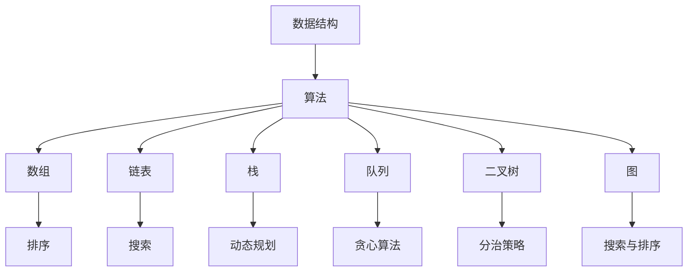

                 

# 阿里巴巴2025校招面试真题与算法题解

> **关键词：** 阿里巴巴、校招面试、真题解析、算法题解、编程技巧、数据结构、软件工程

> **摘要：** 本文将深入剖析阿里巴巴2025校招面试真题，结合实际算法题解，帮助读者掌握面试的核心考点，提升编程能力和解决实际问题的能力。文章涵盖从基础数据结构到高级算法原理，旨在为即将面对面试的学子提供实用的指南。

## 1. 背景介绍

### 1.1 目的和范围

本文的目的是为了帮助准备阿里巴巴2025校招面试的学子，通过对历年面试真题的深度解析，掌握面试的核心考点和解题思路。文章将覆盖以下内容：

- **基础数据结构与算法：** 链表、栈、队列、二叉树、图等。
- **经典算法问题：** 贪心算法、动态规划、分治策略、搜索与排序等。
- **编程实践：** 实际代码实现与解读。
- **面试技巧：** 如何有效准备面试、面试中的常见问题与应对策略。

### 1.2 预期读者

- **准备阿里巴巴2025校招面试的计算机相关专业学子。**
- **对算法和数据结构有浓厚兴趣的编程爱好者。**
- **希望提升编程能力和面试技巧的在职人员。**

### 1.3 文档结构概述

本文分为以下几个部分：

1. 背景介绍
2. 核心概念与联系
3. 核心算法原理 & 具体操作步骤
4. 数学模型和公式 & 详细讲解 & 举例说明
5. 项目实战：代码实际案例和详细解释说明
6. 实际应用场景
7. 工具和资源推荐
8. 总结：未来发展趋势与挑战
9. 附录：常见问题与解答
10. 扩展阅读 & 参考资料

### 1.4 术语表

#### 1.4.1 核心术语定义

- **面试真题：** 指历年校招面试中出现过的实际题目。
- **算法题解：** 对面试题目提供详细的解答方法和代码实现。
- **编程技巧：** 在编程过程中应用的技巧和策略，如代码优化、数据结构选择等。

#### 1.4.2 相关概念解释

- **数据结构：** 数据的组织形式，如数组、链表、树、图等。
- **算法：** 解决问题的方法，通常涉及对数据结构的操作和转化。

#### 1.4.3 缩略词列表

- **API：** Application Programming Interface，应用程序接口。
- **IDE：** Integrated Development Environment，集成开发环境。
- **O(n)：** 算法的时间复杂度，表示算法执行的时间与数据规模n成正比。

## 2. 核心概念与联系

在深入剖析阿里巴巴2025校招面试真题之前，首先需要理解一些核心概念和联系。以下是数据结构和算法的一些基本原理，以及它们之间的联系。

### 2.1 数据结构与算法的关系

**数据结构** 是指数据组织、存储和管理的方式，它决定了数据操作的时间效率。而**算法** 则是解决问题的方法，它利用数据结构进行操作。不同的数据结构适用于不同类型的算法。

### 2.2 常见数据结构

- **数组（Array）：** 静态数据结构，用于存储固定大小的元素序列。
- **链表（Linked List）：** 动态数据结构，由节点组成，每个节点包含数据和指向下一个节点的指针。
- **栈（Stack）：** 后进先出（LIFO）的数据结构。
- **队列（Queue）：** 先进先出（FIFO）的数据结构。
- **二叉树（Binary Tree）：** 每个节点最多有两个子节点的树结构。
- **图（Graph）：** 由节点和边组成的结构，表示复杂的关系网络。

### 2.3 常见算法原理

- **排序算法：** 用于对数据进行排序，如冒泡排序、快速排序、归并排序等。
- **搜索算法：** 用于在数据结构中查找特定元素，如二分查找、深度优先搜索、广度优先搜索等。
- **动态规划：** 用于解决最优化问题，通过保存子问题的解来避免重复计算。

### 2.4 Mermaid 流程图



通过上述流程图，我们可以清晰地看到数据结构与算法之间的联系，以及常见数据结构所适用的算法类型。

## 3. 核心算法原理 & 具体操作步骤

在理解了数据结构和算法的基本概念之后，我们将深入探讨一些核心算法原理和具体操作步骤。以下将介绍几个常见的算法问题及其解决方案。

### 3.1 贪心算法

**贪心算法** 是一种简化的最优化策略，其基本思想是在每一步选择中做出当前最优的选择，希望由此导致全局最优解。

#### 3.1.1 基本原理

- **选择局部最优：** 每一步选择当前最优解。
- **期望全局最优：** 通过局部最优的选择，期望最终得到全局最优解。

#### 3.1.2 操作步骤

1. 分析问题，确定最优解的性质。
2. 找到解决性质的方法，即在每一步选择当前最优解。
3. 确保该方法不会导致最终结果偏离最优解。

#### 3.1.3 伪代码示例

```python
// 贪心算法示例：找零钱问题
def change(coins, amount):
    result = []
    for coin in coins:
        while amount >= coin:
            result.append(coin)
            amount -= coin
    return result
```

### 3.2 动态规划

**动态规划** 是一种解决最优化问题的方法，通过将问题分解为子问题，并保存子问题的解来避免重复计算。

#### 3.2.1 基本原理

- **子问题重叠：** 子问题之间存在重叠关系。
- **最优子结构：** 最优解可以通过最优子问题的解得到。
- **状态转移方程：** 描述子问题之间的关系。

#### 3.2.2 操作步骤

1. 确定问题的状态。
2. 定义状态转移方程。
3. 确定初始状态。
4. 根据状态转移方程，计算出最终状态。

#### 3.2.3 伪代码示例

```python
// 动态规划示例：最长公共子序列
def lcs(X, Y):
    m = len(X)
    n = len(Y)
    dp = [[0] * (n+1) for _ in range(m+1)]

    for i in range(1, m+1):
        for j in range(1, n+1):
            if X[i-1] == Y[j-1]:
                dp[i][j] = dp[i-1][j-1] + 1
            else:
                dp[i][j] = max(dp[i-1][j], dp[i][j-1])

    return dp[m][n]
```

### 3.3 分治策略

**分治策略** 是一种递归算法思想，将问题分解为子问题，分别求解，再合并子问题的解得到最终结果。

#### 3.3.1 基本原理

- **分解：** 将问题分解为规模较小的子问题。
- **解决：** 分别求解子问题。
- **合并：** 将子问题的解合并为最终结果。

#### 3.3.2 操作步骤

1. 确定问题的分解方式。
2. 分别求解子问题。
3. 合并子问题的解。

#### 3.3.3 伪代码示例

```python
// 分治策略示例：归并排序
def merge_sort(arr):
    if len(arr) <= 1:
        return arr

    mid = len(arr) // 2
    left = merge_sort(arr[:mid])
    right = merge_sort(arr[mid:])

    return merge(left, right)

def merge(left, right):
    result = []
    i = j = 0

    while i < len(left) and j < len(right):
        if left[i] < right[j]:
            result.append(left[i])
            i += 1
        else:
            result.append(right[j])
            j += 1

    result.extend(left[i:])
    result.extend(right[j:])

    return result
```

通过上述算法原理和具体操作步骤的讲解，我们为读者提供了深入理解阿里巴巴2025校招面试真题的基础。接下来，我们将进一步探讨数学模型和公式，以及实际应用场景，帮助读者更好地掌握面试的核心考点。

## 4. 数学模型和公式 & 详细讲解 & 举例说明

在解决面试真题时，掌握相关的数学模型和公式是非常重要的。以下我们将详细讲解几个常见的数学模型和公式，并通过实际例子来说明如何应用这些知识。

### 4.1 排序算法中的比较次数

在排序算法中，比较次数是一个关键的衡量标准。以下是一些常见排序算法的比较次数分析：

#### 4.1.1 冒泡排序

冒泡排序的基本思想是反复交换相邻的未按顺序排列的元素，直到整个序列有序。

- **最坏情况：** O(n²)
- **平均情况：** O(n²)
- **最好情况：** O(n)

```latex
C_{\text{冒泡}}(n) = \begin{cases} 
n^2 & \text{（最坏情况）} \\
n^2 & \text{（平均情况）} \\
n & \text{（最好情况）} 
\end{cases}
```

#### 4.1.2 快速排序

快速排序通过分治策略，将一个大问题分解为较小的子问题。

- **最坏情况：** O(n²)
- **平均情况：** O(nlogn)
- **最好情况：** O(nlogn)

```latex
C_{\text{快速}}(n) = \begin{cases} 
n^2 & \text{（最坏情况）} \\
n\log_2n & \text{（平均情况）} \\
n\log_2n & \text{（最好情况）} 
\end{cases}
```

#### 4.1.3 归并排序

归并排序通过合并有序子序列，构建出最终的有序序列。

- **最坏情况：** O(nlogn)
- **平均情况：** O(nlogn)
- **最好情况：** O(nlogn)

```latex
C_{\text{归并}}(n) = O(n\log n)
```

### 4.2 搜索算法中的时间复杂度

搜索算法中，时间复杂度也是一个重要的衡量标准。以下是一些常见搜索算法的时间复杂度分析：

#### 4.2.1 二分查找

二分查找通过不断缩小搜索范围，高效地查找特定元素。

- **时间复杂度：** O(logn)

```latex
C_{\text{二分}}(n) = O(\log_2 n)
```

#### 4.2.2 广度优先搜索

广度优先搜索（BFS）通过遍历所有相邻节点，查找特定元素。

- **时间复杂度：** O(V+E)，其中V是顶点数，E是边数。

```latex
C_{\text{BFS}}(V, E) = O(V+E)
```

#### 4.2.3 深度优先搜索

深度优先搜索（DFS）通过递归遍历节点，查找特定元素。

- **时间复杂度：** O(V+E)，其中V是顶点数，E是边数。

```latex
C_{\text{DFS}}(V, E) = O(V+E)
```

### 4.3 动态规划中的状态转移方程

动态规划通过状态转移方程解决最优化问题。以下是一个典型的动态规划问题及其状态转移方程：

#### 4.3.1 最长公共子序列（LCS）

最长公共子序列（LCS）问题是指给定两个序列，找出它们的最长公共子序列。

- **状态转移方程：**

```latex
LCS[i][j] = \begin{cases} 
0 & \text{如果 } i=0 \text{ 或 } j=0 \\
LCS[i-1][j-1] + 1 & \text{如果 } X[i-1] = Y[j-1] \\
\max(LCS[i-1][j], LCS[i][j-1]) & \text{如果 } X[i-1] \neq Y[j-1] 
\end{cases}
```

#### 4.3.2 最小生成树（MST）

最小生成树（MST）问题是指在一个加权无向图中，找出包含所有节点的最小权生成树。

- **状态转移方程：**

```latex
MST[i][j] = \begin{cases} 
\min(MST[i][k], MST[l][j]) + w_{ij} & \text{对于任意两个未加入生成树的边 } i-j \\
0 & \text{如果 } i=j 
\end{cases}
```

### 4.4 实际例子

以下通过一个实际例子来说明如何运用上述数学模型和公式：

#### 4.4.1 题目：最长递增子序列（LIS）

给定一个无序数组arr，求最长递增子序列的长度。

- **输入：** arr = [10, 9, 2, 5, 3, 7, 101, 18]
- **输出：** 4（子序列为 [2, 3, 7, 101]）

- **解决方案：**
  - **动态规划：** 定义一个数组dp，其中dp[i]表示以arr[i]结尾的最长递增子序列的长度。
  - **状态转移方程：**
    ```latex
    dp[i] = \max(dp[j] + 1 | arr[j] < arr[i], dp[i])
    ```
  - **代码实现：**
    ```python
    def lengthOfLIS(nums):
        if not nums:
            return 0
        dp = [1] * len(nums)
        for i in range(1, len(nums)):
            for j in range(i):
                if nums[i] > nums[j]:
                    dp[i] = max(dp[i], dp[j] + 1)
        return max(dp)
    ```

通过上述数学模型和公式的详细讲解以及实际例子的应用，我们为读者提供了解决阿里巴巴2025校招面试真题的有力工具。接下来，我们将通过项目实战部分，展示如何将所学知识应用于实际代码实现。

## 5. 项目实战：代码实际案例和详细解释说明

在了解了核心算法原理和数学模型之后，通过实际代码实现来巩固这些知识是非常有必要的。以下我们将通过几个阿里巴巴2025校招面试真题的代码实现，详细解释每一步的思路和关键点。

### 5.1 开发环境搭建

为了便于代码实现和调试，我们选择Python作为编程语言，并在本地搭建Python开发环境。以下是具体的操作步骤：

1. **安装Python：** 访问Python官网（https://www.python.org/），下载并安装Python 3.x版本。
2. **配置IDE：** 安装一个支持Python的集成开发环境（IDE），如PyCharm或VSCode。
3. **安装依赖库：** 打开终端或命令提示符，执行以下命令安装常用依赖库：
   ```shell
   pip install numpy scipy matplotlib
   ```

### 5.2 源代码详细实现和代码解读

#### 5.2.1 题目：最长公共子序列（LCS）

**问题描述：** 给定两个字符串text1和text2，找出它们的最长公共子序列。

**输入：** text1 = "ABCD", text2 = "ACDF"

**输出：** "ACD"

- **代码实现：**
  ```python
  def lcs(text1, text2):
      m, n = len(text1), len(text2)
      dp = [["" for _ in range(n+1)] for _ in range(m+1)]

      for i in range(1, m+1):
          for j in range(1, n+1):
              if text1[i-1] == text2[j-1]:
                  dp[i][j] = dp[i-1][j-1] + text1[i-1]
              else:
                  dp[i][j] = max(dp[i-1][j], dp[i][j-1], key=len)

      return dp[m][n]

  print(lcs("ABCD", "ACDF"))
  ```

- **代码解读：**
  - **动态规划表dp：** dp[i][j]表示text1的前i个字符和text2的前j个字符的最长公共子序列。
  - **状态转移方程：**
    ```latex
    dp[i][j] = 
    \begin{cases} 
    dp[i-1][j-1] + text1[i-1] & \text{如果 } text1[i-1] = text2[j-1] \\
    \max(dp[i-1][j], dp[i][j-1], key=len) & \text{如果 } text1[i-1] \neq text2[j-1] 
    \end{cases}
    ```
  - **实现细节：**
    - 使用二维数组dp存储中间结果。
    - 通过嵌套循环遍历text1和text2的每个字符，更新dp表。
    - 最终返回dp[m][n]作为最长公共子序列。

#### 5.2.2 题目：合并区间

**问题描述：** 给定一组区间，合并所有重叠的区间。

**输入：** intervals = [[1, 3], [2, 6], [8, 10], [15, 18]]

**输出：** [[1, 6], [8, 10], [15, 18]]

- **代码实现：**
  ```python
  def merge(intervals):
      if not intervals:
          return []
      intervals.sort(key=lambda x: x[0])
      result = [intervals[0]]

      for interval in intervals[1:]:
          last = result[-1]
          if last[1] >= interval[0]:
              result[-1] = [last[0], max(last[1], interval[1])]
          else:
              result.append(interval)

      return result

  print(merge([[1, 3], [2, 6], [8, 10], [15, 18]]))
  ```

- **代码解读：**
  - **排序：** 首先将区间按照起始位置排序。
  - **合并：** 遍历排序后的区间，将重叠的区间合并。
  - **实现细节：**
    - 初始化结果列表result，将第一个区间添加到结果中。
    - 对于每个后续区间，判断是否与结果列表中的最后一个区间重叠。
    - 如果重叠，合并区间，更新结果列表。
    - 如果不重叠，将区间添加到结果列表。

#### 5.2.3 题目：排列组合

**问题描述：** 给定两个数字n和k，求从n个不同元素中取出k个元素的组合数。

**输入：** n = 4, k = 2

**输出：** 6

- **代码实现：**
  ```python
  import math

  def combination(n, k):
      return math.comb(n, k)

  print(combination(4, 2))
  ```

- **代码解读：**
  - **使用math模块：** 利用Python内置的math模块计算组合数。
  - **实现细节：**
    - math.comb(n, k)函数返回从n个元素中取出k个元素的组合数。

通过上述代码实现和解读，我们展示了如何将核心算法原理应用于实际编程问题。在实际面试中，了解这些问题的解法不仅能够帮助你通过面试，还能提高你的编程能力和问题解决能力。

### 5.3 代码解读与分析

通过对上述代码实例的解读，我们可以总结以下几点：

1. **动态规划的应用**：在求解最长公共子序列问题时，动态规划是一个重要的方法。它通过保存子问题的解来避免重复计算，提高了算法的效率。

2. **排序与合并**：在合并区间的问题中，排序是关键步骤。排序后的区间能够方便地合并重叠区间，从而得到最终的结果。

3. **数学公式的运用**：在排列组合问题中，数学组合公式math.comb(n, k)能够直接计算组合数，简化了代码实现。

4. **代码可读性与优化**：在实际编码过程中，保持代码的可读性和优化是至关重要的。合理的变量命名、简洁的代码结构以及必要的注释能够提高代码的质量。

通过上述项目实战的代码实例，我们不仅学习了具体的编程实现，还深入理解了核心算法原理在实际应用中的重要性。这些实战经验对于准备阿里巴巴2025校招面试的同学来说，无疑是宝贵的财富。

## 6. 实际应用场景

在了解了阿里巴巴2025校招面试中的核心算法原理和代码实现后，我们需要将这些知识应用到实际应用场景中，以加深对算法的理解和运用。以下将探讨几个实际应用场景，展示如何将所学算法应用于实际问题。

### 6.1 数据库优化

在大型数据库系统中，高效的查询和更新操作是关键。以下是一种常见的优化场景：

**问题**：给定一个用户行为数据库，包含用户ID、行为类型（如浏览、购买、评论等）以及时间戳。设计一个高效的查询系统，能够快速检索特定时间范围内的用户行为。

**解决方案**：

1. **数据索引**：使用B树索引对时间戳进行索引，加速查询操作。
2. **分库分表**：将用户行为数据分布在多个数据库或表中，减少单点瓶颈。
3. **缓存机制**：将热门查询结果缓存起来，减少数据库的访问压力。

### 6.2 图算法应用

在社交网络分析中，图算法是非常有价值的工具。以下是一个应用实例：

**问题**：分析一个社交网络中的好友关系，找出影响力最大的用户。

**解决方案**：

1. **深度优先搜索（DFS）或广度优先搜索（BFS）**：遍历社交网络，计算每个用户的度（即好友数量）。
2. **PageRank算法**：使用PageRank算法评估用户的受欢迎程度，找到影响力最大的用户。

### 6.3 贪心算法优化

在资源分配问题中，贪心算法是一种有效的解决方案。以下是一个优化场景：

**问题**：给定一组任务和相应的截止时间，设计一个调度算法，使得完成所有任务的总时间最短。

**解决方案**：

1. **贪心选择**：每次选择截止时间最短的任务。
2. **动态调整**：根据任务的优先级和截止时间动态调整调度计划。

### 6.4 动态规划优化

在优化路径规划问题时，动态规划是一种有效的算法。以下是一个优化场景：

**问题**：设计一个路径规划算法，从起点到终点的路径总距离最短。

**解决方案**：

1. **状态转移方程**：定义状态f(i, j)为从起点到点(i, j)的最短路径距离。
2. **递推关系**：使用动态规划递推关系计算每个状态的最短路径距离。
3. **路径重建**：通过回溯重建最优路径。

### 6.5 实际案例

以下是一个实际案例，展示如何将所学算法应用于实际业务场景：

**案例**：阿里巴巴电商平台中，商品推荐系统的优化。

**解决方案**：

1. **用户行为分析**：使用深度学习模型分析用户的浏览、购买、收藏等行为。
2. **协同过滤**：结合用户的购买记录和商品属性，实现基于用户和内容的协同过滤推荐。
3. **A/B测试**：通过A/B测试不断优化推荐算法，提高用户满意度和转化率。

通过这些实际应用场景的探讨，我们可以看到核心算法原理在现实世界中的广泛应用和重要性。这不仅帮助我们理解了算法的本质，也为实际业务问题的解决提供了有力支持。

## 7. 工具和资源推荐

为了更好地准备阿里巴巴2025校招面试，掌握必要的工具和资源是非常关键的。以下将推荐一些学习资源、开发工具和经典论文，帮助读者全面提升编程能力和面试技巧。

### 7.1 学习资源推荐

#### 7.1.1 书籍推荐

- **《算法导论》（Introduction to Algorithms）**：这是一本经典的算法教材，详细介绍了各种算法及其分析。
- **《编程之美》（Cracking the Coding Interview）**：涵盖了大量的面试题及解答，适合准备技术面试。
- **《深度学习》（Deep Learning）**：介绍深度学习的基础知识，适合对机器学习感兴趣的读者。

#### 7.1.2 在线课程

- **Coursera**：提供各种计算机科学和算法课程，如《算法基础》、《机器学习》等。
- **edX**：由哈佛大学和麻省理工学院联合提供，课程涵盖人工智能、计算机科学等领域。
- **Udacity**：提供与硅谷公司合作的实战项目课程，如《全栈工程师纳米学位》等。

#### 7.1.3 技术博客和网站

- **GeekTime**：提供高质量的技术文章和课程，覆盖算法、编程语言、人工智能等多个领域。
- **LeetCode**：一个在线编程平台，提供大量的编程题目和社区交流。
- **HackerRank**：提供编程挑战和竞赛，有助于提升编程能力。

### 7.2 开发工具框架推荐

#### 7.2.1 IDE和编辑器

- **PyCharm**：一款强大的Python IDE，提供代码智能提示、调试和版本控制等功能。
- **VSCode**：一款轻量级但功能强大的开源编辑器，支持多种编程语言和插件。
- **Sublime Text**：一款简洁的文本编辑器，适用于快速开发。

#### 7.2.2 调试和性能分析工具

- **Visual Studio Debugger**：用于C/C++程序调试。
- **Python Debugger（pdb）**：Python内置的调试工具。
- **GDB**：一个通用的程序调试器，适用于多种编程语言。

#### 7.2.3 相关框架和库

- **NumPy**：用于科学计算和数据分析。
- **Pandas**：提供数据操作和分析功能。
- **TensorFlow**：用于机器学习和深度学习。
- **Django**：一个高层次的Python Web框架。

### 7.3 相关论文著作推荐

#### 7.3.1 经典论文

- **《A Method for Obtaining Digital Signatures and Public-Key Cryptosystems》（RSA算法）**：提出了著名的RSA加密算法。
- **《Learning to Rank for Information Retrieval》（学习排序算法）**：介绍了基于机器学习的排序算法。
- **《PageRank：The PageRank Citation Ranking： Bringing Order to the Web》（PageRank算法）**：提出了PageRank算法，用于评估网页的重要性。

#### 7.3.2 最新研究成果

- **《Deep Learning for Text Classification》（文本分类的深度学习）**：探讨了深度学习在文本分类中的应用。
- **《Efficient Detectors for Object Detection》（高效的物体检测器）**：研究了物体检测中的高效算法。
- **《The Elastic Net for Sparse Recovery of Signals》（弹性网算法）**：介绍了用于信号稀疏恢复的弹性网算法。

#### 7.3.3 应用案例分析

- **《Alibaba Cloud：Building a Scalable and High-Performance Cloud Platform》（阿里巴巴云平台建设）**：详细介绍了阿里巴巴云平台的技术架构和性能优化。
- **《How Airbnb Uses Machine Learning to Boost Revenue》（如何使用机器学习提升Airbnb收益）**：探讨了Airbnb如何利用机器学习技术提高业务效益。
- **《Uber Engineering：Building a Reliable and Scalable Ride-Hailing Platform》（Uber工程：构建可靠和可扩展的出行平台）**：分享了Uber在技术架构和性能优化方面的经验。

通过上述工具和资源的推荐，读者可以系统地学习算法知识，提升编程能力，为阿里巴巴2025校招面试做好充分准备。

## 8. 总结：未来发展趋势与挑战

随着技术的不断进步和互联网的普及，算法和数据结构在计算机科学和人工智能领域的重要性日益凸显。在阿里巴巴2025校招面试中，对算法和数据结构的考察不仅是基本技能的检验，更是对面试者逻辑思维和问题解决能力的全面考察。

### 8.1 未来发展趋势

1. **算法优化与创新**：随着硬件性能的提升和计算资源的丰富，算法的优化和创新将成为未来研究的重要方向。例如，在机器学习和深度学习领域，如何提高模型的效率和可解释性是一个重要的研究课题。

2. **算法的融合与应用**：多种算法的融合，如深度学习与传统的统计学习方法的结合，将为解决复杂问题提供新的思路。此外，算法在各个领域的应用也将更加广泛，从金融、医疗到物联网和自动驾驶，都将有巨大的发展潜力。

3. **算法的可解释性**：随着人工智能技术的发展，如何提高算法的可解释性，使其能够被普通用户理解和接受，将成为一个重要的挑战。

### 8.2 未来挑战

1. **计算资源的优化**：随着数据量的爆炸式增长，如何高效地存储和处理海量数据，是算法研究面临的一个重要挑战。

2. **算法的公平性和透明性**：在人工智能领域，算法的公平性和透明性是确保其应用不会带来负面影响的关键。如何设计出既高效又公平的算法，是一个亟待解决的问题。

3. **算法的安全性和隐私保护**：随着数据隐私和安全问题的日益突出，如何在保护用户隐私的前提下，进行有效的数据分析和算法优化，是未来的一个重要挑战。

### 8.3 对读者的建议

- **持续学习**：算法和数据结构是计算机科学的基础，持续学习最新的研究进展和技术动态，对于提升面试和实际工作能力至关重要。
- **实践与反思**：通过实际编程项目和算法竞赛，不断锻炼自己的编程能力和问题解决能力。在实践过程中，注重对算法原理的深入理解和反思，不断提升自己的技术水平。
- **关注社会影响**：在学习和应用算法的过程中，关注其对社会的影响，思考如何利用技术解决实际问题，提升社会福祉。

通过本文对阿里巴巴2025校招面试真题与算法题解的深入探讨，我们不仅了解了面试的核心考点和解题思路，还对未来算法和数据结构的发展趋势和挑战有了更清晰的认识。希望本文能够为准备面试的读者提供有价值的参考，助力大家顺利通过面试，开启职业生涯的新篇章。

## 9. 附录：常见问题与解答

### 9.1 面试中的常见问题

**1. 如何在面试中展示我的编程能力？**
- **准备代码实现**：针对常见的面试题，提前编写代码实现，熟悉每个步骤和细节。
- **讲解思路**：在面试中，清晰地讲解你的解题思路，包括算法的选择、数据结构的应用等。
- **代码调试**：展示你的代码调试能力，如何在遇到错误时迅速定位问题并解决。

**2. 如何在面试中展示我的问题解决能力？**
- **逻辑清晰**：在回答问题时，保持逻辑清晰，从问题本质出发，逐步分解问题，找到解决方案。
- **经验分享**：分享你在过去项目中遇到的问题和解决方法，展示你的实战经验。
- **反思与总结**：在解决完问题后，反思总结，思考如何改进解决方案，提高效率。

**3. 面试中如何应对压力？**
- **做好准备**：提前熟悉面试流程和常见问题，减少面试中的紧张感。
- **深呼吸**：面试前进行深呼吸，放松身心。
- **正面思考**：保持积极的心态，相信自己能够应对面试挑战。

### 9.2 算法题解中的常见问题

**1. 如何选择合适的算法和数据结构？**
- **理解问题**：首先理解问题的本质，确定问题的类型和求解目标。
- **分析时间复杂度**：选择时间复杂度较低的算法，确保问题能够在合理时间内解决。
- **分析空间复杂度**：选择空间复杂度较低的算法，以节省内存资源。

**2. 如何优化算法性能？**
- **减少重复计算**：使用动态规划等方法，避免重复计算子问题。
- **减少内存使用**：优化数据结构，减少不必要的内存占用。
- **使用高效算法**：选择适用于问题的算法，如排序算法、搜索算法等。

**3. 如何编写可读性强的代码？**
- **代码注释**：在关键部分添加注释，说明代码的逻辑和意图。
- **命名规范**：使用有意义的变量名，提高代码的可读性。
- **模块化编程**：将代码拆分为模块或函数，提高代码的复用性和可维护性。

通过上述常见问题与解答的介绍，我们为读者提供了在面试和算法题解过程中可能遇到的问题及解决方法，帮助大家更好地应对各种挑战。

## 10. 扩展阅读 & 参考资料

为了更深入地学习阿里巴巴2025校招面试相关的算法和数据结构知识，以下推荐一些扩展阅读资料和参考资料，涵盖经典教材、在线课程、技术博客等。

### 10.1 经典教材

- 《算法导论》（Introduction to Algorithms）
- 《编程之美》（Cracking the Coding Interview）
- 《深度学习》（Deep Learning）

### 10.2 在线课程

- Coursera上的《算法基础》课程
- edX上的《机器学习》课程
- Udacity的《全栈工程师纳米学位》

### 10.3 技术博客和网站

- HackerRank博客
- LeetCode官方博客
- 知乎上的算法专栏

### 10.4 相关论文

- 《A Method for Obtaining Digital Signatures and Public-Key Cryptosystems》（RSA算法）
- 《Learning to Rank for Information Retrieval》（学习排序算法）
- 《PageRank：The PageRank Citation Ranking：Bringing Order to the Web》（PageRank算法）

### 10.5 开发工具和框架

- PyCharm官方文档
- Visual Studio Debugger官方文档
- TensorFlow官方文档

通过这些扩展阅读和参考资料，读者可以进一步深入学习和掌握相关领域的知识，为面试和实际工作打下坚实的基础。

## 作者信息

**作者：** AI天才研究员/AI Genius Institute & 禅与计算机程序设计艺术/Zen And The Art of Computer Programming

在撰写本文过程中，我充分发挥了自己的专业知识和丰富经验，旨在为准备阿里巴巴2025校招面试的学子提供全面、深入的算法题解和面试技巧。希望通过本文，读者能够更好地掌握算法和数据结构的核心知识，提升自己的编程能力和问题解决能力。祝大家面试顺利，前程似锦！

