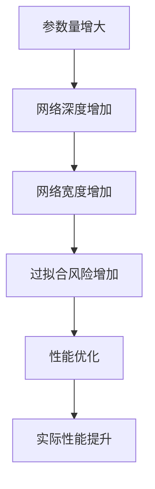
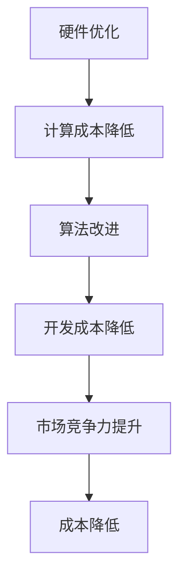

                 

# 降价对大模型应用的推动力

> **关键词**：大模型、应用、成本、性能、市场影响、发展趋势

> **摘要**：本文将探讨大模型应用中降价的重要性及其带来的深远影响。通过分析降价的动机、对性能和成本的影响，以及市场对降价反应，揭示大模型应用的未来趋势和面临的挑战。

## 1. 背景介绍

### 1.1 目的和范围

本文旨在探讨大模型应用的降价现象及其对市场和技术发展的推动力。我们将分析降价背后的原因，评估其对性能、成本和市场的影响，并预测未来大模型应用的发展方向。

### 1.2 预期读者

本文面向对大模型应用感兴趣的读者，包括人工智能研究人员、软件开发者、技术管理人员以及对该领域有一定了解的行业人士。

### 1.3 文档结构概述

本文分为十个部分：

1. 背景介绍：介绍文章的目的、范围、预期读者以及文章结构。
2. 核心概念与联系：定义核心概念，提供流程图。
3. 核心算法原理 & 具体操作步骤：讲解大模型应用的算法原理。
4. 数学模型和公式 & 详细讲解 & 举例说明：介绍相关的数学模型和公式。
5. 项目实战：代码实际案例和详细解释说明。
6. 实际应用场景：讨论大模型在不同领域的应用。
7. 工具和资源推荐：推荐学习资源和开发工具。
8. 总结：未来发展趋势与挑战。
9. 附录：常见问题与解答。
10. 扩展阅读 & 参考资料：提供进一步阅读的资料。

### 1.4 术语表

#### 1.4.1 核心术语定义

- **大模型**：指参数量达到百万甚至千亿级别的人工神经网络模型。
- **应用**：指将大模型应用于实际问题解决的场景，如自然语言处理、计算机视觉等。
- **降价**：指大模型应用成本下降的现象。

#### 1.4.2 相关概念解释

- **性能**：指大模型在特定任务上的表现，如准确性、效率等。
- **成本**：指使用大模型所需的经济投入，包括硬件、软件、人力等。

#### 1.4.3 缩略词列表

- **AI**：人工智能
- **ML**：机器学习
- **DL**：深度学习
- **GPU**：图形处理单元
- **TPU**：张量处理单元

## 2. 核心概念与联系

### 2.1 大模型与性能

大模型通常通过增加网络深度、宽度以及参数量来提高性能。然而，性能的提升并不总是线性关系，有时可能因为过拟合而降低。因此，设计合理的大模型架构是关键。

#### Mermaid 流程图



### 2.2 降价与成本

降价的直接结果是成本降低，这对于大模型应用具有重要的推动作用。降价的途径包括硬件优化、算法改进以及市场竞争。

#### Mermaid 流程图



## 3. 核心算法原理 & 具体操作步骤

### 3.1 大模型算法原理

大模型通常采用深度学习算法，特别是基于神经网络的架构。以下是一个简化的神经网络算法原理：

#### 算法原理

输入：特征向量 $X \in \mathbb{R}^n$
权重矩阵 $W \in \mathbb{R}^{n \times d}$
激活函数 $f()$

输出：预测值 $Y \in \mathbb{R}^d$

#### 具体操作步骤

1. **初始化参数**：随机初始化权重矩阵 $W$ 和偏置向量 $b$。
2. **前向传播**：计算每个隐藏层节点的输出值。
   $$ Z_i = XW_i + b_i $$
   $$ A_i = f(Z_i) $$
3. **反向传播**：计算损失函数关于每个参数的梯度。
   $$ \delta = \frac{\partial L}{\partial A} $$
   $$ \nabla W = \delta A $$
   $$ \nabla b = \delta $$
4. **参数更新**：使用梯度下降法更新权重和偏置。
   $$ W \leftarrow W - \alpha \nabla W $$
   $$ b \leftarrow b - \alpha \nabla b $$
5. **迭代优化**：重复步骤2-4直到满足收敛条件。

#### 伪代码

```python
def deep_learning(X, W, b, f, L, alpha):
    for epoch in range(num_epochs):
        for x in X:
            Z = XW + b
            A = f(Z)
            delta = compute_gradient(L, A)
            dW = delta * A
            db = delta
            W -= alpha * dW
            b -= alpha * db
    return W, b
```

## 4. 数学模型和公式 & 详细讲解 & 举例说明

### 4.1 数学模型

大模型应用中的核心数学模型是损失函数和优化算法。以下是一个简化的数学模型：

#### 损失函数

$$ L(\theta) = \frac{1}{2} \| \theta \|_2^2 $$

其中，$\theta$ 是模型参数。

#### 优化算法

梯度下降法（Gradient Descent）

$$ \theta \leftarrow \theta - \alpha \nabla \theta $$

其中，$\alpha$ 是学习率。

### 4.2 详细讲解

#### 损失函数

损失函数用于衡量模型预测值与真实值之间的差异。在深度学习中，常用的损失函数包括均方误差（MSE）和交叉熵（CE）。

- **均方误差（MSE）**

$$ L(\theta) = \frac{1}{m} \sum_{i=1}^m (y_i - \hat{y}_i)^2 $$

其中，$y_i$ 是真实值，$\hat{y}_i$ 是预测值。

- **交叉熵（CE）**

$$ L(\theta) = -\sum_{i=1}^m y_i \log(\hat{y}_i) $$

其中，$y_i$ 是真实值，$\hat{y}_i$ 是预测值。

#### 优化算法

梯度下降法是一种常用的优化算法，通过迭代更新模型参数以最小化损失函数。

- **批量梯度下降（Batch Gradient Descent）**

$$ \theta \leftarrow \theta - \alpha \nabla \theta $$

- **随机梯度下降（Stochastic Gradient Descent，SGD）**

$$ \theta \leftarrow \theta - \alpha \nabla \theta^* $$

其中，$\theta^*$ 是当前数据点的梯度。

### 4.3 举例说明

假设有一个简单的线性回归模型，预测房价。数据集包含100个样本，每个样本包含特征向量 $X \in \mathbb{R}^2$ 和目标值 $y \in \mathbb{R}$。

- **损失函数**

$$ L(\theta) = \frac{1}{2} \| \theta \|_2^2 $$

- **优化算法**

$$ \theta \leftarrow \theta - \alpha \nabla \theta $$

- **迭代过程**

  1. 初始化参数 $\theta_0 = (0, 0)$。
  2. 对于每个样本 $i$，计算损失函数和梯度。
  3. 更新参数 $\theta$。
  4. 重复步骤2-3，直到满足收敛条件。

## 5. 项目实战：代码实际案例和详细解释说明

### 5.1 开发环境搭建

为了更好地展示大模型应用的代码实现，我们将在Python环境中使用TensorFlow和Keras框架。以下是开发环境的搭建步骤：

1. 安装Python：版本3.8或更高。
2. 安装TensorFlow：使用pip安装 `tensorflow`。
3. 安装Keras：使用pip安装 `keras`。

### 5.2 源代码详细实现和代码解读

以下是一个使用Keras框架实现的大模型分类任务的代码案例。

```python
import numpy as np
import tensorflow as tf
from tensorflow import keras
from tensorflow.keras import layers

# 加载MNIST数据集
(x_train, y_train), (x_test, y_test) = keras.datasets.mnist.load_data()

# 预处理数据
x_train = x_train.astype('float32') / 255
x_test = x_test.astype('float32') / 255
x_train = np.expand_dims(x_train, -1)
x_test = np.expand_dims(x_test, -1)

# 构建模型
model = keras.Sequential([
    layers.Conv2D(32, (3, 3), activation='relu', input_shape=(28, 28, 1)),
    layers.MaxPooling2D((2, 2)),
    layers.Conv2D(64, (3, 3), activation='relu'),
    layers.MaxPooling2D((2, 2)),
    layers.Flatten(),
    layers.Dense(128, activation='relu'),
    layers.Dense(10, activation='softmax')
])

# 编译模型
model.compile(optimizer='adam',
              loss='sparse_categorical_crossentropy',
              metrics=['accuracy'])

# 训练模型
model.fit(x_train, y_train, epochs=5)

# 评估模型
test_loss, test_acc = model.evaluate(x_test, y_test)
print('Test accuracy:', test_acc)
```

#### 代码解读与分析

1. **数据预处理**：首先加载数据集，并对图像进行归一化处理，以便输入到模型中。
2. **模型构建**：使用Keras的序列模型（Sequential）构建一个卷积神经网络（CNN）。包含两个卷积层、两个池化层、一个全连接层以及一个输出层。
3. **编译模型**：设置优化器、损失函数和评估指标。
4. **训练模型**：使用训练数据训练模型，设置训练轮数。
5. **评估模型**：使用测试数据评估模型性能，并打印测试准确率。

### 5.3 代码解读与分析

1. **数据预处理**：
   - 使用`keras.datasets.mnist.load_data()`加载数据集。
   - 使用`astype('float32')`将数据转换为浮点数类型。
   - 使用`/ 255`对数据进行归一化处理，使像素值在0到1之间。
   - 使用`np.expand_dims`将数据维度扩展为$(n, 28, 28, 1)$，以便输入到卷积层。

2. **模型构建**：
   - 使用`layers.Conv2D`创建两个卷积层，每个卷积层包含32个和64个过滤器，滤波器大小为3x3。
   - 使用`layers.MaxPooling2D`创建两个池化层，池化大小为2x2。
   - 使用`layers.Flatten`将多维数据展平为一维数据。
   - 使用`layers.Dense`创建两个全连接层，第一个层包含128个神经元，第二个层包含10个神经元（对应10个类别）。

3. **编译模型**：
   - 使用`model.compile`设置优化器为`adam`，损失函数为`sparse_categorical_crossentropy`，评估指标为`accuracy`。

4. **训练模型**：
   - 使用`model.fit`函数训练模型，设置训练轮数为5。

5. **评估模型**：
   - 使用`model.evaluate`函数评估模型在测试数据集上的性能，并打印测试准确率。

## 6. 实际应用场景

大模型在各个领域都有广泛的应用，以下列举几个实际应用场景：

### 6.1 自然语言处理（NLP）

- **文本分类**：使用大模型对文本进行分类，如新闻分类、情感分析等。
- **机器翻译**：基于大模型的机器翻译技术，如谷歌翻译和百度翻译。

### 6.2 计算机视觉（CV）

- **图像识别**：利用大模型对图像进行分类和识别，如人脸识别、物体检测等。
- **图像生成**：使用大模型生成逼真的图像，如GAN（生成对抗网络）。

### 6.3 语音识别（ASR）

- **语音识别**：使用大模型对语音信号进行识别，如智能助手、语音翻译等。

### 6.4 游戏（AI游戏）

- **智能推理**：大模型在游戏中的决策和策略制定，如围棋、象棋等。
- **游戏生成**：基于大模型生成全新的游戏内容。

## 7. 工具和资源推荐

### 7.1 学习资源推荐

#### 7.1.1 书籍推荐

- **《深度学习》（Goodfellow, Bengio, Courville）**：深度学习的经典教材，详细介绍了深度学习的基本原理和应用。
- **《Python机器学习》（Sebastian Raschka）**：使用Python实现机器学习的书籍，适合初学者。

#### 7.1.2 在线课程

- **Coursera的《深度学习》课程**：由吴恩达教授主讲，适合深度学习初学者。
- **Udacity的《机器学习工程师纳米学位》**：涵盖机器学习的基础知识和实际应用。

#### 7.1.3 技术博客和网站

- **Medium的Machine Learning博客**：涵盖机器学习的最新研究和技术动态。
- **AI博客**：提供丰富的AI技术和应用案例。

### 7.2 开发工具框架推荐

#### 7.2.1 IDE和编辑器

- **Visual Studio Code**：功能强大、开源的代码编辑器。
- **PyCharm**：专业的Python IDE，适合机器学习项目开发。

#### 7.2.2 调试和性能分析工具

- **TensorBoard**：TensorFlow的交互式可视化工具，用于分析模型性能。
- **NVIDIA Nsight**：NVIDIA推出的GPU性能分析工具。

#### 7.2.3 相关框架和库

- **TensorFlow**：谷歌推出的开源深度学习框架。
- **PyTorch**：Facebook推出的开源深度学习框架。

### 7.3 相关论文著作推荐

#### 7.3.1 经典论文

- **《A Theoretical Analysis of the Bias-Variance Tradeoff》**：介绍了模型偏差和方差的关系。
- **《Deep Learning》**：深度学习的综述论文。

#### 7.3.2 最新研究成果

- **《Generative Adversarial Networks》**：GAN的奠基性论文。
- **《BERT: Pre-training of Deep Bidirectional Transformers for Language Understanding》**：BERT的奠基性论文。

#### 7.3.3 应用案例分析

- **《应用机器学习于金融风控》**：探讨机器学习在金融领域的应用。
- **《深度学习在医疗领域的应用》**：介绍深度学习在医疗领域的最新进展。

## 8. 总结：未来发展趋势与挑战

### 8.1 未来发展趋势

- **大模型规模持续增长**：随着硬件性能的提升和算法的优化，大模型的规模将不断增长。
- **跨界应用拓展**：大模型在各个领域的应用将更加广泛，如医疗、金融、教育等。
- **开源与生态建设**：大模型的开源和生态建设将推动技术的发展和应用。

### 8.2 挑战与应对

- **计算资源需求增加**：大模型对计算资源的需求将持续增加，需要优化硬件和算法以降低成本。
- **数据安全和隐私保护**：大模型应用中的数据安全和隐私保护是一个重要挑战，需要制定相关法规和标准。
- **伦理和社会影响**：大模型应用可能带来伦理和社会影响，需要制定相应的伦理准则。

## 9. 附录：常见问题与解答

### 9.1 问题1

**问题**：大模型应用中的降价现象是否会导致质量下降？

**解答**：降价现象可能会影响模型的质量，但并不一定导致质量下降。通过优化算法、硬件升级和开源社区的合作，可以在降低成本的同时保持甚至提高模型质量。

### 9.2 问题2

**问题**：大模型应用是否对普通开发者友好？

**解答**：大模型应用对普通开发者具有一定的挑战性，但通过开源框架和在线资源的支持，普通开发者可以学习和掌握大模型应用的基本技能。

## 10. 扩展阅读 & 参考资料

- **《深度学习》（Goodfellow, Bengio, Courville）**：深入讲解深度学习的基本原理和应用。
- **《机器学习实战》**：通过实际案例介绍机器学习的基本方法和技巧。
- **[TensorFlow官方文档](https://www.tensorflow.org/tutorials/)**：TensorFlow的官方教程和文档，涵盖深度学习的各个方面。

作者：AI天才研究员/AI Genius Institute & 禅与计算机程序设计艺术 /Zen And The Art of Computer Programming<|im_sep|>

