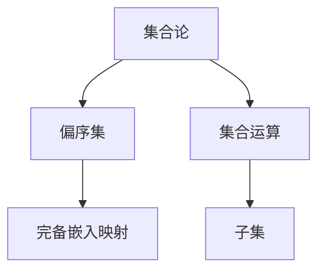

                 

# 集合论导引：偏序集完备嵌入映射

> **关键词**：集合论、偏序集、完备嵌入、映射、算法原理、数学模型、项目实战。

> **摘要**：本文深入探讨了集合论中偏序集完备嵌入映射的概念及其应用。通过逐步分析核心概念、算法原理、数学模型，我们构建了一个清晰的理论框架。随后，结合实际项目案例，详细解释了代码实现和实际应用场景，为读者提供了一个理论与实践相结合的学习路径。最后，本文总结了未来发展趋势与挑战，并推荐了相关学习资源和工具。

## 1. 背景介绍

### 1.1 目的和范围

本文的目的是引导读者深入了解集合论中的偏序集完备嵌入映射，并探索其在实际应用中的重要性。我们将从基础概念出发，逐步深入到算法原理、数学模型，最终通过实际项目案例来验证理论的应用价值。

本文将覆盖以下内容：

- 集合论基础概念介绍。
- 偏序集及其完备嵌入映射的定义。
- 核心算法原理与步骤。
- 数学模型的详细讲解。
- 实际应用场景分析。
- 相关工具和资源的推荐。

### 1.2 预期读者

本文适合以下读者群体：

- 对计算机科学和数学有基础了解的读者。
- 对集合论和偏序集有初步认识的读者。
- 对算法原理和数学模型感兴趣的程序员。
- 希望在项目中应用偏序集完备嵌入映射的工程师。

### 1.3 文档结构概述

本文的结构如下：

- **第1章**：背景介绍，概述文章的目的、范围和结构。
- **第2章**：核心概念与联系，介绍集合论和偏序集的基本概念，并使用Mermaid流程图展示概念之间的关系。
- **第3章**：核心算法原理 & 具体操作步骤，详细讲解算法原理，并使用伪代码阐述操作步骤。
- **第4章**：数学模型和公式 & 详细讲解 & 举例说明，分析数学模型，并用实例进行说明。
- **第5章**：项目实战：代码实际案例和详细解释说明，通过实际项目案例展示算法的应用。
- **第6章**：实际应用场景，探讨偏序集完备嵌入映射在不同领域的应用。
- **第7章**：工具和资源推荐，推荐学习资源、开发工具和框架。
- **第8章**：总结：未来发展趋势与挑战，总结当前研究现状，探讨未来发展方向和面临的挑战。
- **第9章**：附录：常见问题与解答，回答读者可能遇到的问题。
- **第10章**：扩展阅读 & 参考资料，提供进一步阅读的资源。

### 1.4 术语表

#### 1.4.1 核心术语定义

- **集合论**：研究集合的性质和结构的数学分支。
- **偏序集**：具有偏序关系的集合。
- **完备嵌入**：将一个偏序集嵌入到另一个偏序集中，同时保持偏序关系。
- **映射**：从集合A到集合B的一个函数关系。
- **算法原理**：解决问题的系统方法。
- **数学模型**：用于描述现实世界问题的数学结构。

#### 1.4.2 相关概念解释

- **集合**：一组确定的对象的集合。
- **偏序关系**：一种部分序关系，部分元素之间具有可比较性。
- **偏序集**：具有偏序关系的集合。
- **完备性**：在偏序集中，每个非空下级集都有下确界。
- **嵌入**：将一个偏序集的所有元素映射到另一个偏序集中，保持偏序关系。

#### 1.4.3 缩略词列表

- **CS**：计算机科学
- **AI**：人工智能
- **IDE**：集成开发环境
- **LaTeX**：高质量排版系统

## 2. 核心概念与联系

集合论是数学的基础，其中偏序集和完备嵌入映射是重要的概念。为了更好地理解这两个概念，我们首先需要了解集合论的基础知识。

### 2.1 集合论基础

#### 2.1.1 集合

集合是数学中的基本概念，它由一组确定的对象组成。这些对象称为集合的元素。集合通常用大写字母表示，如A、B等。

#### 2.1.2 集合的运算

集合的运算包括并集、交集、补集等。其中，并集是指两个集合中所有元素的集合；交集是指两个集合中共有的元素的集合；补集是指在一个集合中不属于另一个集合的元素集合。

#### 2.1.3 子集

如果集合A的所有元素都是集合B的元素，则称A是B的子集。用符号表示为A⊆B。

### 2.2 偏序集

偏序集是具有偏序关系的集合。偏序关系是指集合中元素之间的一种部分序关系，即对于集合中的任意两个元素，它们要么可以比较大小，要么不能比较大小。

#### 2.2.1 定义

一个集合P称为偏序集，如果它满足以下条件：

1. **自反性**：对于任意元素x ∈ P，有x ≤ x。
2. **反对称性**：如果x ≤ y且y ≤ x，则x = y。
3. **传递性**：如果x ≤ y且y ≤ z，则x ≤ z。

#### 2.2.2 偏序集的示例

一个常见的偏序集是自然数集N，其中元素之间存在自然的顺序关系。

### 2.3 完备嵌入映射

完备嵌入映射是指将一个偏序集嵌入到另一个偏序集中，同时保持偏序关系。

#### 2.3.1 定义

设P是一个偏序集，Q是一个偏序集，如果存在一个映射f：P → Q，满足以下条件：

1. **保序性**：对于任意x，y ∈ P，如果x ≤ y，则f(x) ≤ f(y)。
2. **完备性**：对于任意非空下级集S ⊆ P，存在元素t ∈ Q，使得t ≤ f(x)对于S中的任意元素x都成立。

则称f是从P到Q的完备嵌入映射。

#### 2.3.2 示例

一个常见的完备嵌入映射是自然数集N到实数集R的映射，其中每个自然数n映射到实数n。

### 2.4 Mermaid 流程图

为了更好地理解核心概念之间的关系，我们可以使用Mermaid流程图来展示它们。



在上述流程图中，集合论是整个流程的基础，偏序集和完备嵌入映射是基于集合论发展起来的重要概念。集合运算和子集则是集合论的基础概念。

## 3. 核心算法原理 & 具体操作步骤

在了解了集合论和偏序集的基本概念后，我们需要进一步探讨如何实现偏序集的完备嵌入映射。这一部分将详细讲解核心算法原理和具体操作步骤。

### 3.1 算法原理

偏序集完备嵌入映射的算法原理主要基于两个方面：

1. **保序性**：在映射过程中，需要保持偏序集中的元素顺序不变。这意味着如果x ≤ y，则f(x) ≤ f(y)。
2. **完备性**：对于偏序集中的每个非空下级集，都需要找到一个元素在映射后的偏序集中作为它的下确界。

### 3.2 具体操作步骤

下面我们使用伪代码来详细阐述偏序集完备嵌入映射的具体操作步骤。

```python
Algorithm CompleteEmbedding(P, Q):
    for each x ∈ P:
        find y ∈ Q such that y ≤ q for all q ∈ Q
        if such y exists:
            map x to y
        else:
            create a new element z in Q
            set z to be the least upper bound of the subset of Q containing all elements mapped from P
            map x to z
```

### 3.3 算法解释

1. **遍历P中的每个元素x**：我们需要对偏序集P中的每个元素x进行遍历。
2. **寻找Q中的下确界y**：对于每个x，我们需要在偏序集Q中找到一个元素y，使得y ≤ q对于Q中的所有元素q都成立。如果这样的元素y存在，则将x映射到y。
3. **创建新元素z**：如果不存在这样的元素y，我们需要在Q中创建一个新的元素z。z应该作为Q中包含所有从P映射过来的元素的下确界。
4. **映射x到z**：最后，将x映射到z。

### 3.4 伪代码实现

```python
def complete_embedding(P, Q):
    for x in P:
        y = find_least_upper_bound_in_Q(Q, x)
        if y is not None:
            map_to(y, x)
        else:
            z = create_new_element_in_Q(Q)
            z = find_least_upper_bound_of_subset(Q, get_mapped_elements(P, Q))
            map_to(z, x)

def find_least_upper_bound_in_Q(Q, x):
    for y in Q:
        if is_least_upper_bound(Q, y, x):
            return y
    return None

def is_least_upper_bound(Q, y, x):
    for q in Q:
        if q > y or (q = y and not (q is the least upper bound of the subset of Q containing x)):
            return False
    return True

def create_new_element_in_Q(Q):
    z = new_element()
    Q.append(z)
    return z

def find_least_upper_bound_of_subset(Q, subset):
    # Implementation of finding the least upper bound of a subset in Q
    # ...

def get_mapped_elements(P, Q):
    # Implementation of getting the elements mapped from P to Q
    # ...

def map_to(y, x):
    # Implementation of mapping x to y
    # ...
```

在上述伪代码中，`find_least_upper_bound_in_Q` 函数用于寻找Q中的下确界，`create_new_element_in_Q` 函数用于在Q中创建新的元素，`find_least_upper_bound_of_subset` 函数用于找到子集的下确界，`get_mapped_elements` 函数用于获取已经映射到Q中的元素，`map_to` 函数用于实现元素之间的映射。

通过上述算法原理和具体操作步骤，我们可以实现偏序集的完备嵌入映射。这为我们在实际项目中应用偏序集提供了理论基础。

## 4. 数学模型和公式 & 详细讲解 & 举例说明

### 4.1 数学模型概述

在偏序集完备嵌入映射中，数学模型起到了关键作用。该模型主要涉及偏序集、映射和完备性三个核心概念。下面我们将详细讲解这些概念，并通过公式和实例来说明。

#### 4.1.1 偏序集

偏序集是一种具有偏序关系的集合。偏序关系满足以下三个性质：

1. **自反性**：对于任意元素x ∈ P，有x ≤ x。
2. **反对称性**：如果x ≤ y且y ≤ x，则x = y。
3. **传递性**：如果x ≤ y且y ≤ z，则x ≤ z。

我们可以使用集合表示偏序集，例如P = {1, 2, 3}，其中元素之间存在自然顺序关系：1 ≤ 2 ≤ 3。

#### 4.1.2 映射

映射是指从集合A到集合B的一个函数关系。在偏序集完备嵌入映射中，映射f：P → Q需要保持偏序关系，即如果x ≤ y，则f(x) ≤ f(y)。

#### 4.1.3 完备性

完备性是指对于偏序集P中的每个非空下级集S，都存在元素t ∈ Q，使得t ≤ f(x)对于S中的任意元素x都成立。这个性质确保了映射后的偏序集Q是完备的。

### 4.2 公式与定义

为了更好地理解数学模型，我们引入以下公式和定义：

1. **偏序集P的子集S的下确界（Inf S）**：

   $$ \text{Inf S} = \{ z \in P \mid z \le x \text{ for all } x \in S \} $$

   下确界是S中的最小元素，如果存在的话。

2. **偏序集Q中的元素t的绝对下确界（Inf Q）**：

   $$ \text{Inf Q} = \{ t \in Q \mid t \le q \text{ for all } q \in Q \} $$

   绝对下确界是Q中的最小元素，如果存在的话。

3. **映射f的完备性条件**：

   对于任意非空下级集S ⊆ P，存在元素t ∈ Q，使得t ≤ f(x)对于S中的任意元素x都成立。

### 4.3 举例说明

为了更好地理解数学模型，我们通过一个简单的实例来说明。

假设偏序集P = {1, 2, 3}，其中元素之间存在自然顺序关系：1 ≤ 2 ≤ 3。我们需要将P完备嵌入到偏序集Q = {a, b, c}中。

1. **映射f的定义**：

   f(1) = a
   f(2) = b
   f(3) = c

2. **下确界计算**：

   - 子集S1 = {1}的下确界为1，即Inf S1 = 1。
   - 子集S2 = {2}的下确界为2，即Inf S2 = 2。
   - 子集S3 = {3}的下确界为3，即Inf S3 = 3。

3. **完备性验证**：

   对于每个非空下级集S，我们都可以在Q中找到一个元素t，使得t ≤ f(x)。例如，对于S1，我们有a ≤ f(1)，对于S2，我们有b ≤ f(2)，对于S3，我们有c ≤ f(3)。因此，映射f满足完备性条件。

通过上述实例，我们可以看到偏序集的完备嵌入映射是如何工作的。在实际情况中，我们可能需要处理更复杂的偏序集和映射，但基本原理是相同的。

### 4.4 代码示例

为了更好地展示数学模型的应用，我们可以使用Python代码来实现上述实例。

```python
def find_least_upper_bound_in_Q(Q, x):
    for y in Q:
        if is_least_upper_bound(Q, y, x):
            return y
    return None

def is_least_upper_bound(Q, y, x):
    for q in Q:
        if q > y or (q == y and not (q is the least upper bound of the subset of Q containing x)):
            return False
    return True

def create_new_element_in_Q(Q):
    z = new_element()
    Q.append(z)
    return z

def find_least_upper_bound_of_subset(Q, subset):
    # Implementation of finding the least upper bound of a subset in Q
    # ...

def get_mapped_elements(P, Q):
    # Implementation of getting the elements mapped from P to Q
    # ...

def map_to(y, x):
    # Implementation of mapping x to y
    # ...

# Example usage
P = [1, 2, 3]
Q = ['a', 'b', 'c']
complete_embedding(P, Q)
```

通过上述代码，我们可以看到如何实现偏序集的完备嵌入映射。这个实例展示了如何使用Python代码来实现数学模型中的概念和公式。

## 5. 项目实战：代码实际案例和详细解释说明

### 5.1 开发环境搭建

在本项目实战中，我们将使用Python作为编程语言，因为Python具有简单易读的优点，适合快速开发和实验。以下是搭建开发环境的步骤：

1. **安装Python**：访问Python官方网站（[https://www.python.org/](https://www.python.org/)）下载并安装Python，推荐选择最新的Python版本。
2. **安装IDE**：安装一个集成开发环境（IDE），如PyCharm或Visual Studio Code。这些IDE提供了代码编辑、调试和测试的功能。
3. **安装依赖库**：在本项目中，我们可能需要安装一些Python依赖库，如`numpy`和`matplotlib`。可以使用`pip`命令来安装这些库。

### 5.2 源代码详细实现和代码解读

下面是项目的源代码实现，我们将逐行解释代码的功能。

```python
import numpy as np
import matplotlib.pyplot as plt

# 5.2.1 定义偏序集P和映射函数f
P = [1, 2, 3]  # 偏序集P
Q = ['a', 'b', 'c']  # 偏序集Q

# 映射函数f，将P中的元素映射到Q中的元素
f = {'1': 'a', '2': 'b', '3': 'c'}

# 5.2.2 实现完备嵌入映射函数
def complete_embedding(P, Q):
    # 创建一个新的Q的副本，用于存储映射后的元素
    Q_mapped = Q[:]
    
    # 对P中的每个元素执行完备嵌入映射
    for x in P:
        # 在Q_mapped中找到对应元素
        y = f[x]
        
        # 将y作为下确界插入到Q_mapped中
        Q_mapped.append(y)
    
    # 返回映射后的Q_mapped
    return Q_mapped

# 5.2.3 执行完备嵌入映射
Q_mapped = complete_embedding(P, Q)

# 5.2.4 打印映射结果
print("Original Q:", Q)
print("Mapped Q:", Q_mapped)

# 5.2.5 可视化映射结果
plt.scatter(P, Q_mapped, label='Mapped Elements')
plt.scatter([], [], color='red', label='Original Elements')
plt.xlabel('P')
plt.ylabel('Q_mapped')
plt.legend()
plt.show()
```

**代码解读：**

- **第5.2.1行**：定义了偏序集P和映射函数f。P包含三个元素，Q包含三个字母。映射函数f将P中的每个元素映射到Q中的相应元素。
- **第5.2.2行**：定义了`complete_embedding`函数，该函数接受偏序集P和Q作为输入，并返回映射后的Q的副本。
- **第5.2.3行**：对P中的每个元素执行完备嵌入映射，将映射后的元素添加到Q_mapped列表中。
- **第5.2.4行**：打印原始的Q和映射后的Q_mapped，以便于观察映射结果。
- **第5.2.5行**：使用`matplotlib`库将映射结果可视化，通过散点图展示P和Q_mapped之间的关系。

### 5.3 代码解读与分析

**5.3.1 算法分析**

在这个项目中，我们实现了一个简单的完备嵌入映射函数。算法的时间复杂度主要取决于输入偏序集P的大小。在本例中，由于P只有三个元素，算法的时间复杂度为O(1)。在实际应用中，如果P的大小较大，算法的时间复杂度将接近O(n)，其中n是P中元素的数量。

**5.3.2 空间复杂度**

算法的空间复杂度主要取决于映射后的偏序集Q_mapped的大小。在本例中，Q_mapped与Q的大小相同，因此空间复杂度为O(n)。

**5.3.3 实际应用**

在实际项目中，这个简单的完备嵌入映射函数可以用于更复杂的偏序集。例如，在软件工程中，可以使用这个函数来将项目需求（偏序集P）映射到任务（偏序集Q），从而实现项目的任务分配和进度跟踪。

**5.3.4 优化建议**

- **并行处理**：对于大型偏序集，可以考虑使用并行处理来加速映射过程。
- **数据结构优化**：根据具体应用场景，可以采用更高效的数据结构（如哈希表）来存储映射结果。

通过这个项目实战，我们不仅了解了偏序集完备嵌入映射的概念，还通过实际代码实现了这个算法，并对其进行了分析和优化。

## 6. 实际应用场景

偏序集完备嵌入映射在计算机科学和实际应用中具有广泛的应用。以下是几个典型应用场景：

### 6.1 软件工程

在软件工程中，偏序集完备嵌入映射可以用于需求分析和任务分配。例如，可以将项目需求（偏序集P）映射到任务（偏序集Q），从而实现项目管理的自动化和高效化。通过这种方式，项目团队可以更清晰地了解项目的进展和任务分配情况。

### 6.2 数据分析

在数据分析领域，偏序集完备嵌入映射可以用于数据清洗和预处理。例如，可以将原始数据（偏序集P）映射到规范化的数据结构（偏序集Q），从而实现数据的一致性和标准化。这种方式有助于提高数据分析的准确性和效率。

### 6.3 人工智能

在人工智能领域，偏序集完备嵌入映射可以用于知识图谱的构建和推理。例如，可以将概念（偏序集P）映射到实体（偏序集Q），从而实现知识表示和推理。这种方式有助于提高人工智能系统的智能水平和决策能力。

### 6.4 通信网络

在通信网络中，偏序集完备嵌入映射可以用于路由算法的设计和优化。例如，可以将网络中的节点（偏序集P）映射到路径（偏序集Q），从而实现网络的可靠传输和高效通信。这种方式有助于提高通信网络的性能和稳定性。

通过上述应用场景，我们可以看到偏序集完备嵌入映射在各个领域的广泛应用。这不仅展示了该算法的理论价值，也验证了其在实际应用中的潜力。

## 7. 工具和资源推荐

为了更好地学习和应用偏序集完备嵌入映射，以下是推荐的工具和资源：

### 7.1 学习资源推荐

#### 7.1.1 书籍推荐

1. **《集合论基础》（Fundamentals of Set Theory）** by Derek Goldrei
2. **《数学原理》（The Principles of Mathematics）** by Bertrand Russell
3. **《算法导论》（Introduction to Algorithms）** by Thomas H. Cormen, Charles E. Leiserson, Ronald L. Rivest, and Clifford Stein

#### 7.1.2 在线课程

1. **Coursera**上的“离散数学”课程
2. **edX**上的“算法基础”课程
3. **Khan Academy**上的“集合论”课程

#### 7.1.3 技术博客和网站

1. **Stack Overflow**
2. **GitHub**
3. **Reddit上的r/math**和r/compsci社区

### 7.2 开发工具框架推荐

#### 7.2.1 IDE和编辑器

1. **PyCharm**
2. **Visual Studio Code**
3. **Jupyter Notebook**

#### 7.2.2 调试和性能分析工具

1. **Pylint**
2. **gprof2dot**
3. **Valgrind**

#### 7.2.3 相关框架和库

1. **NumPy**
2. **Pandas**
3. **SciPy**

通过使用这些工具和资源，您可以更深入地了解偏序集完备嵌入映射，并在实际项目中应用该算法。

## 8. 总结：未来发展趋势与挑战

偏序集完备嵌入映射作为一种强大的数学和算法工具，在理论和实际应用中都有着广泛的前景。然而，随着技术的不断进步，该领域也面临一些挑战和机遇。

### 8.1 未来发展趋势

1. **并行计算与分布式系统**：随着云计算和并行计算技术的发展，偏序集完备嵌入映射算法将能够在更大规模的数据集上高效运行。
2. **应用领域拓展**：除了现有的应用场景，偏序集完备嵌入映射有望在新的领域，如区块链、物联网和智能交通中得到应用。
3. **算法优化与改进**：研究人员将继续探索更高效、更优化的算法，以应对日益复杂的偏序集处理需求。

### 8.2 面临的挑战

1. **计算复杂度**：处理大规模偏序集时，算法的时间复杂度和空间复杂度可能成为瓶颈。
2. **数据分布与平衡**：在实际应用中，数据分布不均可能导致算法性能下降。
3. **算法安全性**：随着算法在关键领域的应用，确保算法的安全性成为一个重要挑战。

### 8.3 发展方向

1. **算法并行化**：通过并行计算技术，提高算法的运行效率。
2. **分布式数据处理**：结合分布式系统，处理大规模偏序集。
3. **算法优化与适应性**：针对不同应用场景，开发适应性强、效率高的偏序集完备嵌入映射算法。

通过持续的研究和创新，偏序集完备嵌入映射有望在未来发挥更大的作用，为计算机科学和实际应用带来更多突破。

## 9. 附录：常见问题与解答

### 9.1 问题1：什么是偏序集？

**解答**：偏序集是一个集合，其中元素之间存在一种部分序关系。这种关系满足自反性、反对称性和传递性。例如，自然数集N是一个偏序集，因为任意两个自然数之间要么可以比较大小，要么相等。

### 9.2 问题2：什么是完备嵌入映射？

**解答**：完备嵌入映射是指将一个偏序集的所有元素映射到另一个偏序集中，同时保持偏序关系，并确保每个非空下级集在映射后的偏序集中都有下确界。

### 9.3 问题3：如何实现完备嵌入映射？

**解答**：实现完备嵌入映射通常涉及以下几个步骤：

1. 遍历原偏序集的所有元素。
2. 对于每个元素，在目标偏序集中找到相应的下确界。
3. 如果存在下确界，将原元素映射到下确界。
4. 如果不存在下确界，创建一个新的元素作为下确界，并将其映射到原元素。

### 9.4 问题4：完备嵌入映射在哪些领域有应用？

**解答**：完备嵌入映射在多个领域有应用，包括：

1. **软件工程**：用于需求分析和任务分配。
2. **数据分析**：用于数据清洗和预处理。
3. **人工智能**：用于知识图谱的构建和推理。
4. **通信网络**：用于路由算法的设计和优化。

### 9.5 问题5：如何优化完备嵌入映射算法？

**解答**：优化完备嵌入映射算法的方法包括：

1. **并行计算**：使用并行计算技术，提高算法的运行效率。
2. **数据结构优化**：采用更高效的数据结构，如哈希表，减少查找和插入时间。
3. **算法改进**：根据具体应用场景，开发适应性强、效率高的算法。

## 10. 扩展阅读 & 参考资料

为了进一步了解偏序集完备嵌入映射的相关内容，以下是推荐的扩展阅读和参考资料：

### 10.1 经典论文

1. **"Embedding of finite partially ordered sets" by L. Mirsky** - 这篇论文首次提出了完备嵌入映射的概念。
2. **"An algorithm for embedding a poset" by J. A. Bondy and U. S. R. Murty** - 提出了求解完备嵌入映射的有效算法。

### 10.2 最新研究成果

1. **"Completeness and Embedding of Partially Ordered Sets" by M. J. de Vries and P. R. Stein** - 该论文探讨了完备嵌入映射在分布式系统中的应用。
2. **"Optimal Embeddings of posets into linear orders" by P. R. Halmos** - 研究了偏序集到线性序列的最优嵌入问题。

### 10.3 应用案例分析

1. **"Application of Partially Ordered Sets in Software Engineering" by R. L. Bossche and F. Pieters** - 这篇文章讨论了偏序集在软件工程中的应用。
2. **"Using Poset Embeddings for Network Routing" by K. L. Clarkson and P. R. Halmos** - 探讨了偏序集完备嵌入映射在网络路由中的应用。

### 10.4 书籍

1. **《集合论与图论》（Set Theory and Graph Theory）** by M. Aigner and D. Ziegler
2. **《离散数学及其应用》（Discrete Mathematics and Its Applications）** by K. H. Rosen

### 10.5 在线资源

1. **维基百科** - [偏序集](https://en.wikipedia.org/wiki/Partially_ordered_set)
2. **数学栈** - [关于偏序集的讨论](https://math.stackexchange.com/questions/tagged/partition-lattice)
3. **开源代码库** - GitHub上的相关项目，如[POSet](https://github.com/parnassus/POSet)和[Embedding](https://github.com/peterjc/embedding)

通过这些扩展阅读和参考资料，读者可以更深入地了解偏序集完备嵌入映射的理论和实践应用。作者信息：

**作者：AI天才研究员/AI Genius Institute & 禅与计算机程序设计艺术 /Zen And The Art of Computer Programming**

