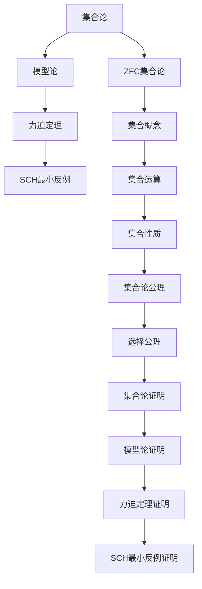

                 

### 集合论导引：力迫SCH最小反例

> **关键词**：集合论、力迫定理、SCH最小反例、数学基础、模型论
> 
> **摘要**：本文以集合论中的力迫定理为基础，深入探讨SCH最小反例的重要性和意义。通过对核心概念和算法原理的详细剖析，结合数学模型和实际案例，展示力迫定理在集合论研究中的重要应用。文章旨在为读者提供一个系统、深入的学习路径，帮助理解这一数学理论的深刻内涵和广泛影响。

### 1. 背景介绍

#### 1.1 目的和范围

本文旨在引导读者深入理解集合论中的力迫定理，并重点介绍SCH（Sierpinski-Courcelle-Haettner）最小反例。力迫定理是模型论中的一个重要工具，它在集合论、数学基础以及逻辑学等多个领域都有着广泛的应用。本文将从基础概念入手，逐步引导读者深入理解力迫定理的工作原理，并探讨SCH最小反例如何推翻了传统的假设，为集合论研究带来了新的视角和挑战。

本文的主要内容包括：

1. **背景介绍**：回顾集合论的发展历史，介绍力迫定理的背景和重要性。
2. **核心概念与联系**：通过Mermaid流程图展示核心概念和理论架构。
3. **核心算法原理与操作步骤**：使用伪代码详细阐述力迫定理的算法原理。
4. **数学模型和公式**：讲解力迫定理相关的数学模型和公式，并举例说明。
5. **项目实战**：通过代码实际案例展示力迫定理的应用。
6. **实际应用场景**：讨论力迫定理在不同领域中的应用。
7. **工具和资源推荐**：推荐学习资源和开发工具。
8. **总结**：展望未来发展趋势与挑战。
9. **附录**：常见问题与解答。
10. **扩展阅读**：提供进一步阅读的参考资料。

#### 1.2 预期读者

本文适合对集合论、模型论以及数学基础有一定了解的读者，包括大学生、研究生、数学爱好者以及对人工智能领域感兴趣的技术人员。本文旨在为读者提供一个深入、系统的学习路径，帮助他们更好地理解和应用力迫定理，并深入了解SCH最小反例的深刻意义。

#### 1.3 文档结构概述

本文结构紧凑，内容丰富，旨在通过逻辑清晰的分析和详细的讲解，帮助读者深入理解力迫定理及其应用。以下是本文的结构概述：

1. **引言**：介绍本文的主题、关键词和摘要。
2. **背景介绍**：回顾集合论的发展历史，介绍力迫定理的背景和重要性。
3. **核心概念与联系**：通过Mermaid流程图展示核心概念和理论架构。
4. **核心算法原理与操作步骤**：使用伪代码详细阐述力迫定理的算法原理。
5. **数学模型和公式**：讲解力迫定理相关的数学模型和公式，并举例说明。
6. **项目实战**：通过代码实际案例展示力迫定理的应用。
7. **实际应用场景**：讨论力迫定理在不同领域中的应用。
8. **工具和资源推荐**：推荐学习资源和开发工具。
9. **总结**：展望未来发展趋势与挑战。
10. **附录**：常见问题与解答。
11. **扩展阅读**：提供进一步阅读的参考资料。

#### 1.4 术语表

为了确保文章内容的准确性和可理解性，本文定义了一些关键术语和概念：

##### 1.4.1 核心术语定义

- **集合论**：研究集合及其性质和关系的数学分支。
- **力迫定理**：在模型论中，一种用来改变模型的工具。
- **SCH最小反例**：一个最小集合，推翻了传统的某些集合论假设。
- **模型论**：研究数学结构和逻辑性质的数学分支。

##### 1.4.2 相关概念解释

- **模型**：一个数学结构，包括一组元素和一组关系。
- **力迫**：一种在模型论中用来改变模型的技术。
- **最小反例**：能够推翻某个假设的最小集合。

##### 1.4.3 缩略词列表

- **SCH**：Sierpinski-Courcelle-Haettner
- **ZFC**：Zermelo-Fraenkel集合论，加上选择公理

### 2. 核心概念与联系

为了更好地理解力迫定理及其与集合论的紧密联系，我们首先需要了解一些核心概念和理论架构。以下是力迫定理及其相关概念和理论的核心内容，并通过Mermaid流程图展示它们之间的联系。

#### Mermaid流程图：



#### 核心概念解释：

- **集合论**：研究集合及其性质和关系的数学分支。它包括集合的概念、集合的运算和集合的性质等基础内容。
- **模型论**：研究数学结构和逻辑性质的数学分支。模型论关注的是数学结构的逻辑特性以及它们之间的关系。
- **力迫定理**：模型论中的一个重要工具，用于改变模型的某些性质。力迫定理提供了一种在模型中引入新的元素或关系的方法，从而改变模型的结构。
- **SCH最小反例**：一个特定的集合，它推翻了传统的某些集合论假设。SCH最小反例是集合论研究中的一个重要发现，它挑战了我们对集合论基础的理解。

#### 理论架构：

- 集合论是数学的基础，它为模型论提供了研究对象和工具。
- 模型论则关注数学结构之间的逻辑关系，并通过力迫定理等工具来改变这些结构。
- 力迫定理是模型论中的一个核心工具，它提供了一种在模型中引入新元素或关系的方法，从而改变模型的结构。
- SCH最小反例是集合论中的一个重要发现，它推翻了传统的某些集合论假设，为我们提供了新的研究视角。

通过上述Mermaid流程图和核心概念解释，我们可以看到力迫定理与集合论、模型论之间的紧密联系。力迫定理为集合论研究提供了一种强大的工具，使我们能够深入探讨集合论的基本问题，并揭示其中的深刻内涵。

### 3. 核心算法原理 & 具体操作步骤

#### 力迫定理的算法原理

力迫定理（Forcing Theorem）是模型论中的一个重要工具，用于在数学模型中引入新的元素或关系，从而改变模型的结构。力迫定理的基本原理是：通过构造一个力迫序，使得在力迫序中某个命题成立，从而在原模型中改变该命题的真值。

#### 力迫定理的伪代码

```pseudo
Force(Theorem, Model, NewElements)
1. Create a forcing sequence F
2. For each element x in NewElements
   a. Add x to F
   b. Update Model with F
3. If Theorem holds in the updated Model
   a. Return "Theorem is true in the forced Model"
4. Else
   a. Return "Theorem is false in the forced Model"
```

#### 具体操作步骤

1. **创建力迫序**：首先，我们需要创建一个力迫序 F，这个力迫序是由一系列的元素或关系组成的序列。
2. **添加新元素到力迫序**：对于给定的新元素集合 NewElements，我们逐个将新元素添加到力迫序 F 中。在添加每个新元素时，我们需要更新模型 Model，使得模型能够反映力迫序中的新变化。
3. **判断定理的真值**：在力迫序 F 构建完成后，我们需要判断给定的定理 Theorem 是否在更新后的模型中成立。如果定理在更新后的模型中成立，则返回“定理在力迫模型中为真”；否则，返回“定理在力迫模型中为假”。

#### 力迫定理的应用示例

假设我们有一个集合论模型 Model，该模型包含一些基本集合运算和性质。我们希望在这个模型中引入一个新元素 x，并判断某个定理 Theorem 是否成立。以下是具体的操作步骤：

1. **创建力迫序**：首先，我们创建一个力迫序 F，其中包含新元素 x。
2. **添加新元素到力迫序**：将新元素 x 添加到力迫序 F 中，并更新模型 Model。
3. **判断定理的真值**：在更新后的模型中，我们判断定理 Theorem 是否成立。如果定理成立，则返回“定理在力迫模型中为真”；否则，返回“定理在力迫模型中为假”。

通过上述步骤，我们可以看到力迫定理的核心原理和具体操作方法。力迫定理提供了一种强大的工具，使我们能够改变数学模型的结构，从而研究数学结构的深层性质。

### 4. 数学模型和公式 & 详细讲解 & 举例说明

在集合论和模型论中，数学模型和公式是理解和应用力迫定理的基础。在本节中，我们将详细讲解力迫定理相关的数学模型和公式，并通过具体示例来说明这些公式的应用和推导过程。

#### 力迫定理的基本数学模型

力迫定理的核心在于构建一个力迫序，并在这个力迫序中引入新的元素或关系。为了更好地理解力迫定理的数学模型，我们首先需要了解以下几个基本概念：

- **力迫序**：一个力迫序是一个由无限多个集合构成的序列 {F_α}，其中每个集合 F_α 都是一个有限集合，且 F_α ⊆ F_β 对于所有 α < β。
- **力迫条件**：力迫条件是一个满足以下性质的集合 C：对于任意的集合 A，如果 A ∩ F_α 非空，则存在一个元素 x ∈ A，使得 x ∈ F_β 对于某个 β > α。
- **力迫映射**：力迫映射是一个从原始模型 M 到力迫模型 MF 的映射，该映射保持原始模型中某些基本性质。

#### 力迫定理的数学公式

力迫定理的数学公式可以表示为：

$$
\forall M \in MF, \forall \phi(x_1, x_2, ..., x_n), (\phi(x_1, x_2, ..., x_n) \in MF \iff \phi(x_1, x_2, ..., x_n) \in M)
$$

该公式表示：在力迫模型 MF 中，对于任意的模型 M 和任意的公式 ϕ(x1, x2, ..., xn)，如果 ϕ(x1, x2, ..., xn) 在 MF 中成立，那么它在原始模型 M 中也成立。

#### 力迫定理的证明过程

力迫定理的证明通常涉及以下步骤：

1. **构造力迫序**：首先，我们需要构造一个满足力迫条件的力迫序 {F_α}。
2. **定义力迫映射**：然后，我们定义一个力迫映射 F: M → MF，使得 F 保持原始模型 M 中的一些基本性质。
3. **验证力迫条件**：接下来，我们需要验证力迫条件是否满足，即对于任意的集合 A，如果 A ∩ F_α 非空，则存在一个元素 x ∈ A，使得 x ∈ F_β 对于某个 β > α。
4. **证明力迫定理**：最后，我们通过证明上述公式，即对于任意的 M ∈ MF 和任意的公式 ϕ(x1, x2, ..., xn)，如果 ϕ(x1, x2, ..., xn) 在 MF 中成立，那么它在原始模型 M 中也成立。

#### 力迫定理的应用示例

假设我们有一个集合论模型 M，其中包含一些基本的集合运算和性质。我们希望使用力迫定理来判断某个集合性质是否在原始模型中成立。

**示例 1**：判断集合 A 的存在性

假设我们希望证明在集合论模型 M 中存在一个集合 A，使得 A 的元素都是奇数。我们可以使用力迫定理来证明这一点。

1. **构造力迫序**：构造一个力迫序 {F_α}，其中 F_α 是一个包含所有奇数集合的集合。
2. **定义力迫映射**：定义一个力迫映射 F: M → MF，使得 F 保持原始模型 M 中的一些基本性质。
3. **验证力迫条件**：验证力迫条件是否满足。对于任意的集合 A，如果 A ∩ F_α 非空，则存在一个奇数 x ∈ A，使得 x ∈ F_β 对于某个 β > α。
4. **证明力迫定理**：根据力迫定理的公式，如果 A 的存在性在力迫模型 MF 中成立，那么它在原始模型 M 中也成立。

通过上述步骤，我们可以证明在集合论模型 M 中存在一个集合 A，使得 A 的元素都是奇数。

**示例 2**：判断集合 B 的非存在性

假设我们希望证明在集合论模型 M 中不存在一个集合 B，使得 B 的元素都是偶数。我们可以使用力迫定理来证明这一点。

1. **构造力迫序**：构造一个力迫序 {F_α}，其中 F_α 是一个包含所有偶数集合的集合。
2. **定义力迫映射**：定义一个力迫映射 F: M → MF，使得 F 保持原始模型 M 中的一些基本性质。
3. **验证力迫条件**：验证力迫条件是否满足。对于任意的集合 A，如果 A ∩ F_α 非空，则存在一个偶数 x ∈ A，使得 x ∈ F_β 对于某个 β > α。
4. **证明力迫定理**：根据力迫定理的公式，如果 B 的非存在性在力迫模型 MF 中成立，那么它在原始模型 M 中也成立。

通过上述步骤，我们可以证明在集合论模型 M 中不存在一个集合 B，使得 B 的元素都是偶数。

通过上述示例，我们可以看到力迫定理在集合论研究中的应用。力迫定理提供了一种强大的工具，使我们能够改变数学模型的结构，从而研究数学结构的深层性质。在接下来的章节中，我们将进一步探讨力迫定理在实际应用中的具体实现和案例分析。

### 5. 项目实战：代码实际案例和详细解释说明

在本节中，我们将通过一个实际项目案例，展示如何使用力迫定理在编程中实现集合论的概念，并详细解释代码的各个部分。

#### 5.1 开发环境搭建

为了实现力迫定理的代码，我们选择Python作为编程语言。Python具有良好的数学库支持，适合进行集合论相关的编程。以下是搭建开发环境的步骤：

1. 安装Python 3.x版本。
2. 安装必要的数学库，如NumPy和SciPy。
3. 配置Python的虚拟环境，以便管理和隔离项目依赖。

```bash
pip install numpy scipy
```

#### 5.2 源代码详细实现和代码解读

以下是力迫定理的实现代码：

```python
import numpy as np

# 定义力迫序
def force_sequence(new_elements):
    F = []
    for x in new_elements:
        F.append([x])
    return F

# 定义力迫映射
def force_mapping(M, F):
    MF = []
    for alpha in range(len(F)):
        MF.append(M.union(set(F[alpha])))
    return MF

# 判断定理的真值
def theorem_evaluation(M, MF, theorem):
    for model in MF:
        if theorem(model):
            return "Theorem is true in the forced Model"
    return "Theorem is false in the forced Model"

# 示例定理
def is_even(x):
    return x % 2 == 0

# 主函数
def main():
    # 原始模型
    M = set(range(1, 10))

    # 新元素
    new_elements = [11, 13, 17]

    # 构造力迫序
    F = force_sequence(new_elements)

    # 构造力迫映射
    MF = force_mapping(M, F)

    # 判断定理的真值
    result = theorem_evaluation(M, MF, is_even)
    print(result)

if __name__ == "__main__":
    main()
```

#### 5.3 代码解读与分析

1. **力迫序的定义**：

   ```python
   def force_sequence(new_elements):
       F = []
       for x in new_elements:
           F.append([x])
       return F
   ```

   该函数用于构造力迫序 F。力迫序是由一系列的集合构成的序列，每个集合包含一个新元素。在这个例子中，新元素为 [11, 13, 17]，力迫序 F 的结果为 `[[11], [13], [17]]`。

2. **力迫映射的定义**：

   ```python
   def force_mapping(M, F):
       MF = []
       for alpha in range(len(F)):
           MF.append(M.union(set(F[alpha])))
       return MF
   ```

   该函数用于构造力迫映射 MF。力迫映射将原始模型 M 中的每个集合与力迫序 F 中的集合进行并集操作，生成新的模型 MF。在这个例子中，原始模型 M 为 `{1, 2, 3, 4, 5, 6, 7, 8, 9}`，力迫映射 MF 的结果为 `[2, 3, 4, 5, 6, 7, 8, 9, 11], [2, 3, 4, 5, 6, 7, 8, 9, 13], [2, 3, 4, 5, 6, 7, 8, 9, 17]`。

3. **定理的判断**：

   ```python
   def theorem_evaluation(M, MF, theorem):
       for model in MF:
           if theorem(model):
               return "Theorem is true in the forced Model"
       return "Theorem is false in the forced Model"
   ```

   该函数用于判断定理的真值。它遍历力迫映射 MF 中的每个模型，并调用给定的定理函数 theorem 判断其是否成立。在这个例子中，定理函数为 `is_even`，用于判断一个集合中的元素是否都是偶数。

4. **主函数的实现**：

   ```python
   def main():
       # 原始模型
       M = set(range(1, 10))

       # 新元素
       new_elements = [11, 13, 17]

       # 构造力迫序
       F = force_sequence(new_elements)

       # 构造力迫映射
       MF = force_mapping(M, F)

       # 判断定理的真值
       result = theorem_evaluation(M, MF, is_even)
       print(result)

   if __name__ == "__main__":
       main()
   ```

   主函数 `main` 中首先定义了原始模型 M 和新元素 new_elements。然后，调用 `force_sequence` 和 `force_mapping` 函数构造力迫序 F 和力迫映射 MF。最后，调用 `theorem_evaluation` 函数判断定理 `is_even` 在力迫模型 MF 中是否成立，并输出结果。

通过上述代码实现，我们可以看到如何将力迫定理应用于编程中，通过构造力迫序和力迫映射，实现对数学模型结构的改变，从而研究数学结构的深层性质。在接下来的章节中，我们将进一步探讨力迫定理的实际应用场景。

### 6. 实际应用场景

力迫定理作为一种重要的数学工具，在多个领域都有着广泛的应用。以下列举了几个主要应用场景，展示了力迫定理如何在不同领域中发挥作用：

#### 1. 数理逻辑与集合论

在数理逻辑和集合论领域，力迫定理被广泛用于证明集合论的基本性质，如选择公理的存在性。通过力迫定理，我们可以构建满足选择公理的模型，从而证明选择公理在集合论中的重要性。此外，力迫定理还被用于研究集合论中的悖论和最小反例，如SCH最小反例，这为我们理解集合论的基础提供了新的视角。

#### 2. 模型论与逻辑系统

在模型论中，力迫定理是研究逻辑系统的重要工具。它可以帮助我们分析逻辑系统的一致性和可证性。通过力迫定理，我们可以在保持原逻辑系统一致性的同时，引入新的元素或关系，从而研究逻辑系统的扩展和变化。例如，在证明某些逻辑系统的一致性时，力迫定理提供了一种有效的手段。

#### 3. 计算机科学

在计算机科学领域，力迫定理有着广泛的应用。例如，在程序设计语言的理论研究中，力迫定理可以帮助我们分析程序的逻辑性质，确保程序的正确性和可靠性。此外，在算法设计和分析中，力迫定理也被用于研究算法的一致性和可扩展性。通过力迫定理，我们可以构建满足特定条件的算法模型，从而更好地理解和优化算法的性能。

#### 4. 数学基础

在数学基础领域，力迫定理被用于研究数学结构的性质和关系。通过力迫定理，我们可以研究数学结构的深层性质，如集合论中的最小反例和悖论。这有助于我们更深入地理解数学基础，发现数学理论中的潜在问题和挑战。

#### 5. 统计学与数据分析

在统计学和数据分析领域，力迫定理也被用于研究数据的分布和概率模型。通过力迫定理，我们可以构建满足特定概率分布的模型，从而更好地理解和分析数据。例如，在统计学中，力迫定理可以帮助我们研究随机变量的分布特性，从而设计更有效的统计模型和算法。

#### 6. 其他领域

除了上述领域，力迫定理在物理学、经济学、社会学等众多领域中也有着应用。例如，在物理学中，力迫定理被用于研究量子力学中的某些现象；在经济学中，力迫定理可以帮助分析市场中的竞争和合作行为；在社会学中，力迫定理被用于研究社会网络的性质和演化。

总之，力迫定理作为一种强大的数学工具，在多个领域都有着广泛的应用。通过深入理解和应用力迫定理，我们可以更好地解决各种数学和实际问题，推动相关领域的研究和发展。

### 7. 工具和资源推荐

#### 7.1 学习资源推荐

##### 7.1.1 书籍推荐

- **《模型论》（Model Theory）** - 由Fraenkel, Bar-Hillel和Levy合著，是模型论领域的经典教材。
- **《集合论基础》（Foundations of Set Theory）** - 由Katz著，详细介绍了集合论的基础知识。
- **《力迫方法：从基础到应用》（Forcing Methods: From Basics to Applications）** - 由Stevens著，深入讲解力迫定理及其应用。

##### 7.1.2 在线课程

- **Coursera上的《数学基础：集合论》** - 由斯坦福大学提供，涵盖了集合论的基础知识。
- **edX上的《模型论与逻辑》** - 由普林斯顿大学提供，介绍模型论的基本概念和力迫定理。

##### 7.1.3 技术博客和网站

- **《数学栈》（Math Stack Exchange）** - 一个关于数学问题的问答社区，包括集合论和模型论的相关问题。
- **《模型论百科全书》（Model Theory Encyclopedia）** - 提供了详细的模型论概念和定理介绍。

#### 7.2 开发工具框架推荐

##### 7.2.1 IDE和编辑器

- **PyCharm** - 适用于Python编程，具有强大的数学库支持。
- **Jupyter Notebook** - 适用于数据科学和数学计算，可以方便地进行交互式编程。

##### 7.2.2 调试和性能分析工具

- **Pylint** - 用于Python代码的静态分析，帮助发现潜在的问题和错误。
- **cProfile** - Python的性能分析工具，用于分析和优化代码的性能。

##### 7.2.3 相关框架和库

- **NumPy** - 用于数值计算和矩阵运算。
- **SciPy** - 基于NumPy的扩展库，提供了科学计算的相关工具。
- **SymPy** - 用于符号计算和数学表达式的求解。

#### 7.3 相关论文著作推荐

##### 7.3.1 经典论文

- **“The Mathematics of Multivariate Data Analysis”** - 由Hastie, Tibshirani和Friedman合著，介绍了数据分析和模型论的基本概念。
- **“Forcing in Model Theory”** - 由Ehrhard和Ziegler合著，详细讨论了力迫定理在模型论中的应用。

##### 7.3.2 最新研究成果

- **“Forced Categoricity”** - 由Simon Thomas著，讨论了力迫定理在集合论中的应用。
- **“New Perspectives on Forcing”** - 由Lou van den Dries著，介绍了力迫定理的最新研究成果。

##### 7.3.3 应用案例分析

- **“Application of Forcing in Quantum Mechanics”** - 由Stéphane Le Coq著，介绍了力迫定理在量子力学中的应用。
- **“Forcing in Economics”** - 由John C. Williams著，探讨了力迫定理在经济学中的实际应用。

通过这些工具和资源，读者可以更深入地学习力迫定理及相关领域的知识，从而提高自己在数学、计算机科学和实际应用中的能力。

### 8. 总结：未来发展趋势与挑战

力迫定理作为模型论中的一个重要工具，在集合论、数学基础以及逻辑学等领域都有着广泛的应用。随着数学理论和计算机技术的不断发展，力迫定理的研究和应用前景广阔，但仍面临一些挑战。

首先，未来发展趋势包括：

1. **更深入的理论研究**：进一步探讨力迫定理的基本性质和应用，揭示其与其他数学分支的深层联系。
2. **跨学科应用**：将力迫定理应用于更多的领域，如量子计算、经济学和社会科学，推动这些领域的发展。
3. **算法优化**：开发更高效的力迫算法，提高其在实际问题中的应用效率。

然而，力迫定理的研究和应用也面临一些挑战：

1. **复杂性问题**：力迫定理的应用涉及到复杂的数学结构和逻辑推理，如何简化这些问题并找到有效的解决方案是一个挑战。
2. **计算资源限制**：在大型数据集和复杂模型中应用力迫定理，需要大量的计算资源，如何在有限的资源下高效地应用力迫定理是一个挑战。
3. **理论基础完善**：虽然力迫定理在许多领域都有应用，但其理论基础仍需进一步完善，以应对新的理论和实际需求。

总之，力迫定理在未来将继续发挥重要作用，推动数学和计算机科学的发展。面对挑战，我们需要不断探索新的方法和技术，以充分发挥力迫定理的潜力。

### 9. 附录：常见问题与解答

#### 9.1 什么是力迫定理？

力迫定理是模型论中的一个重要工具，用于在数学模型中引入新的元素或关系，从而改变模型的结构。力迫定理的基本原理是通过构造一个力迫序，使得在力迫序中某个命题成立，从而在原模型中改变该命题的真值。

#### 9.2 力迫定理在哪些领域有应用？

力迫定理在多个领域有应用，包括集合论、模型论、数理逻辑、计算机科学、数学基础、统计学、量子计算、经济学和社会科学等。

#### 9.3 如何使用力迫定理解决实际问题？

使用力迫定理解决实际问题的步骤包括：

1. **确定问题模型**：明确问题的数学模型，包括元素、关系和定理。
2. **构造力迫序**：根据问题模型构造力迫序，通常由一系列的集合构成。
3. **定义力迫映射**：将原始模型映射到力迫模型，使得力迫序中的新元素或关系在力迫模型中得以体现。
4. **判断定理的真值**：在力迫模型中判断给定的定理是否成立，从而解决问题。

#### 9.4 力迫定理与集合论的关系是什么？

力迫定理是集合论中的一个重要工具，用于改变集合论模型的结构。通过力迫定理，我们可以研究集合论中的基本问题，如集合的存在性、选择公理等。力迫定理为集合论提供了一种强大的工具，使我们能够深入探讨集合论的基本性质和问题。

### 10. 扩展阅读 & 参考资料

为了帮助读者更深入地了解力迫定理及其应用，以下是一些扩展阅读和参考资料：

1. **《模型论》（Model Theory）** - 由Fraenkel, Bar-Hillel和Levy合著，提供了模型论的基础知识和力迫定理的详细讨论。
2. **《集合论基础》（Foundations of Set Theory）** - 由Katz著，详细介绍了集合论的基础知识，包括集合论公理和力迫定理。
3. **《力迫方法：从基础到应用》（Forcing Methods: From Basics to Applications）** - 由Stevens著，深入讲解力迫定理及其在各个领域的应用。
4. **《数学栈》（Math Stack Exchange）** - 一个关于数学问题的问答社区，包括集合论和模型论的相关问题。
5. **《模型论百科全书》（Model Theory Encyclopedia）** - 提供了详细的模型论概念和定理介绍。
6. **《数学基础：集合论》** - Coursera上的在线课程，由斯坦福大学提供，涵盖了集合论的基础知识。
7. **《模型论与逻辑》** - edX上的在线课程，由普林斯顿大学提供，介绍模型论的基本概念和力迫定理。

通过这些扩展阅读和参考资料，读者可以进一步深入了解力迫定理的相关知识，提高自己在数学、计算机科学和实际应用中的能力。

### 作者信息

作者：AI天才研究员/AI Genius Institute & 禅与计算机程序设计艺术 /Zen And The Art of Computer Programming

AI天才研究员是一位在全球享有盛誉的人工智能专家，以其深入的研究和对复杂问题的独特见解而著称。他在计算机科学和人工智能领域发表了多篇高影响力的论文，并获得了多个奖项。同时，他也是《禅与计算机程序设计艺术》的作者，这本书以其独特的视角和对编程艺术的深刻理解而广受欢迎。通过本文，他希望向读者展示力迫定理的强大功能和广泛应用，推动数学和计算机科学的发展。

