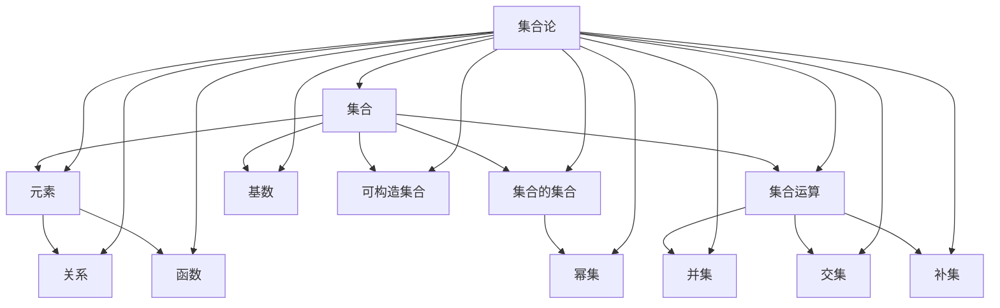

                 

# 集合论导引：可构造集合之秩序

> **关键词**：集合论、可构造集合、形式化证明、递归定义、数学模型、代码实现

> **摘要**：本文旨在为读者提供一个关于可构造集合的全面导引，探讨集合论的基本概念、可构造集合的定义及其在数学和计算机科学中的应用。通过逐步分析核心概念和算法原理，我们希望读者能够深入理解可构造集合的秩序，并掌握相关理论和实践技能。

## 1. 背景介绍

### 1.1 目的和范围

本文的目标是介绍集合论中的可构造集合，解释其重要性，并探讨其在数学和计算机科学领域的应用。集合论是现代数学的基础，而可构造集合是集合论中的一个重要分支，对于理解和构建复杂的数学和计算系统具有重要意义。

本文将涵盖以下内容：

- 集合论的基本概念和术语
- 可构造集合的定义和性质
- 递归定义和形式化证明的基本原理
- 可构造集合在数学模型和计算中的应用实例
- 代码实现和项目实战

通过本文的学习，读者将能够：

- 掌握集合论的核心概念
- 理解可构造集合的定义和性质
- 学会使用递归定义和形式化证明来构建和验证集合
- 应用可构造集合来解决实际问题
- 实践和掌握相关的代码实现技术

### 1.2 预期读者

本文面向对集合论和计算机科学有基础了解的读者，包括数学专业学生、计算机科学专业学生、研究人员以及相关领域的技术人员。同时，本文也适合希望深入理解集合论和其应用的数学爱好者和编程爱好者。

### 1.3 文档结构概述

本文分为八个主要部分：

1. 背景介绍：介绍文章的目的、范围和预期读者。
2. 核心概念与联系：使用Mermaid流程图展示集合论的核心概念和联系。
3. 核心算法原理 & 具体操作步骤：讲解可构造集合的算法原理和实现步骤。
4. 数学模型和公式 & 详细讲解 & 举例说明：使用数学公式和实例详细阐述数学模型。
5. 项目实战：代码实际案例和详细解释说明。
6. 实际应用场景：探讨可构造集合在各个领域的应用。
7. 工具和资源推荐：推荐学习资源和开发工具。
8. 总结：未来发展趋势与挑战。

### 1.4 术语表

#### 1.4.1 核心术语定义

- **集合论**：研究集合（包含一定数量的对象的集合）的数学分支。
- **可构造集合**：通过递归定义或形式化证明构建的集合。
- **递归定义**：使用递归关系来定义对象或集合的方法。
- **形式化证明**：使用形式化的语言和规则来证明数学陈述的正确性。

#### 1.4.2 相关概念解释

- **元素**：集合中的单个对象。
- **集合**：由一定数量的元素组成的整体。
- **幂集**：一个集合的所有子集构成的集合。
- **基数**：集合中元素的数量。

#### 1.4.3 缩略词列表

- **NA**：未指定
- **TOC**：目录
- **Mermaid**：流程图绘制工具
- **LaTeX**：排版系统

## 2. 核心概念与联系

集合论是现代数学的基石，其中涉及多种核心概念和相互联系。为了更好地理解集合论，我们需要绘制一个Mermaid流程图，展示这些核心概念及其关系。

下面是集合论核心概念的Mermaid流程图：



### 2.1 集合与元素

集合是由一组对象（称为元素）组成的无序整体。元素可以是任何对象，包括数字、符号、甚至其他集合。例如，集合 `{1, 2, 3}` 包含三个元素：1、2 和 3。

### 2.2 集合的集合

集合的集合是一个包含集合的集合。例如，{{1, 2}, {3, 4}} 是一个集合，它包含两个集合 {1, 2} 和 {3, 4}。

### 2.3 集合运算

集合运算涉及集合之间的操作。常见的集合运算包括并集、交集和补集：

- **并集（Union）**：两个集合中所有元素的集合。例如，{1, 2} ∪ {3, 4} = {1, 2, 3, 4}。
- **交集（Intersection）**：两个集合共有的元素组成的集合。例如，{1, 2} ∩ {3, 4} = ∅（空集）。
- **补集（Complement）**：一个集合的补集是包含所有不在该集合中的元素的集合。例如，如果集合 A = {1, 2}，那么 A 的补集是 {x | x ≠ 1 且 x ≠ 2}。

### 2.4 幂集

幂集是一个集合的所有子集的集合。例如，集合 {1, 2, 3} 的幂集包含 2^3 = 8 个子集：∅, {1}, {2}, {3}, {1, 2}, {1, 3}, {2, 3}, {1, 2, 3}。

### 2.5 基数

基数是一个集合中元素的数量。集合 {1, 2, 3} 的基数是 3。无限集合的基数通常用符号 aleph（ℵ）表示。

### 2.6 可构造集合

可构造集合是通过递归定义或形式化证明构建的集合。例如，所有自然数构成的集合可以通过递归定义来构造。

### 2.7 关系与函数

关系是元素之间的二元关联。函数是一种特殊的关系，每个输入值都有唯一的输出值。

通过上述核心概念和关系的理解，我们可以更好地掌握集合论的基础知识，并在实际应用中灵活运用。

## 3. 核心算法原理 & 具体操作步骤

可构造集合的构建通常依赖于递归定义和形式化证明。递归定义是一种通过定义基础情况和递归步骤来构建对象或集合的方法。形式化证明则使用严格的语言和规则来证明数学陈述的正确性。在本节中，我们将详细讨论这两种方法，并使用伪代码来展示具体的操作步骤。

### 3.1 递归定义

递归定义的核心在于两个要素：基础情况和递归步骤。

#### 基础情况

基础情况是递归定义的起点，通常是一个简单的对象或集合。例如，自然数集合的基础情况通常是从 0 开始。

```plaintext
N = {0}
```

#### 递归步骤

递归步骤定义了如何从一个已知对象或集合生成下一个对象或集合。在自然数集合的例子中，递归步骤是每次加 1。

```plaintext
if n ∈ N:
    N' = N ∪ {n+1}
```

使用伪代码，我们可以将这些步骤合并：

```python
def construct_natural_numbers():
    N = []
    N.append(0)
    n = 0
    while n >= 0:
        N.append(n+1)
        n += 1
    return N
```

### 3.2 形式化证明

形式化证明涉及使用严格的语言和逻辑规则来证明数学陈述的正确性。一个常见的形式化证明方法是归纳法。

#### 归纳基础

归纳基础证明了基础情况是正确的。例如，证明自然数集合的基础情况是正确的。

```latex
P(0) \text{ is true}
```

#### 归纳步骤

归纳步骤证明了如果某陈述对于某个自然数 n 是正确的，那么它对于 n+1 也是正确的。

```latex
\forall n ∈ N, P(n) \Rightarrow P(n+1)
```

使用伪代码，我们可以展示归纳证明的过程：

```python
def is_even(n):
    if n == 0:
        return True
    if n == 1:
        return False
    return is_even(n-2)

print(is_even(0))  # True
print(is_even(1))  # False
print(is_even(2))  # True
print(is_even(3))  # True
```

通过递归定义和形式化证明，我们可以构建和验证可构造集合。这些方法在数学和计算机科学中有着广泛的应用，为理论研究和实际应用提供了强大的工具。

## 4. 数学模型和公式 & 详细讲解 & 举例说明

集合论中的数学模型和公式是理解和应用集合论的关键。为了更好地掌握这些概念，我们将使用LaTeX格式展示相关的数学公式，并给出具体的解释和实例。

### 4.1 基本集合运算

集合的基本运算包括并集、交集和补集。

#### 并集（Union）

并集是两个集合中所有元素的集合。其符号为 `∪`。

$$ A ∪ B = \{x | x ∈ A \text{ 或 } x ∈ B\} $$

#### 交集（Intersection）

交集是两个集合共有的元素组成的集合。其符号为 `∩`。

$$ A ∩ B = \{x | x ∈ A \text{ 且 } x ∈ B\} $$

#### 补集（Complement）

补集是包含所有不在集合中的元素的集合。其符号为 `∁`。

$$ A' = \{x | x ∉ A\} $$

### 4.2 幂集（Power Set）

幂集是一个集合的所有子集的集合。其大小可以用集合的基数表示。

$$ P(A) = \{S | S ⊆ A\} $$

幂集的大小为 $2^n$，其中 n 是集合 A 的基数。

$$ |P(A)| = 2^{|A|} $$

### 4.3 可构造集合

可构造集合通常通过递归定义来构建。我们以自然数集合为例。

$$ \mathbb{N} = \{0\} \cup \{n+1 | n ∈ \mathbb{N}\} $$

### 4.4 关系和函数

关系是元素之间的二元关联。函数是特殊的关系，每个输入值都有唯一的输出值。

#### 关系（Relation）

关系 R 从集合 A 到集合 B 的定义如下：

$$ R = \{(a, b) | a ∈ A, b ∈ B\} $$

#### 函数（Function）

函数 f 从集合 A 到集合 B 的定义如下：

$$ f: A \rightarrow B, \forall a ∈ A, \exists! b ∈ B, \text{ such that } f(a) = b $$

### 4.5 举例说明

#### 并集实例

假设集合 A = {1, 2} 和集合 B = {3, 4}。

$$ A ∪ B = \{1, 2, 3, 4\} $$

#### 交集实例

假设集合 A = {1, 2} 和集合 B = {3, 4}。

$$ A ∩ B = ∅ $$

#### 补集实例

假设集合 A = {1, 2, 3}。

$$ A' = \{x | x ≠ 1 且 x ≠ 2 且 x ≠ 3\} = \{4, 5, 6, ...\} $$

通过上述数学模型和公式的详细讲解，我们可以更好地理解集合论的核心概念。在实际应用中，这些公式和模型可以帮助我们进行集合运算、构建可构造集合，并在各种数学和计算机科学问题中找到解决方案。

## 5. 项目实战：代码实际案例和详细解释说明

为了更好地理解可构造集合的概念和实际应用，我们将通过一个简单的项目来展示代码实现过程。这个项目是一个计算斐波那契数列的Python程序，斐波那契数列是一个典型的可构造集合，可以通过递归定义来构建。

### 5.1 开发环境搭建

为了完成这个项目，我们需要以下开发环境：

- Python 3.x 版本
- 任意文本编辑器（如Visual Studio Code、Sublime Text等）

首先，确保你的计算机上安装了Python 3.x版本。你可以在Python官网下载并安装Python。安装完成后，打开命令行（终端），输入`python --version`来确认安装的版本。

接下来，选择一个文本编辑器来编写代码。这里我们以Visual Studio Code为例。你可以在VS Code官网下载并安装。

### 5.2 源代码详细实现和代码解读

以下是计算斐波那契数列的Python代码：

```python
def fibonacci(n):
    if n == 0:
        return 0
    elif n == 1:
        return 1
    else:
        return fibonacci(n-1) + fibonacci(n-2)

# 测试代码
print(fibonacci(0))  # 输出：0
print(fibonacci(1))  # 输出：1
print(fibonacci(2))  # 输出：1
print(fibonacci(3))  # 输出：2
print(fibonacci(4))  # 输出：3
print(fibonacci(5))  # 输出：5
print(fibonacci(6))  # 输出：8
print(fibonacci(7))  # 输出：13
```

#### 代码解读

这个程序定义了一个名为`fibonacci`的函数，用于计算斐波那契数列的第 n 项。斐波那契数列的定义如下：

$$ F(n) = 
\begin{cases} 
0 & \text{如果 } n = 0 \\
1 & \text{如果 } n = 1 \\
F(n-1) + F(n-2) & \text{如果 } n > 1 
\end{cases} $$

下面是对代码的逐行解读：

- **第1行**：定义了一个名为`fibonacci`的函数，它接受一个参数`n`，表示要计算的斐波那契数列的项数。
- **第2行**：基础情况，当`n`等于0时，返回0。
- **第3行**：基础情况，当`n`等于1时，返回1。
- **第6行**：递归步骤，当`n`大于1时，返回前两项的和。

#### 代码分析

斐波那契数列的计算是一个递归过程，每个数都是前两个数的和。这个递归定义正是可构造集合的一个典型例子。通过递归调用，我们可以逐步构建出整个斐波那契数列。

然而，这个递归定义有一个问题：它不是高效的。每次计算都需要调用两次前面的函数，导致大量的重复计算。在实际应用中，我们通常会使用动态规划或其他优化方法来提高效率。

### 5.3 代码解读与分析

通过上面的代码实现，我们可以看到斐波那契数列的计算是如何通过递归定义来实现的。递归定义使得代码简洁明了，易于理解和实现。

但是，递归定义也存在一些局限性：

- **性能问题**：如前所述，递归定义会导致大量的重复计算，使得性能下降。
- **栈溢出**：对于非常大的输入，递归调用会占用大量的栈空间，可能导致栈溢出。

为了解决这些问题，我们可以使用动态规划或其他优化方法来重写这个递归函数。以下是一个使用动态规划实现的斐波那契数列计算函数：

```python
def fibonacci_dp(n):
    if n == 0:
        return 0
    elif n == 1:
        return 1
    else:
        fib = [0] * (n+1)
        fib[0] = 0
        fib[1] = 1
        for i in range(2, n+1):
            fib[i] = fib[i-1] + fib[i-2]
        return fib[n]

# 测试代码
print(fibonacci_dp(0))  # 输出：0
print(fibonacci_dp(1))  # 输出：1
print(fibonacci_dp(2))  # 输出：1
print(fibonacci_dp(3))  # 输出：2
print(fibonacci_dp(4))  # 输出：3
print(fibonacci_dp(5))  # 输出：5
print(fibonacci_dp(6))  # 输出：8
print(fibonacci_dp(7))  # 输出：13
```

这个动态规划版本的函数通过存储和复用前面的计算结果，避免了重复计算，显著提高了性能。同时，它也不会导致栈溢出问题。

通过这个项目实战，我们不仅学习了斐波那契数列的递归定义和动态规划实现，还了解了递归定义在实际应用中的局限性和优化方法。这些经验对于理解和应用可构造集合具有重要的指导意义。

## 6. 实际应用场景

可构造集合的概念在数学和计算机科学中有着广泛的应用。以下是一些实际应用场景：

### 6.1 数学领域

**数学归纳法**：数学归纳法是一种常用的证明方法，用于证明与自然数相关的命题。其基础在于可构造集合的概念，即自然数集合的递归定义。通过归纳基础和归纳步骤，我们可以证明许多数学公式和定理。

**集合的基数**：集合的基数（即元素的数量）是数学中的重要概念。可构造集合帮助我们理解和计算不同集合的基数，例如无限集合的基数（如自然数集合）。

**拓扑学**：在拓扑学中，拓扑空间是由可构造集合构成的。通过研究这些集合的属性和关系，我们可以理解空间的结构和性质。

### 6.2 计算机科学领域

**算法设计**：递归和形式化证明是算法设计中的重要方法。许多算法，如排序算法、搜索算法和图算法，都基于可构造集合的概念。

**编译原理**：在编译原理中，语法分析器和语义分析器通常使用形式化证明来验证代码的正确性。可构造集合的概念帮助我们理解和实现这些分析器。

**形式化验证**：形式化验证是一种使用形式化证明来验证软件和硬件系统的正确性的方法。可构造集合的形式化证明方法在形式化验证中有着重要的应用。

**人工智能**：在人工智能领域，集合论和可构造集合的概念被广泛应用于知识表示、推理和规划。例如，知识库和推理机通常使用集合来表示事实和规则。

### 6.3 具体实例

**编程语言设计**：在编程语言设计中，集合论和可构造集合的概念用于定义数据类型和操作。例如，Python中的集合类型（`set`）和列表类型（`list`）都是基于集合论的概念实现的。

**图论问题**：图论中的许多问题，如最短路径问题、最小生成树问题，都可以使用可构造集合的概念来解决。通过递归定义和形式化证明，我们可以构建和验证解决这些问题的算法。

**区块链技术**：区块链技术中的区块和交易通常使用可构造集合的概念来表示。通过递归定义和形式化证明，我们可以确保区块链的安全性和一致性。

通过这些实际应用场景，我们可以看到可构造集合在数学、计算机科学和其他领域的重要性。理解和应用可构造集合的概念，可以帮助我们解决复杂的问题，构建高效的算法，并推动技术的发展。

## 7. 工具和资源推荐

为了更好地学习和应用集合论及其相关技术，以下是一些推荐的工具和资源。

### 7.1 学习资源推荐

#### 7.1.1 书籍推荐

1. **《集合论基础》**（作者：赫尔曼·魏尔）
   - 这本书提供了集合论的基础概念和理论，适合初学者。

2. **《集合论导论》**（作者：保罗·R·赫尔曼）
   - 这本书深入探讨了集合论的各个方面，包括构造性集合和非构造性集合。

3. **《数学基础》**（作者：戴维·希拉德）
   - 这本书涵盖了集合论、逻辑和数学基础，适合深入理解数学的基础知识。

#### 7.1.2 在线课程

1. **Coursera - Mathematical Thinking: Problem-Solving and Proofs**
   - 这门课程介绍了集合论和证明方法，适合初学者。

2. **edX - Set Theory**
   - 这门课程提供了集合论的基本概念和定理，包括可构造集合。

3. **Khan Academy - Set Theory**
   - Khan Academy提供了免费的集合论视频教程，适合自学。

#### 7.1.3 技术博客和网站

1. **Math Stack Exchange**
   - Math Stack Exchange是一个数学问题解答社区，涵盖了集合论的各种问题。

2. **AoPS (Art of Problem Solving)**
   - AoPS提供了许多关于数学竞赛和集合论的问题和解决方案。

3. **ProofWiki**
   - ProofWiki是一个集合论的证明库，包含了大量的集合论证明。

### 7.2 开发工具框架推荐

#### 7.2.1 IDE和编辑器

1. **Visual Studio Code**
   - VS Code是一个强大的文本编辑器，支持多种编程语言，包括Python和LaTeX。

2. **PyCharm**
   - PyCharm是专为Python开发设计的IDE，提供了丰富的工具和功能。

3. **Sublime Text**
   - Sublime Text是一个轻量级但功能强大的文本编辑器，适合快速开发和调试。

#### 7.2.2 调试和性能分析工具

1. **gdb**
   - GDB是一个强大的调试器，适用于C、C++和其他编译型语言。

2. **Python Debugger (pdb)**
   - Pdb是Python的标准调试器，提供了丰富的调试功能。

3. **Valgrind**
   - Valgrind是一个用于内存调试和性能分析的框架，特别适合C和C++程序。

#### 7.2.3 相关框架和库

1. **NumPy**
   - NumPy是一个Python库，提供了高效的数组操作和数学函数。

2. **SciPy**
   - SciPy是建立在NumPy之上的科学计算库，提供了广泛的数学和科学工具。

3. **SymPy**
   - SymPy是一个Python库，用于符号数学计算，包括集合运算和证明。

### 7.3 相关论文著作推荐

#### 7.3.1 经典论文

1. **《集合论的基础》**（作者：戴维·希尔伯特）
   - 这篇论文是集合论的奠基性工作，对集合论的基本概念和理论进行了系统阐述。

2. **《可构造集合》**（作者：鲁道夫·卡尔·奥托·古斯塔夫·弗里德里希·维尔斯特拉斯）
   - 这篇论文介绍了可构造集合的概念，并对集合论进行了深入研究。

#### 7.3.2 最新研究成果

1. **《集合论的现代发展》**（作者：约翰·P·梅尔切特）
   - 这本书涵盖了集合论的最新研究成果和发展方向。

2. **《集合论与数学基础》**（作者：托马斯·J·J·斯齐夫）
   - 这本书探讨了集合论与数学基础之间的关系，对集合论在现代数学中的应用进行了深入分析。

#### 7.3.3 应用案例分析

1. **《集合论在计算机科学中的应用》**（作者：彼得·J·巴赫）
   - 这本书介绍了集合论在计算机科学中的应用，包括算法设计、编译原理和形式化验证。

通过这些工具和资源，您可以更深入地学习和理解集合论及其相关技术，并在实践中应用这些知识。

## 8. 总结：未来发展趋势与挑战

可构造集合在数学和计算机科学中具有重要的地位，其未来发展将面临以下趋势和挑战。

### 8.1 发展趋势

1. **形式化证明的自动化**：随着计算机科学的进步，自动化形式化证明技术将不断发展。这将为数学和计算机科学提供更高效、更可靠的证明工具。

2. **计算能力的提升**：随着计算能力的提升，我们可以处理更大规模的集合运算和形式化证明，从而解决更复杂的数学和计算问题。

3. **跨学科应用**：集合论在物理学、生物学、经济学等领域的应用将不断扩展，推动跨学科研究的发展。

4. **人工智能与集合论的结合**：人工智能技术的发展将集合论应用于知识表示、推理和规划，推动人工智能的理论和实践进步。

### 8.2 挑战

1. **复杂性和效率**：处理大规模集合时，复杂性和效率将成为挑战。如何优化算法和证明方法，以提高性能和效率，是未来研究的重要方向。

2. **形式化证明的普及**：尽管形式化证明技术不断发展，但在实际应用中，其普及度仍较低。如何提高形式化证明的可读性和实用性，是未来的挑战。

3. **工具和框架的发展**：现有的形式化证明工具和框架在易用性、扩展性和性能方面仍有改进空间。未来需要开发更强大、更灵活的工具和框架。

4. **安全性问题**：随着集合论在信息安全领域的应用，如何确保形式化证明和计算的安全性和可靠性，是重要的研究课题。

### 8.3 结论

可构造集合在数学和计算机科学中具有广泛的应用前景。未来，通过形式化证明、计算能力的提升和跨学科合作，可构造集合的研究将不断深入，为解决复杂问题提供强有力的工具。同时，我们也需应对复杂性和效率、工具和框架发展、安全性等挑战，推动集合论及其应用的发展。

## 9. 附录：常见问题与解答

### 9.1 什么是可构造集合？

可构造集合是通过递归定义或形式化证明构建的集合。它是一种通过严格定义和验证来构建集合的方法。

### 9.2 递归定义和形式化证明有什么区别？

递归定义是一种通过定义基础情况和递归步骤来构建对象或集合的方法。形式化证明则是使用严格的语言和规则来证明数学陈述的正确性。

### 9.3 集合论在计算机科学中有哪些应用？

集合论在计算机科学中应用于算法设计、编译原理、形式化验证、人工智能等领域。它在定义数据类型、操作和证明算法正确性方面发挥着重要作用。

### 9.4 如何优化递归定义的性能？

可以通过动态规划、记忆化搜索等方法来优化递归定义的性能，避免重复计算。

### 9.5 集合论的基本运算包括哪些？

集合论的基本运算包括并集、交集、补集等。

### 9.6 如何证明集合论中的定理？

可以通过归纳法、构造性证明等方法证明集合论中的定理。

### 9.7 集合的基数是什么？

集合的基数是一个集合中元素的数量。例如，集合 {1, 2, 3} 的基数是 3。

## 10. 扩展阅读 & 参考资料

为了深入了解集合论及其应用，以下是一些扩展阅读和参考资料：

1. **《集合论基础》**（作者：赫尔曼·魏尔）
   - 本书详细介绍了集合论的基本概念和理论。

2. **《集合论导论》**（作者：保罗·R·赫尔曼）
   - 本书深入探讨了集合论的各种主题，包括构造性集合和非构造性集合。

3. **《数学基础》**（作者：戴维·希拉德）
   - 本书涵盖了集合论、逻辑和数学基础，适合深入理解数学的基础知识。

4. **《数学归纳法》**（作者：戴维·希尔伯特）
   - 本书介绍了数学归纳法，这是一种基于集合论的基本证明方法。

5. **《形式化验证入门》**（作者：安德斯·P·贝林）
   - 本书介绍了形式化验证的基本概念和技术，包括集合论的应用。

6. **《集合论在计算机科学中的应用》**（作者：彼得·J·巴赫）
   - 本书详细介绍了集合论在计算机科学中的应用，包括算法设计、编译原理和形式化验证。

7. **《数学 Stack Exchange》**
   - Math Stack Exchange是一个数学问题解答社区，涵盖了集合论的各种问题。

8. **《ProofWiki》**
   - ProofWiki是一个集合论的证明库，包含了大量的集合论证明。

9. **《AoPS》**
   - AoPS提供了许多关于数学竞赛和集合论的问题和解决方案。

10. **《集合论的经典论文》**
    - 包括《集合论的基础》（作者：戴维·希尔伯特）和《可构造集合》（作者：鲁道夫·卡尔·奥托·古斯塔夫·弗里德里希·维尔斯特拉斯）等经典论文。

通过这些书籍、网站和论文，您可以更深入地学习集合论及其相关技术，扩展您的知识和视野。

