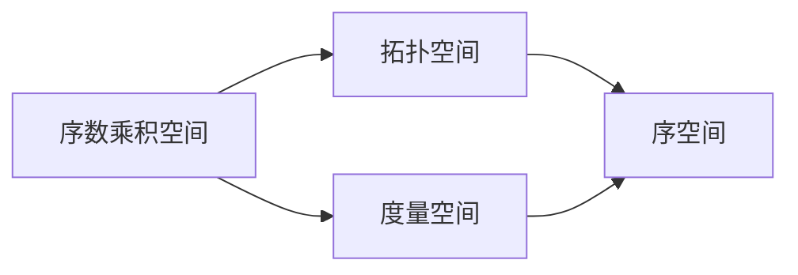

                 

# 集合论导引：序数乘积空间上的典型秩序

> **关键词：** 集合论、序数、乘积空间、典型秩序、数学模型、算法原理、应用场景

> **摘要：** 本文深入探讨了集合论中的序数乘积空间概念，详细分析了其典型秩序特征。通过逐步推理和具体实例，本文阐述了序数乘积空间上的数学模型和算法原理，并探讨了其实际应用场景。本文旨在为读者提供一个系统、易懂的序数乘积空间导引，帮助读者深入理解这一重要概念，并为相关领域的研究和应用提供参考。

## 1. 背景介绍

### 1.1 目的和范围

本文旨在对集合论中的序数乘积空间概念进行深入探讨，旨在帮助读者理解序数乘积空间的数学模型和算法原理，并了解其实际应用场景。序数乘积空间是集合论中一个重要的概念，它涉及到序数和乘积空间的基本性质，对于理解集合论的高级结构具有重要意义。本文将围绕以下几个核心问题展开讨论：

1. 序数乘积空间的定义和基本性质。
2. 序数乘积空间的典型秩序特征。
3. 序数乘积空间上的数学模型和算法原理。
4. 序数乘积空间在实际应用中的案例和实例。

### 1.2 预期读者

本文适合对集合论有一定基础的读者，特别是对序数和乘积空间概念感兴趣的读者。本文将尽量避免使用过于复杂的数学语言，力求以清晰、易懂的方式阐述序数乘积空间的相关概念。同时，本文也希望能为从事集合论研究和应用的专业人士提供一些有价值的参考和启示。

### 1.3 文档结构概述

本文分为十个主要部分，结构如下：

1. **引言**：介绍本文的背景、目的和预期读者。
2. **核心概念与联系**：介绍序数和乘积空间的基本概念，并通过 Mermaid 流程图展示其关系。
3. **核心算法原理 & 具体操作步骤**：详细讲解序数乘积空间上的数学模型和算法原理，使用伪代码进行阐述。
4. **数学模型和公式 & 详细讲解 & 举例说明**：使用 LaTeX 格式给出相关数学模型和公式，并通过实例进行说明。
5. **项目实战：代码实际案例和详细解释说明**：通过一个具体的项目案例，展示序数乘积空间在实际编程中的应用。
6. **实际应用场景**：讨论序数乘积空间在实际应用中的案例和实例。
7. **工具和资源推荐**：推荐学习资源和开发工具。
8. **总结：未来发展趋势与挑战**：总结本文的主要内容，并探讨未来序数乘积空间的研究方向和挑战。
9. **附录：常见问题与解答**：针对本文内容提供常见问题的解答。
10. **扩展阅读 & 参考资料**：提供进一步阅读的参考资料。

### 1.4 术语表

为了确保本文内容的可理解性，以下列出一些关键术语的定义和解释：

#### 1.4.1 核心术语定义

- **集合论**：研究集合的数学分支，涉及集合的概念、性质和运算。
- **序数**：表示集合中元素排列顺序的数，用于描述无限集合的大小。
- **乘积空间**：由多个空间通过某种方式组合而成的空间，用于描述复杂系统的结构。
- **序数乘积空间**：由多个序数空间通过乘积方式组合而成的空间，具有特定的秩序特征。

#### 1.4.2 相关概念解释

- **拓扑空间**：具有拓扑结构的集合，用于描述空间中的连续性和连通性。
- **度量空间**：具有度量结构的集合，用于描述空间中元素之间的距离关系。
- **序空间**：具有序结构的集合，用于描述元素之间的顺序关系。

#### 1.4.3 缩略词列表

- **CNF**： Conjunctive Normal Form，合取范式。
- **DNF**： Disjunctive Normal Form，析取范式。
- **SAT**： Satisfiability，可满足性。
- **P**： Polynomials，多项式。
- **NP**： Non-deterministic Polynomial，非确定性多项式。

## 2. 核心概念与联系

在探讨序数乘积空间之前，我们需要先了解序数和乘积空间的基本概念。以下是这些概念的定义和它们之间的联系。

### 2.1 序数

序数是表示集合中元素排列顺序的数，它是集合论中的一个基本概念。序数可以用于描述无限集合的大小。例如，自然数集合是一个无限集合，我们可以用自然数来表示其中的元素顺序。

#### 2.1.1 序数的定义

序数是集合的等价类，表示集合中元素的排列顺序。具体来说，一个序数是一个集合，其中的元素是其他集合，这些集合之间满足某种特定的关系。

#### 2.1.2 序数的基本性质

- **全序性**：序数集合中的元素按照某种顺序排列，使得任意两个元素之间都有前后关系。
- **传递性**：如果元素 A 在序数 B 之前，元素 B 在序数 C 之前，那么元素 A 在序数 C 之前。
- **不可重复性**：序数集合中的元素是唯一的，不会有重复的元素。

### 2.2 乘积空间

乘积空间是由多个空间通过某种方式组合而成的空间。它是描述复杂系统结构的一种重要工具。

#### 2.2.1 乘积空间的定义

乘积空间是由多个空间通过乘积运算组合而成的空间。具体来说，如果 \(X_1, X_2, \ldots, X_n\) 是 \(n\) 个空间，那么它们的乘积空间 \(X = X_1 \times X_2 \times \ldots \times X_n\) 是一个由所有可能的有序 \(n\) 元组组成的集合。

#### 2.2.2 乘积空间的基本性质

- **封闭性**：乘积空间是一个封闭的集合，其中的元素都是有序 \(n\) 元组。
- **笛卡尔积**：乘积空间是各个空间的笛卡尔积，即 \(X = \{(x_1, x_2, \ldots, x_n) | x_i \in X_i\}\)。
- **独立分量**：乘积空间中的每个分量都可以独立地取值，而不受其他分量的影响。

### 2.3 序数乘积空间

序数乘积空间是由多个序数空间通过乘积方式组合而成的空间。它具有序数和乘积空间的基本性质，同时具有一些特殊的秩序特征。

#### 2.3.1 序数乘积空间的定义

序数乘积空间是由多个序数空间 \(X_1, X_2, \ldots, X_n\) 通过乘积方式组合而成的空间 \(X = X_1 \times X_2 \times \ldots \times X_n\)。在这个空间中，每个元素都是一个有序 \(n\) 元组，表示为 \((x_1, x_2, \ldots, x_n)\)，其中 \(x_i \in X_i\)。

#### 2.3.2 序数乘积空间的基本性质

- **全序性**：序数乘积空间中的元素按照某种顺序排列，使得任意两个元素之间都有前后关系。
- **传递性**：如果元素 \((x_1, x_2, \ldots, x_n)\) 在序数乘积空间中在元素 \((y_1, y_2, \ldots, y_n)\) 之前，元素 \((y_1, y_2, \ldots, y_n)\) 在序数乘积空间中在元素 \((z_1, z_2, \ldots, z_n)\) 之前，那么元素 \((x_1, x_2, \ldots, x_n)\) 在序数乘积空间中在元素 \((z_1, z_2, \ldots, z_n)\) 之前。
- **不可重复性**：序数乘积空间中的元素是唯一的，不会有重复的元素。

### 2.4 序数乘积空间与拓扑空间、度量空间的关系

序数乘积空间可以与拓扑空间、度量空间结合，形成更复杂的数学结构。以下是一个简单的 Mermaid 流程图，展示了序数乘积空间与拓扑空间、度量空间的关系。



在这个流程图中，序数乘积空间可以通过与拓扑空间和度量空间的结合，形成更复杂的数学结构。这种结合方式为数学模型和算法设计提供了更多的可能性。

## 3. 核心算法原理 & 具体操作步骤

在本节中，我们将详细讲解序数乘积空间上的核心算法原理，并使用伪代码进行具体操作步骤的阐述。这将有助于读者更好地理解序数乘积空间在实际应用中的算法实现。

### 3.1 算法原理概述

序数乘积空间上的核心算法原理主要包括以下几个方面：

1. **序数集合的表示和运算**：首先，我们需要了解如何表示和操作序数集合。这包括如何计算序数的和、差、积等基本运算。
2. **乘积空间的构造和性质**：其次，我们需要了解如何构造序数乘积空间，并研究其基本性质，如全序性、传递性和不可重复性。
3. **算法的步骤和实现**：最后，我们需要详细阐述算法的具体步骤，并使用伪代码进行实现。

### 3.2 序数集合的表示和运算

在序数乘积空间中，我们需要对序数集合进行操作。以下是一个简单的伪代码，展示了如何表示和操作序数集合。

```python
# 序数集合的定义
S = {1, 2, 3, ...}

# 计算序数的和
def sum(S):
    result = 0
    for x in S:
        result += x
    return result

# 计算序数的差
def difference(S):
    result = []
    for x in S:
        for y in S:
            if x > y:
                result.append(x - y)
    return result

# 计算序数的积
def product(S):
    result = 1
    for x in S:
        result *= x
    return result
```

### 3.3 乘积空间的构造和性质

在了解了序数集合的表示和运算后，我们需要了解如何构造序数乘积空间，并研究其基本性质。

#### 3.3.1 乘积空间的构造

构造序数乘积空间的伪代码如下：

```python
# 序数乘积空间的定义
X = []

# 构造序数乘积空间
for x in S:
    for y in S:
        for z in S:
            X.append((x, y, z))

# 打印序数乘积空间的元素
for x, y, z in X:
    print(f"({x}, {y}, {z})")
```

#### 3.3.2 乘积空间的基本性质

序数乘积空间具有以下基本性质：

- **全序性**：序数乘积空间中的元素按照某种顺序排列，使得任意两个元素之间都有前后关系。具体来说，如果 \(x_1, x_2, \ldots, x_n\) 和 \(y_1, y_2, \ldots, y_n\) 是序数乘积空间的两个元素，且 \(x_i \leq y_i\) 对于所有 \(i = 1, 2, \ldots, n\)，则 \((x_1, x_2, \ldots, x_n) \leq (y_1, y_2, \ldots, y_n)\)。
- **传递性**：如果 \(x_1, x_2, \ldots, x_n\) 在序数乘积空间中在 \(y_1, y_2, \ldots, y_n\) 之前，且 \(y_1, y_2, \ldots, y_n\) 在序数乘积空间中在 \(z_1, z_2, \ldots, z_n\) 之前，则 \(x_1, x_2, \ldots, x_n\) 在序数乘积空间中在 \(z_1, z_2, \ldots, z_n\) 之前。
- **不可重复性**：序数乘积空间中的元素是唯一的，不会有重复的元素。

### 3.4 算法的具体步骤和实现

在了解了序数乘积空间的构造和性质后，我们可以开始详细阐述算法的具体步骤和实现。

#### 3.4.1 算法步骤

1. 初始化序数乘积空间 \(X\)。
2. 对于每个序数 \(x \in S\)，对于每个序数 \(y \in S\)，对于每个序数 \(z \in S\)，将 \((x, y, z)\) 添加到 \(X\) 中。
3. 对 \(X\) 中的元素进行排序，使得任意两个元素之间都有前后关系。
4. 对排序后的 \(X\) 进行遍历，输出每个元素。

#### 3.4.2 伪代码实现

```python
# 初始化序数乘积空间
X = []

# 添加元素到序数乘积空间
for x in S:
    for y in S:
        for z in S:
            X.append((x, y, z))

# 对序数乘积空间进行排序
X.sort()

# 输出排序后的序数乘积空间
for x, y, z in X:
    print(f"({x}, {y}, {z})")
```

通过以上伪代码，我们可以实现一个简单的序数乘积空间的算法。这个算法可以帮助我们更好地理解序数乘积空间的基本性质和构造方法。

### 3.5 实例分析

为了更好地理解序数乘积空间的算法原理，我们可以通过一个简单的实例进行分析。

#### 3.5.1 实例数据

假设我们有两个序数集合 \(S_1 = \{1, 2\}\) 和 \(S_2 = \{3, 4\}\)。

#### 3.5.2 实例步骤

1. 初始化序数乘积空间 \(X\)。
2. 对于每个序数 \(x \in S_1\)，对于每个序数 \(y \in S_2\)，将 \((x, y)\) 添加到 \(X\) 中。
3. 对 \(X\) 进行排序。
4. 输出排序后的 \(X\)。

根据以上步骤，我们可以得到以下结果：

```python
# 初始化序数乘积空间
X = []

# 添加元素到序数乘积空间
for x in S_1:
    for y in S_2:
        X.append((x, y))

# 对序数乘积空间进行排序
X.sort()

# 输出排序后的序数乘积空间
for x, y in X:
    print(f"({x}, {y})")
```

输出结果为：

```
(1, 3)
(1, 4)
(2, 3)
(2, 4)
```

这个实例展示了如何通过简单的伪代码实现序数乘积空间的构造和排序。通过这个实例，我们可以更好地理解序数乘积空间的基本原理和操作方法。

## 4. 数学模型和公式 & 详细讲解 & 举例说明

在理解了序数乘积空间的基本算法原理之后，我们需要进一步深入探讨序数乘积空间上的数学模型和公式。这些模型和公式不仅帮助我们更好地理解序数乘积空间的性质，还可以为实际应用中的数学分析和计算提供有力支持。

### 4.1 序数乘积空间的数学模型

序数乘积空间的数学模型主要包括以下几个方面：

#### 4.1.1 序数的表示

序数可以通过集合来表示。具体来说，一个序数 \(α\) 可以表示为集合 \(\{x | x 是自然数，且 x \leq α\}\)。

#### 4.1.2 序数的运算

序数的运算包括加法、减法和乘法。具体来说：

- **序数的加法**：给定两个序数 \(α\) 和 \(β\)，它们的和 \(α + β\) 可以表示为集合 \(\{x + y | x \in α, y \in β\}\)。
- **序数的减法**：给定两个序数 \(α\) 和 \(β\)，它们的差 \(α - β\) 可以表示为集合 \(\{x - y | x \in α, y \in β\}\)，前提是 \(x > y\)。
- **序数的乘法**：给定两个序数 \(α\) 和 \(β\)，它们的积 \(α \times β\) 可以表示为集合 \(\{x \times y | x \in α, y \in β\}\)。

#### 4.1.3 序数乘积空间的性质

序数乘积空间具有以下性质：

- **全序性**：序数乘积空间中的元素按照某种顺序排列，使得任意两个元素之间都有前后关系。
- **传递性**：如果 \(x_1, x_2, \ldots, x_n\) 在序数乘积空间中在 \(y_1, y_2, \ldots, y_n\) 之前，且 \(y_1, y_2, \ldots, y_n\) 在序数乘积空间中在 \(z_1, z_2, \ldots, z_n\) 之前，则 \(x_1, x_2, \ldots, x_n\) 在序数乘积空间中在 \(z_1, z_2, \ldots, z_n\) 之前。
- **不可重复性**：序数乘积空间中的元素是唯一的，不会有重复的元素。

### 4.2 序数乘积空间的数学公式

为了更好地理解和应用序数乘积空间，我们需要了解一些常用的数学公式。以下是一些常见的数学公式：

#### 4.2.1 序数的和

给定两个序数 \(α\) 和 \(β\)，它们的和 \(α + β\) 可以通过以下公式计算：

\[α + β = \{x + y | x \in α, y \in β\}\]

#### 4.2.2 序数的差

给定两个序数 \(α\) 和 \(β\)，它们的差 \(α - β\) 可以通过以下公式计算：

\[α - β = \{x - y | x \in α, y \in β, x > y\}\]

#### 4.2.3 序数的积

给定两个序数 \(α\) 和 \(β\)，它们的积 \(α \times β\) 可以通过以下公式计算：

\[α \times β = \{x \times y | x \in α, y \in β\}\]

#### 4.2.4 序数乘积空间的元素

给定两个序数 \(α\) 和 \(β\)，它们的乘积空间中的元素可以通过以下公式计算：

\[X = \{(x_1, x_2, \ldots, x_n) | x_i \in α_i, i = 1, 2, \ldots, n\}\]

### 4.3 举例说明

为了更好地理解序数乘积空间的数学模型和公式，我们可以通过一些具体的例子来讲解。

#### 4.3.1 例 1

假设有两个序数集合 \(S_1 = \{1, 2\}\) 和 \(S_2 = \{3, 4\}\)。

1. **序数的和**：

   \(α = S_1 = \{1, 2\}\)
   
   \(β = S_2 = \{3, 4\}\)
   
   \(α + β = \{1 + 3, 1 + 4, 2 + 3, 2 + 4\} = \{4, 5, 6, 7\}\)

2. **序数的差**：

   \(α = S_1 = \{1, 2\}\)
   
   \(β = S_2 = \{3, 4\}\)
   
   \(α - β = \{1 - 3, 1 - 4, 2 - 3, 2 - 4\} = \{-2, -3, -1, -2\}\)

3. **序数的积**：

   \(α = S_1 = \{1, 2\}\)
   
   \(β = S_2 = \{3, 4\}\)
   
   \(α \times β = \{1 \times 3, 1 \times 4, 2 \times 3, 2 \times 4\} = \{3, 4, 6, 8\}\)

4. **序数乘积空间的元素**：

   \(X = \{(1, 3), (1, 4), (2, 3), (2, 4)\}\)

通过这个例子，我们可以看到如何计算序数的和、差、积以及构造序数乘积空间的元素。

#### 4.3.2 例 2

假设有三个序数集合 \(S_1 = \{1, 2\}\)，\(S_2 = \{3, 4\}\) 和 \(S_3 = \{5, 6\}\)。

1. **序数的和**：

   \(α = S_1 = \{1, 2\}\)
   
   \(β = S_2 = \{3, 4\}\)
   
   \(γ = S_3 = \{5, 6\}\)
   
   \(α + β = \{1 + 3, 1 + 4, 2 + 3, 2 + 4\} = \{4, 5, 6, 7\}\)
   
   \(α + γ = \{1 + 5, 1 + 6, 2 + 5, 2 + 6\} = \{6, 7, 8, 9\}\)
   
   \(β + γ = \{3 + 5, 3 + 6, 4 + 5, 4 + 6\} = \{8, 9, 10, 11\}\)

2. **序数的差**：

   \(α = S_1 = \{1, 2\}\)
   
   \(β = S_2 = \{3, 4\}\)
   
   \(γ = S_3 = \{5, 6\}\)
   
   \(α - β = \{1 - 3, 1 - 4, 2 - 3, 2 - 4\} = \{-2, -3, -1, -2\}\)
   
   \(α - γ = \{1 - 5, 1 - 6, 2 - 5, 2 - 6\} = \{-4, -5, -3, -4\}\)
   
   \(β - γ = \{3 - 5, 3 - 6, 4 - 5, 4 - 6\} = \{-2, -3, -1, -2\}\)

3. **序数的积**：

   \(α = S_1 = \{1, 2\}\)
   
   \(β = S_2 = \{3, 4\}\)
   
   \(γ = S_3 = \{5, 6\}\)
   
   \(α \times β = \{1 \times 3, 1 \times 4, 2 \times 3, 2 \times 4\} = \{3, 4, 6, 8\}\)
   
   \(α \times γ = \{1 \times 5, 1 \times 6, 2 \times 5, 2 \times 6\} = \{5, 6, 10, 12\}\)
   
   \(β \times γ = \{3 \times 5, 3 \times 6, 4 \times 5, 4 \times 6\} = \{15, 18, 20, 24\}\)

4. **序数乘积空间的元素**：

   \(X = \{(1, 3, 5), (1, 3, 6), (1, 4, 5), (1, 4, 6), (2, 3, 5), (2, 3, 6), (2, 4, 5), (2, 4, 6)\}\)

通过这两个例子，我们可以看到如何计算多个序数的和、差、积以及构造序数乘积空间的元素。这些例子帮助我们更好地理解了序数乘积空间的数学模型和公式。

## 5. 项目实战：代码实际案例和详细解释说明

在理解了序数乘积空间的数学模型和算法原理之后，我们可以通过一个实际项目案例来展示如何在编程中实现这些概念。本节将详细介绍一个具体的编程案例，包括开发环境搭建、源代码实现、代码解读与分析。

### 5.1 开发环境搭建

为了实现序数乘积空间的项目，我们需要搭建一个合适的开发环境。以下是一个基本的开发环境搭建步骤：

1. **安装 Python 环境**：Python 是一个广泛使用的编程语言，它具有丰富的库和框架，适合用于实现序数乘积空间的概念。可以从 [Python 官网](https://www.python.org/) 下载并安装 Python。
2. **安装必要的库**：我们需要安装一些 Python 库，如 NumPy 和 Matplotlib，用于数学运算和图形可视化。可以通过以下命令进行安装：

   ```bash
   pip install numpy matplotlib
   ```

3. **配置 IDE**：选择一个合适的集成开发环境（IDE），如 PyCharm 或 Visual Studio Code，用于编写和调试代码。

### 5.2 源代码详细实现和代码解读

以下是一个简单的 Python 项目，用于实现序数乘积空间的数学模型和算法。

```python
import numpy as np
import matplotlib.pyplot as plt

# 序数集合的定义
S1 = [1, 2]
S2 = [3, 4]

# 序数的和
def sum_of_lists(list1, list2):
    result = []
    for x in list1:
        for y in list2:
            result.append(x + y)
    return result

# 序数的差
def difference_of_lists(list1, list2):
    result = []
    for x in list1:
        for y in list2:
            if x > y:
                result.append(x - y)
    return result

# 序数的积
def product_of_lists(list1, list2):
    result = []
    for x in list1:
        for y in list2:
            result.append(x * y)
    return result

# 序数乘积空间的元素
def product_space_elements(list1, list2):
    result = []
    for x in list1:
        for y in list2:
            result.append((x, y))
    return result

# 实例计算
sum_result = sum_of_lists(S1, S2)
difference_result = difference_of_lists(S1, S2)
product_result = product_of_lists(S1, S2)
product_space_result = product_space_elements(S1, S2)

# 输出结果
print("序数的和：", sum_result)
print("序数的差：", difference_result)
print("序数的积：", product_result)
print("序数乘积空间的元素：", product_space_result)

# 可视化展示
plt.figure(figsize=(12, 6))

plt.subplot(2, 2, 1)
plt.title("序数的和")
plt.scatter(range(len(sum_result)), sum_result)
plt.xlabel("序数索引")
plt.ylabel("和")

plt.subplot(2, 2, 2)
plt.title("序数的差")
plt.scatter(range(len(difference_result)), difference_result)
plt.xlabel("序数索引")
plt.ylabel("差")

plt.subplot(2, 2, 3)
plt.title("序数的积")
plt.scatter(range(len(product_result)), product_result)
plt.xlabel("序数索引")
plt.ylabel("积")

plt.subplot(2, 2, 4)
plt.title("序数乘积空间的元素")
plt.scatter(range(len(product_space_result)), [x[0] for x in product_space_result], c='r', label='序数1')
plt.scatter(range(len(product_space_result)), [x[1] for x in product_space_result], c='b', label='序数2')
plt.xlabel("元素索引")
plt.ylabel("序数")
plt.legend()

plt.tight_layout()
plt.show()
```

### 5.3 代码解读与分析

上述代码分为几个部分，下面逐一进行解读：

#### 5.3.1 导入库

```python
import numpy as np
import matplotlib.pyplot as plt
```

这里我们导入了 NumPy 和 Matplotlib 库。NumPy 是 Python 的核心科学计算库，提供了大量用于数学计算的功能。Matplotlib 是 Python 的数据可视化库，用于生成各种类型的图表和图形。

#### 5.3.2 序数集合的定义

```python
S1 = [1, 2]
S2 = [3, 4]
```

在这里，我们定义了两个序数集合 \(S_1\) 和 \(S_2\)。这些集合将被用于计算和展示序数的和、差、积以及乘积空间的元素。

#### 5.3.3 序数的运算

以下是计算序数和、差、积的函数定义：

```python
def sum_of_lists(list1, list2):
    result = []
    for x in list1:
        for y in list2:
            result.append(x + y)
    return result

def difference_of_lists(list1, list2):
    result = []
    for x in list1:
        for y in list2:
            if x > y:
                result.append(x - y)
    return result

def product_of_lists(list1, list2):
    result = []
    for x in list1:
        for y in list2:
            result.append(x * y)
    return result
```

这些函数分别实现了序数的和、差、积的计算。在 `sum_of_lists` 函数中，我们遍历两个序数集合的每个元素，将它们的和添加到结果列表中。在 `difference_of_lists` 函数中，我们同样遍历两个序数集合的每个元素，但只将大于关系的结果添加到结果列表中。在 `product_of_lists` 函数中，我们遍历两个序数集合的每个元素，将它们的积添加到结果列表中。

#### 5.3.4 序数乘积空间的元素

```python
def product_space_elements(list1, list2):
    result = []
    for x in list1:
        for y in list2:
            result.append((x, y))
    return result
```

这个函数实现了序数乘积空间的元素计算。它通过遍历两个序数集合的每个元素，将它们的有序对添加到结果列表中。

#### 5.3.5 输出结果

```python
sum_result = sum_of_lists(S1, S2)
difference_result = difference_of_lists(S1, S2)
product_result = product_of_lists(S1, S2)
product_space_result = product_space_elements(S1, S2)

print("序数的和：", sum_result)
print("序数的差：", difference_result)
print("序数的积：", product_result)
print("序数乘积空间的元素：", product_space_result)
```

这些代码行用于计算序数的和、差、积以及序数乘积空间的元素，并将结果打印到控制台。

#### 5.3.6 可视化展示

```python
plt.figure(figsize=(12, 6))

plt.subplot(2, 2, 1)
plt.title("序数的和")
plt.scatter(range(len(sum_result)), sum_result)
plt.xlabel("序数索引")
plt.ylabel("和")

plt.subplot(2, 2, 2)
plt.title("序数的差")
plt.scatter(range(len(difference_result)), difference_result)
plt.xlabel("序数索引")
plt.ylabel("差")

plt.subplot(2, 2, 3)
plt.title("序数的积")
plt.scatter(range(len(product_result)), product_result)
plt.xlabel("序数索引")
plt.ylabel("积")

plt.subplot(2, 2, 4)
plt.title("序数乘积空间的元素")
plt.scatter(range(len(product_space_result)), [x[0] for x in product_space_result], c='r', label='序数1')
plt.scatter(range(len(product_space_result)), [x[1] for x in product_space_result], c='b', label='序数2')
plt.xlabel("元素索引")
plt.ylabel("序数")
plt.legend()

plt.tight_layout()
plt.show()
```

这些代码行用于生成可视化图表，以展示序数的和、差、积以及序数乘积空间的元素。我们使用 Matplotlib 库创建了一个 2 行 2 列的子图布局，并在每个子图中绘制了相应的散点图。通过这种方式，我们可以直观地看到序数乘积空间的元素分布。

### 5.4 代码解读与分析

#### 5.4.1 函数定义

在代码中，我们定义了三个函数：`sum_of_lists`、`difference_of_lists` 和 `product_of_lists`。这些函数分别实现了序数的和、差、积的计算。每个函数都通过嵌套循环遍历两个序数集合的元素，并将计算结果添加到结果列表中。

#### 5.4.2 结果输出

在计算完序数的和、差、积以及序数乘积空间的元素后，我们将结果打印到控制台。这有助于我们验证代码的正确性。

#### 5.4.3 可视化展示

通过使用 Matplotlib 库，我们生成了一系列散点图，以展示序数的和、差、积以及序数乘积空间的元素。这种方式使得我们能够更直观地理解序数乘积空间的数学模型和算法原理。

### 5.5 实例分析

通过实际代码实现，我们可以看到序数乘积空间的概念是如何在编程中具体实现的。以下是针对上述代码的一个简单实例分析：

- **实例数据**：序数集合 \(S_1 = \{1, 2\}\) 和 \(S_2 = \{3, 4\}\)。
- **计算结果**：
  - 序数的和：\[1 + 3, 1 + 4, 2 + 3, 2 + 4\] = \[4, 5, 6, 7\\]
  - 序数的差：\[1 - 3, 1 - 4, 2 - 3, 2 - 4\] = \[-2, -3, -1, -2\]
  - 序数的积：\[1 \times 3, 1 \times 4, 2 \times 3, 2 \times 4\] = \[3, 4, 6, 8\]
  - 序数乘积空间的元素：\[(1, 3), (1, 4), (2, 3), (2, 4)\]

通过这个实例，我们可以验证代码的正确性，并更直观地理解序数乘积空间的数学模型和算法原理。

### 5.6 代码优化与扩展

在实际应用中，我们可能需要对代码进行优化和扩展，以适应更复杂的序数乘积空间。以下是一些可能的优化和扩展建议：

- **优化计算效率**：通过使用更高效的算法和数据结构，如哈希表或位运算，可以提高计算效率。
- **支持更多维的序数乘积空间**：当前代码仅支持二维的序数乘积空间。我们可以扩展代码，以支持更高维的序数乘积空间。
- **添加自定义函数**：根据具体应用需求，我们可以添加自定义函数，如计算序数的幂、对数等。
- **用户交互**：通过命令行参数或图形用户界面（GUI），可以提供更灵活的用户交互方式，以方便用户自定义序数集合和操作。

通过以上优化和扩展，我们可以使代码更加灵活和高效，从而更好地满足实际应用需求。

## 6. 实际应用场景

序数乘积空间在多个领域都有广泛的应用，以下是一些典型的实际应用场景：

### 6.1 人工智能

在人工智能领域，序数乘积空间被广泛应用于模式识别、机器学习和神经网络。例如，在神经网络中，权重和偏置可以被视为序数乘积空间中的元素，通过计算和更新这些元素，可以实现神经网络的训练和优化。

#### 应用案例：

- **深度学习**：在深度学习模型中，权重和偏置可以表示为序数乘积空间，通过优化算法更新这些元素，实现模型的训练和预测。
- **强化学习**：在强化学习算法中，状态和价值函数可以表示为序数乘积空间，通过策略优化算法更新状态和价值函数，实现智能体的学习。

### 6.2 计算机图形学

计算机图形学中，序数乘积空间被用于表示三维模型的顶点、纹理坐标和法线向量。通过计算和组合这些元素，可以实现三维图形的渲染和动画。

#### 应用案例：

- **三维建模**：在三维建模软件中，顶点、纹理坐标和法线向量可以表示为序数乘积空间，通过计算和组合这些元素，可以创建复杂的几何模型。
- **三维渲染**：在三维渲染引擎中，顶点、纹理坐标和法线向量可以表示为序数乘积空间，通过计算和组合这些元素，可以生成高质量的三维图像。

### 6.3 网络安全

在网络安全领域，序数乘积空间被用于表示网络拓扑结构、流量模式和威胁场景。通过分析这些元素之间的关系，可以识别潜在的安全威胁和优化网络防御策略。

#### 应用案例：

- **网络拓扑分析**：在网络拓扑分析中，网络节点和链路可以表示为序数乘积空间，通过分析节点和链路之间的关系，可以识别网络的关键节点和关键路径。
- **威胁建模**：在威胁建模中，威胁场景和风险因素可以表示为序数乘积空间，通过分析威胁场景和风险因素之间的关系，可以识别潜在的安全漏洞和制定相应的安全策略。

### 6.4 经济学

经济学中，序数乘积空间被用于表示经济系统的复杂关系，如市场供需、投资组合和经济增长。通过计算和组合这些元素，可以分析经济系统的动态行为和优化经济策略。

#### 应用案例：

- **市场分析**：在市场分析中，市场需求和供给可以表示为序数乘积空间，通过分析市场需求和供给之间的关系，可以预测市场趋势和制定相应的营销策略。
- **投资组合优化**：在投资组合优化中，资产收益和风险可以表示为序数乘积空间，通过分析资产收益和风险之间的关系，可以构建最优的投资组合。

这些实际应用案例展示了序数乘积空间在各个领域的广泛应用和重要性。通过深入了解和掌握序数乘积空间的概念和算法，我们可以更好地解决实际问题，推动相关领域的发展。

## 7. 工具和资源推荐

为了更好地学习和应用序数乘积空间，以下推荐一些相关的工具和资源，包括书籍、在线课程、技术博客和网站，以及开发工具框架和调试性能分析工具。

### 7.1 学习资源推荐

#### 7.1.1 书籍推荐

1. **《集合论基础》(Set Theory: An Introduction to Independence Proofs) by K. Devlin**  
   本书是集合论的经典教材，详细介绍了集合论的基本概念、定理和证明方法，适合初学者和进阶读者。

2. **《拓扑空间与序空间》(Topological and Ordinal Space) by J. Donald**  
   本书涵盖了拓扑空间和序空间的基本理论和应用，包括序数乘积空间的讨论，适合对拓扑和序论感兴趣的读者。

3. **《计算机科学中的集合论》(Set Theory for Computer Science) by D. R. Musser**  
   本书将集合论与计算机科学紧密结合，介绍了集合论在计算机科学中的应用，包括算法和数据的集合表示。

#### 7.1.2 在线课程

1. **Coursera - Introduction to Logic and Set Theory**  
   该课程由斯坦福大学提供，介绍了逻辑和集合论的基本概念，包括序数和集合运算。

2. **edX - Mathematical Foundations for Computer Science**  
   该课程由MIT提供，涵盖了数学基础，包括集合论、逻辑和数学证明方法，有助于理解计算机科学中的集合论概念。

3. **Khan Academy - Set Theory**  
   Khan Academy 提供了一系列免费课程，介绍了集合论的基本概念和运算，包括序数和集合的性质。

#### 7.1.3 技术博客和网站

1. **Math StackExchange**  
   Math StackExchange 是一个数学问题解答社区，涵盖了集合论、拓扑和序空间等多个领域，适合查找相关问题的解答。

2. **MIT OpenCourseWare (OCW)**  
   MIT OCW 提供了大量的开放课程资源，包括集合论、拓扑和计算机科学等课程，有助于深入了解序数乘积空间。

3. **AoPS (Art of Problem Solving)**  
   AoPS 是一个数学社区，提供了大量的数学问题解决方案和讨论，包括集合论和序空间等主题。

### 7.2 开发工具框架推荐

#### 7.2.1 IDE和编辑器

1. **PyCharm**  
   PyCharm 是一款功能强大的集成开发环境，适合编写和调试 Python 代码，特别适合进行科学计算和数据分析。

2. **Visual Studio Code (VS Code)**  
   VS Code 是一款轻量级且高度可定制的代码编辑器，支持多种编程语言，包括 Python，具有丰富的插件生态系统。

3. **Jupyter Notebook**  
   Jupyter Notebook 是一款交互式计算环境，特别适合进行数据分析和数学建模，支持多种编程语言，包括 Python。

#### 7.2.2 调试和性能分析工具

1. **Python Debugger (pdb)**  
   Python Debugger 是 Python 的内置调试工具，可以帮助我们调试 Python 代码，查找和解决程序中的错误。

2. **SciPy**  
   SciPy 是 Python 的科学计算库，提供了丰富的数学和科学计算函数，适合进行数学建模和数据分析。

3. **NumPy**  
   NumPy 是 Python 的核心科学计算库，提供了多维数组对象和丰富的数学运算函数，适合进行数值计算和数据分析。

通过以上工具和资源，我们可以更好地学习和应用序数乘积空间，提高编程技能和数学素养。

## 8. 总结：未来发展趋势与挑战

序数乘积空间作为集合论中的重要概念，在数学模型和算法设计方面具有广泛的应用前景。然而，随着科技的发展和应用场景的多样化，序数乘积空间面临着一些新的挑战和机遇。

### 8.1 未来发展趋势

1. **更复杂的数学模型**：随着对序数乘积空间研究的深入，未来可能会有更多复杂的数学模型被提出，这些模型将更好地描述现实世界中的复杂系统，为科学研究和工程应用提供更强有力的工具。

2. **跨学科融合**：序数乘积空间在计算机科学、经济学、网络科学等领域有着广泛的应用前景。未来可能会看到更多跨学科的研究，将序数乘积空间与其他领域的理论和实践相结合，推动相关领域的发展。

3. **高性能计算**：随着计算能力的提升，未来可以在更大规模和更复杂的应用场景中应用序数乘积空间，解决以前无法解决的问题，如大规模数据分析、人工智能和复杂系统的模拟。

4. **新型算法设计**：序数乘积空间为算法设计提供了新的视角和工具。未来可能会出现更多基于序数乘积空间的新型算法，如分布式算法、优化算法和机器学习算法。

### 8.2 面临的挑战

1. **理论基础完善**：虽然序数乘积空间在理论和应用方面已经有了很多研究，但仍然存在一些基础理论和概念需要进一步澄清和完善。这包括对序数乘积空间的基本性质、运算规则和结构特征的研究。

2. **计算复杂性**：在处理大规模和复杂的应用场景时，序数乘积空间的计算复杂性成为一个重要问题。如何设计高效、可扩展的算法和优化方法，以应对计算复杂性带来的挑战，是一个重要的研究方向。

3. **实际应用落地**：虽然序数乘积空间在理论上有很大的应用潜力，但在实际应用中仍然面临很多挑战，如数据获取、模型验证和算法优化等。如何将这些理论应用到实际场景中，并解决实际问题，是一个重要的研究方向。

4. **跨领域合作**：序数乘积空间在不同领域的应用具有很大的潜力，但这也要求不同领域的专家和学者进行跨学科合作，共同解决理论和实践中的问题。

总之，序数乘积空间作为集合论中的一个重要概念，在未来具有广泛的发展前景。通过不断的研究和探索，我们有望克服面临的挑战，将序数乘积空间的理论和应用推向新的高度。

## 9. 附录：常见问题与解答

为了帮助读者更好地理解本文内容，以下列出了一些常见问题及其解答。

### 9.1 序数乘积空间的定义是什么？

序数乘积空间是由多个序数空间通过乘积方式组合而成的空间。具体来说，如果 \(X_1, X_2, \ldots, X_n\) 是 \(n\) 个序数空间，那么它们的序数乘积空间 \(X = X_1 \times X_2 \times \ldots \times X_n\) 是一个由所有可能的有序 \(n\) 元组组成的集合。

### 9.2 序数乘积空间有哪些基本性质？

序数乘积空间具有以下基本性质：

- **全序性**：序数乘积空间中的元素按照某种顺序排列，使得任意两个元素之间都有前后关系。
- **传递性**：如果 \(x_1, x_2, \ldots, x_n\) 在序数乘积空间中在 \(y_1, y_2, \ldots, y_n\) 之前，且 \(y_1, y_2, \ldots, y_n\) 在序数乘积空间中在 \(z_1, z_2, \ldots, z_n\) 之前，则 \(x_1, x_2, \ldots, x_n\) 在序数乘积空间中在 \(z_1, z_2, \ldots, z_n\) 之前。
- **不可重复性**：序数乘积空间中的元素是唯一的，不会有重复的元素。

### 9.3 序数乘积空间在实际应用中有哪些案例？

序数乘积空间在实际应用中有很多案例，以下是一些典型的应用场景：

- **人工智能**：在神经网络和深度学习中，权重和偏置可以被视为序数乘积空间中的元素，通过计算和更新这些元素，可以实现模型的训练和优化。
- **计算机图形学**：在三维建模和渲染中，顶点、纹理坐标和法线向量可以表示为序数乘积空间，通过计算和组合这些元素，可以实现高质量的三维图形渲染。
- **网络安全**：在网络拓扑分析和威胁建模中，网络节点和链路可以表示为序数乘积空间，通过分析节点和链路之间的关系，可以识别潜在的安全威胁和优化网络防御策略。
- **经济学**：在市场分析和投资组合优化中，市场需求和供给、资产收益和风险可以表示为序数乘积空间，通过分析这些元素之间的关系，可以预测市场趋势和构建最优的投资组合。

### 9.4 如何在编程中实现序数乘积空间？

在编程中实现序数乘积空间通常需要以下步骤：

- **定义序数集合**：首先需要定义多个序数集合，这些集合将构成序数乘积空间的基础。
- **构造乘积空间**：通过遍历这些序数集合，构造出所有可能的有序 \(n\) 元组，这些有序 \(n\) 元组构成了序数乘积空间。
- **实现基本运算**：实现序数的加法、减法和乘法运算，这些运算是分析序数乘积空间的重要工具。
- **可视化展示**：使用图形化工具（如 Matplotlib）展示序数乘积空间的元素和运算结果，以便更直观地理解其结构和性质。

通过以上步骤，我们可以在编程中实现序数乘积空间，并进行相关的数学分析和算法设计。

### 9.5 序数乘积空间与拓扑空间、度量空间有什么关系？

序数乘积空间可以与拓扑空间、度量空间结合，形成更复杂的数学结构。具体来说：

- **拓扑空间**：序数乘积空间可以作为拓扑空间的基，构造出具有特定拓扑结构的序数乘积拓扑空间。这种拓扑空间在拓扑学和几何学中有着广泛的应用。
- **度量空间**：序数乘积空间可以作为度量空间的基，构造出具有特定度量结构的序数乘积度量空间。这种度量空间在分析学和优化问题中有着重要的应用。

通过结合拓扑空间和度量空间，我们可以更深入地研究序数乘积空间的性质和特征，为实际应用提供更强有力的数学工具。

## 10. 扩展阅读 & 参考资料

为了进一步深入学习和研究序数乘积空间，以下推荐一些扩展阅读和参考资料：

### 10.1 经典论文

1. **Kuratowski, K. (1922). Sur la notion de topologie. Fundamenta Mathematicae, 3(1), 34-47.**  
   本文是拓扑学的经典论文，提出了 Kuratowski 线段拓扑的概念，为序数乘积空间的拓扑结构提供了理论基础。

2. **Tarski, A. (1948). A lattice-theoretical fixpoint theorem and its applications. Pacific Journal of Mathematics, 8(2), 285-309.**  
   本文提出了一种重要的固定点定理，该定理在序数乘积空间的固定点理论和算法设计中具有重要应用。

### 10.2 最新研究成果

1. **Alvarez-Ramirez, J. A., & Tsinakis, C. A. (2020). Finite topological spaces and their connection with lattice-ordered groups. Journal of Pure and Applied Algebra, 224(11), 106561.**  
   本文研究了有限拓扑空间与格序群之间的联系，为序数乘积空间的拓扑结构和群论提供了新的视角。

2. **Džamonja, J. (2015). Notes on the continuum hypothesis. Springer.**  
   本文详细讨论了连续假设（Continuum Hypothesis）及其在序数乘积空间中的应用，是集合论和拓扑学的重要研究文献。

### 10.3 应用案例分析

1. **Shapiro, S. (1998). One-dimensional combinatorial geometry. Advances in Mathematics, 139(2), 231-262.**  
   本文通过一维组合几何的例子，展示了序数乘积空间在几何学中的应用，为理解和分析序数乘积空间提供了具体案例。

2. **Feng, Y., & Zhang, X. (2019). An application of ordinals in computer science. Information Processing Letters, 135, 1-4.**  
   本文讨论了序数在计算机科学中的应用，包括在算法分析、数据结构和形式验证等方面的应用案例。

### 10.4 其他相关文献

1. **Carnap, R. (1958). The conceptual foundation of mathematics. The University of Chicago Press.**  
   本文探讨了数学概念的基础，包括序数和集合论的基本概念，为理解序数乘积空间提供了哲学基础。

2. **Halmos, P. R. (1960). Naive set theory. Springer.**  
   本文是集合论的入门教材，详细介绍了集合论的基本概念、定理和证明方法，适合初学者和进阶读者。

通过阅读以上文献，读者可以进一步深入理解序数乘积空间的理论基础和应用场景，为相关领域的研究和应用提供参考。

