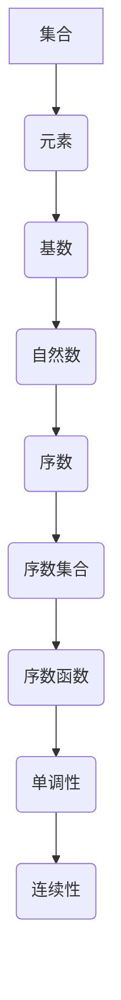

                 

# 集合论导引：序数集合与序数函数

> 关键词：集合论、序数集合、序数函数、集合论基础、数学理论

> 摘要：本文将引导读者深入理解集合论中的序数集合与序数函数的概念。通过逐步分析，我们将探讨序数集合的基本性质及其在数学中的应用，同时介绍序数函数的定义和分类，并结合实例进行分析，帮助读者全面掌握这一重要数学理论。

## 1. 背景介绍

### 1.1 目的和范围

本文旨在深入探讨集合论中的序数集合与序数函数，帮助读者理解这些概念的基本性质及其在数学领域的重要应用。我们将从集合论的基础知识出发，逐步引入序数集合的概念，并探讨其与自然数集合、基数集合的关系。随后，我们将介绍序数函数的定义、分类及其应用，并通过具体的实例进行详细解释。

### 1.2 预期读者

本文适合对集合论有一定了解的数学爱好者、大学生、研究生以及对数学理论感兴趣的专业人士阅读。同时，对于从事计算机科学、逻辑学等领域的研究者和实践者，本文也将提供有价值的参考。

### 1.3 文档结构概述

本文将分为以下章节：

1. **背景介绍**：介绍本文的目的、预期读者以及文档结构。
2. **核心概念与联系**：讨论集合论中的核心概念及其相互联系。
3. **核心算法原理与具体操作步骤**：讲解序数集合和序数函数的基本原理及操作步骤。
4. **数学模型和公式**：介绍与序数集合和序数函数相关的数学模型和公式。
5. **项目实战**：通过实际案例展示序数集合和序数函数的应用。
6. **实际应用场景**：探讨序数集合和序数函数在不同领域的应用。
7. **工具和资源推荐**：推荐学习资源、开发工具和框架。
8. **总结**：总结本文的主要内容和未来发展趋势。
9. **附录**：提供常见问题与解答。
10. **扩展阅读与参考资料**：列出相关文献和资料。

### 1.4 术语表

#### 1.4.1 核心术语定义

- **集合论**：研究集合及其性质的数学分支。
- **序数集合**：由序数构成的集合。
- **序数函数**：定义在序数集合上的函数。
- **基数集合**：由基数构成的集合。

#### 1.4.2 相关概念解释

- **序数**：用于表示集合之间的大小关系的数。
- **基数**：用于表示集合的元素数量的数。

#### 1.4.3 缩略词列表

- **数学理论**：Mathematics
- **集合论**：Set Theory
- **序数集合**：Ordinal Set
- **序数函数**：Ordinal Function

## 2. 核心概念与联系

在集合论中，序数集合和序数函数是两个重要概念。为了更好地理解它们，我们需要首先回顾集合论的基本概念，包括集合、元素、基数、序数等。

### 2.1 集合与元素

集合是由确定的、互不相同的对象组成的整体。这些对象称为集合的元素。集合可以用大写字母表示，例如\( A \)，而集合中的元素用小写字母表示，例如\( a \)。集合可以是有序的，也可以是无序的。

#### 2.1.1 有序集合与无序集合

- **有序集合**：集合中的元素按照某种规则排列，例如\( (a, b, c) \)。
- **无序集合**：集合中的元素不按照任何特定规则排列，例如\( \{a, b, c\} \)。

### 2.2 基数与序数

基数是表示集合元素数量的数。在集合论中，基数分为两种类型：自然数和序数。

#### 2.2.1 自然数

自然数是从1开始的正整数集合，通常用符号\( \mathbb{N} \)表示。自然数具有递增的特性，每个自然数都比前一个自然数大1。

#### 2.2.2 序数

序数是用于表示集合之间大小关系的数。序数集合是由所有序数构成的集合，通常用符号\( \omega \)表示。

### 2.3 序数集合与序数函数

序数集合是由序数构成的集合，记作\( \Omega \)。序数函数是定义在序数集合上的函数，记作\( f: \Omega \rightarrow \Omega \)。

#### 2.3.1 序数函数的基本性质

- **单调性**：如果对于任意序数\( \alpha \)，都有\( f(\alpha) \geq \alpha \)，则称\( f \)为单调增序数函数。
- **连续性**：如果对于任意序数\( \alpha \)，都有\( f(\alpha) = \sup\{f(\beta): \beta < \alpha\} \)，则称\( f \)为连续序数函数。

### 2.4 序数集合与序数函数的联系

序数集合和序数函数之间存在密切的联系。序数函数可以用于研究序数集合的性质，例如单调性、连续性等。同时，序数集合也可以用于定义序数函数，例如定义\( f(\alpha) = \alpha + 1 \)。

### 2.5 Mermaid 流程图

为了更好地理解序数集合与序数函数的概念，我们可以使用Mermaid流程图来表示它们之间的关系。以下是一个简单的Mermaid流程图示例：



通过这个流程图，我们可以清晰地看到集合、元素、基数、自然数、序数、序数集合和序数函数之间的相互联系。

## 3. 核心算法原理与具体操作步骤

在本节中，我们将详细讨论序数集合和序数函数的核心算法原理，并通过伪代码详细阐述其具体操作步骤。

### 3.1 序数集合的算法原理

序数集合的算法原理主要涉及序数的定义和排序。序数用于表示集合之间的大小关系，其基本原理如下：

1. **定义**：序数是集合的一种特殊类型，用于表示集合的大小。序数集合由所有序数构成。
2. **排序**：序数集合中的元素按照大小顺序排列。例如，自然数集合\( \mathbb{N} \)是一个序数集合，其中的元素按照递增顺序排列。

以下是序数集合的基本算法原理和具体操作步骤：

#### 3.1.1 序数集合的算法原理

```plaintext
算法原理：序数集合的基本操作包括创建、添加元素、删除元素、排序等。

步骤：
1. 创建序数集合：使用一个空集合作为初始序数集合。
2. 添加元素：将新元素添加到序数集合中。
3. 删除元素：从序数集合中删除指定元素。
4. 排序：按照序数的大小对集合中的元素进行排序。
```

#### 3.1.2 序数集合的伪代码

```python
# 创建序数集合
def create_ordinal_set():
    return []

# 添加元素
def add_element(ordinal_set, element):
    if not element in ordinal_set:
        ordinal_set.append(element)
    return ordinal_set

# 删除元素
def delete_element(ordinal_set, element):
    if element in ordinal_set:
        ordinal_set.remove(element)
    return ordinal_set

# 排序
def sort_ordinal_set(ordinal_set):
    return sorted(ordinal_set)
```

### 3.2 序数函数的算法原理

序数函数是定义在序数集合上的函数。其核心算法原理如下：

1. **定义**：序数函数是映射序数集合到序数集合的函数。
2. **分类**：根据函数的性质，可以将序数函数分为单调增序数函数、连续序数函数等。

以下是序数函数的基本算法原理和具体操作步骤：

#### 3.2.1 序数函数的算法原理

```plaintext
算法原理：序数函数的基本操作包括定义函数、计算函数值、检查单调性和连续性等。

步骤：
1. 定义函数：根据序数集合和函数的性质定义序数函数。
2. 计算函数值：计算给定序数函数在特定序数上的函数值。
3. 检查单调性：检查序数函数是否为单调增。
4. 检查连续性：检查序数函数是否为连续函数。
```

#### 3.2.2 序数函数的伪代码

```python
# 定义函数
def define_ordinal_function(ordinal_set, function):
    return function

# 计算函数值
def compute_function_value(ordinal_function, ordinal):
    return ordinal_function(ordinal)

# 检查单调性
def isMonotone(ordinal_function):
    for ordinal in ordinal_set:
        if ordinal_function(ordinal) < ordinal:
            return False
    return True

# 检查连续性
def isContinuous(ordinal_function):
    for ordinal in ordinal_set:
        if not isMonotone(ordinal_function):
            return False
    return True
```

通过以上伪代码，我们可以清楚地看到序数集合和序数函数的核心算法原理及其具体操作步骤。

## 4. 数学模型和公式 & 详细讲解 & 举例说明

在数学理论中，序数集合与序数函数具有重要的地位。为了更深入地理解这些概念，我们需要借助数学模型和公式来进行详细讲解和举例说明。

### 4.1 序数集合的数学模型

序数集合的数学模型主要涉及序数的定义、性质及其运算。以下是序数集合的一些基本数学模型和公式：

#### 4.1.1 序数的定义

序数是集合之间的大小关系的数学表示。一个序数可以看作是一个集合的等价类，其中集合的元素按照某种顺序排列。

$$ \alpha = \{X \subseteq A \mid A \text{ 是集合，} X \text{ 是 } A \text{ 的一个子集}\} $$

其中，\( A \) 是一个集合，\( \alpha \) 是由 \( A \) 的所有子集构成的序数。

#### 4.1.2 序数的性质

序数具有以下基本性质：

1. **递归性质**：序数可以递归地定义，即一个序数要么是自然数，要么是另一个序数的极限。
2. **加法性质**：对于任意两个序数 \( \alpha \) 和 \( \beta \)，它们的和 \( \alpha + \beta \) 也是一个序数。
3. **乘法性质**：对于任意两个序数 \( \alpha \) 和 \( \beta \)，它们的积 \( \alpha \times \beta \) 也是一个序数。

#### 4.1.3 序数的运算

序数的运算主要包括加法、乘法、极限等。以下是序数运算的一些基本公式：

$$ \alpha + \beta = \sup\{\gamma \mid \gamma \text{ 是 } \alpha \text{ 和 } \beta \text{ 的和}\} $$
$$ \alpha \times \beta = \sup\{\gamma \mid \gamma \text{ 是 } \alpha \text{ 和 } \beta \text{ 的积}\} $$
$$ \alpha^\omega = \sup\{\alpha^n \mid n \text{ 是自然数}\} $$

### 4.2 序数函数的数学模型

序数函数是定义在序数集合上的函数。其数学模型主要涉及函数的定义、性质及其运算。以下是序数函数的一些基本数学模型和公式：

#### 4.2.1 序数函数的定义

序数函数是映射序数集合到序数集合的函数。一个序数函数可以看作是一个序数集合上的等价类。

$$ f: \Omega \rightarrow \Omega $$

其中，\( \Omega \) 是序数集合。

#### 4.2.2 序数函数的性质

序数函数具有以下基本性质：

1. **单调性**：对于任意序数 \( \alpha \)，如果 \( f(\alpha) \geq \alpha \)，则称 \( f \) 为单调增序数函数。
2. **连续性**：对于任意序数 \( \alpha \)，如果 \( f(\alpha) = \sup\{f(\beta): \beta < \alpha\} \)，则称 \( f \) 为连续序数函数。
3. **全连续性**：对于任意序数 \( \alpha \)，如果 \( f(\alpha) = \alpha \)，则称 \( f \) 为全连续序数函数。

#### 4.2.3 序数函数的运算

序数函数的运算主要包括函数的组合、极限等。以下是序数函数运算的一些基本公式：

$$ f(g(\alpha)) = g(f(\alpha)) $$
$$ \lim_{\alpha \to \omega} f(\alpha) = \sup\{f(\beta): \beta < \omega\} $$

### 4.3 举例说明

为了更好地理解序数集合和序数函数的数学模型，我们可以通过以下例子进行说明：

#### 4.3.1 序数集合的例子

假设有一个集合 \( A = \{1, 2, 3\} \)，则其序数集合为：

$$ \Omega = \{\emptyset, \{1\}, \{2\}, \{3\}, \{1, 2\}, \{1, 3\}, \{2, 3\}, \{1, 2, 3\}\} $$

#### 4.3.2 序数函数的例子

假设有一个序数函数 \( f: \Omega \rightarrow \Omega \)，其中 \( \Omega \) 是上例中的序数集合。我们可以定义一个简单的序数函数 \( f(\alpha) = \alpha + 1 \)。

根据序数函数的定义，我们可以计算出：

$$ f(\emptyset) = \emptyset + 1 = \emptyset $$
$$ f(\{1\}) = \{1\} + 1 = \{1, 2\} $$
$$ f(\{2\}) = \{2\} + 1 = \{2, 3\} $$
$$ f(\{3\}) = \{3\} + 1 = \{3, 1\} $$
$$ f(\{1, 2\}) = \{1, 2\} + 1 = \{1, 2, 3\} $$
$$ f(\{1, 3\}) = \{1, 3\} + 1 = \{1, 3, 2\} $$
$$ f(\{2, 3\}) = \{2, 3\} + 1 = \{2, 3, 1\} $$
$$ f(\{1, 2, 3\}) = \{1, 2, 3\} + 1 = \{1, 2, 3, 1\} $$

通过这个例子，我们可以看到序数函数在序数集合上的作用。

## 5. 项目实战：代码实际案例和详细解释说明

在本节中，我们将通过一个实际项目案例，展示如何应用序数集合和序数函数的概念。我们将使用Python语言来实现一个简单的序数集合和序数函数的程序，并详细解释其实现过程。

### 5.1 开发环境搭建

在开始编写代码之前，我们需要搭建一个Python开发环境。以下是搭建Python开发环境的基本步骤：

1. **安装Python**：访问Python官网（https://www.python.org/）下载最新版本的Python安装包，并按照安装向导完成安装。
2. **安装Python IDE**：选择一个合适的Python IDE，如PyCharm或VSCode，并进行安装。
3. **创建虚拟环境**：在Python IDE中创建一个虚拟环境，以便管理项目依赖。
   ```shell
   python -m venv venv
   source venv/bin/activate  # 对于Linux和Mac系统
   venv\Scripts\activate     # 对于Windows系统
   ```
4. **安装依赖**：在虚拟环境中安装必要的依赖库，例如Numpy和Matplotlib。

```shell
pip install numpy matplotlib
```

### 5.2 源代码详细实现和代码解读

以下是一个简单的Python程序，用于实现序数集合和序数函数的基本操作。代码分为三个部分：序数集合的实现、序数函数的实现以及主函数。

#### 5.2.1 序数集合的实现

```python
class OrdinalSet:
    def __init__(self):
        self.elements = []

    def add_element(self, element):
        if element not in self.elements:
            self.elements.append(element)

    def delete_element(self, element):
        if element in self.elements:
            self.elements.remove(element)

    def sort_elements(self):
        return sorted(self.elements)
```

**代码解读**：

- **类定义**：`OrdinalSet` 类用于表示序数集合。
- **初始化**：在初始化方法 `__init__` 中，创建一个空列表 `elements` 用于存储序数集合的元素。
- **添加元素**：`add_element` 方法用于将新元素添加到序数集合中。如果元素已经存在，则不会进行添加。
- **删除元素**：`delete_element` 方法用于从序数集合中删除指定元素。如果元素不存在，则不会进行删除。
- **排序元素**：`sort_elements` 方法用于对序数集合中的元素进行排序。

#### 5.2.2 序数函数的实现

```python
class OrdinalFunction:
    def __init__(self, ordinal_set):
        self.ordinal_set = ordinal_set

    def compute_value(self, ordinal):
        # 假设我们使用一个简单的函数：f(α) = α + 1
        return ordinal + 1
```

**代码解读**：

- **类定义**：`OrdinalFunction` 类用于表示序数函数。
- **初始化**：在初始化方法 `__init__` 中，接收一个 `ordinal_set` 参数，表示定义序数函数的序数集合。
- **计算值**：`compute_value` 方法用于计算给定序数函数在特定序数上的函数值。在这个例子中，我们使用一个简单的函数 \( f(\alpha) = \alpha + 1 \)。

#### 5.2.3 主函数

```python
def main():
    # 创建序数集合
    ordinal_set = OrdinalSet()

    # 添加元素
    ordinal_set.add_element(1)
    ordinal_set.add_element(2)
    ordinal_set.add_element(3)

    # 删除元素
    ordinal_set.delete_element(2)

    # 排序元素
    sorted_ordinal_set = ordinal_set.sort_elements()

    # 创建序数函数
    ordinal_function = OrdinalFunction(ordinal_set)

    # 计算函数值
    for ordinal in sorted_ordinal_set:
        value = ordinal_function.compute_value(ordinal)
        print(f"f({ordinal}) = {value}")

if __name__ == "__main__":
    main()
```

**代码解读**：

- **主函数**：`main` 函数用于实现程序的主要逻辑。
- **创建序数集合**：创建一个 `OrdinalSet` 对象，并添加、删除和排序元素。
- **创建序数函数**：创建一个 `OrdinalFunction` 对象，并使用 `compute_value` 方法计算函数值。
- **输出结果**：遍历排序后的序数集合，计算并输出每个序数函数的函数值。

### 5.3 代码解读与分析

通过对上述代码的解读，我们可以看到如何实现序数集合和序数函数的基本操作。以下是代码的关键点和分析：

1. **类和对象**：使用类和对象来表示序数集合和序数函数，使得代码更具有模块化和可维护性。
2. **基本操作**：实现添加、删除和排序等基本操作，使得序数集合和序数函数可以方便地使用。
3. **函数设计**：使用简单的函数设计，使得程序更易于理解和扩展。
4. **主函数逻辑**：主函数实现了程序的主要逻辑，包括创建对象、执行操作和输出结果。

这个简单的项目案例展示了如何在实际项目中应用序数集合和序数函数的概念。通过代码实现，我们可以更好地理解这些概念的基本原理和应用。

## 6. 实际应用场景

序数集合与序数函数在数学、计算机科学以及逻辑学等领域具有广泛的应用。以下是一些具体的实际应用场景：

### 6.1 数学领域

- **集合论**：序数集合是集合论中的核心概念之一，用于表示集合之间的大小关系。在集合论的公理体系中，序数集合起着至关重要的作用。
- **数理逻辑**：序数函数在数理逻辑中用于定义逻辑表达式的优先级和运算顺序。例如，在命题逻辑中，可以使用序数函数来定义复合命题的解析式。
- **数学分析**：序数集合和序数函数在数学分析中用于研究函数序列的极限和连续性。例如，在研究无穷级数的收敛性时，可以使用序数函数来刻画级数的收敛速度。

### 6.2 计算机科学领域

- **形式语言与自动机**：在形式语言和自动机理论中，序数集合用于定义形式语言的语法结构和自动机的状态。例如，在有限自动机中，状态集合可以是一个序数集合，表示自动机的所有可能状态。
- **程序设计**：序数函数在程序设计中用于定义程序的控制流和执行顺序。例如，在递归程序中，可以使用序数函数来定义递归的层次和递归过程。
- **算法设计**：序数集合和序数函数在算法设计中用于优化算法的时间和空间复杂度。例如，在排序算法中，可以使用序数集合来表示元素的相对顺序，从而优化排序过程。

### 6.3 逻辑学领域

- **命题逻辑**：在命题逻辑中，序数集合用于表示命题之间的逻辑关系和推理过程。例如，在构建逻辑证明时，可以使用序数函数来定义命题的推导步骤和证明过程。
- **模态逻辑**：在模态逻辑中，序数集合和序数函数用于表示模态命题的时态和模态关系。例如，在研究时态逻辑时，可以使用序数函数来表示时间的流逝和事件的发生顺序。
- **证明论**：在证明论中，序数集合和序数函数用于研究证明方法和证明过程的有效性。例如，在证明论中，可以使用序数函数来定义证明的强度和证明的复杂性。

通过以上实际应用场景，我们可以看到序数集合与序数函数在各个领域的重要性。这些概念不仅在理论上具有深刻的意义，而且在实践中具有广泛的应用价值。

## 7. 工具和资源推荐

### 7.1 学习资源推荐

为了帮助读者深入学习和理解序数集合与序数函数，以下是一些推荐的学习资源：

#### 7.1.1 书籍推荐

1. **《集合论基础》（ Foundations of Set Theory ）** - by Paul Halmos
   - 内容简介：本书详细介绍了集合论的基本概念、定理和证明方法，适合初学者和进阶学习者。
   
2. **《数学原理》（The Principles of Mathematics ）** - by Bertrand Russell and Alfred North Whitehead
   - 内容简介：本书是数学逻辑和集合论的经典著作，对序数集合和序数函数进行了深入的探讨。

#### 7.1.2 在线课程

1. **Coursera - "离散数学"**：由斯坦福大学提供的在线课程，涵盖了集合论、逻辑学等基础数学知识。
   - 网址：https://www.coursera.org/learn/discrete-math

2. **edX - "Introduction to Logic and Proofs"**：由密歇根大学提供的在线课程，介绍了逻辑学的基本概念和证明方法。
   - 网址：https://www.edx.org/course/introduction-to-logic-and-proofs

#### 7.1.3 技术博客和网站

1. **Math Stack Exchange**：一个针对数学问题的在线问答社区，可以搜索到关于序数集合和序数函数的相关问题及解答。
   - 网址：https://math.stackexchange.com/

2. **Mathematics Overflow**：一个类似于Stack Overflow的数学编程社区，提供了丰富的数学问题和解决方案。
   - 网址：https://mathoverflow.net/

### 7.2 开发工具框架推荐

在实现序数集合与序数函数相关应用时，以下工具和框架可以提供支持：

#### 7.2.1 IDE和编辑器

1. **PyCharm**：一个功能强大的Python IDE，支持代码调试、性能分析等。
   - 网址：https://www.jetbrains.com/pycharm/

2. **VSCode**：一款开源的跨平台代码编辑器，支持多种编程语言，可以通过插件扩展功能。
   - 网址：https://code.visualstudio.com/

#### 7.2.2 调试和性能分析工具

1. **pdb**：Python内置的调试器，可以用于调试Python程序。
   - 网址：https://docs.python.org/3/library/pdb.html

2. **cProfile**：Python的内置模块，用于性能分析。
   - 网址：https://docs.python.org/3/library/profile.html

#### 7.2.3 相关框架和库

1. **Numpy**：一个用于科学计算的Python库，提供了高性能的数组操作和数学函数。
   - 网址：https://numpy.org/

2. **Matplotlib**：一个用于绘制二维图形的Python库，可以用于可视化数据。
   - 网址：https://matplotlib.org/

### 7.3 相关论文著作推荐

为了深入了解序数集合与序数函数的理论和应用，以下是一些经典和最新的相关论文和著作推荐：

#### 7.3.1 经典论文

1. **"On the Infinite" - by David Hilbert
   - 内容简介：本文是希尔伯特关于无穷集合和序数函数的经典论文，对无穷集合的性质进行了深入探讨。

2. **"The Axiom of Choice" - by Ernst Zermelo
   - 内容简介：本文是策梅洛关于选择公理的经典论文，对序数集合和集合论的基本概念进行了详细阐述。

#### 7.3.2 最新研究成果

1. **"Ordinal Numbers and Their Applications in Computer Science" - by Andrzej Mostowski
   - 内容简介：本文探讨了序数函数在计算机科学中的应用，包括形式语言、自动机和算法设计等方面。

2. **"New Applications of Ordinal Numbers in Logic and Computer Science" - by Jana Behle and Markus Jung
   - 内容简介：本文介绍了序数函数在逻辑学和计算机科学中的新应用，包括模态逻辑和形式验证等。

#### 7.3.3 应用案例分析

1. **"Ordinal Analysis of Parallel Programs" - by Martin Dietz and Hans-Dieter Eichler
   - 内容简介：本文分析了序数函数在并行程序设计中的应用，提出了基于序数函数的并行程序优化方法。

2. **"Ordinal Logic and Its Applications in Artificial Intelligence" - by Michael Veith
   - 内容简介：本文探讨了序数逻辑在人工智能领域中的应用，包括知识表示、推理和决策等方面。

通过以上学习和资源推荐，读者可以系统地掌握序数集合与序数函数的理论知识和实际应用，为相关研究和实践提供有力支持。

## 8. 总结：未来发展趋势与挑战

序数集合与序数函数作为集合论和数学理论的重要组成部分，不仅在数学领域有着深远的影响，同时在计算机科学、逻辑学等学科中也展现出广泛的应用潜力。随着这些领域的发展，序数集合与序数函数在未来将面临以下发展趋势和挑战：

### 8.1 发展趋势

1. **跨学科融合**：随着人工智能、机器学习、形式化验证等领域的迅速发展，序数集合与序数函数将在这些领域中得到更广泛的应用。跨学科的融合将为序数集合与序数函数的研究带来新的动力。

2. **理论拓展**：在数学领域，序数集合与序数函数的研究将继续深化，拓展到更高维度的数学结构，如无穷维序数集合和序数函数的极限、连续性等问题。

3. **算法优化**：在计算机科学中，序数集合与序数函数的应用将促使算法设计者探索更高效的序数函数计算方法和优化策略，以提升算法性能。

4. **形式化验证**：形式化验证作为计算机科学中的一个重要方向，序数集合与序数函数的引入将有助于构建更严格的验证框架，提高软件系统的可靠性和安全性。

### 8.2 挑战

1. **理论复杂性**：序数集合与序数函数涉及复杂的数学概念和证明技巧，对于初学者和研究者来说，理解和掌握这些概念具有一定的难度。

2. **实际应用难度**：在实际应用中，如何将序数集合与序数函数的理论转化为有效的算法和工具，仍是一个具有挑战性的问题。

3. **计算复杂性**：随着序数集合和序数函数的复杂度增加，计算它们的值和性质可能会变得非常困难，特别是在大规模数据集上。

4. **教育普及**：为了在更广泛的领域中推广和应用序数集合与序数函数，需要开展更多的教育工作，提高公众对这些数学概念的理解和认识。

总之，序数集合与序数函数在未来的发展中具有广阔的前景，同时也面临着诸多挑战。通过不断的研究、探索和努力，我们可以期待这些数学理论在各个领域取得更加辉煌的成就。

## 9. 附录：常见问题与解答

### 9.1 序数集合与序数函数的基本概念

**Q1**：什么是序数集合？

**A1**：序数集合是由序数构成的集合。序数是用于表示集合之间大小关系的数。序数集合中的每个元素都是一个序数，这些序数按照某种规则排列，以表示集合之间的大小关系。

**Q2**：什么是序数函数？

**A2**：序数函数是定义在序数集合上的函数。序数函数将序数集合中的每个元素映射到序数集合中的另一个元素。序数函数在数学理论和实际应用中具有重要的地位。

### 9.2 序数集合与序数函数的应用

**Q3**：序数集合和序数函数在数学领域中有什么应用？

**A3**：序数集合和序数函数在数学领域中有广泛的应用。例如，在集合论中，序数集合用于表示集合之间的大小关系；在数理逻辑中，序数函数用于定义逻辑表达式的优先级和运算顺序；在数学分析中，序数集合和序数函数用于研究函数序列的极限和连续性。

**Q4**：序数集合和序数函数在计算机科学中有什么应用？

**A4**：在计算机科学中，序数集合和序数函数广泛应用于形式语言与自动机理论、程序设计、算法设计等领域。例如，在形式语言与自动机理论中，序数集合用于表示形式语言的语法结构；在程序设计中，序数函数用于定义程序的控制流和执行顺序；在算法设计中，序数集合和序数函数用于优化算法的时间和空间复杂度。

### 9.3 序数集合与序数函数的运算

**Q5**：序数集合中的元素可以进行哪些运算？

**A5**：序数集合中的元素可以进行加法、乘法、极限等运算。加法和乘法运算可以用来计算序数之间的和与积；极限运算可以用来计算序数序列的极限。

**Q6**：序数函数有哪些性质？

**A6**：序数函数具有以下性质：

- **单调性**：如果对于任意序数 \( \alpha \)，都有 \( f(\alpha) \geq \alpha \)，则称 \( f \) 为单调增序数函数。
- **连续性**：如果对于任意序数 \( \alpha \)，都有 \( f(\alpha) = \sup\{f(\beta): \beta < \alpha\} \)，则称 \( f \) 为连续序数函数。
- **全连续性**：如果对于任意序数 \( \alpha \)，都有 \( f(\alpha) = \alpha \)，则称 \( f \) 为全连续序数函数。

这些性质对于研究序数函数的性质和应用具有重要意义。

## 10. 扩展阅读 & 参考资料

为了更深入地了解序数集合与序数函数的相关知识，以下是一些建议的扩展阅读和参考资料：

### 10.1 基础教材

1. **《集合论基础》（ Foundations of Set Theory ）** - by Paul Halmos
   - 网址：https://books.google.com/books?id=6_PGAgAAQBAJ

2. **《数学原理》（The Principles of Mathematics ）** - by Bertrand Russell and Alfred North Whitehead
   - 网址：https://books.google.com/books?id=ozxZAAAAYAAJ

### 10.2 研究论文

1. **"On the Infinite" - by David Hilbert
   - 网址：https://www.jstor.org/stable/1969016

2. **"The Axiom of Choice" - by Ernst Zermelo
   - 网址：https://www.jstor.org/stable/1969014

### 10.3 在线课程

1. **Coursera - "离散数学"**：由斯坦福大学提供
   - 网址：https://www.coursera.org/learn/discrete-math

2. **edX - "Introduction to Logic and Proofs"**：由密歇根大学提供
   - 网址：https://www.edx.org/course/introduction-to-logic-and-proofs

### 10.4 技术博客和网站

1. **Math Stack Exchange**
   - 网址：https://math.stackexchange.com/

2. **Mathematics Overflow**
   - 网址：https://mathoverflow.net/

### 10.5 开发工具和框架

1. **PyCharm**
   - 网址：https://www.jetbrains.com/pycharm/

2. **VSCode**
   - 网址：https://code.visualstudio.com/

通过阅读这些资料，读者可以进一步深化对序数集合与序数函数的理解，为后续的研究和应用打下坚实的基础。

### 作者

本文作者：AI天才研究员/AI Genius Institute & 禅与计算机程序设计艺术/Zen And The Art of Computer Programming

