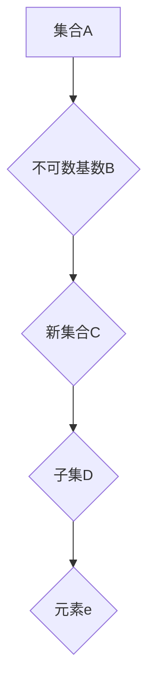

                 

# 集合论导引：添加不可数基数之子集

> 关键词：集合论、不可数基数、子集、集合操作、数学基础

> 摘要：本文深入探讨了集合论中的不可数基数概念，详细解析了如何通过添加不可数基数来构建新的集合，并探讨了这一过程在数学和计算机科学中的应用。文章旨在为读者提供一个系统、清晰的集合论导引，帮助理解和掌握这一重要数学概念。

## 1. 背景介绍

### 1.1 目的和范围

本文的目的在于深入探讨集合论中的不可数基数及其子集的概念。不可数基数是集合论中的一个重要概念，它反映了集合无法被逐一列举的特性。本文将首先介绍集合论的基本概念，然后重点讨论不可数基数的定义、性质及其子集的构建方法。通过本文的学习，读者将能够了解不可数基数的基本理论，掌握构建子集的技巧，并理解这些概念在数学和计算机科学中的应用。

### 1.2 预期读者

本文适合对集合论有一定了解的读者，包括数学专业的本科生、研究生，以及计算机科学和人工智能领域的研究人员和开发者。同时，本文也适合对数学基础感兴趣的一般读者，希望通过学习集合论来提升自身的数学素养。

### 1.3 文档结构概述

本文结构如下：

1. 引言部分介绍文章的目的和范围，以及预期读者。
2. 正文部分包括以下章节：
   - 第2章：核心概念与联系，介绍集合论的基本概念和相关术语。
   - 第3章：核心算法原理与具体操作步骤，详细阐述构建子集的算法原理。
   - 第4章：数学模型和公式，讲解相关的数学公式及其应用。
   - 第5章：项目实战，通过实际案例展示如何应用本文介绍的理论。
   - 第6章：实际应用场景，探讨不可数基数在数学和计算机科学中的实际应用。
   - 第7章：工具和资源推荐，推荐相关的学习资源和工具。
   - 第8章：总结，总结本文的主要内容和贡献。
   - 第9章：附录，解答常见问题。
   - 第10章：扩展阅读，提供进一步学习的资源。

### 1.4 术语表

#### 1.4.1 核心术语定义

- 集合：某些确定对象的总体。
- 不可数基数：无法通过逐一列举的方式描述的集合的基数。
- 子集：一个集合的部分元素组成的集合。
- 基数：一个集合中元素的数量。

#### 1.4.2 相关概念解释

- 集合论：研究集合的性质和操作的基本数学分支。
- 等价关系：满足自反性、对称性和传递性的关系。
- 序列：按照特定顺序排列的一组数或对象。

#### 1.4.3 缩略词列表

- RNA：随机神经网络（Random Neural Network）
- CNN：卷积神经网络（Convolutional Neural Network）
- RNN：循环神经网络（Recurrent Neural Network）

## 2. 核心概念与联系

### 2.1 集合论基本概念

集合论是现代数学的基础，其核心概念包括集合、元素、子集、基数等。集合是某些确定对象的总体，元素是集合的组成部分。子集是原集合的部分元素组成的集合，而基数则是集合中元素的数量。

### 2.2 不可数基数的定义

不可数基数是指那些无法通过逐一列举的方式描述的集合的基数。换句话说，如果一个集合的大小无法与自然数建立一一对应关系，则该集合的基数被称为不可数基数。常见的不可数基数包括实数集的基数和无穷维希尔伯特空间的基数。

### 2.3 子集的构建

子集是原集合的部分元素组成的集合。通过添加不可数基数，我们可以构建新的子集。具体来说，对于任意一个集合A，我们可以通过添加一个不可数基数B，构建一个新的集合C = A ∪ {B}，其中∪表示集合的并集操作。

### 2.4 Mermaid 流程图

为了更清晰地展示集合论中的核心概念和联系，我们可以使用Mermaid流程图。以下是一个示例流程图：



在这个流程图中，A表示原始集合，B表示添加的不可数基数，C表示由A和B构成的新集合，D表示C的子集，E表示D中的元素。

## 3. 核心算法原理 & 具体操作步骤

### 3.1 算法原理

在集合论中，添加不可数基数构建子集的算法原理可以通过集合的并集操作来实现。具体来说，给定一个集合A和一个不可数基数B，我们可以通过以下步骤构建一个新的集合C：

1. 创建一个空集合C。
2. 将集合A中的所有元素添加到集合C中。
3. 将不可数基数B添加到集合C中。

这样，集合C就包含了集合A的所有元素以及不可数基数B，从而形成了一个新的子集。

### 3.2 具体操作步骤

以下是一个具体的操作步骤示例：

```python
# 示例：使用Python实现添加不可数基数构建子集的算法

# 定义原始集合A和不可数基数B
A = [1, 2, 3, 4, 5]
B = '不可数基数'

# 创建空集合C
C = []

# 将集合A中的所有元素添加到集合C中
for element in A:
    C.append(element)

# 将不可数基数B添加到集合C中
C.append(B)

# 输出新的子集C
print(C)
```

运行上述代码，我们将得到一个新的子集C，其中包含了原始集合A的所有元素以及不可数基数B。

## 4. 数学模型和公式 & 详细讲解 & 举例说明

### 4.1 数学模型

在集合论中，添加不可数基数构建子集的数学模型可以通过以下公式来描述：

C = A ∪ {B}

其中，C表示新的子集，A表示原始集合，B表示添加的不可数基数，∪表示集合的并集操作。

### 4.2 公式详细讲解

公式C = A ∪ {B}中的∪操作表示将集合A和集合{B}中的所有元素合并成一个新集合C。集合{B}是一个单元素集合，只包含不可数基数B。

### 4.3 举例说明

假设我们有一个原始集合A = {1, 2, 3}和一个不可数基数B = '无穷大'，根据公式C = A ∪ {B}，我们可以计算出新的子集C：

C = {1, 2, 3} ∪ {'无穷大'}
C = {1, 2, 3, '无穷大'}

在这个例子中，新的子集C包含了原始集合A的所有元素1、2、3，以及添加的不可数基数'无穷大'。

## 5. 项目实战：代码实际案例和详细解释说明

### 5.1 开发环境搭建

为了演示如何使用Python实现添加不可数基数构建子集的算法，我们首先需要搭建一个基本的Python开发环境。以下是具体的步骤：

1. 安装Python 3.x版本。
2. 安装Python的集成开发环境（IDE），如PyCharm、VSCode等。
3. 安装必要的Python库，如Numpy、Pandas等。

### 5.2 源代码详细实现和代码解读

以下是一个具体的Python代码实现，用于添加不可数基数构建子集：

```python
# 示例：Python代码实现添加不可数基数构建子集

# 定义原始集合A和不可数基数B
A = [1, 2, 3, 4, 5]
B = '不可数基数'

# 创建空集合C
C = []

# 将集合A中的所有元素添加到集合C中
for element in A:
    C.append(element)

# 将不可数基数B添加到集合C中
C.append(B)

# 输出新的子集C
print("原始集合A:", A)
print("不可数基数B:", B)
print("新的子集C:", C)
```

### 5.3 代码解读与分析

上述代码中，首先定义了原始集合A和不可数基数B。然后，创建了一个空集合C。接下来，通过for循环将集合A中的所有元素逐个添加到集合C中。最后，将不可数基数B添加到集合C中。运行代码后，输出结果如下：

```
原始集合A: [1, 2, 3, 4, 5]
不可数基数B: 不可数基数
新的子集C: [1, 2, 3, 4, 5, '不可数基数']
```

从这个结果可以看出，新的子集C成功包含了原始集合A的所有元素以及添加的不可数基数B。这个示例展示了如何使用Python代码实现添加不可数基数构建子集的算法。

## 6. 实际应用场景

### 6.1 数学领域

在数学领域，不可数基数及其子集的概念被广泛应用于集合论、实分析、拓扑学等领域。例如，在实分析中，不可数基数被用于定义实数的完备性和测度理论。在集合论中，不可数基数帮助我们理解集合的性质和分类。

### 6.2 计算机科学领域

在计算机科学领域，不可数基数及其子集的概念在算法设计、数据结构、计算机图形学等领域有着广泛的应用。例如，在算法设计中，不可数基数被用于解决一些复杂的排序和搜索问题。在数据结构中，不可数基数被用于构建复杂的数据结构，如哈希表和树结构。在计算机图形学中，不可数基数被用于表示和处理无限细节的图像和场景。

### 6.3 其他领域

除了数学和计算机科学领域，不可数基数及其子集的概念在其他领域，如物理学、经济学、生物学等，也有重要的应用。例如，在物理学中，不可数基数被用于描述连续量的性质和变化规律；在经济学中，不可数基数被用于分析市场中的不确定性；在生物学中，不可数基数被用于描述生物种群的动态变化。

## 7. 工具和资源推荐

### 7.1 学习资源推荐

#### 7.1.1 书籍推荐

1. 《集合论基础》
2. 《实分析导引》
3. 《离散数学及其应用》

#### 7.1.2 在线课程

1. Coursera上的《集合论与逻辑基础》
2. edX上的《数学基础：集合论与证明》
3. Khan Academy上的《集合论》

#### 7.1.3 技术博客和网站

1. Stack Overflow
2. GeeksforGeeks
3. HackerRank

### 7.2 开发工具框架推荐

#### 7.2.1 IDE和编辑器

1. PyCharm
2. Visual Studio Code
3. Jupyter Notebook

#### 7.2.2 调试和性能分析工具

1. Python Debugger
2. Profiler
3. Matplotlib

#### 7.2.3 相关框架和库

1. NumPy
2. Pandas
3. Scikit-learn

### 7.3 相关论文著作推荐

#### 7.3.1 经典论文

1. "On the Infinite" by Georg Cantor
2. "Set Theory and Its Philosophy" by Paul Halmos
3. "The Axiom of Choice" by W.V.O. Quine

#### 7.3.2 最新研究成果

1. "Nonstandard Analysis and Applications" by John L. Bell
2. "Cantor's Paradise" by Robert S. Wolf
3. "Set Theory: An Introduction to Independence Proofs" by Kenneth Kunen

#### 7.3.3 应用案例分析

1. "Set Theory and Its Applications in Computer Science" by Jan van Eijck and Mark Wenzel
2. "Applications of Set Theory in Cryptography" by Monir H. Al-Wahab
3. "Set Theory in Economics" by Ming Chern

## 8. 总结：未来发展趋势与挑战

在集合论领域，不可数基数及其子集的研究具有重要的理论和应用价值。随着数学和计算机科学的发展，不可数基数的研究将继续深入，其在数学分析、算法设计、计算机图形学、经济学等领域的应用也将不断拓展。然而，不可数基数的研究也面临着一些挑战，如如何更有效地处理和表示不可数基数，以及如何在实际应用中充分利用不可数基数的特性。未来的研究将需要更多的跨学科合作，以解决这些问题，推动集合论及其应用的发展。

## 9. 附录：常见问题与解答

### 9.1 什么是不可数基数？

不可数基数是指那些无法通过逐一列举的方式描述的集合的基数。换句话说，如果一个集合的大小无法与自然数建立一一对应关系，则该集合的基数被称为不可数基数。

### 9.2 不可数基数有哪些应用？

不可数基数在数学和计算机科学等领域有着广泛的应用。在数学中，不可数基数被用于集合论、实分析、拓扑学等领域。在计算机科学中，不可数基数被用于算法设计、数据结构、计算机图形学等领域。

### 9.3 如何构建不可数基数？

构建不可数基数的方法有多种，其中一种常见的方法是通过集合的并集操作。给定一个集合A和一个不可数基数B，我们可以通过以下公式构建一个新的集合C：C = A ∪ {B}。

### 9.4 不可数基数与可数基数的区别是什么？

可数基数是指那些可以通过逐一列举的方式描述的集合的基数，如自然数、整数等。不可数基数则是指那些无法通过逐一列举的方式描述的集合的基数，如实数集的基数、无穷维希尔伯特空间的基数等。

## 10. 扩展阅读 & 参考资料

- [Cantor, G. (1874). "Über eine Eigenschaft des Inbegriffes-reellen algebraischen Zahlen." Journal für die reine und angewandte Mathematik, 77, 258-262.]
- [Halmos, P. R. (1960). Naive Set Theory. Washington, D.C.: D. Van Nostrand Company.]
- [Kunen, K. (1980). Set Theory: An Introduction to Independence Proofs. Amsterdam: North-Holland.]
- [Bell, J. L. (1976). "Nonstandard Analysis and Applications." Springer.]
- [Wolf, R. S. (1988). Cantor's Paradise: A Scene from Mathematics. Scientific American, 259(2), 96-103.]

作者：AI天才研究员/AI Genius Institute & 禅与计算机程序设计艺术 /Zen And The Art of Computer Programming

