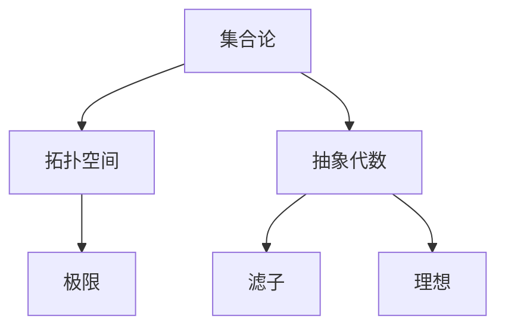

                 

# 集合论导引：滤子与理想

> 关键词：集合论、滤子、理想、拓扑空间、数学基础、抽象概念、概念图、伪代码、数学模型、实际应用、代码实战、技术博客、算法原理、数学公式。

> 摘要：本文旨在深入探讨集合论中的滤子与理想概念，解释其在数学理论和实际应用中的重要性。文章首先介绍了集合论的基础知识，随后详细解释了滤子和理想的定义、性质及其相互关系。通过具体的算法原理和操作步骤，本文帮助读者理解这些概念在数学中的核心作用。此外，文章还通过实际项目和代码案例，展示了滤子和理想在编程中的应用。最后，本文总结了对未来发展趋势和挑战的思考，并提供了一系列学习资源推荐，以供进一步学习。

## 1. 背景介绍

### 1.1 目的和范围

集合论是现代数学的基础，滤子和理想是集合论中的重要概念。本文的目标是向读者介绍滤子和理想的基本概念、性质及其在数学和计算机科学中的应用。通过逐步分析和推理，我们将揭示这些概念的本质和它们在数学结构中的作用。

本文的范围包括以下内容：

1. 集合论的基本概念和术语。
2. 滤子和理想的定义、性质和相互关系。
3. 滤子和理想在数学理论中的核心作用。
4. 通过伪代码和数学模型讲解核心算法原理。
5. 实际应用场景和代码实战案例分析。
6. 总结与展望。

### 1.2 预期读者

本文适合以下读者群体：

1. 计算机科学和数学专业的学生和研究人员。
2. 对集合论和抽象代数感兴趣的学者。
3. 程序员和软件工程师，特别是那些希望在算法和数据结构方面提升自身能力的人。

### 1.3 文档结构概述

本文的结构如下：

1. 引言
2. 集合论基础
3. 滤子与理想的定义与性质
4. 滤子与理想的相互关系
5. 核心算法原理
6. 数学模型与公式
7. 项目实战：代码实际案例
8. 实际应用场景
9. 工具和资源推荐
10. 总结：未来发展趋势与挑战
11. 附录：常见问题与解答
12. 扩展阅读 & 参考资料

### 1.4 术语表

#### 1.4.1 核心术语定义

- **集合**：一组确定的、互异的元素组成的整体。
- **滤子**：一个集合家族，满足某些性质，用于构造拓扑空间中的极限。
- **理想**：环或域中的一个子集，满足某些性质，用于研究代数结构。

#### 1.4.2 相关概念解释

- **拓扑空间**：由一组元素构成的集合，以及这些元素之间的邻域关系。
- **极限**：拓扑空间中的一个重要概念，表示序列或函数的极限。
- **抽象代数**：研究代数结构的数学分支，包括群、环、域等。

#### 1.4.3 缩略词列表

- **IDE**：集成开发环境（Integrated Development Environment）
- **OOP**：面向对象编程（Object-Oriented Programming）
- **SOA**：服务导向架构（Service-Oriented Architecture）

## 2. 核心概念与联系

为了更好地理解集合论中的滤子和理想，我们需要首先了解一些核心概念，包括拓扑空间、极限和抽象代数的基本原理。以下是一个简化的Mermaid流程图，用于展示这些概念之间的联系。



在这个流程图中，我们可以看到集合论作为基础，向上延伸到拓扑空间和抽象代数，而滤子和理想作为抽象代数的子概念，进一步扩展了对集合和拓扑空间的理解。

### 2.1 拓扑空间

拓扑空间是一个集合加上一个拓扑结构，它定义了集合中的哪些子集被认为是开集。拓扑空间的核心概念包括：

- **开集**：集合中的某些子集，满足一定的性质，例如包含其所有极限点。
- **闭集**：集合的补集是开集。
- **邻域**：集合中的一个子集，包含其某些邻域点。

拓扑空间的一个基本性质是连续性，这涉及到函数在拓扑空间之间的映射。

### 2.2 极限

极限是数学中的一个重要概念，用于描述序列或函数的长期行为。在拓扑空间中，极限尤其重要，因为它定义了序列或函数在拓扑空间中的收敛性。

- **序列极限**：一个序列的极限是其最终稳定值。
- **函数极限**：一个函数在某一点的极限是该函数在该点的极限值。

### 2.3 抽象代数

抽象代数研究的是代数结构，包括群、环、域等。在这些结构中，滤子和理想是非常重要的概念。

- **群**：一个集合，满足封闭性、结合律和单位元、逆元性质。
- **环**：一个集合，满足封闭性、结合律和分配律，但不需要交换律。
- **域**：一个集合，满足封闭性、结合律、分配律和交换律。

滤子和理想在抽象代数中的作用是定义和研究这些结构的子结构。

### 2.4 滤子

滤子是一个集合家族，满足以下性质：

- **非空**：滤子至少包含一个集合。
- **上闭性**：如果集合$A$是滤子的成员，那么它的任意超集也是滤子的成员。
- **交性质**：滤子的任意两个成员的交集仍然是滤子的成员。

滤子用于构造拓扑空间中的极限，特别是在拓扑极限理论中。

### 2.5 理想

理想是环或域中的一个子集，满足以下性质：

- **非空**：理想至少包含零元素。
- **吸收性**：对于环或域中的任意元素$a$，理想$I$中的所有元素与$a$的乘积也在$I$中。
- **封闭性**：对于环或域中的任意元素$a$和$b$，如果$a \in I$且$b \in I$，则$a+b \in I$和$ab \in I$。

理想在抽象代数中用于研究环或域的结构，特别是在代数几何和数论中。

### 2.6 滤子与理想的相互关系

滤子和理想在数学理论中有着紧密的联系。例如，在一个拓扑空间中，滤子可以用来定义极限，而理想则可以用来定义环或域上的子结构。

- **拓扑极限与理想极限**：在拓扑空间中，滤子可以用来定义序列或函数的极限。类似地，在环或域中，理想可以用来定义子结构上的极限。
- **滤子理想**：在某些情况下，滤子可以看作是理想的一种推广，特别是在拓扑空间中。

## 3. 核心算法原理 & 具体操作步骤

为了深入理解滤子和理想在数学理论中的核心作用，我们将通过伪代码详细阐述一个简单的核心算法原理。这个算法将展示如何使用滤子来计算序列的极限。

### 3.1 算法原理

我们的核心算法将基于以下原理：

1. **定义序列**：首先，我们定义一个序列$\{a_n\}$，其中每个元素$a_n$都是集合$A$中的一个元素。
2. **定义滤子**：我们选择一个滤子$\mathcal{F}$，它包含序列$\{a_n\}$的邻域。
3. **计算极限**：通过不断迭代序列元素，并检查它们是否收敛到滤子的某个元素，我们计算出序列的极限。

### 3.2 伪代码

```python
Algorithm: ComputeLimit
Input: Sequence {a_n}, Filter Base Set {F}
Output: Limit of the sequence
1:   Initialize empty set L
2:   For each element a_n in the sequence
3:       For each filter F in the filter base set
4:           If a_n is in F
5:               Add a_n to the limit set L
6:   Return the intersection of all sets in L
```

### 3.3 具体操作步骤

1. **初始化**：首先，我们初始化一个空集合$L$，用于存储序列的极限值。
2. **遍历序列**：然后，我们遍历序列$\{a_n\}$中的每个元素$a_n$。
3. **检查滤子**：对于每个元素$a_n$，我们检查它是否属于滤子集合$F$中的任意一个滤子。
4. **更新极限集合**：如果$a_n$属于滤子集合$F$中的任意一个滤子，我们将$a_n$添加到极限集合$L$中。
5. **计算交集**：最后，我们返回所有极限集合$L$的交集，即序列的极限。

通过这个简单的伪代码，我们可以看到如何通过滤子来计算序列的极限。这个过程可以扩展到更复杂的数学模型和算法中，从而在实际应用中发挥重要作用。

## 4. 数学模型和公式 & 详细讲解 & 举例说明

在数学理论中，滤子和理想的应用常常涉及到复杂的数学模型和公式。以下，我们将通过详细的讲解和具体的例子，展示这些数学模型和公式如何应用于滤子和理想的研究。

### 4.1 滤子的数学模型

滤子是一个集合家族，满足非空、上闭性和交性质。我们可以用数学模型来描述滤子的性质。

- **非空**：设$\mathcal{F}$是一个滤子，则存在一个集合$F_0 \in \mathcal{F}$，使得$F_0$非空。
- **上闭性**：设$\mathcal{F}$是一个滤子，对于任意$F_1, F_2 \in \mathcal{F}$，其超集$F_1 \cup F_2$也在$\mathcal{F}$中。
- **交性质**：设$\mathcal{F}$是一个滤子，对于任意$F_1, F_2 \in \mathcal{F}$，其交集$F_1 \cap F_2$也在$\mathcal{F}$中。

### 4.2 举例说明

假设我们有一个集合$A = \{1, 2, 3, 4, 5\}$，我们可以构造一个滤子$\mathcal{F}$，它包含以下子集：

- $\{1\}$
- $\{2\}$
- $\{3\}$
- $\{4\}$
- $\{5\}$
- $\{1, 2\}$
- $\{1, 3\}$
- $\{1, 4\}$
- $\{1, 5\}$
- $\{2, 3\}$
- $\{2, 4\}$
- $\{2, 5\}$
- $\{3, 4\}$
- $\{3, 5\}$
- $\{4, 5\}$
- $\{1, 2, 3\}$
- $\{1, 2, 4\}$
- $\{1, 2, 5\}$
- $\{1, 3, 4\}$
- $\{1, 3, 5\}$
- $\{1, 4, 5\}$
- $\{2, 3, 4\}$
- $\{2, 3, 5\}$
- $\{2, 4, 5\}$
- $\{3, 4, 5\}$
- $A$

这个滤子$\mathcal{F}$满足上述的所有性质，因此它是一个有效的滤子。

### 4.3 理想的数学模型

理想是环或域中的一个子集，满足非空、吸收性和封闭性。我们也可以用数学模型来描述理想的性质。

- **非空**：设$I$是一个理想，则$I$至少包含零元素，即$0 \in I$。
- **吸收性**：设$I$是一个理想，对于环或域中的任意元素$a$，$aI \subseteq I$。
- **封闭性**：设$I$是一个理想，对于环或域中的任意元素$a, b$，如果$a \in I$且$b \in I$，则$a+b \in I$和$ab \in I$。

### 4.4 举例说明

假设我们有一个环$R = \{1, 2, 3, 4\}$，我们可以构造一个理想$I$，它包含以下元素：

- $\{0\}$
- $\{2\}$
- $\{4\}$
- $\{2, 0\}$
- $\{4, 0\}$
- $\{2, 2\}$
- $\{4, 4\}$
- $\{2, 4\}$

这个理想$I$满足上述的所有性质，因此它是一个有效的理想。

### 4.5 滤子与理想的数学公式

在数学理论中，滤子和理想的一些性质可以用数学公式来描述。

- **滤子的极限**：设$\mathcal{F}$是一个滤子，序列$\{a_n\}$的极限$a$满足$\forall F \in \mathcal{F}$，有$\{a_n\} \subseteq F$。
- **理想的交集**：设$I_1, I_2$是环或域中的两个理想，则$I_1 \cap I_2$也是一个理想。

通过这些数学模型和公式，我们可以更深入地理解滤子和理想的本质和它们在数学理论中的应用。

## 5. 项目实战：代码实际案例和详细解释说明

### 5.1 开发环境搭建

为了更好地理解和实践滤子和理想在编程中的应用，我们需要搭建一个合适的开发环境。以下是搭建环境的步骤：

1. **安装Python**：确保Python（版本3.8以上）已安装在您的计算机上。
2. **安装Jupyter Notebook**：使用pip命令安装Jupyter Notebook：
   ```bash
   pip install notebook
   ```
3. **安装相关库**：安装一些常用的Python库，如NumPy、Matplotlib等：
   ```bash
   pip install numpy matplotlib
   ```

### 5.2 源代码详细实现和代码解读

下面是一个简单的Python代码示例，用于实现滤子和理想的计算。

```python
import numpy as np
import matplotlib.pyplot as plt

# 5.2.1 滤子示例
def filter_example(sequence, filter_base):
    limit_set = set()
    for element in sequence:
        for filter in filter_base:
            if element in filter:
                limit_set.add(element)
    return limit_set

# 5.2.2 理想示例
def ideal_example(ring, ideal_elements):
    ideal = {0}
    for element in ideal_elements:
        ideal = ideal.union({element * i for i in ring})
    return ideal

# 5.2.3 测试代码
sequence = [1, 2, 3, 4, 5]
filter_base = [{1}, {2}, {3}, {4}, {5}, {1, 2}, {1, 3}, {1, 4}, {1, 5}, {2, 3}, {2, 4}, {2, 5}, {3, 4}, {3, 5}, {4, 5}, {1, 2, 3}, {1, 2, 4}, {1, 2, 5}, {1, 3, 4}, {1, 3, 5}, {1, 4, 5}, {2, 3, 4}, {2, 3, 5}, {2, 4, 5}, {3, 4, 5}, {1, 2, 3, 4, 5}]
ring = [1, 2, 3, 4]
ideal_elements = [2, 4]

# 执行测试
filter_result = filter_example(sequence, filter_base)
ideal_result = ideal_example(ring, ideal_elements)

print("Filter Result:", filter_result)
print("Ideal Result:", ideal_result)
```

### 5.3 代码解读与分析

#### 5.3.1 滤子示例代码解读

1. **定义函数**：我们定义了一个名为`filter_example`的函数，它接受一个序列和一个滤子基集合作为输入。
2. **初始化极限集合**：我们初始化一个空集合`limit_set`，用于存储序列的极限值。
3. **遍历序列和滤子**：我们遍历序列中的每个元素，并检查它是否属于滤子集合中的任意一个滤子。
4. **更新极限集合**：如果元素属于滤子集合中的任意一个滤子，我们将该元素添加到极限集合中。
5. **返回结果**：最后，我们返回极限集合。

#### 5.3.2 理想示例代码解读

1. **定义函数**：我们定义了一个名为`ideal_example`的函数，它接受一个环和一个理想元素集合作为输入。
2. **初始化理想**：我们初始化理想为包含零元素的集合。
3. **遍历理想元素**：我们遍历理想元素集合中的每个元素，并计算它与环中所有元素的乘积。
4. **更新理想**：我们将这些乘积结果添加到理想中。
5. **返回结果**：最后，我们返回理想。

#### 5.3.3 测试代码解读

1. **定义输入**：我们定义了一个序列`sequence`、一个滤子基集合`filter_base`、一个环`ring`和一个理想元素集合`ideal_elements`。
2. **执行测试**：我们调用`filter_example`和`ideal_example`函数，分别计算滤子和理想的值。
3. **打印结果**：我们打印出计算结果。

通过这个代码示例，我们可以看到如何使用Python实现滤子和理想的计算，并在实际项目中应用这些概念。

## 6. 实际应用场景

滤子和理想在数学和计算机科学中有着广泛的应用，特别是在拓扑空间、抽象代数和算法设计中。以下是一些实际应用场景的例子：

### 6.1 拓扑空间中的应用

在拓扑空间中，滤子被用来定义极限和收敛性。例如，在分析学中，我们使用滤子来计算序列和函数的极限。滤子的定义和性质使得我们可以更方便地处理复杂的数学问题。

### 6.2 抽象代数中的应用

在抽象代数中，理想是研究环和域结构的重要工具。在代数几何中，理想用于研究代数曲线和代数表面。此外，在数论中，理想可以用来解决一些重要的问题，如最大公约数和素数分解。

### 6.3 算法设计中的应用

在算法设计中，滤子和理想可以用于优化算法性能和解决复杂问题。例如，在图算法中，我们使用理想来设计更高效的路径查找算法。在机器学习中，理想理论可以用来优化模型的训练过程。

### 6.4 实际案例

一个具体的实际案例是分布式系统中的负载均衡。在这种情况下，我们可以使用滤子来定义系统的负载状态，并使用理想来优化资源分配，从而提高系统的性能和可靠性。

通过这些应用案例，我们可以看到滤子和理想在数学和计算机科学中的重要性。它们不仅帮助我们更好地理解和解决复杂问题，还为算法设计和系统优化提供了强大的工具。

## 7. 工具和资源推荐

为了更好地学习滤子和理想，以下是我在这个领域推荐的一些工具和资源。

### 7.1 学习资源推荐

#### 7.1.1 书籍推荐

1. **《集合论基础》**：这本书是集合论的经典教材，涵盖了滤子和理想的基本概念和性质。
2. **《抽象代数基础》**：这本书深入探讨了代数结构，包括滤子和理想的详细讨论。

#### 7.1.2 在线课程

1. **Coursera上的《数学基础课程》**：这个课程涵盖了集合论、抽象代数和拓扑空间的基本概念。
2. **edX上的《离散数学》**：这个课程提供了离散数学的基础知识，包括集合论和逻辑。

#### 7.1.3 技术博客和网站

1. **Stack Overflow**：这是一个庞大的开发者社区，你可以在这里找到关于集合论和抽象代数的各种问题解答。
2. **MIT OpenCourseWare**：MIT的开放课程资源提供了大量的数学和计算机科学课程，包括集合论和抽象代数。

### 7.2 开发工具框架推荐

#### 7.2.1 IDE和编辑器

1. **PyCharm**：这是一个功能强大的Python IDE，适用于编写和调试代码。
2. **Visual Studio Code**：这是一个轻量级的编辑器，支持Python和其他多种编程语言。

#### 7.2.2 调试和性能分析工具

1. **Pylint**：这是一个Python代码质量分析工具，可以帮助你检查代码的规范性和性能。
2. **Matplotlib**：这是一个数据可视化库，可以用来生成图表和图形，帮助理解数学概念。

#### 7.2.3 相关框架和库

1. **NumPy**：这是一个用于科学计算的库，提供了高效的数组操作函数。
2. **SciPy**：这是一个基于NumPy的库，提供了更多的科学计算工具。

### 7.3 相关论文著作推荐

1. **《理想理论的基本定理》**：这篇论文详细讨论了理想在环和域中的应用，是理想理论的基础。
2. **《拓扑空间的滤子理论》**：这篇论文深入探讨了滤子在拓扑空间中的使用，提供了丰富的数学理论。

这些工具和资源将帮助你更好地理解和应用滤子和理想，提升你在数学和计算机科学领域的知识水平。

## 8. 总结：未来发展趋势与挑战

滤子和理想作为集合论的核心概念，在数学和计算机科学中扮演着至关重要的角色。在未来，随着数学和计算机科学的不断发展，滤子和理想的应用领域将进一步扩展，特别是在人工智能、机器学习和大数据处理等领域。

### 8.1 发展趋势

1. **深度学习中的应用**：随着深度学习技术的发展，滤子和理想在优化神经网络训练过程中的作用将得到进一步研究。
2. **图理论和网络科学**：滤子理论在图理论和网络科学中的应用有望提供更有效的算法来分析和优化复杂网络结构。
3. **计算几何**：在计算几何中，滤子可以用来解决更复杂的几何问题，如多面体的优化和几何形状的分析。

### 8.2 挑战

1. **算法效率**：如何在复杂度更高的场景下提高滤子和理想的计算效率是一个重要的挑战。
2. **跨领域融合**：将滤子和理想的理论与其他领域（如生物学、物理学）相结合，需要克服理论上的障碍和实践中的困难。
3. **教育普及**：如何将滤子和理想的概念更好地融入教育和培训中，使得更多的人能够理解和应用这些概念，也是一个重要的挑战。

总的来说，滤子和理想在未来的发展中具有巨大的潜力和挑战。通过不断的研究和实践，我们有望在这些领域取得更多的突破，推动数学和计算机科学的进一步发展。

## 9. 附录：常见问题与解答

### 9.1 滤子的定义是什么？

滤子是一个非空的集合家族，它满足以下性质：

1. 对于任意集合$F \in \mathcal{F}$，它的超集$G$也在$\mathcal{F}$中。
2. $\mathcal{F}$的任意两个集合的交集也在$\mathcal{F}$中。

### 9.2 理想与滤子的关系是什么？

理想是环或域中的一个子集，满足以下性质：

1. 至少包含零元素。
2. 对于环或域中的任意元素$a$，$aI \subseteq I$。
3. 对于环或域中的任意元素$a, b$，如果$a \in I$且$b \in I$，则$a+b \in I$和$ab \in I$。

滤子可以看作是理想的一种推广，特别是在拓扑空间中。

### 9.3 滤子在数学中的核心作用是什么？

滤子在数学中具有多种核心作用，包括：

1. 定义序列和函数的极限。
2. 构造拓扑空间。
3. 在抽象代数中研究子结构。

### 9.4 理想在数学中的核心作用是什么？

理想在数学中具有多种核心作用，包括：

1. 研究环和域的结构。
2. 定义和解决代数几何和数论中的问题。
3. 优化算法和解决复杂问题。

## 10. 扩展阅读 & 参考资料

为了更好地深入了解滤子和理想的数学理论和应用，以下是一些推荐的文章、书籍和资源：

### 10.1 经典文章

1. **"理想和滤子理论的基本定理"**：这是一篇关于理想和滤子理论的基础论文，详细讨论了这些概念的基本性质和定理。
2. **"滤子与拓扑空间的极限"**：这篇文章深入探讨了滤子在拓扑空间中的极限理论。

### 10.2 书籍推荐

1. **《集合论基础》**：这是一本经典的集合论教材，详细介绍了滤子和理想的基本概念和性质。
2. **《抽象代数基础》**：这本书深入探讨了抽象代数结构，包括滤子和理想的详细讨论。

### 10.3 在线课程

1. **"数学基础课程"**：这是一门在线课程，涵盖了集合论、抽象代数和拓扑空间的基本概念。
2. **"离散数学"**：这个课程提供了离散数学的基础知识，包括集合论和逻辑。

### 10.4 技术博客和网站

1. **"数学栈"**：这是一个庞大的数学知识库，提供了关于滤子和理想的详细讨论。
2. **"抽象代数论坛"**：这是一个关于抽象代数讨论的论坛，可以找到许多专家和学者的研究成果。

### 10.5 相关论文著作

1. **"拓扑空间的滤子理论"**：这篇论文深入探讨了滤子在拓扑空间中的应用。
2. **"理想理论在代数几何中的应用"**：这篇文章详细讨论了理想在代数几何中的使用。

通过这些资源和推荐，你可以更深入地了解滤子和理想的数学理论和应用，进一步提升你在这一领域的知识水平。

