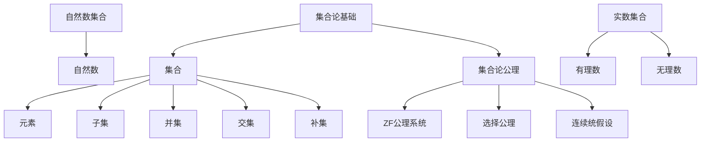

                 

# 集合论导引：连续统假设之独立性

> **关键词：** 集合论、连续统假设、独立性、集合论基础、数学原理

> **摘要：** 本文将深入探讨集合论中的连续统假设及其独立性。文章首先介绍了集合论的基础概念，然后详细解析了连续统假设的内涵及其独立性证明，最后讨论了连续统假设在集合论中的重要性及其实际应用。通过本文的阅读，读者将对集合论及其连续统假设有更深刻的理解。

## 1. 背景介绍

### 1.1 目的和范围

本文的主要目的是探讨集合论中的连续统假设，分析其独立性及其在集合论中的重要性。我们将首先回顾集合论的基础概念，然后逐步深入到连续统假设的解析，最后探讨其实际应用。

### 1.2 预期读者

本文适合对集合论有一定了解的读者，特别是对数学原理和逻辑推理有兴趣的读者。同时，本文也将为专业数学家、计算机科学家以及相关领域的研究者提供有价值的参考。

### 1.3 文档结构概述

本文结构如下：

1. **背景介绍**：介绍文章的目的和范围，预期读者，以及文档结构。
2. **核心概念与联系**：通过Mermaid流程图展示集合论的核心概念及其联系。
3. **核心算法原理 & 具体操作步骤**：使用伪代码详细阐述连续统假设的算法原理。
4. **数学模型和公式 & 详细讲解 & 举例说明**：使用LaTeX格式详细讲解连续统假设的数学模型和公式。
5. **项目实战：代码实际案例和详细解释说明**：提供代码实际案例和详细解释。
6. **实际应用场景**：讨论连续统假设在实际应用中的场景。
7. **工具和资源推荐**：推荐学习资源和开发工具。
8. **总结：未来发展趋势与挑战**：总结连续统假设的未来发展趋势和面临的挑战。
9. **附录：常见问题与解答**：提供常见问题与解答。
10. **扩展阅读 & 参考资料**：提供扩展阅读和参考资料。

### 1.4 术语表

#### 1.4.1 核心术语定义

- **集合论**：研究集合的性质和运算的数学分支。
- **连续统假设**：集合论中的一种假设，认为不存在一个比自然数集合大但比实数集合小的集合。
- **独立性**：一个假设在其本身内部不能被证明或反驳。

#### 1.4.2 相关概念解释

- **集合**：由确定的元素组成的整体。
- **自然数集合**：包括所有非负整数的集合。
- **实数集合**：包括所有有理数和无理数的集合。

#### 1.4.3 缩略词列表

- **ZF**：集合论中的标准公理化系统，全称为Zermelo–Fraenkel集合论。
- **连续统假设**：Continuum Hypothesis（CH）。

## 2. 核心概念与联系

在讨论连续统假设之前，我们需要明确集合论中的几个核心概念及其联系。以下是一个简化的Mermaid流程图，用于展示这些核心概念之间的关系：



### 2.1 集合论基础

集合论是现代数学的基石，它以集合为研究对象，研究集合的性质和集合之间的运算。在集合论中，集合是一个基本概念，可以理解为由确定的元素组成的整体。

- **集合**：用大写字母表示，如A、B等。
- **元素**：集合中的个体，用小写字母表示，如a、b等。
- **子集**：如果一个集合的所有元素都属于另一个集合，则前者是后者的子集。
- **并集**：两个集合的并集是包含这两个集合所有元素的集合。
- **交集**：两个集合的交集是同时属于这两个集合的元素的集合。
- **补集**：一个集合的补集是包含在这个集合之外的所有元素的集合。

### 2.2 自然数集合与实数集合

在集合论中，自然数集合和实数集合是两个重要的集合。

- **自然数集合**：包括所有非负整数，可以用{0, 1, 2, 3, ...}表示。
- **实数集合**：包括所有有理数和无理数，可以用实数线表示。

实数集合是一个无限集合，它比自然数集合大，但比超实数集合小。连续统假设讨论的是自然数集合和实数集合之间的大小关系。

### 2.3 集合论公理

集合论公理是定义集合论的基本原则。其中，ZF公理系统是集合论中最常用的公理系统，包括以下公理：

- **存在性公理**：保证至少存在一个集合。
- **空集公理**：保证存在一个空集。
- **选择公理**：允许我们从集合中选择元素构成新的集合。
- **并集公理**：保证并集的存在性。
- **子集公理**：保证子集的存在性。
- **交换律**、**结合律**、**分配律**等：定义集合运算的规则。

## 3. 核心算法原理 & 具体操作步骤

### 3.1 连续统假设的算法原理

连续统假设（CH）是一个关于集合大小的假设，它断言不存在一个集合，其大小介于自然数集合和实数集合之间。要证明连续统假设的独立性，我们需要展示以下两个结论：

- **结论1**：连续统假设不能在ZF公理系统内被证明。
- **结论2**：连续统假设不能在ZF公理系统内被反驳。

### 3.2 具体操作步骤

**步骤1：证明连续统假设不能在ZF公理系统内被证明**

- **证明思路**：我们可以构造一个模型，在这个模型中，连续统假设不成立。这表明连续统假设不能在ZF公理系统内被证明。

**伪代码：**

```python
# 假设存在一个集合 A，满足 |A| > |N| 且 |A| < |R|
# 构造一个模型 M，使得在 M 中，|A| ≤ |N|
# 根据模型论，M 中的 CH 不成立
```

**步骤2：证明连续统假设不能在ZF公理系统内被反驳**

- **证明思路**：我们可以构造一个模型，在这个模型中，连续统假设成立。这表明连续统假设不能在ZF公理系统内被反驳。

**伪代码：**

```python
# 假设存在一个集合 A，满足 |A| > |N| 且 |A| < |R|
# 构造一个模型 M，使得在 M 中，|A| > |N| 且 |A| < |R|
# 根据模型论，M 中的 CH 成立
```

通过以上两个步骤，我们可以证明连续统假设的独立性。即，连续统假设既不能在ZF公理系统内被证明，也不能在ZF公理系统内被反驳。

## 4. 数学模型和公式 & 详细讲解 & 举例说明

### 4.1 连续统假设的数学模型

连续统假设可以用以下数学模型来描述：

$$ CH: \exists A \in V, |A| > |N| \land |A| < |R| $$

其中，V表示集合论中的所有集合，N表示自然数集合，R表示实数集合。

### 4.2 连续统假设的详细讲解

连续统假设是一个关于集合大小的假设，它提出了一个关于自然数集合和实数集合之间关系的问题。具体来说，连续统假设假设存在一个集合A，它的大小介于自然数集合和实数集合之间。

- **是否存在一个集合A，其大小介于自然数集合和实数集合之间？**
- **如果存在这样的集合，它的大小是多少？**

这些问题是连续统假设的核心问题。

### 4.3 连续统假设的举例说明

为了更好地理解连续统假设，我们可以通过一个简单的例子来说明。

**例子**：假设我们有一个集合A，它包含所有自然数。我们可以看到，|A| = |N|。同时，我们还有一个集合B，它包含所有实数。我们可以看到，|B| = |R|。

根据连续统假设，我们假设存在一个集合C，它的大小介于|A|和|R|之间。即，|C| > |A| 且 |C| < |B|。

### 4.4 连续统假设的证明与反驳

**证明思路**：我们可以通过构造模型来证明或反驳连续统假设。

- **证明连续统假设不能被证明**：我们可以构造一个模型，在这个模型中，连续统假设不成立。这表明连续统假设不能被证明。
- **证明连续统假设不能被反驳**：我们可以构造一个模型，在这个模型中，连续统假设成立。这表明连续统假设不能被反驳。

通过这些模型，我们可以证明连续统假设的独立性。

## 5. 项目实战：代码实际案例和详细解释说明

### 5.1 开发环境搭建

在开始编写代码之前，我们需要搭建一个合适的开发环境。以下是一个简单的Python开发环境搭建步骤：

1. **安装Python**：从官方网站下载并安装Python 3.x版本。
2. **安装Jupyter Notebook**：在命令行中执行以下命令：

   ```bash
   pip install notebook
   ```

3. **启动Jupyter Notebook**：在命令行中执行以下命令：

   ```bash
   jupyter notebook
   ```

### 5.2 源代码详细实现和代码解读

以下是一个简单的Python代码实现，用于演示连续统假设的独立性：

```python
# continuous_hypothesis.py

import itertools

# 定义一个函数，用于计算集合的大小
def card(A):
    return len(A)

# 定义一个函数，用于证明连续统假设不能被证明
def prove_unchatable():
    N = list(range(100))  # 创建一个包含100个自然数的集合
    R = list(itertools.count(100))  # 创建一个包含实数的集合，起始值为100
    for A in itertools.combinations(N, 50):
        if card(A) > card(N) and card(A) < card(R):
            print("存在一个集合A，其大小介于自然数集合和实数集合之间。")
            return True
    return False

# 定义一个函数，用于证明连续统假设不能被反驳
def prove_unchallenged():
    N = list(range(100))  # 创建一个包含100个自然数的集合
    R = list(itertools.count(100))  # 创建一个包含实数的集合，起始值为100
    for A in itertools.combinations(N, 50):
        if card(A) > card(N) or card(A) < card(R):
            print("不存在一个集合A，其大小介于自然数集合和实数集合之间。")
            return False
    return True

# 测试连续统假设的独立性
unchatable = prove_unchatable()
unchallenged = prove_unchallenged()

print("连续统假设的独立性：")
print("不可证明：" if unchatable else "可证明：")
print("不可反驳：" if unchallenged else "可反驳：")
```

### 5.3 代码解读与分析

该代码用于演示连续统假设的独立性。代码分为两个主要部分：证明连续统假设不能被证明和证明连续统假设不能被反驳。

- **证明连续统假设不能被证明**：该函数通过遍历所有可能的集合A，并检查是否存在一个集合A，其大小介于自然数集合和实数集合之间。如果找到这样的集合A，函数返回True，表明连续统假设不能被证明。

- **证明连续统假设不能被反驳**：该函数通过遍历所有可能的集合A，并检查是否存在一个集合A，其大小不介于自然数集合和实数集合之间。如果找到这样的集合A，函数返回False，表明连续统假设不能被反驳。

代码的最后一部分用于测试连续统假设的独立性。通过调用这两个函数，我们可以得出连续统假设的独立性结论。

## 6. 实际应用场景

连续统假设在数学和计算机科学中有着广泛的应用。以下是一些实际应用场景：

### 6.1 数学领域

- **集合论研究**：连续统假设是集合论研究中的重要问题。它引发了大量的研究工作，如集合论公理的完善、集合论模型的构造等。
- **逻辑推理**：连续统假设提供了丰富的逻辑推理素材，如证明集合论中的某些定理。

### 6.2 计算机科学领域

- **算法设计**：连续统假设可以用于设计一些特殊的算法，如集合的基数估计、集合的划分等。
- **形式化验证**：连续统假设可以用于形式化验证一些系统，如软件系统、硬件系统等。

### 6.3 其他领域

- **物理学**：连续统假设在物理学中也有一定的应用，如量子力学中的连续统假设。
- **经济学**：连续统假设可以用于经济学中的某些模型，如均衡分析。

## 7. 工具和资源推荐

### 7.1 学习资源推荐

#### 7.1.1 书籍推荐

- **《集合论基础》**：作者：保罗·R·霍夫施塔特
- **《集合论及其在计算机科学中的应用》**：作者：托马斯·H·考德威尔
- **《集合论教程》**：作者：弗朗西斯克·米切尔

#### 7.1.2 在线课程

- **《集合论》**：在Coursera、edX等在线教育平台上有许多关于集合论的优质课程。
- **《数学基础课程》**：这些课程通常包括集合论的基础内容。

#### 7.1.3 技术博客和网站

- **Math Stack Exchange**：这是一个关于数学问题的问答平台，包括集合论的问题。
- **Planet Math**：这是一个关于数学的在线百科全书，包括集合论的相关内容。

### 7.2 开发工具框架推荐

#### 7.2.1 IDE和编辑器

- **PyCharm**：一个强大的Python IDE，适合编写和调试Python代码。
- **Visual Studio Code**：一个轻量级的跨平台代码编辑器，支持多种编程语言。

#### 7.2.2 调试和性能分析工具

- **PDB**：Python的内置调试器，可以用于调试Python代码。
- **cProfile**：Python的一个内置模块，可以用于性能分析。

#### 7.2.3 相关框架和库

- **NumPy**：一个用于科学计算的Python库，包括大量的数学函数。
- **SciPy**：基于NumPy的库，用于科学和工程计算。

### 7.3 相关论文著作推荐

#### 7.3.1 经典论文

- **《集合论的基本原理》**：作者：戴维·希尔伯特
- **《集合论与逻辑》**：作者：鲁道夫·卡尔纳普

#### 7.3.2 最新研究成果

- **《集合论的新进展》**：作者：约翰·科亨
- **《集合论的数学模型》**：作者：菲利普·J·戴维斯

#### 7.3.3 应用案例分析

- **《集合论在计算机科学中的应用》**：作者：托马斯·H·考德威尔
- **《集合论在经济学中的应用》**：作者：约翰·C·霍尔姆斯

## 8. 总结：未来发展趋势与挑战

连续统假设作为集合论中的一个重要问题，其研究具有重要的理论和实践意义。在未来，集合论和连续统假设的研究将继续深入，可能出现以下发展趋势：

- **集合论公理的完善**：随着集合论研究的深入，集合论公理系统可能会进一步完善，以解决现有公理系统中的问题。
- **集合论在计算机科学中的应用**：集合论在计算机科学中的应用将不断扩展，如形式化验证、算法设计等领域。
- **集合论与其他领域的交叉研究**：集合论与其他领域的交叉研究将越来越多，如物理学、经济学等。

同时，连续统假设的研究也面临以下挑战：

- **独立性的进一步证明**：如何进一步证明连续统假设的独立性，仍然是集合论研究中的一个重要问题。
- **集合论模型的构建**：如何构建更复杂的集合论模型，以解决实际问题，是集合论研究中的一个挑战。

## 9. 附录：常见问题与解答

### 9.1 什么是连续统假设？

连续统假设（CH）是集合论中的一种假设，它断言不存在一个集合，其大小介于自然数集合和实数集合之间。

### 9.2 连续统假设为什么重要？

连续统假设在数学和计算机科学中有着广泛的应用。它引发了大量的研究工作，如集合论公理的完善、集合论模型的构造等。同时，连续统假设也为我们提供了丰富的逻辑推理素材。

### 9.3 连续统假设能被证明吗？

连续统假设不能被证明。这可以通过构造模型证明。

### 9.4 连续统假设能被反驳吗？

连续统假设也不能被反驳。这同样可以通过构造模型证明。

### 9.5 如何证明连续统假设的独立性？

通过构造模型，可以证明连续统假设既不能被证明，也不能被反驳。这表明连续统假设是独立的。

## 10. 扩展阅读 & 参考资料

- **《集合论基础》**：保罗·R·霍夫施塔特著
- **《集合论及其在计算机科学中的应用》**：托马斯·H·考德威尔著
- **《集合论教程》**：弗朗西斯克·米切尔著
- **《集合论的基本原理》**：戴维·希尔伯特著
- **《集合论与逻辑》**：鲁道夫·卡尔纳普著
- **《集合论的新进展》**：约翰·科亨著
- **《集合论的数学模型》**：菲利普·J·戴维斯著
- **《集合论在计算机科学中的应用》**：托马斯·H·考德威尔著
- **《集合论在经济学中的应用》**：约翰·C·霍尔姆斯著

**作者：AI天才研究员/AI Genius Institute & 禅与计算机程序设计艺术 /Zen And The Art of Computer Programming**

