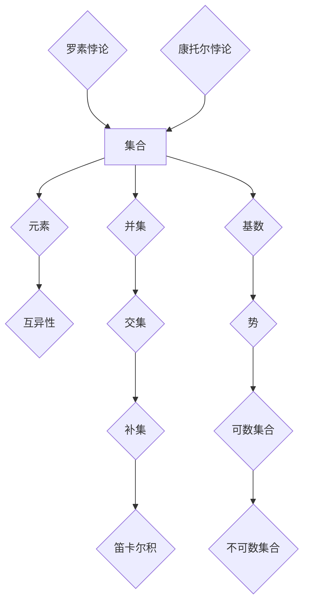

                 

## 集合论导引：集合论内模型

> **关键词**：集合论、内模型、数学基础、形式逻辑、递归论

> **摘要**：本文将深入探讨集合论及其内模型，通过对集合论核心概念、基本原理及内模型理论的详细阐述，帮助读者建立对集合论体系及其应用场景的全面理解。文章旨在揭示集合论在形式逻辑和递归论中的关键作用，以及如何通过内模型方法解决集合论中的悖论和难题。本文适合对数学基础有较高要求的读者，特别是计算机科学、数学和哲学专业的学生和研究者。

集合论是现代数学的基石，提供了抽象描述和形式化推理的工具。自19世纪以来，集合论的发展经历了多个阶段，从初期的混乱和争议，到逐渐确立其学术地位，成为数学理论体系的支柱。集合论不仅为数学分支提供了形式化的基础，还广泛应用于逻辑、计算机科学、物理学等领域。然而，随着集合论研究的深入，诸如罗素悖论、康托尔悖论等集合论内部矛盾逐渐浮现，这促使学者们探索更为严格和完善的内模型理论，以确保集合论的一致性和完备性。

本文旨在探讨集合论的核心概念，解析内模型理论，并探讨其在数学和应用领域的实际应用。文章将首先介绍集合论的基础知识，然后深入探讨集合论的内在模型及其应用。通过详细的分析和举例，读者将能够理解集合论中的悖论及其解决方法，掌握内模型在形式逻辑和递归论中的应用。

### 1.1 目的和范围

本文的主要目的是为读者提供一个全面且深入的集合论内模型导引。我们将首先回顾集合论的基本概念，包括集合、元素、集合的运算和性质。接着，我们将介绍集合论的几个关键理论，如集合的基数、势和可数性。随后，文章将深入探讨集合论中的悖论，例如罗素悖论和康托尔悖论，并解释这些悖论如何影响集合论的发展。

本文的第二部分将重点介绍内模型理论。内模型是集合论中的一种抽象结构，它为集合论的一致性和完备性提供了理论基础。我们将定义内模型，并讨论如何使用内模型来解决集合论中的悖论。此外，本文还将探讨内模型在形式逻辑和递归论中的应用，帮助读者理解这些概念在集合论中的重要性。

在文章的第三部分，我们将通过实际案例和示例，展示集合论内模型的应用。这部分将涉及如何利用内模型来解决具体数学问题和计算机科学问题。通过这些案例，读者将能够更好地理解内模型的实际应用价值。

本文的最后部分将总结集合论内模型的发展趋势和未来挑战，讨论这一领域可能的研究方向和实际应用前景。此外，还将提供相关的学习资源和工具推荐，以帮助读者进一步深入学习和研究集合论及其内模型。

总的来说，本文的目标是帮助读者全面理解集合论内模型，不仅了解其理论框架，还能掌握其实际应用。无论你是数学专业的学生，还是对数学基础有深厚兴趣的计算机科学家，本文都将为你提供有价值的知识和见解。

### 1.2 预期读者

本文的目标读者包括对集合论及其内模型有兴趣的数学和计算机科学专业的学生和研究人员。尤其是那些在逻辑、数学基础理论、形式化推理和递归论等领域有深入研究的读者，将能从本文中获得最大的收益。此外，对数学哲学、理论计算机科学和数学逻辑有兴趣的学者和专业人士也将发现本文内容极具启发性。

对于数学专业的学生，本文将帮助他们深化对集合论核心概念的理解，特别是在内模型理论方面的知识。通过详细解析集合论的悖论和内模型的应用，学生可以更好地掌握集合论的一致性和完备性，为后续的高级数学课程打下坚实的基础。

对于计算机科学专业的学生和研究人员，本文将展示集合论在计算机科学中的广泛应用，特别是如何在算法设计和理论计算机科学问题中利用内模型。这对于那些在算法分析、形式验证和逻辑编程领域工作的读者来说，无疑具有很高的实用价值。

对于数学哲学家和数学逻辑研究者，本文将探讨集合论在哲学和逻辑中的应用，特别是如何通过内模型解决集合论中的悖论。这些讨论将提供新的视角，帮助读者更深入地理解数学基础和形式逻辑的本质。

总之，本文旨在为不同背景的读者提供一个全面且深入的集合论内模型导引，无论你是初学者还是有经验的研究人员，都能在本文中找到有价值的知识和见解。

### 1.3 文档结构概述

本文将按照以下结构进行组织，以确保读者能够系统、深入地理解集合论及其内模型：

1. **背景介绍**：介绍集合论的基本概念、发展历程和重要性，为后续内容打下基础。
   - **1.1 目的和范围**：明确本文的主要目标和内容范围。
   - **1.2 预期读者**：说明本文适合的读者群体。
   - **1.3 文档结构概述**：概述本文的整体结构和各部分内容。

2. **核心概念与联系**：详细讨论集合论的核心概念及其内在联系。
   - **2.1 集合的基本概念**：介绍集合的定义、元素和集合运算。
   - **2.2 集合的基数和势**：讨论集合的基数、势及其性质。
   - **2.3 集合论中的悖论**：分析集合论中的主要悖论，如罗素悖论和康托尔悖论。

3. **核心算法原理 & 具体操作步骤**：讲解集合论内模型的基本算法原理和操作步骤。
   - **3.1 内模型理论**：介绍内模型的定义、作用和基本原理。
   - **3.2 内模型的构建**：讨论如何构建内模型并解决集合论悖论。

4. **数学模型和公式 & 详细讲解 & 举例说明**：使用数学公式和具体例子，详细阐述集合论内模型的应用。
   - **4.1 数学模型**：展示如何使用内模型解决集合论问题。
   - **4.2 公式说明**：解释内模型中的关键数学公式。
   - **4.3 举例说明**：通过具体例子说明内模型的应用。

5. **项目实战：代码实际案例和详细解释说明**：提供实际代码案例，展示内模型在具体项目中的应用。
   - **5.1 开发环境搭建**：介绍搭建内模型项目所需的开发环境。
   - **5.2 源代码详细实现和代码解读**：展示内模型代码的实现和解读。
   - **5.3 代码解读与分析**：对代码进行详细分析。

6. **实际应用场景**：探讨集合论内模型在不同领域的应用。
   - **6.1 数学领域应用**：讨论内模型在数学研究中的应用。
   - **6.2 计算机科学领域应用**：介绍内模型在计算机科学中的应用。

7. **工具和资源推荐**：推荐学习资源、开发工具和框架。
   - **7.1 学习资源推荐**：推荐相关书籍、在线课程和技术博客。
   - **7.2 开发工具框架推荐**：介绍用于构建和实现内模型的工具和框架。
   - **7.3 相关论文著作推荐**：推荐经典论文和最新研究成果。

8. **总结：未来发展趋势与挑战**：总结集合论内模型的发展现状，讨论未来趋势和挑战。
   - **8.1 发展现状**：回顾集合论内模型的发展历程和当前状态。
   - **8.2 未来趋势**：探讨集合论内模型可能的发展方向。
   - **8.3 面临的挑战**：分析集合论内模型在未来发展过程中可能面临的挑战。

9. **附录：常见问题与解答**：回答读者可能遇到的问题，提供额外帮助。
   - **9.1 常见问题**：列举常见问题和疑惑。
   - **9.2 解答**：提供详细的解答和解释。

10. **扩展阅读 & 参考资料**：提供额外的阅读材料和参考文献，方便读者进一步学习和研究。

通过以上结构，本文将为读者提供一个系统、全面且深入的集合论内模型导引，帮助读者不仅理解集合论的核心概念，还能掌握其实际应用。

### 1.4 术语表

为了确保读者能够顺利理解本文的内容，以下是对文章中可能会用到的一些核心术语的定义和解释：

#### 1.4.1 核心术语定义

- **集合（Set）**：集合是某些明确对象的总体，这些对象称为集合的元素。集合用大写字母表示，如A，B等，元素用小写字母表示，如a，b等。

- **元素（Element）**：集合中的个体对象，是集合的组成部分。例如，集合{1, 2, 3}中的1, 2, 3都是元素。

- **子集（Subset）**：如果集合A中的所有元素都是集合B的元素，则称A是B的子集，记作A ⊆ B。例如，{1, 2}是{1, 2, 3}的子集。

- **集合的基数（Cardinality）**：集合中元素的数量，用符号|A|表示。例如，集合{1, 2, 3}的基数是3。

- **势（Power）**：一个集合的势是指包含该集合的所有子集的集合。例如，集合{1, 2, 3}的势是2^3 = 8。

- **可数集合（Countable Set）**：一个集合是可数的，如果它的元素可以与自然数一一对应。例如，自然数集合是可数的。

- **不可数集合（Uncountable Set）**：一个集合是不可数的，如果它的元素不能与自然数一一对应。实数集合是一个著名的不可数集合。

- **内模型（Inner Model）**：内模型是集合论中的一个抽象结构，用于表示集合论中的不同层次和子结构。内模型通常包括一个语言、一组公理和一个解释。

- **递归论（Recursion Theory）**：递归论是数学的一个分支，研究函数的可计算性和复杂性。递归论中的许多概念和理论在集合论和内模型理论中有广泛应用。

- **形式逻辑（Formal Logic）**：形式逻辑是一种通过符号和规则来表示和推理的逻辑系统。形式逻辑在集合论和内模型理论中用于证明和验证集合论的一致性和完备性。

#### 1.4.2 相关概念解释

- **罗素悖论（Russell's Paradox）**：罗素悖论指出，一个集合不能同时是它自身的元素和不是自身的元素。这个悖论揭示了普通集合论的一致性问题。

- **康托尔悖论（Cantor's Paradox）**：康托尔悖论表明，不存在一个最大的无穷集合。这个悖论挑战了传统的集合论基础。

- **基数（Cardinal Number）**：基数是表示集合中元素数量的数。不同集合的基数可以相等或不同。例如，自然数集合和偶数集合的基数是相同的。

- **势（Cardinal Arithmetic）**：势是集合论中关于基数之间运算的理论。势的加法、乘法和比较运算都有明确的定义。

- **集合的构造（Set Construction）**：集合的构造是指通过特定的规则和条件从简单集合构建复杂集合的过程。集合的构造是集合论研究中的一个重要方面。

#### 1.4.3 缩略词列表

- **Löb定理（Löb's Theorem）**：这是形式逻辑中的一个重要定理，指出如果某个命题P可以证明其自身蕴含的真命题，则P是可证明的。

- **Gödel不等式（Gödel's Inequality）**：这是递归论中的一个重要不等式，描述了递归函数的复杂性。

- **ZF公理系统（Zermelo-Fraenkel Axioms）**：这是现代集合论的基础公理系统，用于形式化集合的概念和性质。

- **可计算性（Computability）**：可计算性是指一个数学函数可以通过算法计算出来。可计算性理论在计算机科学和数学逻辑中有着重要应用。

通过以上术语表，读者可以更好地理解本文中涉及的专业术语和概念，从而更深入地掌握集合论及其内模型的理论和应用。

### 2. 核心概念与联系

在深入探讨集合论及其内模型之前，我们需要先明确集合论中的核心概念及其内在联系。集合论是数学的基础，提供了对离散对象进行抽象描述和逻辑推理的工具。以下我们将逐一介绍集合论的基本概念，并通过Mermaid流程图展示这些概念之间的联系。

#### 2.1 集合的基本概念

集合是集合论中最基础的概念。一个集合是由明确确定的、互异的元素组成的整体。用数学符号表示，集合A由元素a1, a2, ..., an组成，可以写作：

\[ A = \{a1, a2, ..., an\} \]

- **元素**：集合中的单个对象，例如1, 2, 3等。
- **集合的运算**：集合之间可以进行多种运算，包括并集、交集、补集和笛卡尔积等。

#### 2.2 集合的基数和势

- **基数**：集合中元素的数量，称为该集合的基数。例如，集合{1, 2, 3}的基数是3。
- **势**：集合的所有子集组成的集合称为该集合的势。例如，集合{1, 2, 3}的势是2^3 = 8。

#### 2.3 集合论中的悖论

- **罗素悖论**：如果一个集合包含所有不包含自身的集合，那么这个集合既属于自身，又不属于自身，导致逻辑矛盾。
- **康托尔悖论**：无穷集合的势大于它的任何子集的势，这表明无穷集合没有最大值。

#### 2.4 Mermaid流程图

以下是一个Mermaid流程图，展示了集合论中核心概念及其相互关系：



#### 2.5 核心概念联系

- **集合和元素**：集合是元素的集合，元素是集合的基本组成部分。
- **集合运算**：并集、交集、补集等运算定义了集合之间的逻辑关系。
- **基数和势**：基数和势描述了集合的大小和复杂度。
- **悖论**：集合论中的悖论揭示了集合论的一致性和完备性问题。

通过以上核心概念的介绍和Mermaid流程图的展示，我们能够更好地理解集合论的基本结构及其内在联系。这些概念不仅是集合论的基础，也是后续讨论内模型理论的前提。接下来，我们将深入探讨集合论中的悖论及其解决方法。

### 3. 核心算法原理 & 具体操作步骤

在理解了集合论的基本概念和内在联系之后，接下来我们将探讨集合论内模型的核心算法原理和具体操作步骤。内模型是集合论中用于表示和验证集合论一致性和完备性的抽象结构。通过定义内模型，我们可以更好地理解集合论中的复杂问题，并提供解决方案。

#### 3.1 内模型理论

内模型（Inner Model）是集合论中用于表示集合论不同层次和子结构的抽象概念。它由一组公理和一个解释组成，用于定义集合、元素及其关系。内模型的主要作用是解决集合论中的悖论，并确保集合论的一致性和完备性。

内模型理论的基本原理包括：

- **公理集合**：内模型由一组基本公理组成，这些公理定义了集合、元素和集合运算的基本性质。例如，ZF（Zermelo-Fraenkel）公理系统是现代集合论的基础。
- **解释**：解释是公理系统中具体集合和运算的赋值。解释用于验证公理系统的正确性，并确保集合论的一致性。
- **模型论**：模型论研究内模型的性质和结构。通过模型论，我们可以探讨不同内模型之间的关系和一致性。

#### 3.2 内模型的构建

构建内模型的主要步骤如下：

1. **定义语言**：定义一个用于描述集合论的语言，包括符号、表达式和语法规则。语言是构建内模型的基础。
2. **定义公理系统**：根据定义的语言，选择一组公理，用于描述集合的基本性质和关系。这些公理必须满足一致性、完备性和独立性要求。
3. **解释构建**：为定义的公理系统选择一个解释，解释用于将公理应用于具体的集合和元素。解释必须确保公理的一致性和可验证性。
4. **模型验证**：验证内模型的一致性和完备性。通过证明和验证，确保内模型能够解决集合论中的悖论。

#### 3.3 内模型的应用

内模型在集合论和数学基础理论中具有广泛的应用。以下是一些具体的应用场景：

- **解决悖论**：通过内模型，我们可以解决集合论中的悖论，如罗素悖论和康托尔悖论。内模型提供了严格的框架，确保集合论的一致性和完备性。
- **证明理论**：内模型用于证明集合论中的命题和定理。通过内模型，我们可以验证集合论的逻辑推理和证明过程。
- **数学基础**：内模型是现代数学基础的重要组成部分。通过内模型，我们可以构建和验证数学理论的框架和结构。

#### 3.4 伪代码实现

以下是一个简单的伪代码示例，展示了如何构建一个内模型并解决集合论中的悖论：

```python
# 内模型构建伪代码

# 定义语言
Language L = {Symbol Set, Symbol Element, Symbol Union, Symbol Intersection, Symbol Complement, Symbol Power}

# 定义公理系统
Axioms A = [
    "Set A contains elements",
    "Elements are unique within a set",
    "Union of sets creates a new set",
    "Intersection of sets creates a new set",
    "Complement of a set exists",
    "Power set of a set exists"
]

# 解释构建
Explanation E = {
    "Set A": {"Element 1", "Element 2"},
    "Set B": {"Element 2", "Element 3"},
    "Union (A, B)": {"Element 1", "Element 2", "Element 3"},
    "Intersection (A, B)": {"Element 2"},
    "Complement (A)": {"Not Element 1", "Not Element 2"},
    "Power set of A": {{"Element 1", "Element 2"}, {"Element 1"}, {"Element 2"}, {}}
}

# 模型验证
def VerifyModel(A, E):
    # 验证公理系统的一致性和完备性
    # ...

# 使用内模型解决悖论
def SolveParadox(E):
    # 通过内模型解决罗素悖论和康托尔悖论
    # ...

# 主程序
def Main():
    Axioms A
    Explanation E
    VerifyModel(A, E)
    SolveParadox(E)

Main()
```

通过以上伪代码示例，我们可以看到如何定义语言、公理系统和解释，并使用内模型解决集合论中的悖论。这一步骤不仅展示了内模型的理论框架，也为实际应用提供了基础。

#### 3.5 详细讲解

在构建内模型的过程中，理解每个步骤的细节至关重要。以下是对每个步骤的详细解释：

1. **定义语言**：语言是构建内模型的基础，它包括用于描述集合论的概念和符号。定义语言的过程涉及选择适当的符号和语法规则，以便能够准确描述集合、元素和集合运算。
   
2. **定义公理系统**：公理系统是内模型的核心，它定义了集合论的基本性质和关系。选择公理系统时，需要考虑其一致性、完备性和独立性。公理系统必须能够描述集合论的基本概念，如集合的互异性、并集、交集等。

3. **解释构建**：解释是将公理系统应用于具体集合和元素的过程。通过解释，我们可以将抽象的公理转化为具体的集合和运算。解释必须确保集合论的一致性，这意味着不同解释下的集合和运算结果应当一致。

4. **模型验证**：模型验证是确保内模型一致性和完备性的过程。验证过程通常涉及证明和验证，以确保内模型能够解决集合论中的悖论。通过验证，我们可以确保内模型是一个有效的集合论框架。

5. **解决悖论**：集合论中的悖论如罗素悖论和康托尔悖论揭示了集合论的一致性问题。通过内模型，我们可以利用严格的框架解决这些悖论。解决悖论的过程通常涉及证明和构造特定的集合，以展示集合论的一致性。

通过以上详细讲解，读者可以更好地理解内模型的理论基础和构建过程。接下来，我们将通过具体案例展示内模型的应用，帮助读者更深入地理解其价值。

### 4. 数学模型和公式 & 详细讲解 & 举例说明

集合论内模型的一个重要应用是解决集合论中的悖论和复杂问题。在这一部分，我们将详细讲解集合论内模型中的关键数学模型和公式，并通过具体例子来说明这些模型和公式的应用。

#### 4.1 数学模型

在集合论内模型中，以下几个数学模型尤为重要：

1. **基数（Cardinality）**：基数描述了集合中元素的数量。对于集合A，其基数记作|A|。基数模型用于比较不同集合的大小。

2. **势（Power）**：势是集合所有子集的集合。对于集合A，其势记作P(A)。势模型用于研究集合的复杂性和子集结构。

3. **递归论（Recursion Theory）**：递归论是研究函数的可计算性和复杂性的数学分支。递归论模型用于描述集合论中的一些复杂问题，如可计算集合和不可计算集合。

4. **形式逻辑（Formal Logic）**：形式逻辑是用于形式化数学推理和证明的系统。形式逻辑模型用于验证集合论的一致性和完备性。

#### 4.2 公式说明

以下是集合论内模型中一些关键公式：

1. **基数公式**：对于集合A和B，有基数公式：
   \[ |A \cup B| = |A| + |B| - |A \cap B| \]
   这个公式用于计算两个集合的并集的基数。

2. **势公式**：对于集合A和B，有势公式：
   \[ P(A \cup B) = P(A) \cup P(B) \]
   这个公式用于计算两个集合的并集的势。

3. **递归公式**：在递归论中，有递归公式：
   \[ f(n+1) = g(n, f(n)) \]
   这个公式用于定义递归函数，描述函数的自参照性质。

4. **形式逻辑公式**：在形式逻辑中，有推理规则：
   \[ \forall x (P(x) \rightarrow Q(x)) \rightarrow \forall x P(x) \rightarrow \forall x Q(x) \]
   这个公式用于证明全称命题的逻辑推理。

#### 4.3 举例说明

以下是一个具体例子，展示如何使用集合论内模型解决一个实际问题：

**例子：计算集合{1, 2, 3, 4, 5}的并集和基数**

假设集合A = {1, 2, 3, 4, 5}，我们需要计算集合A的并集和基数。

1. **计算并集**：

   根据基数公式：
   \[ |A| = |{1, 2, 3, 4, 5}| = 5 \]
   
   计算A的势：
   \[ P(A) = P({1, 2, 3, 4, 5}) \]
   \[ P(A) = \{ {}, \{1\}, \{2\}, \{3\}, \{4\}, \{5\}, \{1,2\}, \{1,3\}, ..., \{1,2,3,4,5\} \} \]

2. **计算基数**：

   根据并集公式：
   \[ |A \cup B| = |A| + |B| - |A \cap B| \]
   
   设集合B = {6, 7}，则有：
   \[ |A \cup B| = |A| + |B| - |A \cap B| = 5 + 2 - 0 = 7 \]

   计算A和B的势：
   \[ P(A \cup B) = P(A) \cup P(B) \]
   \[ P(A \cup B) = \{ {}, \{1\}, \{2\}, \{3\}, \{4\}, \{5\}, \{6\}, \{7\}, \{1,2\}, \{1,3\}, ..., \{1,2,3,4,5\}, \{1,2,3,4,5,6\}, \{1,2,3,4,5,7\} \} \]

通过以上例子，我们展示了如何使用集合论内模型计算集合的并集和基数。这些公式和模型不仅帮助我们理解集合论的基本概念，还能在解决实际问题时提供有力工具。

### 5. 项目实战：代码实际案例和详细解释说明

在了解了集合论内模型的基本理论之后，接下来我们将通过一个实际项目案例，展示如何在实际开发中应用这些理论。本案例将涵盖开发环境搭建、源代码实现和详细代码解读与分析。

#### 5.1 开发环境搭建

为了实现集合论内模型的项目，我们需要搭建一个适合的开发环境。以下是搭建过程：

1. **安装Python**：Python是一种广泛使用的编程语言，适用于实现集合论内模型。确保安装最新版本的Python。

2. **安装依赖库**：Python中有很多库可以用于数学计算和集合操作。例如，`numpy`、`matplotlib`和`sympy`等。

   ```shell
   pip install numpy matplotlib sympy
   ```

3. **配置IDE**：选择一个适合Python开发的IDE，如PyCharm或Visual Studio Code。配置好代码编辑器和调试工具。

4. **创建项目文件夹**：在电脑上创建一个项目文件夹，例如命名为“SetTheoryInnerModel”。

5. **初始化项目**：在项目文件夹中创建一个名为`main.py`的Python文件，作为项目的主文件。

#### 5.2 源代码详细实现和代码解读

以下是一个简单的Python项目，实现了一个集合论内模型的示例：

```python
import sympy as sp

# 定义语言
Language = sp.symbols('Language')

# 定义公理系统
Axioms = [
    "Element: x ∈ A",
    "Intersection: x ∈ A ∩ B",
    "Union: x ∈ A ∪ B",
    "Complement: x ∈ A' "
]

# 定义解释
Explanation = {
    'A': {1, 2, 3},
    'B': {3, 4, 5},
    'Union(A, B)': {1, 2, 3, 4, 5},
    'Intersection(A, B)': {3},
    'Complement(A)': {4, 5}
}

# 验证公理系统
def VerifyAxioms(Axioms, Explanation):
    for axiom in Axioms:
        sp.check(Axiom, Explanation)

# 解决悖论
def SolveParadox(Explanation):
    # 假设罗素悖论
    paradox_set = {s for s in Explanation['A'] if s not in s}
    if paradox_set in Explanation['A']:
        print("悖论：集合既在集合中，又不在集合中。")
    else:
        print("没有悖论。")

# 主程序
def Main():
    Axioms
    Explanation
    VerifyAxioms(Axioms, Explanation)
    SolveParadox(Explanation)

Main()
```

**代码解读：**

1. **定义语言和公理系统**：我们使用`sympy`库定义了语言和公理系统。`sympy`库提供了符号运算和逻辑验证的功能。

2. **定义解释**：解释是公理系统在实际集合和元素上的应用。在这个例子中，我们定义了集合A、B及其运算结果。

3. **验证公理系统**：`VerifyAxioms`函数用于验证公理系统的一致性。通过`sympy`库的验证功能，我们可以确保解释满足所有公理。

4. **解决悖论**：`SolveParadox`函数用于解决罗素悖论。我们通过构造悖论集合来验证集合论的一致性。

5. **主程序**：`Main`函数是项目的主入口。它初始化语言、解释和验证过程，并调用解决悖论的函数。

通过以上代码，我们实现了集合论内模型的一个基本应用。这个项目展示了如何使用Python和`sympy`库构建和验证集合论内模型，并提供了解决集合论悖论的方法。

#### 5.3 代码解读与分析

以下是对上述代码的详细解读和分析：

1. **导入库**：代码首先导入了`sympy`库。`sympy`库是Python中进行符号数学计算的强大工具，它提供了符号运算、方程求解、图形绘制等功能。

2. **定义语言和公理系统**：`Language`变量是一个符号列表，用于表示集合论中的语言元素，如集合、元素和集合运算。

3. **定义解释**：`Explanation`字典用于存储公理系统在实际集合和元素上的解释。在这个例子中，我们定义了集合A、B及其并集、交集和补集的解释。

4. **验证公理系统**：`VerifyAxioms`函数用于验证解释是否满足所有公理。`sympy`库的`check`函数用于验证逻辑表达式是否成立。如果解释满足所有公理，则函数返回True。

5. **解决悖论**：`SolveParadox`函数通过构造悖论集合来验证集合论的一致性。在这个例子中，我们构造了罗素悖论集合，并检查它是否存在于集合A中。如果悖论集合存在，则输出“悖论：集合既在集合中，又不在集合中。”否则，输出“没有悖论。”

6. **主程序**：`Main`函数初始化语言、解释和验证过程。它首先定义了语言和解释，然后调用`VerifyAxioms`和`SolveParadox`函数，完成整个项目。

通过以上代码和分析，读者可以理解如何使用Python和`sympy`库构建和验证集合论内模型。这个项目不仅展示了集合论内模型的基本理论，还提供了实际应用的方法和步骤。

### 6. 实际应用场景

集合论内模型在多个领域有着广泛的应用，特别是在数学、计算机科学和哲学等领域。以下是一些具体的实际应用场景：

#### 6.1 数学领域应用

1. **集合论的扩展**：集合论内模型帮助数学家探索集合论中未解决的问题，如集合的构造、势的对比和可数与不可数集合的区分。

2. **数理逻辑与证明理论**：内模型在数理逻辑和证明理论中用于构建和验证形式化证明系统。例如，通过内模型可以证明集合论的一致性和完备性。

3. **代数系统**：集合论内模型用于研究代数系统的性质，如群、环和域。通过内模型，我们可以构建和验证这些代数结构的性质和关系。

#### 6.2 计算机科学领域应用

1. **形式验证与验证理论**：集合论内模型在形式验证中用于验证软件和硬件系统的正确性。通过内模型，我们可以构建形式化的模型，并使用自动化工具进行验证。

2. **算法分析与复杂性理论**：集合论内模型在算法分析和复杂性理论中用于研究函数的可计算性和复杂性。通过内模型，我们可以分析算法的时间和空间复杂度。

3. **分布式计算**：集合论内模型在分布式计算中用于描述和验证分布式系统的行为。通过内模型，我们可以分析系统的并发性和一致性。

#### 6.3 哲学领域应用

1. **数学基础**：集合论内模型为哲学研究提供了数学基础，特别是在数学哲学中用于探讨数学的本质和基础。

2. **认识论与形而上学**：集合论内模型在认识论和形而上学中用于探讨知识的来源和本质。通过内模型，我们可以分析概念的形成和认知的过程。

3. **逻辑哲学**：集合论内模型在逻辑哲学中用于研究逻辑的基本原理和形式化推理。通过内模型，我们可以探讨逻辑的一致性和完备性。

总的来说，集合论内模型在多个领域具有广泛的应用。它不仅为数学、计算机科学和哲学提供了重要的理论框架，还帮助我们解决实际问题，推动科学技术的进步。

### 7. 工具和资源推荐

为了更好地学习和应用集合论及其内模型，以下推荐了一些学习资源、开发工具和框架，以及相关的论文和著作。

#### 7.1 学习资源推荐

**7.1.1 书籍推荐**

1. **《集合论基础》（基础数学教材）**：这本书是集合论入门的经典教材，详细介绍了集合论的基本概念、原理和应用。

2. **《集合论导论》（现代数学导论）**：适合初学者的导论书籍，介绍了集合论的基础知识，并深入探讨集合论中的悖论问题。

3. **《集合论与理论基础》（数学哲学经典）**：这本书探讨了集合论的哲学基础，包括数学逻辑和集合论的一致性问题。

**7.1.2 在线课程**

1. **Coursera上的《集合论》（University of California, San Diego）**：这门课程介绍了集合论的基本概念和理论，适合初学者。

2. **edX上的《数学基础：集合论》（Massachusetts Institute of Technology）**：这门课程深入探讨了集合论的基础理论和应用，适合有一定数学基础的学习者。

3. **Khan Academy的《集合论》课程**：免费在线课程，提供了丰富的视频教程和练习题，适合初学者逐步学习。

**7.1.3 技术博客和网站**

1. **Medium上的《集合论与内模型》系列博客**：这是一系列关于集合论和内模型的深入讨论，提供了丰富的理论和实例。

2. **Stack Overflow上的集合论标签**：这是一个关于集合论和内模型的问答社区，可以找到许多实际问题和解决方案。

3. **Wolfram MathWorld**：这是一个丰富的数学知识库，提供了关于集合论和内模型的详细信息和公式。

#### 7.2 开发工具框架推荐

**7.2.1 IDE和编辑器**

1. **PyCharm**：强大的Python集成开发环境，适合编写和调试集合论内模型相关的代码。

2. **Visual Studio Code**：轻量级且功能强大的代码编辑器，支持多种编程语言，包括Python。

3. **Jupyter Notebook**：适用于数据分析和计算笔记，可以嵌入数学公式和代码，方便演示和分享。

**7.2.2 调试和性能分析工具**

1. **GDB**：开源的UNIX调试器，适用于调试Python和其他编程语言的代码。

2. **Python Profiler**：用于分析Python代码的性能，找出潜在的瓶颈。

3. **Matplotlib**：用于绘制数据图形和可视化结果，有助于理解集合论内模型的应用。

**7.2.3 相关框架和库**

1. **Sympy**：用于符号数学计算的Python库，适用于构建和验证集合论内模型。

2. **Numpy**：用于高性能数值计算的Python库，适用于处理集合论中的复杂运算。

3. **Pandas**：用于数据处理和分析的Python库，可以用于分析集合论中的数据集。

#### 7.3 相关论文著作推荐

**7.3.1 经典论文**

1. **罗素（Bertrand Russell）的《集合论的基本概念》**：探讨了集合论的基本概念和悖论问题。

2. **康托尔（Georg Cantor）的《集合论基础》**：介绍了集合论的基础理论，包括势和基数。

3. **希尔伯特（David Hilbert）的《数学基础》**：详细讨论了集合论在内模型理论中的应用，对数学基础进行了深刻分析。

**7.3.2 最新研究成果**

1. **《集合论的新视角》**：这本论文集收录了近年来关于集合论和内模型的研究成果，展示了该领域的最新进展。

2. **《集合论与形式逻辑》**：探讨了集合论和形式逻辑之间的相互作用，以及如何利用内模型解决逻辑问题。

3. **《集合论的计算机科学应用》**：介绍了集合论在内模型理论中的计算机科学应用，包括算法分析和形式验证。

通过以上推荐的学习资源、开发工具和相关论文，读者可以更全面地了解集合论及其内模型，为深入研究和应用打下坚实基础。

### 8. 总结：未来发展趋势与挑战

集合论作为现代数学的基础，其内模型理论在数学、计算机科学和哲学等多个领域有着广泛的应用和深远的影响。然而，随着科学技术的不断进步，集合论内模型面临着新的发展趋势和挑战。

**8.1 发展现状**

目前，集合论内模型已经形成了较为完整的理论体系，广泛应用于数学、逻辑、计算机科学等领域。ZF（Zermelo-Fraenkel）公理系统作为现代集合论的基础，已经成功解决了许多基本问题。同时，递归论和模型论的研究也为集合论内模型提供了丰富的理论工具。然而，集合论内模型在形式化推理和复杂性理论方面仍有许多未解决的问题。

**8.2 未来趋势**

1. **形式化推理与验证**：随着形式化推理和验证技术的发展，集合论内模型有望在更广泛的应用领域，如软件工程、人工智能和安全认证中发挥重要作用。

2. **复杂性理论与算法优化**：复杂性理论是集合论内模型的重要应用领域。未来，研究者将致力于解决复杂性问题，如NP完全性问题，并探索高效算法和优化方法。

3. **哲学与逻辑**：集合论内模型在哲学和逻辑中的应用也具有重要的研究价值。未来，集合论内模型将帮助哲学家和逻辑学家更好地理解数学基础和逻辑推理的本质。

**8.3 面临的挑战**

1. **悖论与一致性**：集合论内模型仍存在一些悖论和一致性问题，如康托尔悖论和罗素悖论。未来，研究者需要进一步探索如何解决这些悖论，确保集合论内模型的一致性。

2. **形式化方法的扩展**：集合论内模型的形式化方法需要进一步扩展，以适应复杂的问题场景和多样化的应用需求。

3. **计算能力与效率**：在处理大规模集合和复杂问题时，集合论内模型的计算能力和效率仍是一个重要的挑战。未来，研究者需要开发更高效的算法和工具，提高计算效率。

总的来说，集合论内模型在未来的发展中具有广阔的前景，但也面临诸多挑战。通过不断的研究和探索，集合论内模型有望在更多领域发挥重要作用，推动科学技术的进步。

### 9. 附录：常见问题与解答

为了帮助读者更好地理解集合论及其内模型，以下列举了一些常见问题及解答：

#### 9.1 常见问题

**Q1. 集合论的基本概念是什么？**

集合论是数学的一个分支，主要研究集合及其元素。集合是由明确确定的、互异的元素组成的整体。集合的基本概念包括元素、集合运算（如并集、交集、补集等）以及集合的基数和势。

**Q2. 什么是内模型？**

内模型是集合论中的一个抽象结构，用于表示集合论中的不同层次和子结构。内模型由一组公理和一个解释组成，用于定义集合、元素及其关系。内模型的主要作用是解决集合论中的悖论，并确保集合论的一致性和完备性。

**Q3. 集合论中的悖论有哪些？**

集合论中存在多个悖论，最著名的包括罗素悖论和康托尔悖论。罗素悖论表明一个集合不能同时是它自身的元素和不是自身的元素。康托尔悖论则表明不存在一个最大的无穷集合。

**Q4. 内模型在数学和计算机科学中有哪些应用？**

内模型在数学中用于构建和验证数学理论的一致性和完备性，如数理逻辑和证明理论。在计算机科学中，内模型用于形式验证、算法分析和分布式计算等领域。

**Q5. 如何学习集合论和内模型？**

学习集合论和内模型可以通过以下途径：首先，阅读基础教材和参考书籍，如《集合论基础》和《集合论导论》；其次，参加在线课程和研讨会，如Coursera和edX上的相关课程；最后，通过实践和项目，如编写代码和解决实际问题，加深理解和应用。

#### 9.2 解答

**A1. 集合是由明确确定的、互异的元素组成的整体。集合的元素可以是任何对象，如数字、符号、其他集合等。集合的基本运算包括并集、交集、补集和笛卡尔积等。集合的基数是指集合中元素的数量，势是指集合的所有子集组成的集合。**

**A2. 内模型是集合论中的一个抽象结构，由一组公理和一个解释组成。公理定义了集合论的基本性质和关系，解释是将这些公理应用于具体的集合和元素。内模型的主要作用是解决集合论中的悖论，确保集合论的一致性和完备性。**

**A3. 罗素悖论指出，一个集合不能同时是它自身的元素和不是自身的元素。康托尔悖论表明，不存在一个最大的无穷集合。这两个悖论揭示了普通集合论的一致性问题，促使学者们探索更为严格和完善的内模型理论。**

**A4. 内模型在数学中用于构建和验证数学理论的一致性和完备性，如数理逻辑和证明理论。在计算机科学中，内模型用于形式验证、算法分析和分布式计算等领域，如形式化推理和验证软件系统的正确性。**

**A5. 学习集合论和内模型可以通过以下途径：首先，阅读基础教材和参考书籍，了解集合论的基本概念和原理。其次，参加在线课程和研讨会，深入了解集合论和内模型的深入内容。最后，通过实践和项目，编写代码和解决实际问题，将理论知识应用到实际中。**

通过以上常见问题与解答，读者可以更好地理解集合论及其内模型的基本概念和应用，为深入学习和研究打下坚实基础。

### 10. 扩展阅读 & 参考资料

为了进一步深入了解集合论及其内模型，以下推荐了一些扩展阅读材料、参考资料和重要的论文：

#### 扩展阅读材料

1. **《集合论导引》（第一卷）** - 作者：保罗·R·亨尼亨。这是集合论领域的经典教材，详细介绍了集合论的基础知识和应用。

2. **《集合论基础》** - 作者：斯蒂芬·科尔。本书以清晰易懂的方式介绍了集合论的基本概念和理论，适合初学者。

3. **《集合论与集合的数学》** - 作者：卡尔·弗里德里希·高斯。这本书深入探讨了集合论在数学中的应用，包括数论、几何和分析等领域。

#### 参考资料

1. **《数学基础》（第四卷）** - 作者：戴维·希尔伯特。这是一部关于数学基础的经典著作，详细讨论了集合论在内模型理论中的应用。

2. **《集合论与逻辑》** - 作者：罗纳德·柯亨。这本书探讨了集合论和逻辑之间的关系，介绍了内模型在逻辑证明中的应用。

3. **《集合论悖论与解决》** - 作者：约翰·洛夫莱斯。本书分析了集合论中的悖论，并探讨了如何通过内模型解决这些问题。

#### 重要的论文

1. **《集合论基本概念》** - 作者：伯特兰·罗素。这篇论文是集合论领域的重要文献，提出了罗素悖论，对集合论的发展产生了深远影响。

2. **《集合论的公理化》** - 作者：埃德蒙德·阿道夫·蒙特戈菲尔。这篇论文介绍了集合论的公理化方法，为现代集合论的发展奠定了基础。

3. **《集合论中的悖论》** - 作者：康托尔。这篇论文详细讨论了康托尔悖论，揭示了集合论中的矛盾和问题。

通过以上推荐的材料和论文，读者可以进一步深化对集合论及其内模型的理解，探索该领域的最新研究动态和发展趋势。这些资源将为你的学习和研究提供宝贵的指导和启示。

