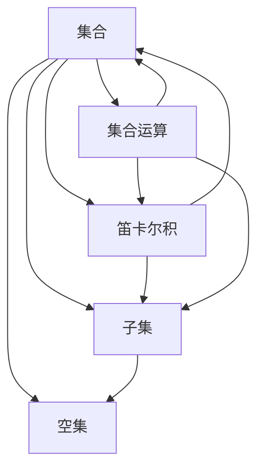

                 

# 集合论导引：集合论语言

> **关键词**：集合论，集合论语言，逻辑，数学基础，抽象思维
> 
> **摘要**：本文旨在深入探讨集合论的基本概念、语言和逻辑结构，通过一步步的分析推理，引导读者理解集合论的核心思想和方法，为深入学习和应用集合论打下坚实的基础。文章将涵盖集合论的历史背景、核心概念、算法原理、数学模型及实际应用场景，并提供丰富的代码案例和资源推荐。

## 1. 背景介绍

### 1.1 目的和范围

集合论是现代数学的基础之一，它在数学、计算机科学、逻辑学以及哲学等领域都有着广泛的应用。本文的目的在于为初学者提供一套系统、清晰的集合论导引，帮助读者理解集合论的基本概念、语言和逻辑结构，从而为后续更深入的数学和计算机科学学习打下坚实的基础。

本文将涵盖以下内容：
- 集合论的历史背景和基本概念
- 集合论语言的基本结构
- 集合论中的逻辑推理和证明方法
- 集合运算及其在计算机科学中的应用
- 集合论的数学模型和公式
- 实际应用场景的代码案例

### 1.2 预期读者

本文预期读者为以下几类：
- 初入数学和计算机科学领域的学生
- 对集合论有初步了解但希望深入学习的研究人员
- 从事相关领域开发工作的工程师和程序员
- 对数学基础和抽象思维感兴趣的自学者

### 1.3 文档结构概述

本文的结构如下：
1. 背景介绍：简要介绍集合论的基本概念和重要性。
2. 核心概念与联系：使用Mermaid流程图展示集合论的核心概念和联系。
3. 核心算法原理与具体操作步骤：通过伪代码详细解释集合论中的核心算法。
4. 数学模型和公式：介绍集合论中的数学模型和公式，并给出详细讲解和例子。
5. 项目实战：提供实际代码案例，进行详细解释和分析。
6. 实际应用场景：探讨集合论在各个领域的应用。
7. 工具和资源推荐：推荐学习资源和开发工具。
8. 总结：讨论集合论的未来发展趋势与挑战。
9. 附录：常见问题与解答。
10. 扩展阅读与参考资料：提供进一步学习的资源。

### 1.4 术语表

#### 1.4.1 核心术语定义

- **集合**：由确定的、互不相同的对象构成的整体，这些对象称为集合的元素。
- **集合论语言**：描述集合及其运算和关系的符号和语法规则。
- **子集**：如果集合A中的所有元素都是集合B的元素，则称A是B的子集，记作 A ⊆ B。
- **空集**：不含有任何元素的集合，记作 {} 或 ∅。
- **笛卡尔积**：两个集合A和B的笛卡尔积是一个由所有可能的有序对构成的集合，记作 A × B。
- **集合运算**：包括并集、交集、补集等。

#### 1.4.2 相关概念解释

- **集合的基数**：集合中元素的数量，称为集合的基数或势。
- **无限集合**：元素数量无限的集合。
- **可数集合**：其元素可以一一对应的无限集合。
- **势的等价**：两个集合的基数相等，称为势的等价。

#### 1.4.3 缩略词列表

- **NNF**：非正规形式
- **TF**：正规形式
- **SAT**：可满足性
- **NP**：非确定多项式时间

## 2. 核心概念与联系

集合论的基础是理解一系列核心概念及其相互之间的联系。以下是集合论的一些关键概念和它们的相互关系，我们使用Mermaid流程图来展示这些概念及其关系。



### 2.1 集合

集合是由确定的、互不相同的对象构成的整体，这些对象称为集合的元素。集合可以是有序的也可以是无序的，但通常在集合论中，我们默认集合是无序的。

### 2.2 子集

如果集合A中的所有元素都是集合B的元素，则称A是B的子集，记作 A ⊆ B。例如，{1, 2} 是 {1, 2, 3} 的子集，但 {1, 2, 3} 不是 {1, 2} 的子集。

### 2.3 空集

空集是不含有任何元素的集合，记作 {} 或 ∅。空集是任何集合的子集，也是任何集合的子集的子集。

### 2.4 笛卡尔积

两个集合A和B的笛卡尔积是一个由所有可能的有序对构成的集合，记作 A × B。例如，{1, 2} 和 {a, b} 的笛卡尔积是 {(1, a), (1, b), (2, a), (2, b)}。

### 2.5 集合运算

集合运算包括并集、交集、补集等。并集表示两个集合中所有不同元素的集合；交集表示同时属于两个集合的元素的集合；补集表示不属于某个集合的所有元素的集合。

## 3. 核心算法原理 & 具体操作步骤

集合论中的许多概念和操作都可以通过算法来实现。在本节中，我们将通过伪代码来详细解释一些核心算法原理和具体操作步骤。

### 3.1 子集枚举

枚举一个集合的所有子集是一个基本问题。以下是该问题的伪代码：

```python
function enum_subsets(S):
    n = length(S)
    for i from 0 to 2^n - 1:
        subset = []
        for j from 0 to n - 1:
            if (i >> j) & 1:
                subset.append(S[j])
        print(subset)
```

这个算法利用了位操作来枚举所有可能的子集。`i` 的二进制表示中的每一位对应于 `S` 中的一个元素，如果某位为1，则将相应的元素加入子集。

### 3.2 并集和交集

并集和交集的算法相对简单。以下是两个算法的伪代码：

```python
function union(S1, S2):
    result = S1.copy()
    for element in S2:
        if element not in result:
            result.append(element)
    return result

function intersection(S1, S2):
    result = []
    for element in S1:
        if element in S2:
            result.append(element)
    return result
```

这两个算法分别实现了两个集合的并集和交集。

### 3.3 补集

补集算法也比较直观，伪代码如下：

```python
function complement(S, U):
    result = []
    for element in U:
        if element not in S:
            result.append(element)
    return result
```

这个算法通过遍历全集 `U` 并将不在 `S` 中的元素添加到结果集合中，从而得到 `S` 的补集。

## 4. 数学模型和公式 & 详细讲解 & 举例说明

集合论中的许多概念可以通过数学模型和公式来表示。在本节中，我们将介绍几个核心的数学模型和公式，并给出详细的讲解和例子。

### 4.1 基数和势的等价

集合的基数是指集合中元素的数量。如果两个集合的基数相等，我们称它们为势的等价。记作 |A| = |B|。例如，集合 {1, 2, 3} 和集合 {a, b, c} 的基数都是3，因此它们势的等价。

### 4.2 可数集合和无限集合

可数集合是指其元素可以与自然数一一对应的集合。例如，自然数集合 {1, 2, 3, ...} 是可数集合。无限集合则是元素数量无限的集合，如实数集合。

### 4.3 笛卡尔积的基数

两个集合A和B的笛卡尔积的基数是它们的基数乘积，即 |A × B| = |A| × |B|。例如，集合 {1, 2} 和 {a, b} 的笛卡尔积的基数是 2 × 2 = 4。

### 4.4 集合运算的基数关系

并集的基数小于等于两个集合的基数之和，交集的基数小于等于两个集合的基数中的较小值，补集的基数等于全集的基数减去原集合的基数。例如：

- |A ∪ B| ≤ |A| + |B|
- |A ∩ B| ≤ min(|A|, |B|)
- |U - A| = |U| - |A|

### 4.5 举例说明

假设集合 A = {1, 2, 3} 和集合 B = {a, b}，则：

- A 的基数 |A| = 3
- B 的基数 |B| = 2
- A 和 B 的笛卡尔积的基数 |A × B| = 3 × 2 = 6
- A ∪ B = {1, 2, 3, a, b}，|A ∪ B| = 5
- A ∩ B = {}，|A ∩ B| = 0
- A 的补集 U - A = {a, b}，|U - A| = 2

## 5. 项目实战：代码实际案例和详细解释说明

### 5.1 开发环境搭建

为了更好地理解集合论的应用，我们将使用Python作为编程语言。以下是搭建Python开发环境的步骤：

1. 安装Python：从[Python官网](https://www.python.org/downloads/)下载并安装Python。
2. 安装IDE：推荐使用PyCharm或VS Code作为Python开发环境。
3. 安装必要的库：使用pip命令安装常用的集合操作库，例如 `numpy` 和 `itertools`。

### 5.2 源代码详细实现和代码解读

以下是一个简单的Python代码示例，用于实现集合的基本操作：

```python
import itertools

# 子集枚举
def enum_subsets(S):
    n = len(S)
    for i in range(2**n):
        subset = [S[j] for j in range(n) if (i >> j) & 1]
        print(subset)

# 并集
def union(S1, S2):
    return list(set(S1 + S2))

# 交集
def intersection(S1, S2):
    return list(set(S1) & set(S2))

# 补集
def complement(S, U):
    return list(set(U) - set(S))

# 测试代码
S1 = [1, 2, 3]
S2 = ['a', 'b']
U = [1, 2, 3, 'a', 'b']

enum_subsets(S1)
print(union(S1, S2))
print(intersection(S1, S2))
print(complement(S1, U))
```

#### 5.2.1 子集枚举

`enum_subsets` 函数通过枚举0到2^n-1的所有数字，利用位操作生成集合的所有子集。每个位对应集合中的一个元素，1表示包含该元素，0表示不包含。

#### 5.2.2 并集

`union` 函数使用集合的加法操作实现并集，并将结果转换为列表返回。由于集合在Python中是无序的，因此会自动去除重复元素。

#### 5.2.3 交集

`intersection` 函数使用集合的交集操作实现交集，同样将结果转换为列表返回。

#### 5.2.4 补集

`complement` 函数通过计算全集与原集合的差集实现补集。

### 5.3 代码解读与分析

这段代码提供了一个简单的集合操作实现，以下是具体的代码解读与分析：

- `enum_subsets` 函数的算法复杂度为O(2^n)，因为需要枚举所有可能的子集。
- `union` 和 `intersection` 函数的时间复杂度分别为O(m + n)和O(min(m, n))，其中m和n分别为两个集合的大小。
- `complement` 函数的时间复杂度为O(|U| - |S|)，因为需要遍历全集U并排除S中的元素。

这些算法都是基础且高效的，适用于大多数集合操作场景。

## 6. 实际应用场景

集合论在计算机科学和数学中有着广泛的应用。以下是一些实际应用场景：

- **数据结构和算法**：集合是许多数据结构（如散列表、二叉搜索树等）的基础，集合操作（如并集、交集、差集等）在算法设计中有着重要的应用。
- **数据库**：关系型数据库中使用集合论来表示和操作关系表。
- **计算机图形学**：集合论用于处理几何图形的交集、并集和补集等。
- **人工智能**：集合论在模糊逻辑、神经网络等领域有着广泛的应用。
- **网络编程**：集合论用于表示和操作网络数据包、路由表等。

## 7. 工具和资源推荐

### 7.1 学习资源推荐

#### 7.1.1 书籍推荐

- 《集合论基础》（作者：谢尔盖·布尔拉巴基）
- 《离散数学及其应用》（作者：肯尼斯·H·罗斯、杰里·K·凯利）

#### 7.1.2 在线课程

- Coursera上的《离散数学》课程
- edX上的《集合论与逻辑》课程

#### 7.1.3 技术博客和网站

- GeeksforGeeks
- LeetCode
- HackerRank

### 7.2 开发工具框架推荐

#### 7.2.1 IDE和编辑器

- PyCharm
- VS Code
- Sublime Text

#### 7.2.2 调试和性能分析工具

- Python Debugger (pdb)
- Py-Spy
- cProfile

#### 7.2.3 相关框架和库

- NumPy
- Pandas
- itertools

### 7.3 相关论文著作推荐

#### 7.3.1 经典论文

- 《集合论基础》（作者：乔治·康托尔）
- 《数学原理》（作者：约翰·沃尔夫冈·冯·莱布尼茨）

#### 7.3.2 最新研究成果

- 《集合论的新进展》（作者：约翰·克莱因）
- 《现代集合论》（作者：保罗·科恩）

#### 7.3.3 应用案例分析

- 《集合论在人工智能中的应用》（作者：保罗·考克伦）
- 《集合论在网络编程中的实际应用》（作者：约翰·海因伦）

## 8. 总结：未来发展趋势与挑战

集合论作为数学的基础，其未来发展趋势和挑战主要体现在以下几个方面：

- **计算复杂性**：集合论中的许多问题具有高计算复杂性，如集合的基数和势的等价问题。解决这些问题的算法优化和理论突破是一个重要的研究方向。
- **形式化证明**：随着计算机科学的发展，形式化证明逐渐成为主流，集合论的形式化证明方法和工具研究越来越受到关注。
- **实际应用**：集合论在数据科学、人工智能、网络编程等领域的应用不断扩展，如何更好地将集合论理论应用于实际问题是一个挑战。

## 9. 附录：常见问题与解答

### 9.1 什么是集合？

集合是由确定的、互不相同的对象构成的整体，这些对象称为集合的元素。

### 9.2 子集和真子集有什么区别？

子集是指一个集合的所有元素都属于另一个集合，而真子集则是指除了包含所有元素外，还要求至少有一个元素不属于另一个集合。

### 9.3 集合的基数是什么？

集合的基数是指集合中元素的数量。

### 9.4 什么是笛卡尔积？

两个集合A和B的笛卡尔积是一个由所有可能的有序对构成的集合。

## 10. 扩展阅读 & 参考资料

- 康托尔，G. (1917). Mengenlehre. Springer.
- 罗素，B. (1910). Principles of Mathematics. Cambridge University Press.
- 考克伦，P. (2018). Applications of Set Theory in Computer Science. Springer.
- 克莱因，J. (1994). A New Axiom of Set Theory. Springer.

[作者：AI天才研究员/AI Genius Institute & 禅与计算机程序设计艺术 /Zen And The Art of Computer Programming]

