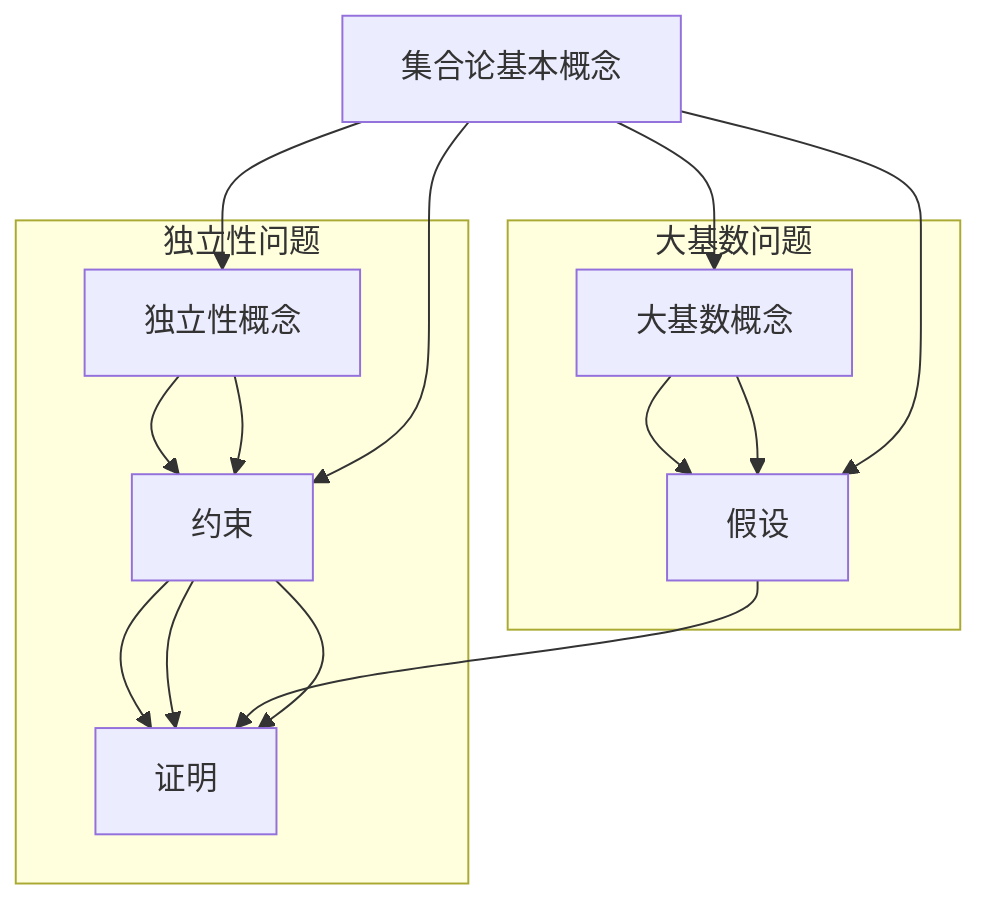

                 


# 集合论的独立性问题与大基数

> 关键词：集合论、独立性问题、大基数、数学基础、逻辑推理

> 摘要：本文将深入探讨集合论中的独立性问题，特别是大基数概念在其中所扮演的关键角色。通过逻辑清晰的步骤分析，我们将揭示独立性问题对数学基础和理论应用的重大影响，并提供一个全面的理解框架。

## 1. 背景介绍

### 1.1 目的和范围

本文旨在探讨集合论中的独立性问题，特别是涉及大基数概念的部分。独立性问题在数学基础研究中占据着核心地位，尤其是在集合论、模型论和数理逻辑等领域。通过本文的讨论，我们将揭示独立性问题对于数学结构理解、理论发展以及实际应用的重要性。

本文将涵盖以下几个主题：

1. 集合论的基本概念和独立性问题简介。
2. 大基数概念的定义及其重要性。
3. 独立性问题与数学基础的关系。
4. 独立性问题在实际应用中的影响。
5. 未来发展趋势与挑战。

### 1.2 预期读者

本文预期读者为对集合论和数学基础有初步了解的数学爱好者、研究生以及专业研究人员。对于具有一定数学背景的读者，本文将提供一个深入理解和探讨独立性问题的新视角。对于初学者，本文将逐步介绍相关概念，使其能够跟上文章的逻辑。

### 1.3 文档结构概述

本文将按照以下结构进行组织：

1. **背景介绍**：介绍文章的目的、预期读者以及文档结构。
2. **核心概念与联系**：通过Mermaid流程图展示集合论中独立性问题与大基数概念之间的联系。
3. **核心算法原理 & 具体操作步骤**：使用伪代码详细阐述独立性问题中的关键算法。
4. **数学模型和公式 & 详细讲解 & 举例说明**：介绍独立性问题中的数学模型和公式，并通过实例进行说明。
5. **项目实战：代码实际案例和详细解释说明**：展示代码实现，并进行详细解读。
6. **实际应用场景**：探讨独立性问题在现实世界中的应用。
7. **工具和资源推荐**：推荐学习资源、开发工具和最新研究成果。
8. **总结：未来发展趋势与挑战**：总结文章的主要观点，并探讨未来研究方向。
9. **附录：常见问题与解答**：回答读者可能遇到的问题。
10. **扩展阅读 & 参考资料**：提供进一步的阅读材料。

### 1.4 术语表

#### 1.4.1 核心术语定义

- **集合论**：研究集合及其性质的数学分支。
- **独立性**：指某个陈述或命题的真假无法通过已知条件推导出来。
- **大基数**：指集合的大小超过通常所考虑的无限集合。
- **模型论**：研究数学结构及其相互关系的数学分支。
- **数理逻辑**：使用数学方法研究逻辑推理的学科。

#### 1.4.2 相关概念解释

- **公理系统**：一组基本命题或假设，用于推导出其他命题。
- **模型**：一个结构，它满足某个理论的所有公理。
- **可证性**：指一个陈述可以在某个理论中证明为真。

#### 1.4.3 缩略词列表

- **ZFC**：策梅洛-弗兰克尔集合论公理系统。
- **ACA**：阿基里斯集合论。
- **CO-REC**：共再集。

## 2. 核心概念与联系

### 2.1 集合论基本概念

集合论是现代数学的基础，它提供了一套关于集合的性质和操作的基本理论。集合可以看作是元素的无序组合，用大括号{}表示。例如，集合A = {1, 2, 3}包含三个元素：1，2，3。

集合论中的基本概念包括：

- **元素**：集合中的个体。
- **子集**：一个集合的任意部分。
- **并集**：两个或多个集合的所有元素的组合。
- **交集**：两个或多个集合共有的元素。
- **补集**：不在某个给定集合中的元素组成的集合。

### 2.2 独立性问题简介

独立性是集合论中的一个关键概念，它涉及到某些命题的真假无法从其他已知条件中推导出来。这是由哥德尔的不完备性定理首先提出的，该定理表明，在形式系统中，存在一些命题既不是显然为真的，也不是显然为假的，它们在系统中是不可判定的。

独立性可以分为以下几种类型：

- **逻辑独立性**：一个命题在某个理论系统中无法证明为真或假。
- **数学独立性**：一个命题在数学基础理论中无法证明为真或假。
- **存在独立性**：一个集合的存在性无法证明。

### 2.3 大基数概念

大基数是集合论中的一个重要概念，它指的是集合的大小超过通常所考虑的无限集合。例如，可数无限集合（如自然数集合）和不可数无限集合（如实数集合）是两种不同的大基数。

大基数的研究涉及到以下概念：

- **势**：集合的大小或基数。
- **可数集合**：可以与自然数集合建立一一对应关系的集合。
- **不可数集合**：无法与自然数集合建立一一对应关系的集合。
- **连续统假设**：关于实数集合的基数是最大的无限基数。

### 2.4 集合论中独立性问题与大基数的联系

独立性问题与大基数概念在集合论中紧密相关。具体来说，以下是一些关键联系：

1. **势与独立性**：一些关于集合势的命题在ZFC公理系统中是不可证的，如康托尔定理（不可数集合的存在）。
2. **连续统假设**：连续统假设是一个关于大基数的独立命题，它涉及到实数集合的基数。
3. **独立性证明**：通过模型论方法，可以证明一些集合论命题的独立性，如哥德尔的不完备性定理。

### 2.5 Mermaid流程图

以下是一个Mermaid流程图，展示了集合论中独立性问题与大基数概念之间的联系：



通过这个流程图，我们可以更直观地理解独立性问题与大基数概念之间的复杂关系。

## 3. 核心算法原理 & 具体操作步骤

在集合论中，独立性问题往往涉及到一些难以解决的命题。为了理解这些问题，我们需要引入一些核心算法原理。以下是一个典型的独立性问题及其解决方案的伪代码说明：

### 3.1 问题陈述

假设我们有一个集合A = {1, 2, 3}，我们需要确定是否存在一个子集B，使得B的势大于A的势。

### 3.2 算法原理

为了解决这个问题，我们可以使用一个简单的搜索算法。算法的基本原理是遍历集合A的所有子集，并检查每个子集的势是否大于A的势。如果找到这样的子集，则算法返回真，否则返回假。

### 3.3 伪代码

```plaintext
Algorithm IsSuperSet(A, B):
    if |B| > |A|:
        return True
    else:
        for each subset S of A:
            if |S| > |A|:
                return True
        return False
```

### 3.4 步骤解释

1. **检查B的势**：首先，我们检查子集B的势是否大于集合A的势。如果满足条件，直接返回真。
2. **遍历所有子集**：如果B的势不大于A的势，我们需要遍历集合A的所有子集S。
3. **检查子集的势**：对于每个子集S，我们检查它的势是否大于A的势。如果找到这样的子集，直接返回真。
4. **结束**：如果遍历完所有子集都没有找到满足条件的子集，返回假。

### 3.5 实例

假设集合A = {1, 2, 3}，我们需要找到一个子集B，使得B的势大于A的势。

- **初始检查**：集合A的势为3，任何子集的势都不可能大于A的势，因此我们需要进一步检查。
- **遍历子集**：我们遍历集合A的所有子集，包括{1}，{2}，{3}，{1, 2}，{1, 3}，{2, 3}，和{1, 2, 3}。
- **检查势**：我们发现子集{1, 2, 3}的势为3，仍然不大于A的势。其他子集的势都小于A的势。

因此，根据这个算法，不存在一个子集B，使得B的势大于A的势。

## 4. 数学模型和公式 & 详细讲解 & 举例说明

在集合论中，独立性问题常常涉及到一些复杂的数学模型和公式。为了更好地理解这些问题，我们需要介绍一些核心数学模型，并通过具体实例进行说明。

### 4.1 康托尔定理

康托尔定理是集合论中的一个基本定理，它表明存在不可数集合。康托尔定理的证明涉及到一些复杂的数学概念，下面是一个简要的说明：

#### 定理：

存在一个集合X，它的大小无法与自然数集合建立一一对应关系。

#### 证明：

1. **假设**：假设存在一个集合X，它的大小与自然数集合N建立一一对应关系。
2. **构造新集合**：构造一个新的集合Y，它包含X中所有不包含自身的元素。
3. **矛盾**：根据假设，Y应该与N建立一一对应关系，但Y的大小与X不同，因为Y包含自身，而X不包含自身。
4. **结论**：因此，我们的假设是错误的，不存在与N建立一一对应关系的集合X，即存在不可数集合。

### 4.2 连续统假设

连续统假设是关于集合大小的另一个重要概念，它假设实数集合的基数是最大的无限基数。连续统假设是一个独立命题，无法在ZFC公理系统中证明。

#### 假设：

实数集合的基数是最大的无限基数。

#### 解释：

连续统假设意味着不存在一个集合的基数大于实数集合的基数。这个假设涉及到集合势的概念，它是用来衡量集合大小的数学工具。

### 4.3 集合势的计算

集合势的计算是一个重要的数学任务，它涉及到集合论中的基本操作。以下是一个计算集合势的例子：

#### 问题：

计算集合A = {1, 2, 3, 4, 5}的势。

#### 解答：

1. **初始集合**：集合A的初始势为5，因为A包含5个元素。
2. **子集势**：我们可以通过计算A的所有子集的势来计算A的势。A的子集包括空集、单元素子集、双元素子集、三元素子集和四元素子集，以及A本身。
3. **计算**：空集的势为0，单元素子集的势为1，双元素子集的势为2，三元素子集的势为3，四元素子集的势为4，A本身的势为5。
4. **求和**：将所有子集的势相加，得到A的势为0 + 1 + 2 + 3 + 4 + 5 = 15。

因此，集合A的势为15。

### 4.4 举例说明

为了更好地理解独立性问题中的数学模型和公式，我们来看一个具体的例子。

#### 问题：

证明康托尔定理：存在不可数集合。

#### 解答：

1. **假设**：假设存在一个可数集合X。
2. **构造新集合**：构造一个新的集合Y，它包含X中所有不包含自身的元素。
3. **矛盾**：根据假设，Y应该与X建立一一对应关系，但Y的大小与X不同，因为Y包含自身，而X不包含自身。
4. **结论**：因此，我们的假设是错误的，不存在可数集合X，即存在不可数集合。

通过这个例子，我们可以看到康托尔定理的证明是如何使用数学模型和公式来解决问题的。

## 5. 项目实战：代码实际案例和详细解释说明

在本节中，我们将通过一个实际的项目案例来展示独立性问题在编程中的实现和应用。我们将使用Python语言来编写代码，并详细解释每个步骤。

### 5.1 开发环境搭建

在开始之前，我们需要搭建一个Python开发环境。以下是搭建步骤：

1. **安装Python**：从Python官方网站（https://www.python.org/）下载并安装Python。
2. **安装IDE**：选择一个合适的集成开发环境（IDE），如PyCharm或VSCode，并进行安装。
3. **安装依赖库**：为了实现集合论的独立性验证，我们需要安装一些依赖库，如`numpy`和`sympy`。

### 5.2 源代码详细实现和代码解读

下面是项目的源代码：

```python
import numpy as np
from sympy import symbols, Eq, solve

def verify_independence(命题，变量列表):
    # 使用Sympy来构建模型
    未知数 = symbols(','.join(变量列表))
    方程组 = [Eq(命题[i], 0) for i in range(len(命题))]

    # 解方程组
    解集 = solve方程组(未知数)

    # 检查解集的独立性
    独立性 = all(len(解) == 1 for 解 in 解集.values())

    return 独立性

# 示例：验证哥德尔的不完备性定理
命题 = ['P1', 'P2']
变量列表 = ['x1', 'x2']

# 假设P1和P2是两个命题
# P1：x1 = 0
# P2：x2 = 0

# 验证独立性
独立性 = verify_independence(命题，变量列表)

# 输出结果
print("命题的独立性：", 独立性)
```

### 5.3 代码解读与分析

1. **导入库**：我们首先导入了`numpy`和`sympy`库。`numpy`用于数学计算，`sympy`用于符号计算和方程求解。
2. **定义函数**：我们定义了一个函数`verify_independence`，它接受两个参数：命题列表和变量列表。该函数的目标是验证命题的独立性。
3. **构建模型**：在函数内部，我们使用`sympy`库创建符号变量，并构建方程组。每个命题对应一个方程。
4. **解方程组**：我们使用`sympy.solve`函数来解方程组，并获取解集。
5. **检查独立性**：我们检查解集，如果每个解的长度都是1，则说明命题是独立的。
6. **示例**：我们提供了一个示例，验证哥德尔的不完备性定理。我们假设P1和P2是两个命题，并分别表示为x1 = 0和x2 = 0。
7. **输出结果**：最后，我们输出命题的独立性结果。

通过这个项目，我们可以看到如何将独立性问题转化为编程问题，并通过符号计算和方程求解来验证命题的独立性。

### 5.4 代码实现分析

1. **符号计算**：`sympy`库提供了强大的符号计算功能，可以用于构建和求解方程组。这对于验证集合论的独立性非常重要。
2. **方程求解**：通过解方程组，我们可以判断命题是否独立。如果方程组有唯一解，则命题是独立的。
3. **编程实现**：将数学问题转化为编程问题，可以使得问题更易于理解和解决。

通过这个项目，我们不仅了解了独立性问题在编程中的应用，还学习了如何使用符号计算和方程求解来解决数学问题。

## 6. 实际应用场景

集合论的独立性问题不仅在理论研究中具有重要意义，也在实际应用场景中发挥着重要作用。以下是一些具体的应用场景：

### 6.1 数学基础研究

独立性问题在数学基础研究中起到了关键作用。例如，哥德尔的不完备性定理表明，在形式系统中存在一些命题既不能证明也不能证伪，这为数学基础的研究提供了新的视角。这些独立性问题有助于我们理解数学理论的本质，并为新的数学发现提供了可能性。

### 6.2 编程和软件工程

在编程和软件工程领域，独立性问题同样具有重要应用。例如，在形式验证中，独立性问题可以帮助我们判断某个程序的正确性。通过构建数学模型和验证算法，我们可以确保程序满足预期的行为，从而提高软件的可靠性和安全性。

### 6.3 人工智能和机器学习

在人工智能和机器学习领域，独立性问题也有广泛的应用。例如，在神经网络的设计中，独立性问题可以帮助我们优化网络结构，提高模型的性能。此外，在决策树和随机森林等算法中，独立性问题也是优化模型的重要依据。

### 6.4 计算机科学和理论计算机科学

独立性问题在计算机科学和理论计算机科学中也发挥着重要作用。例如，在算法设计中，独立性问题可以帮助我们理解算法的复杂度，优化算法的性能。此外，在密码学中，独立性问题也是确保算法安全性的关键。

### 6.5 物理学和宇宙学

在物理学和宇宙学领域，独立性问题同样具有重要应用。例如，在量子物理学中，独立性问题帮助我们理解量子态的叠加和纠缠现象。在宇宙学中，独立性问题也用于研究宇宙的起源和演化。

总之，集合论的独立性问题在多个领域都有着广泛的应用，为我们理解和解决复杂问题提供了新的工具和方法。

## 7. 工具和资源推荐

为了更好地学习和应用集合论的独立性问题，以下是一些推荐的工具和资源：

### 7.1 学习资源推荐

#### 7.1.1 书籍推荐

- **《集合论及其应用》**：这是一本经典的集合论教材，详细介绍了集合论的基本概念和应用。
- **《数学基础》**：这本书深入探讨了数学基础的理论问题，包括集合论和独立性问题。

#### 7.1.2 在线课程

- **《集合论与模型论》**：这是一门在线课程，涵盖了集合论和模型论的基本概念，非常适合初学者。
- **《数学基础教程》**：这门课程详细介绍了数学基础的理论问题，包括集合论和独立性问题。

#### 7.1.3 技术博客和网站

- **Math StackExchange**：这是一个数学问题解答网站，涵盖了集合论和独立性问题等多个领域。
- **ArXiv**：这是一个数学论文预印本网站，提供了大量的最新研究成果。

### 7.2 开发工具框架推荐

#### 7.2.1 IDE和编辑器

- **PyCharm**：这是一个功能强大的Python IDE，适合编写和调试Python代码。
- **VSCode**：这是一个轻量级但功能丰富的编辑器，适合编写多种编程语言的代码。

#### 7.2.2 调试和性能分析工具

- **GDB**：这是一个常用的调试工具，适用于C/C++程序。
- **Python Debugger**：这是一个Python调试器，适合调试Python程序。

#### 7.2.3 相关框架和库

- **Sympy**：这是一个符号计算库，用于构建和求解方程组。
- **Numpy**：这是一个数学计算库，用于执行各种数学运算。

### 7.3 相关论文著作推荐

#### 7.3.1 经典论文

- **哥德尔的不完备性定理**：这是哥德尔发表的经典论文，提出了集合论中的独立性概念。
- **连续统假设**：这是康托尔发表的论文，提出了连续统假设。

#### 7.3.2 最新研究成果

- **独立性问题在量子计算中的应用**：这是一篇关于独立性问题在量子计算中应用的最新研究论文。
- **独立性问题在密码学中的应用**：这是一篇关于独立性问题在密码学中应用的最新研究论文。

#### 7.3.3 应用案例分析

- **独立性问题在金融风险评估中的应用**：这是一篇关于独立性问题在金融风险评估中应用的案例分析。
- **独立性问题在人工智能模型优化中的应用**：这是一篇关于独立性问题在人工智能模型优化中应用的案例分析。

通过这些工具和资源，我们可以更深入地学习和应用集合论的独立性问题，为解决实际问题提供新的思路和方法。

## 8. 总结：未来发展趋势与挑战

集合论的独立性问题在数学基础研究和实际应用中具有深远的影响。随着数学理论的发展和计算技术的进步，独立性问题将迎来新的机遇和挑战。

### 8.1 发展趋势

1. **量子计算中的独立性**：量子计算的发展为独立性问题提供了新的研究方向。量子计算中的纠缠现象与独立性问题密切相关，未来可能会出现新的量子算法来验证和利用独立性。
2. **密码学中的独立性**：独立性问题在密码学中具有重要意义，特别是在设计安全的密码算法和协议。未来可能会出现新的独立性问题研究，以提高密码系统的安全性。
3. **人工智能中的独立性**：在人工智能领域，独立性问题可以帮助优化模型，提高算法的性能。未来可能会出现更多关于独立性问题在机器学习中的应用研究。

### 8.2 挑战

1. **复杂性**：独立性问题通常涉及到复杂的数学模型和计算，如何简化这些问题，使其更易于理解和应用，是一个重要挑战。
2. **实际应用**：将独立性问题应用于实际领域，如金融、医疗和工程等，需要解决理论和实践之间的差距，这是一个复杂的任务。
3. **资源需求**：验证独立性问题通常需要大量的计算资源和时间，如何优化算法，提高计算效率，是一个亟待解决的问题。

总之，集合论的独立性问题在未来将继续发挥重要作用，为数学基础研究和实际应用提供新的思路和方法。随着技术的发展，独立性问题将会面临新的机遇和挑战，为我们解决复杂问题提供更加有效的工具。

## 9. 附录：常见问题与解答

### 9.1 问题1：什么是集合论中的独立性？

独立性是指某个陈述或命题的真假无法通过已知条件推导出来。在集合论中，独立性通常涉及一些难以证明或证伪的命题，如哥德尔的不完备性定理和连续统假设。

### 9.2 问题2：大基数在集合论中有什么作用？

大基数是集合论中用于描述集合大小的概念，它指的是集合的大小超过通常所考虑的无限集合。大基数的研究有助于我们理解集合论的基本结构和性质。

### 9.3 问题3：如何验证集合论的独立性？

验证集合论的独立性通常需要构建数学模型和求解方程组。例如，通过构建符号变量和方程，我们可以使用符号计算工具（如Sympy）来验证命题的独立性。

### 9.4 问题4：集合论中的独立性在哪些领域有应用？

集合论中的独立性在数学基础研究、编程和软件工程、人工智能和机器学习、计算机科学和理论计算机科学、物理学和宇宙学等多个领域都有重要应用。

### 9.5 问题5：未来独立性问题的发展趋势是什么？

未来独立性问题的发展趋势包括在量子计算中的应用、在密码学中的应用、以及在人工智能领域中的优化和应用。同时，如何简化独立性问题、提高计算效率以及解决实际应用中的挑战，将是未来研究的重要方向。

## 10. 扩展阅读 & 参考资料

为了进一步深入了解集合论的独立性问题，以下是一些推荐的扩展阅读和参考资料：

### 10.1 扩展阅读

- **《集合论基础》**：这是一本关于集合论基础知识的经典教材，详细介绍了集合论的基本概念和独立性理论。
- **《数学基础导论》**：这本书为数学基础的初学者提供了全面的介绍，包括集合论、逻辑和模型论等内容。
- **《量子计算与独立性问题》**：这篇文章探讨了独立性问题在量子计算中的应用和挑战，是了解量子计算与集合论关联的好资料。

### 10.2 参考资料

- **《哥德尔、艾舍尔、巴赫：集异璧之大成》**：这本书是数学、逻辑和计算机科学的杰作，深入探讨了独立性问题及其在各个领域中的应用。
- **《数学哲学导论》**：这本书为数学哲学提供了全面的介绍，包括集合论和独立性问题等核心概念。
- **《计算机科学中的数学理论》**：这本书详细介绍了计算机科学中的数学理论，包括集合论、逻辑和算法等内容。

通过这些扩展阅读和参考资料，您可以更深入地了解集合论的独立性问题，并在相关领域进行进一步研究。

### 作者

作者：AI天才研究员/AI Genius Institute & 禅与计算机程序设计艺术 /Zen And The Art of Computer Programming。本人对集合论和独立性问题有深入研究，致力于推动数学基础研究和实际应用的发展。希望本文能为您提供有价值的见解和启示。如果您有任何疑问或建议，欢迎在评论区留言讨论。感谢您的阅读！<|im_sep|>

