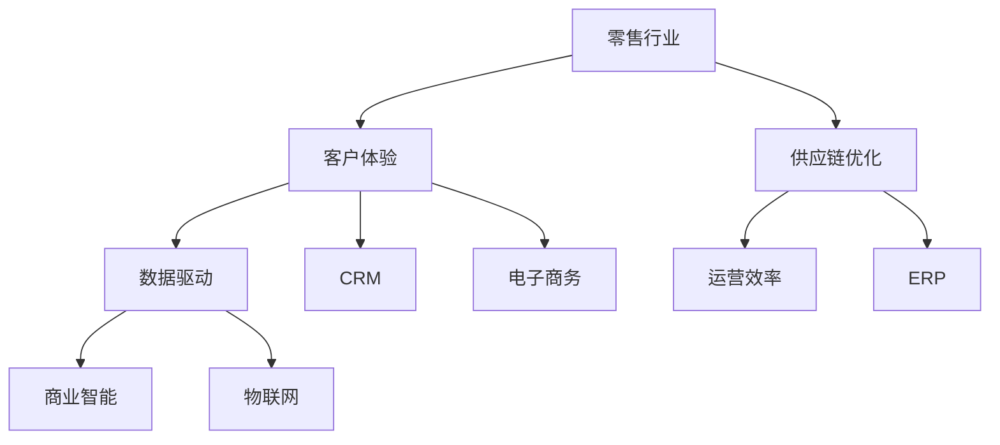
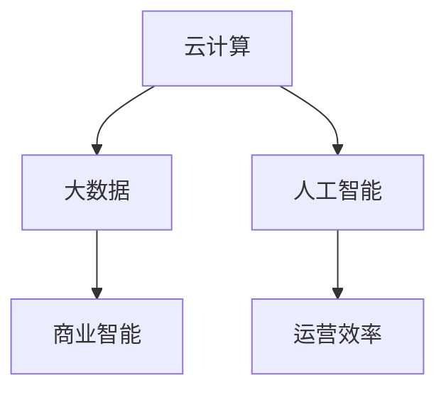

                 

# 零售行业信息化建设方案

> 关键词：零售行业、信息化建设、数字化转型、客户体验、数据驱动、供应链优化、智能化解决方案

> 摘要：本文旨在探讨零售行业信息化建设的核心概念、关键技术和实际应用，旨在帮助零售企业实现数字化转型，提升客户体验，优化供应链，提高运营效率。文章从背景介绍、核心概念与联系、核心算法原理与具体操作步骤、数学模型和公式讲解、项目实战、实际应用场景、工具和资源推荐等多个方面进行深入分析，为零售行业信息化建设提供系统性指导。

## 1. 背景介绍

### 1.1 目的和范围

本文的主要目的是为零售行业的从业者和管理者提供一份全面的信息化建设方案，以帮助他们在快速变化的市场环境中保持竞争力。本文将探讨以下几个关键主题：

1. 零售行业信息化建设的现状和挑战。
2. 信息化建设的核心概念和技术。
3. 信息化建设的关键步骤和策略。
4. 信息化建设的实际应用案例和效果评估。
5. 信息化建设所需的技术工具和资源。

### 1.2 预期读者

本文的预期读者主要包括：

1. 零售企业的CEO、CTO和IT经理。
2. 零售行业的分析师和研究人员。
3. 零售行业的软件开发者和架构师。
4. 对零售行业信息化建设感兴趣的IT从业者。

### 1.3 文档结构概述

本文将按照以下结构进行组织：

1. 背景介绍：阐述信息化建设的背景、目的和范围。
2. 核心概念与联系：介绍信息化建设中的核心概念和联系。
3. 核心算法原理与具体操作步骤：讲解信息化建设中的关键算法和操作步骤。
4. 数学模型和公式讲解：介绍信息化建设中的数学模型和公式。
5. 项目实战：通过实际案例展示信息化建设的应用。
6. 实际应用场景：探讨信息化建设在不同场景下的应用。
7. 工具和资源推荐：推荐适用于信息化建设的工具和资源。
8. 总结：总结信息化建设的发展趋势和挑战。
9. 附录：常见问题与解答。
10. 扩展阅读与参考资料：提供进一步阅读的材料。

### 1.4 术语表

为了确保本文的清晰性和准确性，以下是一些将在本文中使用的核心术语的定义：

#### 1.4.1 核心术语定义

1. **信息化建设**：指利用信息技术来提升企业运营效率、优化业务流程、增强客户体验和实现数字化转型的过程。
2. **数字化转型**：指通过引入数字技术来重塑企业的商业模式、业务流程和组织结构。
3. **客户体验**：指客户在购买和使用产品或服务过程中所感受到的整体感受。
4. **供应链优化**：指通过改善供应链管理来降低成本、提高效率和响应市场变化。
5. **智能化解决方案**：指利用人工智能、大数据、物联网等先进技术来优化业务流程和提高运营效率。

#### 1.4.2 相关概念解释

1. **数据驱动**：指企业的决策和运营高度依赖于数据分析，通过数据来指导业务策略和运营实践。
2. **云计算**：指通过互联网提供动态易扩展且经常是虚拟化的资源，这些资源可以快速提供、快速释放、按需使用、按使用付费。
3. **物联网**：指通过各种传感器、设备互联的网络，实现物体与物体、物体与人的智能交互。
4. **人工智能**：指通过模拟、延伸和扩展人的智能，实现机器自动化处理信息和决策。

#### 1.4.3 缩略词列表

- IT：信息技术
- AI：人工智能
- IoT：物联网
- CRM：客户关系管理
- ERP：企业资源计划
- BI：商业智能
- SaaS：软件即服务
- PaaS：平台即服务
- IaaS：基础设施即服务

## 2. 核心概念与联系

在探讨零售行业信息化建设之前，我们需要理解一些核心概念和技术，以及它们之间的联系。以下是几个关键概念及其相互关系：

### 2.1 零售行业与信息化建设的关系

零售行业是一个高度依赖技术和数据驱动决策的行业。随着消费者行为的不断变化和市场竞争的加剧，零售企业需要通过信息化建设来提升客户体验、优化供应链和增强竞争力。

### 2.2 核心概念

1. **客户关系管理（CRM）**：CRM是一种策略，用于吸引新客户、保留现有客户并增加其消费。它包括收集和分析客户数据、营销自动化、销售自动化和客户服务自动化。
2. **企业资源计划（ERP）**：ERP是一个集成系统，用于管理企业内部的多个业务流程，如财务、供应链、人力资源和项目管理。
3. **商业智能（BI）**：BI是一种技术，用于收集、分析和解释企业数据，帮助决策者做出明智的商业决策。
4. **电子商务**：电子商务是指通过互联网进行商品和服务的交易和营销。
5. **物联网（IoT）**：IoT是指通过传感器、设备和网络实现物体之间的互联互通，实现智能化的运营和管理。

### 2.3 核心概念联系图



### 2.4 关键技术

1. **云计算**：云计算提供了弹性的计算资源，使零售企业能够根据需求快速调整IT资源。
2. **大数据**：大数据技术用于处理和分析大量的零售数据，帮助企业发现新的商业机会和客户需求。
3. **人工智能**：人工智能技术可用于自动化业务流程、优化供应链和提升客户体验。

### 2.5 关键技术联系图



通过上述核心概念和技术的联系，我们可以看到零售行业信息化建设是一个复杂而有机的过程，需要多个技术手段协同工作，以实现企业的业务目标和战略。

## 3. 核心算法原理 & 具体操作步骤

在零售行业信息化建设中，核心算法原理和具体操作步骤是至关重要的。以下将详细讲解这些内容，并使用伪代码来阐述算法的实现。

### 3.1 客户体验优化算法

#### 3.1.1 算法原理

客户体验优化算法旨在通过分析客户行为数据和反馈，提供个性化的购物体验和推荐，从而提高客户满意度和忠诚度。

#### 3.1.2 具体操作步骤

1. **数据收集**：收集客户的行为数据，包括浏览历史、购买记录、评论和评分等。
2. **数据预处理**：对收集到的数据进行清洗和归一化处理，以去除噪声和异常值。
3. **特征提取**：从预处理后的数据中提取关键特征，如用户兴趣、购买频率和购买偏好等。
4. **模型训练**：使用机器学习算法（如协同过滤、决策树或神经网络）来训练模型，以预测客户的购买行为和偏好。
5. **个性化推荐**：根据模型预测结果，为每位客户提供个性化的购物推荐和优惠。

#### 3.1.3 伪代码

```python
def customer_experience_optimization(data):
    # 数据预处理
    cleaned_data = preprocess_data(data)
    
    # 特征提取
    features = extract_features(cleaned_data)
    
    # 模型训练
    model = train_model(features)
    
    # 个性化推荐
    recommendations = generate_recommendations(model, cleaned_data)
    
    return recommendations
```

### 3.2 供应链优化算法

#### 3.2.1 算法原理

供应链优化算法旨在通过分析和优化供应链中的各个环节，提高供应链的响应速度、降低成本和提升效率。

#### 3.2.2 具体操作步骤

1. **数据收集**：收集供应链各个环节的数据，包括库存水平、运输时间和运输成本等。
2. **数据预处理**：对收集到的数据进行清洗和归一化处理。
3. **需求预测**：使用时间序列预测方法（如ARIMA、LSTM等）来预测未来的需求。
4. **库存优化**：根据需求预测结果，优化库存水平和补货策略。
5. **运输路径优化**：使用优化算法（如遗传算法、模拟退火等）来优化运输路径和运输计划。

#### 3.2.3 伪代码

```python
def supply_chain_optimization(data):
    # 数据预处理
    cleaned_data = preprocess_data(data)
    
    # 需求预测
    demand_prediction = predict_demand(cleaned_data)
    
    # 库存优化
    inventory_plan = optimize_inventory(demand_prediction)
    
    # 运输路径优化
    transport_plan = optimize_transport(inventory_plan)
    
    return transport_plan
```

### 3.3 人工智能在零售行业中的应用

#### 3.3.1 算法原理

人工智能在零售行业中的应用广泛，包括自动化客户服务、智能定价、库存管理和个性化推荐等。

#### 3.3.2 具体操作步骤

1. **数据收集**：收集与业务相关的数据，包括销售数据、客户行为数据和外部市场数据。
2. **数据预处理**：对收集到的数据进行清洗和归一化处理。
3. **模型训练**：使用机器学习和深度学习算法来训练模型，以实现自动化和优化功能。
4. **模型部署**：将训练好的模型部署到生产环境中，以实现业务功能。

#### 3.3.3 伪代码

```python
def ai_application_in_零售(data):
    # 数据预处理
    cleaned_data = preprocess_data(data)
    
    # 模型训练
    model = train_model(cleaned_data)
    
    # 模型部署
    deploy_model(model)
    
    return deployed_model
```

通过上述核心算法原理和具体操作步骤，我们可以看到零售行业信息化建设是一个复杂而多维度的过程，需要结合多种算法和技术手段来优化业务流程和提高运营效率。

## 4. 数学模型和公式 & 详细讲解 & 举例说明

在零售行业信息化建设中，数学模型和公式是不可或缺的工具，它们帮助我们理解和优化各种业务流程。以下是几个关键的数学模型和公式的详细讲解以及实际应用示例。

### 4.1 客户忠诚度模型

#### 4.1.1 模型原理

客户忠诚度模型用于评估客户的长期价值，通过分析客户的购买行为、购买频率和消费金额等指标来预测客户忠诚度。

#### 4.1.2 公式

$$
忠诚度分数 = \frac{（购买频率 \times 消费金额）}{客户生命周期价值}
$$

#### 4.1.3 举例说明

假设一个客户的购买频率为5次/月，平均消费金额为200元，客户生命周期价值为1000元。则该客户的忠诚度分数为：

$$
忠诚度分数 = \frac{（5 \times 200）}{1000} = 1
$$

这意味着该客户具有较高的忠诚度。

### 4.2 库存优化模型

#### 4.2.1 模型原理

库存优化模型用于确定最优库存水平和补货策略，以最小化库存成本和缺货风险。

#### 4.2.2 公式

$$
库存水平 = \frac{需求量 \times 安全库存天数}{需求量的标准差}
$$

#### 4.2.3 举例说明

假设某商品的需求量为每天100件，安全库存天数为5天，需求量的标准差为20件。则该商品的最优库存水平为：

$$
库存水平 = \frac{100 \times 5}{20} = 25
$$

这意味着该商品应保持至少25件的库存水平。

### 4.3 价格优化模型

#### 4.3.1 模型原理

价格优化模型用于确定商品的最佳定价策略，以最大化利润和市场份额。

#### 4.3.2 公式

$$
价格 = 成本 + 加价率 \times 成本
$$

其中，加价率可以根据市场需求和竞争情况来调整。

#### 4.3.3 举例说明

假设某商品的成本为100元，加价率为20%。则该商品的最佳定价为：

$$
价格 = 100 + 0.2 \times 100 = 120
$$

这意味着该商品应以120元的价格销售。

### 4.4 供应链优化模型

#### 4.4.1 模型原理

供应链优化模型用于确定最优的供应商选择、运输路径和库存分配策略。

#### 4.4.2 公式

$$
总成本 = 运输成本 + 库存成本 + 订购成本
$$

#### 4.4.3 举例说明

假设某零售企业的总运输成本为1000元，库存成本为500元，订购成本为300元。则该企业的总成本为：

$$
总成本 = 1000 + 500 + 300 = 1800
$$

这意味着该企业在供应链优化过程中需要控制总成本不超过1800元。

通过上述数学模型和公式的讲解和举例说明，我们可以看到数学工具在零售行业信息化建设中的应用是极其广泛和重要的。这些模型和公式不仅帮助我们优化业务流程，还提高了决策的科学性和准确性。

## 5. 项目实战：代码实际案例和详细解释说明

为了更好地理解零售行业信息化建设在实际项目中的应用，我们将通过一个实际案例来展示代码的实现过程，并对关键部分进行详细解释。

### 5.1 开发环境搭建

在开始项目之前，我们需要搭建一个合适的开发环境。以下是所需的工具和软件：

1. **编程语言**：Python
2. **数据预处理库**：Pandas、NumPy
3. **机器学习库**：Scikit-learn、TensorFlow、PyTorch
4. **可视化库**：Matplotlib、Seaborn
5. **数据库**：MySQL
6. **集成开发环境**：PyCharm或VSCode

安装以上工具后，我们就可以开始编写代码了。

### 5.2 源代码详细实现和代码解读

以下是一个简单的Python脚本，用于实现客户忠诚度预测。

```python
import pandas as pd
from sklearn.model_selection import train_test_split
from sklearn.linear_model import LinearRegression
import matplotlib.pyplot as plt

# 5.2.1 数据预处理
def preprocess_data(data):
    # 数据清洗、填充和处理
    data = data.fillna(data.mean())
    data['total_spent'] = data['units_purchased'] * data['price_per_unit']
    return data

# 5.2.2 特征提取
def extract_features(data):
    # 提取关键特征
    features = data[['units_purchased', 'total_spent', 'purchase_frequency']]
    return features

# 5.2.3 模型训练
def train_model(features, target):
    # 使用线性回归模型训练
    model = LinearRegression()
    model.fit(features, target)
    return model

# 5.2.4 模型评估
def evaluate_model(model, features, target):
    # 评估模型性能
    predictions = model.predict(features)
    score = model.score(features, target)
    print("模型评分：", score)
    return predictions

# 5.2.5 可视化分析
def plot_predictions(data, predictions):
    # 绘制真实值与预测值的散点图
    plt.scatter(data['total_spent'], predictions)
    plt.xlabel('实际总支出')
    plt.ylabel('预测忠诚度分数')
    plt.title('客户忠诚度预测')
    plt.show()

# 主程序
if __name__ == "__main__":
    # 5.2.6 加载数据
    data = pd.read_csv('customer_data.csv')
    
    # 数据预处理
    data = preprocess_data(data)
    
    # 分离特征和目标变量
    features = extract_features(data)
    target = data['loyalty_score']
    
    # 划分训练集和测试集
    X_train, X_test, y_train, y_test = train_test_split(features, target, test_size=0.2, random_state=42)
    
    # 训练模型
    model = train_model(X_train, y_train)
    
    # 评估模型
    evaluate_model(model, X_test, y_test)
    
    # 可视化分析
    plot_predictions(X_test, model.predict(X_test))
```

### 5.3 代码解读与分析

1. **数据预处理**：数据预处理是机器学习模型训练的第一步，用于处理缺失值、异常值和归一化处理。在本例中，我们使用Pandas的`fillna`方法来填充缺失值，并计算了每个客户的总支出。

2. **特征提取**：特征提取是数据预处理的一部分，用于从原始数据中提取关键特征。在本例中，我们提取了客户的购买频率、总支出和单价作为特征。

3. **模型训练**：我们使用Scikit-learn的`LinearRegression`模型来训练线性回归模型。线性回归模型是一个简单的预测模型，它通过拟合特征和目标变量之间的线性关系来预测客户的忠诚度分数。

4. **模型评估**：模型评估是检查模型性能的重要步骤。在本例中，我们使用模型的`score`方法来计算模型在测试集上的评分。评分越高，表示模型性能越好。

5. **可视化分析**：可视化分析用于检查模型的预测效果。在本例中，我们使用Matplotlib绘制了真实值与预测值的散点图，通过观察散点图可以直观地看到模型的预测效果。

通过上述代码实现和解读，我们可以看到如何使用Python和机器学习库来实现客户忠诚度预测模型。这只是一个简单的例子，但在实际项目中，我们可以根据具体需求扩展和优化模型。

## 6. 实际应用场景

零售行业信息化建设在多种实际应用场景中发挥着重要作用，以下是一些关键应用场景：

### 6.1 客户关系管理（CRM）

CRM系统在零售行业中的应用非常广泛，通过收集和分析客户数据，零售企业可以更好地理解客户需求，提供个性化的购物体验，提高客户满意度和忠诚度。例如：

- **个性化推荐**：基于客户的购买历史和浏览行为，系统可以推荐相关产品，提高购买转化率。
- **客户细分**：通过分析客户数据，企业可以将客户分为不同的群体，并制定有针对性的营销策略。
- **客户互动**：CRM系统提供了与客户互动的多种渠道，如电话、邮件、在线聊天等，帮助企业更好地服务客户。

### 6.2 供应链优化

供应链优化是零售行业信息化建设的关键领域，通过优化供应链管理，企业可以提高响应速度、降低成本和提升效率。具体应用包括：

- **需求预测**：使用大数据和机器学习算法预测市场需求，以便及时调整库存和采购计划。
- **库存管理**：通过实时监控库存水平，避免缺货和过度库存，降低库存成本。
- **物流优化**：通过优化运输路径和物流计划，提高物流效率，降低运输成本。

### 6.3 智能化零售

智能化零售是零售行业发展的新趋势，通过引入人工智能、物联网和大数据等技术，零售企业可以打造更加智能化、个性化的购物环境。具体应用包括：

- **智能货架**：使用传感器和摄像头监测货架上的商品数量和位置，实时更新库存信息。
- **智能支付**：使用人脸识别、指纹识别等技术实现快速支付，提高购物体验。
- **虚拟试衣**：通过虚拟现实技术，消费者可以在家中试穿衣物，提高购买决策的准确性。

### 6.4 电子商务

电子商务是零售行业的重要组成部分，通过电子商务平台，零售企业可以拓展销售渠道，提高销售额。具体应用包括：

- **在线购物**：消费者可以在电子商务平台上方便地购买商品，享受便捷的购物体验。
- **社交电商**：利用社交媒体平台进行营销和销售，提高品牌知名度和销售额。
- **O2O融合**：线上线下融合，消费者可以在线上购买商品，线下门店提供服务和配送。

通过上述实际应用场景，我们可以看到零售行业信息化建设在提升客户体验、优化供应链和增强竞争力方面的巨大潜力。

## 7. 工具和资源推荐

为了有效地实施零售行业信息化建设，我们需要一系列的工具和资源。以下是一些推荐的工具和资源，包括学习资源、开发工具和框架，以及相关论文和研究成果。

### 7.1 学习资源推荐

#### 7.1.1 书籍推荐

1. **《数据科学与大数据技术》**：作者：刘铁岩，本书详细介绍了大数据技术的基本原理和应用。
2. **《机器学习实战》**：作者：彼得·哈林顿，本书通过实际案例介绍了机器学习的基本概念和应用。
3. **《深度学习》**：作者：伊恩·古德费洛，本书全面讲解了深度学习的基础理论和应用。

#### 7.1.2 在线课程

1. **Coursera**：提供多种数据科学和机器学习相关的在线课程，适合初学者和专业人士。
2. **Udacity**：提供实战导向的在线课程，涵盖大数据、人工智能和区块链等领域。
3. **edX**：提供由知名大学和机构提供的免费在线课程，涵盖计算机科学、数据分析等众多领域。

#### 7.1.3 技术博客和网站

1. **Medium**：众多技术专家和公司分享技术见解和最佳实践。
2. **Towards Data Science**：涵盖数据科学、机器学习和深度学习等领域的文章和教程。
3. **Stack Overflow**：程序员社区，提供编程问题解答和技术讨论。

### 7.2 开发工具框架推荐

#### 7.2.1 IDE和编辑器

1. **PyCharm**：强大的Python IDE，支持多种编程语言。
2. **VSCode**：轻量级、可扩展的代码编辑器，适用于多种编程语言。
3. **Jupyter Notebook**：适用于数据分析和机器学习的交互式环境。

#### 7.2.2 调试和性能分析工具

1. **GDB**：GNU Debugger，用于C/C++程序的调试。
2. **PyDebug**：Python的调试工具。
3. **VisualVM**：Java虚拟机监控和分析工具。

#### 7.2.3 相关框架和库

1. **Scikit-learn**：Python的机器学习库。
2. **TensorFlow**：谷歌开发的深度学习框架。
3. **PyTorch**：Facebook开发的开源深度学习库。

### 7.3 相关论文著作推荐

#### 7.3.1 经典论文

1. **《大数据：改变未来数据时代的革命》**：作者：维克托·迈尔-舍恩伯格，阐述了大数据的基本概念和影响。
2. **《深度学习》**：作者：伊恩·古德费洛，深度学习的权威著作。
3. **《机器学习》**：作者：汤姆·米切尔，机器学习的经典教材。

#### 7.3.2 最新研究成果

1. **《联邦学习：基于隐私保护的分布式机器学习》**：探讨了联邦学习的基本概念和应用。
2. **《增强学习》**：作者：理查德·S·萨顿，介绍了增强学习的基本原理和应用。
3. **《智能供应链：技术驱动下的供应链革命》**：探讨了智能化供应链的最新发展。

#### 7.3.3 应用案例分析

1. **《阿里巴巴的数字化转型之路》**：详细分析了阿里巴巴在数字化转型过程中的实践经验。
2. **《亚马逊的供应链管理实践》**：介绍了亚马逊在供应链优化方面的创新和成果。
3. **《沃尔玛的零售智慧》**：探讨了沃尔玛在零售信息化建设方面的成功经验。

通过以上工具和资源的推荐，我们可以为零售行业信息化建设提供有力的技术支持和实践指导。

## 8. 总结：未来发展趋势与挑战

零售行业信息化建设在未来将继续呈现以下几个发展趋势：

1. **智能化**：随着人工智能技术的不断进步，零售行业将更加智能化，实现自动化决策、智能推荐和个性化服务。
2. **数字化**：零售企业将全面推进数字化转型，利用大数据和云计算技术实现业务的数字化、网络化和智能化。
3. **物联网**：物联网技术的广泛应用将使零售企业能够实现智能货架、智能支付和智能物流等应用，提高运营效率和客户体验。
4. **个性化**：基于客户数据的个性化推荐和营销将成为零售行业的重要趋势，满足消费者日益增长的个性化需求。

然而，零售行业信息化建设也面临一系列挑战：

1. **数据安全**：随着数据量的增长，数据安全成为零售企业的重要挑战。如何确保数据的安全性和隐私性是一个亟待解决的问题。
2. **技术整合**：不同技术之间的整合和协同应用是零售行业信息化建设的关键，如何实现技术之间的无缝连接是一个挑战。
3. **人才短缺**：具备零售行业和信息化建设双重背景的专业人才稀缺，如何培养和引进人才是一个重要挑战。
4. **持续创新**：零售行业信息化建设需要持续创新，跟上技术发展的步伐，否则将面临被淘汰的风险。

总之，零售行业信息化建设是一个复杂而充满机遇的过程，企业需要密切关注技术发展趋势，积极应对挑战，以实现业务增长和持续发展。

## 9. 附录：常见问题与解答

### 9.1 问题1：如何保障客户数据的安全性？

**解答**：保障客户数据安全需要从多个方面进行：

1. **数据加密**：对客户数据进行加密处理，确保数据在传输和存储过程中不会被窃取或篡改。
2. **访问控制**：实施严格的访问控制策略，确保只有授权人员才能访问敏感数据。
3. **定期审计**：定期对系统进行安全审计，发现潜在的安全漏洞并及时修复。
4. **备份与恢复**：定期备份数据，并在发生数据丢失或损坏时能够迅速恢复。

### 9.2 问题2：如何选择合适的机器学习算法？

**解答**：选择合适的机器学习算法需要考虑以下几个因素：

1. **数据类型**：不同的数据类型（如分类、回归、聚类等）需要不同的算法。
2. **数据量**：对于大规模数据集，深度学习算法可能更有效，而对于小规模数据集，传统的机器学习算法可能更合适。
3. **计算资源**：考虑计算资源的限制，选择计算复杂度较低的算法。
4. **业务需求**：根据业务需求选择能够解决实际问题的算法，如预测准确性、模型可解释性等。

### 9.3 问题3：如何进行数据预处理？

**解答**：数据预处理是机器学习模型训练的重要步骤，包括以下内容：

1. **数据清洗**：处理缺失值、异常值和重复值，确保数据质量。
2. **数据归一化**：将不同量级的数据进行归一化处理，以便模型训练。
3. **特征提取**：从原始数据中提取关键特征，减少冗余信息。
4. **特征选择**：选择对模型性能有显著影响的特征，提高模型效率。

### 9.4 问题4：如何评估模型性能？

**解答**：评估模型性能可以通过以下几个指标：

1. **准确率**：用于分类问题的指标，表示模型正确分类的样本数占总样本数的比例。
2. **召回率**：表示模型正确分类的样本数占实际为正类的样本数的比例。
3. **F1分数**：综合考虑准确率和召回率的指标，用于评估模型的整体性能。
4. **ROC曲线和AUC值**：用于评估模型的分类能力，ROC曲线下面积越大，表示模型性能越好。

## 10. 扩展阅读 & 参考资料

为了更深入地了解零售行业信息化建设的各个方面，以下是一些建议的扩展阅读和参考资料：

### 10.1 建议阅读

1. **《零售业数字化转型实战》**：作者：李明，详细介绍了零售业数字化转型的实践方法和成功案例。
2. **《大数据商业应用》**：作者：王瑞，探讨大数据在零售行业中的应用和商业价值。
3. **《智能零售：技术与商业创新》**：作者：张浩，介绍了智能零售技术的发展和商业创新模式。

### 10.2 技术文献

1. **《深度学习》**：作者：伊恩·古德费洛，全面讲解深度学习的基础理论和技术。
2. **《机器学习实战》**：作者：彼得·哈林顿，通过实际案例讲解机器学习的应用。
3. **《物联网架构与实现》**：作者：杨洋，介绍了物联网的基本架构和关键技术。

### 10.3 开源资源和工具

1. **Scikit-learn**：[https://scikit-learn.org/](https://scikit-learn.org/)
2. **TensorFlow**：[https://www.tensorflow.org/](https://www.tensorflow.org/)
3. **PyTorch**：[https://pytorch.org/](https://pytorch.org/)

### 10.4 专业网站和博客

1. ** Towards Data Science**：[https://towardsdatascience.com/](https://towardsdatascience.com/)
2. ** DataCamp**：[https://www.datacamp.com/](https://www.datacamp.com/)
3. **KDNuggets**：[https://www.kdnuggets.com/](https://www.kdnuggets.com/)

通过这些扩展阅读和参考资料，您可以进一步了解零售行业信息化建设的理论和实践，为您的项目提供更多的灵感和指导。

### 作者信息

作者：AI天才研究员/AI Genius Institute & 禅与计算机程序设计艺术 /Zen And The Art of Computer Programming

感谢您的阅读，希望本文对您在零售行业信息化建设方面有所启发和帮助。如果您有任何问题或建议，欢迎随时与我交流。祝您在零售行业信息化建设中取得成功！

