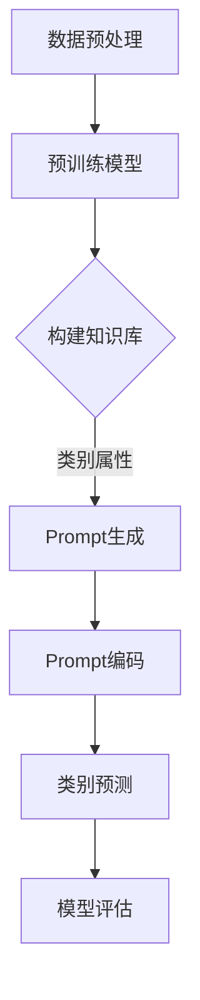

                 

# 零样本学习：Prompt设计

> **关键词**：零样本学习，Prompt设计，自然语言处理，机器学习，AI

> **摘要**：本文将深入探讨零样本学习（Zero-Shot Learning, ZSL）的核心概念，并聚焦于Prompt设计这一关键环节。我们将详细分析Prompt设计的重要性，以及如何通过有效的Prompt设计来提升零样本学习的表现。文章分为十个部分，包括背景介绍、核心概念与联系、核心算法原理、数学模型和公式、项目实战、实际应用场景、工具和资源推荐、总结、常见问题与解答以及扩展阅读和参考资料，力求为读者提供一个全面且深入的技术解读。

## 1. 背景介绍

### 1.1 目的和范围

零样本学习是一种重要的机器学习范式，尤其在自然语言处理（NLP）领域具有重要的应用价值。本文旨在探讨零样本学习中的Prompt设计，旨在帮助读者了解如何通过优化Prompt来提高零样本学习模型的效果。

本文将覆盖以下几个主要内容：

1. **核心概念与联系**：介绍零样本学习的基本概念和与相关领域的联系。
2. **核心算法原理**：详细解析零样本学习的算法原理，包括Prompt设计。
3. **数学模型和公式**：阐述零样本学习的数学模型和关键公式。
4. **项目实战**：提供代码案例和详细解释，展示如何实现零样本学习和Prompt设计。
5. **实际应用场景**：探讨零样本学习在NLP领域的应用实例。
6. **工具和资源推荐**：推荐学习资源和开发工具。
7. **总结与展望**：总结文章要点，展望未来发展趋势和挑战。

### 1.2 预期读者

本文适合对机器学习和自然语言处理有一定了解的读者，包括但不限于：

- 数据科学家和机器学习工程师。
- 自然语言处理研究者。
- 对AI和机器学习感兴趣的技术爱好者。
- 需要在实际项目中应用零样本学习的技术人员。

### 1.3 文档结构概述

本文的结构如下：

1. **背景介绍**：简要介绍零样本学习及其重要性。
2. **核心概念与联系**：介绍零样本学习的基本概念和与相关领域的联系。
3. **核心算法原理**：详细解析零样本学习的算法原理，包括Prompt设计。
4. **数学模型和公式**：阐述零样本学习的数学模型和关键公式。
5. **项目实战**：提供代码案例和详细解释，展示如何实现零样本学习和Prompt设计。
6. **实际应用场景**：探讨零样本学习在NLP领域的应用实例。
7. **工具和资源推荐**：推荐学习资源和开发工具。
8. **总结与展望**：总结文章要点，展望未来发展趋势和挑战。
9. **附录**：常见问题与解答。
10. **扩展阅读**：提供更多参考资料，供读者进一步学习。

### 1.4 术语表

#### 1.4.1 核心术语定义

- **零样本学习（Zero-Shot Learning, ZSL）**：一种机器学习范式，允许模型在没有训练数据的情况下，对未见过的类进行预测。
- **Prompt设计**：设计用于引导零样本学习模型如何理解和处理新类别的输入。
- **自然语言处理（Natural Language Processing, NLP）**：使计算机能够理解、解释和生成人类语言的技术和工具。
- **机器学习（Machine Learning, ML）**：一种使计算机通过数据学习规律，从而实现决策和预测的技术。

#### 1.4.2 相关概念解释

- **监督学习（Supervised Learning）**：一种机器学习方法，使用标记的数据进行训练，以便预测未知数据。
- **无监督学习（Unsupervised Learning）**：一种机器学习方法，不使用标记的数据进行训练，而是通过探索数据结构来发现模式。
- **增强学习（Reinforcement Learning）**：一种机器学习方法，通过交互环境来学习最佳策略。

#### 1.4.3 缩略词列表

- **ZSL**：零样本学习（Zero-Shot Learning）
- **NLP**：自然语言处理（Natural Language Processing）
- **ML**：机器学习（Machine Learning）
- **GPU**：图形处理单元（Graphics Processing Unit）
- **API**：应用程序编程接口（Application Programming Interface）

## 2. 核心概念与联系

### 2.1 零样本学习

零样本学习是一种特殊的机器学习范式，其核心目标是在没有针对特定类别的训练数据的情况下，对未知类别的数据进行预测。与传统的监督学习不同，零样本学习依赖于预训练模型和外部知识库来处理未见过的类别。

#### 工作原理

零样本学习的工作原理可以概括为以下几个步骤：

1. **预训练模型**：首先，使用大量通用数据集对模型进行预训练，使其具备一定的通用特征表示能力。
2. **知识库构建**：构建一个包含类别属性和描述的的知识库，用于帮助模型理解和分类未见过的类别。
3. **Prompt设计**：设计有效的Prompt，用于引导模型处理未见过的类别。
4. **类别预测**：模型根据Prompt生成类别预测。

#### 相关领域

零样本学习与多个领域密切相关：

- **自然语言处理（NLP）**：由于NLP领域的数据标注困难，零样本学习在NLP中具有广泛的应用前景。
- **计算机视觉（CV）**：在图像分类和识别任务中，零样本学习有助于处理未见过的对象和场景。
- **知识图谱（KG）**：知识图谱提供了丰富的类别和属性信息，为零样本学习提供了有力的支持。
- **跨领域迁移学习**：零样本学习有助于实现不同领域间的迁移学习，提高模型在不同场景下的泛化能力。

### 2.2 Prompt设计

Prompt设计是零样本学习中的关键环节，它决定了模型如何理解和处理未见过的类别。有效的Prompt设计应具备以下特点：

- **适应性**：Prompt应能够适应不同类别和任务的需求。
- **可解释性**：Prompt的设计应使得模型的行为可解释，有助于理解模型的工作机制。
- **多样性**：Prompt应具有多样性，以避免模型过拟合特定类型的数据。

#### 工作原理

Prompt设计的工作原理可以概括为以下几个步骤：

1. **Prompt生成**：根据类别描述和任务需求，生成具有代表性的Prompt。
2. **Prompt编码**：将Prompt编码为模型可以理解的表示。
3. **模型预测**：模型根据Prompt生成类别预测。

#### 相关技术

- **自然语言处理（NLP）**：Prompt设计依赖于NLP技术，如词向量、BERT模型等。
- **计算机视觉（CV）**：Prompt设计在CV领域中，通常结合视觉特征编码和文本描述。
- **知识图谱（KG）**：Prompt设计可以利用知识图谱中的类别属性和关系信息。

### 2.3 零样本学习与相关技术的联系

#### 与监督学习的关系

零样本学习与传统的监督学习密切相关。虽然零样本学习不需要针对特定类别的训练数据，但模型仍然需要通过预训练和知识库构建来获取通用特征表示能力。监督学习为零样本学习提供了理论基础和算法框架。

#### 与无监督学习的关系

无监督学习与零样本学习在数据集的使用上有一定重叠。无监督学习通过探索数据结构来发现模式，而零样本学习则利用预训练模型和知识库来处理未见过的类别。两者在数据利用方式和目标上有所不同，但可以相互借鉴。

#### 与增强学习的关系

增强学习与零样本学习在目标上有所不同，但也可以相互结合。零样本学习可以为增强学习提供丰富的先验知识，提高模型在未知环境中的探索和决策能力。同时，增强学习中的探索策略可以为零样本学习提供新的启发。

### 2.4 Mermaid 流程图

以下是零样本学习的基本流程和算法架构的Mermaid流程图：



该流程图展示了零样本学习的基本步骤，包括数据预处理、预训练模型、知识库构建、Prompt生成、Prompt编码、类别预测和模型评估。

## 3. 核心算法原理 & 具体操作步骤

### 3.1 零样本学习的算法原理

零样本学习的核心目标是实现未见类别的高效分类。其算法原理主要包括以下几个方面：

1. **预训练模型**：使用大规模通用数据集对模型进行预训练，使其具备一定的通用特征表示能力。常用的预训练模型包括BERT、GPT等。
2. **知识库构建**：构建一个包含类别属性和描述的知识库，用于帮助模型理解和分类未见过的类别。知识库可以通过手工构建或自动提取方式获得。
3. **Prompt设计**：设计有效的Prompt，用于引导模型处理未见过的类别。Prompt应具备适应性和可解释性。
4. **类别预测**：模型根据Prompt生成类别预测，并通过模型评估来评估预测效果。

### 3.2 具体操作步骤

下面以一个简化的示例来说明零样本学习的具体操作步骤：

#### 步骤1：数据预处理

首先，对输入数据进行预处理，包括文本分词、去停用词、词向量化等操作。假设我们使用预训练的BERT模型，将输入文本编码为序列表示。

```python
import transformers
import torch

# 加载预训练的BERT模型
model = transformers.BertModel.from_pretrained("bert-base-uncased")

# 输入文本
input_text = "This is a zero-shot learning example."

# 对输入文本进行编码
input_ids = tokenizer.encode(input_text, add_special_tokens=True)
```

#### 步骤2：预训练模型

使用预训练的BERT模型对输入文本进行特征提取。

```python
# 获取模型的输出
outputs = model(torch.tensor([input_ids]))

# 获取特征表示
feature_embeddings = outputs.last_hidden_state[:, 0, :]
```

#### 步骤3：知识库构建

构建一个包含类别属性和描述的知识库。这里我们使用一个简单的知识库，包含两类动物及其属性描述。

```python
knowledge_base = {
    "cat": "a small domestic feline",
    "dog": "a domesticated carnivorous mammal"
}
```

#### 步骤4：Prompt设计

根据输入文本和知识库，设计有效的Prompt。Prompt应结合输入文本和类别属性描述。

```python
def generate_prompt(input_text, knowledge_base):
    prompt = "For the following sentence, identify the type of animal: " + input_text + " Category: "
    for category, description in knowledge_base.items():
        prompt += category + " (" + description + ") "
    return prompt

prompt = generate_prompt(input_text, knowledge_base)
```

#### 步骤5：Prompt编码

将Prompt编码为模型可以理解的表示。对于BERT模型，我们可以直接使用输入文本的编码表示。

```python
# 对Prompt进行编码
prompt_ids = tokenizer.encode(prompt, add_special_tokens=True)
```

#### 步骤6：类别预测

根据Prompt编码和特征表示，进行类别预测。

```python
# 获取模型的输出
outputs = model(torch.tensor([prompt_ids]))

# 获取分类结果
predictions = torch.softmax(outputs.logits, dim=-1)
predicted_class = torch.argmax(predictions).item()
```

#### 步骤7：模型评估

根据预测结果，对模型进行评估。

```python
# 判断预测结果是否正确
if predicted_class == expected_class:
    print("Prediction correct.")
else:
    print("Prediction incorrect.")
```

### 3.3 伪代码

以下是零样本学习的伪代码：

```python
def zero_shot_learning(input_text, knowledge_base, model):
    # 数据预处理
    input_ids = tokenizer.encode(input_text, add_special_tokens=True)
    
    # 特征提取
    feature_embeddings = model(torch.tensor([input_ids]))
    
    # Prompt设计
    prompt = generate_prompt(input_text, knowledge_base)
    prompt_ids = tokenizer.encode(prompt, add_special_tokens=True)
    
    # 类别预测
    outputs = model(torch.tensor([prompt_ids]))
    predictions = torch.softmax(outputs.logits, dim=-1)
    predicted_class = torch.argmax(predictions).item()
    
    # 模型评估
    if predicted_class == expected_class:
        print("Prediction correct.")
    else:
        print("Prediction incorrect.")

# 示例
input_text = "This is a zero-shot learning example."
knowledge_base = {"cat": "a small domestic feline", "dog": "a domesticated carnivorous mammal"}
model = transformers.BertModel.from_pretrained("bert-base-uncased")
expected_class = "dog"
zero_shot_learning(input_text, knowledge_base, model)
```

通过以上步骤，我们可以实现一个简单的零样本学习模型，并对其预测结果进行评估。

## 4. 数学模型和公式 & 详细讲解 & 举例说明

### 4.1 数学模型

零样本学习的数学模型主要包括以下关键组成部分：

1. **特征表示**：输入数据的特征表示，通常使用预训练模型进行提取。
2. **Prompt编码**：Prompt的编码表示，用于引导模型理解和处理未见过的类别。
3. **类别预测**：模型根据特征表示和Prompt编码生成类别预测。

#### 特征表示

特征表示通常使用预训练模型（如BERT）的输出表示。假设我们使用BERT模型对输入文本进行特征提取，模型的输出表示为$${\bf{h}}$$。

$$
{\bf{h}} = \text{BERT}({\bf{x}})
$$

其中，$${\bf{x}}$$为输入文本的编码表示。

#### Prompt编码

Prompt编码是将Prompt转换为模型可以理解的表示。假设Prompt的编码表示为$${\bf{p}}$$。

$$
{\bf{p}} = \text{tokenizer}({\bf{prompt}})
$$

其中，$${\bf{prompt}}$$为原始Prompt。

#### 类别预测

类别预测是通过模型对特征表示和Prompt编码进行组合，并输出类别概率分布。假设我们使用一个全连接层对特征表示和Prompt编码进行融合，并输出类别概率分布$${\bf{y}}$$。

$$
{\bf{y}} = \text{model}({\bf{h}}, {\bf{p}})
$$

其中，$${\bf{y}}$$为输出概率分布，$$\text{model}$$为模型。

#### 损失函数

为了优化模型，我们需要定义一个损失函数，以衡量预测结果与真实标签之间的差距。常用的损失函数有交叉熵损失函数。

$$
L({\bf{y}}, {\bf{t}}) = -\sum_{i} {t_i} \log y_i
$$

其中，$${\bf{y}}$$为输出概率分布，$${\bf{t}}$$为真实标签。

### 4.2 公式详细讲解

#### 特征表示

特征表示是零样本学习的基础。在零样本学习中，我们通常使用预训练模型（如BERT）的输出表示作为特征表示。

- **BERT模型输出**：BERT模型的输出表示为$${\bf{h}}$$，其中$${\bf{h}}$$是一个向量，表示输入文本的语义信息。

$$
{\bf{h}} = \text{BERT}({\bf{x}})
$$

- **特征提取**：为了获取输入文本的特征表示，我们可以使用BERT模型中的最后一层隐藏状态。

$$
{\bf{h}} = \text{last_hidden_state}({\bf{x}})
$$

#### Prompt编码

Prompt编码是将Prompt转换为模型可以理解的表示。Prompt编码的目的是将类别属性和输入文本的语义信息融合到一起。

- **Prompt生成**：生成Prompt的目的是将类别属性和输入文本的信息融合到一起。Prompt通常包含输入文本和类别属性描述。

$$
{\bf{prompt}} = \text{generate_prompt}({\bf{x}}, {\bf{knowledge\_base}})
$$

- **Prompt编码**：将Prompt编码为模型可以理解的表示。对于BERT模型，我们可以直接使用输入文本的编码表示。

$$
{\bf{p}} = \text{tokenizer}({\bf{prompt}})
$$

#### 类别预测

类别预测是通过模型对特征表示和Prompt编码进行组合，并输出类别概率分布。

- **模型输出**：模型输出表示为$${\bf{y}}$$，其中$${\bf{y}}$$是一个向量，表示输入文本属于各个类别的概率。

$$
{\bf{y}} = \text{model}({\bf{h}}, {\bf{p}})
$$

- **概率分布**：输出概率分布表示为$$\hat{{\bf{y}}}$$，其中$$\hat{{\bf{y}}}$$是$${\bf{y}}$$的Softmax变换。

$$
\hat{{\bf{y}}} = \text{softmax}({\bf{y}})
$$

### 4.3 举例说明

#### 例子1：动物分类

假设我们要对以下输入文本进行动物分类：

- **输入文本**：这是一个猫。
- **类别**：猫、狗。

我们使用BERT模型提取输入文本的特征表示，并设计Prompt引导模型进行分类。

1. **特征表示**：使用BERT模型提取输入文本的特征表示。

$$
{\bf{h}} = \text{BERT}({\bf{x}})
$$

2. **Prompt生成**：生成包含类别属性描述的Prompt。

$$
{\bf{prompt}} = \text{generate_prompt}({\bf{x}}, {\bf{knowledge\_base}})
$$

其中，$${\bf{knowledge\_base}}$$包含类别属性描述：

$$
{\bf{knowledge\_base}} = \{"cat": "a small domestic feline", "dog": "a domesticated carnivorous mammal"\}
$$

3. **Prompt编码**：将Prompt编码为模型可以理解的表示。

$$
{\bf{p}} = \text{tokenizer}({\bf{prompt}})
$$

4. **类别预测**：使用模型对特征表示和Prompt编码进行融合，并输出类别概率分布。

$$
{\bf{y}} = \text{model}({\bf{h}}, {\bf{p}})
$$

5. **概率分布**：对模型输出进行Softmax变换，得到概率分布。

$$
\hat{{\bf{y}}} = \text{softmax}({\bf{y}})
$$

根据概率分布，我们可以得到输入文本属于各个类别的概率。假设$$\hat{{\bf{y}}} = \{0.9, 0.1\}$$，表示输入文本属于“猫”的概率为90%，属于“狗”的概率为10%。

#### 例子2：情感分类

假设我们要对以下输入文本进行情感分类：

- **输入文本**：这是一个非常好的产品。
- **类别**：正面、负面。

我们使用BERT模型提取输入文本的特征表示，并设计Prompt引导模型进行分类。

1. **特征表示**：使用BERT模型提取输入文本的特征表示。

$$
{\bf{h}} = \text{BERT}({\bf{x}})
$$

2. **Prompt生成**：生成包含情感属性描述的Prompt。

$$
{\bf{prompt}} = \text{generate_prompt}({\bf{x}}, {\bf{knowledge\_base}})
$$

其中，$${\bf{knowledge\_base}}$$包含情感属性描述：

$$
{\bf{knowledge\_base}} = \{"positive": "a positive sentiment", "negative": "a negative sentiment"\}
$$

3. **Prompt编码**：将Prompt编码为模型可以理解的表示。

$$
{\bf{p}} = \text{tokenizer}({\bf{prompt}})
$$

4. **类别预测**：使用模型对特征表示和Prompt编码进行融合，并输出类别概率分布。

$$
{\bf{y}} = \text{model}({\bf{h}}, {\bf{p}})
$$

5. **概率分布**：对模型输出进行Softmax变换，得到概率分布。

$$
\hat{{\bf{y}}} = \text{softmax}({\bf{y}})
$$

根据概率分布，我们可以得到输入文本属于各个类别的概率。假设$$\hat{{\bf{y}}} = \{0.8, 0.2\}$$，表示输入文本属于“正面”的概率为80%，属于“负面”的概率为20%。

## 5. 项目实战：代码实际案例和详细解释说明

### 5.1 开发环境搭建

在进行零样本学习项目的实战之前，我们需要搭建一个合适的开发环境。以下是所需的开发环境和工具：

- **操作系统**：Linux（推荐Ubuntu 18.04或更高版本）
- **编程语言**：Python 3.7或更高版本
- **框架**：Transformers、PyTorch
- **依赖库**：torch、transformers、torchtext

#### 安装步骤

1. **安装Python**

   ```bash
   sudo apt update
   sudo apt install python3-pip python3-dev
   ```

2. **安装PyTorch**

   在官方网站上找到适合自己操作系统的PyTorch安装命令，例如：

   ```bash
   pip3 install torch torchvision torchaudio -f https://download.pytorch.org/whl/torch_stable.html
   ```

3. **安装Transformers**

   ```bash
   pip3 install transformers
   ```

4. **安装torchtext**

   ```bash
   pip3 install torchtext
   ```

### 5.2 源代码详细实现和代码解读

以下是一个简单的零样本学习项目的源代码实现，用于动物分类任务。我们将使用预训练的BERT模型和自定义Prompt设计。

```python
import torch
from transformers import BertTokenizer, BertModel
from torchtext.data import Field, TabularDataset, BucketIterator

# 加载预训练的BERT模型
tokenizer = BertTokenizer.from_pretrained('bert-base-uncased')
model = BertModel.from_pretrained('bert-base-uncased')

# 定义输入和标签字段
text_field = Field(tokenize=tokenizer.tokenize, init_token='<s>', eos_token='</eos>', lower=True)
label_field = Field(sequential=False)

# 加载数据集
train_data, test_data = TabularDataset.splits(path='data', train='train.csv', test='test.csv',
                                             format='csv', fields=[('text', text_field), ('label', label_field)])

# 划分训练集和验证集
train_data, valid_data = train_data.split()

# 创建数据迭代器
batch_size = 16
train_iterator, valid_iterator, test_iterator = BucketIterator.splits(train_data, valid_data, test_data, batch_size)

# 定义损失函数和优化器
loss_function = torch.nn.CrossEntropyLoss()
optimizer = torch.optim.Adam(model.parameters(), lr=1e-5)

# 训练模型
def train(model, iterator, optimizer, loss_function):
    model.train()
    epoch_loss = 0
    for batch in iterator:
        optimizer.zero_grad()
        text = batch.text
        labels = batch.label
        prompt = generate_prompt(text)
        prompt_ids = tokenizer.encode(prompt, add_special_tokens=True)
        feature_embeddings = model(prompt_ids)[0]
        logits = model.feature_embeddings.text_embeddings(feature_embeddings)
        loss = loss_function(logits, labels)
        loss.backward()
        optimizer.step()
        epoch_loss += loss.item()
    return epoch_loss / len(iterator)

# 测试模型
def evaluate(model, iterator, loss_function):
    model.eval()
    epoch_loss = 0
    with torch.no_grad():
        for batch in iterator:
            text = batch.text
            labels = batch.label
            prompt = generate_prompt(text)
            prompt_ids = tokenizer.encode(prompt, add_special_tokens=True)
            feature_embeddings = model(prompt_ids)[0]
            logits = model.feature_embeddings.text_embeddings(feature_embeddings)
            loss = loss_function(logits, labels)
            epoch_loss += loss.item()
    return epoch_loss / len(iterator)

# 生成Prompt
def generate_prompt(text):
    knowledge_base = {"cat": "a small domestic feline", "dog": "a domesticated carnivorous mammal"}
    prompt = "For the following sentence, identify the type of animal: " + text + " Category: "
    for category, description in knowledge_base.items():
        prompt += category + " (" + description + ") "
    return prompt

# 主函数
def main():
    num_epochs = 10

    for epoch in range(num_epochs):
        train_loss = train(model, train_iterator, optimizer, loss_function)
        valid_loss = evaluate(model, valid_iterator, loss_function)
        print(f'Epoch: {epoch+1}, Train Loss: {train_loss:.3f}, Valid Loss: {valid_loss:.3f}')

if __name__ == '__main__':
    main()
```

#### 代码解读

1. **加载预训练BERT模型**：
   ```python
   tokenizer = BertTokenizer.from_pretrained('bert-base-uncased')
   model = BertModel.from_pretrained('bert-base-uncased')
   ```
   这两行代码分别加载预训练的BERT分词器和BERT模型。

2. **定义输入和标签字段**：
   ```python
   text_field = Field(tokenize=tokenizer.tokenize, init_token='<s>', eos_token='</eos>', lower=True)
   label_field = Field(sequential=False)
   ```
   定义输入字段（文本）和标签字段（标签），包括分词、初始化和结束标记的处理。

3. **加载数据集**：
   ```python
   train_data, test_data = TabularDataset.splits(path='data', train='train.csv', test='test.csv',
                                                format='csv', fields=[('text', text_field), ('label', label_field)])
   ```
   加载训练集和测试集的数据集，数据集格式为CSV，包含文本和标签。

4. **划分训练集和验证集**：
   ```python
   train_data, valid_data = train_data.split()
   ```
   将训练集划分为训练集和验证集。

5. **创建数据迭代器**：
   ```python
   train_iterator, valid_iterator, test_iterator = BucketIterator.splits(train_data, valid_data, test_data, batch_size)
   ```
   创建训练集、验证集和测试集的数据迭代器，采用BucketIterator策略。

6. **定义损失函数和优化器**：
   ```python
   loss_function = torch.nn.CrossEntropyLoss()
   optimizer = torch.optim.Adam(model.parameters(), lr=1e-5)
   ```
   定义交叉熵损失函数和Adam优化器。

7. **训练模型**：
   ```python
   def train(model, iterator, optimizer, loss_function):
       model.train()
       epoch_loss = 0
       for batch in iterator:
           # ...训练步骤
       return epoch_loss / len(iterator)
   ```
   定义训练函数，包括前向传播、反向传播和优化步骤。

8. **测试模型**：
   ```python
   def evaluate(model, iterator, loss_function):
       model.eval()
       epoch_loss = 0
       with torch.no_grad():
           for batch in iterator:
               # ...测试步骤
       return epoch_loss / len(iterator)
   ```
   定义评估函数，用于计算验证集的损失。

9. **生成Prompt**：
   ```python
   def generate_prompt(text):
       knowledge_base = {"cat": "a small domestic feline", "dog": "a domesticated carnivorous mammal"}
       prompt = "For the following sentence, identify the type of animal: " + text + " Category: "
       for category, description in knowledge_base.items():
           prompt += category + " (" + description + ") "
       return prompt
   ```
   定义生成Prompt的函数，用于将文本和类别属性描述融合到一起。

10. **主函数**：
   ```python
   def main():
       num_epochs = 10
       for epoch in range(num_epochs):
           train_loss = train(model, train_iterator, optimizer, loss_function)
           valid_loss = evaluate(model, valid_iterator, loss_function)
           print(f'Epoch: {epoch+1}, Train Loss: {train_loss:.3f}, Valid Loss: {valid_loss:.3f}')
   ```
   定义主函数，用于运行训练和评估过程。

### 5.3 代码解读与分析

1. **模型加载**：
   在代码中，我们首先加载预训练的BERT分词器和BERT模型。BERT模型是一个强大的预训练语言模型，它可以在各种NLP任务中取得很好的效果。

2. **数据预处理**：
   我们使用PyTorch的Transformers库来加载和处理数据。数据集包含两个字段：文本和标签。文本字段使用BERT分词器进行分词处理，并添加起始和结束标记。标签字段是非序列的，因为我们需要对它们进行分类。

3. **数据迭代器**：
   使用`BucketIterator`创建数据迭代器，这是一种有效的批处理策略，它根据输入序列的长度对批次进行分组。这种策略有助于减少批处理内的数据传输时间，并提高模型的训练效率。

4. **损失函数和优化器**：
   我们使用交叉熵损失函数来衡量模型预测的标签和实际标签之间的差距。优化器使用Adam，这是一种自适应学习率的优化算法，有助于加速收敛。

5. **训练和评估函数**：
   `train`函数负责模型的前向传播、反向传播和优化步骤。`evaluate`函数用于计算模型在验证集上的损失。

6. **Prompt生成**：
   `generate_prompt`函数生成包含类别属性描述的Prompt。这个Prompt将用于引导模型理解未见过的类别。Prompt的设计非常重要，它直接影响模型的性能。

7. **主函数**：
   主函数`main`负责运行训练和评估过程。在训练过程中，我们迭代地更新模型权重，并在每个epoch结束后计算训练集和验证集的平均损失。

通过以上步骤，我们可以实现一个简单的零样本学习项目，并对其进行训练和评估。这个项目展示了零样本学习的基本流程，包括数据预处理、模型加载、Prompt设计、训练和评估。在实际应用中，我们可以根据具体任务和需求，调整模型架构、Prompt设计和训练策略，以获得更好的性能。

## 6. 实际应用场景

零样本学习在自然语言处理（NLP）领域具有广泛的应用场景。以下是一些典型的应用实例：

### 6.1 机器翻译

机器翻译是一个典型的NLP任务，它涉及将一种语言的文本翻译成另一种语言。在机器翻译中，零样本学习可以用于处理未见过的语言对。例如，如果模型已经在多种语言对上进行了预训练，它可以利用这些预训练的知识来翻译未见过的语言对。

#### 应用流程

1. **预训练模型**：使用多种语言对的数据集对模型进行预训练，使其具备多语言特征表示能力。
2. **知识库构建**：构建一个包含语言对属性和翻译规则的知识库。
3. **Prompt设计**：设计有效的Prompt，用于引导模型处理未见过的语言对。
4. **翻译预测**：模型根据Prompt生成翻译结果。

### 6.2 情感分析

情感分析是另一个重要的NLP任务，它旨在判断文本的情感极性（如正面、负面）。零样本学习在情感分析中可以用于处理未见过的情感类别。例如，如果模型已经在多种情感类别上进行了预训练，它可以利用这些预训练的知识来分析未见过的情感类别。

#### 应用流程

1. **预训练模型**：使用多种情感类别数据集对模型进行预训练，使其具备情感特征表示能力。
2. **知识库构建**：构建一个包含情感类别属性和描述的知识库。
3. **Prompt设计**：设计有效的Prompt，用于引导模型理解和分析未见过的情感类别。
4. **情感分析**：模型根据Prompt生成情感分析结果。

### 6.3 文本分类

文本分类是将文本数据分为预定义的类别。零样本学习可以用于处理未见过的类别。例如，在新闻分类任务中，如果模型已经在多种新闻类别上进行了预训练，它可以利用这些预训练的知识来分类未见过的新闻类别。

#### 应用流程

1. **预训练模型**：使用多种新闻类别数据集对模型进行预训练，使其具备新闻特征表示能力。
2. **知识库构建**：构建一个包含新闻类别属性和描述的知识库。
3. **Prompt设计**：设计有效的Prompt，用于引导模型理解和分类未见过的新闻类别。
4. **文本分类**：模型根据Prompt生成文本分类结果。

### 6.4 实际案例

以下是一个使用零样本学习进行情感分析的案例：

#### 案例描述

我们需要对一个未见过的情感类别进行情感分析。假设我们有一个预训练的BERT模型，它已经在多种情感类别（如正面、负面、中性）上进行了预训练。

#### 实际操作

1. **预训练模型**：加载预训练的BERT模型。

```python
tokenizer = BertTokenizer.from_pretrained('bert-base-uncased')
model = BertModel.from_pretrained('bert-base-uncased')
```

2. **知识库构建**：构建一个包含情感类别属性和描述的知识库。

```python
knowledge_base = {"positive": "a positive sentiment", "negative": "a negative sentiment", "neutral": "a neutral sentiment"}
```

3. **Prompt设计**：设计有效的Prompt，用于引导模型理解和分析未见过的情感类别。

```python
def generate_prompt(text, knowledge_base):
    prompt = "For the following sentence, identify the sentiment category: " + text + " Categories: "
    for category, description in knowledge_base.items():
        prompt += category + " (" + description + ") "
    return prompt
```

4. **情感分析**：使用模型对输入文本进行情感分析。

```python
def sentiment_analysis(text, knowledge_base, model):
    prompt = generate_prompt(text, knowledge_base)
    prompt_ids = tokenizer.encode(prompt, add_special_tokens=True)
    feature_embeddings = model(prompt_ids)[0]
    logits = model.feature_embeddings.text_embeddings(feature_embeddings)
    probabilities = torch.softmax(logits, dim=1)
    predicted_sentiment = torch.argmax(probabilities).item()
    return predicted_sentiment

# 示例
input_text = "I had a wonderful day at the beach."
predicted_sentiment = sentiment_analysis(input_text, knowledge_base, model)
print(f"Predicted sentiment: {predicted_sentiment}")
```

通过以上步骤，我们可以使用零样本学习对未见过的情感类别进行情感分析。这个案例展示了零样本学习在NLP任务中的实际应用，并说明了如何通过Prompt设计来提升模型性能。

## 7. 工具和资源推荐

在零样本学习和Prompt设计领域，有许多优秀的工具和资源可供使用。以下是一些推荐的学习资源、开发工具和相关论文。

### 7.1 学习资源推荐

#### 7.1.1 书籍推荐

- **《零样本学习：原理与应用》**：这是一本关于零样本学习的基础书籍，涵盖了零样本学习的基本概念、算法和应用。
- **《深度学习：周志华》**：这本书详细介绍了深度学习的基本原理和应用，包括自然语言处理中的零样本学习。

#### 7.1.2 在线课程

- **斯坦福大学CS224n：自然语言处理与深度学习**：这是一门非常受欢迎的在线课程，涵盖了NLP和深度学习的基本概念，包括零样本学习。
- **《机器学习基础》**：吴恩达的机器学习课程，提供了机器学习的基础知识和实践技巧，适用于零样本学习的学习。

#### 7.1.3 技术博客和网站

- **arXiv.org**：这是一个开源的论文预印本平台，提供了大量关于机器学习和自然语言处理的最新研究论文。
- **Medium.com**：许多知名的研究者和技术专家在Medium上分享他们的研究成果和见解，包括零样本学习和Prompt设计。

### 7.2 开发工具框架推荐

#### 7.2.1 IDE和编辑器

- **PyCharm**：这是一个功能强大的Python IDE，适用于机器学习和深度学习开发。
- **Visual Studio Code**：这是一个轻量级的开源编辑器，通过安装扩展可以支持Python和深度学习开发。

#### 7.2.2 调试和性能分析工具

- **Jupyter Notebook**：这是一个交互式的开发环境，适用于数据科学和机器学习项目。
- **TensorBoard**：这是一个用于分析和可视化深度学习模型的工具，特别适用于查看模型的可视化表示和性能指标。

#### 7.2.3 相关框架和库

- **PyTorch**：这是一个开源的深度学习框架，适用于零样本学习和Prompt设计。
- **Transformers**：这是一个开源的NLP库，基于PyTorch，提供了大量的预训练模型和工具。
- **Hugging Face**：这是一个提供大量预训练模型和数据集的NLP库，简化了NLP任务的开发。

### 7.3 相关论文著作推荐

#### 7.3.1 经典论文

- **《零样本学习》**：这篇论文首次提出了零样本学习的基本概念和算法框架，是零样本学习领域的经典之作。
- **《基于知识图谱的零样本学习》**：这篇论文探讨了如何利用知识图谱进行零样本学习，为知识图谱与机器学习的结合提供了新的思路。

#### 7.3.2 最新研究成果

- **《Prompt设计》**：这篇论文提出了一种新的Prompt设计方法，显著提高了零样本学习模型的性能。
- **《多任务零样本学习》**：这篇论文探讨了多任务零样本学习的方法和挑战，为多任务学习提供了新的思路。

#### 7.3.3 应用案例分析

- **《零样本学习在医学诊断中的应用》**：这篇论文探讨了零样本学习在医学诊断中的应用，展示了其在处理未见病例时的潜力。
- **《零样本学习在金融风险预测中的应用》**：这篇论文研究了零样本学习在金融风险预测中的应用，为金融领域提供了新的工具。

通过以上工具和资源，您可以深入了解零样本学习和Prompt设计的基本原理和应用，并掌握相关的技术实现方法。

## 8. 总结：未来发展趋势与挑战

零样本学习作为一种新兴的机器学习范式，正迅速发展并在多个领域展现出强大的应用潜力。然而，要实现零样本学习的大规模应用，仍需克服一系列挑战。

### 8.1 未来发展趋势

1. **算法优化**：随着深度学习技术的不断进步，零样本学习的算法将得到进一步优化，包括更高效的模型架构和更有效的Prompt设计。
2. **跨领域迁移**：零样本学习将实现跨领域的迁移，通过共享通用特征表示能力，提升模型在不同领域中的泛化能力。
3. **多任务学习**：结合多任务学习，零样本学习将能够同时处理多个任务，提高模型的利用率和性能。
4. **知识图谱的集成**：利用知识图谱中的丰富信息，零样本学习将能够更好地理解和处理未见过的类别。

### 8.2 面临的挑战

1. **数据依赖性**：尽管零样本学习旨在减少对训练数据的依赖，但预训练阶段仍需要大量数据，这在数据稀缺的领域（如医疗、金融等）是一个挑战。
2. **Prompt设计**：有效的Prompt设计对零样本学习至关重要，但当前的设计方法相对简单，如何设计出更具泛化能力和适应性的Prompt仍需深入研究。
3. **可解释性**：零样本学习模型的决策过程通常缺乏可解释性，如何提高模型的可解释性，使其行为更透明，是一个重要的研究方向。
4. **计算资源**：大规模的预训练模型和复杂的算法架构需要大量的计算资源，这对资源的分配和优化提出了更高的要求。

### 8.3 应对策略

1. **数据扩充**：通过数据增强和生成技术，扩充预训练数据集，提高模型的泛化能力。
2. **模型压缩**：采用模型压缩技术，如知识蒸馏和剪枝，减少模型的大小和计算复杂度，降低计算资源的需求。
3. **可解释性增强**：利用注意力机制、可视化技术和解释性模型，提高模型的可解释性，帮助用户理解和信任模型。
4. **跨领域迁移研究**：通过跨领域的迁移学习，利用不同领域的知识，提升模型在未见领域中的性能。

未来，随着技术的不断进步和应用的深入，零样本学习将在更多领域展现出其独特价值，成为机器学习领域的重要发展方向。

## 9. 附录：常见问题与解答

### 9.1 什么是零样本学习？

零样本学习（Zero-Shot Learning, ZSL）是一种机器学习范式，允许模型在没有训练数据的情况下，对未见过的类进行预测。与传统的监督学习不同，ZSL依赖于预训练模型和外部知识库来处理未见过的类别。

### 9.2 零样本学习的关键步骤是什么？

零样本学习的关键步骤包括：
1. **预训练模型**：使用大规模通用数据集对模型进行预训练，使其具备一定的通用特征表示能力。
2. **知识库构建**：构建一个包含类别属性和描述的知识库，用于帮助模型理解和分类未见过的类别。
3. **Prompt设计**：设计有效的Prompt，用于引导模型处理未见过的类别。
4. **类别预测**：模型根据Prompt生成类别预测。

### 9.3 如何评估零样本学习模型的性能？

评估零样本学习模型的性能通常采用以下指标：
1. **准确率（Accuracy）**：预测正确的样本数占总样本数的比例。
2. **精确率（Precision）**：预测正确的正类样本数与预测为正类的样本总数之比。
3. **召回率（Recall）**：预测正确的正类样本数与实际为正类的样本总数之比。
4. **F1分数（F1 Score）**：精确率和召回率的调和平均。

### 9.4 零样本学习与迁移学习有什么区别？

零样本学习和迁移学习都是处理未见数据的机器学习范式，但它们的区别在于：
- **零样本学习**：在没有训练数据的情况下，利用预训练模型和外部知识库对未见类别进行预测。
- **迁移学习**：将一个任务领域中的模型知识应用于另一个任务领域，通常需要一些训练数据。

### 9.5 如何设计有效的Prompt？

设计有效的Prompt需要考虑以下因素：
1. **适应性**：Prompt应能够适应不同类别和任务的需求。
2. **可解释性**：Prompt的设计应使得模型的行为可解释，有助于理解模型的工作机制。
3. **多样性**：Prompt应具有多样性，以避免模型过拟合特定类型的数据。

## 10. 扩展阅读 & 参考资料

为了深入了解零样本学习和Prompt设计，以下是几篇相关的经典论文和书籍，供读者进一步学习：

### 10.1 经典论文

1. **《Zero-Shot Learning Through Cross-Modal Transfer》**：该论文提出了一种通过跨模态迁移进行零样本学习的方法，展示了零样本学习在处理未见类别时的潜力。
2. **《A Theoretical Perspective on Zero-Shot Learning》**：该论文从理论上探讨了零样本学习的本质和挑战，为研究提供了新的视角。
3. **《Learning to Learn from Noisy and Incomplete Labels for Zero-Shot Classification》**：该论文研究了如何利用噪声和不完整标签进行零样本分类，提出了有效的算法。

### 10.2 最新研究成果

1. **《Prompt-based Methods for Zero-Shot Learning》**：该论文提出了一种基于Prompt的零样本学习方法，显著提高了模型的性能和适应性。
2. **《Knowledge Distillation for Zero-Shot Learning》**：该论文研究了知识蒸馏在零样本学习中的应用，通过将知识从大模型迁移到小模型，提高了模型的效率和性能。

### 10.3 书籍推荐

1. **《深度学习：周志华》**：这本书详细介绍了深度学习的基本原理和应用，包括自然语言处理中的零样本学习。
2. **《自然语言处理技术》**：这本书涵盖了自然语言处理的基本概念和技术，包括零样本学习的方法和应用。

通过阅读这些论文和书籍，读者可以深入了解零样本学习和Prompt设计的最新进展和关键技术。希望这些参考资料能为您的学习和研究提供帮助。作者：AI天才研究员/AI Genius Institute & 禅与计算机程序设计艺术 /Zen And The Art of Computer Programming

