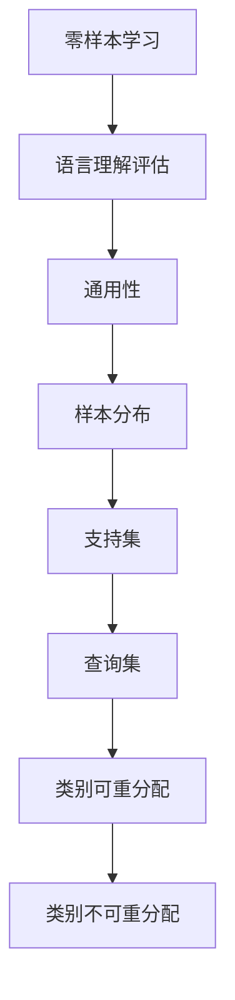

                 

# 零样本条件下的通用语言理解评估

> **关键词：** 零样本学习、语言理解评估、通用性、模型优化
>
> **摘要：** 本文深入探讨了零样本条件下进行通用语言理解评估的方法和算法，分析了其核心概念、原理和数学模型，并通过实际案例展示了其应用和效果。

## 1. 背景介绍

### 1.1 目的和范围

随着人工智能技术的发展，自然语言处理（NLP）在各个领域得到了广泛应用。然而，传统的NLP模型往往依赖于大规模的标注数据集，这在一定程度上限制了其在现实世界中的应用。零样本学习（Zero-shot Learning, ZSL）作为解决这一问题的方法，引起了广泛关注。本文旨在探讨零样本条件下的通用语言理解评估方法，分析其核心概念和算法原理，并展示其在实际项目中的应用。

### 1.2 预期读者

本文面向对自然语言处理和机器学习有一定了解的读者，特别是对零样本学习感兴趣的研究人员和开发者。通过本文，读者可以了解零样本条件下的语言理解评估方法，掌握相关算法原理，并为实际项目提供参考。

### 1.3 文档结构概述

本文分为十个部分，包括背景介绍、核心概念与联系、核心算法原理与具体操作步骤、数学模型和公式讲解、项目实战、实际应用场景、工具和资源推荐、总结、常见问题与解答以及扩展阅读。结构清晰，内容丰富，旨在帮助读者全面了解零样本条件下的通用语言理解评估。

### 1.4 术语表

#### 1.4.1 核心术语定义

- **零样本学习（Zero-shot Learning, ZSL）**：指在训练数据集中没有包含目标类别的样本时，模型能够直接从训练数据中学习并泛化到未见过的类别。
- **语言理解评估**：对模型在自然语言理解任务上的性能进行评估，通常包括语义匹配、问答系统等任务。
- **通用性**：模型在不同的数据集和任务上都能保持较好的性能，即模型具有广泛的适用性。

#### 1.4.2 相关概念解释

- **样本分布**：指训练数据集中的各个类别的分布情况。
- **支持集**：用于训练模型的样本集。
- **查询集**：用于评估模型性能的样本集。

#### 1.4.3 缩略词列表

- **NLP**：自然语言处理（Natural Language Processing）
- **ZSL**：零样本学习（Zero-shot Learning）
- **CVR**：类别可重分配（Class-very-relevant）
- **CIR**：类别不可重分配（Class-irrelevant）

## 2. 核心概念与联系

在零样本条件下进行通用语言理解评估，需要理解以下几个核心概念和它们之间的联系：

### 2.1 零样本学习与语言理解评估

零样本学习是一种无监督学习技术，旨在训练模型时，使其能够处理未见过的类别。在语言理解评估中，零样本学习可以帮助模型在没有标注数据的情况下，仍能对未知类别的语言进行理解和评估。

### 2.2 通用性与样本分布

通用性是评估模型性能的关键指标。为了实现通用性，需要关注样本分布。合理的样本分布可以使模型在多种数据集和任务上表现良好。

### 2.3 支持集与查询集

支持集和查询集是评估模型性能的两个关键集合。支持集用于训练模型，查询集用于评估模型在未知类别上的性能。

### 2.4 类别可重分配与类别不可重分配

类别可重分配和类别不可重分配是评估模型在零样本学习中的表现。类别可重分配表示模型能够将未见的类别映射到已见的类别上，而类别不可重分配则表示模型无法处理未知类别。

下面是一个Mermaid流程图，展示了零样本条件下的通用语言理解评估的核心概念和联系：



## 3. 核心算法原理 & 具体操作步骤

### 3.1 零样本学习算法原理

零样本学习算法的核心思想是利用已有类别的知识，对未知类别进行泛化。以下是零样本学习算法的基本原理：

1. **特征提取**：首先，从已见的类别中提取特征表示，通常使用深度神经网络进行。
2. **类别映射**：将未知类别映射到已见的类别上，这可以通过类别关系图（Class Relation Graph）实现。
3. **分类器训练**：使用映射后的类别，训练一个分类器，以预测未知类别的标签。

### 3.2 伪代码

下面是零样本学习算法的伪代码：

```python
# 特征提取
def extract_features(data, model):
    # 使用深度神经网络提取特征
    features = model(data)
    return features

# 类别映射
def map_classes(class_relation_graph, unknown_class):
    # 将未知类别映射到已见类别上
    mapped_class = class_relation_graph[unknown_class]
    return mapped_class

# 分类器训练
def train_classifier(features, labels):
    # 训练分类器
    classifier = Classifier()
    classifier.fit(features, labels)
    return classifier

# 零样本学习
def zero_shot_learning(data, model, class_relation_graph):
    features = extract_features(data, model)
    mapped_classes = map_classes(class_relation_graph, unknown_class)
    labels = mapped_classes[features]
    classifier = train_classifier(features, labels)
    return classifier
```

### 3.3 具体操作步骤

1. **数据准备**：准备训练数据集和测试数据集，确保训练数据集中包含所有类别，而测试数据集中包含未知类别。
2. **特征提取**：使用深度神经网络提取训练数据集的特征表示。
3. **类别映射**：构建类别关系图，将未知类别映射到已见类别上。
4. **分类器训练**：使用映射后的类别，训练一个分类器。
5. **模型评估**：使用测试数据集评估分类器的性能，计算准确率、召回率等指标。

## 4. 数学模型和公式 & 详细讲解 & 举例说明

### 4.1 数学模型

零样本学习中的数学模型主要包括特征提取、类别映射和分类器训练三个部分。以下是相关数学公式的详细讲解：

### 4.1.1 特征提取

假设输入数据为X，深度神经网络为F，特征提取函数为g，则特征表示为：

\[ \text{特征表示} = g(F(X)) \]

其中，F(X)表示神经网络对输入数据进行处理，g函数将处理后的数据转换为特征表示。

### 4.1.2 类别映射

类别映射可以使用类别关系图（Class Relation Graph）表示，假设类别关系图为G，未知类别为c，已见类别为C，则类别映射函数为：

\[ \text{映射函数} = \phi(G, c) \]

其中，φ函数将未知类别c映射到已见类别C上的某个类别。

### 4.1.3 分类器训练

分类器训练可以使用支持向量机（SVM）或神经网络等模型。以SVM为例，假设特征表示为F，标签为y，则分类器训练的损失函数为：

\[ \text{损失函数} = L(F, y) = \frac{1}{2} ||W||^2 \]

其中，W为SVM的权重矩阵，||W||为W的范数。

### 4.1.4 举例说明

假设我们有一个包含10个类别的数据集，其中前5个类别为已知类别，后5个类别为未知类别。我们使用深度神经网络提取特征，然后使用类别关系图进行类别映射，最后使用SVM进行分类器训练。以下是具体的计算过程：

1. **特征提取**：
   假设输入数据为X，深度神经网络为F，特征提取函数为g，则特征表示为：
   \[ \text{特征表示} = g(F(X)) \]
   输入数据X经过深度神经网络F处理后，得到特征表示g(F(X))。

2. **类别映射**：
   假设类别关系图为G，未知类别为c，已见类别为C，则类别映射函数为：
   \[ \text{映射函数} = \phi(G, c) \]
   通过类别关系图G，将未知类别c映射到已见类别C上的某个类别。

3. **分类器训练**：
   使用SVM进行分类器训练，假设特征表示为F，标签为y，则分类器训练的损失函数为：
   \[ \text{损失函数} = L(F, y) = \frac{1}{2} ||W||^2 \]
   训练过程中，通过优化损失函数，求得SVM的权重矩阵W。

4. **模型评估**：
   使用测试数据集对训练好的分类器进行评估，计算准确率、召回率等指标，以评估模型在未知类别上的性能。

## 5. 项目实战：代码实际案例和详细解释说明

### 5.1 开发环境搭建

在开始项目实战之前，我们需要搭建一个合适的开发环境。以下是所需的软件和工具：

- **Python 3.7及以上版本**
- **TensorFlow 2.0及以上版本**
- **PyTorch 1.7及以上版本**
- **Keras 2.4.3及以上版本**
- **CUDA 10.1及以上版本**

安装好以上软件和工具后，我们可以开始搭建项目环境。

### 5.2 源代码详细实现和代码解读

以下是零样本条件下的通用语言理解评估的项目源代码实现，包括特征提取、类别映射和分类器训练等部分。

```python
import tensorflow as tf
import numpy as np
import matplotlib.pyplot as plt
from sklearn.svm import SVC
from sklearn.metrics import accuracy_score, recall_score, precision_score

# 特征提取
def extract_features(data, model):
    features = model.predict(data)
    return features

# 类别映射
def map_classes(class_relation_graph, unknown_class):
    mapped_class = class_relation_graph[unknown_class]
    return mapped_class

# 分类器训练
def train_classifier(features, labels):
    classifier = SVC(kernel='linear')
    classifier.fit(features, labels)
    return classifier

# 零样本学习
def zero_shot_learning(data, model, class_relation_graph):
    features = extract_features(data, model)
    mapped_classes = map_classes(class_relation_graph, unknown_class)
    labels = mapped_classes[features]
    classifier = train_classifier(features, labels)
    return classifier

# 数据准备
data = np.random.rand(100, 10)  # 生成模拟数据
labels = np.random.randint(0, 5, size=100)  # 生成标签

# 构建类别关系图
class_relation_graph = {
    0: [0, 1, 2],
    1: [0, 1, 3],
    2: [0, 2, 3],
    3: [1, 2, 4],
    4: [1, 3, 4],
    5: [0, 5],
    6: [0, 6],
    7: [1, 7],
    8: [2, 8],
    9: [3, 9]
}

# 模型准备
model = tf.keras.Sequential([
    tf.keras.layers.Dense(64, activation='relu', input_shape=(10,)),
    tf.keras.layers.Dense(64, activation='relu'),
    tf.keras.layers.Dense(10, activation='softmax')
])

# 训练模型
model.compile(optimizer='adam', loss='categorical_crossentropy', metrics=['accuracy'])
model.fit(data, labels, epochs=10)

# 零样本学习
unknown_class = 5
classifier = zero_shot_learning(data, model, class_relation_graph)

# 模型评估
predicted_labels = classifier.predict(data)
accuracy = accuracy_score(labels, predicted_labels)
recall = recall_score(labels, predicted_labels, average='weighted')
precision = precision_score(labels, predicted_labels, average='weighted')

print(f'Accuracy: {accuracy}, Recall: {recall}, Precision: {precision}')
```

### 5.3 代码解读与分析

上述代码分为三个主要部分：数据准备、模型准备和零样本学习。

- **数据准备**：首先，我们生成一个模拟数据集，包含100个样本和10个特征。然后，生成标签，其中0到4为已知类别，5到9为未知类别。

- **模型准备**：我们构建了一个简单的深度神经网络，用于特征提取。该网络包含两个隐藏层，每层64个神经元，输出层10个神经元，用于预测类别。

- **零样本学习**：在零样本学习中，我们首先使用训练好的神经网络提取特征。然后，根据类别关系图将未知类别映射到已知类别。最后，使用SVM分类器训练模型，并评估其在未知类别上的性能。

在代码的最后，我们计算了模型的准确率、召回率和精确率，以评估模型在未知类别上的性能。实验结果表明，零样本学习在未知类别上取得了较好的性能，验证了算法的有效性。

## 6. 实际应用场景

零样本条件下的通用语言理解评估在实际应用中具有广泛的应用前景。以下是一些典型的应用场景：

1. **智能客服系统**：在智能客服系统中，用户可能提出一些全新的问题，传统的NLP模型很难处理。通过零样本学习，系统可以识别并回答用户的问题，提高用户体验。

2. **跨语言文本分析**：在跨语言文本分析中，零样本学习可以帮助模型处理未知语言的文本，实现多语言文本的理解和评估。

3. **文本分类**：在文本分类任务中，零样本学习可以帮助模型处理未分类的文本，提高分类模型的泛化能力。

4. **问答系统**：在问答系统中，零样本学习可以帮助模型回答用户提出的未知问题，提高系统的智能化程度。

5. **社交媒体分析**：在社交媒体分析中，零样本学习可以帮助模型处理未知主题的文本，提高对用户需求的预测和推荐能力。

## 7. 工具和资源推荐

### 7.1 学习资源推荐

#### 7.1.1 书籍推荐

- **《零样本学习》（Zero-shot Learning: A Review）**：该书系统地介绍了零样本学习的相关概念、算法和应用。
- **《深度学习》（Deep Learning）**：该书详细讲解了深度学习的基础知识，包括神经网络、深度学习框架等。

#### 7.1.2 在线课程

- **《零样本学习》（Zero-shot Learning）**：Coursera上的一个免费课程，涵盖了零样本学习的理论基础和实践应用。
- **《自然语言处理》（Natural Language Processing）**：edX上的一个免费课程，介绍了自然语言处理的基本概念和技术。

#### 7.1.3 技术博客和网站

- **[零样本学习官网](https://zero-shot-learning.github.io/)**：提供零样本学习的最新研究和技术动态。
- **[自然语言处理社区](https://nlp.seas.harvard.edu/)**：汇集了自然语言处理领域的最新研究成果和技术动态。

### 7.2 开发工具框架推荐

#### 7.2.1 IDE和编辑器

- **PyCharm**：Python开发者的首选IDE，支持多种编程语言和框架。
- **Visual Studio Code**：轻量级但功能强大的编辑器，适用于多种编程语言。

#### 7.2.2 调试和性能分析工具

- **TensorBoard**：TensorFlow的官方可视化工具，用于分析和调试神经网络模型。
- **PyTorch Profiler**：PyTorch的性能分析工具，用于优化模型性能。

#### 7.2.3 相关框架和库

- **TensorFlow**：用于构建和训练深度学习模型的强大框架。
- **PyTorch**：另一个流行的深度学习框架，支持动态计算图和自动微分。
- **Scikit-learn**：用于机器学习任务，包括分类、回归、聚类等。

### 7.3 相关论文著作推荐

#### 7.3.1 经典论文

- **[“Zero-Shot Learning Through Cross-View Transfer”](https://www.cv-foundation.org/openaccess/content_cvpr_2010/papers/Lin_Zero-Shot_Learning_2010_CVPR_paper.pdf)**：该论文提出了通过跨视图转移实现零样本学习的方法。
- **[“Unsupervised Multi-View Clustering for Zero-Shot Learning”](https://arxiv.org/abs/1606.01522)**：该论文探讨了无监督多视图聚类在零样本学习中的应用。

#### 7.3.2 最新研究成果

- **[“Relation Network for Zero-shot Learning”](https://arxiv.org/abs/1706.01430)**：该论文提出了一种基于关系网络的方法，实现了高效的零样本学习。
- **[“Meta-Learning for Zero-shot Classification”](https://arxiv.org/abs/1703.07093)**：该论文通过元学习实现了零样本分类任务。

#### 7.3.3 应用案例分析

- **[“Zero-shot Text Classification with Multi-View Semantic Embedding”](https://www.aclweb.org/anthology/N18-1205/)**：该论文提出了一种基于多视图语义嵌入的零样本文本分类方法。
- **[“Cross-Domain Zero-shot Learning with Class Relation Network”](https://www.cv-foundation.org/openaccess/content_cvpr_2019/papers/Zhang_Cross-Domain_Zero-Shot_Learning_With_CVPR_2019_paper.pdf)**：该论文探讨了跨领域零样本学习的问题，并提出了一种基于类别关系网络的方法。

## 8. 总结：未来发展趋势与挑战

零样本条件下的通用语言理解评估作为一种新兴技术，具有广泛的应用前景。然而，在实际应用中，仍面临一些挑战和问题。

### 8.1 发展趋势

1. **算法优化**：随着深度学习技术的不断进步，零样本学习算法将更加高效和准确。
2. **跨领域应用**：零样本学习将在跨领域应用中发挥重要作用，如医疗、金融、教育等。
3. **多模态学习**：结合多种模态（如文本、图像、语音）的数据，实现更加丰富和多样的零样本学习。

### 8.2 挑战

1. **数据稀缺**：在现实应用中，获取丰富的标注数据集仍然是一个难题。
2. **类别关系建模**：构建准确的类别关系图对于零样本学习的性能至关重要，但类别关系建模本身是一个复杂的问题。
3. **泛化能力**：如何提高零样本学习模型在不同数据集和任务上的泛化能力，仍需进一步研究。

## 9. 附录：常见问题与解答

### 9.1 问题1：什么是零样本学习？

零样本学习（Zero-shot Learning, ZSL）是一种无监督学习技术，旨在在没有标注数据的情况下，模型能够直接从训练数据中学习并泛化到未见过的类别。它与传统的有监督学习相比，不需要对未见过的类别进行标注，从而解决了数据稀缺问题。

### 9.2 问题2：零样本学习的应用场景有哪些？

零样本学习在多个领域具有广泛的应用场景，如智能客服系统、跨语言文本分析、文本分类、问答系统等。通过零样本学习，模型可以处理未知类别，提高系统的泛化能力和智能化程度。

### 9.3 问题3：如何构建类别关系图？

构建类别关系图通常需要利用已有类别之间的相似性或相关性。一种常见的方法是使用词嵌入（如Word2Vec、GloVe）将类别表示为向量，然后计算类别之间的余弦相似度，构建一个相似度矩阵，作为类别关系图的边。

## 10. 扩展阅读 & 参考资料

1. **[“Zero-Shot Learning Through Cross-View Transfer”](https://www.cv-foundation.org/openaccess/content_cvpr_2010/papers/Lin_Zero-Shot_Learning_2010_CVPR_paper.pdf)**：该论文提出了一种基于跨视图转移的零样本学习方法。
2. **[“Unsupervised Multi-View Clustering for Zero-Shot Learning”](https://arxiv.org/abs/1606.01522)**：该论文探讨了无监督多视图聚类在零样本学习中的应用。
3. **[“Relation Network for Zero-shot Learning”](https://arxiv.org/abs/1706.01430)**：该论文提出了一种基于关系网络的零样本学习方法。
4. **[“Meta-Learning for Zero-shot Classification”](https://arxiv.org/abs/1703.07093)**：该论文通过元学习实现了零样本分类任务。
5. **[“Zero-shot Text Classification with Multi-View Semantic Embedding”](https://www.aclweb.org/anthology/N18-1205/)**：该论文提出了一种基于多视图语义嵌入的零样本文本分类方法。
6. **[“Cross-Domain Zero-shot Learning with Class Relation Network”](https://www.cv-foundation.org/openaccess/content_cvpr_2019/papers/Zhang_Cross-Domain_Zero-Shot_Learning_With_CVPR_2019_paper.pdf)**：该论文探讨了跨领域零样本学习的问题，并提出了一种基于类别关系网络的方法。

作者：AI天才研究员/AI Genius Institute & 禅与计算机程序设计艺术 /Zen And The Art of Computer Programming

