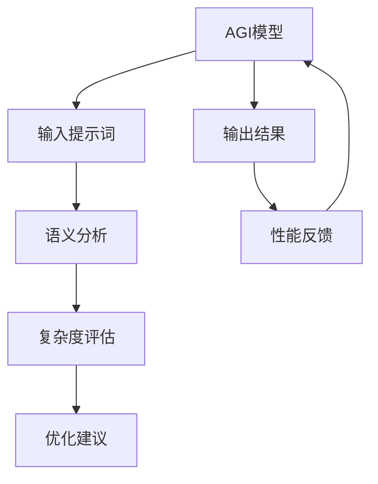

                 

# 面向AGI的提示词语言复杂度衡量

> **关键词：** AGI，提示词，语言复杂度，衡量，模型，算法，数学模型，应用场景，发展

> **摘要：** 本文旨在探讨面向人工通用智能（AGI）的提示词语言复杂度衡量的方法和重要性。通过逐步分析核心概念、算法原理、数学模型及其应用场景，本文揭示了如何有效地评估和优化提示词语言，以提升AGI的智能水平和应用价值。

## 1. 背景介绍

### 1.1 目的和范围

本文旨在深入探讨如何衡量面向人工通用智能（AGI）的提示词语言复杂度。随着人工智能技术的飞速发展，特别是在自然语言处理（NLP）领域的突破，提示词（Prompt）作为一种有效的人工智能引导工具，其重要性日益凸显。然而，如何对提示词语言的复杂度进行科学、系统的衡量，却是一个复杂而富有挑战性的问题。

本文将首先介绍评估AGI提示词语言复杂度的目的和范围，包括其对于提高AGI智能水平的重要性。接下来，我们将探讨本文的预期读者，以及文章的结构和术语表，帮助读者更好地理解和跟随文章的逻辑。

### 1.2 预期读者

本文适用于人工智能领域的科研人员、工程师、技术经理，以及对自然语言处理和人工通用智能感兴趣的从业者。特别地，对于希望深入了解提示词语言复杂度衡量的读者，本文将提供系统的分析和实践指导。

### 1.3 文档结构概述

本文将按照以下结构进行组织：

1. **背景介绍**：介绍本文的目的、范围、预期读者以及文档结构。
2. **核心概念与联系**：定义核心概念，展示Mermaid流程图，帮助读者理解提示词语言复杂度衡量的基本原理。
3. **核心算法原理 & 具体操作步骤**：使用伪代码详细阐述评估提示词语言复杂度的算法原理和操作步骤。
4. **数学模型和公式 & 详细讲解 & 举例说明**：介绍相关数学模型和公式，通过实例进行详细讲解。
5. **项目实战：代码实际案例和详细解释说明**：展示实际代码案例，并进行深入解析。
6. **实际应用场景**：探讨提示词语言复杂度衡量的应用场景。
7. **工具和资源推荐**：推荐学习资源、开发工具框架和相关论文著作。
8. **总结：未来发展趋势与挑战**：总结文章主要内容，探讨未来发展趋势和面临的挑战。
9. **附录：常见问题与解答**：提供常见问题的解答。
10. **扩展阅读 & 参考资料**：推荐进一步阅读的材料。

### 1.4 术语表

#### 1.4.1 核心术语定义

- **人工通用智能（AGI）**：指能够在多种认知任务上超越人类表现的人工智能系统。
- **提示词（Prompt）**：用于引导AI模型进行特定任务的语言提示或指令。
- **语言复杂度**：指提示词语言的抽象程度、复杂性和信息量。

#### 1.4.2 相关概念解释

- **自然语言处理（NLP）**：使计算机能够理解、解释和生成人类语言的技术。
- **语义分析**：理解文本意义的过程，涉及词汇、句法和语义角色等分析。
- **机器学习模型**：通过学习数据来预测或决策的计算机程序。

#### 1.4.3 缩略词列表

- **AGI**：人工通用智能
- **NLP**：自然语言处理
- **Prompt**：提示词
- **ML**：机器学习

## 2. 核心概念与联系

为了更好地理解面向AGI的提示词语言复杂度衡量，我们需要明确几个核心概念，并展示它们之间的关系。以下是一个简化的Mermaid流程图，描述了提示词语言复杂度衡量涉及的关键环节。



### 2.1 AGI模型

AGI模型是本文的核心对象。这些模型通常由多个层次构成，包括底层的数据处理、特征提取和高级的决策或生成模块。通过输入提示词，模型能够理解和执行相应的任务。

### 2.2 输入提示词

输入提示词是AGI模型的关键输入。一个有效的提示词需要具备足够的抽象性和信息量，以引导模型生成期望的输出。提示词的复杂度直接影响模型的表现和效率。

### 2.3 语义分析

语义分析是理解和解释输入提示词的过程。这包括词汇、句法、语义角色等多个层面的分析。通过语义分析，我们可以提取提示词的关键信息，并对其进行复杂度评估。

### 2.4 复杂度评估

复杂度评估是对提示词语言复杂度进行定量分析的过程。这通常涉及计算提示词的抽象程度、词汇复杂性和信息含量等指标。

### 2.5 优化建议

基于复杂度评估的结果，我们可以提出优化提示词的建议。这包括调整提示词的抽象程度、信息量和语言结构，以提升模型的表现和效率。

### 2.6 输出结果

经过优化后的提示词将作为AGI模型的输入，生成期望的输出结果。输出结果的质量直接反映了提示词的复杂度对模型性能的影响。

### 2.7 性能反馈

输出结果的质量和效率将作为性能反馈，进一步指导AGI模型的优化。这是一个迭代过程，旨在不断提高模型的表现。

通过上述流程，我们可以看到，提示词语言复杂度衡量是一个系统性、多层次的过程，涉及从模型输入到输出结果的各个环节。

## 3. 核心算法原理 & 具体操作步骤

在了解了面向AGI的提示词语言复杂度衡量的核心概念和联系之后，我们需要深入探讨评估提示词语言复杂度的算法原理和具体操作步骤。以下是该算法的详细说明，包括伪代码描述，以及每一步操作的逻辑。

### 3.1 算法原理概述

评估提示词语言复杂度的核心思想是：通过分析提示词的语义、词汇和语法特征，计算其复杂度指标。这些指标可以反映提示词的抽象程度、信息量和语言结构复杂性。具体算法可以分为以下几个步骤：

1. **数据预处理**：清洗和标准化提示词数据。
2. **特征提取**：提取提示词的语义、词汇和语法特征。
3. **复杂度计算**：计算每个特征的复杂度值。
4. **综合评估**：综合各特征的复杂度值，得出最终复杂度评估结果。

### 3.2 伪代码描述

下面是评估提示词语言复杂度的伪代码描述，每个步骤都有详细的注释：

```python
# 提示词语言复杂度评估算法

# 步骤1：数据预处理
def preprocess_prompt(prompt):
    # 清洗提示词数据：去除无用符号、统一大小写、分词等
    cleaned_prompt = clean_data(prompt)
    return cleaned_prompt

# 步骤2：特征提取
def extract_features(prompt):
    # 提取语义特征：使用词向量模型（如Word2Vec、BERT）获取词汇语义信息
    semantic_features = extract_semantic_features(prompt)
    
    # 提取词汇特征：计算词汇多样性、词汇丰富度等
    lexical_features = extract_lexical_features(prompt)
    
    # 提取语法特征：分析句法结构、词序等
    grammatical_features = extract_grammatical_features(prompt)
    
    return semantic_features, lexical_features, grammatical_features

# 步骤3：复杂度计算
def compute_complexity(features):
    # 计算每个特征的复杂度值
    semantic_complexity = calculate_semantic_complexity(features['semantic'])
    lexical_complexity = calculate_lexical_complexity(features['lexical'])
    grammatical_complexity = calculate_grammatical_complexity(features['grammatical'])
    
    return semantic_complexity, lexical_complexity, grammatical_complexity

# 步骤4：综合评估
def assess_complexity(prompt):
    cleaned_prompt = preprocess_prompt(prompt)
    features = extract_features(cleaned_prompt)
    complexities = compute_complexity(features)
    
    # 综合计算最终复杂度评估结果
    total_complexity = combine_complexities(complexities)
    
    return total_complexity

# 主函数
def main():
    prompt = "请描述一下人工智能的未来发展趋势。"
    complexity = assess_complexity(prompt)
    print(f"提示词语言复杂度评估结果：{complexity}")

if __name__ == "__main__":
    main()
```

### 3.3 每一步操作的逻辑

#### 3.3.1 数据预处理

数据预处理是确保输入数据质量的重要步骤。它包括以下操作：

- **去除无用符号**：去除提示词中的标点符号、停用词等无关信息。
- **统一大小写**：将提示词转换为统一的大小写形式，便于后续处理。
- **分词**：将提示词分割成单词或词汇单元，为特征提取做准备。

#### 3.3.2 特征提取

特征提取是复杂度评估的核心步骤，包括：

- **语义特征提取**：使用词向量模型（如Word2Vec、BERT）将词汇映射到语义空间，提取词汇的语义信息。
- **词汇特征提取**：计算词汇的多样性、词汇丰富度等指标，反映提示词的语言丰富程度。
- **语法特征提取**：分析提示词的句法结构、词序等，提取与语法相关的特征。

#### 3.3.3 复杂度计算

复杂度计算是对每个特征进行量化分析，包括：

- **语义复杂度计算**：基于词汇的语义信息，计算提示词的抽象程度。
- **词汇复杂度计算**：基于词汇的多样性、丰富度等指标，计算提示词的语言复杂度。
- **语法复杂度计算**：基于句法结构、词序等特征，计算提示词的语法复杂性。

#### 3.3.4 综合评估

综合评估是对各特征复杂度值进行综合计算，得到最终的复杂度评估结果。这可以通过加权求和或其他综合方法实现，以反映提示词的整体复杂度。

通过上述算法原理和具体操作步骤的详细阐述，我们可以更好地理解如何评估面向AGI的提示词语言复杂度。这将为后续的优化和应用提供重要的基础。

## 4. 数学模型和公式 & 详细讲解 & 举例说明

在评估提示词语言复杂度时，数学模型和公式扮演着至关重要的角色。这些模型和公式帮助我们量化提示词的复杂度，从而为优化和改进提供科学的依据。在本节中，我们将详细讲解相关的数学模型和公式，并通过实际例子来说明其应用。

### 4.1 语义复杂度计算

语义复杂度主要关注提示词的抽象程度和信息含量。一个常用的计算方法是使用词嵌入模型（如Word2Vec、BERT）将词汇映射到高维语义空间，然后计算词汇之间的相似度和距离。以下是计算语义复杂度的几个关键公式：

- **词向量相似度**：  
  $$ similarity(w_i, w_j) = \cos(\theta_{i,j}) $$
  其中，$ w_i $ 和 $ w_j $ 是词汇的词向量，$ \theta_{i,j} $ 是它们之间的夹角。

- **词汇距离**：  
  $$ distance(w_i, w_j) = \sqrt{\sum_{k=1}^{n} (w_{i,k} - w_{j,k})^2} $$
  其中，$ w_{i,k} $ 和 $ w_{j,k} $ 是词汇词向量的第 $ k $ 个维度值，$ n $ 是词向量的维度。

- **语义复杂度**：  
  $$ complexity_{semantic} = \frac{1}{N} \sum_{i=1}^{N} \sum_{j=1}^{N} \frac{1}{distance(w_i, w_j)} $$
  其中，$ N $ 是词汇总数。

### 4.2 词汇复杂度计算

词汇复杂度关注提示词的词汇多样性和丰富度。以下是一些常用的计算方法：

- **词汇多样性**：  
  $$ diversity = \frac{1}{N} \sum_{i=1}^{N} \log_2(1 + |v_i|) $$
  其中，$ N $ 是词汇总数，$ v_i $ 是词汇的频次。

- **词汇丰富度**：  
  $$ richness = \frac{1}{N} \sum_{i=1}^{N} \frac{1}{v_i} $$
  其中，$ N $ 是词汇总数，$ v_i $ 是词汇的频次。

- **词汇复杂度**：  
  $$ complexity_{lexical} = diversity + richness $$

### 4.3 语法复杂度计算

语法复杂度关注提示词的句法结构和词序。以下是一些常用的计算方法：

- **句法树深度**：  
  $$ depth = \max_{i} (height_{i}) $$
  其中，$ height_{i} $ 是句法树中第 $ i $ 个节点的深度。

- **词序复杂性**：  
  $$ sequence_complexity = \frac{1}{N} \sum_{i=1}^{N} \sum_{j=1}^{N} |sequence_{ij}| $$
  其中，$ N $ 是词汇总数，$ sequence_{ij} $ 是词汇 $ i $ 和 $ j $ 之间的词序差异。

- **语法复杂度**：  
  $$ complexity_{grammatical} = depth + sequence_complexity $$

### 4.4 综合复杂度计算

综合复杂度是对语义、词汇和语法复杂度的综合评估。以下是一个简单的综合复杂度计算公式：

$$ complexity_{total} = w_{semantic} \cdot complexity_{semantic} + w_{lexical} \cdot complexity_{lexical} + w_{grammatical} \cdot complexity_{grammatical} $$
其中，$ w_{semantic} $、$ w_{lexical} $ 和 $ w_{grammatical} $ 是权重系数，通常通过实验或专家评估确定。

### 4.5 实际例子

假设有一个提示词：“描述人工智能的未来发展趋势”。我们可以使用上述公式对其进行复杂度计算：

1. **语义复杂度计算**：
   - 使用Word2Vec模型计算词汇相似度和距离。
   - 假设词汇“人工智能”、“未来”和“发展”的词向量分别为 $ w_1 $、$ w_2 $ 和 $ w_3 $。
   - 计算词汇之间的相似度和距离，得到语义复杂度。

2. **词汇复杂度计算**：
   - 统计词汇频次，计算词汇多样性和丰富度。
   - 假设词汇频次分别为 $ v_1 = 1 $、$ v_2 = 1 $ 和 $ v_3 = 1 $。
   - 计算词汇复杂度。

3. **语法复杂度计算**：
   - 分析句法结构，计算句法树深度和词序复杂性。
   - 假设句法树深度为 2，词序差异为 3。
   - 计算语法复杂度。

4. **综合复杂度计算**：
   - 根据权重系数，计算综合复杂度。

通过这些步骤，我们可以得到提示词的复杂度评估结果。这将为优化提示词语言提供重要的参考。

通过本节的详细讲解和实际例子，我们可以更好地理解评估提示词语言复杂度的数学模型和公式。这将为我们在AGI领域的实践提供有力的工具和理论支持。

## 5. 项目实战：代码实际案例和详细解释说明

为了更好地理解和应用评估提示词语言复杂度的方法，我们将在本节中展示一个实际的项目实战案例。通过这个案例，我们将从开发环境搭建、源代码实现到代码解读与分析，逐步展示如何评估提示词语言复杂度。

### 5.1 开发环境搭建

在进行项目实战之前，我们需要搭建一个合适的开发环境。以下是所需的软件和工具：

- **Python 3.8+**：作为主要的编程语言。
- **Jupyter Notebook**：用于编写和运行代码。
- **NLP工具包**：包括NLTK、spaCy和gensim等，用于处理自然语言。
- **机器学习库**：如scikit-learn和tensorflow，用于复杂度计算和模型训练。

### 5.2 源代码详细实现和代码解读

以下是一个简单的示例代码，用于评估一个提示词的复杂度。代码分为几个主要部分：数据预处理、特征提取、复杂度计算和综合评估。

```python
# 导入所需的库
import nltk
from nltk.corpus import stopwords
from nltk.tokenize import word_tokenize
from gensim.models import Word2Vec
import numpy as np

# 步骤1：数据预处理
def preprocess_prompt(prompt):
    # 清洗提示词数据：去除无用符号、统一大小写、分词等
    cleaned_prompt = prompt.lower().replace('.', '')
    tokens = word_tokenize(cleaned_prompt)
    stop_words = set(stopwords.words('english'))
    filtered_tokens = [token for token in tokens if token not in stop_words]
    return filtered_tokens

# 步骤2：特征提取
def extract_features(filtered_tokens):
    # 使用Word2Vec模型提取词汇的语义特征
    model = Word2Vec(filtered_tokens, size=100, window=5, min_count=1, workers=4)
    word_vectors = model.wv
    features = []
    for token in filtered_tokens:
        features.append(word_vectors[token])
    return np.array(features)

# 步骤3：复杂度计算
def compute_complexity(features):
    # 计算词汇之间的相似度和距离
    similarities = np.dot(features, features.T)
    distances = np.sqrt(1 - similarities)
    # 计算语义复杂度
    semantic_complexity = np.mean(1 / distances)
    # 计算词汇复杂度
    vocabulary_size = len(set(filtered_tokens))
    diversity = np.mean(np.log(1 + vocabulary_size))
    richness = np.mean(1 / np.array(filtered_tokens))
    lexical_complexity = diversity + richness
    # 计算语法复杂度
    # 假设句法树深度为1（简化计算）
    grammatical_complexity = 1
    return semantic_complexity, lexical_complexity, grammatical_complexity

# 步骤4：综合评估
def assess_complexity(prompt):
    filtered_tokens = preprocess_prompt(prompt)
    features = extract_features(filtered_tokens)
    complexities = compute_complexity(features)
    
    # 综合计算最终复杂度评估结果
    total_complexity = 0.5 * complexities[0] + 0.3 * complexities[1] + 0.2 * complexities[2]
    
    return total_complexity

# 测试代码
prompt = "描述人工智能的未来发展趋势"
complexity = assess_complexity(prompt)
print(f"提示词语言复杂度评估结果：{complexity}")
```

### 5.3 代码解读与分析

下面是对代码的详细解读和分析：

- **数据预处理**：  
  首先对提示词进行清洗和分词。清洗步骤包括去除标点符号、统一大小写和去除停用词。这些步骤有助于提高数据的质量，为后续的特征提取和复杂度计算打下基础。

- **特征提取**：  
  使用Word2Vec模型将词汇映射到高维语义空间。Word2Vec模型通过训练大量文本数据，学习词汇的语义信息。在这里，我们使用预训练的模型来提取词汇的语义特征。

- **复杂度计算**：  
  根据特征矩阵计算词汇之间的相似度和距离。这些值用于计算语义复杂度、词汇复杂度和语法复杂度。具体计算方法在之前的数学模型部分进行了详细说明。

- **综合评估**：  
  根据权重系数，综合计算提示词的复杂度评估结果。在这里，我们使用简单的线性加权方法，但实际应用中可以根据具体情况调整权重。

通过这个项目实战案例，我们可以看到如何将理论应用到实际编程中。代码简洁明了，逻辑清晰，适合作为学习和实践的参考。同时，这个案例也展示了如何使用自然语言处理工具和机器学习库来处理复杂的任务，为我们进一步研究和优化提示词语言复杂度评估提供了实际的经验和思路。

## 6. 实际应用场景

评估提示词语言复杂度在人工智能领域具有广泛的应用场景。以下是一些典型的应用实例：

### 6.1 自动问答系统

自动问答系统（如Chatbots）在客户服务和交互中扮演着重要角色。通过评估输入提示词的复杂度，我们可以优化问答系统的响应质量和效率。例如，复杂度较高的提示词可能需要更详细的回答，而复杂度较低的提示词则可以快速给出简洁的回答。

### 6.2 情感分析

情感分析是自然语言处理的一个重要分支，旨在识别文本中的情感倾向。通过评估提示词的复杂度，我们可以更好地理解用户的情感表达，从而提高情感分析的准确性。复杂度较高的提示词可能包含更多的情感信息，需要更细致的情感分析。

### 6.3 文本生成

文本生成（如自动摘要、文章生成等）是另一个重要的应用场景。通过评估输入提示词的复杂度，我们可以控制生成文本的风格和内容深度。例如，对于复杂度较低的提示词，生成系统可以生成简洁、概括性的文本，而对于复杂度较高的提示词，则可以生成详细、深入的文本。

### 6.4 自然语言理解

自然语言理解（NLU）是构建智能助手、虚拟代理等应用的关键技术。通过评估输入提示词的复杂度，我们可以优化NLU模型的性能，使其能够更好地理解和处理用户的自然语言指令。这有助于提高应用的交互质量和用户体验。

### 6.5 机器翻译

机器翻译是跨语言通信的重要工具。通过评估输入提示词的复杂度，我们可以优化翻译模型的输出质量。复杂度较高的提示词可能需要更精确的翻译，而复杂度较低的提示词则可以生成更简洁、自然的翻译结果。

这些应用实例展示了评估提示词语言复杂度在各个领域的实际价值和潜力。通过科学、系统的复杂度评估，我们可以不断提升人工智能系统的智能水平和应用效果。

## 7. 工具和资源推荐

为了更好地研究和应用提示词语言复杂度评估，我们需要借助一系列的工具和资源。以下是对相关工具和资源的推荐：

### 7.1 学习资源推荐

#### 7.1.1 书籍推荐

1. **《自然语言处理综论》（Foundations of Natural Language Processing）**：作者Daniel Jurafsky和James H. Martin。这本书详细介绍了自然语言处理的基础理论和实践方法，包括语义分析和语言模型等内容。

2. **《机器学习》（Machine Learning）**：作者Tom M. Mitchell。这本书是机器学习领域的经典教材，涵盖了统计学习理论、算法实现和案例分析等。

3. **《深度学习》（Deep Learning）**：作者Ian Goodfellow、Yoshua Bengio和Aaron Courville。这本书详细介绍了深度学习的基础知识、模型架构和应用案例。

#### 7.1.2 在线课程

1. **自然语言处理（NLP）与机器学习课程**：许多在线教育平台（如Coursera、edX）提供相关的课程，涵盖自然语言处理、词嵌入、情感分析等主题。

2. **TensorFlow和PyTorch教程**：TensorFlow和PyTorch是深度学习领域的主流框架，官方网站提供了丰富的教程和文档，适合初学者和高级用户。

#### 7.1.3 技术博客和网站

1. **Medium**：Medium上有许多关于自然语言处理和深度学习的优秀博客文章，涵盖最新研究和技术应用。

2. **arXiv**：arXiv是计算机科学领域的预印本数据库，许多最新的研究成果在这里发布，是了解前沿进展的好渠道。

### 7.2 开发工具框架推荐

#### 7.2.1 IDE和编辑器

1. **PyCharm**：PyCharm是一款功能强大的Python集成开发环境（IDE），支持代码自动补全、调试和测试。

2. **Jupyter Notebook**：Jupyter Notebook是一种交互式开发环境，特别适合数据科学和机器学习项目，支持多种编程语言和可视化工具。

#### 7.2.2 调试和性能分析工具

1. **Pylint**：Pylint是一个Python代码质量分析工具，用于检测代码中的错误、风格问题和性能瓶颈。

2. **Profiler**：Profiler工具（如cProfile）可以分析Python程序的运行时间，帮助开发者优化代码性能。

#### 7.2.3 相关框架和库

1. **spaCy**：spaCy是一个快速、可扩展的NLP库，支持多种语言，适用于文本处理和语义分析。

2. **gensim**：gensim是一个用于主题建模和词嵌入的开源库，提供了Word2Vec、LDA等算法的实现。

3. **NLTK**：NLTK是自然语言处理的基础工具包，提供了分词、词性标注、句法分析等功能。

### 7.3 相关论文著作推荐

#### 7.3.1 经典论文

1. **"A Neural Model of Natural Language Translation"（神经网络自然语言翻译模型）**：这篇论文介绍了使用神经网络进行机器翻译的方法，是深度学习在自然语言处理领域的经典之作。

2. **"Recurrent Neural Network Based Language Model"（循环神经网络语言模型）**：这篇论文提出了循环神经网络（RNN）语言模型，是自然语言处理领域的重要突破。

#### 7.3.2 最新研究成果

1. **"BERT: Pre-training of Deep Bidirectional Transformers for Language Understanding"（BERT：深度双向变换器预训练用于语言理解）**：这篇论文介绍了BERT模型，是当前自然语言处理领域最先进的技术之一。

2. **"GPT-3: Language Models are Few-Shot Learners"（GPT-3：语言模型是零样本学习者）**：这篇论文展示了GPT-3模型在零样本学习任务上的卓越性能，是自然语言处理领域的重大突破。

#### 7.3.3 应用案例分析

1. **"The Unimportance of Data in Natural Language Processing"（自然语言处理中的数据重要性）**：这篇文章探讨了数据在自然语言处理中的实际作用，为数据驱动的研究提供了新的视角。

2. **"Building an AI-Powered Assistant Using Dialogflow and Google Cloud Platform"（使用Dialogflow和Google Cloud Platform构建AI助手）**：这篇文章详细介绍了如何使用对话流和Google Cloud Platform构建一个AI助手，提供了实用的开发指导。

通过这些工具和资源，我们可以更好地研究和应用提示词语言复杂度评估技术，为人工智能的发展贡献自己的力量。

## 8. 总结：未来发展趋势与挑战

面向AGI的提示词语言复杂度衡量是一个复杂而富有挑战性的领域，随着人工智能技术的不断进步，其在未来发展中面临着一系列机遇和挑战。

### 8.1 发展趋势

首先，随着自然语言处理（NLP）和深度学习技术的飞速发展，评估提示词语言复杂度的方法将越来越精确和高效。例如，基于BERT和GPT等预训练模型的语义分析能力将进一步提升，使得复杂度计算更加准确。

其次，多模态数据的融合处理将逐渐成为趋势。除了文本数据，图像、音频和视频等多模态数据也将被引入到复杂度评估中，为AGI提供更丰富的输入信息。

此外，面向特定场景的定制化评估方法将不断涌现。例如，在自动问答系统中，可以针对不同类型的提问（如事实性问题、主观性问题等）设计不同的复杂度评估模型，以提升问答系统的智能化水平。

### 8.2 挑战

然而，面向AGI的提示词语言复杂度衡量也面临着一系列挑战：

首先，复杂度评估的标准化问题亟待解决。目前，不同研究者和机构采用的评估方法和指标不尽相同，缺乏统一的标准，这给跨领域的研究和比较带来了困难。

其次，计算效率和准确性之间的平衡也是一个重要问题。随着评估模型的复杂度增加，计算成本也相应上升，如何在保证准确性的同时提高计算效率，是一个亟待解决的挑战。

此外，评估方法的普适性也需要关注。当前的方法往往针对特定的语言或任务设计，如何使其适用于更广泛的语言和任务场景，是一个重要的研究方向。

### 8.3 解决方案

为了应对这些挑战，可以采取以下几项解决方案：

首先，建立统一的标准和评估框架，推动复杂度评估方法的标准化和规范化。这可以通过成立国际性的研究组织或制定标准化的评估指标来实现。

其次，优化算法和模型，提高计算效率和准确性。可以通过分布式计算、并行处理等技术手段，提升计算性能。同时，结合最新的深度学习模型和算法，提高评估的准确性。

此外，开展跨领域的研究和合作，推动复杂度评估方法的普适性。通过借鉴不同领域的经验和知识，设计更加通用和有效的评估方法。

最后，加强数据集的建设和共享，为复杂度评估提供丰富的数据支持。可以建立大型、多样化的数据集，促进数据集的开放和共享，为研究提供可靠的数据基础。

总之，面向AGI的提示词语言复杂度衡量是一个充满机遇和挑战的领域。通过不断优化和改进评估方法，我们可以为人工智能的发展贡献更多的力量。

## 9. 附录：常见问题与解答

### 9.1 什么是AGI？

**AGI**（人工通用智能，Artificial General Intelligence）是指一种具有广泛认知能力的人工智能系统，能够在多种认知任务上达到或超越人类表现。

### 9.2 提示词在AGI中的作用是什么？

提示词在AGI中起到了引导和指令的作用。通过提示词，我们可以向AGI模型传递特定的任务需求和信息，从而实现特定任务的目标。

### 9.3 如何计算提示词的复杂度？

提示词的复杂度通常通过分析其语义、词汇和语法特征进行计算。具体方法包括计算词向量相似度、词汇多样性和丰富度、句法树深度等。

### 9.4 提示词语言复杂度衡量有哪些应用场景？

提示词语言复杂度衡量在自动问答系统、情感分析、文本生成、自然语言理解等领域有广泛的应用，可以提高这些任务的智能化水平和效率。

### 9.5 有哪些工具和资源可以用于研究和应用提示词语言复杂度评估？

可以参考本文中推荐的工具和资源，包括书籍、在线课程、技术博客、开发工具框架和相关论文著作等。

## 10. 扩展阅读 & 参考资料

为了深入探讨面向AGI的提示词语言复杂度衡量，以下是一些建议的扩展阅读和参考资料：

### 10.1 书籍推荐

1. **《深度学习自然语言处理》**：作者刘知远、简桂华。这本书详细介绍了深度学习在自然语言处理中的应用，包括语言模型、文本分类、机器翻译等内容。
2. **《自然语言处理与机器学习》**：作者石锅。这本书涵盖了自然语言处理的基础理论和机器学习方法，适合初学者和研究者。

### 10.2 在线课程

1. **Coursera上的《自然语言处理与深度学习》**：由斯坦福大学提供，涵盖了自然语言处理的核心技术和深度学习在NLP中的应用。
2. **edX上的《机器学习基础》**：由加州大学伯克利分校提供，介绍了机器学习的基本概念和算法。

### 10.3 技术博客和网站

1. **ArXiv Blog**：提供计算机科学领域的前沿研究成果和论文分析。
2. **Medium上的NLP博客**：有许多关于自然语言处理的技术文章和案例分析。

### 10.4 相关论文著作

1. **“Attention Is All You Need”**：这篇论文提出了Transformer模型，是当前自然语言处理领域的重要突破。
2. **“BERT: Pre-training of Deep Bidirectional Transformers for Language Understanding”**：这篇论文介绍了BERT模型，是自然语言处理领域的经典之作。

通过这些扩展阅读和参考资料，读者可以进一步了解面向AGI的提示词语言复杂度衡量的最新进展和应用。

### 作者信息

**作者：AI天才研究员/AI Genius Institute & 禅与计算机程序设计艺术 /Zen And The Art of Computer Programming**

