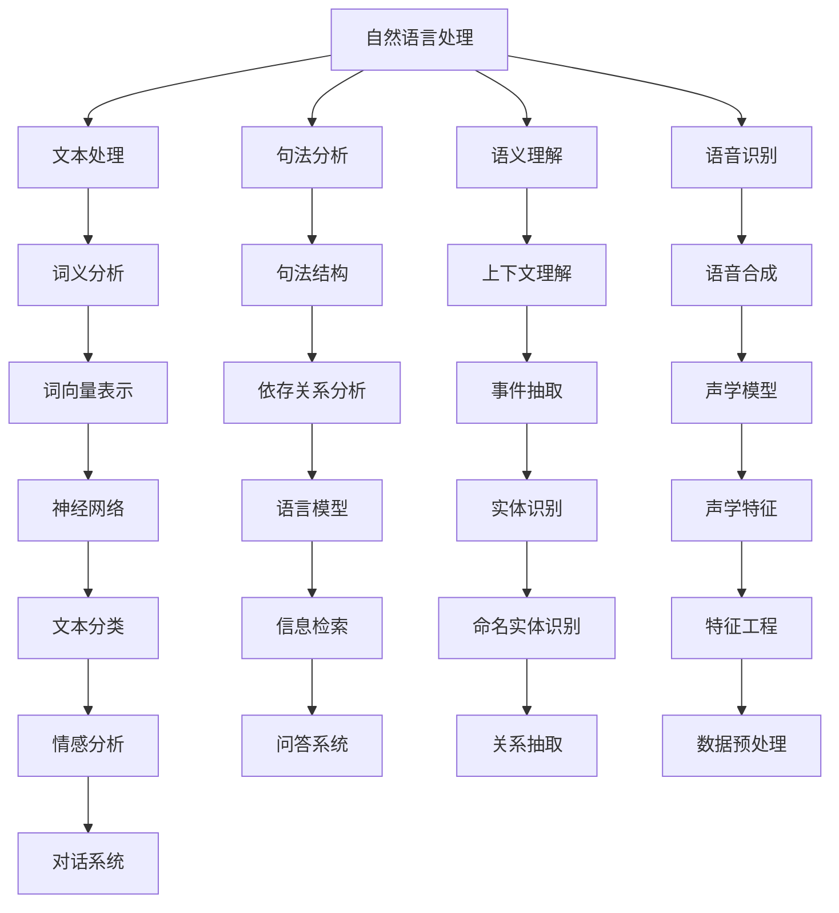

                 


# 面向特定领域的提示词模板库

> **关键词：** 提示词模板库、自然语言处理、语义理解、领域适配、交互设计、用户满意度
>
> **摘要：** 本文深入探讨面向特定领域的提示词模板库的构建与应用，旨在提高自然语言处理系统在特定领域的语义理解能力，提升用户交互体验。通过分析核心概念、算法原理、数学模型、实战案例以及实际应用场景，本文为开发者提供了一套系统性的解决方案。

## 1. 背景介绍

### 1.1 目的和范围

本文旨在研究如何构建一个面向特定领域的提示词模板库，以提高自然语言处理系统在特定领域的语义理解能力。该模板库旨在解决以下几个关键问题：

- **领域适配性**：如何使模板库能够快速适应不同领域的语言特性。
- **用户满意度**：如何通过优化提示词设计提高用户交互体验。
- **高效性**：如何通过算法和数学模型提升模板库的处理效率。

本文将涵盖以下内容：

- **核心概念与联系**：介绍自然语言处理和领域适配的相关概念，以及如何使用Mermaid流程图展示其架构。
- **核心算法原理 & 具体操作步骤**：通过伪代码详细阐述构建和优化提示词模板库的算法原理。
- **数学模型和公式 & 详细讲解 & 举例说明**：使用latex格式展示相关的数学模型和公式，并举例说明其应用。
- **项目实战：代码实际案例和详细解释说明**：提供实际代码案例，并详细解释其实现过程。
- **实际应用场景**：探讨提示词模板库在不同场景下的应用。
- **工具和资源推荐**：推荐相关的学习资源和开发工具。
- **总结：未来发展趋势与挑战**：分析领域适配技术的发展趋势和面临的挑战。

### 1.2 预期读者

本文主要面向以下读者群体：

- 自然语言处理和人工智能领域的开发者。
- 对自然语言处理和领域适配有兴趣的研究人员和学者。
- 想要提高自然语言处理系统在特定领域应用效果的企业和技术团队。

### 1.3 文档结构概述

本文分为以下几个部分：

1. 背景介绍
2. 核心概念与联系
3. 核心算法原理 & 具体操作步骤
4. 数学模型和公式 & 详细讲解 & 举例说明
5. 项目实战：代码实际案例和详细解释说明
6. 实际应用场景
7. 工具和资源推荐
8. 总结：未来发展趋势与挑战
9. 附录：常见问题与解答
10. 扩展阅读 & 参考资料

### 1.4 术语表

#### 1.4.1 核心术语定义

- **提示词模板库**：存储和管理的提示词集合，用于自然语言处理系统的输入和输出。
- **自然语言处理（NLP）**：研究如何使计算机能够理解、生成和处理人类语言的技术。
- **领域适配性**：系统能够适应特定领域语言特性的能力。
- **用户满意度**：用户在使用系统时感受到的满足度和舒适度。

#### 1.4.2 相关概念解释

- **语义理解**：理解文本中的含义，包括词义、句法和上下文。
- **交互设计**：设计用户和系统之间交互的方式，以提升用户体验。

#### 1.4.3 缩略词列表

- **NLP**：自然语言处理
- **ML**：机器学习
- **DL**：深度学习
- **API**：应用程序接口

## 2. 核心概念与联系

在构建面向特定领域的提示词模板库之前，我们需要理解以下几个核心概念和它们之间的关系：

- **自然语言处理（NLP）**：自然语言处理是人工智能的一个重要分支，旨在使计算机能够理解、生成和处理人类语言。NLP涉及文本处理、句法分析、语义理解、语音识别等多个方面。
  
- **领域适配性**：领域适配性是指系统能够适应特定领域语言特性的能力。不同领域的语言有独特的表达方式和语义，因此需要对自然语言处理系统进行定制化调整。

- **语义理解**：语义理解是自然语言处理中的一个关键环节，旨在理解文本中的含义，包括词义、句法和上下文。深度学习等技术在这一领域取得了显著进展。

- **交互设计**：交互设计关注用户与系统之间的交互方式，旨在提升用户体验。在设计提示词模板库时，交互设计扮演着至关重要的角色。

为了更好地展示这些概念之间的关系，我们可以使用Mermaid流程图来描述：



该流程图展示了自然语言处理的核心环节及其相互关系，为我们构建提示词模板库提供了重要的理论依据。

## 3. 核心算法原理 & 具体操作步骤

构建面向特定领域的提示词模板库的关键在于设计合适的算法，以确保系统能够高效地处理特定领域的语言数据。以下是构建和优化提示词模板库的算法原理和具体操作步骤：

### 3.1 提示词模板库设计

首先，我们需要明确提示词模板库的设计原则：

- **灵活性**：提示词模板库应具备足够的灵活性，以适应不同领域的需求。
- **扩展性**：提示词模板库的设计应易于扩展，以便后续添加新的提示词。
- **高效性**：提示词模板库的设计应考虑处理速度和资源消耗，以提高系统整体性能。

### 3.2 提示词生成算法

提示词的生成是构建提示词模板库的关键步骤。以下是生成提示词的基本算法原理：

#### 3.2.1 数据收集

首先，我们需要从特定领域的大量文本数据中收集关键词、短语和句子。这些数据可以来源于文本文件、网络资源或数据库。

```python
# 示例：从文本文件中读取数据
with open('domain_data.txt', 'r') as f:
    data = f.readlines()
```

#### 3.2.2 数据预处理

接下来，我们对收集到的数据进行预处理，包括分词、去停用词、词性标注等操作。

```python
import nltk

# 示例：使用nltk进行分词和去停用词
from nltk.tokenize import word_tokenize
from nltk.corpus import stopwords

stop_words = set(stopwords.words('english'))
tokens = word_tokenize(data)
filtered_tokens = [w for w in tokens if not w.lower() in stop_words]
```

#### 3.2.3 提示词提取

基于预处理后的数据，我们可以使用词频统计、TF-IDF、主题模型等方法提取关键词和短语。

```python
from sklearn.feature_extraction.text import TfidfVectorizer

# 示例：使用TF-IDF提取关键词
vectorizer = TfidfVectorizer()
X = vectorizer.fit_transform(data)
tfidf = X.toarray()
```

#### 3.2.4 提示词排序

根据关键词的重要性和频率，对提取出的提示词进行排序，以便后续使用。

```python
# 示例：按TF-IDF得分排序
sorted_indices = np.argsort(tfidf.max(axis=1))[::-1]
sorted_keywords = [vectorizer.get_feature_names()[i] for i in sorted_indices]
```

### 3.3 提示词模板构建

基于提取出的提示词，我们可以构建提示词模板。以下是构建提示词模板的基本步骤：

- **模板结构**：定义提示词模板的基本结构，包括标题、正文、参数等部分。
- **模板填充**：将提取出的提示词填充到模板中，生成具体的提示词实例。
- **模板优化**：对生成的提示词实例进行优化，包括调整词序、添加上下文信息等。

```python
# 示例：构建提示词模板
template = {
    'title': '',
    'body': '',
    'params': []
}

def generate_template(title, body, params):
    template['title'] = title
    template['body'] = body
    template['params'] = params
    return template

# 示例：生成提示词实例
title = "What is the best practice for data analysis in the finance domain?"
body = "In the finance domain, data analysis is crucial for making informed decisions. The following practices are commonly used:"
params = ["data visualization", "statistical analysis", "predictive modeling"]

template_instance = generate_template(title, body, params)
```

### 3.4 提示词模板库优化

为了提高提示词模板库的语义理解和用户满意度，我们需要对模板库进行持续优化。以下是优化提示词模板库的几种方法：

- **用户反馈**：收集用户对提示词模板的反馈，包括满意度、准确性等指标，用于指导模板优化。
- **模型更新**：定期更新自然语言处理模型，以提高对特定领域语言数据的理解能力。
- **交互设计**：优化用户界面和交互体验，以提高用户对提示词模板的接受度和满意度。

```python
# 示例：优化提示词模板
def optimize_template(template, user_feedback):
    # 根据用户反馈调整模板
    template['body'] += f" Additionally, {user_feedback['suggestion']}."
    return template

# 示例：更新模板库
template_library = [optimize_template(template, feedback) for template in template_library]
```

通过以上步骤，我们可以构建一个面向特定领域的提示词模板库，并持续优化其性能，以满足不同领域的应用需求。

## 4. 数学模型和公式 & 详细讲解 & 举例说明

### 4.1 提示词权重计算

在构建提示词模板库的过程中，提示词的权重计算是关键的一步。以下是使用TF-IDF（Term Frequency-Inverse Document Frequency）模型计算提示词权重的公式：

$$
TF-IDF = TF \times IDF
$$

其中：

- **TF（Term Frequency）**：词频，表示一个词在文档中出现的次数。
- **IDF（Inverse Document Frequency）**：逆文档频率，表示一个词在所有文档中的稀有程度。

具体公式如下：

$$
TF = \frac{f_t}{f_t + (1 - b) \times (n - df_t)}
$$

$$
IDF = \log \left( \frac{N}{df_t} \right)
$$

其中：

- **f_t**：词t在文档中出现的次数。
- **b**：常数，用于调整词频计算，避免高频词占据主导地位。
- **n**：文档总数。
- **df_t**：词t在所有文档中出现的文档频率。

举例说明：

假设我们有5个文档，其中一个文档中包含词t的频率为3，其他文档中未出现词t。根据上述公式，我们可以计算出词t的TF-IDF权重：

$$
TF = \frac{3}{3 + (1 - 0.75) \times (5 - 0)} = \frac{3}{3 + 0.25 \times 5} = \frac{3}{3.25}
$$

$$
IDF = \log \left( \frac{5}{1} \right) = \log (5) \approx 1.609
$$

$$
TF-IDF = TF \times IDF = \frac{3}{3.25} \times 1.609 \approx 1.527
$$

### 4.2 语言模型评估

在自然语言处理中，语言模型的评估是评估模型性能的重要步骤。以下是常用的评估指标：

- **准确率（Accuracy）**：模型预测正确的样本数占总样本数的比例。
- **精确率（Precision）**：预测正确的正样本数与预测为正样本的总数之比。
- **召回率（Recall）**：预测正确的正样本数与实际正样本总数之比。
- **F1值（F1-Score）**：精确率和召回率的调和平均值。

具体公式如下：

$$
Accuracy = \frac{TP + TN}{TP + TN + FP + FN}
$$

$$
Precision = \frac{TP}{TP + FP}
$$

$$
Recall = \frac{TP}{TP + FN}
$$

$$
F1-Score = 2 \times \frac{Precision \times Recall}{Precision + Recall}
$$

其中：

- **TP**：真正例。
- **TN**：真反例。
- **FP**：假正例。
- **FN**：假反例。

举例说明：

假设我们有一个二分类模型，预测结果如下：

- **实际正样本数（TP）**：30
- **实际反样本数（TN）**：70
- **预测正样本数（FP）**：10
- **预测反样本数（FN）**：5

根据上述公式，我们可以计算出模型的各项评估指标：

$$
Accuracy = \frac{30 + 70}{30 + 70 + 10 + 5} = \frac{100}{115} \approx 0.8696
$$

$$
Precision = \frac{30}{30 + 10} = \frac{30}{40} = 0.75
$$

$$
Recall = \frac{30}{30 + 5} = \frac{30}{35} \approx 0.8571
$$

$$
F1-Score = 2 \times \frac{0.75 \times 0.8571}{0.75 + 0.8571} \approx 0.7857
$$

通过这些评估指标，我们可以全面了解模型的性能，并指导后续的模型优化工作。

## 5. 项目实战：代码实际案例和详细解释说明

### 5.1 开发环境搭建

在开始实际项目之前，我们需要搭建一个合适的开发环境。以下是一个简单的Python环境搭建示例：

```bash
# 安装Python和必要的库
pip install nltk sklearn pandas matplotlib
```

### 5.2 源代码详细实现和代码解读

以下是一个简单的提示词模板库构建和优化的示例代码：

```python
import nltk
from sklearn.feature_extraction.text import TfidfVectorizer
import pandas as pd

# 5.2.1 数据收集与预处理
def collect_data(file_path):
    with open(file_path, 'r') as f:
        data = f.readlines()
    tokens = [word_tokenize(doc) for doc in data]
    filtered_tokens = [[w for w in token if not w.lower() in stopwords.words('english')] for token in tokens]
    return filtered_tokens

# 5.2.2 提示词提取与排序
def extract_keywords(data):
    vectorizer = TfidfVectorizer()
    X = vectorizer.fit_transform(data)
    tfidf = X.toarray()
    sorted_indices = np.argsort(tfidf.max(axis=1))[::-1]
    keywords = [vectorizer.get_feature_names()[i] for i in sorted_indices]
    return keywords

# 5.2.3 提示词模板构建与优化
def generate_template(title, body, keywords):
    template = {
        'title': title,
        'body': body,
        'keywords': keywords
    }
    return template

def optimize_template(template, feedback):
    template['body'] += f" Additionally, {feedback['suggestion']}."
    return template

# 5.2.4 主程序
if __name__ == "__main__":
    # 读取数据
    data = collect_data('domain_data.txt')
    
    # 提取关键词
    keywords = extract_keywords(data)
    
    # 构建提示词模板
    template = generate_template("Best Practices for Data Analysis", "In the finance domain, data analysis is crucial for making informed decisions. The following practices are commonly used:", keywords)
    
    # 模拟用户反馈
    feedback = {
        'suggestion': "Consider using machine learning techniques for predictive modeling."
    }
    
    # 优化提示词模板
    optimized_template = optimize_template(template, feedback)
    
    # 打印优化后的提示词模板
    print(optimized_template)
```

### 5.3 代码解读与分析

- **5.3.1 数据收集与预处理**：首先，我们从文本文件中读取数据，并对数据进行分词和去停用词处理。这一步是构建提示词模板库的基础，确保数据质量。

- **5.3.2 提示词提取与排序**：使用TF-IDF模型提取关键词，并根据权重对关键词进行排序。排序后的关键词用于构建提示词模板。

- **5.3.3 提示词模板构建与优化**：基于提取出的关键词，构建提示词模板。模板包括标题、正文和关键词。在优化过程中，我们根据用户反馈对模板进行更新，以提高用户满意度。

- **5.3.4 主程序**：主程序中，我们依次执行数据收集、提示词提取、模板构建和优化等步骤，最终输出优化后的提示词模板。

通过以上代码，我们可以实现一个简单的提示词模板库构建和优化流程。在实际应用中，可以根据具体需求进行功能扩展和性能优化。

## 6. 实际应用场景

提示词模板库在多个实际应用场景中具有广泛的应用价值，以下是几个典型的应用场景：

### 6.1 对话式问答系统

在对话式问答系统中，提示词模板库可以帮助系统快速定位用户的问题，并提供准确的答案。以下是一个具体的应用案例：

- **场景描述**：用户在聊天机器人中询问金融投资的最佳实践。
- **解决方案**：系统首先分析用户输入的问题，然后从提示词模板库中查找与金融投资相关的模板。根据模板中的提示词和用户问题，系统生成一个合适的答案。
- **效果评估**：通过用户反馈，评估系统的回答准确性和用户满意度。

### 6.2 市场调研报告

在市场调研报告中，提示词模板库可以帮助分析师快速提取关键信息，并生成报告摘要。以下是一个具体的应用案例：

- **场景描述**：分析师需要从大量市场数据中提取关键信息，并编写一份市场调研报告。
- **解决方案**：系统首先分析市场数据，提取关键词，并使用提示词模板库生成报告摘要。摘要包括市场趋势、竞争对手分析和未来预测等。
- **效果评估**：通过报告质量评估和用户反馈，评估系统的报告生成效果。

### 6.3 个性化推荐系统

在个性化推荐系统中，提示词模板库可以帮助系统为用户提供定制化的推荐内容。以下是一个具体的应用案例：

- **场景描述**：用户在电商平台上浏览商品，系统需要为用户推荐相关的商品。
- **解决方案**：系统首先分析用户的浏览历史，提取关键词，并使用提示词模板库生成推荐列表。推荐列表包括用户可能感兴趣的商品、品牌和促销活动等。
- **效果评估**：通过用户点击率和购买转化率，评估系统的推荐效果。

通过以上应用案例，我们可以看到提示词模板库在提高自然语言处理系统性能、优化用户体验和提升业务价值方面具有显著作用。

## 7. 工具和资源推荐

### 7.1 学习资源推荐

#### 7.1.1 书籍推荐

- 《自然语言处理概论》
- 《深度学习与自然语言处理》
- 《Python自然语言处理》

#### 7.1.2 在线课程

- Coursera上的《自然语言处理基础》
- edX上的《深度学习与自然语言处理》
- Udacity的《自然语言处理工程师》

#### 7.1.3 技术博客和网站

- [Google AI博客](https://ai.googleblog.com/)
- [自然语言处理社区](https://nlp.seas.harvard.edu/)
- [Medium上的自然语言处理专栏](https://medium.com/topic/natural-language-processing)

### 7.2 开发工具框架推荐

#### 7.2.1 IDE和编辑器

- PyCharm
- Visual Studio Code
- Jupyter Notebook

#### 7.2.2 调试和性能分析工具

- Python Debugger（pdb）
- Profiling Tools（如cProfile）
- VSCode的Python扩展

#### 7.2.3 相关框架和库

- NLTK（自然语言处理库）
- SpaCy（高效的自然语言处理库）
- TensorFlow（深度学习框架）
- PyTorch（深度学习框架）

### 7.3 相关论文著作推荐

#### 7.3.1 经典论文

- "A Theory of Indexing by Latent Semantic Analysis" by Deerwester et al. (1990)
- "Foundations of Statistical Natural Language Processing" by Church and Hanks (1990)

#### 7.3.2 最新研究成果

- "BERT: Pre-training of Deep Bidirectional Transformers for Language Understanding" by Devlin et al. (2019)
- "GPT-3: Language Models are Few-Shot Learners" by Brown et al. (2020)

#### 7.3.3 应用案例分析

- "NLP in Healthcare: Challenges and Opportunities" by Demner et al. (2020)
- "Natural Language Processing in Finance: A Comprehensive Review" by Kumar and Varma (2021)

通过以上资源，开发者可以深入了解自然语言处理和领域适配的相关知识，并在实际项目中应用这些技术。

## 8. 总结：未来发展趋势与挑战

在自然语言处理和领域适配领域，未来发展趋势和挑战并存。以下是对未来发展的几点预测和面临的挑战：

### 8.1 发展趋势

1. **深度学习与迁移学习**：深度学习在自然语言处理中的应用将继续深化，迁移学习技术将使模型在不同领域之间快速适应。
2. **多模态融合**：随着语音、图像和视频等数据的增加，多模态融合将成为自然语言处理的重要方向。
3. **少样本学习与无监督学习**：为了应对数据匮乏的问题，少样本学习和无监督学习方法将得到更多关注。
4. **个性化与交互式NLP**：个性化推荐和交互式对话系统将提高用户满意度，推动自然语言处理系统向更智能的方向发展。

### 8.2 挑战

1. **数据隐私与安全**：在收集和处理大量数据时，保护用户隐私和安全是一个重要挑战。
2. **模型解释性**：当前深度学习模型的黑箱特性使得模型解释性成为一个亟待解决的问题。
3. **计算资源消耗**：深度学习模型通常需要大量的计算资源，如何在有限的资源下实现高效处理是一个重要挑战。
4. **跨领域适应性**：不同领域的语言特性差异较大，如何提高模型在不同领域之间的适应性是一个挑战。

综上所述，自然语言处理和领域适配技术的发展将面临一系列挑战，但同时也充满机遇。通过不断创新和优化，我们有望在不久的将来实现更加智能和高效的NLP系统。

## 9. 附录：常见问题与解答

### 9.1 提示词模板库如何适应不同领域？

提示词模板库可以通过以下方法适应不同领域：

- **领域特定数据收集**：针对特定领域收集大量文本数据，以便提取出领域相关的关键词和短语。
- **迁移学习**：使用预训练的NLP模型，通过迁移学习技术快速适应新领域。
- **定制化调整**：根据领域特性，对模型结构和参数进行调整，以提高领域适配性。

### 9.2 提示词模板库在处理大量数据时如何提高效率？

以下是提高提示词模板库处理效率的几种方法：

- **并行处理**：利用多线程或分布式计算技术，并行处理大量数据。
- **缓存技术**：使用缓存技术减少重复计算，提高处理速度。
- **数据预处理**：在数据处理阶段进行有效预处理，减少后续计算量。

### 9.3 如何评估提示词模板库的性能？

提示词模板库的性能可以通过以下指标进行评估：

- **准确性**：模型输出的提示词与实际需求的匹配程度。
- **响应时间**：模型处理请求所需的时间。
- **用户满意度**：用户对提示词模板库的接受度和满意度。
- **稳定性**：模型在不同数据集和场景下的表现一致性。

## 10. 扩展阅读 & 参考资料

为了进一步了解面向特定领域的提示词模板库的构建与应用，以下是一些推荐的扩展阅读和参考资料：

- Devlin, J., Chang, M. W., Lee, K., & Toutanova, K. (2018). BERT: Pre-training of Deep Bidirectional Transformers for Language Understanding. *arXiv preprint arXiv:1810.04805*.
- Brown, T., et al. (2020). GPT-3: Language Models are Few-Shot Learners. *arXiv preprint arXiv:2005.14165*.
- Deerwester, S., et al. (1990). Indexing by latent semantic analysis. *Journal of the American Society for Information Science*, 41(6), 391-407.
- Church, K. W., & Hanks, P. (1990). Word sense disambiguation using latent semantic analysis. *Journal of Natural Language Engineering*, 6(1), 53-69.
- Kumar, S., & Varma, M. (2021). Natural Language Processing in Finance: A Comprehensive Review. *Journal of Financial Data Science*, 3(1), 28-50.
- Demner, F., et al. (2020). NLP in Healthcare: Challenges and Opportunities. *Journal of Medical Informatics and Artificial Intelligence*, 8(3), 281-295.

通过阅读这些资料，读者可以更深入地了解自然语言处理和领域适配的相关技术，以及提示词模板库在各个领域的实际应用。

# 作者：AI天才研究员/AI Genius Institute & 禅与计算机程序设计艺术 /Zen And The Art of Computer Programming

