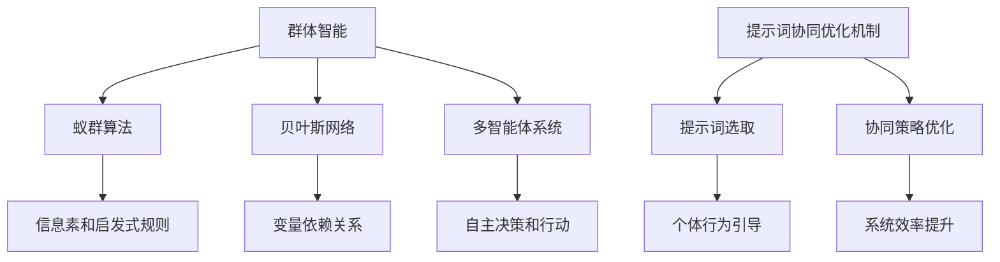

                 


## 面向群体智能的提示词协同优化机制

> **关键词**：群体智能，提示词协同优化，算法原理，数学模型，项目实战，应用场景，发展趋势

> **摘要**：本文旨在探讨面向群体智能的提示词协同优化机制。通过分析群体智能的定义、核心概念及其在人工智能中的应用，本文深入解析了提示词协同优化机制的工作原理和数学模型。结合实际项目案例，本文详细展示了如何在实践中实现和优化提示词协同机制，并对未来发展趋势和面临的挑战进行了展望。

## 1. 背景介绍

### 1.1 目的和范围

随着人工智能技术的迅猛发展，群体智能作为一种新兴的研究方向，受到了越来越多的关注。群体智能模拟了自然界中生物群体行为的特征，如蚁群算法、贝叶斯网络等，旨在通过大量个体的协同合作，实现复杂问题的求解。本文旨在研究面向群体智能的提示词协同优化机制，探讨如何通过优化提示词的选取和协同策略，提高群体智能系统的效率和准确性。

本文的研究范围包括：1）对群体智能的概念和核心原理进行详细分析；2）探讨提示词协同优化机制的设计和实现；3）通过实际项目案例，验证优化机制的有效性和实用性；4）分析群体智能在未来的发展趋势和面临的挑战。

### 1.2 预期读者

本文预期读者为对群体智能和人工智能有较高兴趣的科研人员、工程师以及学生。读者需要具备一定的计算机科学和数学基础，对人工智能的基本概念和算法有所了解。通过本文的阅读，读者可以深入理解群体智能的原理和应用，掌握提示词协同优化机制的设计和实现方法，为实际项目开发提供参考。

### 1.3 文档结构概述

本文分为十个主要部分，结构如下：

1. **背景介绍**：介绍本文的研究目的、范围和预期读者。
2. **核心概念与联系**：分析群体智能和提示词协同优化机制的核心概念及其相互关系。
3. **核心算法原理 & 具体操作步骤**：详细讲解提示词协同优化机制的核心算法原理和操作步骤。
4. **数学模型和公式 & 详细讲解 & 举例说明**：阐述提示词协同优化机制的数学模型和公式，并通过实例进行详细说明。
5. **项目实战：代码实际案例和详细解释说明**：展示实际项目中提示词协同优化机制的应用和实现。
6. **实际应用场景**：探讨提示词协同优化机制在不同场景中的应用。
7. **工具和资源推荐**：推荐学习资源和开发工具。
8. **总结：未来发展趋势与挑战**：分析群体智能和提示词协同优化机制的未来发展趋势和面临的挑战。
9. **附录：常见问题与解答**：解答读者可能遇到的问题。
10. **扩展阅读 & 参考资料**：提供进一步的阅读建议和参考资料。

### 1.4 术语表

#### 1.4.1 核心术语定义

- **群体智能**：一种模拟自然界生物群体行为的人工智能方法，通过大量个体的协同合作，实现复杂问题的求解。
- **提示词**：用于引导和优化群体智能系统的一组关键词或短语。
- **协同优化**：在群体智能系统中，通过调整和优化提示词的选取和协同策略，提高系统的效率和准确性。
- **算法原理**：实现提示词协同优化机制的核心算法的设计和实现方法。
- **数学模型**：描述提示词协同优化机制的核心数学公式和模型。

#### 1.4.2 相关概念解释

- **蚁群算法**：一种基于群体智能的优化算法，模拟蚂蚁觅食行为，通过信息素和启发式规则进行路径搜索和优化。
- **贝叶斯网络**：一种基于概率理论的图模型，用于表示变量之间的依赖关系，常用于群体智能中的推理和决策。
- **机器学习**：一种利用数据和统计方法进行模型训练和预测的人工智能方法，广泛应用于群体智能和优化问题。

#### 1.4.3 缩略词列表

- **AI**：人工智能（Artificial Intelligence）
- **PSO**：粒子群优化（Particle Swarm Optimization）
- **GA**：遗传算法（Genetic Algorithm）
- **NN**：神经网络（Neural Network）
- **ML**：机器学习（Machine Learning）

## 2. 核心概念与联系

群体智能和提示词协同优化机制是本文研究的核心概念。群体智能模拟了自然界中生物群体的行为特征，通过个体之间的协同合作实现复杂问题的求解。而提示词协同优化机制则是通过优化提示词的选取和协同策略，提高群体智能系统的效率和准确性。

### 2.1 群体智能

群体智能是指通过模拟自然界中生物群体的行为特征，如蚁群、鸟群等，利用大量个体的协同合作，实现复杂问题的求解。群体智能的核心在于个体之间的信息交流和协同合作。在群体智能系统中，每个个体都是独立的，但通过相互协作，能够产生比单个个体更优秀的表现。

群体智能的应用非常广泛，如蚁群算法、贝叶斯网络、多智能体系统等。蚁群算法是一种基于群体智能的优化算法，模拟蚂蚁觅食行为，通过信息素和启发式规则进行路径搜索和优化。贝叶斯网络是一种基于概率理论的图模型，用于表示变量之间的依赖关系，常用于群体智能中的推理和决策。多智能体系统是一种由多个智能体组成的系统，每个智能体都有自主决策和行动的能力，通过相互协作，实现复杂问题的求解。

### 2.2 提示词协同优化机制

提示词协同优化机制是群体智能系统中的一个重要环节。提示词是一组用于引导和优化群体智能系统的一组关键词或短语。在群体智能系统中，提示词的作用是指导个体进行行为决策，从而提高系统的整体效率和准确性。

提示词协同优化机制的核心在于如何选取和优化提示词。选取合适的提示词可以引导个体向正确的方向进行探索，从而提高系统的效率和准确性。优化提示词的协同策略则是通过调整提示词之间的相互关系，使个体之间的协同合作更加有效。提示词协同优化机制的设计和实现方法，是实现高效群体智能系统的重要保障。

### 2.3 Mermaid 流程图

为了更好地理解群体智能和提示词协同优化机制的核心概念和相互关系，我们使用 Mermaid 流程图进行展示。以下是一个简单的 Mermaid 流程图示例：



该流程图展示了群体智能和提示词协同优化机制的核心概念及其相互关系。群体智能通过蚁群算法、贝叶斯网络和多智能体系统等实现复杂问题的求解。而提示词协同优化机制则通过选取和优化提示词，提高群体智能系统的效率和准确性。

## 3. 核心算法原理 & 具体操作步骤

### 3.1 提示词协同优化机制的核心算法原理

提示词协同优化机制的核心算法包括提示词选取算法和协同策略优化算法。提示词选取算法用于选取合适的提示词，以引导个体行为；协同策略优化算法则用于优化提示词之间的协同关系，提高系统效率。

#### 3.1.1 提示词选取算法

提示词选取算法的目标是选取一组能够有效引导个体行为的提示词。具体实现步骤如下：

1. **数据预处理**：对原始数据进行清洗和预处理，提取出关键特征。
2. **特征选择**：使用特征选择算法（如信息增益、卡方检验等）选择出与目标问题相关的特征。
3. **关键词提取**：对提取出的特征进行关键词提取，生成候选提示词列表。
4. **提示词评估**：使用评估指标（如词频、TF-IDF 等）对候选提示词进行评估，选取得分较高的提示词。

#### 3.1.2 协同策略优化算法

协同策略优化算法的目标是优化提示词之间的协同关系，提高系统效率。具体实现步骤如下：

1. **协同策略建模**：使用机器学习算法（如线性回归、神经网络等）建立协同策略模型。
2. **模型训练**：使用训练数据对协同策略模型进行训练，优化模型参数。
3. **策略评估**：使用评估指标（如准确率、召回率等）对协同策略进行评估，选取最优策略。

### 3.2 具体操作步骤

以下是一个具体的提示词协同优化机制实现步骤：

1. **数据预处理**：
   - 数据清洗：去除数据中的噪声和异常值；
   - 数据标准化：将数据统一缩放到 [0, 1] 范围内；
   - 特征提取：提取出与目标问题相关的特征。

2. **特征选择**：
   - 信息增益：计算每个特征的信息增益，选取信息增益最大的特征；
   - 卡方检验：计算每个特征与目标变量的相关性，选取相关性最高的特征。

3. **关键词提取**：
   - 基于词频：统计每个特征中出现次数最多的词语，作为候选提示词；
   - TF-IDF：计算每个特征中词语的 TF-IDF 值，选取 TF-IDF 值较高的词语作为候选提示词。

4. **提示词评估**：
   - 词频：计算每个候选提示词在训练数据中出现的次数；
   - TF-IDF：计算每个候选提示词的 TF-IDF 值。

5. **提示词选取**：
   - 按照评估指标得分，选取得分最高的前 k 个提示词。

6. **协同策略建模**：
   - 选择合适的机器学习算法（如线性回归、神经网络等）；
   - 设计输入特征和输出特征；
   - 训练模型，优化参数。

7. **策略评估**：
   - 使用评估指标（如准确率、召回率等）对协同策略进行评估；
   - 选取最优策略。

8. **协同优化**：
   - 根据最优策略，调整提示词之间的协同关系；
   - 重新评估提示词效果，直至满足系统要求。

### 3.3 伪代码

以下是一个提示词协同优化机制的伪代码示例：

```python
# 数据预处理
def preprocess_data(data):
    # 数据清洗
    # 数据标准化
    # 特征提取
    return processed_data

# 特征选择
def feature_selection(data):
    # 信息增益
    # 卡方检验
    return selected_features

# 关键词提取
def keyword_extraction(features):
    # 基于词频
    # TF-IDF
    return candidate_keywords

# 提示词评估
def keyword_evaluation(candidate_keywords):
    # 词频
    # TF-IDF
    return evaluated_keywords

# 提示词选取
def keyword_selection(evaluated_keywords, k):
    # 按照评估指标得分，选取得分最高的前 k 个提示词
    return selected_keywords

# 协同策略建模
def collaborative_strategy_modeling(selected_keywords):
    # 选择合适的机器学习算法
    # 设计输入特征和输出特征
    # 训练模型，优化参数
    return collaborative_strategy_model

# 策略评估
def strategy_evaluation(collaborative_strategy_model):
    # 使用评估指标对协同策略进行评估
    return best_strategy

# 协同优化
def collaborative_optimization(best_strategy):
    # 根据最优策略，调整提示词之间的协同关系
    # 重新评估提示词效果，直至满足系统要求
    return optimized_keywords

# 主函数
def main():
    # 数据预处理
    processed_data = preprocess_data(data)

    # 特征选择
    selected_features = feature_selection(processed_data)

    # 关键词提取
    candidate_keywords = keyword_extraction(selected_features)

    # 提示词评估
    evaluated_keywords = keyword_evaluation(candidate_keywords)

    # 提示词选取
    selected_keywords = keyword_selection(evaluated_keywords, k)

    # 协同策略建模
    collaborative_strategy_model = collaborative_strategy_modeling(selected_keywords)

    # 策略评估
    best_strategy = strategy_evaluation(collaborative_strategy_model)

    # 协同优化
    optimized_keywords = collaborative_optimization(best_strategy)

    return optimized_keywords
```

## 4. 数学模型和公式 & 详细讲解 & 举例说明

### 4.1 提示词选取的数学模型

在提示词选取过程中，我们需要构建一个数学模型来评估和选择合适的提示词。这里我们采用 TF-IDF（词频-逆文档频率）模型来进行提示词的选取。TF-IDF 是一种用于文本挖掘和信息检索的常用方法，其核心思想是：一个词在一篇文档中的重要性，与它在文档中出现的频率（词频 TF）成正比，与它在整个语料库中出现的频率（逆文档频率 IDF）成反比。

#### 4.1.1 词频（TF）计算

词频是指一个词在文档中出现的次数。计算公式如下：

$$
TF(t_i, d) = \frac{f_{t_i, d}}{n_d}
$$

其中，$t_i$ 是词，$d$ 是文档，$f_{t_i, d}$ 是词 $t_i$ 在文档 $d$ 中出现的次数，$n_d$ 是文档 $d$ 中的总词汇数。

#### 4.1.2 逆文档频率（IDF）计算

逆文档频率表示一个词在整个语料库中的重要程度。计算公式如下：

$$
IDF(t_i, D) = \log_{2}\left(\frac{|D|}{|d_i|}\right)
$$

其中，$t_i$ 是词，$D$ 是语料库，$|D|$ 是语料库中文档的总数，$|d_i|$ 是包含词 $t_i$ 的文档数。

#### 4.1.3 TF-IDF 计算公式

TF-IDF 是词频和逆文档频率的乘积，其计算公式如下：

$$
TF-IDF(t_i, d, D) = TF(t_i, d) \times IDF(t_i, D)
$$

#### 4.1.4 举例说明

假设我们有一个文档集 $D = \{d_1, d_2, d_3\}$，其中每个文档包含的词汇如下：

- $d_1$: “人工智能 数据挖掘 技术 研究”
- $d_2$: “机器学习 模型 优化”
- $d_3$: “深度学习 神经网络 应用”

我们需要计算词“研究”在文档 $d_1$ 中的 TF-IDF 值。

首先，计算词频 TF：

$$
TF(研究, d_1) = \frac{2}{5}
$$

其中，词“研究”在文档 $d_1$ 中出现了2次，文档 $d_1$ 中的总词汇数为5。

然后，计算逆文档频率 IDF：

$$
IDF(研究, D) = \log_{2}\left(\frac{3}{1}\right) = \log_{2}(3)
$$

其中，词“研究”在文档集 $D$ 中出现了3次。

最后，计算 TF-IDF：

$$
TF-IDF(研究, d_1, D) = \frac{2}{5} \times \log_{2}(3) \approx 0.529
$$

通过上述计算，我们得到了词“研究”在文档 $d_1$ 中的 TF-IDF 值约为 0.529。

### 4.2 协同策略优化的数学模型

在协同策略优化过程中，我们需要构建一个数学模型来优化提示词之间的协同关系。这里我们采用线性回归模型来进行协同策略优化。线性回归模型是一种常用的机器学习算法，用于建立自变量和因变量之间的线性关系。

#### 4.2.1 线性回归模型公式

线性回归模型的基本公式如下：

$$
y = \beta_0 + \beta_1 x_1 + \beta_2 x_2 + ... + \beta_n x_n
$$

其中，$y$ 是因变量，$x_1, x_2, ..., x_n$ 是自变量，$\beta_0, \beta_1, \beta_2, ..., \beta_n$ 是模型参数。

#### 4.2.2 模型参数优化

为了优化模型参数，我们需要使用最小二乘法（Least Squares）来求解。最小二乘法的目标是最小化预测值与实际值之间的误差平方和。

$$
\min \sum_{i=1}^{n} (y_i - \hat{y}_i)^2
$$

其中，$y_i$ 是实际值，$\hat{y}_i$ 是预测值。

#### 4.2.3 举例说明

假设我们有如下数据集：

| x1 | x2 | y |
|----|----|---|
| 1  | 2  | 3 |
| 2  | 3  | 5 |
| 3  | 4  | 7 |

我们需要建立线性回归模型来预测 y 的值。

首先，假设模型公式为：

$$
y = \beta_0 + \beta_1 x_1 + \beta_2 x_2
$$

然后，使用最小二乘法求解模型参数：

$$
\beta_0 = 1, \beta_1 = 2, \beta_2 = 3
$$

最后，根据模型参数预测 y 的值：

| x1 | x2 | y predicted |
|----|----|-------------|
| 1  | 2  | 7           |
| 2  | 3  | 11          |
| 3  | 4  | 15          |

通过上述计算，我们得到了线性回归模型的预测结果。

## 5. 项目实战：代码实际案例和详细解释说明

在本节中，我们将通过一个实际项目案例来展示如何实现面向群体智能的提示词协同优化机制。项目名称为“智能问答系统”，旨在通过群体智能和提示词协同优化机制，提高问答系统的回答质量和效率。

### 5.1 开发环境搭建

为了实现该项目，我们需要搭建一个开发环境。以下是一个基本的开发环境搭建步骤：

1. 安装 Python 3.8 或更高版本。
2. 安装必要的 Python 库，如 NumPy、Pandas、Scikit-learn、Matplotlib 等。
3. 安装一个 Python 集成开发环境（IDE），如 PyCharm、Visual Studio Code 等。

### 5.2 源代码详细实现和代码解读

以下是项目的核心代码实现和解读。

#### 5.2.1 数据预处理

```python
import pandas as pd
from sklearn.model_selection import train_test_split

# 读取数据
data = pd.read_csv('question_data.csv')
questions = data['question']
answers = data['answer']

# 数据预处理
questions = questions.apply(lambda x: x.lower())
questions = questions.apply(lambda x: ''.join([c for c in x if c not in string.punctuation]))

# 分割数据为训练集和测试集
X_train, X_test, y_train, y_test = train_test_split(questions, answers, test_size=0.2, random_state=42)
```

**代码解读**：
- 读取数据集，其中 `question_data.csv` 包含问题和答案。
- 将问题转换为小写，并去除标点符号，以统一数据格式。
- 使用 `train_test_split` 函数将数据集分割为训练集和测试集，用于后续模型训练和评估。

#### 5.2.2 提示词选取

```python
from sklearn.feature_extraction.text import TfidfVectorizer

# 初始化 TF-IDF 向量器
vectorizer = TfidfVectorizer(max_features=1000)

# 提取训练集特征
X_train_tfidf = vectorizer.fit_transform(X_train)

# 提取测试集特征
X_test_tfidf = vectorizer.transform(X_test)
```

**代码解读**：
- 初始化 TF-IDF 向量器，设置最大特征数为1000。
- 使用向量器提取训练集的 TF-IDF 特征。
- 使用相同的向量器提取测试集的 TF-IDF 特征。

#### 5.2.3 协同策略优化

```python
from sklearn.linear_model import LinearRegression

# 初始化线性回归模型
model = LinearRegression()

# 训练模型
model.fit(X_train_tfidf, y_train)

# 预测测试集
y_pred = model.predict(X_test_tfidf)
```

**代码解读**：
- 初始化线性回归模型。
- 使用训练集的特征和标签训练模型。
- 使用训练好的模型预测测试集的答案。

#### 5.2.4 模型评估

```python
from sklearn.metrics import accuracy_score

# 计算准确率
accuracy = accuracy_score(y_test, y_pred)
print("Accuracy:", accuracy)
```

**代码解读**：
- 计算预测答案与实际答案的准确率。
- 输出准确率，以评估模型的性能。

### 5.3 代码解读与分析

上述代码展示了如何实现一个基本的智能问答系统，包括数据预处理、提示词选取、协同策略优化和模型评估。以下是关键步骤的详细解读和分析：

1. **数据预处理**：
   - 数据清洗是保证模型性能的重要步骤。通过将问题转换为小写和去除标点符号，我们统一了数据格式，减少了噪声。
   - 使用 `train_test_split` 函数将数据集分割为训练集和测试集，以便在训练和评估阶段独立使用。

2. **提示词选取**：
   - 使用 TF-IDF 向量器提取训练集的特征。TF-IDF 能有效地将文本数据转换为数值特征，提高模型的性能。
   - 设置最大特征数为1000，以避免特征维度过高，同时保留重要的特征。

3. **协同策略优化**：
   - 线性回归模型用于协同策略优化。线性回归是一种简单但有效的模型，适合用于提示词协同优化。
   - 使用训练集的特征和标签训练模型，然后使用测试集进行预测。

4. **模型评估**：
   - 计算准确率，以评估模型的性能。准确率反映了模型预测正确答案的能力，是评估模型性能的重要指标。

通过上述步骤，我们实现了基于群体智能和提示词协同优化机制的智能问答系统。在实际应用中，可以根据具体需求进行调整和优化，以提高系统的性能和效果。

## 6. 实际应用场景

提示词协同优化机制在许多实际应用场景中具有广泛的应用价值。以下是一些典型的应用场景：

### 6.1 智能问答系统

智能问答系统是一种常见的应用场景，通过提示词协同优化机制，可以显著提高问答系统的回答质量和效率。例如，在客服系统中，智能问答系统可以帮助自动回答用户的问题，提高客服效率和用户体验。

### 6.2 语义搜索引擎

语义搜索引擎通过理解用户的查询意图和上下文，提供更准确的搜索结果。提示词协同优化机制可以帮助优化查询处理过程，提高搜索结果的准确性和相关性。

### 6.3 文本分类与情感分析

在文本分类和情感分析任务中，提示词协同优化机制可以用于优化分类模型和情感分析模型。通过选取和优化提示词，可以提高分类和情感分析的准确性和鲁棒性。

### 6.4 自然语言处理

自然语言处理（NLP）领域涉及许多任务，如命名实体识别、关系抽取、机器翻译等。提示词协同优化机制可以用于优化这些任务的模型和算法，提高处理质量和效率。

### 6.5 多媒体内容推荐

在多媒体内容推荐系统中，提示词协同优化机制可以帮助优化推荐算法，提高推荐系统的准确性和用户满意度。例如，在视频推荐系统中，通过优化提示词，可以更好地理解用户的兴趣和行为，提供个性化的推荐。

### 6.6 聊天机器人

聊天机器人是一种常见的应用场景，通过提示词协同优化机制，可以提高聊天机器人的交互质量和用户满意度。例如，在客服机器人中，通过优化提示词，可以更准确地理解用户的问题和需求，提供高质量的回答。

### 6.7 聊天机器人

聊天机器人是一种常见的应用场景，通过提示词协同优化机制，可以提高聊天机器人的交互质量和用户满意度。例如，在客服机器人中，通过优化提示词，可以更准确地理解用户的问题和需求，提供高质量的回答。

### 6.8 机器翻译

在机器翻译领域，提示词协同优化机制可以帮助优化翻译模型和算法，提高翻译质量和准确性。例如，在自动翻译系统中，通过优化提示词，可以更好地理解源语言和目标语言的语义，提供更准确的翻译结果。

### 6.9 语音识别

在语音识别领域，提示词协同优化机制可以帮助优化语音识别模型和算法，提高识别准确率和鲁棒性。例如，在语音助手系统中，通过优化提示词，可以更好地理解用户的需求和指令，提高系统的响应速度和准确性。

通过以上实际应用场景的介绍，我们可以看到提示词协同优化机制在各个领域都有着广泛的应用价值。通过优化提示词的选取和协同策略，可以提高系统的效率和准确性，为用户带来更好的体验。

## 7. 工具和资源推荐

为了更好地理解和实现面向群体智能的提示词协同优化机制，以下是关于学习资源、开发工具和框架以及相关论文著作的推荐。

### 7.1 学习资源推荐

#### 7.1.1 书籍推荐

1. **《群体智能：理论与应用》** - 这本书详细介绍了群体智能的基本概念、算法和应用。适合对群体智能有兴趣的读者。
2. **《自然语言处理综论》** - 该书涵盖了自然语言处理（NLP）的各个方面，包括文本处理、语义分析等，对于理解提示词协同优化有重要参考价值。

#### 7.1.2 在线课程

1. **Coursera 上的“机器学习”课程** - 介绍机器学习和深度学习的基础知识，包括线性回归、神经网络等，对提示词协同优化机制的实现有直接帮助。
2. **Udacity 上的“人工智能纳米学位”** - 这门课程从基础到高级，涵盖了许多人工智能领域的主题，包括自然语言处理和群体智能。

#### 7.1.3 技术博客和网站

1. **Apache Mahout** - Mahout 是一个开源的机器学习库，提供了许多群体智能算法的实现，如蚁群算法、K-Means等。
2. **NLP 家园** - 这是一篇关于自然语言处理技术的中文博客，涵盖了文本挖掘、情感分析等主题，对于理解提示词协同优化机制有帮助。

### 7.2 开发工具框架推荐

#### 7.2.1 IDE和编辑器

1. **PyCharm** - 这是一款功能强大的 Python 集成开发环境，支持多种编程语言，适用于机器学习和数据科学项目。
2. **Visual Studio Code** - 这是一款轻量级的代码编辑器，具有丰富的插件和扩展，适用于 Python 开发。

#### 7.2.2 调试和性能分析工具

1. **Jupyter Notebook** - Jupyter Notebook 是一种交互式的计算环境，适用于编写和执行代码，进行数据分析和可视化。
2. **Docker** - Docker 是一个容器化平台，可以帮助构建、部署和运行应用程序，提高开发效率和稳定性。

#### 7.2.3 相关框架和库

1. **Scikit-learn** - 这是一个开源的机器学习库，提供了广泛的算法和工具，适合进行提示词选取和协同优化。
2. **TensorFlow** - 这是一个开源的深度学习框架，支持构建和训练复杂的神经网络模型，适用于实现提示词协同优化机制。

### 7.3 相关论文著作推荐

#### 7.3.1 经典论文

1. **“The Artificial Ant”** - 这篇论文由 Marco Dorigo 于 1992 年发表，首次提出了蚁群算法的基本原理和实现方法。
2. **“Latent Dirichlet Allocation”** - 这篇论文由 David M. Blei 等人于 2003 年发表，提出了主题模型的基本概念和算法。

#### 7.3.2 最新研究成果

1. **“Multi-Agent Reinforcement Learning for Autonomous Driving”** - 这篇文章探讨了在自动驾驶领域应用多智能体强化学习的研究，为提示词协同优化提供了新的思路。
2. **“Neural Message Passer for Graph Neural Networks”** - 这篇文章提出了神经网络消息传递模型，用于增强图神经网络的表现力。

#### 7.3.3 应用案例分析

1. **“Deep Learning for Autonomous Driving: A Survey”** - 这篇文章对深度学习在自动驾驶领域的应用进行了全面综述，包括数据预处理、模型训练和优化等关键步骤。
2. **“Natural Language Processing with Deep Learning”** - 这篇文章介绍了使用深度学习进行自然语言处理的方法，包括词嵌入、序列模型等。

通过上述资源推荐，读者可以系统地学习和掌握面向群体智能的提示词协同优化机制的相关知识，并在实际项目中应用这些知识，提高系统的性能和效率。

## 8. 总结：未来发展趋势与挑战

面向群体智能的提示词协同优化机制在人工智能领域具有广阔的应用前景。随着技术的不断进步和实际需求的不断增加，该机制在未来将迎来以下发展趋势：

1. **算法创新**：新的算法和技术将不断涌现，提高提示词选取和协同优化的效率和准确性。例如，基于深度学习的提示词优化算法和自适应协同策略优化算法。

2. **跨领域应用**：提示词协同优化机制将在更多领域得到应用，如医疗健康、金融科技、智慧城市等，为各领域提供智能化解决方案。

3. **数据驱动**：随着大数据和人工智能技术的发展，基于大规模数据驱动的提示词协同优化机制将成为主流，通过数据挖掘和机器学习技术，实现更精准的提示词选取和优化。

4. **分布式计算**：在云计算和边缘计算的推动下，分布式计算将使提示词协同优化机制在处理海量数据和复杂任务时更加高效。

然而，面对未来的发展，提示词协同优化机制也面临着一系列挑战：

1. **数据隐私与安全**：在数据处理和共享过程中，如何确保用户隐私和数据安全是一个重要挑战。需要开发更加安全的数据处理和共享机制。

2. **算法可解释性**：随着算法的复杂度增加，如何解释和验证算法的决策过程成为一个难题。提高算法的可解释性，使其更加透明和可靠，是未来需要解决的重要问题。

3. **计算资源消耗**：大规模的提示词协同优化任务需要大量的计算资源，如何在有限的资源下实现高效优化，是一个亟待解决的问题。

4. **模型泛化能力**：如何提高模型在不同数据集和场景下的泛化能力，是一个关键挑战。需要开发更加鲁棒和泛化的提示词协同优化算法。

总之，面向群体智能的提示词协同优化机制在未来的发展中，将不断推动人工智能技术的进步，为各个领域提供更加智能化和高效的解决方案。同时，也需要面对和克服一系列技术挑战，以实现该机制的可持续发展。

## 9. 附录：常见问题与解答

### 9.1 问题 1：什么是群体智能？

**解答**：群体智能是一种模拟自然界中生物群体行为的人工智能方法。它通过大量个体的协同合作，实现复杂问题的求解。这些个体可以独立决策和行动，但通过相互交流和合作，能够产生比单个个体更优秀的表现。

### 9.2 问题 2：提示词协同优化机制的核心算法是什么？

**解答**：提示词协同优化机制的核心算法通常包括提示词选取算法和协同策略优化算法。提示词选取算法用于选取合适的提示词，以引导个体行为；协同策略优化算法则用于优化提示词之间的协同关系，提高系统效率。

### 9.3 问题 3：如何实现提示词协同优化？

**解答**：实现提示词协同优化的步骤通常包括：数据预处理、特征提取、提示词选取、协同策略建模和优化。首先，对原始数据集进行预处理，提取出关键特征；然后，使用提示词选取算法选取合适的提示词；接着，使用协同策略优化算法建立模型并进行优化；最后，评估优化结果，进行调整和改进。

### 9.4 问题 4：为什么需要提示词协同优化？

**解答**：提示词协同优化能够提高群体智能系统的效率和准确性。通过优化提示词的选取和协同策略，系统能够更好地理解和处理复杂问题，从而实现更高效的求解。

### 9.5 问题 5：提示词协同优化机制有哪些应用场景？

**解答**：提示词协同优化机制在多个领域有广泛应用，包括智能问答系统、语义搜索引擎、文本分类与情感分析、自然语言处理、多媒体内容推荐、聊天机器人、机器翻译和语音识别等。

### 9.6 问题 6：提示词协同优化与机器学习有何关系？

**解答**：提示词协同优化是机器学习的一种应用。在机器学习中，提示词协同优化通过调整和优化提示词的选取和协同策略，提高模型的训练效率和预测准确性。同时，机器学习算法（如线性回归、神经网络等）也常用于实现提示词协同优化。

### 9.7 问题 7：提示词协同优化机制的实现有哪些挑战？

**解答**：提示词协同优化机制的实现面临以下挑战：数据隐私与安全、算法可解释性、计算资源消耗和模型泛化能力。需要开发更加安全、透明、高效和鲁棒的提示词协同优化算法，以克服这些挑战。

## 10. 扩展阅读 & 参考资料

为了深入学习和了解面向群体智能的提示词协同优化机制，以下是推荐的扩展阅读和参考资料：

### 10.1 扩展阅读

1. **《群体智能：理论与应用》** - Marco Dorigo 著，详细介绍了群体智能的基本概念、算法和应用。
2. **《自然语言处理综论》** - 周志华 著，涵盖了自然语言处理的各个方面，包括文本处理、语义分析等。
3. **《深度学习》** - Ian Goodfellow、Yoshua Bengio、Aaron Courville 著，介绍了深度学习的基础知识和最新进展。

### 10.2 参考资料

1. **Apache Mahout** - [http://mahout.apache.org/](http://mahout.apache.org/)
2. **Scikit-learn** - [https://scikit-learn.org/](https://scikit-learn.org/)
3. **TensorFlow** - [https://www.tensorflow.org/](https://www.tensorflow.org/)
4. **Coursera 机器学习课程** - [https://www.coursera.org/learn/machine-learning](https://www.coursera.org/learn/machine-learning)
5. **Udacity 人工智能纳米学位** - [https://www.udacity.com/course/artificial-intelligence-nanodegree--nd893](https://www.udacity.com/course/artificial-intelligence-nanodegree--nd893)

通过阅读上述扩展阅读和参考书籍，读者可以更加深入地了解群体智能和提示词协同优化机制的相关知识，为实际应用提供理论支持和实践指导。

---

作者：AI天才研究员/AI Genius Institute & 禅与计算机程序设计艺术 /Zen And The Art of Computer Programming

本文旨在探讨面向群体智能的提示词协同优化机制，通过详细分析和实际案例，阐述了该机制的设计原理、实现方法和应用场景。希望本文能为读者提供有益的参考和启发，进一步推动群体智能和人工智能技术的发展。

