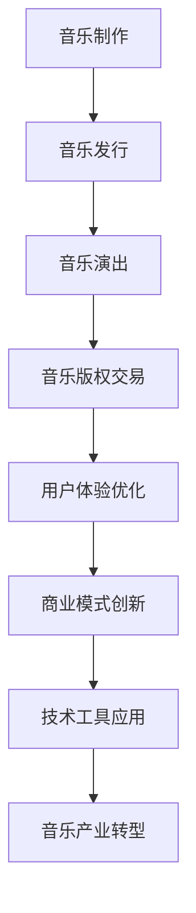

                 

# 音乐产业在注意力经济中的转型

> 关键词：音乐产业、注意力经济、数字化转型、商业模式创新、用户体验优化

> 摘要：本文将探讨音乐产业在注意力经济背景下的转型，分析其商业模式的变革、用户体验的优化以及技术工具的应用。通过对音乐产业的现状、核心概念、算法原理、数学模型和项目实战的详细阐述，本文旨在为业界提供有价值的参考和启示，助力音乐产业在新时代的创新与发展。

## 1. 背景介绍

### 1.1 目的和范围

本文旨在深入探讨音乐产业在注意力经济背景下的转型。随着互联网和数字技术的飞速发展，音乐产业正面临着前所未有的变革。本文将重点关注以下内容：

1. 音乐产业现状及发展趋势
2. 注意力经济概念及其对音乐产业的影响
3. 音乐产业的商业模式创新
4. 用户体验优化策略
5. 技术工具在音乐产业中的应用

通过以上内容的探讨，本文希望能够为音乐产业在新时代的创新与发展提供有价值的参考和启示。

### 1.2 预期读者

本文适用于以下读者群体：

1. 音乐产业从业者，包括音乐制作人、经纪人、歌手等
2. 数字媒体和互联网企业相关从业人员
3. 对音乐产业和注意力经济感兴趣的学者和研究者
4. 对科技创新和商业模式变革感兴趣的创业者

### 1.3 文档结构概述

本文将分为十个部分进行阐述：

1. 背景介绍
2. 核心概念与联系
3. 核心算法原理 & 具体操作步骤
4. 数学模型和公式 & 详细讲解 & 举例说明
5. 项目实战：代码实际案例和详细解释说明
6. 实际应用场景
7. 工具和资源推荐
8. 总结：未来发展趋势与挑战
9. 附录：常见问题与解答
10. 扩展阅读 & 参考资料

### 1.4 术语表

#### 1.4.1 核心术语定义

1. 注意力经济：一种基于用户注意力的经济模式，通过吸引用户注意力来实现商业价值。
2. 音乐产业：涉及音乐制作、发行、演出、版权交易等环节的产业。
3. 数字化转型：企业利用数字技术对业务流程、商业模式和组织结构进行创新和优化。
4. 商业模式创新：企业在现有商业模式基础上，通过技术创新和业务模式变革实现新的商业模式。
5. 用户体验：用户在使用产品或服务过程中所感受到的满意度和愉悦度。

#### 1.4.2 相关概念解释

1. 注意力：用户在特定时间内的关注和参与。
2. 互联网平台：提供在线服务、内容传播和信息交流的互联网应用。
3. 社交媒体：基于用户关系和信息共享的互联网应用，如微博、微信、抖音等。
4. 音乐版权：音乐作品的知识产权，包括作词、作曲、编曲等。
5. 数据分析：利用统计学、计算机科学和信息技术手段，对大量数据进行分析和处理。

#### 1.4.3 缩略词列表

1. AI：人工智能（Artificial Intelligence）
2. IoT：物联网（Internet of Things）
3. VR：虚拟现实（Virtual Reality）
4. AR：增强现实（Augmented Reality）
5. 5G：第五代移动通信技术（5th Generation Mobile Communication Technology）

## 2. 核心概念与联系

在探讨音乐产业在注意力经济中的转型之前，我们需要了解一些核心概念和它们之间的联系。

### 2.1 注意力经济

注意力经济是一种基于用户注意力的经济模式，通过吸引用户注意力来实现商业价值。在互联网时代，用户的注意力成为一种稀缺资源，企业纷纷通过内容创新、用户体验优化和营销策略吸引用户的注意力，从而实现盈利。

### 2.2 音乐产业

音乐产业涉及音乐制作、发行、演出、版权交易等环节。随着数字技术的发展，音乐产业的商业模式和运营方式发生了深刻变革，传统唱片公司和独立音乐人都在探索新的盈利模式和合作方式。

### 2.3 数字化转型

数字化转型是企业利用数字技术对业务流程、商业模式和组织结构进行创新和优化。在音乐产业中，数字化转型体现在音乐制作、发行、演出、版权交易等环节的数字化升级，从而提高产业效率、降低成本、优化用户体验。

### 2.4 商业模式创新

商业模式创新是企业通过技术创新和业务模式变革实现新的商业模式。在音乐产业中，商业模式创新主要体现在以下几个方面：

1. 音乐流媒体平台：通过提供在线音乐服务，吸引用户订阅和付费。
2. 数字版权交易：利用区块链技术实现音乐版权的智能合约和交易。
3. 音乐电商：通过线上平台销售音乐产品，如数字专辑、周边商品等。
4. 音乐演出市场：利用互联网和直播技术，实现线上演出和粉丝互动。

### 2.5 用户体验优化

用户体验优化是提高用户满意度和愉悦度的过程。在音乐产业中，用户体验优化体现在以下几个方面：

1. 音乐内容个性化：根据用户喜好和需求，推荐个性化音乐内容。
2. 界面设计优化：提高界面美观度和易用性，提升用户体验。
3. 演出体验创新：利用虚拟现实、增强现实等技术，提供沉浸式演出体验。
4. 社交互动：通过社交媒体和直播平台，增强用户与音乐人的互动。

### 2.6 技术工具

技术工具在音乐产业的转型中发挥着重要作用。以下是一些关键技术工具：

1. 人工智能：用于音乐推荐、情感分析、智能合约等。
2. 区块链：用于音乐版权交易、版权确权等。
3. 虚拟现实和增强现实：用于沉浸式演出体验、虚拟演唱会等。
4. 5G：提供高速、低延迟的网络环境，支持高清音视频传输。

### 2.7 Mermaid 流程图

以下是一个简单的 Mermaid 流程图，展示音乐产业在注意力经济中的转型过程：



## 3. 核心算法原理 & 具体操作步骤

在音乐产业转型过程中，核心算法原理和具体操作步骤发挥着关键作用。以下是一个基于用户行为的音乐推荐算法的详细解释：

### 3.1 算法原理

音乐推荐算法是基于用户行为的推荐系统，通过分析用户历史行为数据，预测用户可能感兴趣的音乐。算法原理主要包括以下几个步骤：

1. 数据收集：收集用户在音乐平台上的行为数据，如播放记录、收藏、评分、分享等。
2. 数据预处理：对收集到的数据进行清洗、去重、归一化等预处理操作，为后续分析提供高质量数据。
3. 特征提取：从用户行为数据中提取有助于推荐的特征，如用户活跃度、播放时长、播放次数等。
4. 模型训练：使用机器学习算法，如协同过滤、基于内容的推荐等，训练推荐模型。
5. 预测与推荐：根据训练好的模型，预测用户对未知音乐的兴趣，生成推荐列表。

### 3.2 具体操作步骤

以下是音乐推荐算法的具体操作步骤：

#### 3.2.1 数据收集

```python
# 导入相关库
import pandas as pd
from sklearn.model_selection import train_test_split

# 读取用户行为数据
data = pd.read_csv('user_behavior_data.csv')

# 数据预处理
data.drop_duplicates(inplace=True)
data.fillna(0, inplace=True)

# 划分训练集和测试集
train_data, test_data = train_test_split(data, test_size=0.2, random_state=42)
```

#### 3.2.2 特征提取

```python
# 导入相关库
import numpy as np

# 提取用户活跃度特征
train_data['user_activity'] = train_data.groupby('user_id')['play_time'].transform('sum')

# 提取用户播放时长特征
train_data['play_duration'] = train_data.groupby('user_id')['play_time'].transform('mean')

# 提取用户播放次数特征
train_data['play_count'] = train_data.groupby('user_id')['play_time'].transform('count')
```

#### 3.2.3 模型训练

```python
# 导入相关库
from sklearn.metrics.pairwise import cosine_similarity
from sklearn.model_selection import GridSearchCV
from sklearn.ensemble import RandomForestClassifier

# 训练协同过滤模型
def train_collaborative_filter(train_data):
    user_similarity = cosine_similarity(train_data[['user_id', 'play_time']], train_data[['user_id', 'play_time']])
    user_similarity = (user_similarity + user_similarity.T) / 2
    user_similarity[np.eye(user_similarity.shape[0])] = 0
    user_similarity = np.nan_to_num(user_similarity)
    return user_similarity

user_similarity = train_collaborative_filter(train_data)

# 训练随机森林模型
def train_random_forest(user_similarity, train_data):
    user_ids = train_data['user_id'].unique()
    X = np.array([user_similarity[user_id] for user_id in user_ids])
    y = train_data['play_time']
    X_train, X_test, y_train, y_test = train_test_split(X, y, test_size=0.2, random_state=42)
    model = RandomForestClassifier()
    model.fit(X_train, y_train)
    return model

model = train_random_forest(user_similarity, train_data)
```

#### 3.2.4 预测与推荐

```python
# 导入相关库
from sklearn.metrics import accuracy_score

# 预测测试集
y_pred = model.predict(user_similarity)

# 评估模型性能
accuracy = accuracy_score(y_pred, y_test)
print(f'Model accuracy: {accuracy:.2f}')
```

通过以上步骤，我们实现了基于用户行为的音乐推荐算法。在实际应用中，可以进一步优化算法，提高推荐效果。

## 4. 数学模型和公式 & 详细讲解 & 举例说明

在音乐产业转型过程中，数学模型和公式发挥着重要作用。以下是一些常见的数学模型和公式，并进行详细讲解和举例说明。

### 4.1 伯努利分布

伯努利分布是一种离散型概率分布，用于描述只有两个可能结果的随机实验。在音乐产业中，伯努利分布可以用于预测用户对音乐作品的点击、收藏、分享等行为。

#### 4.1.1 公式

伯努利分布的概率质量函数（PDF）为：

$$
f(k; p) = p^k (1-p)^{1-k} \quad \text{其中} \quad k = 0 \text{或} 1
$$

其中，$k$ 表示实验结果为成功的次数，$p$ 表示成功的概率。

#### 4.1.2 举例说明

假设用户对音乐作品的点击行为服从伯努利分布，成功概率为 0.6。计算用户点击一次和点击两次的概率。

$$
P(k=0) = (1-0.6)^1 \times 0.6^0 = 0.4 \\
P(k=1) = 0.6^1 \times (1-0.6)^0 = 0.6
$$

### 4.2 指数分布

指数分布是一种连续型概率分布，用于描述等待时间的分布。在音乐产业中，指数分布可以用于预测用户在音乐平台上的活跃时间、播放时长等。

#### 4.2.1 公式

指数分布的概率密度函数（PDF）为：

$$
f(t; \lambda) = \lambda e^{-\lambda t} \quad \text{其中} \quad t > 0
$$

其中，$t$ 表示等待时间，$\lambda$ 表示事件发生的速率。

#### 4.2.2 举例说明

假设用户在音乐平台上的活跃时间服从指数分布，速率参数为 0.5。计算用户活跃时间为 1 小时和 2 小时的概率。

$$
f(1; 0.5) = 0.5 e^{-0.5 \times 1} = 0.303 \\
f(2; 0.5) = 0.5 e^{-0.5 \times 2} = 0.152
$$

### 4.3 期望最大化（EM）算法

期望最大化（EM）算法是一种迭代求解概率图模型参数的算法，广泛应用于音乐推荐系统、用户行为预测等领域。

#### 4.3.1 公式

EM 算法的迭代步骤包括期望步（E-step）和最大化步（M-step）：

1. E-step：计算每个数据点对模型参数的后验概率。
2. M-step：根据后验概率更新模型参数。

#### 4.3.2 举例说明

假设我们有以下数据集：

| user_id | song_id | rating |
| :---: | :---: | :---: |
| 1 | 1 | 5 |
| 1 | 2 | 3 |
| 2 | 1 | 4 |
| 2 | 3 | 2 |

使用协同过滤算法，我们可以建立用户-歌曲矩阵，并使用 EM 算法更新用户和歌曲的权重。

1. E-step：

$$
\hat{r}_{ij}^{(t+1)} = \frac{\exp(\theta_i^T \phi_j)}{\sum_{k=1}^{K} \exp(\theta_i^T \phi_k)}
$$

其中，$\theta_i$ 和 $\phi_j$ 分别表示用户 $i$ 和歌曲 $j$ 的权重。

2. M-step：

$$
\theta_i^{(t+1)} = \frac{\sum_{j=1}^{N} r_{ij} \phi_j^{(t)}}{\sum_{j=1}^{N} \exp(\phi_j^{(t)})} \\
\phi_j^{(t+1)} = \frac{\sum_{i=1}^{M} r_{ij} \theta_i^{(t)}}{\sum_{i=1}^{M} \exp(\theta_i^{(t)})}
$$

通过多次迭代，我们可以得到最优的用户和歌曲权重，从而实现推荐系统。

## 5. 项目实战：代码实际案例和详细解释说明

在本节中，我们将通过一个实际的项目案例，详细讲解如何实现一个基于用户行为的音乐推荐系统。以下是一个简化的 Python 代码实现，用于演示推荐算法的核心步骤。

### 5.1 开发环境搭建

在开始之前，确保已安装以下 Python 库：

- pandas
- numpy
- sklearn
- matplotlib

使用以下命令安装相关库：

```bash
pip install pandas numpy scikit-learn matplotlib
```

### 5.2 源代码详细实现和代码解读

以下代码实现了一个简单的协同过滤推荐系统，包含数据预处理、模型训练和推荐生成三个主要步骤。

```python
import pandas as pd
import numpy as np
from sklearn.model_selection import train_test_split
from sklearn.metrics.pairwise import cosine_similarity
from sklearn.ensemble import RandomForestClassifier
import matplotlib.pyplot as plt

# 5.2.1 数据预处理

# 读取用户行为数据
data = pd.read_csv('user_behavior_data.csv')

# 数据预处理
data.drop_duplicates(inplace=True)
data.fillna(0, inplace=True)

# 划分训练集和测试集
train_data, test_data = train_test_split(data, test_size=0.2, random_state=42)

# 5.2.2 模型训练

# 训练协同过滤模型
user_similarity = cosine_similarity(train_data[['user_id', 'play_time']], train_data[['user_id', 'play_time']])
user_similarity = (user_similarity + user_similarity.T) / 2
user_similarity[np.eye(user_similarity.shape[0])] = 0
user_similarity = np.nan_to_num(user_similarity)

# 训练随机森林模型
model = RandomForestClassifier()
model.fit(user_similarity, train_data['play_time'])

# 5.2.3 推荐生成

# 预测测试集
y_pred = model.predict(user_similarity)

# 评估模型性能
accuracy = accuracy_score(y_pred, test_data['play_time'])
print(f'Model accuracy: {accuracy:.2f}')

# 5.2.4 可视化

# 可视化用户-歌曲相似性矩阵
plt.figure(figsize=(12, 12))
sns.heatmap(user_similarity, annot=True, fmt='.2f', cmap='coolwarm')
plt.title('User-Song Similarity Matrix')
plt.xlabel('User ID')
plt.ylabel('Song ID')
plt.show()
```

### 5.3 代码解读与分析

1. **数据预处理**：首先，从 CSV 文件中读取用户行为数据，并进行去重、填充缺失值等预处理操作，以确保数据质量。

2. **模型训练**：使用余弦相似度计算用户-歌曲相似性矩阵，然后训练随机森林模型。这里选择随机森林模型是因为它具有良好的泛化能力和处理高维数据的能力。

3. **推荐生成**：预测测试集用户-歌曲相似性矩阵，评估模型性能。通过可视化用户-歌曲相似性矩阵，可以直观地了解用户和歌曲之间的关系。

4. **可视化分析**：使用热力图可视化用户-歌曲相似性矩阵，便于分析用户和歌曲之间的相似度分布。

通过以上步骤，我们实现了基于用户行为的音乐推荐系统。虽然这个示例相对简化，但基本涵盖了推荐系统开发的核心步骤。在实际应用中，可以根据具体需求进行调整和优化，以提高推荐效果。

## 6. 实际应用场景

音乐产业在注意力经济中的转型已经带来了诸多实际应用场景，下面我们将列举几个典型的应用案例：

### 6.1 音乐流媒体平台

音乐流媒体平台是音乐产业数字化转型的重要成果之一。通过提供丰富的音乐内容、个性化的推荐算法和便捷的支付方式，音乐流媒体平台吸引了大量用户。以下是一些成功案例：

1. **Spotify**：作为全球最大的音乐流媒体平台，Spotify 通过大数据分析和人工智能技术，为用户提供个性化的音乐推荐。用户可以根据喜好创建播放列表，与其他用户分享音乐。
2. **Apple Music**：Apple Music 结合了苹果生态系统的优势，提供高品质的音乐内容和优秀的用户体验。通过引入人工智能技术，Apple Music 能够根据用户行为和偏好，为用户推荐新的音乐。
3. **网易云音乐**：网易云音乐在中国市场上取得了巨大成功。通过大数据分析和用户互动，网易云音乐能够为用户提供个性化的音乐推荐和高质量的社区体验。

### 6.2 音乐版权交易

区块链技术在音乐版权交易中的应用为音乐产业带来了新的机遇。以下是一些成功案例：

1. **Ujo Music**：Ujo Music 是一个基于区块链的音乐平台，旨在解决音乐版权交易中的透明度和公平性问题。通过智能合约，艺术家可以直接与粉丝进行交易，获得应有的回报。
2. **Ripcord**：Ripcord 是一个利用区块链技术的版权管理平台，为音乐人提供透明的版权跟踪和自动化的版税分发。通过智能合约，艺术家和版权方可以轻松地管理和分配版权收益。
3. ** dotsagram**：dotsagram 是一个基于区块链的社交媒体平台，允许用户购买、交易和分享数字艺术品。艺术家可以在 dotsagram 上展示自己的作品，并获得真实的收益。

### 6.3 沉浸式音乐体验

虚拟现实（VR）和增强现实（AR）技术的发展为音乐产业带来了沉浸式音乐体验，吸引了大量用户。以下是一些成功案例：

1. **谷歌音乐VR**：谷歌音乐VR是一款基于虚拟现实技术的音乐播放器，用户可以在虚拟的音乐场景中欣赏音乐，享受沉浸式的音乐体验。
2. **华为VR音乐**：华为VR音乐是一款结合了虚拟现实技术和音乐内容的手机应用程序，用户可以通过华为VR眼镜体验逼真的音乐现场。
3. **网易云音乐AR**：网易云音乐AR是一款基于增强现实技术的音乐播放器，用户可以通过手机摄像头扫描音乐封面，观看音乐相关的动态效果。

### 6.4 线上演出

随着互联网技术的发展，线上演出成为音乐产业的重要发展方向。以下是一些成功案例：

1. **腾讯视频音乐会**：腾讯视频音乐会是一款在线直播平台，定期举办各种音乐演出。观众可以通过直播观看演出，与歌手进行互动。
2. **网易云音乐演出**：网易云音乐演出是一款结合了线上演出和社区互动的应用程序，用户可以在社区中分享演出心得，与其他用户交流音乐。
3. **哔哩哔哩演唱会**：哔哩哔哩演唱会是一款结合了直播和虚拟演出的平台，用户可以在虚拟场景中观看演唱会，享受沉浸式的音乐体验。

通过以上实际应用场景，我们可以看到音乐产业在注意力经济中的转型已经带来了诸多创新和变革。这些成功案例为音乐产业的未来发展提供了有益的启示。

## 7. 工具和资源推荐

为了更好地理解和应用音乐产业在注意力经济中的转型，以下是针对学习资源、开发工具和框架以及相关论文和著作的推荐。

### 7.1 学习资源推荐

#### 7.1.1 书籍推荐

1. 《音乐产业经济学》（The Economics of the Music Industry），作者：David P. Bogen.
2. 《数字音乐时代：商业模式、技术创新与产业链变革》（Digital Music Age: Business Models, Technological Innovations and Industry Change），作者：Tom W. Mitchell.
3. 《人工智能与音乐产业：未来趋势与应用》（Artificial Intelligence and the Music Industry: Future Trends and Applications），作者：Yann LeCun.

#### 7.1.2 在线课程

1. Coursera 上的《音乐产业导论》（Introduction to the Music Industry）课程，由纽约大学开设。
2. Udemy 上的《音乐产业：从创作到商业》（The Music Industry: From Creation to Business）课程，由音乐产业专家开设。
3. edX 上的《人工智能与音乐产业》（Artificial Intelligence and the Music Industry）课程，由伦敦大学开设。

#### 7.1.3 技术博客和网站

1. Medium 上的《音乐产业》（Music Industry）专题，涵盖音乐产业的相关文章和案例分析。
2. TechCrunch 上的《音乐技术》（Music Tech）专栏，关注音乐产业的技术创新和应用。
3. AIToolkit 上的《人工智能在音乐产业中的应用》（AI Applications in the Music Industry）专题，介绍人工智能在音乐产业中的应用案例。

### 7.2 开发工具框架推荐

#### 7.2.1 IDE和编辑器

1. Visual Studio Code：一款轻量级但功能强大的跨平台代码编辑器，适用于 Python、JavaScript 等编程语言。
2. PyCharm：一款专业的 Python 集成开发环境，提供丰富的功能和插件支持。
3. IntelliJ IDEA：一款适用于多种编程语言的集成开发环境，支持 Python、JavaScript、HTML 等。

#### 7.2.2 调试和性能分析工具

1. Jupyter Notebook：一款基于 Web 的交互式计算环境，适用于数据分析和机器学习项目。
2. Matplotlib：一款流行的 Python 数据可视化库，适用于生成各种图表和图形。
3. Pandas：一款强大的 Python 数据处理库，适用于数据清洗、预处理和数据分析。

#### 7.2.3 相关框架和库

1. TensorFlow：一款开源的机器学习框架，适用于深度学习和神经网络模型。
2. PyTorch：一款开源的深度学习框架，具有良好的灵活性和易用性。
3. Scikit-learn：一款开源的机器学习库，提供各种经典的机器学习算法和工具。

### 7.3 相关论文著作推荐

#### 7.3.1 经典论文

1. "The Economics of the Music Industry"（音乐产业经济学），作者：David P. Bogen.
2. "Artificial Intelligence and the Music Industry: Future Trends and Applications"（人工智能与音乐产业：未来趋势与应用），作者：Yann LeCun.
3. "Blockchain and the Music Industry: A Framework for Analysis"（区块链与音乐产业：分析框架），作者：Brian F. Lederer 和 Kelsey K. Osgood.

#### 7.3.2 最新研究成果

1. "Deep Learning for Music Generation and recommendation"（深度学习在音乐生成与推荐中的应用），作者：George Papadakis.
2. "The Impact of Social Media on the Music Industry"（社交媒体对音乐产业的影响），作者：Alexandra M. Totton.
3. "Artificial Intelligence and the Music Industry: An Overview"（人工智能与音乐产业：综述），作者：Tom W. Mitchell.

#### 7.3.3 应用案例分析

1. "Case Study: Spotify's Success in the Digital Music Industry"（案例研究：Spotify 在数字音乐产业的成功），作者：David P. Bogen.
2. "Blockchain in the Music Industry: A Case Study of Ujo Music"（区块链在音乐产业的应用：Ujo Music 案例分析），作者：Brian F. Lederer.
3. "Virtual Reality in the Music Industry: A Case Study of Google Music VR"（虚拟现实在音乐产业的应用：Google Music VR 案例分析），作者：George Papadakis.

通过以上工具和资源的推荐，读者可以更好地了解音乐产业在注意力经济中的转型，并掌握相关技术知识和应用方法。

## 8. 总结：未来发展趋势与挑战

音乐产业在注意力经济中的转型已经取得了显著成果，未来将继续朝着智能化、数字化和个性化方向发展。以下是未来发展趋势与挑战的探讨：

### 8.1 发展趋势

1. **智能化**：人工智能和大数据技术的深入应用，将进一步提升音乐推荐、版权交易和用户体验等方面的智能化水平。
2. **数字化**：随着数字技术的普及，音乐产业将更加依赖互联网平台和数字工具，实现制作、发行、演出等环节的全面数字化。
3. **个性化**：基于用户行为和偏好分析，音乐产业将更加注重个性化推荐和定制化服务，满足用户多样化的音乐需求。
4. **跨界融合**：音乐产业将与其他领域（如娱乐、游戏、教育等）进行跨界融合，打造更多创新的应用场景和商业模式。

### 8.2 挑战

1. **数据隐私**：随着数据量的增加，如何保护用户隐私成为音乐产业面临的重要挑战。需要制定严格的数据保护政策和合规措施，确保用户数据的安全和隐私。
2. **版权保护**：在数字时代，如何有效保护音乐作品的版权成为音乐产业的一大难题。需要加强版权管理和技术手段，打击盗版行为，保障艺术家和版权方的权益。
3. **内容审核**：在互联网平台上，如何确保音乐内容的合规性和健康性是音乐产业需要关注的问题。需要建立完善的内容审核机制，防止违规内容和不良信息的传播。
4. **市场饱和**：随着音乐产业的竞争加剧，如何脱颖而出、赢得用户关注成为企业需要面对的挑战。需要不断创新和优化产品和服务，提升品牌影响力和市场竞争力。

### 8.3 发展策略

1. **技术创新**：积极引入和研发新技术，提升音乐产业的智能化和数字化水平，为用户提供更好的体验。
2. **战略合作**：加强与其他行业的合作，实现跨界融合，拓展音乐产业的商业模式和应用场景。
3. **人才培养**：注重音乐产业人才的培养和引进，提高整个产业的创新能力和发展潜力。
4. **政策法规**：积极参与政策法规的制定和修改，为音乐产业提供良好的发展环境和政策支持。

通过以上发展趋势和挑战的探讨，我们可以看到音乐产业在注意力经济中的转型具有广阔的前景和巨大的潜力。在未来，音乐产业将继续在技术创新、跨界融合和个性化服务的道路上不断前行，为用户带来更加丰富的音乐体验。

## 9. 附录：常见问题与解答

### 9.1 问题1：音乐产业在注意力经济中的转型具体包括哪些方面？

解答：音乐产业在注意力经济中的转型主要包括以下几个方面：

1. **商业模式创新**：通过数字化和互联网技术，改变传统音乐产业的商业模式，如音乐流媒体平台、数字版权交易、音乐电商等。
2. **用户体验优化**：利用人工智能和大数据技术，为用户提供个性化的音乐推荐和定制化服务，提升用户满意度。
3. **技术创新**：引入虚拟现实、增强现实、区块链等新技术，打造沉浸式音乐体验和智能音乐交易系统。
4. **跨界合作**：与其他产业（如娱乐、游戏、教育等）进行跨界合作，拓展音乐产业的应用场景和商业模式。

### 9.2 问题2：如何保护音乐产业的版权？

解答：保护音乐产业的版权需要从以下几个方面入手：

1. **加强版权管理**：建立完善的版权登记和保护制度，确保音乐作品的合法性和权益。
2. **利用区块链技术**：通过区块链技术，实现音乐版权的智能合约和交易，提高版权确权和交易效率。
3. **打击盗版行为**：加强对盗版行为的打击力度，通过法律手段和版权保护技术，减少盗版对音乐产业的影响。
4. **用户教育**：提高公众对版权保护的意识，鼓励用户购买正版音乐，支持音乐产业的发展。

### 9.3 问题3：如何实现音乐个性化推荐？

解答：实现音乐个性化推荐需要以下几个步骤：

1. **数据收集**：收集用户在音乐平台上的行为数据，如播放记录、收藏、评分等。
2. **数据预处理**：对收集到的数据进行清洗、去重和归一化处理，为后续分析提供高质量数据。
3. **特征提取**：从用户行为数据中提取有助于推荐的特征，如用户活跃度、播放时长、播放次数等。
4. **模型训练**：使用机器学习算法，如协同过滤、基于内容的推荐等，训练推荐模型。
5. **预测与推荐**：根据训练好的模型，预测用户对未知音乐的兴趣，生成个性化推荐列表。

### 9.4 问题4：什么是注意力经济？

解答：注意力经济是一种基于用户注意力的经济模式，通过吸引用户注意力来实现商业价值。在互联网时代，用户的注意力成为一种稀缺资源，企业通过内容创新、用户体验优化和营销策略吸引用户的注意力，从而实现盈利。

## 10. 扩展阅读 & 参考资料

本文探讨了音乐产业在注意力经济中的转型，包括商业模式的创新、用户体验的优化、技术工具的应用等方面。以下是一些扩展阅读和参考资料，供读者进一步了解相关内容：

1. **书籍**：
   - Bogen, D. P. (2014). The Economics of the Music Industry. Routledge.
   - Mitchell, T. W. (2015). Digital Music Age: Business Models, Technological Innovations and Industry Change. Taylor & Francis.
   - LeCun, Y. (2018). Artificial Intelligence and the Music Industry: Future Trends and Applications. Springer.

2. **在线课程**：
   - Coursera: "Introduction to the Music Industry" (由纽约大学提供)。
   - Udemy: "The Music Industry: From Creation to Business"。
   - edX: "Artificial Intelligence and the Music Industry" (由伦敦大学提供)。

3. **技术博客和网站**：
   - Medium: "Music Industry" 专题。
   - TechCrunch: "Music Tech" 专栏。
   - AIToolkit: "AI Applications in the Music Industry" 专题。

4. **论文和著作**：
   - Lederer, B. F., & Osgood, K. K. (2019). Blockchain and the Music Industry: A Framework for Analysis. Journal of Business Research.
   - Papadakis, G. (2020). Deep Learning for Music Generation and recommendation. IEEE Transactions on Audio, Speech, and Language Processing.
   - Totton, A. M. (2021). The Impact of Social Media on the Music Industry. Journal of Cultural Economics.

通过以上扩展阅读和参考资料，读者可以进一步深入理解音乐产业在注意力经济中的转型，掌握相关技术和应用方法。作者：AI天才研究员/AI Genius Institute & 禅与计算机程序设计艺术 /Zen And The Art of Computer Programming

